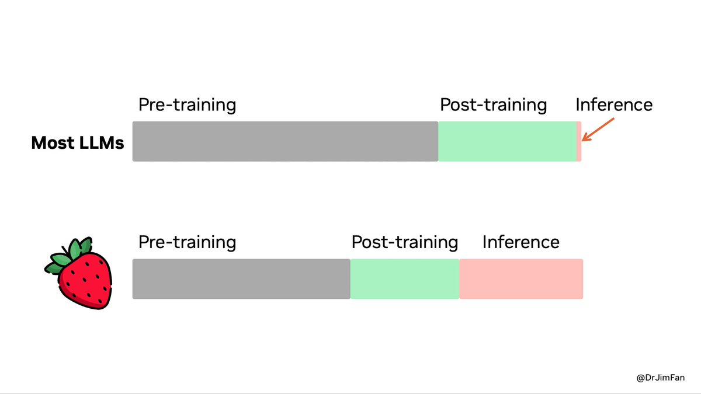

*On [Episode 33 of The Retort](https://retortai.com/episodes/claude-needs-a-constitutional-convention), we discussed the Reflection 70b drama and more motivations for model specs and transparency.*

------------------------------------------------------------------------

OpenAI released their new reasoning system, [o1](https://openai.com/o1/), building on the early successes of [Q\*](https://www.interconnects.ai/p/q-star) and more recently the rumors of [Strawberry](https://www.interconnects.ai/p/openai-strawberry-and-inference-scaling-laws), to ship a new mode of interacting with AI on challenging tasks. o1 is a system designed by training new models on long reasoning chains, with lots of reinforcement learning 🍒, and deploying them at scale. Unlike traditional autoregressive language models, it is doing an online search for the user. It is spending more on inference, which confirms the existence of new scaling laws --- **inference scaling laws**.

The release is far from a coherent product. o1 is a prototype. o1 is a vague name ("o for OpenAI"). o1 does not have the clarity of product-market fit that ChatGPT did. o1 is extremely powerful. o1 is different. o1 is a preview of the future of AI. AI's march forward of progress technically has continued. Its capability overhang has deepened, but in a way that lowers the risk of a market correction.

OpenAI has released a substantial amount of information on these systems[1](#footnote-1){#footnote-anchor-1 .footnote-anchor component-name="FootnoteAnchorToDOM" target="_self"}. They released a [blog post on the training method](https://openai.com/index/learning-to-reason-with-llms/), a [blog post for the o1 preview model](https://openai.com/index/introducing-openai-o1-preview/), a [blog post for the o1 mini model](https://openai.com/index/openai-o1-mini-advancing-cost-efficient-reasoning/), a system card on safety testing, and [documentation for using this model](https://platform.openai.com/docs/guides/reasoning) and future reasoning models. They also gave preview testing to prominent AI community members, so plenty of [transparent takes on where it works and where it doesn't are available](https://www.oneusefulthing.org/p/something-new-on-openais-strawberry).

The most important part of the release messaging is OpenAI telling us that they don't fully know how to use the model. It is a preview system with a vague name to let users help them define it. Here's how the lead of applied research at OpenAI, [Boris Power, described it](https://x.com/borismpower/status/1834353404082303100?s=46):

> This release is much closer to the original GPT-3 release than the ChatGPT release. A new paradigm, which some will done incredibly valuable for things even we at OpenAI can't predict.
>
> But it's not a mass product that just works and unlocks new value for everyone effortlessly.
>
> I'm confident we will have another ChatGPT moment soon!

### From Q\* to Strawberry to o1

We've seen this release coming from quite far away. Last November, the [first leak occurred](https://www.reuters.com/technology/sam-altmans-ouster-openai-was-precipitated-by-letter-board-about-ai-breakthrough-2023-11-22/) within OpenAI's tumultuous leadership shakeup, saying "Given vast computing resources, the new model was able to solve certain mathematical problems." Since then, OpenAI has been figuring out how to make this stable and package the results. In my mind, [Q\* was the original method](https://www.interconnects.ai/p/q-star) for eliciting very high-value trajectories with some sort of tree-of-reasoning search. The leaks were prompted by how excited researchers were to get the first hints of training out of it. They saw it was possible.

This is part of the training process for getting something like [Strawberry](https://www.interconnects.ai/p/openai-strawberry-and-inference-scaling-laws) --- a model trained with Q\* that can reason as it generates text. A model like this is needed to deploy the full o1 system. When referring to o1, it is best to refer to it as a system. There's a chance all the operations are funneled through one advanced language model, but the funneling and recycling of those computations in a way that creates coherent outputs for the user is very complex. This looks far closer to closed-loop control than anything we have seen in the language modeling space ever.

Scaling this system must've been a substantial endeavor. o1 is still a preview. If previous RL breakthroughs are any indication, such as AlphaGo and the downstream applications, OpenAI now has many angles they can take o1. o1 is the core reasoning engine that can be honed, explored, and extracted for a large suite of future products.

The success of reinforcement learning here is a big deal. It's easy to gloss over it in these somewhat generic paragraphs --- breaking down how it works will make the achievement more impressive.

> Our large-scale reinforcement learning algorithm teaches the model how to think productively using its chain of thought in a highly data-efficient training process. We have found that the performance of o1 consistently improves with more reinforcement learning (train-time compute) and with more time spent thinking (test-time compute). The constraints on scaling this approach differ substantially from those of LLM pretraining, and we are continuing to investigate them.

This yielded what will be a landmark figure in the history of AI. Inference spend is now warranted (just a few weeks I went on the record to say we should spend more on inference).

The released models are not the top-performing models in the released benchmark scores and plots --- they're in the middle. Starting with the plot that shows where the o1 preview is relative to the full o1 model.

This means that for these benchmarks, the model that we are using is somewhere in between GPT4o and the o1 improvement. o1 scores are mixed on other benchmarks, such as being [similar to Claude 3.5 sonnet on ARC-AGI](https://x.com/arcprize/status/1834703303621710077?s=46) and the [aider coding challenges](https://aider.chat/2024/09/12/o1.html). For some things it is wonderful and for others, it feels lost. OpenAI shares more evaluations with the full o1 system (not preview).

With these AIME scores, we can match this to the earlier log-training log-inference performance plot, showing that the o1 preview is a substantially scaled-down version of the full o1 system.

This comes down to normal release considerations for OpenAI, or multiple of them.

-   They could not afford to serve the "strongest" configuration to the user.

-   They do not have the infrastructure to deploy the final configuration.

-   The final configuration isn't safe enough for their standards.

And other similar things. Whether or not this is a rushed release for strategic reasons, it is a paradigm-shifting AI model. Jim Fan [summarized](https://x.com/DrJimFan/status/1834279865933332752) how compute expenditures are changing for the next generation of AI systems. This is a soft segue into real language model agents.

This approach is not good for every query. Eventually, ChatGPT will absorb o1 and route your queries to the right model. Simple queries burn a lot of excess tokens in this system, such as below, which is 225 tokens. A normal model should solve this in 10 to 12 tokens, ten times fewer.

## Training o1 with reinforcement learning

OpenAI's o1 is the first product that is searching over text in a large-scale deployment. This is a major breakthrough and will transform the deployment stacks and expectations for AI products. o1 is a useful demo to bridge the gap from existing language models to a world of different agentic products.

o1 is definitely trained with an RL-based "search" algorithm, but it is not exactly clear how it is served to users --- i.e. if it uses multiple models at test time. In the developer AMA, an OpenAI representative said that o1 is a "model" and "not a system," but this may not tell the whole story.

Language models can handle extremely complex contexts and modern serving infrastructure is well suited to forward-only generation (no backtracking) by caching the previous steps of the output in context. When you read the few traces OpenAI provided, they're rambling and wandering forward to an answer. Editing the cache via backtracking would actually be harder to serve at scale.

Most RL expertise has been developed in domains where turns cannot be undone, such as competitive games, so the forward-only domain maps more nicely to an agent-environment framework. The states and actions are muddled together, where actions are newly generated tokens which immediately are appended to the long state context. Wrangling with these messy trajectories is a large part of the magic of o1.

Let's formulate the reward for this RL problem. The classic problem with traditional reinforcement learning from human preferences is that one reward, in the form of a binary preference, is assigned to the whole trajectory. In this, it is hard to train the model to understand where it went wrong along the way. Recent research to get around this is by designing reward models that score every step in reasoning.

The best examples of per-step reward models (process reward models) rating each step in a reasoning tree are from OpenAI's *[Let's Verify Step By Step](https://arxiv.org/abs/2305.20050)* paper. The illustration below shows that the steps in green are high rewards and those in red are low rewards.

If you combine this with an outcome-based reward model or heuristic that tells the system it got the answer right (and probably a length penalty, so it doesn't generate non-answers forever to avoid a negative return), the system will have a per reasoning step reward assigning credit towards a final answer. In the example above, reasoning steps could be regenerated from step 9, the first erroneous label, and then the RL agent has multiple similar trajectories to differentiate between based on a difference in reward.

To learn with RL, the trajectories only need to get reward labels after generation. The model\'s behavior likely began very similar to that of GPT-4o and slowly explored new state spaces as it was rewarded to solve more challenging problems. Compared to traditional RLHF, full-state RL on language models will be more dependant on exploration and finding new reasoning steps. Without this, o1 could not continue to substantially improve its performance with more training time compute. More RL levels off, or even overfits and crashes, without sufficient exploration across a variety of states.

Nothing like this exists in the more open models. Reflection 70b style models look exactly like GPT-4o with special prompting. Not exploration. Most RL experts agree that exploration is the most important aspect of an online learning agent.

The variety of trajectories with a variety of reward profiles is classic training data in the reinforcement learning world. For years, it has been seen that the actual optimizer implementation is not as important as the seed data and the environment formulation. Crucial to RLHF processes that o1 is derivative from is that the reward model is part of the environment. Working in RLHF is a substantial divergence from classical RL because there are many different levers to control, so it was just a matter of time until someone constrains the environment of language models in exceptional ways. More will come after o1.

The complexity of this state space is unmatched with any previous real world success of RL. Recent successes have mirrored AlphaGo or games, where a high-fidelity simulator or rule-set governs behavior. Here, the model is processing very long chains of 100 to 200 thousand tokens (bearing some advanced hierarchical RL, which hasn't been used anywhere noteworthy to date).

The most successful deployments of RL on language models have been with policy gradient algorithms like Proximal Policy Optimization. These models learn a value model that represents the scalar value corresponding to the past states. I want to know if these value models are interpretable in any meaningful way to the final behavior. They're ultimately what the system is using to learn from every time it interacts with the world. It's one of many details that are the key to getting a system like this to actually work. Multiple companies and the academic community will now be starting the long process of reproducing this training setup.

## What is o1 doing when given a prompt?

How much of the RL training process is triggered at every call to the o1 model? Answering this took *a lot* of context from OpenAI's communications, pricing, and recent literature. This model is really expensive at inference time, but not because it is bigger. Training bigger models with reinforcement learning first is a crazy idea. At most, it is GPT-4o scale. I suspect it may be smaller due to the vast number of tokens it must generate. It is doing more work per token (such as rating itself).

If the model isn't substantially larger, then we need to reason with the high inference costs for the model. o1-preview is charging \$15 per million input tokens and \$60 per million output tokens. This is the same price as Claude 3 Opus (at least at Opus's launch, it may have come down). This also is applied to the intermediate reasoning tokens not shown to the user. If the model isn't bigger and not many tokens are generated, where is the compute going? My guess is a form of parallel decoding, which we can roughly call **reinforcement learning language model decoding** (to separate it from the usual autoregressive models).

For each reasoning step shown to the user through the vague summary, o1 models generate multiple candidates that they then rate after an end-of-step token. For users, this number is fixed. When doing evaluations, OpenAI can vary the number of candidates (and they said that want to expose this type of inference-intensity control to the user).

This type of parallel and branching generation will take a notably different inference stack than normal chatbots, explaining high prices and "expectations for prices to drop." These form the actions mentioned above in the RL section and due to the flexible nature of the environment they can be widely varied in generation length.

Essentially, it is one model, but the model is a generative model and a process reward model all in one, which is being used with a different generation strategy than we have seen before. This could be one generative model with special score tokens or a generative model with a separate regression head that can be interleaved at generation time. OpenAI's communications of "just one model" are carrying a lot.

Per prompt pricing almost makes more sense based on the behavior of o1 and how they describe the model, but in reality, OpenAI doesn't have strong enough bounds on how it works to do so. The new generation paradigm explains why revealing it would be so costly --- it would look completely different to stream it compared to existing models. Streaming doesn't work when each step needs to be considered in parallel.

For user deployments the number of branches --- candidate steps --- is static. Internally, they can vary the number (and will let users do so in the future) letting them create the test time scaling plots above.

Not all of this is a sure thing, but I'm stoked to be drawn closer to my background in model-based RL and online planning. Here are some questions I considered when arriving at this new decoding process.

## Questions to consider to understand o1's structure

### 1. How does an RL-trained language model act?

When you read the traces of this model it is very clear it's different than any language model we've been playing with recently. It rambles, it questions, and it still gets to smart answers. It seems like there are some variable actions the model is taking, particularly at repetitive phrases like "Wait, is that right" or an oddly human "Hmmm." These mark interesting moments when reasoning can change directions.

Getting this sort of result with an autoregressive model would be quite odd. We have seen for some time that once an autoregressive model is perturbed from a trajectory it commits to its error. RL agents can detect when they're off script and go into an "exploratory" mode where they need to take slightly more random actions to find the high-value area of the state space.

### 2. Is it an online / test-time search?

There are two pieces of evidence for the hypothesis that o1 is a deployed language model search system (with multiple components). You can have the same effect I described about with a generative process reward model by having an external verifier. The specific implementation is likely on which scales better, but thinking about the models as separate can be a very useful mental model for understanding the different capabilities that need to be fulfilled.

1.  The test-time compute plot I've shared above. Language models do not scale their compute costs logarithmically by autoregressive generation of more tokens. At least that is not what the chart would imply. OpenAI, at least at training time, has a dial they can turn to enable more compute through search depth, width, or heuristic calculation (scoring the nodes of search).

2.  The reasoning traces provided in OpenAI's blog post --- the few we'll actually get, baring leaks because OpenAI is not exposing them to the user --- show a system that is searching over a reasoning space. It is taking backward steps in reasoning and checking its worth. This is different than taking backward steps in the state space but still shows a substantially different generation process. I recommend [reading a few of the lengthy reasoning traces](https://openai.com/index/learning-to-reason-with-llms/).

What constitutes a test-time search is debatable. This would likely entail a generator model (the language writing model) and a verifier (a process reward model). This would be tricky to deploy, but I wouldn't put it past OpenAI's prowess. If it is indeed just autoregressive generation, they could easily create an even more expensive product by having reward models in the loop that improve performance.

Reward models also enable a closed-loop behavior of the model. Without a grading heuristic, it'll be extremely hard for a language model to correct itself --- this is why most current models can't recover from a mistake. By rating multiple future reasoning steps before proceeding, the model has opportunities to fix its errors. This is very in line with many other key successes of deep RL in the past like AlphaGo.

### 3. Is it one model at inference?

Even when writing multiple hypotheses, I couldn't convince myself that OpenAI had deployed a modular system to hundreds of millions of users. [Leads on the o1 project even said](https://x.com/polynoamial/status/1834640570553131246) that it is one model and they want to expose more controls.

> In the future we\'d like to give users more control over how much time the model spends thinking.

One of the arguments for "it\'s just one model doing every piece of it" is the pricing model --- OpenAI charges for reflection tokens, but they can't scale infinitely. If there were reward models and other pieces, the pricing style would be tricky because each reasoning step is a different length and the number of reward model calls would vary substantially.

What enables all of this on the research side is that reward models are being absorbed into generative language models. Recent research has shown [reward models that think out loud](https://arxiv.org/abs/2408.11791) before scoring or [very strong generative models for differentiating text](https://arxiv.org/abs/2408.15240). This type of implementation detail where all of Monte Carlo Tree Search can be handled by one final language model, makes things very confusing at inference time. A model generates potential ideas, scores them itself, and then generates a solution. At least at training time, it is almost a sure thing that more models are used as heuristics to rate the highest-quality reasoning traces.

------------------------------------------------------------------------

## Open-source o1, the future of o1, and the future of AI

*Note to those reading in email, the rest of this post will likely get cut off. [Read on the web](https://www.interconnects.ai/p/reverse-engineering-openai-o1)!*

Creating an open copy of this system will be harder than it was for ChatGPT. Modular AI systems are sensitive to how they are connected together. Additionally, the world is all looking. OpenAI knows this and is not showing the reasoning trace to users and sending cease and desist emails to users trying to jailbreak them out of the model. Getting the right seed data is the crucial part to building this.

Over a year ago, OpenAI likely paid high-skill annotators to create complex forward reasoning paths, likely with different paths for single problems. These can be rated and turned into initial labeled trajectories. It is likely that contrastive examples were needed too, making copying the reasoning traces (if we had them) not enough.

While there is substantial research on language models and the related terms of search, RL, backtracking, reasoning, process labels, etc., they are extremely protolithic. They are where we must start, but it\'s further from what the final answer will look like than may be apparent.

At the end of the day, this is still training a language model, and *mostly* fine-tuning one at that. When fine-tuning a model, you can tend to see behaviors emerge with just 1000s of samples. I expect this is the same for o1-like models. Those 1000 will be extremely expensive, but it is a tractable goal.

The online training is further from being tractable in the open community. We're seeing the ratio of compute spent on post-training relative to pretraining increase and most of this is because generating and filtering more completions of the model is needed. The completions from a system like o1 can easily be 10, 100, or 1000 times as expensive as existing language models if we take OpenAI's plots at face value.

When you factor in needing many samples for "learning with RL" this can easily be hundreds of thousands of examples, as we are doing with human preferences and prompts for PPO now. These are numbers where only a few players can currently participate.

In the open, we'll need to break down every piece of this system into a tractable problem. We need a state space formulation for wandering reasoning. We need good process reward models for labeling trajectories. We need models that can generate a diversity of reasoning steps. We need the compute to put this all together. We need much harder evaluations to hill climb on. It'll take many small bricks to start building this picture.

Ironically enough, models like Reflection 70B with thought tokens that actually work are a starting point.

Scaling new research ideas to stable and deployable systems has and is OpenAI's strength. Matching this in the open-source domain is an uphill battle. This all comes with a total lack of product vision for this model. People will grow old of it pretty quickly without guidance because of how slow the feedback process is. Eventually, ChatGPT will automatically call this for certain tasks, and that will make the broader ChatGPT system better. Keeping o1 standalone may never work. We will see.

A substantially different mode of behavior for a technology developing at the pace of language models is astonishing. Bills based on training compute thresholds now look even more outdated --- e.g. SB 1047. It's humbling to see the open gates we are at. The representation of language is further being coopted by extremely powerful computational systems. As human oversight decreases in these systems, the modes they will express will feel increasingly foreign. What is the equivalent of the [AlphaGo move 37](https://en.wikipedia.org/wiki/AlphaGo_versus_Lee_Sedol#Game_2) for language? Only time will tell, but the course of AI has rewarded people who expect the impossible to be possible soon.

The o1 model has [already authored PRs in OpenAI's codebases](https://x.com/lukasz_kondr/status/1834643103397167326), new versions of it will be trained for other domains than math, tool use will come, and many things we cannot predict. The place to start is considering what it means for ChatGPT models to be closer to the "I'm feeling lucky" button on Google than the back-and-forth chatbot we have grown used to.

------------------------------------------------------------------------

For more reading, see [Noam Brown's take on Twitter](https://x.com/polynoamial/status/1834280155730043108) (a key player investing in different ways of reasoning with language models) and [Ross Taylor's take](https://x.com/rosstaylor90/status/1834435062214820153) (ex-reasoning lead at Meta, [Interconnects Interview guest](https://www.interconnects.ai/p/interviewing-ross-taylor-on-llm-reasoning)).

Here are some examples of usage of o1 and inference time, when I have it: [listing countries that do NOT start with the letter A](https://chatgpt.com/share/66e3684c-3fe8-8000-ab42-b5d5a9d28ce4) (about 1 minute), [testing on the NYTimes connections game](https://x.com/fofrAI/status/1834293535069122966), [creating an entire training script in Python](https://chatgpt.com/share/024b3cf7-5966-41f3-ab2b-ddba5ac84051) (minutes), [word games](https://x.com/matthewberman/status/1834295485773054312?s=46) (10sec) and [more](https://x.com/swyx/status/1834284741610405965).

------------------------------------------------------------------------

**Housekeeping**

-   Audio of this post is available (soon) in [podcast](https://podcast.interconnects.ai/) form (and sometimes on [YouTube](https://www.youtube.com/@interconnects)).

-   My casual podcast is at [retortai.com](http://retortai.com).

-   *Paid subscriber Discord access in email footer.*

-   Referrals → paid sub: Use the [Interconnects Leaderboard](https://www.interconnects.ai/leaderboard).

-   Student discounts in [About page](https://www.interconnects.ai/about).

:::: {.footnote component-name="FootnoteToDOM"}
[1](#footnote-anchor-1){#footnote-1 .footnote-number contenteditable="false" target="_self"}

::: footnote-content
Mostly not technically informative; mostly marketing. Some great product docs though!
:::
::::
