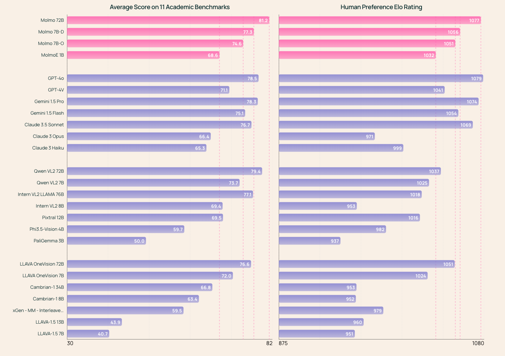

The multimodal language modeling space is far more undefined, ragged, and open for inspiration than that of language-only models. Where language has a set of defined tasks and behaviors that frontier labs attempt to hillclimb on, such as through innovative training approaches like OpenAI o1 on the hardest reasoning problems, frontier labs and small labs alike are trying to *define* what multimodal models should be used for. What does it mean for AI to see the world? Having a strong suite of open models is central to the field developing in a well-rounded and transparent manner --- two conditions needed for beneficial outcomes.

Most multimodal language model research is through late fusion models, where the model is initialized from a language backbone and often an image encoder (which is likely what was used for GPT-4V). This is an expensive form of fine-tuning on a base language model, so the compute costs are still more accessible than most realize. [There are many more architectures](https://lilianweng.github.io/posts/2022-06-09-vlm), but late-fusion has been popular due to its stability and predictability. Molmo and Llama 3.2 V are trained with this method.

The promise of scaling data through *early-fusion* models, which are pretrained on multimodal datasets, hasn't emerged. It may be that the benefits only are clear once tested on GPT-5 scale clusters.

Late-fusion multimodality is motivating as a way to learn how base models can be manipulated into many forms of output. Looking at the diversity of tools we've applied in fine-tuning in the last few years, through the origins of RLHF, multimodal late-fusion models, and new models like o1, there is a lot of expressivity that is not explored. Basic questions still apply, such as "How do standard text benchmarks like GSM8k or IFEval degrade with multimodal training?" Standard evaluations that largely assess the model's knowledge, like MMLU, are unchanged in the best visual fine-tunes.

This is a very new space for me as well. This post tracks a major new release from Ai2, [Molmo](https://molmo.allenai.org/blog) (Open Multimodal Language Models), and of course the new Meta models, Llama 3.2 Vision. Both released four models in a suite of sizes. The performance is quite similar, but Molmo is more open.

Meta released Early versions of [Llama 3.2 1B, 3B, 11B-Vision, and 90B-Vision](https://huggingface.co/collections/meta-llama/llama-32-66f448ffc8c32f949b04c8cf) and shared a few details on the training process in the [blog post](https://ai.meta.com/blog/llama-3-2-connect-2024-vision-edge-mobile-devices/?utm_source=twitter&utm_medium=organic_social&utm_content=video&utm_campaign=llama32) (which also has all the relevant links). The 11B is likely a modified version of the Llama 3 8B models and the 90B comes from the 70B.

Ai2 [released](https://huggingface.co/collections/allenai/molmo-66f379e6fe3b8ef090a8ca19) Molmo 72B built on Qwen 2 72B, Molmo-7B-D built on Qwen 2 7B, Molmo-O built on a forthcoming OLMo 7B version, and Molmo-E built on [OLMoE](https://www.interconnects.ai/p/olmoe-and-building-better-llms) with 1B active parameters.

The Molmo models are released under **Apache 2.0** license, while the Meta models come with the Llama 3.2 community license agreement, which has some heavy downstream use restrictions.

This gives me a great time to reflect on where the entire area is going. In reality, the most important models of this release are the 1B and 3B Llama models (a full post on the distillation training technique soon). The market for small language models is so high, and only growing as small models become more capable. I'll be writing about this again and again, but today is about multimodal.

## Llama vision: Multimodality for the masses of developers

Since the [Llama 3 report](https://arxiv.org/abs/2407.21783), Meta has made it clear that these models are coming soon (except in the EU). Meta is deploying these models in Meta AI and their augmented/virtual reality devices like the RayBan glasses. These are very solid models, beating the smaller models from the closed labs, which are often estimated to be in the 60 billion active parameters range.

There isn't a ton of information about these models. EU users attempting to download the model from the official Meta AI page will be greeted with the first official geolock I've seen on HuggingFace.

For everyone else, they're also available in Meta AI. The bigger news is that there are equivalent models available with far more documentation and openness (and no geolocks).

## Molmo: a (mostly) open-source equivalent to Llama vision

Molmo is the latest [open language model](https://www.interconnects.ai/p/olmo) from Ai2 that comes with an [initial tech report](https://molmo.allenai.org/paper.pdf), [free demo](https://molmo.allenai.org/), and dataset coming soon. The goal is to build open language models so anyone can participate in and or understand the most important pieces of building modern AI models. Molmo is trained on Qwen2 and OLMo backbones with a [CLIP encoder](https://huggingface.co/openai/clip-vit-large-patch14-336). There's an [open version of CLIP](https://github.com/mlfoundations/open_clip) where the data is available, but this was passed on for superior downstream performance. Note that the recent Mistral model [Pixtral](https://mistral.ai/news/pixtral-12b/) and Llama models all trained their own encoder. The blog post makes it clear how these pieces fit together:

> Our model architecture follows the simple and standard design of combining a language model with an image encoder. It consists of four components: (1) a pre-processor that converts the input image into a set of multiscale, multi-crop images; (2) a ViT image encoder that independently maps each of these images into a set of vision tokens; (3) a connector that projects the vision tokens to the language model\'s input dimension with an MLP and then pools the vision tokens to reduce their count; and (4) a decoder-only Transformer LLM.

A summary of this architecture is included in the paper.

Note that "All model parameters are updated in both stages," rather than being frozen and no RLHF or preference tuning was used on these models. For performance on the benchmarks we have for visual models, Molmo is directly comparable to GPT, Claude, and Gemini models.

Compared to Llama 3.2 V, Molmo performs better on most of the visual domains. Here's a summary of the delta:

-   MMMU: Llama is higher by 6 points,

-   MathVista: Molmo up 1 point,

-   ChatQA: Molmo is up 2 points,

-   AI2D: Molmo is up 4 points,

-   DocVQA: Molmo is up 3 points, and

-   VQAv2 is about the same or Molmo is slightly better (the reporting in the Llama 3.2 blog post is not entirely clear).

Here's an independent replication of the evaluations [on Reddit LocalLlama](https://www.reddit.com/r/LocalLLaMA/comments/1fpb4m3/molmo_models_outperform_llama_32_in_most_vision/).

My read, which is to be expected based on the organizations' goals, is that Llama 3.2 V is a better text model, maybe even much better, but Molmo is a better image model. This is particularly true with the features like pointing and reading clocks that Molmo does so well at.

As I'll cover more in this post, benchmarks don't cover the whole story of these models. Molmo is a huge contribution to the open and scientific communities, but it is important to discuss the models' behavioral differences. Molmo has a capability that none of its peer models have --- the ability to point at pixels in a referenced image. For example, I asked [Molmo where the bike](https://molmo.allenai.org/share/963de0d0-9069-4a14-ad5a-8e4bc0863136) was in a photo of myself.

This pointing feature is the clearest angle that multimodal models will help with web agents. Once we add enough web data to the training this model will immediately be able to navigate all standard web pages.

Asked to describe the same image, the model [returns a quite detailed description](https://molmo.allenai.org/chat/d1917496-1581-4ca5-8bda-1f4216d1ea1e), which is more standard:

> The image is a screenshot of a Zoom call, framed by a black border with a white inner border. In the upper right corner, there\'s a smaller inset showing another participant, a man with a mustache, glasses, and a headset, wearing a black t-shirt. He is seated in front of a fireplace with a mantle adorned with pictures and books. The main screen features a young man with short brown hair, blue eyes, and a slight smile, dressed in a blue shirt with white polka dots. He is seated in a room with white walls, a window with a windowsill, and a black shelf behind him. The shelf holds various items, and there is a bicycle tire hanging on the wall. The room also contains a couple of framed pictures. The top of the screen displays the file name...

This sort of description is directly downstream of the new dataset, PixMo, used to train the Molmo models. PixMo be relevant far longer than these initial models. The innovation for the dataset is to have annotators respond to images in audio rather than text (similar to this [localized narratives paper](https://arxiv.org/abs/1912.03098)), which enabled them to be far more creative and descriptive in their annotations. In fact, the annotators enjoyed the tasks given to them so much (such as the pointing data) that they were actively asking for more tasks to do. *Unlocking* the annotators to be extremely engaged is a goal for any human data pipeline, but not one I have seen, ever. This dataset has millions of examples across a wide variety of images.

One of the few technical details we have on Llama 3.2 V is that it was trained on "6B (image, text) pairs" in the model card, most of which was likely synthetic data. Molmo for example was trained on only millions of primarily human datapoints.

The most important differentiating factor and real strategy for OLMo models, including Molmo, is openness. As the [definition of open-source AI is deliberated](https://www.interconnects.ai/p/defining-open-source-ai), these multimodal models are a great example of how we should stress-test it. To start, here's a comparison of the Molmo models and their peer models --- Llama 3.2 V will be similar openness to all the open-weight models.

All of these models use vision encoders without open data (mostly CLIP from OpenAI), but open-source alternatives exist. Releasing image data is far riskier (for things no one wants to deal with, like CSAM) and complex. Because the Molmo models are fine-tuned from a non-open-source model (and updating the parameters), they would not be classified as open source via the most recent Open Source Initiative definition. What if Molmo held the clip weights constant, would it then be open source because all it is passing in is an embedding of data? There would not be a big difference between releasing image data and embedding.

This is the same definition where models trained on synthetic outputs from other language models (including closed models) can be considered open-source. The definitions of open-source AI need a lot more wrangling in areas where multiple models and data streams are used at once. For text-only pretraining, the definitions make sense in spirit and need some fine-tuning in specifics. For fine-tuning and multimodality like this, more debate is needed.

For these reasons, I'm not coming out to say "Molmo is open-source," but it is by far the closest vision model to being so. The delta in strategy from being definitionally open-source versus the most open lab in the ecosystem is minuscule.

## How adding vision changes capabilities and reasoning

Viewing the addition of vision as another fine-tuning problem made me wonder how the top models today behave on the same prompts with and without images attached. Behind the scenes, this routes our queries to different models. For models like GPT-4 and Claude that are *not* early fusion models, this almost certainly has a cost to performance other than inference cost --- otherwise, every model would be a visual model too. For models like GPT-4o that natively take in images in the same stream, this test does not apply.

The simplest way to check this is by comparing the text evaluations on the standard and vision versions of models. Among models released to date, very few of them do this direct comparison. If they do, it is limited to a subset of evaluations. In researching this article, I did a decent but not exhaustive search and didn't find enough comparisons to make a compelling argument based on numbers. My intuition is that switching to vision makes getting all the post-training improvements we're seeing, such as in ChatBotArena, that much harder.

The test is to see how GPT-4 and Claude 3.5 Sonnet behave on moderate reasoning or coding tasks with and without an image to ignore. Both of the models very easily ignore the models in the first message when told to and still can understand the image when you ask a follow-up question about it. The addition of the images makes the models more sensitive to normal failure modes from models of months past.

I started with one of my go-to easy reasoning questions, "How many golf balls fit in a \[or the\] moon?" The with-image and without-image variants of ChatGPT4 follow extremely similar reasoning steps and arrive at very similar answers.

On the other hand, Claude\'s vision totally trips up on this one (on the right below). Claude's vision response is essentially a fancy refusal, as Claude does sometimes, rather than trying to answer the common conceptual question.

This task didn't seem hard enough, so I moved on to a coding question where the LLM should explain the approach and then write a Python script for it --- a basic training script for a language model. First, the without an image from ChatGPT, which is reasonable, but not one that is that useful for building with.

ChatGPT's response to the image is less thorough and less well-shaped.

On the other hand, Claude's two responses here are almost identical.

This is not a surprising conclusion. Image inputs to models are less mature, so the models show us more of the failure modes and disappointments that we saw more of last year.

The better question is the future. Will this get substantially better, or stay the same? The reception for features like o1 is much higher than better visual inputs. Language is still the central domain for AI models and without clear tasks to push the limits on vision, it is hard to make the point that it is transformative. Language is still the pulse of the ecosystem.

For Molmo, without standard text-style instruction tuning and RLHF, has a very different vibe than people are used to with models when asked a reasoning task. We know we have to keep improving this sort of task across all of our OLMo models.

Still, Molmo has a few tricks up its sleeve that neither Claude nor ChatGPT can do. We hope those are enough to warrant using it. *Another option for playing with these models is the [Vision Arena](https://huggingface.co/spaces/WildVision/vision-arena), but some endpoints are broken and it is slower than native applications.*

## Multimodal language models: Earlier on the exponential

The defining factor of watching the Molmo project develop relative to similar projects in text-only models I've followed is how underdeveloped the ecosystem for multimodal models is. Particularly for post-training behaviors, we are lacking evaluations, datasets, open benchmark models --- everything. I wrote about this in January, [particularly how undefined multimodal RLHF is for open pipelines](https://www.interconnects.ai/i/140525309/multimodal-rlhf-questions-ideas-and-resources), and not much has changed. The result is that you have an arguably open-source model equaling closed models like GPT-4o.

To be clear there are still plenty of benchmarks discussed in these technical reports about models, but relative to what *can* be done it is just scratching the surface. Many evaluations are taking ideas from traditional language models, such as explaining concepts or identifying content, to the visual domain. What is needed for vision is entirely new *directions* of benchmarks. What is the equivalent of SWE-Bench for a visual language model? I suspect there will be SWE-Bench-Vision, but there still will need to be other categories that cannot be grounded to textual counterparts.

When using multimodal models, I find that it isn't clear what I should use them for. They are great for information extraction and processing. I do a lot of copying tables or recreating code for a plot with Claude or ChatGPT. Beyond this, a lot of the data used to train the models --- scene captioning --- feels like a compelling demo but not something I will use on a regular basis.

For a long time, visual language models just didn't work. Now that they're stronger, and importantly openly available en masse, the adoption will increase. With adoption comes the feedback loop of development. One way to describe this argument is below.

Particularly, with Meta's strategy of attaching the brand of open-source AI to Llama, the credibility of their model entry here will make more developers take the type of model more seriously.

The only application that isn't solved yet which is certain to be important to the future multimodal language models is web element understanding. Web agents are one of the last integration hurdles limiting a mass rollout of generative AI products. A potential reason we haven't seen more web agents is the general reliance of the ecosystem on closed models which are harder to give the permissions required for execution (especially with a focus on enterprise domains). We could see open-weight models rapidly adopted as capabilities improve here. Structural reasons rather than the desire to ship the local multimodal models seem obvious --- we should ask Adept about that. With more open-weight and (nearly) open-source models, acceleration is imminent.

------------------------------------------------------------------------

**Housekeeping**

-   Audio of this post is available (soon) in [podcast](https://podcast.interconnects.ai/) form (and sometimes on [YouTube](https://www.youtube.com/@interconnects)).

-   My casual podcast is at [retortai.com](http://retortai.com).

-   *Paid subscriber Discord access in email footer.*

-   Referrals → paid sub: Use the [Interconnects Leaderboard](https://www.interconnects.ai/leaderboard).

-   Student discounts in [About page](https://www.interconnects.ai/about).
