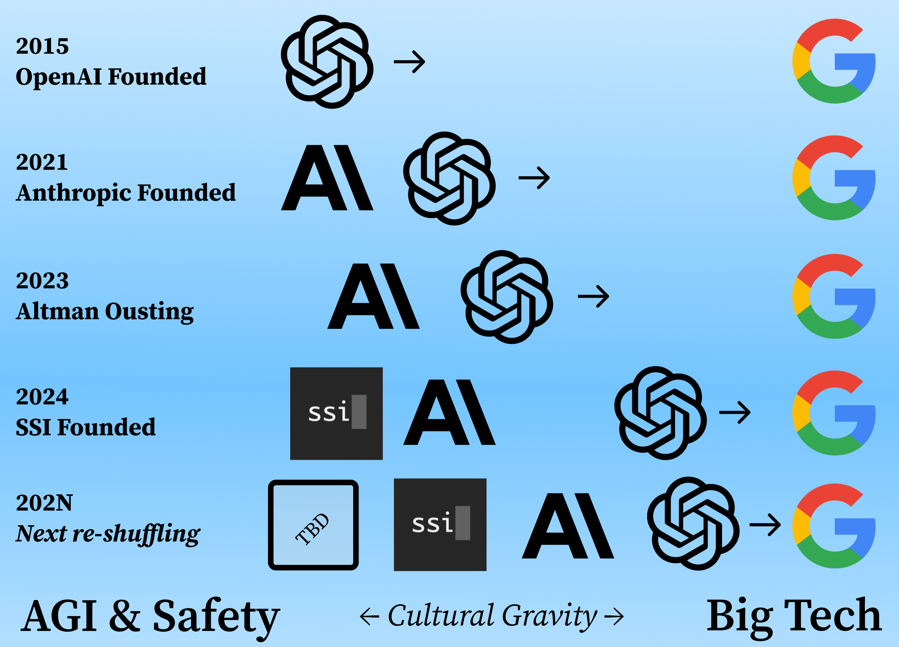

AI Safety, also known as AGI Safety, is a leading philosophical position at the leading AI labs. The core idea is that the first principle taken when approaching large-scale AI systems and research projects is that AI is *different.* Proponents believe we cannot treat AI as we have previous technologies. They truly believe that we can build an artificial general intelligence that is creative and capable of acting beyond human constraints. This belief goes beyond marketing, but does make it easy for them to tell extremely compelling stories around their companies. They argue that we must think longer term and have vastly different (and stronger) controls.

For the first phase of AI's development, roughly until ChatGPT's explosion, the culture could easily be seen in decision-making, organization structures, products, and everything these companies did. The culture of AI safety is at a common crossroads seen by multiple value-informed design principles across technology --- where the practical constraints of investment, markets, and regulation are sticking with their traditional methods.

There have been countless articles and reports in recent weeks about turmoil at OpenAI, with key employees and co-founders disagreeing on direction, speaking out against decisions, leaving, and all the normal sounds here. While turnover at mature startups is normal given the long life cycle required to reach IPO, the inflammatory nature of it is not. The [Wall Street Journal](https://www.wsj.com/tech/ai/open-ai-division-for-profit-da26c24b) and [The Information](https://www.theinformation.com/articles/behind-openais-staff-churn-turf-wars-burnout-compensation-demands) both recently covered the high-profile exits, highlighting safety vs. product debates, failed courting of people to return, and many more extreme oddities.

Much of the recent events feel like mirrors of the [high-profile firings](https://www.nytimes.com/2020/12/03/technology/google-researcher-timnit-gebru.html) of [AI Ethics researchers from Google in 2020](https://www.theverge.com/2021/2/19/22292011/google-second-ethical-ai-researcher-fired). At this point, Google was already a mature company, so firing may have been the only way to correct corporate goals and power dynamics. In startups, until leaving, vocal researchers have their say until they just can't anymore. For most of OpenAI's existence, something like 20% of compute could've gone to safety work ([as was promised to OpenAI's super-alignment team](https://fortune.com/2024/05/21/openai-superalignment-20-compute-commitment-never-fulfilled-sutskever-leike-altman-brockman-murati/#:~:text=The%20Superalignment%20team%20was%20supposed,four%20years%E2%80%9D%20to%20the%20effort.)), but as capital investments grow and competition blooms, this can no longer be kept. One of OpenAI's many controversies was then superalignment lead Jan Leike said "[I resigned](https://x.com/janleike/status/1790603862132596961?lang=en)" after high-profile disagreements with leadership.

In Jan's case, and many others along the way, capitalism and the drive to be a public company won. We're seeing this again and again, OpenAI is just ahead on the curve. Anthropic's founding was caused by one of the early splits, Elon Musk left early on, and there are surely more we haven't seen due to OpenAI's strict non-disparagement contracts.

Anthropic, at its founding, repeated many times it did not want to contribute to Arm's Race dynamics, but today it has what many people believe is the strongest publicly available model. At the same time, their culture is still much more sharply honed to be sensitive to concerns of safety. Their tension is yet to bubble up in the same manner as OpenAI's, which could be more reflective of OpenAI's culture being similar to that of Twitter --- one of tech's odd ducklings, but it seems inevitable for Anthropic's day to come.

Where Google and Big Tech are largely constant in their tenor of technological deployments, the safety testing and prioritization of the top labs continue to march towards them. This is because the organizations need to pay the large capital costs for next-generation models, not because the culture has changed. The only way to mobilize on the order of \$100 billion that is needed is by appearing normal to traditional investors, e.g. through IPO, or by already having the money around, e.g. being big tech. OpenAI has chosen the former, and it is likely other labs choose the latter via acquisition.

In a world where OpenAI, the company that owns the website that the world associates with AI, can barely raise enough money to meet their goals --- hence [another \$ 7 billion round at a \$150 billion valuation is in the works](https://www.nytimes.com/2024/09/27/technology/openai-chatgpt-investors-funding.html). In a world where this is the case, painting optimistic futures for SSI or Anthropic as independent entities is challenging. Their thriving on their own is likely one of the better outcomes for general notions of AI being beneficial, but if it is low in probability, other options should be weighed.

These cultural changes are going to trickle down in important ways to the tools we use today. The methods we use AI are particularly salient within our digital lives, an influence I discussed in *[Name, Image, and AI's Likeness](https://www.interconnects.ai/p/name-image-and-ai-likeness?r=68gy5&utm_campaign=post&utm_medium=web)*:

> AI technology, more than many technologies coming before, is one that mirrors the culture of its employees. A company's employees mirror their leadership, even if they do not realize they are doing so. The culture of these companies can easily matter more than their stated goals when building technology given how steerable AI systems are. When using AI, such as the difference between Meta's Llama 3 and Anthropic's Claude, it's easy to feel the difference. It's not easy to feel the difference in cultures between Google and Bing (discounting the association of culture and product). When given a voice, these cultural mirrors will become stronger.
>
> Technology has always taken on a reflection of its employees, but AI is doing it differently by attacking different pressure points, which are more culturally relevant, and adding more humanity to the technology, which makes it easier to absorb.

All this is to say, where does AI Safety go? Is it safe to keep forking your organization and going elsewhere to reset? The hopes of OpenAI being a nonprofit were some of the last *structural* incentives that could prevent this march towards traditional for-profit normalcy that worries plenty of people in AI (and not just those who self-identify as AI Safetyists). AI being governed by extremely large, for-profit entities is a trajectory with low variance, but one that is extremely likely to propagate most of the harms that we are used to on today's internet.

Is founding new organizations actually an effective way for these prominent researchers and engineers to build the technology they want? Every fork in the road takes increasingly long to recover from, given the [path dependence of building systems like large language models](https://www.interconnects.ai/i/148458085/on-frontier-model-organizations). In this way, a more direct way to ensure safety at the frontier of AI is to stay, but this comes at the emotional cost of acknowledging a change in internal relevance.

This is a recurring cycle in trying to build value-informed systems and one that is not restricted to just AI. It is more impactful to make ChatGPT, Gemini, or one of the extremely established AI systems safer than it is to make a 100% safe AI system that no one uses. These same challenges [put a heavy strain on some decision-making at HuggingFace](https://www.interconnects.ai/p/operationalizing-responsible-rlhf?utm_source=publication-search), which would be more classified as "ethical AI," rather than AI safety, but the path of highest impact is still focusing on where the deployment will happen.

Unironically, joining Google could be the best way for these researchers could increase the probability of safe, beneficial AI, if they cannot accept the status quo.

### SB1047 as a regulatory litmus test for AI safety

Today, AI Safety is becoming a household name. In this transition, the clarity around what the AI Safety movement aims for is blurred, and it is becoming deeply associated with its historically peer fields, such as AI Ethics. This brings obvious boons and challenges, one of which is in regulation.

The controversial [California bill SB 1047](https://www.interconnects.ai/p/sb-1047-and-open-weights) served as a basic check for how traditional notions of power would or would not embrace the original AI Safety ideology. If SB 1047 were to have passed, instead of its recent veto, it would've been seen as a moderate embrace of AI Safety beliefs --- prerelease testing is crucial, scaling is the central factor governing AI development, and concentration of power by limiting access. The original bill was far closer to these principles than the one that reached Governor Newsom's desk.

SB 1047 was an attempt at regulation starting from AI Safety principles. Many prominent AI Safety individuals have endorsed the final version of the bill. It is likely the next substantial attempt will take a different flavor.

Newsom's [veto note](https://s3.documentcloud.org/documents/25178071/sb-1047-veto-message.pdf) had a few hints on what may be coming, but in reality, it is likely that the veto was largely more for messy political reasons than the reasons Newsom had the flexibility to share publicly (such as Pelosi's countering of the bill). A few quotes are being shared repeatedly from the document:

> While well-intentioned, SB 1047 does not take into account whether an AI system is deployed in high-risk environments, involves critical decision-making or the use of sensitive data. Instead, the bill applies stringent standards to even the most basic functions --- so long as a large system deploys it. I do not believe this is the best approach to protecting the public from real threats posed by the technology.

Which continues later:

> Smaller, specialized models may emerge as equally or even more dangerous than the models targeted by SB 1047 - at the potential expense of curtailing the very innovation that fuels advancement in favor of the public good.

I agree with this. We need to figure out how the models are used, particularly in the future with models like [o1](https://www.interconnects.ai/p/reverse-engineering-openai-o1), before setting any rules on training dynamics that dictate regulation.

In reality, most people just didn't care about SB 1047. It was a vocal few in the open-source and extreme AI Safety community that was vocal. The prevalence of leading academics coming out against the bill was a sign it may have been important, but we've seen plenty of open letters and so on make the rounds of AI discourse in the last few years. SB 1047 was the tip of the iceberg with those discussions revolving around actual laws, and it will only become more concentrated.

*For more on why regulating based on model size isn't the right approach, I recommend reading Sara Hooker's [whitepaper](https://arxiv.org/abs/2407.05694) against training compute thresholds or [recent work](https://arxiv.org/abs/2409.17216) from friends of mine from UC Berkeley focusing on data-centric regulation.*

### Capitalism at the helm

A world where the verbiage equivalent to '*Google it'* for AI was operated by a nonprofit is the exact outcome those who thought AI needed to be handled differently dreamed of. Many news sources have reported that OpenAI is going to remove the non-profit governance structure and issue stock grants to their CEO Sam Altman. Last year, Altman [testified in front of the Senate](https://fortune.com/2024/09/30/sam-altman-openai-equity-stake-billionaire/) that "I have no equity in OpenAI" and "I do this because I love it." This oversight could enable different outcomes for the business. It added variance, as seen with the tumult over Altman's "candor" last November, but such variance could've been needed to create a transformative technology in a way that has never been seen before.

It is clearly problematic from a business and legal perspective that OpenAI can get away with this change, and it is likely for regulations to change in the future to block it, irrespective of the underlying cultural costs on the most ideological employees.

Many business analysts see this as a good thing, as it means that the likelihood for AI to be a profitable tool has increased. It is the culmination of the transition from OpenAI as the quirky and in-conflict research company to the ChatGPT company. We've seen this in their recent features, adding many new ways to experience and utilize ChatGPT. In the fullness of time, the opportunity window to define "different" rules for AI is slipping through the collective fingers of the faithful as the companies become more normal.

From my reading of technological progress, I don't see the diminishing of AI Safety as a net good.

AI Safety as an approach and culture is central to the beneficial rollout of modern AI systems. What isn't clear is how these values enable the individuals to engage in meaningful ways with the rest of the stack. We'll see in the coming months the tenor of new regulations and the outputs of the new companies they're championing. They should stay the course and accept that principled work only gets harder as the finish line gets closer. This approach is far more rational than the emotional approach we are seeing again and again. AI's scale makes it a slave to the realities of capitalism.

------------------------------------------------------------------------

**Housekeeping**

-   Audio of this post is available (soon) in [podcast](https://podcast.interconnects.ai/) form (and sometimes on [YouTube](https://www.youtube.com/@interconnects)).

-   My casual podcast is at [retortai.com](http://retortai.com).

-   *Paid subscriber Discord access in email footer.*

-   Referrals → paid sub: Use the [Interconnects Leaderboard](https://www.interconnects.ai/leaderboard).

-   Student discounts in [About page](https://www.interconnects.ai/about).
