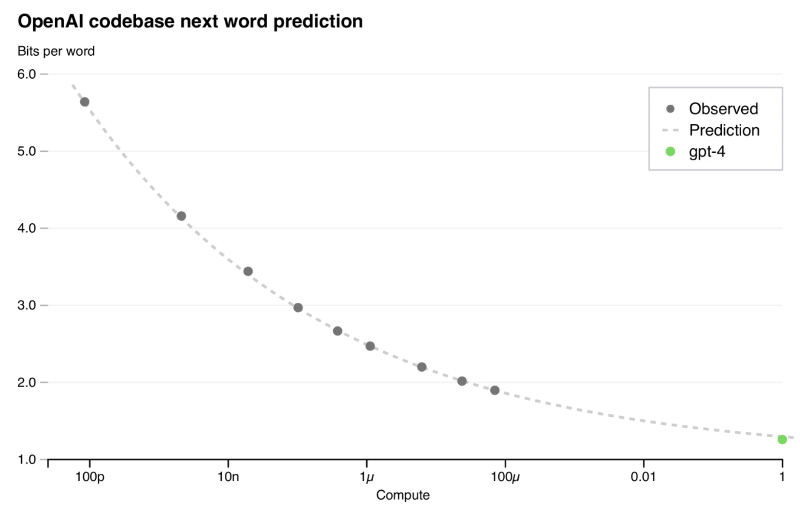
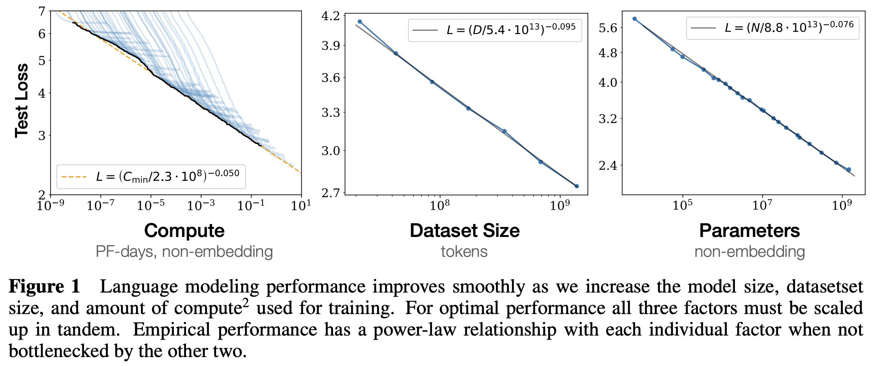
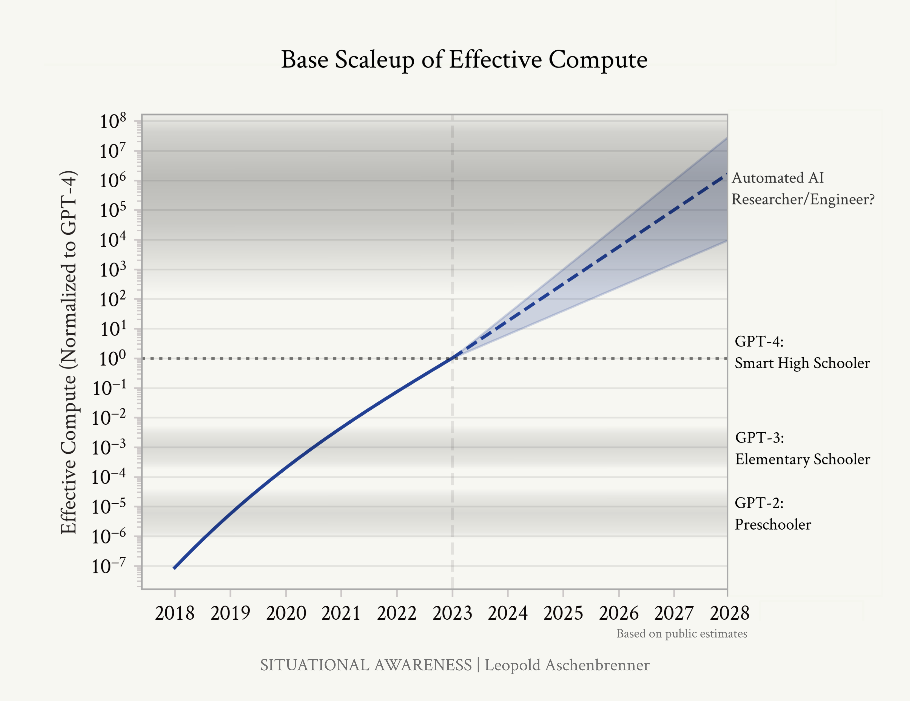

*Some housekeeping: I'm migrating the hosting platform for article voiceovers and interviews to Substack (from Transistor, which was also great) to make some long-term plans easier. Second, I'm going to partially phase out my AI-generated voice (fine-tuned as myself with ElevenLabs) in favor of real-life voiceovers. In the meantime, you'll see some duplicated posts on the Interconnects web view. There shouldn't be any disruptions to emails, podcast subscriptions, and all the normal stuff, but if you notice anything weird, please let me know!*

*Subscribe to the audio feed [here](https://www.interconnects.ai/podcast). Onto the piece.*

------------------------------------------------------------------------

Scaling laws are the numerical regression that charts language model computational resources versus test loss. The fundamental curve is a [power law](https://en.wikipedia.org/wiki/Power_law) --- where a small change in one quantity results in a delta in the other proportional to a constant to that arithmetic *power ---* in prediction accuracy relative to compute. The predictions being made are sampling the correct tokens among vast sequences of text. The compute that is being increased is a mix of parameters and data. The point of this article is to understand what the loss going down means, why I am optimistic it\'ll continue for a couple more orders of magnitude (practically), and how this will and will not change our AI systems.

To start, this is how the [original paper](https://arxiv.org/abs/2001.08361) describes what the scaling laws are:

> We study empirical scaling laws for language model performance on the cross-entropy loss. The loss scales as a power-law with model size, dataset size, and the amount of compute used for training, with some trends spanning more than seven orders of magnitude.

There are plenty of more debates on whether scaling will work, such as a debate [by Dwarkesh Patel](https://www.dwarkeshpatel.com/p/will-scaling-work), a [critique of scaling from AI Snake Oil](https://www.aisnakeoil.com/p/ai-scaling-myths), [discussions](https://epochai.org/blog/will-we-run-out-of-data-limits-of-llm-scaling-based-on-human-generated-data) on the \"data wall,\" and plenty of others. I find these frustrating in different ways. Most of these that fall on the side of \"scaling will work\" focus on the idea that scaling will lead us to AGI, with virtually no proof or sufficient recognition that [AGI is pretty much entirely made up](https://www.interconnects.ai/p/agi-is-what-you-want-it-to-be). On the other side, critiques of AI myths (who often do great work reducing hype) don\'t do enough work to reckon with what it means scientifically, and mechanically, for scaling to work. For Example, as a proponent of scaling working, Dwarkesh concludes his article with:

> So my tentative probabilities are: 70%: scaling + algorithmic progress + hardware advances will get us to AGI by 2040. 30%: the skeptic is right - LLMs and anything even roughly in that vein is fucked.

I agree with the probability numbers here, but the outcomes linked with them are not well-grounded. In the 30% window where \"scaling doesn\'t work,\" all of the outcomes are going to be dictated to *how the curve bends away from the linear power law* and *how long we can continue to improve the existing implementations*. The "scaling works" outcome is just that loss continues to go down, and the AGI part is fiction.

Some of the AGI faithful say things that are mathematically not supported, fueling the scaling critics, such as evaluations improving at an exponential rate with logarithmic increases in compute. The only constant that we have in the scaling laws is that the [cross entropy loss](https://en.wikipedia.org/wiki/Cross-entropy) decreases with quadratic compute increase. An important fact about power laws is that they do not need to have the same base for the powers, so a 10x increase in training compute does not necessarily translate to a 10x decrease in test loss. In some cases, the test loss, in bits per word, will even look closer to an exponential decay --- likely for a fixed architecture --- as in the GPT-4 report.

So we have a situation where we are working increasingly hard to lower the loss a bit more. This relationship is intimidating, as we are doing vastly more physical infrastructure work for smaller changes in the loss landscape, but these minor changes could be disproportionately valuable. The last few tokens the models are getting wrong can be the difference between getting a hard problem right or wrong.

The plots in the original [scaling laws paper](https://arxiv.org/abs/2001.08361) show how trends across model sizes are more clear logarithmic scales on both axes. Note how the y-axes have slight stretch and shrink between marks.

Most of the \"emergent behaviors\" we have seen so far are likely similar to examples in the training corpus. The popular examples are Tikz (LaTeX) or ascii art. Larger models have an improved ability to maintain performance in more domains --- the parameters are accepted to hold "more knowledge," whether or not that is a good use for them. The o1 training regime is a method for finding better coverage by generating different trajectories (sequences of words).

Using larger language models that have similar scores to smaller models on evaluation tasks still demonstrates notable differences. Larger models capture more nuance and expression than their smaller counterparts. If there is a notable change between the behavior of these model scales, there is something there that theoretically can be measured, but I expect it is numerically intractable. Without precise measurements, we are left to intuition and analogy.

### **Metaphors for what scaling may solve**

When listening to the recent [Dwarkesh podcast](https://www.dwarkeshpatel.com/p/dylan-jon) with Dylan Patel of SemiAnalysis and Jon of Asionometry, an analogy for language model generation sensitivity to manufacturing process reliability made me appreciate how scaling can result in seemingly emergent behaviors. An emergent behavior is an ability that seems to suddenly work as a model is scaled to the next generation. In reality, given how we know techniques like prompting can unlock new capabilities in models that the general public largely assumes impossible, emergent capabilities are often improvements in robustness rather than raw intelligence.

In complex semiconductor assembly, there are hundreds or thousands of steps that are executed serially. At each of these steps, minor physical errors in the process can result in small amounts of the inputs not making it to the next step in the process. The discussion of the end result of this stepwise progression is called yield \-- how many chips are usable relative to the total material you started with. Given the complexity of these processes, if all of the tools had only 99.9% reliability, the final yield would only be 36.8%. The leading-edge fabs are dealing with extremely small probabilities, often out to six nines (also called [six sigma](https://en.wikipedia.org/wiki/Six_Sigma)).

With autoregressive language models, a very similar calculation can be made. Consider a complex task where 1000 output tokens must be mostly correct in order to get the right answer \-- the same math applies. Small errors in prediction quickly compound into an unusable product. Even the units of the cross entropy loss, bits per word, bring deeper levels to the analogy.

Lowering the loss reduces the amount of information *spent* on each generated token. In information theory, the bits in the unit correspond to how many yes-no questions an equivalent model would need to ask to converge at the answer. The very predictable text requires fewer questions to address. Bigger models having a lower loss means they have an easier time predicting each word.

Mechanically, the way that next-generation models feel so much better is just by expanding their reliability at prediction. One of the common failure modes of models literally feels like they\'re getting stuck in the wrong mode. They get repetitive. Scaling makes this much less likely. Changing from 3 to 4 nines of reliability over a 1000-step process changes the yield from 36.8% all the way to 90%. This is the difference between an evaluation looking impossible and it looking entirely solved --- something we are very used to seeing.

Agents, while not directly related because of their reliance on specific implementation decisions, fit exactly into the same metaphor due to repeated actions and tool calls. The agents we visualize coming soon rely on 10s to 100s of medium steps toward a task, and maybe some exploration. The same math can apply, where scaling unlocks more 9s of reliability, but starting from a lower accuracy than standard word prediction.

This also can be seen from a dynamical systems lens. Where the models are not robust, the \"stable attractor node\" that is failing has a much stronger pull (bigger eigenvalue), when the system is \"smarter\" it makes it easier to express many other complex behaviors. The math would look almost the same, where it is common in nonlinear systems to see powers of eigenvalues.

To summarize, it is important to keep all of the following facts together:

1.  Scaling language models is making tiny improvements to probabilities (or values),

2.  Small deltas compounded over iterative tasks to dramatic effect is something we have seen in many other numerical systems, and

3.  Most of the ways that people describe scaling's numerical impacts are not grounded in anything beyond hype.

### **Short-term scaling is already de-risked**

De-risking most of the scaling questions on the next generations of models is entirely feasible. Scaling laws give labs predictable relationships between test loss and compute. These curves are used extensively in experimentation for language model training. These curves entail training *part* of the model and comparing results. For the next-generation sized models, top labs surely ran these experiments for extremely large models before committing extreme resources to the compute buildout.

If the curves bend at the end of training, it will be a smooth change in behavior \-- test loss decelerating during training slightly faster. The likelihood of a discontinuity in a scaling laws is extremely low. This does not mean that the labs know how to create a return on investment on the better models, but all economic signs should make you confident that the loss on the next generation of models is going to be lower. The models are going to be better, and we need to figure out how to use them.

Years in the future, where scaling works to its fullest extent, we will be training models so large that even attempting to train a few steps on current infrastructure would be entirely infeasible. This terrain is unknown, and speculating this far out on whether scaling will work is largely a philosophical exercise. Techno-optimists think scaling will work until we run out of electricity. Pessimists argue it won\'t. We don\'t have the information needed to conclude the debate, so it is best to avoid it in the meantime.

Building the next cluster for training always gets more expensive, so regardless of whether scaling laws bend, there will be more inertia and strategic risk in building them.

### **What scaling has no bearing on**

A lot of the scaling metaphors are deeply broken in their integrations with agents. Better models will help agents, but numerically it seems very unlinked that we will have intelligence explosions through models alone. Most of this will be unlocked by developing better systems, products, habits, and understanding of the systems we already have.

Agents are often associated with scaling laws. I have no idea why.

To put my argument simply, when looking at plots from Situational Awareness, my biggest issue is with the qualitative claims attempting to forecast the impact of technology. Historically, this has always been a largely fruitless exercise \-- we are very bad at imagining the future, especially on specific timelines. There are many types of scaling skeptics. The first type doesn\'t believe, even in the short term, that the power law will continue. Another type of skeptic is that the metaphors used to describe AGI are broken. Some believe both things.

I am far more worried about the storytelling than the math. The models are going to become more expressive, but that doesn't necessarily accelerate our ability to integrate them into profitable products, even with far higher financial stakes for the model creators.

------------------------------------------------------------------------

**Housekeeping**

-   Audio of this post is available (soon) in [podcast](https://www.interconnects.ai/podcast) form (and sometimes on [YouTube](https://www.youtube.com/@interconnects)).

-   My casual podcast is at [retortai.com](http://retortai.com).

-   *Paid subscriber Discord access in email footer.*

-   Referrals → paid sub: Use the [Interconnects Leaderboard](https://www.interconnects.ai/leaderboard).

-   Student discounts in [About page](https://www.interconnects.ai/about).
