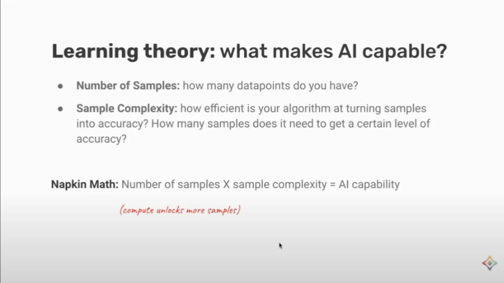

Andrew Trask is one of the bright spots in engaging with AI policy for me in the last year. He is a passionate idealist, trying to create a future for AI that enables privacy, academic research, and government involvement in a rapidly transforming ecosystem. Trask is a leader of the [OpenMined](https://openmined.org/) organization facilitating researcher access to non-public data and AIs, a senior research scientist at Google DeepMind, a PhD student at the University of Oxford, an author and educator on Deep Learning.

You can find more about [Trask](https://x.com/iamtrask?lang=en) on Twitter or [Google Scholar](https://scholar.google.com/citations?user=2Ajxf1sAAAAJ&hl=en). You may want to watch his recent [talk at Cohere](https://www.youtube.com/watch?v=am7bJc5xC8s) on the future of AI (and why data breakthroughs dominate), his [lecture at MIT on privacy preserving ML](https://www.interconnects.ai/180b4ea3971647b09c90ef18cb142a36?pvs=25), or his [book on deep learning](https://www.manning.com/books/grokking-deep-learning?a_aid=grokkingdl&a_bid=32715258) that has a substantial [GitHub component](https://github.com/iamtrask/Grokking-Deep-Learning). Here's a slide I liked from his recent Cohere talk:

The organization he helps run, OpenMined, has a few principles that say a lot about his ambitions and approaches to modern AI:

> We believe we can inspire all data owners to open their data for research by building open-source privacy software that empowers them to receive more benefits (co-authorships, citations, grants, etc.) while mitigating risks related to privacy, security, and IP.

This is based on four ideas:

> 1.  Researchers need data they cannot access
>
> 2.  Data owners have data they cannot share
>
> 3.  A second wave of big data is coming
>
> 4.  Join the movement

Listen on [Apple Podcasts](https://podcasts.apple.com/us/podcast/interconnects-audio/id1719552353), [Spotify](https://open.spotify.com/show/2UE6s7wZC4kiXYOnWRuxGv), [YouTube](https://www.youtube.com/@interconnects), and [where ever you get your podcasts](https://www.interconnects.ai/podcast). For other Interconnects interviews, [go here](https://www.interconnects.ai/t/interviews).

:::::::: {#youtube2-UDBgeXspkZ0 .youtube-wrap attrs="{\"videoId\":\"UDBgeXspkZ0\",\"startTime\":null,\"endTime\":null}" component-name="Youtube2ToDOM"}
::::::: youtube-inner
:::::: iframe
::: {#player}
:::

:::: player-unavailable
# An error occurred. {#an-error-occurred. .message}

::: submessage
[Try watching this video on www.youtube.com](https://www.youtube.com/watch?v=UDBgeXspkZ0){target="_blank"}, or enable JavaScript if it is disabled in your browser.
:::
::::
::::::
:::::::
::::::::

### We Mention

-   [Claude 3.5 launch](https://www.anthropic.com/news/claude-3-5-sonnet) and "pre release testing with [UK AISI](https://www.aisi.gov.uk/)" (and the [US AI Safety Institute](https://www.nist.gov/aisi))

-   [OpenMined](https://www.openmined.org/) and [PySyft](https://github.com/OpenMined/PySyft)

-   [CSET (Center for Security and Emerging Technology)](https://cset.georgetown.edu/)

-   [NAIRR](https://nairrpilot.org/)

-   The "[open data wall](https://www.interconnects.ai/p/the-data-wall)"

-   [Apple's Secure Enclaves](https://support.apple.com/guide/security/secure-enclave-sec59b0b31ff/web), [Nvidia Secure Enclave](https://developer.nvidia.com/blog/confidential-computing-on-h100-gpus-for-secure-and-trustworthy-ai/)

-   Data-store language models literature

    -   RETRO: [Retrieval-Enhanced Transformer](https://arxiv.org/abs/2112.04426) from DeepMind (2021)

    -   [SILO Language Models](https://arxiv.org/abs/2308.04430): Isolating Legal Risk In a Nonparametric Datastore (2023)

    -   [Scaling Retrieval-Based Language Models with a Trillion-Token Datastore](https://arxiv.org/abs/2407.12854) (2024)

### Chapters

-   \[00:00:00\] Introduction

-   \[00:03:12\] Secure enclaves and pre-release testing with Anthropic and UK Safety Institute

-   \[00:16:31\] Discussion on public AI and government involvement

-   \[00:20:55\] Data store language models and better approaches to "open training data"

-   \[00:42:18\] History and development of OpenMined

-   \[00:48:57\] Use of language models on air-gapped networks

-   \[00:52:10\] Near future of secure enclave technology and industry adoption

-   \[00:58:01\] Conclusions and future trajectory of AI development

### Transcript

**Nathan Lambert** \[00:00:00\]: *As a brief editor\'s note here, you\'ll hear us talking about the pre-release testing that Anthropic did with the UK Safety Institute. There\'s kind of two things here. So Anthropic did pre-release testing for their Cloud 3.5 Sonnet model. And also there\'s a separate line of testing on this secure enclave access to models. So with the secure enclave, it was a dummy model and dummy data. It wasn\'t with the Cloud series of kind of frontier models. But that does not mean that it was not a success to kind of set up this infrastructure to interface a secure enclave and a new type of compute with what is a leading company. So it\'s still a big success from a policy perspective, but you\'ll kind of hear us talk about both things, which is the Cloud 3.5 Sonnet pre-release testing with the Safety Institute, which is mostly around risks. And then there\'s this entirely new thing of setting up new infrastructure to enable access in a private and secure way to AI models. So I hope you enjoy this episode with Andrew Trask. And I definitely did.*

Hey, Andrew. Good to see you again.

**Andrew Trask** \[00:02:30\]: Hey, Nathan. Good to see you too. Yeah.

**Nathan Lambert** \[00:02:35\]: So on this episode, Andrew told me he\'s got some exciting things in the kind of privacy and or evaluation of language models. I don\'t think I have the right framing of it. By the time we discuss it, we will. Andrew and I talk at kind of random places. We\'ve been bumping into each other in random places of the world, and we always have these fun kind of discussions slash debates on stuff. So I think this will be kind of an easy episode to just kind of riff on things and have fun. But on the top, I think it\'s probably just good to dive into the thing that you said you got across the line in the last few weeks. Do you want to explain it?

**Andrew Trask** \[00:03:12\]: Yeah. Yeah. So this was just first teased at a DC event we had, I guess, a week or two ago now. But yeah. So for, gosh, I almost said months, but I think it might be years, we\'ve been working on GPU enclaves as like a new paradigm for being able to facilitate evaluation of AI models. These are really special compute chips. And I imagine we\'ll talk more about them in a minute. But as described on this kind of webinar a couple of weeks ago, we just completed a first test with AC in the UK and Anthropic that utilized this infrastructure. And the exciting aspect of that test is that you\'re doing this kind of thing across a real world infrastructure. So in this case, it was with kind of representative example, simulated data sets and models and this kind of thing. But it allowed two organizations to kind of step through the process of jointly governing an AI pipeline that has confidential things in it from multiple organizations, if that makes sense. And that\'s a-

**Nathan Lambert** \[00:04:24\]: Yeah. This is the announcement they had. So Anthropic announced that they did pre-release testing with the Safety Institute. I don\'t know if it was in their blog post, but which is good context to kind of link in my brain.

***Editor\'s Note***: *This is where I learn that the pre-release testing for Claude was a seperate effort from the Secure Enclave work, even though it involves the same parties!*

**Andrew Trask** \[00:04:36\]: Mm-hmm. Yeah, yeah, yeah. Exactly. So I think they did a number of things as well. So definitely check out their post to see all the different types of work that they did. They\'re really leaning in and doing lots of innovative work. But for us, we\'ve received this generous grant from CSET and the FRG program, as well as later from the folks over at OpenPhil to mature this GPU enclave technology and basically transition it from, or seek to transition it from being a low-level chip that has specific hardware properties into a high-level shared governance mechanism, where multiple organizations can jointly propose and negotiate a computation that they\'re doing with mutually secret assets. I mean, they\'re each bringing something they want to keep confidential from the other, and then there\'s some sort of joint governance process through which they decide- Can we give an example of that?

**Nathan Lambert** \[00:05:28\]: So I guess like for the model providers, it\'s the weights that they want to be private. And then potentially for the evaluators, it could be the prompts or something like that.

**Andrew Trask** \[00:05:35\]: Yeah, yeah. So probably, I guess that would be kind of like the Hello World example, right? So if one organization has a model and another organization wants to use that model, but doesn\'t want to reveal their private data to the organization hosting the model, you can negotiate a sort of joint computation where both sides can keep their input secret. But where things start to get more interesting is when you kind of go off the trail of that kind of prefab, as a basic machine learning as a service, and AI evaluations takes you there pretty quickly because external evaluators want to test all sorts of stuff, right? So in the first instance, it might be evaluating any part of the AI pipeline. So we\'re all from the beginning where it\'s like training data sets to the model itself, things like architecture and parameters and this kind of thing, then to the user logs and what types of people is interacting, how is it interacting with stuff. And then the really tricky one is third party data. Sometimes, especially if you want to know whether a model has caused harm in the world, whether it\'s biased or whatever the case might be, the gold standard answer to that is not interacting with a model, that\'s like a speculative answer, you can model the problem there. But the gold standard answer on whether people get harmed, you actually have to find data about user harms. And that usually lives somewhere else, lives in some demographic database or something like that, or health or mental health.

**Nathan Lambert** \[00:06:55\]: I need more handholding on this. How would that example actually happen in the Secure Enclave? I would like to use the anthropic thing as an example, but we can only take it so far as probably what you actually did, and we can make that boundary clearer. Because it was with their Cloud 3.5 SONNET that they announced they did pre-release testing,

**Andrew Trask** \[00:07:13\]: is what I\'m saying. Oh, got it. So I should be clear. So this was with a simulated model and a simulated data set. So the idea is that there\'s a simulated test data set that AC wanted to keep confidential and a simulated model that Anthropic wanted to keep confidential. That\'s the nature of where this infrastructure is right now. That makes a lot of sense.

**Nathan Lambert** \[00:07:33\]: There\'s a lot of people talking about building truly private evaluations, and we were thinking about working on it, and we\'re like, we can\'t use any of the API providers in our research process of this, because they have it, unless we get them on board. That\'s a real example. Our evaluation is silly. It\'s like a little reward model thing, which is, if even we\'re thinking about it, I\'m sure there\'s sensitive information where you need this. I\'m just kind of spitballing. It\'s like any government agency, especially government privacy laws, which I was learning about.

**Andrew Trask** \[00:08:02\]: They can\'t share data externally.

**Nathan Lambert** \[00:08:04\]: Okay. So it\'s all coming more full picture. There\'s a lot of data that they want to build evaluations on, and you can\'t even try this

**Andrew Trask** \[00:08:11\]: without setting it up. Yeah. And so, for example, we first encountered this problem in 2021, 2022, when we were doing work with Twitter. And something that was surprising to me that I didn\'t know at the time was that they didn\'t have ground truth demographic information on their users, but they wanted to be able to do algorithmic bias studies, right? And so they have to get that demographic information from someone else. The ground truth provider for demographic information in the U.S. would be like the U.S. Census Bureau, for example. Crazy sensitive data, right? But they actually have a lot of very robust, very well curated, expertly refined. They spend a billion dollars every 10 years and get people with clipboards to go out and find every person and try to get them to fill out the census form. But that data by law cannot leave the census, right? It\'s what\'s called title data. If it gets leaked, employees can go to prison and all sorts of stuff. It\'s a very, very sensitive data set. And so the interesting thing to me was that because AI platforms or just social media platforms or whatever often don\'t have ground truth ability to measure harms in people\'s lives or demographics or all this kind of stuff, that along some dimensions, they can be flying blind in terms of the ability to understand this kind of stuff, just because they also have to preserve privacy or they would also preserve the privacy of other people\'s data sets and not acquire copies.

**Nathan Lambert** \[00:09:29\]: Well, there\'s the ability to scale this up. I guess we could start talking about hardware, but like, is this something computationally that is just more of like your fixed costs for your data center and your inference goes up? Or are there like different scaling factors where you maybe can\'t do this for a one trillion parameter model? Because I\'m thinking like, where is this going type of question?

**Andrew Trask** \[00:09:51\]: So this is the exciting part. So for a long time, and I used to have debates with all sorts of folks about this kind of thing, speculating on where the performance might go, but there\'s a whole class of technologies called input privacy technologies. And this is like homomorphic encryption, secure multi-party computation, zero knowledge proofs, all this kind of stuff. And for a long time, people weren\'t really excited about these as much because they\'re so slow, especially homomorphic encryption and secure MPC. The nice thing about secure enclaves is that in theory, they can run almost as fast. It\'s a hardware guarantee. It can run almost as fast as normal hardware. The main difference is that basically the chip, whenever it writes to RAM, it encrypts the data before it writes to RAM, if that makes sense.

**Nathan Lambert** \[00:10:33\]: Is that the core technology of secure enclaves?

**Andrew Trask** \[00:10:35\]: There\'s a variety of different components that come together, but I would say there\'s like two main properties that secure enclaves gives you. One is when it writes to RAM, it\'s encrypted and it\'s encrypted using a key that in theory only the chip itself has. It\'s like burned in when it\'s manufactured or something like this. And then the second one is that the chip will provide a signed hash of whatever program it happens to be running, if that makes sense. And it turns out-

**Nathan Lambert** \[00:11:01\]: You need that to verify the program runs correctly, I\'m guessing.

**Andrew Trask** \[00:11:04\]: Exactly. And that\'s how, so in theory, multiple parties can send in a program into the enclave. They can both verify before they send their data in, the program they think is running is what\'s actually running, if that makes sense. And once they come to that agreement, then they can encrypt data using a key that only the chip can decrypt. And so they know that the cloud provider and the person running the, who owns the cloud account, the AI platform or government agency or whatever, can\'t see any of the data that\'s going into the chip. How do outputs happen then?

**Nathan Lambert** \[00:11:35\]: I guess there\'s just like a certain programming where you have things that are like safe outputs.

**Andrew Trask** \[00:11:41\]: So this is the governance process. So like the, at a technical level, the way the outputs are handled is one of the parts of the program that gets sent in is keys to encrypt things so that different parties can receive various outputs without other parties seeing the outputs, if that makes sense. So other than that, it\'s a normal computer, you know what I mean? So they can do normal computer things, right? And so the, you know, I\'m putting like, you can put some asterisks next to normal because they\'re actually just this kind of stuff, but you don\'t want to get into all of them. But the\...

**Nathan Lambert** \[00:12:12\]: It\'s a von Neumann architecture computer.

**Andrew Trask** \[00:12:15\]: Yeah, exactly, exactly. But the essence is like, you know, you can design a computation, everyone agrees on what the computation is. And that also pre-specifies who\'s going to get the outputs, if that makes sense, of the program, right? And what those outputs, what keys those outputs are encrypted with. And then once everyone\'s settled and agreed on that program, it\'s running in the enclave, everyone sends in their inputs, it executes, and they get the results, if that makes sense. And so the\... And they don\'t have to see each other\'s inputs, and they get some strong guarantees that even the person running the computer can\'t see the inputs or the outputs by default. Yeah.

**Nathan Lambert** \[00:12:46\]: How does this relate to what Apple is doing? So Apple and their big WWDC push this summer talked about their secure enclaves for inference. I\'m guessing their stack is simpler, but the\... I\'m guessing it\'s like the data component that they want to make sure is encrypted on device.

**Andrew Trask** \[00:13:02\]: Yeah. So Apple has been in this space for a while. I think they were the first, the iPhone, like five, something super early, had like a secure enclave on the device, which was crazy, crazy, crazy early in terms of the history of the industry. Their latest release, yeah, takes that to the next level in terms of scale and, you know, the potential for AI systems and stuff like that. I would say the main difference, so it\'s not different in terms of the hardware, like yeah, these are exactly\... These are the same. Like Apple\'s using this class of hardware for their computations and what that means.

**Nathan Lambert** \[00:13:38\]: I\'m guessing like Apple might be like have the biggest scale of building, like you almost want to buy it, like get Apple to be the person that supplies the AD, AC, DC and AC or whatever.

**Andrew Trask** \[00:13:51\]: Yeah. I mean, Apple in classic Apple style is very vertically integrated. I haven\'t actually looked and seen, you know, the whole supply chain in terms of what they\'re buying from, you know, they\'ve had long-term relationships with Qualcomm and everyone else that, but now with the M1, M2, all this kind of stuff, they\'re becoming even more vertically integrated. I don\'t actually remember where their chip came from here.

**Nathan Lambert** \[00:14:12\]: They said that they\'re doing like M and ultras as their server chip, because then they have enough memory on the top end spec that they can fit like a 70 billion parameter in a few

**Andrew Trask** \[00:14:22\]: or something.

**Nathan Lambert** \[00:14:23\]: So it kind of makes out that that\'s what they\'re doing and they have them linked and they\'re like the dyes on the chips are linked on these chips. It\'s really funky that they\'re using them in the cloud, but it\'s cheaper than the NVIDIA

**Andrew Trask** \[00:14:35\]: premium. Wow.

**Nathan Lambert** \[00:14:37\]: I guess it\'s probably cheaper than whatever secure enclave thing that other people are building, which might also be a small subset of NVIDIA. Like is it NVIDIA chips plus plus? Is that what these secure enclaves are?

**Andrew Trask** \[00:14:48\]: Only the H100s ship with enclave tech in them, but the drivers aren\'t all finished basically, if that makes sense. That\'s very normal.

**Nathan Lambert** \[00:14:56\]: As somebody who\'s used GPUs that aren\'t supported yet, I think I was using the G100s and you have to figure out how to build the Docker file for NeoCloud. Yeah, yeah, yeah. We were helping Lambda figure out how to build the Docker image to run VL. It\'s like all of that does not work well.

**Andrew Trask** \[00:15:14\]: Yeah, yeah, yeah, yeah. In this case, you can build it, but they\'re still working out the kind of last mile features, security guarantees, this kind of stuff that they want to see before they would consider it to be GA. But it makes it kind of a rich platform for doing R&D and testing out kind of the high level apps and governance flows and stuff like that in advance of GA.

**Nathan Lambert** \[00:15:34\]: Is this what the UK Safety Institute was using for these, like NVIDIA chips?

**Andrew Trask** \[00:15:40\]: This class of H100s was a part of this test, right? And again, the test was not with real datasets or models or anything like this, but was just focused on\... Because really, there\'s different levels of R&D that need to happen, so it\'s R&D that\'s in parallel. So there\'s R&D at the chip and driver level that\'s still happening with folks like NVIDIA and Azure and stuff like that. But there\'s this outstanding question of how can multiple parties, multiple organizations actually come to co-negotiate custom data flows with each other, right? And that\'s what we were trying to work out in a realistic setting across two actual organizations who are running two actual companies.

**Nathan Lambert** \[00:16:20\]: Kind of a philosophical debate here on how the public should interface with AI. Because if you assume the US can immobilize a few billion dollars\... So I was just in DC for Mozilla\'s event on their public AI white paper. So this is the topic.

**Andrew Trask** \[00:16:31\]: Oh, yeah.

**Nathan Lambert** \[00:16:33\]: The general assumption is that the US government can mobilize a few billion dollars for cutting edge AI, language model stuff, which is not enough if they want to spin up\... Spinning up their own cluster is one thing and having GPUs is one thing, but the data privacy laws make it so that training, I think, is actually going to be really hard. Mozilla calls it public AI just to differentiate between private companies. So non-profits and academics will interface. And I think their vision is that there will be models that are built and run by the public on open source. I have questions on open source data type things later, because that\'s a whole debate that they were not talking about. But there\'s a view is like non-private companies having AI models versus there\'s potentially a view which is like you build really good infrastructure to make sure that the public, broadly, government agencies can always be using these cutting edge models, which I think would need to be regulated in. It\'s almost like federal agencies with laws requiring people to have their models be tested versus laws that make a certain amount of money to have fully open public models from the DOE, from places like AI2, academics. And those models are fully open source and we know everything in them. And those are like kind of two visions for the future. Both of them require laws. I don\'t know if I necessarily expect both to happen. I guess both will happen if you squint and close your eyes, because I guess normally there\'s always compromises in these things. But do you have an idea for where you think government appetite for this stuff would be?

**Andrew Trask** \[00:18:11\]: I mean, I\'m not, you know, I\'m primarily a technologist and we engage with policy folks a lot. But yeah, still more of a tech focused person. I don\'t know. I mean, I\'m optimistic about the National AI Research Resource. So Open Mind is one of the early partners and at Unite I\'ve seen each other at a few of the NAIR events. Seems like Kamala is pretty bullish on the NAIR as well. She had some recent statements that were signaling that she would seek to fully fund it if she was if she was elected. So that\'s certainly exciting. And, you know, somewhere in the process, there\'s low billions of dollars waiting in the wings or potentially available for that kind of funded event. So I think that\'s that\'s exciting. As far as government involvement, I mean, the funny thing about America is that, like, it\'s such a, you know, everything\'s very piecemeal. All the independent agencies are like independent agencies. They kind of like do their own thing.

**Nathan Lambert** \[00:19:03\]: Right. And we won\'t get into the NAIR DOE gossip right now.

**Andrew Trask** \[00:19:07\]: Yeah, exactly. Well, but even like the privacy bill, right, like we don\'t have a comprehensive privacy law. And, you know, that creates a certain ambiguity in the space that makes it difficult to deal with, you know, public and non-public information. There\'s a bunch of outstanding debates, like, you know, the there was the whole thing around copyright and the the the the folks who are sort of upset about their data being used to and many of them still are, of course, being used to train LLMs. And that\'s sort of like an unresolved conversation that\'s happening in the policy spaces. And I also think that the economics of the economics of LLMs is still up in the air in terms of like, are they profitable? Are they generating more money than they cost? And is this the technology we\'re going to get? I would say personally, one of the bits I\'m most skeptical of is, you know, LLMs store two types of information, right? They store classically and like in large language model science, they would talk about kind of the syntactic information and semantic information. And, you know, syntactic information is like grammar and rules and like all the specific things that that make the English language or whatever language you\'re studying work. And semantic information is the stuff that changes all the time. It\'s like, you know, where are people in the world? What are they talking about? And right now we\'re creating gigantic models that that hold all of that. And it\'s not immediately clear to me that that\'s right, because then we want to do an update. You got to train the whole model again. And, you know, I\'m optimistic that that\'s kind of not going to be the way it goes forward. And if that does happen that way, it\'s going to radically change what is open source and what is closed source. And, you know, I think it\'s a good chance we\'ll get like these hybrid middle ground options where it\'s neither open nor closed, but like parts of the model are distributed across the open and closed ecosystem.

**Nathan Lambert** \[00:20:51\]: This is one of our fun conversations that we\'ve had multiple times.

**Andrew Trask** \[00:20:53\]: So let\'s kind of go into this.

**Nathan Lambert** \[00:20:55\]: I think AI2 is describing this as like data store language models where you have a retrieval base that you can inference, you use inference time and you use it at training time to make sure your loss is low with respect to some data store.

**Andrew Trask** \[00:21:09\]: I have the notes here.

**Nathan Lambert** \[00:21:10\]: It\'s like you were always telling about this DeepMind paper from years ago. I think it\'s the Retrieval Enhanced Transformer from DeepMind, which is the paper that you like to shop around. There\'s other there\'s other papers that have included in the show notes of this.

**Andrew Trask** \[00:21:22\]: And there\'s a lot of there\'s a lot of things.

**Nathan Lambert** \[00:21:23\]: I mean, it\'s like unfolding in real time, which is we have perplexity like search apps, which I think the caveat there is that perplexity is very much a product relative to a data store LLM. So it uses multiple LLM passes at each call, which is why you can\'t directly compare it to like chat2BT, which also technically uses multiple passes, but one substantially for content. But that\'s like the vibe of this is like a perplexity like thing because they do have a data store that they\'re integrating. That\'s like one of the big things is scraping, maintaining real time information. I mean, I\'ve never caught on to perplexity, but people do really like it. So there\'s something to say there. Right. And then the whole scaling thing is interesting, which is like, I don\'t know if you have a worldview for what scaling does to the model. I kind of think that scaling makes the models more robust at general generation in terms of behavior expression. So a bigger model is just a little can express different behaviors, doesn\'t get stuck in failure modes. Yeah, that is useful for scaling. But a lot of the scaling right now is kind of trapped and loading more and more like more information into two parameters. So that\'s where we\'re spending a lot of the compute on. Yeah. And then I was just telling you before this, like, oh, one mini is an interesting take on this, which is like it should be. It seems like the time is right for people to push on these things. So the thing for one mini is that they tell us explicitly that it\'s not pre-trained on all the Internet. They focus on math and science so that the model can reason and have a really high throughput but not know all the facts. So it\'s like we literally have the pieces. I think Owen\'s training is different, but they\'ve showed us you can make a good model with a weird type of training. Yeah. So I guess maybe perplexity. I don\'t know if they have the funding, but it\'s like I would like to see them like they do it with just like one model or like they could open source and be like, this is the entire system. It\'s a really small model with an information store and it works really well.

**Andrew Trask** \[00:23:19\]: Yeah. Dude, honestly, the thing that\'s surprising most there is like why it\'s not clearly why Lama hasn\'t released, like why Meta hasn\'t released like a Lama model that was trained to retrieve. Because that\'s the thing about the retro model that was so special. Right. It wasn\'t like a model that you trained on like less data and then you like cram stuff into its context window later. Like it learned from scratch to retrieve from stuff. And it was one twenty fifth the size of GPT-3, but had comparable performance with GPT-3.

**Nathan Lambert** \[00:23:47\]: How do you compare retrieval time like this architecture versus search? Because Meta AI uses search right now, like in context search.

**Andrew Trask** \[00:23:55\]: But yeah, so I mean, the one is like what data you\'re fetching from and the distribution of that data. And the other is how the model knows how to account for that distribution of data. So like you could train something that like learned how to Google search as well. Like and the model would come out differently, right, because it would know what to doubt and what to take in and like how to manage, you know, articles that are similar and different, all this kind of stuff, as opposed to just like cramming in the context window, which is not really what we\'re doing.

**Nathan Lambert** \[00:24:22\]: So we like do some weird, like what we\'re doing is cramming, where we cram with tool use like the model, the function.

**Andrew Trask** \[00:24:29\]: Which is fine, except there\'s distribution shift from the training data to the real environment. And what DeepMind\'s retro model showed us like two or three years ago is that like you can you can squeak out like extra juice, right, when you actually learn to train or learn to retrieve from scratch. And if we actually got into that kind of world, it\'s not immediately clear to me why people would would continue training LLMs very often, because if you can actually just swap out the database that it\'s sitting on, you know, English grammar does not change that often. It\'s the stuff that\'s happening in the world that changes all the time. And so if you have a lot, if you have basic logic and grammar and all this kind of stuff and you know how to retrieve from a certain distribution, you can save yourself, I don\'t know, millions or billions of dollars and deliver a single product.

**Nathan Lambert** \[00:25:09\]: Yeah, I was ultimately very skeptical about this until this one thought, which is like I just felt like there is something that was too, like it\'s too conflated with scaling, like it wasn\'t just the information of scaling these things up. And then I wasn\'t sure how you were going to be able to scale the retrieval, like these retrieval models, while also getting the benefits of being bigger. So that\'s kind of like what I want to do. I want to have like side by side outputs of models that have the same evaluation and different architectures or training things. So I want to have like an RNN with a similar eval, an early and late language model with a similar eval. So then you end up with like a big model and a small model and all these things. And like, that\'s the way we start to figure it out. But I totally agree with that.

**Andrew Trask** \[00:25:55\]: But I think like the scale isn\'t the advantage of the small models, right? Because like, think about it. When you have a 70 billion parameter model and you ask it a question, it doesn\'t actually need to use all 70 billion parameters. There\'s lots of, even the early mechanistic interpretability research we have now identifies like you aren\'t using the whole model, but you have to forward propagate the whole model anyway.

**Nathan Lambert** \[00:26:16\]: Well, like a mixture of experts is only like a, so what would that be like a 5x gain where this is like a 50 to 100x gain?

**Andrew Trask** \[00:26:26\]: Exactly. Exactly. And you can still use it with mixture of experts. There\'s no reason you can\'t combine these things, right? But the essence of being able to query into a big vector store is just like, you know, that\'s a massive efficiency win, right? And you don\'t, like in terms of scaling and in terms of scaling during train time, it\'s an even bigger win because you just don\'t have to train.

**Nathan Lambert** \[00:26:44\]: So who do you think has the best incentives to do this? Does XAI do it and they train on Twitter?

**Andrew Trask** \[00:26:50\]: It would be kind of interesting.

**Nathan Lambert** \[00:26:52\]: We know they\'re training on our data anyways. Like they\'re not, they don\'t care.

**Andrew Trask** \[00:26:56\]: This is where I lean towards like meta, like if meta is really trying to seed the kind of like open source AI community, right? Actually meta and then the AI safety community, I think are actually the two communities that have the big incentive to do this. Because meta, because if they trained a model that learned how to retrieve, it would just be a more powerful tool for the community they\'re trying to activate. And it\'s more flexible because they can use it in lots of different contexts. How big are these data stores?

**Nathan Lambert** \[00:27:24\]: Is it technically easier to do inference on? Like I\'m guessing the data store compared to the model parameters, it\'s not ridiculous.

**Andrew Trask** \[00:27:31\]: In the DeepMind paper, it was like 2 trillion parameter data store. But again, a vector DB is like way easier to manage. You don\'t have to spit, you don\'t need a GPU cluster. Do you know what I mean? It\'s just a hard drive, right?

**Nathan Lambert** \[00:27:42\]: It\'s not RAM.

**Andrew Trask** \[00:27:43\]: That\'s a massive difference in terms of deployability, all this kind of stuff. But also in terms of safety, I think these models are like way safer because you can kind of selectively lobotomize the model trivially, right? You just, you don\'t want it to know about biology, delete all the biology data and then like, whoop, don\'t know about biology. You know what I mean? How much do you think is actually in the model?

**Nathan Lambert** \[00:28:01\]: Like I think there will be some residual stuff in the parameters.

**Andrew Trask** \[00:28:05\]: This is an interesting scientific question though. Like that\'s the research that we should be doing is like organizing what is in like the grammar and logic model, and then organizing what\'s in the database so that you can reason about its ability to reason, right? And I think this is like a, how to make models where the mechanistic interpretability is actually easier because frankly, you know, in these retrieval models, they\'re showing you what documents they\'re looking up. And if we can get them to lean even more on- What is the state of the research then?

**Nathan Lambert** \[00:28:30\]: I think there\'s some, like I have some other papers here, like silo language models, like isolating legal risk and non-parametric data store. There is some research here, but what is the limiting factor? Do you know?

**Andrew Trask** \[00:28:44\]: I mean, I think there\'s like a social limiting factor and then like maybe some technical ones. So the biggest social limiting factor is that most of the R&D and this kind of stuff is happening in startups because startups are the have-nots who like economically need this type of system more than anyone else because they can\'t afford to train their own models. And so the big players are more inclined to like use the big compute they have to like train big end-to-end systems. So that\'s like a social headwind to the thing. That also means that the research in this area is either just being thrown into open source code and it\'s like not clear what\'s better or worse than everything else because it\'s just like being thrown into a codebase as opposed to being peer reviewed and published. Not that peer review is perfect, but you know, you know what I mean. And then the other headwind is that like our frameworks for training LLMs don\'t give you this ability to train against a store. So this is like one of those things where like because the friction of training is because we\'re missing software because it\'s not in the PyTorch toolkit, right? Or the Hugging Face toolkit to really train. I mean, you can do fine tuning, I think, with rag and stuff like that. People do that. But because you can\'t train from scratch, this type of system, because like getting something to like fetch from a vector store in batches at high scale so that you can like do this rapid, rapid, rapid training is like it\'s hard, right? Because the training has to be conditioned on the model and it\'s fetching different data every time. It\'s a hard infrastructure problem, but you know, someone just needs to solve it once and then we could have a totally different class of model that is much that I would argue, again, like meta and then the AI safety community have the biggest incentives to try to make this happen.

**Nathan Lambert** \[00:30:13\]: It seems like there needs to be a multi-year investment in some fairly open player. I\'m very cynical of LLAMA\'s actual openness. Like even if LLAMA does this, it\'s not like they\'re going to have all the training code

**Andrew Trask** \[00:30:24\]: released.

**Nathan Lambert** \[00:30:25\]: I think LLAMA is also, like, okay, what is the-

**Andrew Trask** \[00:30:29\]: But like, you know, think about, I\'m pretty sure there\'s quite a bit of talent overlap between the hardcore PyTorch people who really wanted the code to be open and advocated for the PyTorch foundation, like I said, people like Joe Spisak and stuff like that. And the types of folks who are working on the LLAMA architecture. And these folks are quite deeply passionate about seeding the open source community and empowering folks. I mean, Joe is like a hero of open source deep learning frameworks in that regard. I don\'t know. Every organization is a multi-headed beast. So the truth is there is no one statement or cohesive narrative in any organization, but some complex set of incentives and individual parties.

**Nathan Lambert** \[00:31:09\]: Do you think people, like if meta releases this, there would still be copyright concerns? Because you are training on the data store, but you\'re not designing the system. You\'re not designing it to memorize it, but you\'re still doing the operation that they have been primed to say is bad.

**Andrew Trask** \[00:31:26\]: That is a deeply, deeply interesting question. A deeply interesting question.

**Nathan Lambert** \[00:31:32\]: It\'s like 75% of the way to the right direction, which is like, look, we didn\'t train in your data. But I guess maybe you try to partition it. So you partition it. So you train on a bunch of it and you train on similar things. And then you hope that you have generalization. But that sounds like then you have to go through your whole data set and split it up and do this whole crap.

**Andrew Trask** \[00:31:53\]: This is the right question to ask. And I think the thing is, is that companies don\'t care that you\'re\... If I had to guess, I would say that publishing companies, they don\'t care about you training on it. They care about you taking away their work. They care about it. It\'s a revenue question, right? And so if you trained a model that didn\'t remember their stuff, but just learned grammar from it, and you still had to go back to them to get the data at runtime, if that makes sense, I think they\'d be chill. I think they would like that, right? But what they\'re more worried about is the huge economic bundle of all these different sources that you don\'t have to talk to them anymore. You know what I mean?

**Nathan Lambert** \[00:32:28\]: Does this work on multiple domains? Does this work for diffusion or images or something?

**Andrew Trask** \[00:32:34\]: So for diffusion, there\'s no reason it shouldn\'t work for diffusion to the extent that you\'re taking your training data, you\'re creating a big model, then retraining it with diffusion, because that\'s more of a loss change. So there\'s nothing about this.

**Nathan Lambert** \[00:32:46\]: I just don\'t like modality. I think it\'s a little bit harder for me to understand the context of images. Like image is one thing, but generating images, I don\'t think makes sense in my brain yet.

**Andrew Trask** \[00:32:56\]: Right. So the research is definitely farther along in text-based retrieval than image retrieval. Oh, I did see a project that was interesting on image retrieval recently, but I can\'t remember the name. If I think about it, I\'ll send it to you and you can put it in the notes. There is some interesting work going on in space.

**Nathan Lambert** \[00:33:10\]: Because I think that even the copyright and things there, it\'s the same, but it\'s like amplified in the rhetoric, where it\'s like trying to generate an image in the style of Van Gogh. Like, I think Van Gogh should get a kickback.

**Andrew Trask** \[00:33:26\]: It\'s not necessarily a machine learning problem. There\'s a different set of technologies called differential privacy that I think actually has this weird amount of crossover. So differential privacy has this idea, its philosophy of privacy is that if you query a database and you get a result out, and the result doesn\'t change if you remove or replace someone in the database, if you query it again, if that makes sense, then you\'ve perfectly protected their privacy. And so we come up with all these different accounting mechanisms to measure the degree to which the output would change as a function of the input, like removing or replacing one row of data. So think like one source of data, like all the data from the BBC or all the data from whatever. Right. And so there\'s a bunch of interesting tools and techniques that I think can actually be repurposed for this, where normally you\'d have what\'s called a privacy budget, which is like this cap on how much statistical influence one subset of your corpus can contribute to the final result. And I can imagine that being repurposed from a privacy budget to effectively a intelligence budget or influence budget or whatever the case might be that people would ask for in a particular prediction. And I\'ve got a paper on this, it\'s sort of on archive somewhere, but there\'s kind of like this information silo between two communities that don\'t really talk to each other and they\'re using different terminology.

**Nathan Lambert** \[00:34:43\]: It\'s like a classic thing in AI research, it\'s just happening again. Which is normally, I feel confident in adding this to my list of things that are more interesting for people to do as a research problem. There\'s always a few things that seem kind of obvious, a few others in the like RLHF

**Andrew Trask** \[00:35:00\]: space.

**Nathan Lambert** \[00:35:00\]: I guess now, one of them used to be inference time compute, but after May I released O1,

**Andrew Trask** \[00:35:05\]: they were like, good luck. That one kind of blew me away that that was so surprising to everyone. Because like inference time compute in machine learning literature, this is like a decade\'s old idea that goes all the way back to the beginning of like beam search and all this kind of stuff. But it was just parsed without a lot of\...

**Nathan Lambert** \[00:35:19\]: They served it to every user on day one.

**Andrew Trask** \[00:35:21\]: That was the thing.

**Nathan Lambert** \[00:35:22\]: That\'s why it\'s cool. It\'s like robust enough to do that.

**Andrew Trask** \[00:35:25\]: So here\'s the thing, they didn\'t serve it to every user on day one, because the truth is, this is like a machine learning 101 concept that has been out of the reach of engineers because these LLMs are so heavy and the GPUs have these weird constraints and all this kind of stuff that people wanted to do this 10 years ago. But the infrastructure, it\'s like the rag thing you were just talking about. The infrastructure doesn\'t exist yet. It gets me back to my favorite phrase, which is this famous phrase about generals in war. And it says, novices focus on strategy and experts focus on logistics, right? And the logistics of the situation that has kept runtime search from working\... Well, it\'s logistics and academic.

**Nathan Lambert** \[00:36:03\]: Is logistics a research problem or is it an organizational problem?

**Andrew Trask** \[00:36:08\]: It\'s just like big deep learning frameworks that could manage clusters of GPUs and do beam search across clusters of GPUs. I mean, I\'ve not seen OpenAI\'s codes. I\'m sure that they did lots of really crazy things to make the engineering work and make it scale. But I bet that was the hard part. It\'s not that beam search is not fundamentally something new. And I don\'t know that they\'re using beam search. I don\'t have special knowledge there, but that\'s the one you tend to reach for. At least I\'m bearing it on. Yeah.

**Nathan Lambert** \[00:36:30\]: I think the search is actually simple. And it\'s like the slightest search with some interesting RL making it actually run. But when you say that, that\'s not that crazy.

**Andrew Trask** \[00:36:40\]: Yeah. But the memory management, I\'m sure is insane, right? Because you have to maintain all these copies of the model in these various states and compare all of them and then push one back in and keep going on that one and cut from the beam. I bet there\'s just absolutely brilliant work that was done on the engineering side of things to make it scale, which is the result of 10 years of R&D because no one\'s been able to crack that nut despite it being such a core tool in the machine learning industry. Yeah. Okay.

**Nathan Lambert** \[00:37:05\]: I was going to shift towards data. I kind of have a specific question and then we can talk about open mind and stuff. It\'s like, should open source models be using data that they scrape from the web that is not explicitly licensed?

**Andrew Trask** \[00:37:19\]: That\'s a great question. I\'m going to duck out a little bit and say technologist hat, but I also think that there are\... That\'s like a social question, a social problem, an economic problem, and a political problem that privacy enhancing technologies are purpose built to solve in a sense of the current situation of people training one giant model to rule them all is like, I get where it\'s coming from. I get why we\'re doing it. But there\'s a whole nother set of technologies that can create a better ecosystem in which the suppliers of data will be a lot more happy. And as a result of that, there will be a lot more data and those models will be a lot stronger. And that there\'s a\... So I think whether it should or shouldn\'t, I think they\'re not going to, in a sense, in terms of even if you go that route, there is more data that is not online. Matter of fact, I would argue that there is way more data that is offline than there is online. We just don\'t see it because it\'s the part we don\'t see. And the models that embrace federated learning, and it\'s not even just federated learning, federated learning is like the tip of the iceberg, federated learning, and then keep running around the list of things that give you structured transparency, that those models are going to get access to more data than everyone else. They\'re going to be more capable than everyone else. And eventually they\'re going to start attracting more revenue and more attention to all this kind of stuff. And it\'s just a waiting game to let the logistics play out. But we\'ve run out of public data on the internet a long time ago, and now it\'s being scraped back. And that only draws in the timeline to me. Okay.

**Nathan Lambert** \[00:38:51\]: So yeah, the whole AI2 position is we\'re trying to do\... I describe it as white rice research, which is like, we want to do what the big labs have done before and make it open source so people know what they\'re doing. It\'s mostly so that we can write marginally better legislation. And so the academic stuff, which is our approach, but not everyone in the open source AI community agrees with this. There\'s projects to create datasets that are all these licensed.

**Andrew Trask** \[00:39:18\]: And then this is the third.

**Nathan Lambert** \[00:39:19\]: These are the people that I think are like, okay, now we just need to train some models. We need to have these datasets so that people can use them. And it\'s like, what you proposed almost sounds similar to the data store. It\'s like, we have to come up with this whole new infrastructure, which I guess is what you\'re building with OpenMined.

**Andrew Trask** \[00:39:36\]: So I guess you just give that scale. But to your point, before we go to OpenMined, this is important transitional work. We are in a state of flux where the whole ecosystem is responding to big incentives. And that change has to happen slowly because you have to write tons of code and deploy lots of things and get in front of users. And even if it\'s very strong incentives, where the data providers are pissed and they\'re marches and protesting and they\'re going to Capitol Hill and they\'re locking down the data and making scraping hard and blah, blah, blah, it takes time for that boat to turn. But it\'s not going to turn in a direction. I don\'t think it\'s going to be A or B. It\'s not going to be like, oh, are the data people going to win? Are the AI people going to win? There\'s going to be a third way.

**Nathan Lambert** \[00:40:21\]: Yeah, the question that we\'re worried about is the lawsuits all say you can\'t scrape anything, but then they all have their big piles that they just continue to use in the code model. With only with regulation, could you break that up? Which is like making people disclose their training data in some capacity or run programs over it to make sure there aren\'t certain things.

**Andrew Trask** \[00:40:42\]: But that\'s so many years out.

**Nathan Lambert** \[00:40:43\]: Like that is that is far downstream of basic things like Nair providing compute academics and stuff like that.

**Andrew Trask** \[00:40:50\]: So I think that\'s true. The one that that jumps out at me is like things like federated learning, like no matter how big that pile is, in a way, like follow me on this.

**Nathan Lambert** \[00:41:03\]: Can you describe federated learning in one sentence for people?

**Andrew Trask** \[00:41:05\]: Yeah, federated learning is instead of bringing the data to use, send the model to the data. If you want to train on data at 10 hospitals, you don\'t ask for a copy of the data from all 10, you send the model to each of the 10 hospitals, it trains there and you get the model back. That\'s the basic idea of federated learning. It\'s actually an umbrella term for a whole bunch of federated technologies in general. I\'ve been hearing about it for a decade.

**Nathan Lambert** \[00:41:23\]: It\'s a lot of-

**Andrew Trask** \[00:41:25\]: Yeah, it\'s been around.

**Andrew Trask** \[00:41:30\]: The trouble is that no one solved the infrastructure side of that. All I ever do is talk about infrastructure. Here we go.

**Nathan Lambert** \[00:41:35\]: I mean, it\'s all about infrastructure. I\'m so boring at work. I\'m like, we just have to implement our automatic logging things and make sure our pipelines work and upload their data and do decontamination. I do literally just boring things all the time at work.

**Andrew Trask** \[00:41:51\]: Totally, totally. Oh my gosh. Yeah, it\'s a good thing that the eight-year-old versions of us don\'t see us now. It is fundamentally interesting. It\'s deeply interesting, but it wouldn\'t have seemed that way at the time. Yeah. Okay.

**Nathan Lambert** \[00:42:07\]: Do we want to go into an open mind? Because this is your solution. How long have you been working on this? I know it\'s been a while.

**Andrew Trask** \[00:42:18\]: So my first job out of college was working at a company that did on-prem AI for language processing within organizations whose data was too secure to go to the cloud. So that\'s going back to 2011. So I got a very good education on the problem at that point, how difficult it was to work with super, super secure data. And then I went to Oxford about eight years ago and started working on it there in the context of large language models. So I did language modeling with Phil Blunson, who was leading the language modeling team at DeepMind at the time. He\'s my PhD supervisor. And then access to data was already something that\'s really hard at that time and important to me. And so I pivoted into still doing LLM research, but pivoting more into privacy-enhanced technologies and these other kind of complementary technologies around maybe seven years ago, six years ago, seven years ago, something like that.

**Nathan Lambert** \[00:43:09\]: And then you\'re doing OpenMined, which my understanding of OpenMined is it\'s a Python framework for letting people experiment with training on data that you don\'t have the ability to see

**Andrew Trask** \[00:43:19\]: type of stuff. Yeah. So the phrase we like to use is like the internet for non-public information. So that\'s what we\'re hoping to build. And that looks like a bunch of people running servers that has non-public information in it that you can then do kind of statistical queries against. You can do some type of aggregation across these different servers, whether it\'s training machine learning model. That makes sense.

**Nathan Lambert** \[00:43:41\]: I hadn\'t figured that out. I was like, it seems like you can\'t just pull the data and train on it and send it back because you need to do that.

**Andrew Trask** \[00:43:49\]: This is the thing. Whenever you\'re working with non-public data, unless you\'re just going to get a copy, it\'s always some type of aggregation across it. And the truth is most people aren\'t that interested in the sample. There\'s obviously use cases where you\'re interested in the samples, but for science and technology and for making better decisions in the world, I want to see what all would everyone else do and what high-level insight can I learn from that? And that\'s sort of machine learning and statistics. What is an example? Because that\'s actually surprising.

**Nathan Lambert** \[00:44:10\]: Like in training language models, it\'s like you need the next token. So how does this map?

**Nathan Lambert** \[00:44:20\]: Because your examples online are really languagey.

**Andrew Trask** \[00:44:23\]: Yeah, yeah, yeah, yeah. They are. They are. What\'s the best example? So I mean, the easiest example is statistics. It\'s just like, hey, think about if I want to train a class, there\'s a bunch of different examples. It\'s all like aggregation of quantitative or qualitative information. So it\'s always that. It\'s always some picture of the group instead of seeing a specific individual. And I don\'t need to see these specific individuals and I can have infrastructure allows me to do it from the top. So on the quantitative side, it might be like, I want to know what people are really watching on Netflix. So you load your Netflix data into one of these private data servers. And so I can ask my friends and friends of friends and friends of friends and all this kind of stuff. Hey, what\'s the aggregate histogram of what we\'re actually watching as opposed to when I go to the Netflix dashboard? I don\'t put a lot of stake into the greatest hits thing. And even if it is, it\'s probably from people who are not that relevant to me, if that makes sense.

**Nathan Lambert** \[00:45:18\]: Yeah, there\'s a lot more data out there than we actually want.

**Andrew Trask** \[00:45:21\]: Yeah, yeah, I think so. And then on the qualitative side, it\'s like, it\'s machine learning, right? So if I want to train a model on data that\'s at 10,000 organizations that no one else can get access to, this is the infrastructure by which you can propose that computation. They can approve it and it\'ll run. And that\'s the essence. And actually, if anyone wants to play with this, I\'m doing hackathons most days now, like pretty much every day.

**Nathan Lambert** \[00:45:47\]: We\'ll share a link to that too.

**Andrew Trask** \[00:45:50\]: It\'s good fun.

**Nathan Lambert** \[00:45:51\]: How is traction on this? Do you have real traction? Are people using this in any interesting domains?

**Andrew Trask** \[00:45:57\]: Yeah, so we\'ve done the most in AI evaluations work. So we\'ve done pilots or production systems, LinkedIn, Dailymotion, Reddit, the Reddit external researcher program. So if you want to do research against Reddit data that is now behind their more restrictive API, you can get access to run queries and stuff like that against the Reddit corpus through PySif, the library.

**Nathan Lambert** \[00:46:30\]: So this is really extremely useful for analysis. And I\'m not sure how useful it is for what people canonically think of as fine-tuning models, which I think mostly is just me not understanding it fully coming in.

**Andrew Trask** \[00:46:42\]: Yeah, yeah, yeah.

**Nathan Lambert** \[00:46:44\]: Some models, certain classifiers and things would probably be very useful still.

**Andrew Trask** \[00:46:49\]: So I mean, in the Reddit example, the Reddit corpus is like one of the earliest, most important LLM training datasets in the world, right? I mean, if you look at GPT-1, that was a sizable chunk of the big dataset that they brought out that made GPT-1 really special, right? So, and the interfaces that we work on, I mean, we\'re not focused on LLM training with Reddit specifically, but it\'s the same data. But the interfaces that we work on, it\'s not limited, like it\'s arbitrary code. There\'s a Kubernetes cluster inside, and you can send jobs in that calculates to some queries or train models or whatever the case might be. The basic paradigm is that the server hosts a fake or mock version of the actual private assets, and you can write arbitrary code against those fake or mock assets. And then you send that code in to be run against the real stuff if they approve it. That\'s kind of the Hello World version. Yeah, it gets more sophisticated than that, but that\'s sort of like the entry point for a lot of folks. That\'s why I can bounce around between federated learning and queries and all that kind of stuff. And to me, it\'s just external access infrastructure.

**Nathan Lambert** \[00:47:54\]: Are there commercial applications of this?

**Andrew Trask** \[00:47:58\]: To the extent that there\'s commercial applications for like a thousand times more data in every scientific field and industry, absolutely. Because if you\'re one company working on data that just your one company has, or one university student working with data that just your one university has, or one government agency that\'s just working with data that just your one government agency has, if you can work with data across a thousand versions of you, it\'s orders of magnitude more information you ever worked with before. This is why we kind of refer to it as the internet for non-public information. And there\'s going to be kind of like a dot-com-like boom when this data actually tips into networks that make it accessible.

**Nathan Lambert** \[00:48:33\]: Yeah, I have a question that I don\'t think I can address. This is the internet for non-public information. How do you run language models on non-public internet? So like AirGraft. Do any of the things that we\'ve discussed today, from PySyft to like Datastore LMs, like Open Source LMs, what does the security community think of the national security\'s very, very private networks do with any of this?

**Andrew Trask** \[00:48:57\]: I mean, so first off, they and their funding bodies have funded most of the R&D. So they like it in the sense that they\'re building it, right? In that regards, I think like DoD and all this kind of stuff, like big, long grants for a long period of time. So from that perspective, there\'s a lot of fanboys and girls, sorry, and non-binary within the security community.

**Andrew Trask** \[00:49:25\]: Now, whether the degree to which any particular implementation is ready for prime time is a matter of security certification, right? Which has to do with how robust is the code? And is it ready for different levels of security? So for PySyft, for example, we\'ve implemented in a way where you can run in an air gap environment, meaning that the high side server that\'s holding the actual private data doesn\'t even have to be attached to the internet. And the low side is still giving you a good enough simulated environment. How does all of that work? If that makes sense.

**Nathan Lambert** \[00:49:51\]: Do you have to like walk a thumb drive across?

**Andrew Trask** \[00:49:53\]: Yeah, that\'s what I mean. Like the highest security configuration of PySyft, you can do that. And we have put that in production in places. Okay, that\'s really cool.

**Nathan Lambert** \[00:50:00\]: I wasn\'t expecting, I was expecting a more philosophical than an actual answer.

**Andrew Trask** \[00:50:04\]: The whole ballgame of pets is getting to the point where security policy, you know, legal gatekeepers say yes. And so you have to have configurations of the software that can meet the highest possible standards in relatively simple terms, because not everyone knows how differential privacy works, you know, all this kind of stuff.

**Nathan Lambert** \[00:50:23\]: And so loop this back to, is there any path where secure enclave things can work in air

**Andrew Trask** \[00:50:27\]: gap?

**Nathan Lambert** \[00:50:27\]: Like, what is the distribution of things that can make it to air gap? Obviously, like an open weight model, you could walk across the gap.

**Andrew Trask** \[00:50:36\]: So for secure enclaves, what you\'d want to have, I mean, anything you can encrypt and then walk it across, like it\'s just, you know, walking across is, there\'s nothing inherently, nothing necessarily super secure about walking as opposed to something else. If you just know that, like, if the program has a virus in it, it\'s going to be contained to that kind of\...

**Nathan Lambert** \[00:50:54\]: It\'s like kick information out is I think the most important part.

**Andrew Trask** \[00:50:57\]: And so there\'s two different ways you can use enclaves in an air gap environment. One is you\'re air gapping the walk from wherever the data normally sits to the enclave. And it\'s already been encrypted with the key that goes into the enclave. That\'s, you know, that\'s still, the enclave itself still has to be secure because the enclave is still somewhere special. But the, and so the enclave itself can be in an air gap environment. You just have to walk stuff to the enclave and that can still work. That can still be fine, right? The other configuration is where you have air gap networks. So think, and there\'s some famous air gap networks already. I mean, the most famous one is the one that the U.S. intelligence community uses.

**Nathan Lambert** \[00:51:31\]: That\'s the one that I think of in my canonical example.

**Andrew Trask** \[00:51:34\]: Yeah. So there\'s no reason you just have enclaves deployed inside of the air gap network. Now, if you need to do some sort of joint computation between, you know, one air gap network, another air gap network, well, then you either got to open up purpose-built wires between the two to do a connection or you got to walk it. But, you know, there\'s a bunch of protocols for handling classified data that kind of already exist. And this just has to be compatible with those types of protocols.

**Nathan Lambert** \[00:51:56\]: What do you think the near future of this is? Like, is Apple doing this substantial change? Is like, how big is this like Anthropic plus safety institute in an actual, like real world momentum type of thing?

**Andrew Trask** \[00:52:10\]: I think the fact that NVIDIA has already shipped the hardware and it\'s just waiting for basically effectively a software update to make enclaves happen. And the fact that it\'s already pulled into so many different data centers all over the world is like a, it\'s like a rubber band that\'s pulled all the way back and like relatively quick change could happen as soon as those drivers go GA.

**Nathan Lambert** \[00:52:31\]: Is it just the chips that need it or do you need to build the data center differently?

**Andrew Trask** \[00:52:36\]: I don\'t think you have to, I\'m not under the impression to build the data center differently.

**Nathan Lambert** \[00:52:39\]: There are so many details there.

**Andrew Trask** \[00:52:41\]: Yeah, there\'s a lot of details. Like, you know, talk to the Azure team that you have, if you have questions about some of the specific things they\'re doing to help make Azure robust, this kind of thing. Like there\'s various like key stores and stuff like that, that they\'re doing attestation services that aren\'t necessarily all required. You can use NVIDIA\'s attestation service and this kind of stuff. But the big thing though, of like, you don\'t have to ship new hardware for it to work. And it\'s the most popular chips already have this stuff in there. I mean, that\'s been a dating factor for so long.

**Nathan Lambert** \[00:53:15\]: What do you think motivated them to put this in? Is this like something the government wants? There\'s a lead time to designing the H100. Yeah, yeah, yeah, yeah, yeah.

**Andrew Trask** \[00:53:27\]: For NVIDIA specifically, it\'s not immediately clear to me what the origin story in the bowels of NVIDIA\'s decision-making process were. So you\'d have to ask them. For the industry as a whole, you know, it\'s not a very old technology and it kind of came out of DRM, where DRM was like making it very purpose-specific specialized chips. This kind of made it more general where you\'re kind of like loading stuff with easier APIs and kind of on the fly.

**Nathan Lambert** \[00:53:51\]: How would DRM translate to Secure Enclaves? Because DRM is like hardware verification, right?

**Andrew Trask** \[00:53:57\]: So Secure Enclaves are a type of, or they\'re like a scaled up version of hardware verification, if that makes sense. So it\'s like DRM was kind of like the baby version that shipped out on like tiny little chips that like check to see if particular programs were signed by particular organizations. But the GPU Enclaves is like, okay, instead of just doing that attestation inside of, instead of only doing an attestation inside of the thing, let\'s run the whole program inside of that little chip, right? And the big constraint for a long time was that the DRM chips or the ones one level up DRM just didn\'t have enough RAM to do anything interesting. And then I think it was around the Skylake or whatever chip started having tons of RAM. And so CPU Enclaves have gotten pretty available. I\'ll say the one other constraint that exists is the application layer. The chips are hard to use. You don\'t write programs against specific chips, right? That\'s a very difficult thing to do. You\'re like custom compilers and all this kind of stuff. And so the problem that we\'re trying to solve with PySIFT is kind of the protocol layer of like, how do you at the PyTorch layer of things actually work with and co-design? It\'s not just a, how do you compile to the chip thing? It\'s how do multiple people coordinate what computation they\'re going to do and what they\'re revealing, what they\'re keeping secret and all this kind of stuff. It\'s a new type of application in that sense.

**Nathan Lambert** \[00:55:12\]: I\'m definitely glad that there are researchers and open source people doing this and not just Apple. Because what Apple builds is not going to be, it\'s going to take much longer for Apple to change the entire industry, other than lobbying, than it is for Apple plus academic open source people getting there.

**Andrew Trask** \[00:55:32\]: Actually, it is a little bit surprising that so much of this is happening in the open to the extent that DRM comes from kind of the, the religion of DRM is kind of the opposite of that. Right. And so for enclaves to kind of come from that origin story is really interesting, but there\'s some interesting open source projects in this space. And it\'s poised for rapid change because so much of the hardware is already out there. Right. And so a software update is going to bring multi-governance, bring basically multi-governance AI pipelines to an application near you pretty soon. And it\'s going to have profound impacts on ownership of data and billing and who makes money and who controls models and all kinds of stuff. It\'s a very, very exciting time. Yeah.

**Nathan Lambert** \[00:56:17\]: I think there\'s like, it seems likely that the scaling thing and figuring out if they can actually scale and make money is probably going to take, it\'s like, they\'re so locked into that, that that\'s going to happen either way. But I think, I feel like this is the type of thing that once things settle down could become the standard. It\'s just like the tech companies are so locked in and it blows my mind, but it\'s like so many levels deep in the stack where like open AI needs to raise enough money to scale the

**Andrew Trask** \[00:56:40\]: model.

**Nathan Lambert** \[00:56:40\]: But scaling the model is the only way that NVIDIA makes enough money to push TSMC to make the next chip variant. Each new boundary layer is getting more expensive. And like Apple did the previous three and now it\'s the whole AI industry funding our chip revolution. Yeah. And like they\'re locked into that and it might pop, but if it pops, we still have the chips and there\'s other cool things that you can do.

**Andrew Trask** \[00:57:03\]: Oh my gosh, you ever watch these documentaries after the dot-com boom and just like how there was like really expensive hardware available for cheap everywhere. There\'s like this, there was this documentary. I\'ve heard the story, but I haven\'t watched them. I\'m too young. I mean, I obviously, I barely remember it myself, but I enjoy going back and watching this internet history. Actually, yesterday I found this great video of Cory Doctorow teaching the internet on it\'s like, he\'s like WKN or like he\'s on something like public television, like news, maybe I forgot what the, but big, big, big television show where he was, he was in 1995. He was trying to explain like, you know, what you do on the internet. And it was, it was quite fascinating. Yeah.

**Nathan Lambert** \[00:57:44\]: If you have any last comments, it seems like it\'s good to be in a differentiated space and it seems like you\'ll keep building this. And I was like, I don\'t know how much, it seems like it\'s just a long, it was a lot of AI is like along for the ride.

**Andrew Trask** \[00:58:01\]: I don\'t know.

**Nathan Lambert** \[00:58:01\]: Like, is there a way to disrupt the, like, I don\'t see it as being disruptive to the trajectory, but I see it being extremely beneficial to the trajectory.

**Andrew Trask** \[00:58:11\]: So it will, it will bend the trajectory in the same way that like people were training AI models on simulated games. Why were they doing that? Because they had infinite amounts of training data until they realized that infinite amount of training data can\'t get you to learn anything. It can only get you to learn the thing that the training data has. And we\'re about to learn the same lesson with the public data internet that like, you know, it can, it can imitate people on Reddit and do all this kind of stuff, but it can\'t tell me where my keys are. Right. Because that data is online.

**Nathan Lambert** \[00:58:35\]: Or it\'s like they learned they need to go into further applications than just the tech

**Andrew Trask** \[00:58:39\]: economy.

**Nathan Lambert** \[00:58:39\]: Yeah. And then you need to have private, you need to use the private data if you want to sell the hospital, do something meaningful.

**Andrew Trask** \[00:58:46\]: And someone\'s going to finish the infrastructure that allows you to train rag models from scratch. And at that point, like, no one\'s going to like, small will be the new big, that\'s, that\'s what will happen. And like that, that, if anything was, I don\'t know, there\'s lots of different things that could cause big changes in trajectory. But I think that, that, that\'s like a relatively, it\'s like an infrastructure project that everyone already knows. The test case is already there. We know that it can be done. Someone\'s got to build like an open source framework that makes it happen. And then the whole thing will pivot.

**Nathan Lambert** \[00:59:13\]: It\'s much more realistic than GPT-6 just being an agent that can do everything.

**Andrew Trask** \[00:59:18\]: Okay. This is like a much more realistic path.

**Nathan Lambert** \[00:59:21\]: Like it\'s not necessarily like 90% certainty, but it\'s one of those paths that actually makes sense in my brain.

**Andrew Trask** \[00:59:27\]: Yeah, me too. But like the, like the, any trader will tell you the market can remain irrational longer than you can remain solvent. So, you know, you don\'t, you don\'t want to bet on the future too much because sometimes you can be left waiting for a little too long.

**Nathan Lambert** \[00:59:41\]: Yeah, I totally agree. Okay. I\'m happy to wrap up. This has been good. I think you might have a, have to switch calls soon too. I\'m not sure, but great chatting again.

**Andrew Trask** \[00:59:51\]: The next thing is lunch. So it\'s chill. Yeah, great time to you too, dude. Thank you for the time. This was cool. Yeah, I\'ll see you soon.
