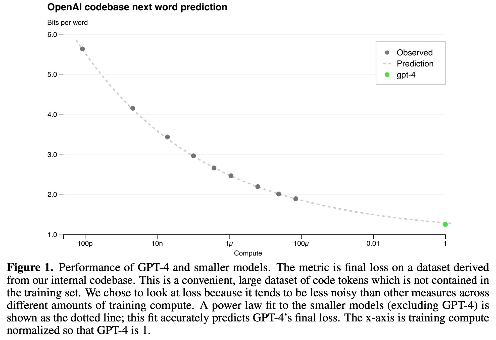

Other than the pace of progress on individual evaluations being extremely high, the landscape of evaluating leading language models has not changed substantially in the last year. The biggest change is the required level of detail in reporting results, where more information must be communicated to contextualize the capabilities of your models. The new types of models that OpenAI\'s o1 heralds welcome a new axis to this, evaluation-time compute.

This article tracks four trends in evaluation I\'ve been following, or personally battling and cleaning up:

1.  How leading frontier labs have shifting needs for evaluation,

2.  How open-source efforts should standardize and collaborate on evaluation,

3.  How contamination affects evaluation results and best practices, and

4.  Inference-compute constant evaluations and pushing the bar up for the hardest evals.

All of these result in unexpected traps at every turn when trying to build language models. Traps that go very deep and make you question many pieces of your workflow. Traps that have hard-to-predict second-order effects on your outputs. What used to be solid, simple ground in evaluation now feels like quicksand.

## The causes of today's closed evaluation silos

Language model evaluations done within companies can only be compared to their peers with large error bars. As [evaluation scores have become central components of corporate marketing schemes](https://www.interconnects.ai/p/evals-are-marketing?utm_source=publication-search), their implementations within companies have drifted. There are rumors of major AI labs using "custom prompts" for important evaluations like GSM8k or MATH. At the same time, [OpenAI has released open-source code](https://github.com/openai/simple-evals) for configurations (and basic prompts) for their models.

It would seem that open-source language model builders should have an advantage in trust and comparability of models, but the open-source AI community also hasn't converged on a single rubric for evaluating language models. The experience that motivated this article has happened every time --- it is looking at an open weights model (such as Llama) and realizing we need to re-run evaluations on our own setup to get a sense of what is actually happening. This is very salient and hard to communicate to the general audience, where open means more reproducible. It should also mean the results are easier to interpret. What tools do we need for this?

In my article on "[Big Tech's LLM evals are just marketing](https://www.interconnects.ai/p/evals-are-marketing)," I didn't uncover the deeper reasons as to why can't fully believe these evaluations. Language model evaluation stacks are perceived as marketing because the evaluations have no hard source of truth. What is happening inside frontier labs is that evaluation suites are being tuned to suit their internal needs. When results are shared, we get output in the form of the numbers a lab got for their models, but not all the inputs to that function. The inputs are very sensitive configurations, and they're different at all of OpenAI, Meta, Anthropic, and Google. Even [fully open evaluation standards are hard to guarantee reproducibility on](https://www.interconnects.ai/p/reward-bench-reproducibility?utm_source=publication-search). Focusing efforts on your own models is the only way to get *close to* repeatable evaluation techniques. There are good intentions underpinning the marketing, starting with the technical teams.

Evaluation of frontier language models is every bit as much an art today as it is a science.

Different groups choose different evaluations to maintain independence on, i.e. making them a true test set, but no one discloses which ones they choose. For example, popular reasoning evaluations MATH and GSM8k both have training sets with prompts that can easily be used to improve performance. Improving performance with the prompts from the same distribution is very different than generalizing to these tasks by training on general math data.

Labs like OpenAI hillclimb by focusing on a few key evaluations and report scores on the core public set at the end. The key point is that some of their evaluations for tracking progress, such as the datasets for cross-entropy loss predictions in scaling from the GPT-4 report, are often not public.

The post-training evaluations are heavily co-dependent on human evaluation. Human evaluation for generative language models yields Elo rankings (popular in early Anthropic papers, such as Constitutional AI), and human evaluation for reward models shows agreement.

The limited set of evaluations they choose to focus on forms a **close link between evaluation and training**. At one point one evaluation of focus was MMLU. Now, GPQA is likely. Labs will change the evaluations to make them better suited to their needs, such as OpenAI releasing [SWE-Bench-Verified](https://openai.com/index/introducing-swe-bench-verified/). There are more internally we don't know about.

The key "capability" that improving evaluations internally has on downstream training is improving the statistical power when comparing training runs. By changing evaluations, these labs reduce the noise on their prioritized signals in order to make more informed training decisions.

This is compounded by the **sophistication of post-training** in the modern language model training stacks. Evaluating language models today involves a moderate amount of generating tokens (rather than just looking at log probabilities of answers). It is accepted that small tricks are used by frontier labs to boost performance on many tasks --- the most common explanation is one-off prompts for certain evaluations. Does Claude use its special thinking tokens when being evaluated on reasoning benchmarks? I have no way of knowing.

Depending on how your data is formatted in post-training, models will have substantial differences. For example, two popular, open math datasets [Numina](https://huggingface.co/AI-MO/NuminaMath-7B-TIR) and [MetaMathQA](https://huggingface.co/datasets/meta-math/MetaMathQA) conflict with each other in training due to small differences in how the answers are formatted --- training on both can make performance worse than with just one. Meta's models use a very specific format for MATH, [Minerva](http://research.google/blog/minerva-solving-quantitative-reasoning-problems-with-language-models/), while this varies substantially with post-training decisions.

In the end we are left with a few key points on the state of evaluating closed models:

-   We do not know or necessarily have the key test sets that labs are climbing on, so some evaluations are proxies (or worse, blissfully cheated on by training on text on the public web).

-   Inference of frontier models is becoming more complicated with special system prompts, special tokens, etc., and we don't know how it impacts evaluations, and

-   We do not know all the formats and details used to numerically report the closed evaluations.

There are *a lot* of asterisks to put on the state of closed evaluations. To get ahead of some comments, it is important to acknowledge that there are some very useful efforts by closed labs to communicate their evaluation efforts. Some include [OpenAI's prompts in simple-evals](https://github.com/openai/simple-evals/blob/main/common.py#L27-L85), OpenAI releasing entire evals to the community, such as [MLE Bench](https://openai.com/index/mle-bench/), or Meta's documentation on [reproducing their results with a popular open-source eval tool](https://github.com/meta-llama/llama-recipes/tree/main/tools/benchmarks/llm_eval_harness/meta_eval_reproduce)s.

## The challenges facing open evaluation tools

I recently [wrote about Nous Hermes 3](https://www.interconnects.ai/p/nous-hermes-3) and how we should consider the label of a "frontier model." I missed the details in the post that stated that Nous Research used the default [Eleuther AI evaluation harness](https://github.com/EleutherAI/lm-evaluation-harness) settings to evaluate their models. I quickly corrected this, but this increased the uncertainty of the situation --- why wasn't I convinced of the claims coming from an open model?

If I'm still not satisfied with the claims of the paper around "frontier model post-training," does this mean that the [Eleuther AI evaluation harness](https://github.com/EleutherAI/lm-evaluation-harness) cannot capture this title? The answer is that it can, but it would be tricky to do so right now. It is a problem facing the entire open model ecosystem --- we don't invest the requisite energy in building a common language for evaluation. The Eleuther evaluation harness isn't the source of the problem, but rather the focal point where the open-source community's concerns about evaluation will be discussed.

The crux of the challenge is trying to compare open-weight models to evaluations reported by closed laboratories --- we need to look at the maximum possible scores if we cannot do an apples-to-apples comparison. Right now, open models are usually taking a performance haircut by using evaluation recipes not closely matched to the model's training.

With open-weight models, we have the artifacts we need to completely master this problem. We don't necessarily have the investment or incentives to make this happen. Evaluation is expensive, extremely hands-on, and becoming increasingly bespoke per model.

There are many open-sourced evaluation tools for people to choose from. There's [Inspect AI from the UK Safety Institute](https://github.com/UKGovernmentBEIS/inspect_ai), [HuggingFace's LightEval](https://github.com/huggingface/lighteval) that powers the LLM Leaderboard, [Eleuther AI's evaluation harness](https://github.com/EleutherAI/lm-evaluation-harness) built on top of the infrastructure from their GPT-Neo-X model (around GPT-3 evaluation config), Ai2's coming soon library based on [OLMES](https://arxiv.org/abs/2406.08446v1), Stanford's Center for Research on Foundation Model's [HELM](https://github.com/stanford-crfm/helm), Mosaic's (now Databrick's) [Eval Gauntlet](https://github.com/mosaicml/llm-foundry/blob/main/scripts/eval/local_data/EVAL_GAUNTLET.md), and surely more I did not mention.

New people build a tool because they need complete control in order to understand the evaluation of the latest models, but doing so further fragments the community and delays the unification that is needed for progress. Eventually, there will be a standard evaluation. I expect it to be built on the Eleuther harness.

The Open LLM Leaderboard currently has a mix of pre-training and post-training evaluations to serve their audience, but I'm not sure I see it as the *best* set of evaluations to use for an academic paper on pretraining *or* post-training. **Evaluating (open) frontier models in the open should use a default set that the community agrees upon**. This will be one set for pretraining and one for post-training, likely after substantial disagreement and discussion.

What we lose in flexibility, by tailoring evaluations to our models, we gain transparency and trust, which should be the strength of the open-source community. If you want to standardize around what we are using at Ai2 for the OLMo models, feel free to get in touch.

My biggest recommendation for post-training is to support wrappers / specific configs for Eleuther harness that better represent models. It's not clear if we can converge here, as closed labs are not, but **we should make a concerted effort to standardize.**

There was a fragmentation in tooling away from Eleuther's harness as post-training researchers shifted to generative evaluations --- those where the model generates tokens following its chat template --- rather than direct classification tasks. It is expected that it would be harder to implement this in a library that handles the vast majority of evaluation work in the open community. This is when Ai2's fine-tuning group [added an evaluation regime to open-instruct](https://github.com/allenai/open-instruct/tree/main/eval) (which has now been imported into more standardized setups).

An example evaluation used by Nous Hermes 3 and the Open LLM Leaderboard that doesn't really make sense for fine-tuned models is the BigBench Hard, multiple choice variant. This is normally evaluated with chat templates and generative responses --- the chain of thought format.

All of these examples go to show there are many details that are very easily forgotten when learning about a new model, but taken together over many releases are crucial to the health of the community. We need much more support for the boring work of standardizing evals and understanding from leadership at open companies that that could make the engineering efforts slower on training their models. Without it, there will be no foundation to stand on for making bold claims about a new open model --- we'll be stuck in the cycle of hype, followed by evaluations trickling in over the next few days.

------------------------------------------------------------------------

## Frontiers in evaluation

The state of open and closed evals is locked in for the years to come. Closed models are hiding a lot of the details driving their development behind high evaluation numbers (which is understandable). Open models are going to be trickier to push to the same limits because of the added friction of standardizing or supporting external parties. This will still result in much more believable scores.

Outside of this, there are two important directions in evaluation worth keeping an eye on.

1.  How synthetic data can reveal and or worsen contamination (training on test sets), and

2.  How the need for harder evaluations will create an entire economy of evaluation, which may come back to help the open community.

First, with the synthetic data story.

### **New types of synthetic data contamination**

We can't know exactly how bad our open versus closed evaluation debates are until we have more transparency, as synthetic data generation pipelines are starting to show the cracks. Even well intentioned developers can end up with substantial contamination.

I\'ve been tracking down a report of data contamination on some of the top-performing reward models on the [RewardBench](https://huggingface.co/spaces/allenai/reward-bench) leaderboard. The reported contaminated dataset is largely composed of synthetic *prompts* created with the recent [MagPie](https://arxiv.org/abs/2406.08464) method. MagPie essentially prompts instruction-tuned open-weight language models to create prompts and then instructions with clever manipulation of the chat template, and there are now [quite a few examples in the ecosystem](https://www.interconnects.ai/p/artifacts-log-3-synthetic-and-math). Having this be the source of contamination is truly wild \-- a language model regenerated up to 13-word direct matches of the prompts in the evaluation set.

This method of contamination has some humbling takeaways:

1.  It *can* expose open-weight language models to the fact that they\'re trained on test sets. We are far from being able to prove that they did.

2.  Dataset contamination can now come from many more sources than previously thought. If powerful models output verbatim prompts or outputs of popular evaluations, substantially increased contamination will come with the growth of synthetic data.

Previously, contamination only occurred when someone \"accidentally\" put the data in the wrong spot. Some of these are hard to keep track of, such as OpenAI\'s process reward dataset PRM800k having evaluation prompts from the popular MATH eval because they weren\'t evaluating against it. Hence, many people working with that dataset unintentionally cheated on MATH.

If you\'re interested in comparing specific prompts or running code like this yourself, see the more [technical Gist](https://gist.github.com/natolambert/1aed306000c13e0e8c5bc17c1a5dd300) where I include all this information and cleaned versions of the dataset. You\'ll see that RewardBench actually has contamination in addition to the synthetic data, which comes from the type of innocent-ish error above. When building this benchmark, we re-used some prompts from other evaluations, but one of the evaluations we used took prompts from popular instruction tuning datasets, e.g. Alpaca. Now, any dataset derivative of Alpaca has a little bit of contamination, e.g. Nvidia\'s HelpSteer.

Data decontamination tools and workflows, like [this from LMSYS](https://github.com/lm-sys/llm-decontaminator) for rephrased data, are woefully under-prioritized in the community. Any substantial open-source model should include pipelines for addressing this in the replication of the results. We'll be sharing how we approached this for our Tulu 3 RLHF models at Ai2 in a few weeks.

### **Building harder evaluations**

[OpenAI's o1](https://www.interconnects.ai/p/reverse-engineering-openai-o1) taking a major step towards solving GPQA marked a shift in how evaluations are created. [GPQA](https://arxiv.org/abs/2311.12022), A Graduate-Level Google-Proof Q&A Benchmark, is culturally the successor to MMLU, and it is much harder. As we move through the generations of evaluations, the process for creating them becomes entirely different, rather than just harder.

Early popular evaluations, like MATH, source problems from textbooks with some cleaning. Now, problems need to be created entirely from scratch.

At the same time, we need a wider range of relevant evals than ever. Scaling inference compute can dramatically change performance, but small models still matter too. We need eval suites that are well-matched for things like Llama 4 1B and OpenAI's o2.

Next, evaluations need to be created entirely by experts. Expert-driven evaluation is an underlying theme of the new evaluation project from Scale AI and The Center for AI Safety --- [Humanity's Last Exam](https://scale.com/blog/humanitys-last-exam). This evaluation is crowdsourcing the hardest possible questions and rewarding contributors from a pool of \$500k.

As the price of making a *single* good evaluation approaches millions of dollars, a new industry will be born. A mix of companies will be born --- those creating carefully curated evaluations that make licensing or collaborating deals with companies training models and automated LLM-as-an-evaluator companies. Scale AI is obviously going to try both. Even OpenAI announced that "[evals will be free if you share them with OpenAI](https://help.openai.com/en/articles/9930750-sharing-evaluations-with-openai)," at DevDay, because the value of good evaluations is way beyond the cost of inference.[1](#footnote-1){#footnote-anchor-1 .footnote-anchor component-name="FootnoteAnchorToDOM" target="_self"}

This makes the proposition of websites like [Artificial Analysis](https://artificialanalysis.ai/) (congrats on the [AI grant](http://aigrant.com/)) as companies become real. Of course, this isn't a perfect fit, but there's a large niche for trusted analysis and evaluation of models. LMSYS is an organization doing this well with their arenas, they're just not a business right now.

We're still early in the AI adoption cycle. Evaluation needs to stay relevant, otherwise, there's no hill to climb on, and as that becomes harder, more resources will flow to the people doing it well. Part of this will be done in-house by labs, but there will always be the need for external validation of new models --- to make true validation sets for the AI industry.

------------------------------------------------------------------------

*With social networks locking down links, if you can share this Interconnects post with an interested friend, it would go a long way! Have a great day!*

**Housekeeping**

-   Audio of this post is available (soon) in [podcast](https://www.interconnects.ai/podcast) form (and sometimes on [YouTube](https://www.youtube.com/@interconnects)).

-   My casual podcast is at [retortai.com](http://retortai.com).

-   *Paid subscriber Discord access in email footer.*

-   Referrals → paid sub: Use the [Interconnects Leaderboard](https://www.interconnects.ai/leaderboard).

-   Student discounts in [About page](https://www.interconnects.ai/about).

:::: {.footnote component-name="FootnoteToDOM"}
[1](#footnote-anchor-1){#footnote-1 .footnote-number contenteditable="false" target="_self"}

::: footnote-content
but naturally there are limits: "Through the end of 2024, evaluations you share with OpenAI will be processed at no cost **(up to 7 per week)."**
:::
::::
