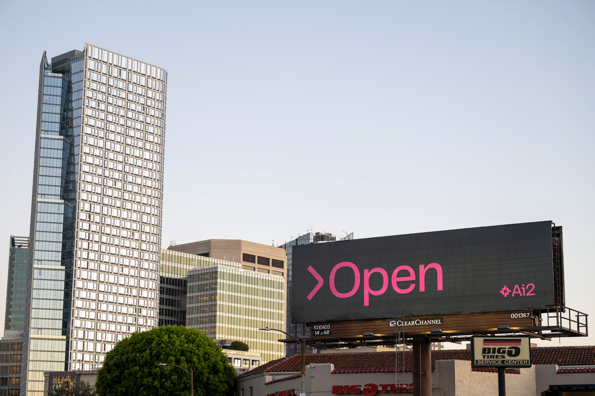

*Given the personal nature of this post, I had a lot of fun with the voiceover.*

Today, the 30th, is my 30th birthday and my first anniversary at the Allen Institute for AI, so I wanted to indulge myself with a rare personal reflections piece on why I do what I do. At a high level, the work at Ai2 and here on Interconnects has been exactly what I would\'ve wanted and expected. At Ai2 we are trying to accelerate the science of language models so academics, regulators, and everyone else can keep up with the many parties trying to accelerate the commercialization of AI.

AI is much more than language models, but with language models, we have an opportunity to have an outsized impact as community norms and early regulation are built.

This has been a year of training models, building evaluations, forming coalitions, talking to policymakers, and everything in between. I\'m just as motivated as I was when I started because it doesn\'t feel like the big picture of the situation has changed at all. AI is still the definitional technology of my lifetime and there is a huge opportunity for upside (and mitigating downside, if that\'s your framing of choice).

The reasoning as to why we need open-source models feels innate to my work in the last 18 months. It is important to communicate *why* open models are likely to be better off for the world.

Not partially open, but truly open. Open in a more compelling way than any other technology valuable enough to be the focus of major technology companies has been before. Open to all. Transparent, controllable, trustworthy, and inclusive.

Most of the arguments I see and hear for open-source AI are limited in their scope because they feel like damage control. This goes to the point that the primary force [driving the narrative of open-source AI is in fact another large technology company](https://www.interconnects.ai/i/146932988/zuckerbergs-vision-for-open-source-ai-vs-reality), Meta, in order to better [commoditize their complements](https://www.joelonsoftware.com/2002/06/12/strategy-letter-v/). Meta wants to make their competitors weaker, which largely equates to maintaining their own concentration of power. It's the right strategy for them, and [Zuckerberg's writings on the matter are very compelling](https://about.fb.com/news/2024/07/open-source-ai-is-the-path-forward/). The important section of that post is in "Why Open Source AI Is Good for the World," as the explanations for why open-source is good for Meta and Developers are already evident.

Open-source AI is obviously good for reducing the concentration of power (something I think is the [heavy focus of organizations like Mozilla AI](https://blog.mozilla.org/en/mozilla/ai/public-ai-counterpoint/)). Open-source is fantastic for building robust systems (such as finding this year's [XZ backdoor](https://www.wired.com/story/xz-backdoor-everything-you-need-to-know/), and [more analysis on Stratechery](https://stratechery.com/2024/the-xz-backdoor-what-happened-open-source-safety/) \$). Open-source is fantastic for education and research, which brings in more perspectives to work on it.

Outside of Meta, the deepest motivations for the passion for open-source AI are fears of AI *development* going wrong. These are stories of repeating the same mistakes we made with recommender systems, social networks, and the internet writ large. These are stories of not bad actors, but negligent actors, deploying powerful technologies in ways that often become nefarious without oversight.

Meta being the de-facto open-source AI doesn't cut it for people. So long as one for-profit company holds a majority share in the practical definition of open-source AI (especially when their messaging doesn't make sense with the principles of open-source), we are not going to see the truest possible benefits. In many ways, the [current efforts to create a definition for open-source AI](https://www.interconnects.ai/p/defining-open-source-ai?utm_source=publication-search) have [too much agreement](https://www.interconnects.ai/p/flavors-of-open-source-ai?utm_source=publication-search). Much like the often contentious early history of open-source software in the 1990s, we have a lot to learn before we know exactly what the open-source AI ecosystem looks like. Regardless, the definition we converge on needs to work without Meta, which may stop releasing models at any time and use licenses that are broadly prohibitive.

This is to say that futures like [Machines of Loving Grace](https://darioamodei.com/machines-of-loving-grace), Anthropic CEO Dario Amodei's optimistic view of the future, is the baseline for what the world can look like with more open AI. We have a few of these cases for open-source AI, such as Dean Ball's [work on Hyperdimensional](https://www.hyperdimensional.co/p/be-embraced-ye-millions) through the lens of Progress Studies and Daniel Jeffries' writing at [Future History](https://danieljeffries.substack.com/p/open-weights-open-society-open-future).

My optimism for open-source AI takes on every key issue we care about with technology:

-   We will have more secure software. The closed world builds equivalents to Crowdstrike outages, where open-source vulnerabilities are scaled to have proportional monitoring.

-   More stakeholders will be involved in AI's development, building on expertise directly relevant to subproblems in training leading AI models (such as [some of my work with social choice researchers](https://arxiv.org/abs/2404.10271)).

-   More people will be able to use AI.

-   Data can remain with the organization that owns it.

-   Profits from AI systems will be driven to product builders rather than larger platforms that define the likes of Apple, Google, Meta, etc. A more diverse economy is more robust and distinctly American.

-   Regulators can inform policy with direct access to systems and not rely on facilitated access from companies.

AI is more important to get right because of its cultural intensity to users. AI models *are* relationships for many people rather than just being the *medium to facilitate* interactions. As AI *is* the information itself rather than routing, the [values behind the work are crucial](https://www.interconnects.ai/p/name-image-and-ai-likeness?open=false#%C2%A7culture-and-ai-development). Anthropic's culture helps them [build Claude in such an intriguing way](https://www.interconnects.ai/p/switched-to-claude-from-chatgpt) but leaves them in the [crosshairs of more cultural questions down the line of scaling](https://www.interconnects.ai/p/ai-safety-culture-vs-capitalism). Open-source de-escalates culture. Control is *not* *democratized* because few organizations have the resources to partake, but the details and decisions are all transparent for the world to adjust to.

A flourishing open-source AI ecosystem is still one that will have closed models of many varieties. Openness is a spectrum. It also does not mean the first time the world will know about every model existing is it appearing on HuggingFace --- much of AI oversight is irrespective of its release mechanism. [Many of the risks that "experts" expected open-source models to proliferate, from disinformation, biosecurity risks, phishing scams, and more have been disproven](https://arxiv.org/abs/2403.07918v1).[1](#footnote-1){#footnote-anchor-1 .footnote-anchor component-name="FootnoteAnchorToDOM" target="_self"}

There are clearly issues with releasing some types of AI models. The literature is populated with numerous articles from groups trying to find issues with current practices. Building out the benefits takes more vision and commitment --- predicting realistic views for the future is almost always impossible.

## Bending the trajectory of progress

White rice research. That's how I describe my job building language models at the Allen Institute. We are normally releasing language models that are very solid, but maybe not quite beating Meta's Llamas. We are making them easy to build on and understand, so entirely new research groups can pick up ideas we didn't have time to finish. We are documenting every step of the way. Documentation and maintaining large data repositories on HuggingFace is boring, yet it is the marginal item that dramatically increases reliability in the long term.

Largely, most of the work I do is not something I would consider particularly novel. It is the price we must pay now in order to work on fun and exciting things for the next decades of AI outside of big tech.

Our central models, [OLMo](https://www.interconnects.ai/p/olmo)s, are best understood as research infrastructure more than just standalone artifacts. Still, we're at the cutting edge and sometimes get things right that the frontier labs haven't cracked, such as the dataset behind our first [multimodal language model, Molmo](https://www.interconnects.ai/p/molmo-and-llama-3-vision?utm_source=publication-search). Any academic in the language processing space knows that Ai2 has been leading for quite some time --- we've just needed to make the transition into large-scale training.

The more opinionated lens for the Allen Institute for AI is that it is what OpenAI originally seemed like they were going to be. We have enough resources to train solid models (maybe not 400B yet), communicate them, and maintain the tooling in the future.

All of this sounds almost too easy.

As most AI laboratories are, we're facing headwinds as the [web closes its archives for AI training](https://www.interconnects.ai/p/the-data-wall?utm_source=publication-search), could easily utilize 10x the compute we have, and force huge responsibilities on outstanding individuals willing to champion a better future for AI.

In my area, I still think we have been up to years behind closed reinforcement learning from human feedback (RLHF) efforts. The [state-of-the-art preference tuning dataset is over a year old](https://arxiv.org/abs/2310.01377), yet so much elsewhere in LLMs has advanced.

In chasing capabilities, we are barely staying above water keeping up with other labs. At the same time, the canonical operating of language models is shifting. Industrial RLHF is about desirable behaviors for users and exotic models like [OpenAI's o1](https://www.interconnects.ai/p/reverse-engineering-openai-o1).

There are also not many true allies of open-source AI. Even when I met Yann LeCun for the first time this year, one of the few things I remember him saying to me and a group of friends of open-source AI is "I need the help fighting the good fight."

The deep machinery of big tech will manifest large AI models to their near-best capabilities --- they're financially committed. There is substantially more room for impact in training open models. By bending the curve now of the Open, we are determining if there can be an open-source AI in the future. Even if the future would be better, regulatory or market capture can prevent such outcomes.

We need more people who are willing to fight this fight. It is clear at Ai2 that a small handful of people drive most of the progress on OLMo. As we gain momentum, more are joining, but it only happens when the point clicks in their head. The opportunities afforded to individuals are some of the most straightforward paths to major impact I expect to see in my career, but they are not the traditional paths we've been trained on. There are no other groups offering this type of work as *the number one priority*.

If you have experience in training leading language models and want the field to remain scientific in the future, this is pointed at you. Waiting for options to vest at big tech is too slow to make the difference here. There is far more marginal impact to be had in roles where outputs are open.

Through writing here and working in such a simple environment, I've seen my impact on the field multiply. The choices of what to work on primarily are asking myself about how obvious the problem is --- some sort of special, mixed academic industrial decision making. We don't have an evaluation for an important part of the alignment process --- let's build a benchmark. All the closed labs are approaching RLHF differently than academics --- let's just do what the closed labs are doing and share it. What is "next" after that is to be determined in 2025.

If this is you, please get in touch whether or not Allen Institute is the exact open place you end up at. It's been very fun and I'm just going to keep going. I have some new stuff to share very soon.

*Thanks to Luca Soldaini for feedback on this post.*

:::: {.footnote component-name="FootnoteToDOM"}
[1](#footnote-anchor-1){#footnote-1 .footnote-number contenteditable="false" target="_self"}

::: footnote-content
There are clear risks for generating images, and I'm glad to not be working on those right now. We likely need narrow regulation for it.
:::
::::
