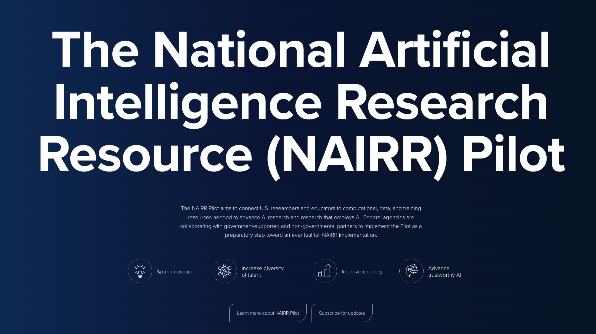

To the extent that AI's leading laboratories and individuals were waiting for the results of the 2024 United States elections, they were looking to avoid blame for any wrongdoing and see the path forward. A second Biden administration would've been honing and refining much of the same talking points, whether or not they were good ones, and a Trump administration now has us staring down the barrel of starting over on AI policy at the federal level. The most defining policy feature of the first Trump term was trying to undo what came before him from his counterparts across the aisle. There are countless issues worth studying here --- chips, China, safety vs. "woke" AI, and so on --- I hope to comment on the ones that I have something more specific to say.

I want to make the case for the NAIRR - the National AI Research Resource.

The NAIRR is positioned as a major bridge between the federal government, large technology companies, and most importantly the scientific institutions within the U.S. The NAIRR was one of the many initiatives started in the [Biden Administration's 2023 Executive Order on AI](https://www.whitehouse.gov/briefing-room/presidential-actions/2023/10/30/executive-order-on-the-safe-secure-and-trustworthy-development-and-use-of-artificial-intelligence/). It was provisioned as the following (emphasis mine):

> Within 90 days of the date of this order, in coordination with the heads of agencies that the Director of NSF deems appropriate, launch a pilot program implementing the National AI Research Resource (NAIRR), consistent with past recommendations of the NAIRR Task Force. **The program shall pursue the infrastructure, governance mechanisms, and user interfaces to pilot an initial integration of distributed computational, data, model, and training resources to be made available to the research community in support of AI-related research and development.** The Director of NSF shall identify Federal and private sector computational, data, software, and training resources appropriate for inclusion in the NAIRR pilot program.

NAIRR is not about training USAGPT (like [BritGPT](https://www.theguardian.com/technology/2023/mar/15/uk-to-invest-900m-in-supercomputer-in-bid-to-build-own-britgpt)), rather NAIRR is for building infrastructure that others can use to build, understand, and use cutting-edge language models. I've heard multiple estimates that the government, without substantial intervention, could mobilize on the orders of low billions of dollars for AI resources. A training-focused approach to procurement would result in most of that money going to Nvidia and the expertise falling in the hands of a few people.

With this, came a recommendation for the federal agencies to figure out which pieces of their infrastructure (or data) could be useful to AI. Largely, this has already happened:

> To assist with such work, within 45 days of the date of this order, the heads of agencies whom the Director of NSF identifies for coordination pursuant to this subsection shall each submit to the Director of NSF a report identifying the agency resources that could be developed and integrated into such a pilot program.

In the last year, the NAIRR has done a lot of hard work on procurement. This looks like compute and credits from the biggest technology companies and AI labs combined with data and resources from federal agencies. I've benefited from API credits in the NAIRR pilot program for my work --- it's nowhere near a major amount of compute, but a good example of where the money goes. This long, slow process of procurement is a classic government process --- one that is foreign to many Silicon Valley types. It takes a long time for the government to get going, but it can do things no company would take on. NAIRR was working.

In some ways, this procurement was coming at the perfect time, when academic AI laboratories can't scale up their processes as fast as big tech and are losing a large amount of relevance. Academics losing relevance results in the scientific side of AI being increasingly separated from the real systems changing the world. Doing NAIRR in 5 years, rather than today, may just not be useful for the outcomes that motivate it.

NAIRR is poised to go away, and with it, a large opportunity to balance the research ecosystem. The executive order only funded NAIRR until the end of 2024 and needs congressional action to fund the remainder. A senate bill was proposed to fund it for multiple years, the Creating Resources for Every American To Experiment with Artificial Intelligence Act of 2023 --- i.e. the [CREATE AI Act](https://www.congress.gov/bill/118th-congress/senate-bill/2714/text), but it hasn't made it out of committees. It's very unlikely for it to do so anytime soon. New action is needed to revive what will be a dead NAIRR program on January 1st, 2025. I'll be happy if my political understanding is proven wrong.

I worry scenarios alternate to NAIRR-style approaches like the new administration is going to spend some of its precious resources building a language model, when it should be enabling the existing academic and non-profit ecosystem to do it *with* them.

The challenge facing these programs is that AI is not new, but the recent investment in it is very new. Language models represent a dynamic paradigm of technological development, yet all of "AI" broadly is targeted by these executive orders and procurement programs. It's very easy to politicize and bog down progress toward infrastructure for language model (and their peers) due to AI already being everywhere and everything.

I haven't commented on NAIRR because it is obviously imperfect. I wanted to see it refined, clarified, and matured, but the parties at play weren't clear to me. **Now, it is clear as day that a world without NAIRR could set back the academic AI ecosystem by months to years**. The biggest problem with the NAIRR is that the Department of Energy was largely excluded from it by housing it within the NSF, but they are the federal agency with the most relevant experience in operating large-scale computing systems.

Further support for my position on federal AI infrastructure has come from Miles Brundage, who recently left as a lead policy researcher at OpenAI, [on his new Substack](https://milesbrundage.substack.com/p/ai-policy-considerations-for-the):

> Federal AI legislation could also give key AI-related agencies the authority to hire more quickly and offer higher salaries than is possible today, which relates to our next point. 
>
> **Investing in government capacity.** In order to pull off any of Trump's agenda effectively, including fostering economic prosperity, his administration will need AI experts who understand what's going on, can make sense of the information companies give them, and ask the right follow-up questions. Moreover, for efficiency, it is very helpful for government to have a dedicated AI team that other parts of the federal government working on AI related projects (e.g., the Department of Defense, Department of Energy, etc.) can consult for questions, advice, and feedback on approaches. 

------------------------------------------------------------------------

### Do we need an AI research resource or an LM research resource?

There are many reasons to build infrastructure for public versions of AI alongside the expansive private buildout. There are different forms of "getting things right" depending on the timescale and the intervention one would take to "make things right." Some of them are:

1.  Transparency into techniques powering state-of-the-art AI tools, so we can inform better policy.

2.  Resources for third-party evaluation and testing of closed models.

3.  Resources to enable academic and non-Big Tech participation in understanding this new technology.

4.  Resources to enable the economy of AI to work on longer timescales through sustainable, breakthrough research.

5.  Resources to enable the open-source ecosystem to enable the benefits that come with it.

All of these are about capitalizing on the opportunity coming from technologies immediately downstream of ChatGPT.

The biggest challenge facing NAIRR and any programs like it is to keep any funding on track to do the impactful thing. ChatGPT-class technologies were unusual where we had a substantial overhang in the underlying technology, causing them to explode onto the scene all at once in experimental products. Normally, the investment and iteration take many more years to find market fit. Over those years, systems would be entrenched before a technology is crucial.

What is different about these new forms of AI is that everyone agrees that they are transformative and that governments are attempting to be involved from day 1. Agencies creating early policy for AI today need to remember that language models are why they are interested --- this is the technology they need to govern correctly. Fixing all of AI can come later.

Without focus, many parties will latch their weight to the "AI wave" that has nothing to offer and will reduce the effectiveness of any interventions.

There is a large history in CS research of throwing a new technique at an old problem and *saying* it is better with "novel research" when in reality the new method is marginally better and or worse. How do we make the new programs focused on narrower projects that actually improve outcomes and transparency for the public? How do we prioritize AI research specifically versus applications AI research (it seems like a lot of work is on the latter)?

We deal with this a lot internally at Ai2. It is trying to navigate the discussion of who should actually get compute. It is a straining question to need to directly tell people their work is not valuable by stating their resource allocations. The process does not work without clearly stating priorities --- something that has tended not to be needed in a previous, slower, era of AI development.

This type of control is why I tend to be opposed to the phrase *democratizing AI*. By definition, control of this sort is not democratic. Public initiatives for AI are about supporting the public, not about public access to all of AI. It is especially not realistic to expect the public to control the future trajectories of AI, which would be actual democratic influence.

When building organizations that are competing with, or trying to stay relevant to, organizations with more resources, the only way to stay relevant is to be more critical of allocation. To the public, this is almost an existentially freezing decision. Large models for weather, hard sciences, and all that should come after we are sure that the public has insight into the core technologies driving the AI boom.

With something like NAIRR continuing, we are moving past the initial procurement phase of public AI compute into decision-making and execution. This can be seen as a procurement of talent, personnel, and specific focus. Continuity is valuable.

------------------------------------------------------------------------

## Policy outlook/roundup

There are always lots of things to keep up with in the AI policy space. There are a few more things that have been on my mind.

#### 1. State legislation risk

With a reset in Federal AI policy comes a bigger power vacuum for state legislation. We've gone through this big dance once with SB 1047, but there are many smaller examples such as [Colorado's bill](https://gazette.com/opinion/guest-column-more-clarity-needed-from-colorado-s-new-ai-regulation/article_1c8c58b6-12ea-11ef-abb5-1f536b4eab44.html) and [Texas's recent bill](https://www.hyperdimensional.co/p/california-hold-my-beer). I expect a few more of these in the next year. Academia has a huge exposure risk to open-source, and partially open models like Llama, being hindered by sloppy legislation.

#### 2. Elon vs Trump on AI Safety

On the topic of state regulation, we need to remember that Elon, now a verdant supporter of Trump, [endorsed the signing of SB 1047 into law](https://x.com/elonmusk/status/1828205685386936567?lang=en). There are movements to have Elon be a [lead advisor on AI to the Trump administration](https://www.theverge.com/2024/11/11/24291401/elon-musk-donald-trump-ai-policy). This sets up an immediate internal battle between the Big Tech elites that pushed for [Trump on agendas of "small tech" and deregulation](https://www.bloomberg.com/news/articles/2024-10-16/silicon-valley-s-andreessen-horowitz-give-millions-to-trump-pac). We don't know who will win over Trump's views.

#### 3. Fighting stupid anti-open-source takes

A [recent story came out](https://www.reuters.com/technology/artificial-intelligence/chinese-researchers-develop-ai-model-military-use-back-metas-llama-2024-11-01/) that was made to look like China was using American open-weight AI models to build weapons. This is a story we've expected for a long time. In this case, it was total nonsense, as the model used was Llama 1 or 2 13B --- a model that is extremely unstable and not cutting edge. Still, it takes a lot of policy work to make uninformed regulators not latch onto these stories.

What matters is if the *newest* open-source models enabled abilities that *are not possible with previous models* (either open, or closed, because they couldn't get access, but mostly open).

We have a lot of work to do on the messaging for why this type of international adoption of American AI models is important. [Some](https://www.hyperdimensional.co/p/on-civilizational-triumph) have [started](https://www.justsecurity.org/104676/american-ai-leadership-requires-support-open-source/).

#### 4. Agents are real and are coming

Much of our original AI policy was built under a worldview of large transformers and interfaces like ChatGPT. OpenAI's o1 and Claude's Computer Use opened up one-way doors to much weirder needs for regulation. Regulating agents will take a much more nuanced understanding of our internet economy and is one of the policy angles I'm most excited about exploring. It feels genuinely new and is something we need to get out ahead of.
