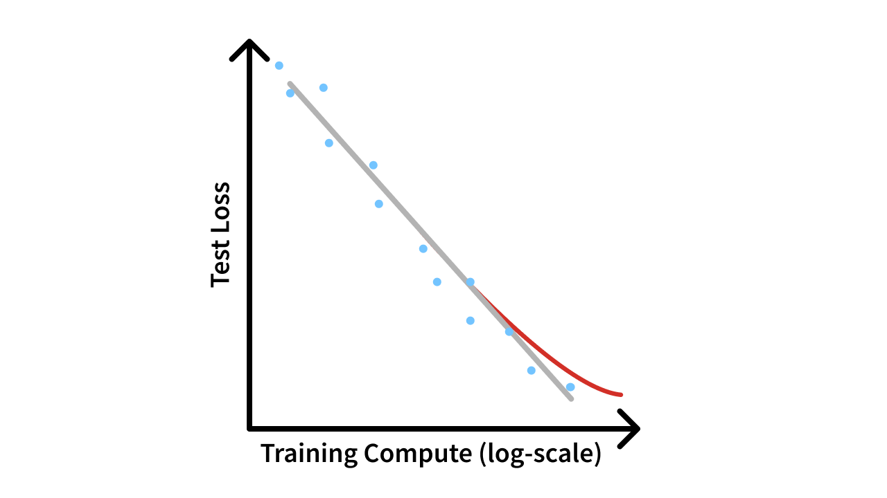

*Notes: this is a cleaned version of a long-post I shared on socials earlier this week. Second, there are a few final edits for clarity not reflected in the voiceover.*

There is a lot of discussion on whether \"scaling is done,\" with [stories from The Information](https://www.theinformation.com/articles/openai-shifts-strategy-as-rate-of-gpt-ai-improvements-slows) saying that the latest GPT models aren\'t showing what OpenAI wanted while Sam Altman still parades around saying AGI is near (and a [similar, more detailed story](https://www.bloomberg.com/news/articles/2024-11-13/openai-google-and-anthropic-are-struggling-to-build-more-advanced-ai) from Bloomberg on Gemini). We're still waiting for Gemini 1.5 Ultra and Claude 3.5 Opus, let alone the next indexing.

Both narratives can be true:

1.  Scaling is still working at a technical level.

2.  The rate of improvement for users is slowing. Especially the average user.

Without the performance gains clearly visible to users, launching the next scale of models is a strategic gamble.

Ultimately, a scaling law is a technical definition between test loss and training compute. This test loss does not necessarily need to be correlated with performance --- the central motivation of my recent post on scaling\'s impacts, but one that got caught up in a different focus on the AGI strawman.

::: {.digest-post-embed attrs="{\"nodeId\":\"4f06439d-6fad-475e-a699-60ed813d81b8\",\"caption\":\"Some housekeeping: I’m migrating the hosting platform for article voiceovers and interviews to Substack (from Transistor, which was also great) to make some long-term plans easier. Second, I’m going to partially phase out my AI-generated voice (fine-tuned as myself with ElevenLabs) in favor of real-life voiceovers. In the meantime, you’ll see some dupli…\",\"cta\":null,\"showBylines\":true,\"size\":\"sm\",\"isEditorNode\":true,\"title\":\"How scaling changes model behavior\",\"publishedBylines\":[{\"id\":10472909,\"name\":\"Nathan Lambert\",\"bio\":\"ML researcher making sense of AI research, products, and the uncertain technological future. PhD from Berkeley AI. Experience at Meta, DeepMind, HuggingFace.\",\"photo_url\":\"https://substackcdn.com/image/fetch/f_auto,q_auto:good,fl_progressive:steep/https%3A%2F%2Fbucketeer-e05bbc84-baa3-437e-9518-adb32be77984.s3.amazonaws.com%2Fpublic%2Fimages%2Fdda47b96-836a-4b95-99a0-f0ec744d4245_2316x2316.jpeg\",\"is_guest\":false,\"bestseller_tier\":100}],\"post_date\":\"2024-10-09T12:02:19.744Z\",\"cover_image\":\"https://substack-post-media.s3.amazonaws.com/public/images/71b55393-74ea-47c9-8331-1e14d3fc5330_2054x1738.png\",\"cover_image_alt\":null,\"canonical_url\":\"https://www.interconnects.ai/p/how-scaling-changes-model-behavior\",\"section_name\":null,\"video_upload_id\":null,\"id\":149893260,\"type\":\"newsletter\",\"reaction_count\":39,\"comment_count\":4,\"publication_name\":\"Interconnects\",\"publication_logo_url\":\"https://substackcdn.com/image/fetch/f_auto,q_auto:good,fl_progressive:steep/https%3A%2F%2Fsubstack-post-media.s3.amazonaws.com%2Fpublic%2Fimages%2Fe70f9dbf-4fe6-404c-b6bb-1831d1b7ed0b_590x590.png\",\"belowTheFold\":false}"}
:::

This post is just about one specific reality: **Scaling works and that doesn't solve all the economic problems for AI**.

Inside the labs, I\'ve heard nothing to say that scaling laws are stopping. If anything, the curves are starting to bend slightly away from a linear-looking power law, but by spending more, we\'re straightening them out.

The biggest blockers to *training* these models to test the scaling laws are physical constraints --- GPU allocation, power supply, permitting, etc. Some of these are modeling questions, like how to batch together training updates from multiple data centers or how to get more usable synthetic training data, but most of them are not related to the definition of scaling laws.

Even with scaling laws \"working," the perception of the final post-trained GPT-5, Claude 4, Gemini 2 class models can be underwhelming. This is because our goalposts are based on certain types of chat tasks.

A certain psychological conditioning happens for the best language models now, which has happened forever with humans. Because a language model, or human, sounds smart, we assume they can accomplish a diverse spectrum of tasks. Language models are getting robustness in capabilities we've largely already attributed to them. We're backfilling and pushing forward.

For general chat tasks, the models went from unusable to compelling but buggy with GPT 3.5, the o.g. ChatGPT. With GPT-4, normal chat tasks and coding and math became viable. With GPT-5, what is it expected to unlock? It\'s not clear to me what a better chat model would look like. Robustness is hard to get excited about.

OpenAI has backed itself into a corner with its messaging. Their messaging around AGI soon made people expect this to be in a form factor they know. Really, the AGI they\'re building is not contingent on GPT-5 being mind-blowing. It\'s a system that will use GPT-5 as one part of it. It'll be agents, like computer use, or even things that are entirely new form factors --- agents that are dispatched on the web. These views of "AGI" are entirely separate from what ChatGPT is.

All of this is to say that I find both arguments to be true. Scaling is working, as the AI true believers keep saying whatever the media environment is. Still, the product limits of current ChatGPT forms are hitting limits where a bigger model may not be the answer. We need more specialized models. [OpenAI's o1](https://www.interconnects.ai/p/reverse-engineering-openai-o1) is one of the first forays into \"something different.\" No one is making noises about that capping out this year or next.

With this, I still strongly believe there are way more products to be built with current AI that will unlock immense value. None of these trends doom the industry at large, but investments will slow if OpenAI et al. need to change their fundraising strategy.

We still have a huge capability overhang. Our ability to create specific capabilities in models is still growing very fast (e.g. by the expansion of post-training). I see a ton of low-hanging fruit and see no reason to be pessimistic about the trajectory of AI improvement, it is just important to ground where it is and what it is. This capability-product overhang takes two forms:

1.  Powerful AI models can do a ton of things today that either a) we don't know or b) we don't know other people will value.

2.  Scaling will keep making the models "better" in a technical sense, and we have no way to know what this may unlock.

All of us should be excited that companies are willing to risk their economic viability to explore this frontier. The benefits they find will last forever, whether or not the first batch of companies does.

*Thanks to at and many* *friends in the Interconnects paid Discord server for discussions that cultivated this post. The recent [Lex interview with Dario](https://youtu.be/ugvHCXCOmm4) has more useful commentary on the topic. If you like this type of shorter and to the point post, let me know!*
