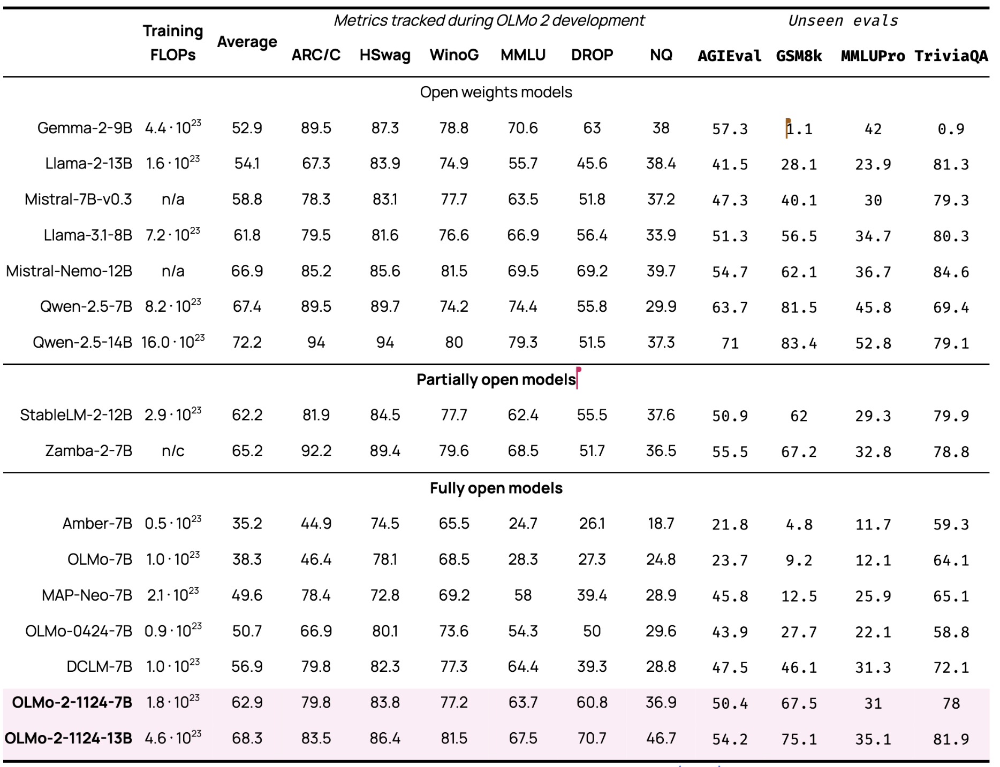

*Last week I appeared on the [Cognitive Revolution Podcast](https://www.youtube.com/watch?v=LVXtFnEbNU0) to discuss the state of post-training LLMs, Tulu 3, and how to manage large training projects like these.*

*Also, I'll be at NeurIPs in Vancouver in a few weeks. I'll be presenting a tutorial on language modeling, a casual talk on how to [approach post-training for applications at](https://lu.ma/g7wmzk04) Infer, and a few other related papers. Get in touch if you'll be going!*

*For just the OLMo 2 details, scroll to the bottom half of this post.*

------------------------------------------------------------------------

The practice of training language models (LMs) well is unfolding as a new type of culture and management structure within technology companies. What was born out of research labs is now the central domain of the most powerful companies across Silicon Valley. Language model training and capabilities are moving so fast that best practices, management, and efforts need to change with them.

Whether your team is training from scratch, i.e. pretraining and the rest, or just applying post-training on open-weight models, the following pieces are crucial:

1.  **Extremely detail-oriented technical contributors**: Often answers to what seems like small behavioral issues in language model training involve many layers of the stack. E.g. degradations in post-training abilities of code could be due to a fragile pretrain code model and are only visible in a few evaluation configurations. There are normally too many things going on to have people handholding these investigations. This is one of many forms of ownership that are needed.

2.  **Technical managers who are able to keep a ton of information in context:** As teams scale from 3 to 5 to 20 to 200 to thousands, there are multiple barriers that need to be passed in management. Once a project has over 5-6 core technical contributors, management and prioritization are just as important to building a good model as technical ability. These people understand what they may be giving up at the pretraining stage that can be gained in post-training for a better overall model. There are countless tradeoffs in building language models, often ones that rely on intuitions of second-order effects, and having people who know all of this context is the only way to avoid many dead ends.

3.  **Consistent effort over time**: Language model improvements come from [the accumulation of tons of minor improvements over time](https://www.interconnects.ai/i/148458085/compounding-improvements-the-key-to-building-better-language-models), which include the ability to slowly grow to bigger models through training stability enhancements. It is easy to get caught up in the urgency of one release or one milestone at the cost of long-term building. There's a fine line between cultures where people work too much because they feel obligated and cultures where they work too much because they love it.\
    \
    Only passion can enable sustainable overworking for a longer period than a few months, which is where team and organization culture can shift the needle in which model wins and which model loses.\
    \
    I've written extensively on how [culture impacts language models character and behavior](https://www.interconnects.ai/i/144874856/culture-and-ai-development%20%20is%20very%20important%20to%20models), which is part of what I attribute to [Claude being on top](https://www.interconnects.ai/p/switched-to-claude-from-chatgpt).

I don't have the internal management details of OpenAI, Meta, Google, or Anthropic, but we have spent the last few months at Ai2 deep in the trenches of the [Molmo visual language models](https://www.interconnects.ai/p/molmo-and-llama-3-vision?utm_source=publication-search), [Tülu 3 frontier model post-training recipe](https://www.interconnects.ai/p/tulu-3), and now OLMo 2 series of models. Many of our teams at Ai2 are approximately 10x smaller than the proportional teams at a big technology company.

The only exception is on core pretraining deciding which runs to click go on. It has been said again and again that maintaining an astronomically high compute per head on pretraining researchers is essential. Otherwise, anything finetuning-related and scalable like data acquisition or cleaning is very large. Adapting to vision, specific API model versions such as JSON mode, general post-training, etc can all have bigger teams. For example, Tulu 3 is a team of about 20 people for a post-training recipes to compete with Meta's 200-person post-training team.

The advice above reads as trite, but scaling to larger teams is what determines outcomes for model training. While language model training is moving so fast, the complexity grows faster than clear best practices can be established.

The need for deep technical ownership can be reflected across many parts of the organization. The gains being made in the language modeling process often look like simple, modular tasks. The best people accumulate many of these small improvements over time. Not every researcher, especially those that were trained in the same era as me and expected industry research to be open-ended freedom, wants to do this type of task. **A willingness to do what is impactful rather than what one views as interesting is a must.** This is part of why I think so many outsiders from physics, math, and hard scientists succeed in ML --- they are not burdened by past ways of approaching problems. Have no ego in your approach.

In the past few years, whenever I've seen someone focus on a reasonable area, making gains has been available. Normally the gains are blocked by either taking too complicated of an approach or trying to solve a problem that is too open-ended. At Ai2 we are also far further from the frontier of current models, so it makes the gradient much more obviously visible. "Feeling the AGI" etc. is accepting the reality of the potential for these models.

The problem with such green fields for improvements is managing who does what. It's easy to avoid big gains by just doing a naive ordering of experiments. **Brutal prioritization and insistence are the jobs of a great technical manager for training LMs**. For Tulu 3, I was a broken record advocating for scaling preference data. We spent a ton of time mixing data for SFT or setting up pipelines for DPO preferences.

Core ideas like scaling data can be put off just because the status quo is working. After a few weeks of this, we scaled the data, and it was coupled with large improvements on evaluations. This type of decision is what makes or breaks a recipe. It involves telling people to stop working on things they've been leading in order to pile on progress in the specific areas that need it.

The complexity of "putting things together" with the right managers (or product managers) is a big part of the challenge of getting things out the door. Even at Ai2 with small teams, it feels like we make sacrifices to get models out on time, with bigger companies, it is well harder. **There is an immense premium on making the deadlines you commit to and being okay with pushing capabilities, datasets, or training tricks until the next version**.

## OLMo 2

**Today we're releasing our OLMo 2 models at 7 and 13B parameters**. Since the original release of our [Open Language Models](https://www.interconnects.ai/p/olmo) (OLMos) effort in February of this year, we've made progress across the entire stack. You can try the 13B model on the Ai2 playground or learn more in the blog post (full paper coming soon). Overall, these are very strong models in their parameter class, fully open-source.

-   Get the models and datasets [here](https://huggingface.co/collections/allenai/olmo-2-674117b93ab84e98afc72edc) on HuggingFace.

-   Try the 13B Instruct model here: [playground.allenai.org](https://playground.allenai.org/).

-   A bit more technical details are in the [blog post](https://allenai.org/blog/olmo2) (paper soon).

On our multi-skill evaluation suite, OLMo 2 Instruct outperforms Llama 3.1 8B Instruct and Qwen 2.5 Instruct.

First, let's compare to other base models we have access to and documentation on the number of training tokens.

For applications and market share, FLOP efficient training isn't the final metric. End users matter there. Still, for academic progress and marking the progress of open-source vs. closed recipes, FLOP efficiency is a useful metric. It is the metric we use to secure more resources so we can train our models longer, closer to Meta Llama's 12 trillion-plus tokens, or Qwen 2.5's 18 trillion. OLMo 2 7B and 13B were trained on 4 trillion and 5 trillion tokens respectively. The full numbers for these models are below.[1](#footnote-1){#footnote-anchor-1 .footnote-anchor component-name="FootnoteAnchorToDOM" target="_self"}

With these base models, we did a full sprint to apply the [Tulu 3 recipe](https://www.interconnects.ai/p/tulu-3) in a very short timescale. We used the same SFT dataset, as all data ablations showed degradations within results, which account for the need for a balanced prompt distribution in a dataset. We followed the same on-policy preference data recipe. We finished with the same Reinforcement Learning with Verifiable Rewards (RLVR), which for 13B got us over 4 points at the end and added to MATH --- one of the most important evaluations people look at.

The full results for OLMo 2 Instruct are below. Note that none of our training focused on code, so we omit those evaluations relative to the Tulu 3 evaluation suite.

One of the important lessons from this release is the importance of multiple seeds when doing RL finetuning. With DPO or SFT, you can largely sweep over hyperparameters like learning rate and get great outcomes. With RL finetuning, you often need multiple seeds for each run. RL training is unstable, but once it finds a useful area to improve upon it really keeps cooking. Last night, we had about 1/2 the gains from RL, the last post-training stage, but woke up to a few extra points by just letting more seeds run longer.

I'll be sharing much more nuanced intuitions and ablation studies of why this new RL finetuning works.

For now, you really should give OLMo 2 13B Instruct a go. It's the first time for me that a fully open language model actually is good enough to use for some stuff. We're starting to cross the Rubicon and I hope that this enables new examples of things you can only do with open-source AI.

We'll have a full technical report soon. In 2025 we'll keep pushing the limits of fully open models --- scaling, advanced reasoning, agents, etc. It's all on the table.

:::: {.footnote component-name="FootnoteToDOM"}
[1](#footnote-anchor-1){#footnote-1 .footnote-number contenteditable="false" target="_self"}

::: footnote-content
A few models, such as Gemma 2, suffer from an issue where evaluations done in VLLM are notably lower than Transformers. We are investigating and will update some of these models slightly.
:::
::::
