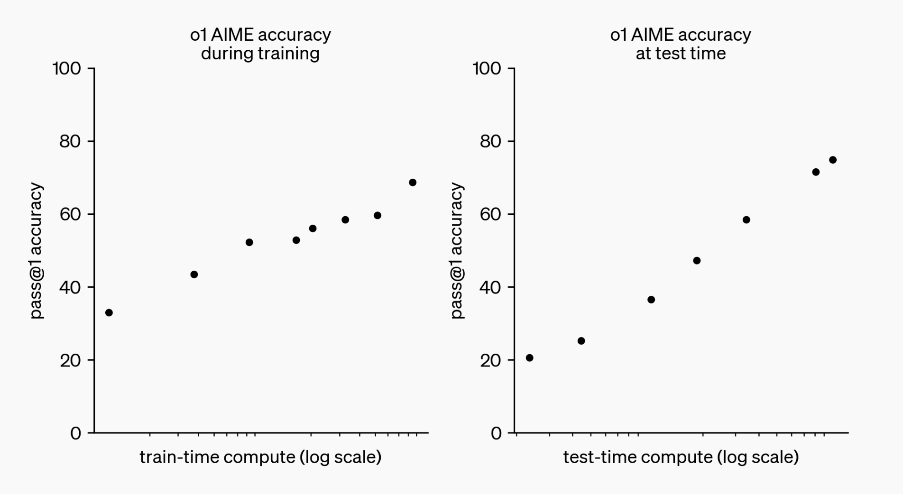
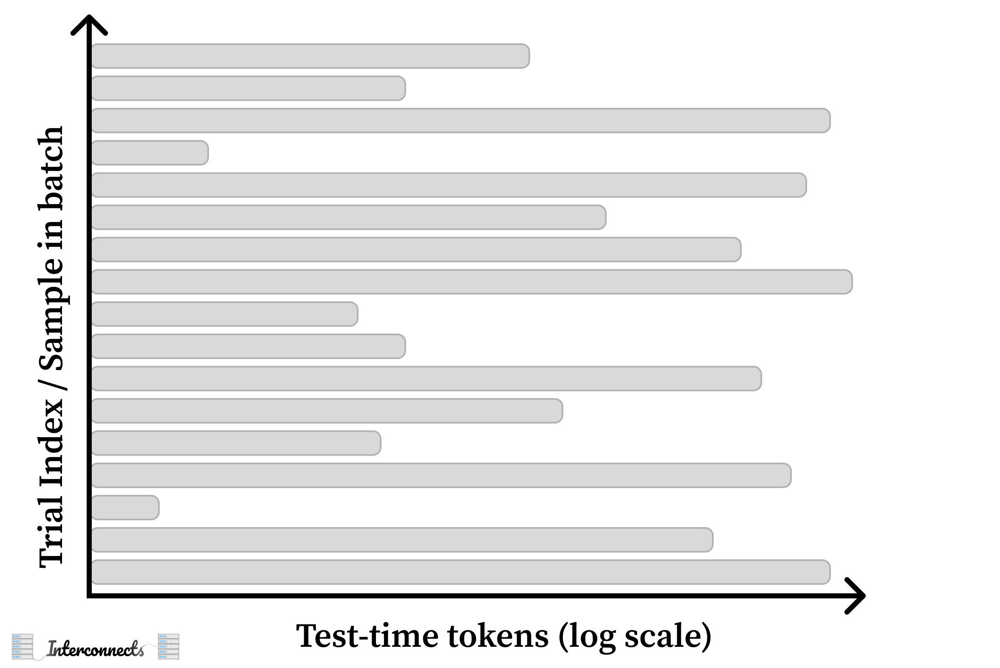
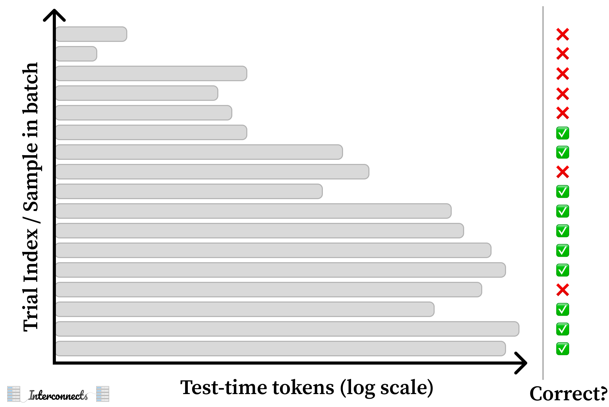
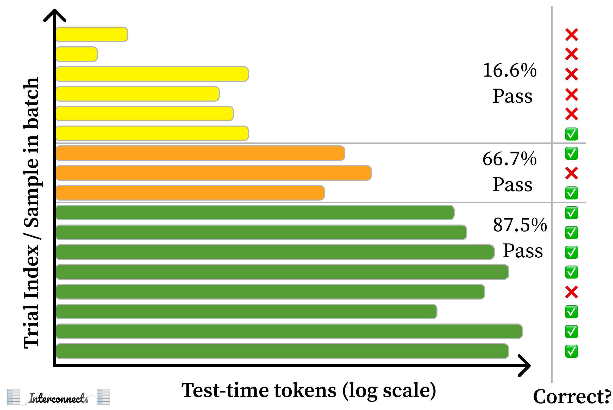
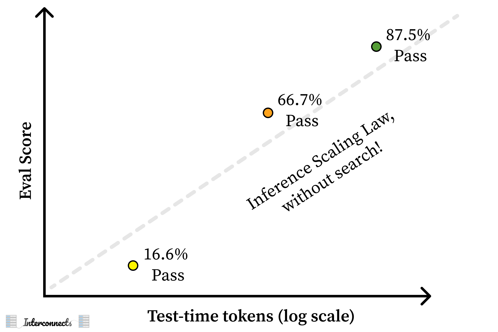

*Some housekeeping: I'm planning on raising the price of Interconnects in the new year. I'm producing a lot more content than I expected and the Discord server is doing fantastic. It's a good time to upgrade to an annual subscription --- this is effectively a large holiday discount until the price raises in 2025. Or, you can always [give the gift of Interconnects](https://www.interconnects.ai/gift)! Reminder --- I offer [80% off student discounts](https://www.interconnects.ai/student).*

*And this is a final reminder that I'll be at NeurIPS in Vancouver next week. Reach out if you're in town.*

------------------------------------------------------------------------

The launch of OpenAI's o1 was communicated to make people think that it actively used some sort of search (other than naive reinforcement learning), both at training and test time. Lots had been said leading up to it: The "self-play" in Q\*, Noam Brown leading a team to work on search at OpenAI, and lots of other smoke and mirrors.

In my first post on o1, I tried to take OpenAI's corporate communications and the media of their employees at face value to figure out what is going on: **What would it mean for OpenAI's o1 to be using search?**

::: {.digest-post-embed attrs="{\"nodeId\":\"af45f663-98e1-495a-b8c1-a16742f7f0f9\",\"caption\":\"On Episode 33 of The Retort, we discussed the Reflection 70b drama and more motivations for model specs and transparency.\",\"cta\":null,\"showBylines\":true,\"size\":\"sm\",\"isEditorNode\":true,\"title\":\"Reverse engineering OpenAI’s o1 \",\"publishedBylines\":[{\"id\":10472909,\"name\":\"Nathan Lambert\",\"bio\":\"ML researcher making sense of AI research, products, and the uncertain technological future. PhD from Berkeley AI. Experience at Meta, DeepMind, HuggingFace.\",\"photo_url\":\"https://substackcdn.com/image/fetch/f_auto,q_auto:good,fl_progressive:steep/https%3A%2F%2Fbucketeer-e05bbc84-baa3-437e-9518-adb32be77984.s3.amazonaws.com%2Fpublic%2Fimages%2Fdda47b96-836a-4b95-99a0-f0ec744d4245_2316x2316.jpeg\",\"is_guest\":false,\"bestseller_tier\":100}],\"post_date\":\"2024-09-16T12:02:51.364Z\",\"cover_image\":\"https://substackcdn.com/image/fetch/f_auto,q_auto:good,fl_progressive:steep/https%3A%2F%2Fsubstack-post-media.s3.amazonaws.com%2Fpublic%2Fimages%2Fd28d8c1d-bb4e-4fa2-8b9a-8c353c8c7450_1742x837.png\",\"cover_image_alt\":null,\"canonical_url\":\"https://www.interconnects.ai/p/reverse-engineering-openai-o1\",\"section_name\":null,\"video_upload_id\":null,\"id\":148935394,\"type\":\"newsletter\",\"reaction_count\":114,\"comment_count\":2,\"publication_name\":\"Interconnects\",\"publication_logo_url\":\"https://substackcdn.com/image/fetch/f_auto,q_auto:good,fl_progressive:steep/https%3A%2F%2Fsubstack-post-media.s3.amazonaws.com%2Fpublic%2Fimages%2Fe70f9dbf-4fe6-404c-b6bb-1831d1b7ed0b_590x590.png\",\"belowTheFold\":false}"}
:::

Today, I do the opposite --- **What would it mean for o1-like systems to use exclusively large-scale reinforcement learning with no process/intermediate rewards?** This includes no expansion of current steps in the reasoning chain as a "tree" or similar representations. This is the argument that all of the "search" in OpenAI's o1 (and some of the replications) is all within the reinforcement learning training behavior. Reinforcement learning algorithms "search" in order to maximize their internal value functions and extrinsic rewards in the environment, but it is far less intuitive how it is done than something like Monte Carlo Tree Search (MCTS).

The summary of the original post was that I viewed OpenAI's o1 as:

1.  Process rewards at training, providing reward signal per reasoning step (building on my [Q\* Hypothesis](https://www.interconnects.ai/p/q-star)).[1](#footnote-1){#footnote-anchor-1 .footnote-anchor component-name="FootnoteAnchorToDOM" target="_self"}

2.  Depth 1 search at test time with a per-reasoning-step verifier as a separate or built-in value head (e.g. a generative verifier).

Where do we start on the other path? Which assumption is wrong?

I was watching Professor Sasha Rush's great lecture, *[Speculations on Test-Time Scaling](https://www.youtube.com/watch?v=6PEJ96k1kiw)* (slides [here](https://srush.github.io/awesome-o1/o1-tutorial.pdf)), and it was obvious that we are at a fork in the road with respect to the types of AI systems we can build with language models. OpenAI's o1 models are the first of a new breed. Sasha explores 4 areas that could be involved in training systems like OpenAI's o1, listed as "The Suspects":

> 1.  Guess + Check
>
> 2.  Process Rewards
>
> 3.  Search / AlphaZero
>
> 4.  Learning to Correct

Particularly, to go against my first post I need to paint the case for how one can build OpenAI's o1 without any of the following:

-   Online search at test-time controlling the amount of compute spent --- i.e. **removing Search/AlpaZero from the suspects.**

-   Intermediate rewards supervising the training process --- i.e. **remove process rewards from the suspects.**

This leaves the suspects as "Guess + Check" and "Learning to Correct." These are the simplest ideas among the four.

Like all discussions of o1, to do this, we have to start with the seminal test-time compute plot to see where the ideas fit in.

What is implied by the test-time compute plot is that somehow the amount of compute spent can be controlled as a generation parameter. This is because the left plot, training-time compute, is definitely controllable by the modeling team. Pairing these together, where the left is a controllable regime and the right may just be points sampled from natural behavior, is very much pushing the narrative in the direction of controllable test-time compute.

The most intuitive version of this would be a branching factor in shallow search, but an alternate could be a prompt that just tells the model how long it can generate. For the latter, it is important to recall that OpenAI emphasized how this type of model could only have been made once long-context advancements were made.

The other way the test-time compute plot could be created is **by sampling generations and plotting the win rate versus the number of tokens the model used in its own standard autoregressive decoding.** What this looks like, is for the evaluation sets, sample from the model multiple times --- not necessarily just once per prompt, as is traditional. Then, we'll bucket the responses to the specific test-time compute regions the completions ended up in.

Here's a diagram showing the hypothetical scenario with multiple completions per evaluation prompt.

Next, group the evaluation runs by compute spent by the model and score the answers. Make sure that for each prompt, there are enough representative evaluations.

Finally, aggregate the scores. Convert test-time compute bins into scores, then sort the bins by compute spent.

Then, you can convert this into an inference scaling law --- without using any search.

Even if this is the case, I suspect OpenAI would develop the ability to control its generation length on its own, eventually. Even just the left half of the original OpenAI plot, scaling RL training, is potentially a step-change in how language models are trained.

**Second, with a simpler architecture, it is more important to control the training data**. There are two things that I think are important here: **verifications** and **continuations**. First, let's recall the basic terminology in the OpenAI o1 blog post:

> Our **large-scale reinforcement learning algorithm** teaches the model how to think productively using its chain of thought in a **highly data-efficient training process**.

The key question that comes up again and again in reinforcement learning from human feedback circles these days is "What data do you actually use for RLHF." Standard RLHF as we knew it from models like InstructGPT and Llama 3.1 is actually primarily about controlling style while marginally improving performance on a few capabilities. The signal is very weak, as seen by 80% of the Llama 3.1 preference data being "general chat."

What o1 does, and other projects are shifting towards, is get its reward signal explicitly from measurable outcomes --- **verifications**. OpenAI's o1 is trained on a large swath of prompts where a verifiable answer is present. This can be math problems, code bugs with unit tests, instructions with constraints, and other things. I suspect a large proportion of o1's training data is this, enabling the "data-efficiency" mentioned above.

OpenAI keeps training on these prompts, sometimes the model gets it right and learns from that, and sometimes it needs a helping hand. This is where **continuations** come in. Again, quoting the blog post, as highlighted by Sasha Rush:

> o1 learns to hone its chain of thought and refine the strategies it uses. It learns to recognize and correct its mistakes. It learns to break down tricky steps into simpler ones. It learns to try a different approach when the current one isn't working.

The data I mentioned above is all outcome-based rewards. In order to get there, OpenAI uses extensive LLM-as-a-judge feedback on intermediate reasoning chains. Existing language models can easily identify where a chain-of-thought goes wrong and can generate a next step for the model to try completing it correctly.

Corrections and continuations are in spirit very close to process rewards. The key difference is that the supervision I'm discussing in this proposal for o1 does not need to happen at every step --- there can be some set of steps that are checked only when a wrong final answer is reached.

In addition, OpenAI likely has other generative (learned) verifiers that go beyond cut-and-dry domains like math and code, but this area is much blurrier. It could be a very advanced reward model, it could be something entirely new, we don't know. Still, the last OpenAI blog post quote that Sasha Rush highlights showed us how important the feedback loop of continuations and RL was:

> When training a model for reasoning, one thing that immediately jumps to mind is to have humans write out their thought process and train on that. **When we saw that if you train the model using RL to generate and hone its own chain of thoughts it can do even better than having humans write chains of thought for it.** That was the "Aha!" moment that you could really scale this.

This is one long drawn-out synthetic data loop. The RL part is needed to induce the creative behaviors, that I truly believe, and all of the scaffolding around it is about guiding the learning signal forward.

The best part of this view, which has a whole other set of research questions to go with it, is that it fits better with Rich Sutton's famous [Bitter Lesson](https://www.cs.utexas.edu/~eunsol/courses/data/bitter_lesson.pdf). By really confining the domain and structure of the problem, OpenAI was able to scale up the training compute they spent on the reinforcement learning stage. Sasha Rush highlights this quote in his talk:

> The bitter lesson is based on the historical observations that 1) AI researchers have often tried to build knowledge into their agents, 2) this always helps in the short term, and is personally satisfying to the researcher, but 3) in the long run it plateaus and even inhibits further progress, and 4) breakthrough progress eventually arrives by an opposing approach based on **scaling computation by search and learning**.

Again, we're back at search. The thing to remember is the reinforcement learning methods used during training, are a version of search exploring to maximize reward. Given the diversity of behaviors, it reads as if OpenAI made it so RL can just run longer without suffering from degradation. This points to them having either strong regularization (which could make learning harder) or a large and diverse training set --- or, probably, both.

With RL, there doesn't need to be an explicit structure to the search. To have something *AlphaZero-style* for a language generation task would be very tricky --- it's not clear at all how one language model can generate reliably one reasoning step at a time while branching off and getting verification. Language is messy, and if we accept that, maybe the right move is to just use one model and a lot of RL. So, to answer [Rush's questions](https://x.com/srush_nlp/status/1850987501160190103):

> Do you think they are doing MCTS during training?

No.

> Does that part emerge naturally?

Yes, depending on how you define "natural."

We saw some very weird RL behaviors in [Tulu 3](https://www.interconnects.ai/p/tulu-3) by leaving our RLVR training --- another method finetuning only from outcome rewards --- running well longer than is useful for general use. Specifically, we saw the [behaviors like "wait, let me check that,"](https://x.com/natolambert/status/1856777789313355929/photo/1) multiple times in a chain-of-thought expansion. What we need is to keep this sort of training going with the behavior remaining coherent across a wider variety of tasks.

I intend to post more on o1 in the coming months --- we have a long list of peers now, from [Fireworks F1](https://fireworks.ai/blog/fireworks-compound-ai-system-f1), [Nous Forge](https://nousresearch.com/forge/), [DeepSeek R1 Lite](https://x.com/deepseek_ai/status/1859200141355536422), [Qwen QwQ](https://qwenlm.github.io/blog/qwq-32b-preview/), and other minor versions. These are showcasing the *range* potential in these models, while I still think OpenAI's version is the most robust by far.

Beyond this, I'll address topics like: How I would (will?) reproduce it, how I view the literature, what OpenAI is hiding, how open versions should and will be different, and all the likes. Make sure to subscribe and give me any feedback on what is most interesting.

------------------------------------------------------------------------

*Credit to Hamish Ivison and Dylan Patel for solidifying the "sampling" idea of the test-time compute for me. Credit to Sasha Rush for his great talk and exchanges on Twitter.*

:::: {.footnote component-name="FootnoteToDOM"}
[1](#footnote-anchor-1){#footnote-1 .footnote-number contenteditable="false" target="_self"}

::: footnote-content
Process rewards would really make this learning signal easier. I could see OpenAI using it to create the early examples for training. Though, I don't expect it to be scaled.
:::
::::
