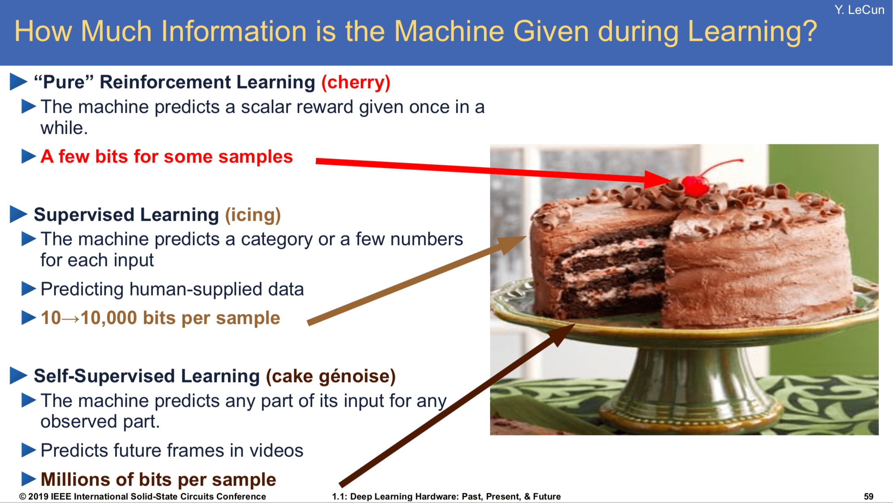
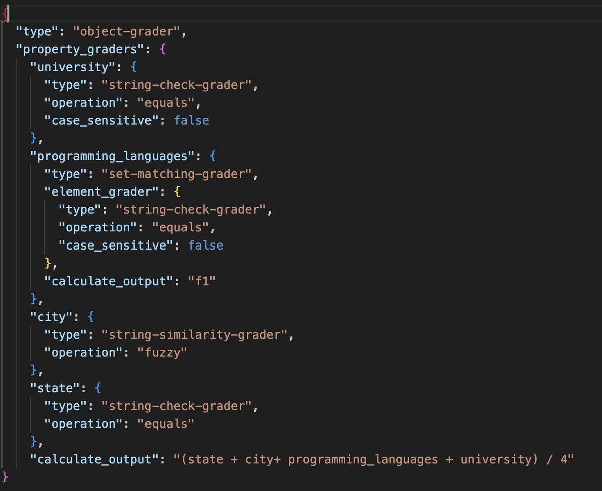
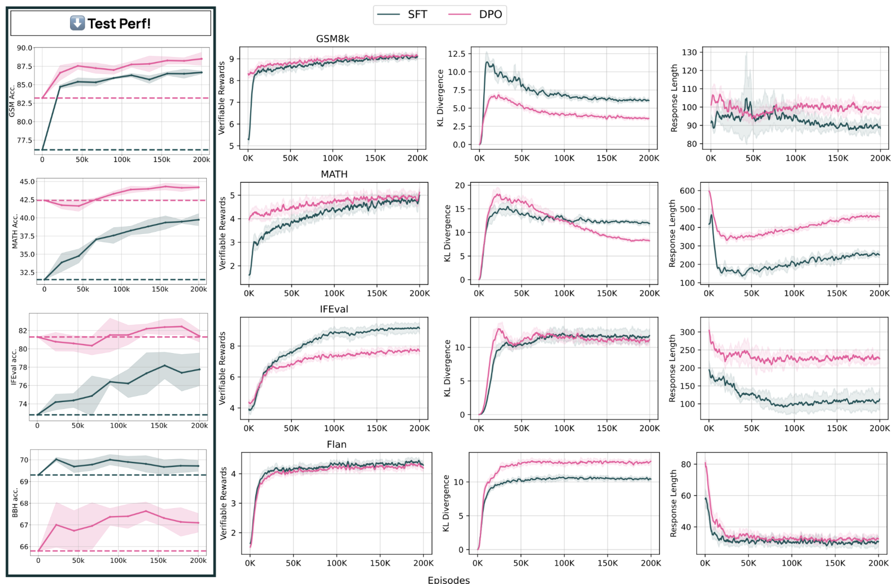

*Reminder, I'm raising prices in 2025. This applies to new subscribers only, so it is a good time to lock in the cheap price if you've been considering it.*

*As for now, I'm at NeurIPS. I gave two talks yesterday, which I have slides for now and recordings later, [a tutorial on language modeling](https://docs.google.com/presentation/d/179dpzWSQ9G7EAUlvaJdeE0av9PLuk9Rl33nfhHSJ4xI/edit#slide=id.g31b08bdaca5_0_238), and my [thoughts on post-training for AI applications](https://docs.google.com/presentation/d/1LWHbtz74GwKSGYZKyBVUtcyvp8lgYOi5EVpMnVDXBPs/edit#slide=id.g31f4442b961_0_62). For friends of Interconnects at the conference, I'm going to hang out from 1:30-2:30 PM on Thursday the 12th and Friday the 13th on level two, on the northeastern corner, ocean foyer (see [map](https://www.vancouverconventioncentre.com/facility/floor-plans-and-specs), if this location doesn't work, I'll post the location on socials).* Otherwise, I am sure I'll cross paths with plenty of you at events and sessions.

*Onto the media front. On [episode 35](https://www.youtube.com/watch?v=ZwGdk3jzOkg&pp=ygUKdGhlIHJldG9ydA%3D%3D) of The Retort, Tom and I recapped the biggest AI stories of the year. On [ChinaTalk](https://open.spotify.com/episode/6e9s5wCEQFtdr2H73E6fLy) this week I recapped the year and tried to explain the processes you use to create an effective AI model training team. Onto the post.*

------------------------------------------------------------------------

At the 2016 edition of the Neural Information Processing Systems (NeurIPS) conference, Yann LeCun [first introduced](https://www.youtube.com/watch?v=Ount2Y4qxQo&t=1072s) his now-famous cake metaphor for where learning happens in modern machine learning systems:

> If intelligence is a cake, the bulk of the cake is unsupervised learning, the icing on the cake is supervised learning, and the cherry on the cake is reinforcement learning (RL).

This analogy is now largely complete with modern language models. Self-supervised learning on vast swaths of internet data makes up the majority of the cake (especially when viewed in compute spent in FLOPs), the beginning of post-training in supervised finetuning (SFT) for instructions tunes the model to a narrower distribution, and finally "pure" reinforcement learning (RL) is the cherry on top. We learn just "a few bits" of information with RL in just a few training samples.

Many versions of this slide have been used across the years.

Despite many, many [takes](http://www.jtoy.net/blog/deep-reinforcement-learning-is-a-waste-of-time.html) that "[RL doesn't work yet](https://www.alexirpan.com/2018/02/14/rl-hard.html)" or "[RL scaling isn't ready yet](https://www.interconnects.ai/p/scaling-rl-axes)" (and implicit versions of this saying to focus on "[RL that Matters](https://arxiv.org/abs/1709.06560)"), Yann's view seems to have been right.

OpenAI's new [Reinforcement Finetuning](https://openai.com/form/rft-research-program/) (RFT) API (just a research program for now), announced on [day 2 of the 12 days of OpenAI](https://www.youtube.com/watch?v=yCIYS9fx56U&pp=ygUGb3BlbmFp), is the bridge that brings RL to the masses. This is a [very surprising](https://x.com/sama/status/1865097588065931538) development even for [those most faithful to RL](https://www.interconnects.ai/p/finbarr-timbers). With RFT, one can likely finetune any of OpenAI's models, while they highlighted o1 mini, it is of obvious value to both standard autoregressive models and reasoning-heavy models. To use RFT, you need three things --- 1) training data for your application, 2) validation data for your application to test overfitting, and 3) a definition via OpenAI's "grader" configuration (more on this later).

Reinforcement Finetuning has been met with excitement and trepidation. The best practices for using existing finetuning APIs, built on instruction tuning infrastructure, are still far from established. The general public of AI builders knows very little about how RL training can change model behavior to improve performance on tasks with minimal overall changes to the model.

In many domains, Reinforcement Finetuning is much more aligned with the goals of developers by being focused on performance rather than behavior. Standard finetuning APIs generally use a parameter-efficient finetuning method such as LoRA with supervised finetuning on instructions. Developers pass in prompts and completions and the model is tuned to match that by updating model parameters to match the completions. OpenAI describes this as increasing the prevalence of "features" in the text of interest.

Reinforcement finetuning is focused on matching answers. Given queries and correct answers, RFT helps the model *learn* to get the correct answers. While standard instruction tuning is done with 1 or 2 epochs of loss updates over the data, reinforcement finetuning gets its name by doing hundreds or thousands of epochs over the same few data points to give the model time to learn new behaviors. This can be viewed as *reinforcing* positive behaviors that would work sparingly in the base model version into robust behaviors after RFT.

### The impact of reinforcement finetuning's existence

Reinforcement finetuning signals many changes to the fate of RL and language models, both at OpenAI and elsewhere:

-   **Stability of RL can be solved**: For its entire existence, the limiting factor on RL's adoption has been stability. This manifests in two ways. First, the learning itself can be fickle and not always work. Second, the training itself is known to be more brittle than standard language model training and more prone to loss spikes, crashes, etc. Releasing an API where any user can *train* on their own data signals unprecedented stability improvements. This program is still a beta ahead of a full launch, but this signals that OpenAI is more confident about it working for the public rather than not.

    \
    For example, last year when I heard about large-scale RL runs at frontier AI laboratories, it would be with stories like "they launch multiple seeds at once and only keep running the ones that didn't crash." Now, they can be confident in their RL running and accomplishing the task. The final output model is likely automatically detected by running evaluations on the checkpoint to make sure behavior did not dip and or measuring the KL distance from the initial policy. Both of these are signals that researchers rely on heavily in post-training experimentation, so automating decision-making based on it is extremely impactful.

-   **Open-source versions already "exist"**: Our [recent work](https://www.interconnects.ai/p/tulu-3) at Ai2 on reinforcement learning with verifiable rewards (RLVR) is extremely similar. The major components, i.e. data format and optimizer type are identical, we just need increased open-source investment to understand many discussion items like which model to start on, which types of data to use, etc. Check out the code we've been using at [Open Instruct](https://github.com/allenai/open-instruct).

-   **A potential data flywheel for advanced reasoning models**: The [best](https://www.interconnects.ai/p/reverse-engineering-openai-o1) [speculation](https://www.interconnects.ai/p/openais-o1-using-search-was-a-psyop) is that OpenAI's o1 is trained mostly with large-scale RL on data with verifiable outputs --- much like this API. If this API works as intended, OpenAI could accumulate an extreme dataset for training future versions of their o1 models. The main limitation of these models is the lack of diversity in available domains and by experimenting with training on the targeted domains of many users of OpenAI's models they can start turning a fruitful flywheel.

-   **The scope of RL training for language models continues to grow:** The biggest takeaway from o1 on a fundamental scientific level was that we have even more ways to train language models to potentially valuable behaviors. The more open doors that are available to researchers and engineers, the more optimism we should have about AI's general trajectory. The RL finetuning API expands the window of permissivity for RL training.\
    \
    I recall listening to a talk by a prominent OpenAI researcher a year ago (I couldn't find it), where they said they were excited about RLHF and related methods just because the loss function is more general than autoregressive prediction. We are now living in this world of RL's impact growing rapidly, and as many people expected, the human feedback piece is not always necessary.

### Hypotheses on reinforcement finetuning's implementation

Technically, there are still more questions than answers given the lack of specific details. Still, the way the API is communicated sheds some light:

-   **Grader models/configs act as [reward shaping](http://kar.kent.ac.uk/60614/) for generalized answer checking**: The core of any successful application of RL is correctly scoping the environment, which is composed of a transition function and a reward function. With language models, the transition function (dynamics) is contrived and is the LM policy itself. The reward function, though, behaves the same in traditional RL work --- it is a mapping from states and actions, which are prompts and completions, to a scalar value of correctness. OpenAI uses a concept called graders to perform this behavior.

    \
    Grading answers is not new to LM workflows --- the natural bridge is from evaluation, where using complex systems to check if an answer to a question is correct is normal practice. For example, Llama 3.1 used [a mix of Python code and LLM-as-a-judge](https://github.com/meta-llama/llama-models/blob/main/models/llama3_1/eval_details.md) to check if its answers on MATH are correct: "For post-trained models, we use a 0-shot config with Cot prompt. We enhance the exact match using [sympy](https://www.sympy.org/en/index.html) and then use an [equality template](https://github.com/openai/simple-evals/blob/main/common.py#L27-L85) with a judge to resolve complex expressions." A basic grader will return a binary score of 0 or 1 if the answer is wrong or right respectively, much like evaluation setups. This is the setup we used in Tulu 3. for RLVR

    \
    The idea for graders is to expose the ability to create complex functions to the user. This is likely very important in complex domains, such as code. To grade code comprehensively, you will want to check if the code runs, its efficiency, its documentation, and more aspects. John Allard, on the finetuning team at OpenAI, posted a longer summary of the [vision behind graders](https://x.com/john__allard/status/1865520756559614090?s=46) and a screenshot of what these configurations can look like. Still, reward shaping is known to be a rabbit hole in RL workflows, we'll see if instructions for doing so can be easily communicated to the masses.

    

-   **Data efficiency optimism:** On the live stream, OpenAI mentioned that users only need "dozens" of samples for RFT to learn in their new domain. For each prompt, RL can generate multiple responses to grade in a batch of RL depending on the hyperparameter settings. This is repeated across many learning steps and many iterations across the data --- therefore allowing the model to try many different "strategies" to find the right answer. This repeated training is seen below for our experiments where we run hundreds of thousands of RL training episodes on datasets with only a few thousand prompts --- the model can see the same prompts many times without overfitting.\
    \
    In our early experiments with this sort of RL training, we have definitely seen the behaviors of the model change notably, such as learning to use LaTeX more heavily, checking its own work, and other fun details.

    

<!-- -->

-   **Stable base language models:** In many ways, it's turning out that RL training could be better suited to finetuning than learning from scratch, as was done for foundational RL work on control and decision making. With a very stable base, RL finetuning can search gently for better behavior expressions without substantially changing the model performance.

    \
    In our experiments above for RLVR, we are trying to push the last few percentage points of performance out of a model that has already been trained on related examples. If the domain you are applying RFT to is very new to the model, it could be true that 10 samples are all you need to get a generalized bump in performance. All of this is downstream to very strong base models that have a tiny ability in more domains than we know. Targeted post-training is all about amplifying the underlying features of the base models.

------------------------------------------------------------------------

The stability in RL infrastructure is at least related to the large-scale training done for o1. A finetuning platform team member at OpenAI, [John Allard said](https://x.com/john__allard/status/1865520756559614090?s=46):

> The idea that anyone can leverage the same training algorithms and infra we use to create our o1 models and craft expert models in new domains is super exciting.

These types of fundamental improvements to tooling (along with clean data) are regarded as the most important pieces of modern frontier laboratories. The full o1 release, especially the [early](https://x.com/dylan522p/status/1865163956706525266) [vibes](https://x.com/deanwball/status/1865199387271414056) [of](https://x.com/garybasin/status/1865189596113571946) o1 Pro, which is the publicly available expression of that infrastructure, is best left to their own post.

The question is: Can [RL grow to be more than](https://x.com/_jasonwei/status/1865869712858468584) just the "cherry on top" of ML? The reaction of many to [o1's extensive RL training](https://www.interconnects.ai/p/openais-o1-using-search-was-a-psyop) is that the cherry on top may be overperforming even Yann's predictions. We could be heading to a world where supervised finetuning is less important and all we learn from is a mix of self-supervised internet data and self-reinforced behaviors with no explicit human design. Reinforcement learning is shifting from a niche field run by a few passionate scientists to something that every AI engineer needs to know, use, and love.
