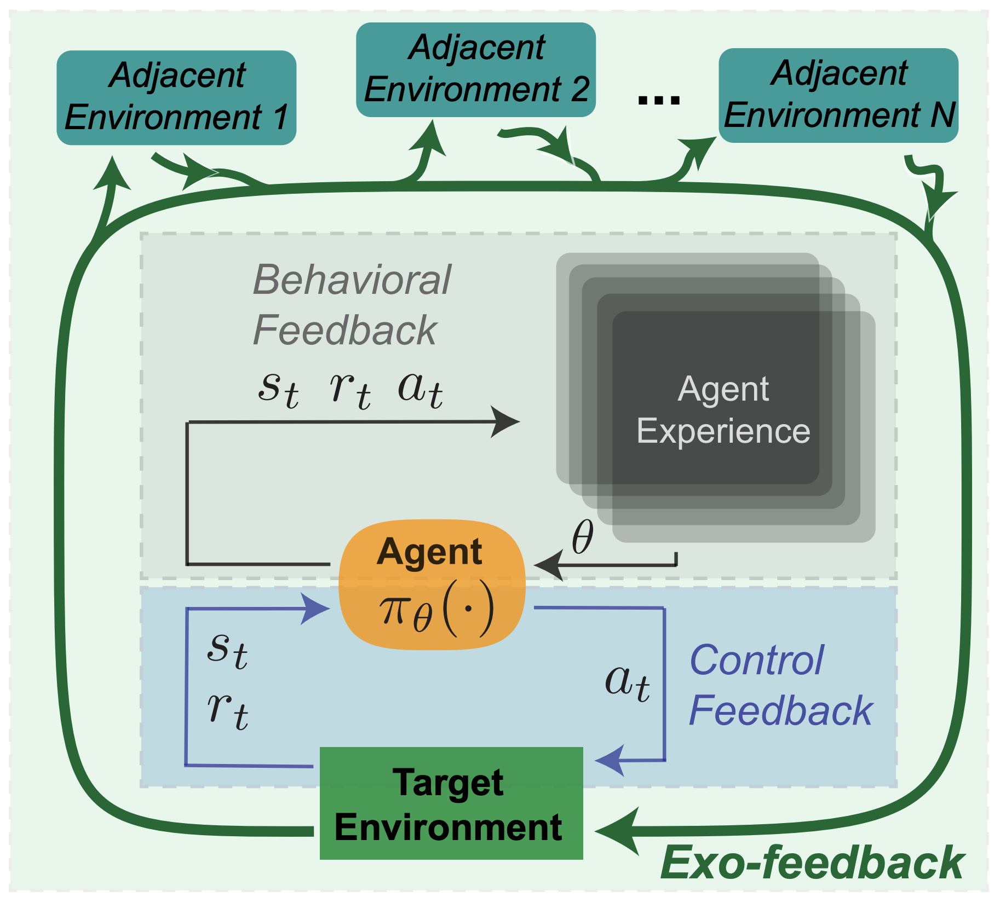

AI agents as a concept need better definitions and examples if they are going to grow into a thriving market for researchers and application builders. Trends in AI point to agents as a proving ground in 2025. We have much more stable and scalable tools in the form of cheap APIs and tool-use models, along with substantial, new market and media demand for AI to do something "beyond chat."

The chatbots that followed ChatGPT slotted into a mode of operation that most humans already did every day --- texting. **AI agents are going to primarily operate in domains where very few people use software like it**. Still, the AI discourse presents agents as the biggest opportunity to sell AI into the world. In order to do this, the concept of an AI agent needs to be very clear.

The current definition of AI agent that most people use encompasses way too much under one term. This goes back to the [obsession with all agents being viewed through the lens of reinforcement learning](https://www.interconnects.ai/i/143916547/agency-and-shifting-goalposts). We need taxonomies for different types of agents. As I started working more towards directions for 2025 *related* to agents, as in planning, basic tool use, long-context, etc., an obvious mismatch appeared between the discourse and reality of agents.

The most basic AI agents that people are going to be using in 2025 are things like language models with search, which actively pull from knowledge stores, and something like Siri in [Apple Intelligence](https://www.interconnects.ai/p/apple-intelligence?utm_source=publication-search), which acts as an orchestration layer on top of the operating system.[1](#footnote-1){#footnote-anchor-1 .footnote-anchor component-name="FootnoteAnchorToDOM" target="_self"} The simplest way to view the starting points for language model-based agents is any tool-use language model. The spectrum of agents increases in complexity from here.

In the current zeitgeist, **an "AI agent" is anything that interacts with the digital or physical world during its output token stream**.

Reinforcement learning was previously the lens for solving or studying agentic, sequential decision making tasks. Reinforcement learning had a monopoly on the idea of agents. Everything else was just autonomy. Now, agentic or sequential tasks are a default application for AI, and RL is but a lowly optimizer to improve performance on said tasks. This confusion alone will cause substantial contention that no new naming convention can mitigate. In reality, most AI "agents" today don't have any characteristics of decision making --- they seem to be vanilla, boring autonomy, but this will change.

For a representative example, we can think of various email assistant agents. The most basic version is a language model that reads all inbound emails, routes some, removes others, and responds to a few. An intermediate version of agency would respond to more and integrate with basic applications such as calendars. The most expansive version of an email agent would integrate with many apps and potentially be an \"all-encompassing\" AI agent touching every aspect of your digital life.

An example of a real company that I\'ve been following, [Lindy](https://www.lindy.ai/), would normally operate in between the middle and high end of complexity on this scale (note that on Latent Space, the founder of Lindy [discussed how they have multiple Lindys for different types of tasks](https://www.latent.space/p/lindy)).

### Agent cartography

There are plenty of steps on this spectrum of agency. There are multiple axes compressed into the axis presented loosely below, such as the complexity of the actions space, i.e. the number of integrations, and the autonomy of the task, i.e. the amount of restrictions on the agent itself.

The spectrum of current AI agents from simplest to most complex is as follows:

-   Single tools with single language models \-- i.e. search based chat applications,

-   Multiple tools within a single language model \-- i.e. something like ChatGPT with various plugins,

-   Multiple, composed language models (optionally with multiple tools, too) for one forward pass,

-   While loop or for loops over model calls,

-   General screen, command line, or keyboard access beyond structured APIs, and

-   Future agents where traditional notions of being bound to a single computer no longer make sense.

Over time, we will have thresholds where different technologies establish themselves as canonical examples of AI agents. Soon, basic tool use with a language model will not be considered an agent even though it is the grounding point for them.

The standard AI agent window will still be very large, with all the systems I described as composed model calls, while-loops, and other complex orchestration methods. Systems that are given carte blanche to touch any part of our digital lives should be referred to as something more complex. They are the true AI agents. Something like Lindy and most of the existing demos are really AI **orchestration systems** that can only work with limited APIs and integrations.

This will put us on a spectrum from tool-use language models to orchestration language models to agentic language models.

In order to go from tool-use LMs to orchestration LMs, systems will need to become more complex in implementation and handle a longer tail of situations. To go from orchestration LMs to fully agentic LMs that can attempt any open-ended task we give them (such as being a research assistant to hard sciences, as described in the likes of Dario Ameodi's essay [Machines of Loving Grace](https://darioamodei.com/machines-of-loving-grace)) we will need to revisit a large proportion of both our AI infrastructure and the infrastructure of the web writ large.

This scope of abstraction is quite similar to a [framework we proposed](https://arxiv.org/abs/2202.05716) a few years ago for how to think about regulation for reinforcement learning systems (a blog post summarizing the framework is [here](https://www.interconnects.ai/p/rl-whitepaper?utm_source=publication-search)). Generally, the key idea is understanding where feedback is applied within the system and how information is processed. The four ways this can be done with RL are summarized in the paper as follows:

> -   **Scoping the Horizon**: The specification of some exploratory limit against which an RL agent learns to perform an arbitrarily simple or complex task.
>
> -   **Defining Rewards**: The specification of the reward pursued by an RL agent as it seeks to incorporate a behavioral policy within some environment.
>
> -   **Pruning Information**: The specification of actions and states so that an RL agent can learn a policy more efficiently or reliably according to a given task.
>
> -   **Training Multiple Agents**: The specification of an observable environment with agents that pursue a goal either collectively, collaboratively, competitively, or in parallel.

These four terms are very approachable ways to better specify what an agent is and how it should be understood. Some modification of these terms should be made, given that most AI agents of the future will probably not be learning online given the cost and technical difficulty of fine-tuning language models. Then, these terms are softened into utility and structure, rather than reward and learning. They can be rephrased for agents in general, as for:

-   **Scoping the Horizon**: How long can the agent run for and how does it plan across time?

-   **Defining Utility**: How is the AI agent succeeding or not?

-   **Pruning Information**: How is the agent interfacing with other digital information, both on inputs and outputs?

-   **Interacting with Agents**: Is the agent designed to interact with other agents?

The most basic agentic AI example I described above, the email filtering agent, is very constrained in scope and looks like a fairly standard RL control problem (minus the online learning). Language models can probably do this zero-shot and need no learning in real-time. Its horizon and information processing are very well defined. Utility should be, but a simple command of "clean my email inbox" could have many second-order impacts.

### Questions for the near future

#### **1. Will language model backbones be trained online?**

As we move towards orchestration AI agents, there will be language model labs that continue to improve the base model for different agentic tasks. At least, someone will try wrapping these improvements within an online agent, but it may not be stable enough for real applications. The vast majority of agent applications right now use pinned LM versions to control for robustness, but this does not always need to be the case.

Online learning is always the goal \-- [RL is the cherry on top](https://www.interconnects.ai/p/openais-reinforcement-finetuning), and I expect people to try this in the real world too because some problems cannot be sandboxed completely. This could look like using the [OpenAI Reinforcement Finetuning API](https://www.interconnects.ai/p/openais-reinforcement-finetuning) on specific problems that your agent is encountering.

#### 2. What will happen when multiple language models / agentic systems interact with each other?

Agents interacting with agents are certain to come and are even more unpredictable in their impact. A single agent struggling to learn on its own looks like buggy software. Multiple agents interacting and making their own marketplace of decisions is a fundamentally different internet ecosystem. The need for policy and oversight in the final case is way higher --- we describe this as exogenous feedback in the [white paper](https://arxiv.org/abs/2202.05716). Exogenous feedback is how to view dynamics where complex RL or agentic systems shift the domains they are deployed within.

#### 3. How will me manage open-ended vs. closed agents?

A core differentiation that will emerge when regulating real agents is the difference between an agent with a clearly scoped deliverable --- e.g. booking a vacation --- relative to an agent that is running forever in the background processing information and taking actions. An agent with a specific, closed-loop outcome in mind represents a much stricter liability regime where we know the intention of the developers. Open-ended agents can act as new entities in our digital society, and while they definitely will not be treated as individuals to start, they make the obvious case for radical new ideas in policy.

#### 4. What will it feel like to use an agent?

For now, we have tools that feel much closer to working with AI agents of the future. o1 and its *wait-and-see* vibe with responses is much more what working with agents will feel like. We'll call an agent and only get notified when it's done. Right now, models like GPT-4o return the start of their response within milliseconds, o1 responds in a maximum of minutes, and agents coming soon could take hours or days. Many expectations for how technology progresses and is used are going to change.

------------------------------------------------------------------------

*To follow all my future and past works on AI agents, you can [check out this list.](https://www.interconnects.ai/t/agents) Thanks to Tom Zick for feedback on earlier versions of this post.*

:::: {.footnote component-name="FootnoteToDOM"}
[1](#footnote-anchor-1){#footnote-1 .footnote-number contenteditable="false" target="_self"}

::: footnote-content
Orchestration software like IFTTT or Zapier is in spirit very similar, but in the big picture, very few people actually use these. The promise of AI "agents" is to go mainstream.
:::
::::
