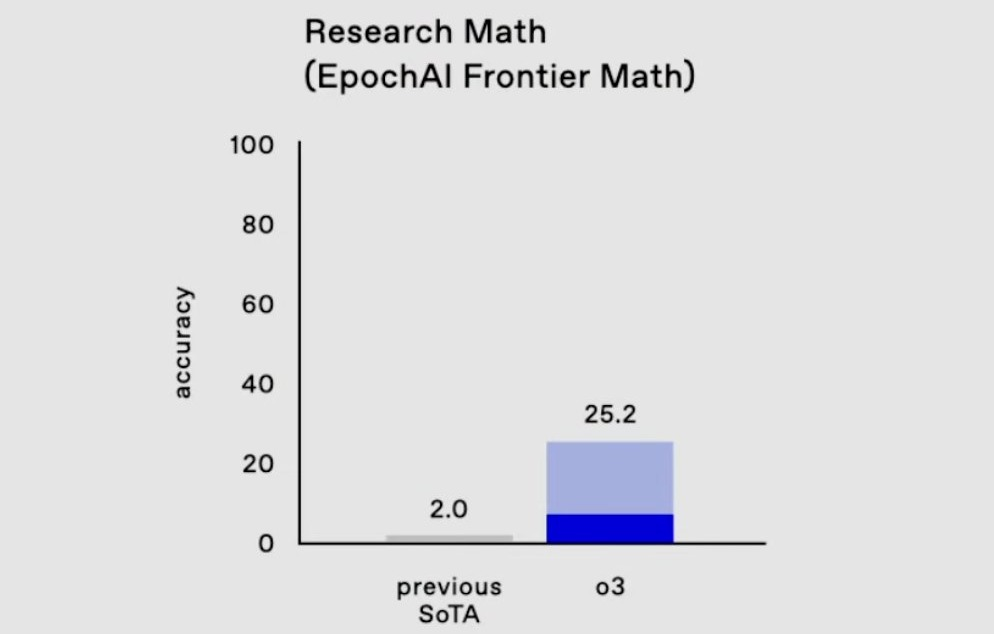
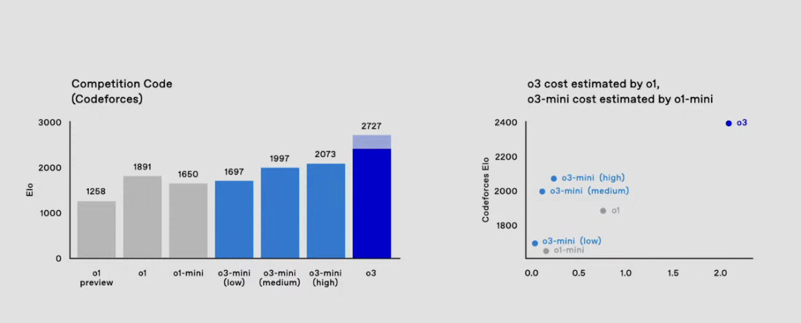
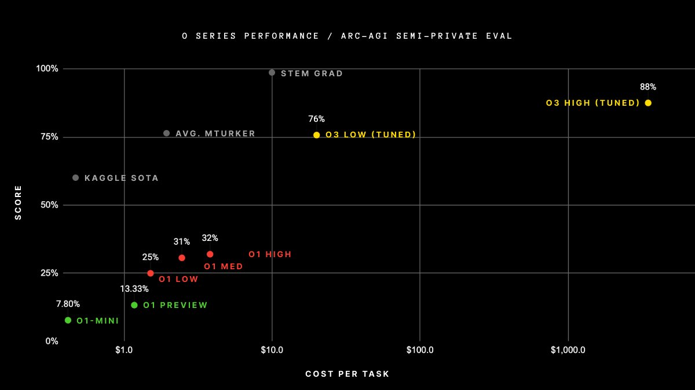
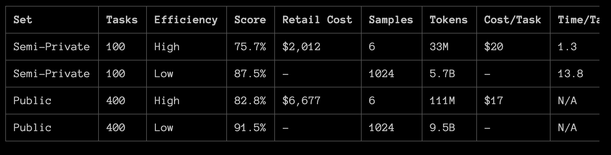
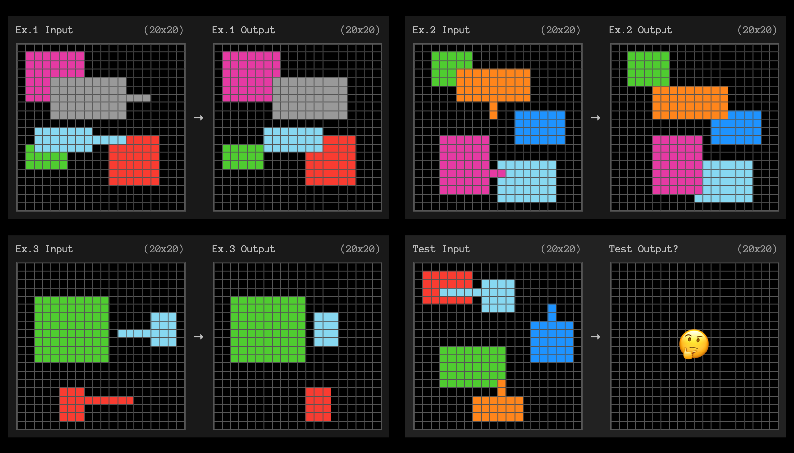
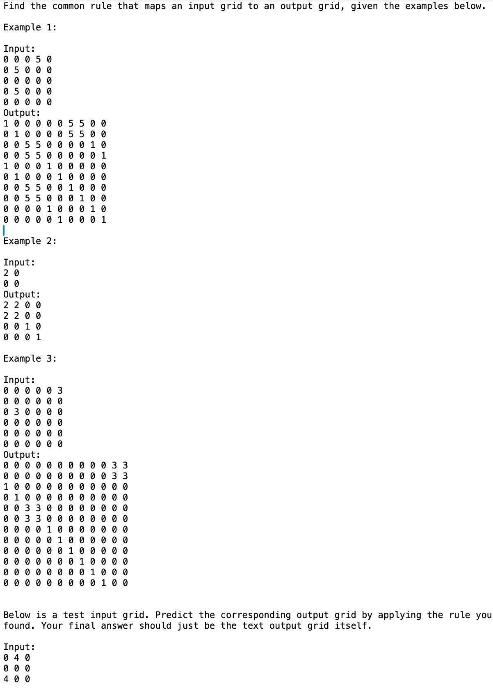
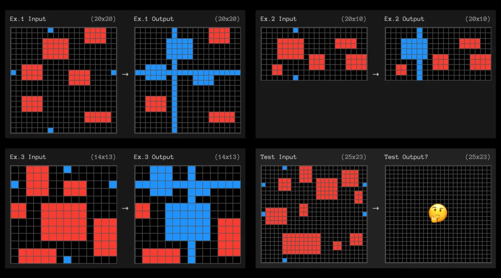

***Edit 1 12/20**: I added more context around the quotes for Frontier Math, commented on ARC Prize's reported token counts for eval., fixed minor typos, and fixed incorrect notation on pass@ referring to majority voting relative to the email version.*

Today, OpenAI previewed their o3[1](#footnote-1){#footnote-anchor-1 .footnote-anchor component-name="FootnoteAnchorToDOM" target="_self"} model continuing their recent progress on training language models to reason with o1. These models, starting with o3-mini, are expected to be available to the general public in late January of 2025. As we were wrapping up 2024, many astute observers saw this year as one of consolidation in AI where many players achieve GPT-4 equivalent models and figure out what to use them for.

There was no moment with a "[GPT-4 release](https://www.interconnects.ai/p/gpt4-review)" level of excitement in 2024. o3 changes that by being far more unexpected than o1, and signals rapid progress across reasoning models. We knew o1 was coming with the long lead-up --- the quick and effective follow-up with o3 sets us up for a very dynamic 2025.

While many doubt the applicability of o1-like models outside of domains like mathematics, coding, physics, and hard sciences, these models will soon be used extensively across the entire AI research ecosystem, dramatically increasing progress. An optimistic lens is that there has not been enough time to figure out what to use them for nor [public access to RL training methods](https://www.interconnects.ai/p/openais-reinforcement-finetuning) needed to bring reasoning models into other domains.

OpenAI's o3 shows the industry is beginning to climb its next hill as progress from pretraining only on internet text yields fewer profitable benefits. o3 is a major step change in reasoning evaluations --- in summary, it is:

-   The first model to [surpass the 85% threshold for completing the ARC AGI prize](https://arcprize.org/blog/oai-o3-pub-breakthrough) (Note: this was done on the public set, not the test set, and exceeded cost constraints).

-   A step change in state-of-the-art performance on the extremely new [Frontier Math](https://epoch.ai/frontiermath) benchmark from 2 to 25%.

-   Substantial improvements were made to all of the leading coding benchmarks, such as SWE-Bench-Verified.

And all of this is only 3 months after the first version of the model was announced. These changes will soon begin by accelerating the rate of progress in AI research. Over time, as the costs of inference decline, it will be another step towards the change of many software engineering roles that we know today.

At the same time, OpenAI released a [blog post](https://openai.com/index/deliberative-alignment/) and research [paper](https://assets.ctfassets.net/kftzwdyauwt9/4pNYAZteAQXWtloDdANQ7L/32db347774f3b8e43a028cc98b24e416/OpenAI_Deliberative-Alignment-Reasoning-Enables-Safer_Language-Models_122024_2.pdf) on deliberative alignment, showcasing how o1-class models can enhance safety and alignment research. This provides some of the first positive pieces of evidence for the much bigger open question I hinted at earlier: Can enhanced reasoning abilities deliver value outside of verifiable domains? This will be revisited many times in 2025.

### o3 overview

OpenAI's o3 model was announced on the [final day](https://youtu.be/SKBG1sqdyIU) of their 12 Days of OpenAI release event. The announcement was accompanied by incredible scores over the previous state-of-the-art models (Gemini 1.5 Pro and Claude 3.5 Sonnet New).

A common missed detail in OpenAI's blog posts and communications about their o1 series of models is what the shading means in the bar plots. The first o1 blog post has the details in a caption for the first results figure:

> Solid bars show pass@1 accuracy and the shaded region shows the performance of majority vote (consensus) with 64 samples.

This detail shows that multi-pass consensus is important for getting the best performance from o1's models. This is true for all inference time compute --- for best results, one cannot rely on one output stream. Still, this does not mean that one must use tree search or some intermediate representation. o1 pro mode, and the results we will discuss for the ARC prize, rely on this parallel generation to get the absolute maximum scores (thanks to [LDJ](https://x.com/ldjconfirmed) on Twitter for pointing out this under-discussed fact to me about the bar shading).

For a qualitative read on Frontier Math as a benchmark, consider these anecdotes from two Fields Medalists. Note that they're commenting on the hardest parts of the benchmark, but it captures the qualitative goals of it:

> \"These are extremely challenging\... I think they will resist AIs for several years at least.\" ---Terence Tao, Fields Medal (2006)
>
> "\[The questions I looked at\] were all not really in my area and all looked like things I had no idea how to solve...they appear to be at a different level of difficulty from IMO problems." --- Timothy Gowers, Fields Medal (2006)

This benchmark was [introduced on November 7th](https://arxiv.org/abs/2411.04872) and was slotted in as one of the few open frontiers in AI capabilities. This announcement slots OpenAI's o3 as the only model that exists in the double digits, and it shot directly to 25%.

The second leading result was in coding. In the livestream, OpenAI highlighted an [SWE-Bench Verified](https://openai.com/index/introducing-swe-bench-verified/) score of 71.7% (which is [state-of-the-art by some margin](https://www.swebench.com/)) and extensive results on Codeforces, a competition coding site.

o3's score with consensus vote at some undisclosed N is 2727, putting it at the [International Grandmaster level](https://codeforces.com/blog/entry/68288) and approximately in the top 200 of competitive human coders on the planet. o3-mini outperforms o1 while being substantially lower in cost, which given the trends we have seen in 2024, will likely be the more impactful model used by the masses.

This leaves the final breakthrough result of the o3 livestream --- effectively solving the ARC AGI challenge.

### Solving the Abstraction and Reasoning Corpus (ARC)

The [Abstraction and Reasoning Corpus (ARC)](https://arcprize.org/arc) is an AI evaluation introduced in 2019 by François Chollet in his paper *[On The Measure of Intelligence](https://arxiv.org/abs/1911.01547)*. The ARC evaluation was specifically introduced to more closely evaluate human intelligence (emphasis mine):

> We then articulate a new formal definition of intelligence based on Algorithmic Information Theory, describing intelligence as skill-acquisition efficiency and highlighting the concepts of scope, generalization difficulty, priors, and experience. Using this definition, we propose a set of guidelines for what a general AI benchmark should look like. Finally, we present a benchmark closely following these guidelines, the Abstraction and Reasoning Corpus (ARC), built upon an explicit set of priors designed to be as close as possible to innate human priors. **We argue that ARC can be used to measure a human-like form of general fluid intelligence and that it enables fair general intelligence comparisons between AI systems and humans**.

The [ARC AGI Prize](https://arcprize.org/), launched in June of 2024, is a \$1M prize for the first solution to a privately held-out set of ARC subject to certain criteria. The threshold for "solving" the task was 85% accuracy.

Today, OpenAI and the [ARC Prize shared the following results](https://arcprize.org/blog/oai-o3-pub-breakthrough):

Look closely at this x-axis in price. We will revisit this later.

Before the o1-class models, OpenAI's best model, GPT-4o, only achieved 5% accuracy. The incredible pace of progress on the evaluation as OpenAI hillclimbed on their new reasoning models was [summarized by co-founder of ARC Prize Mike Knoop](https://x.com/mikeknoop/status/1870172132136931512):

> -   GPT-2 (2019): 0%
>
> -   GPT-3 (2020): 0%
>
> -   GPT-4 (2023): 2%
>
> -   GPT-4o (2024): 5%
>
> -   o1-preview (2024): 21%
>
> -   o1 high (2024): 32%
>
> -   o1 Pro (2024): \~50%
>
> -   o3 tuned low (2024): 76%
>
> -   o3 tuned high (2024): 87%

Just in June, the narrative was still that [solving ARC-AGI would be extremely hard](https://x.com/fchollet/status/1804236584432398622). This has totally flipped on its head in just a few months. Even those bullish about rumors of Q\* and other reasoning approaches would not have expected this level of success.[2](#footnote-2){#footnote-anchor-2 .footnote-anchor component-name="FootnoteAnchorToDOM" target="_self"}

Chollet shared more [details](https://arcprize.org/blog/oai-o3-pub-breakthrough) on the ARC Prize website:

> We tested o3 against two ARC-AGI datasets:
>
> -   Semi-Private Eval: 100 private tasks used to assess overfitting
>
> -   Public Eval: 400 public tasks
>
> At OpenAI\'s direction, we tested at two levels of compute with variable **sample sizes**: 6 (high-efficiency) and 1024 (low-efficiency, 172x compute).
>
> Here are the results.
>
> 
>
> Note: o3 high-compute costs not available as pricing and feature availability is still TBD. The amount of compute was roughly 172x the low-compute configuration.

For example, here is one of the unsolved problems:

Many of these are quite intuitive for humans. To pass these into models, the colors are encoded into digits and passed in as a grid in context, as highlighted by [Greg Kamradt](https://x.com/GregKamradt/status/1870208490096218244):

Technically, the prize is not claimed because it was above a cost threshold and not open-sourced. The race is truly on. Within a few years, this type of intelligence will be effectively free. Free, as in cheaper to run inference on than the monetary value in advertising data on the user.

For now, the prices for o3 quoted in the ARC Prize blog post (which were changed to relative prices to o1 in OpenAI's communications) reveal a lot about how o3 operates technically.

### o3's architecture, cost, and training (hint: still no tree search)

The ARC AGI team worked directly with OpenAI to get price estimates for their model. The final pricing when o3 is available in the API is very likely to be different. In line with the prominence of inference scaling laws, ARC-AGI has added an additional requirement to submitting solutions for private evaluation. In their blog post, they document total cost and cost per task as a proxy to FLOPs or a direct calculation of compute used. This is in line with one of the [rules](https://arcprize.org/arc-agi-pub) from the announcement of the ARC Prize for the public leaderboard (which is not associated with the \$1M prize):

> 5.  \$10,000 USD is the maximum amount that can be spent on runtime costs to solve 500 tasks (400 in the `public evaluation set` + 100 in a new `semi-private evaluation set`), including calling commercial APIs.

Across the 500 tasks in the public or semi-public set, o3 exceeded that threshold by a dramatic amount. ARC Prize shows o3 well exceeding \$1K per query. They also hypothesize on the nature of the model. I include these to tamper the speculation on if o3 is a different training technique than o1. Specifically, Chollet says directly he is speculating:

> For now, **we** **can only speculate about the exact specifics of how o3 works**. But o3\'s core mechanism appears to be natural language program search and execution within token space -- at test time, the model searches over the space of possible Chains of Thought (CoTs) describing the steps required to solve the task, in a **fashion perhaps not too dissimilar to AlphaZero-style Monte-Carlo tree search**. In the case of o3, the search is presumably guided by some kind of evaluator model.

Again, the MCTS references and presumptions are misguided, but understandable as many brilliant people are falling trapped to the shock that o1 and o3 can actually be just the forward passes from one language model.[3](#footnote-3){#footnote-anchor-3 .footnote-anchor component-name="FootnoteAnchorToDOM" target="_self"} My recent post explained how that can be the case with large-scale RL training and why many of OpenAI's plots are misleading in *how more compute is spent at inference time*. OpenAI employees have [reinforced the "just a model trained with RL" nature](https://x.com/__nmca__/status/1870170101091008860) of o3 as well.

::: {.digest-post-embed attrs="{\"nodeId\":\"963939cf-ca22-4876-8cdf-66091272701b\",\"caption\":\"Some housekeeping: I’m planning on raising the price of Interconnects in the new year. I’m producing a lot more content than I expected and the Discord server is doing fantastic. It’s a good time to upgrade to an annual subscription — this is effectively a large holiday discount until the price raises in 2025. Or, you can always\",\"cta\":null,\"showBylines\":true,\"size\":\"sm\",\"isEditorNode\":true,\"title\":\"OpenAI's o1 using \\\"search\\\" was a PSYOP\",\"publishedBylines\":[{\"id\":10472909,\"name\":\"Nathan Lambert\",\"bio\":\"ML researcher making sense of AI research, products, and the uncertain technological future. PhD from Berkeley AI. Experience at Meta, DeepMind, HuggingFace.\",\"photo_url\":\"https://substackcdn.com/image/fetch/f_auto,q_auto:good,fl_progressive:steep/https%3A%2F%2Fbucketeer-e05bbc84-baa3-437e-9518-adb32be77984.s3.amazonaws.com%2Fpublic%2Fimages%2Fdda47b96-836a-4b95-99a0-f0ec744d4245_2316x2316.jpeg\",\"is_guest\":false,\"bestseller_tier\":100}],\"post_date\":\"2024-12-04T13:03:08.690Z\",\"cover_image\":\"https://substack-post-media.s3.amazonaws.com/public/images/44840c49-9a71-439b-9a6c-b08abe3b60fa_1980x1113.png\",\"cover_image_alt\":null,\"canonical_url\":\"https://www.interconnects.ai/p/openais-o1-using-search-was-a-psyop\",\"section_name\":null,\"video_upload_id\":null,\"id\":151483351,\"type\":\"newsletter\",\"reaction_count\":50,\"comment_count\":2,\"publication_name\":\"Interconnects\",\"publication_logo_url\":\"https://substackcdn.com/image/fetch/f_auto,q_auto:good,fl_progressive:steep/https%3A%2F%2Fsubstack-post-media.s3.amazonaws.com%2Fpublic%2Fimages%2Fe70f9dbf-4fe6-404c-b6bb-1831d1b7ed0b_590x590.png\",\"belowTheFold\":true}"}
:::

***Edit:** I didn't see ARC Prize reported total tokens for the solution in their blog post. For 100 semi-private problems with 1024 samples, o3 used 5.7B tokens (or 9.5B for 400 public problems). This would be \~55k generated tokens per problem per CoT stream with consensus@1024, which is similar to my price driven estimate below.* *Second, I was using pass@ terminology loosely. The pass@ terminology traditionally checks if the answer was in 1024 generated solutions. The correct terminology is consensus or majority voting over N samples.*

Still, let's take the cost documented by the ARC team at face value and ground it in OpenAI's [pricing](https://openai.com/api/pricing/) for o1 at \$60.00 / 1M output tokens. The approximate cost of the ARC Prize results plot is about \$5000[4](#footnote-4){#footnote-anchor-4 .footnote-anchor component-name="FootnoteAnchorToDOM" target="_self"} per query with full o3. Dividing total cost by price per token results in the model generating 80M tokens per answer, which is impossible without wild improvements in long-context models. Hence, speculation on different search architectures.

The key is from a few details in the ARC prize blog post, which says:

> At OpenAI\'s direction, we tested at two levels of compute with variable sample sizes: 6 (high-efficiency) and 1024 (low-efficiency, 172x compute).

According to [SemiAnalysis](https://semianalysis.com/2024/12/11/scaling-laws-o1-pro-architecture-reasoning-training-infrastructure-orion-and-claude-3-5-opus-failures/), o1 pro uses self-consistency methods or simple consensus@N checks to increase performance by selecting the most common answer across multiple parallel responses to the same query. Here, **sample size**, N, likely corresponds to a consensus@N number, indicating that o3 was evaluated in something close to the configuration for o1 pro that customers can use, 6x compute, and a super high configuration with 1024x compute per problem.

This scale of inference is not going to be served to standard paid users for a long time. Most users will be exposed to one pass to consensus@10 depending on the specifications of the "pro" tier of o1 models.

Assuming the same price per token of \$60/ 1M output tokens, divide by 1024 streams to imply that the model is generating \~78K tokens per response. In reality, it seems that o3 also is benefiting from a large base model given how high the compute cost increases from o1 on all the log-compute x-axes that OpenAI showed in the live stream. With a bigger base model, all of these numbers are very reasonable and do not imply any extra "search" elements being added.

The story in deep learning that has been driving progress in the last few years is finding a rich area of potential and hill climbing on it. The first wave of progress was in internet-scale pretraining. Now, OpenAI has identified a hill to climb by scaling reinforcement learning training and long-context reasoning. Given that o3 is only about [three months](https://x.com/_jasonwei/status/1870184982007644614) after the [release of OpenAI's o1](https://www.interconnects.ai/p/reverse-engineering-openai-o1), the simplest explanation is that it is the same architecture and training methodology, scaled up.

There is no evidence other than hearsay that o3 made an architectural change to inference by adding tree search. A core rule of [inference scaling laws](https://www.interconnects.ai/i/148388607/inference-scaling-laws) is that sampling more from the same single-stream generation can give performance improvements.

The hard question is whether or not the base model for o3 is Orion, OpenAI's internal codename for what would be GPT-5, or if the new base model just benefitted from Orion at training time. With a 2 to 5x increase in the scale of the base model, the reported API prices from the ARC prize fall right in line.

There is definitely uncertainty over the specifics of o3. The plots that the ARC team released have "(tuned)" next to the o3 models and no detailed writeup on o3 exists yet. Regardless, when focusing on the derivative of progress, it is clear that o1-class models are here to stay.

To wrap up and add humility, here's an example from the ARC prize [that o3 did not solve](https://x.com/fchollet/status/1870172872641261979). It's very easy.

We clearly have a ways to go, but you should be excited and expect the reality where we use these models extensively to be sooner than most people expect. Assuming progress is the safe bet with AI.

------------------------------------------------------------------------

### 2024: RL returns

Earlier today, Anthropic shared a [video](https://www.youtube.com/watch?v=om2lIWXLLN4) with the co-founders on the topic of *building Anthropic*. One unexpected detail was shared by co-founder and CEO Dario Amodei:

> ...The whole reason to scale these models up was that they weren\'t smart enough to do RLHF on top of them.

Amodei, as one of the founders of modern RLHF, very well could've had an intuition that all of this progress on finetuning was due to come soon. This is a drastically more expansive view of the potential of RLHF than most practitioners even have. This has been the year when RL and related methods were re-established at the core of AI.

The process of this post was me convincing myself that I need to train a reasoning-based LM like this in 2025. Much like standard pretraining was table stakes for technology companies in 2024, it seems like o1-style models are going to be a default tool in the AI toolbox for the foreseeable future. I'm excited to embrace this worldview and learn firsthand how training these models works.

I still have a year-in-review post to send, but that will have to be after Christmas. Happy holidays!

:::: {.footnote component-name="FootnoteToDOM"}
[1](#footnote-anchor-1){#footnote-1 .footnote-number contenteditable="false" target="_self"}

::: footnote-content
o2 name was skipped [due to trademark concerns](https://www.theinformation.com/briefings/openai-preps-o3-reasoning-model).
:::
::::

:::: {.footnote component-name="FootnoteToDOM"}
[2](#footnote-anchor-2){#footnote-2 .footnote-number contenteditable="false" target="_self"}

::: footnote-content
It's worth noting that substantial progress is being made besides just o1 style models. In Chollet's blog post: "besides o3\'s new score, the fact is that a large ensemble of low-compute Kaggle solutions can now score 81% on the private eval."
:::
::::

:::: {.footnote component-name="FootnoteToDOM"}
[3](#footnote-anchor-3){#footnote-3 .footnote-number contenteditable="false" target="_self"}

::: footnote-content
I feel for this trap with [my first o1 blog post too](https://www.interconnects.ai/p/reverse-engineering-openai-o1).
:::
::::

:::: {.footnote component-name="FootnoteToDOM"}
[4](#footnote-anchor-4){#footnote-4 .footnote-number contenteditable="false" target="_self"}

::: footnote-content
This is rounding up by visually inspecting the plot. The table provided by ARC challenge indicates that the compute use of the low efficiency mode was \~172X the compute used by low-efficiency.
:::
::::
