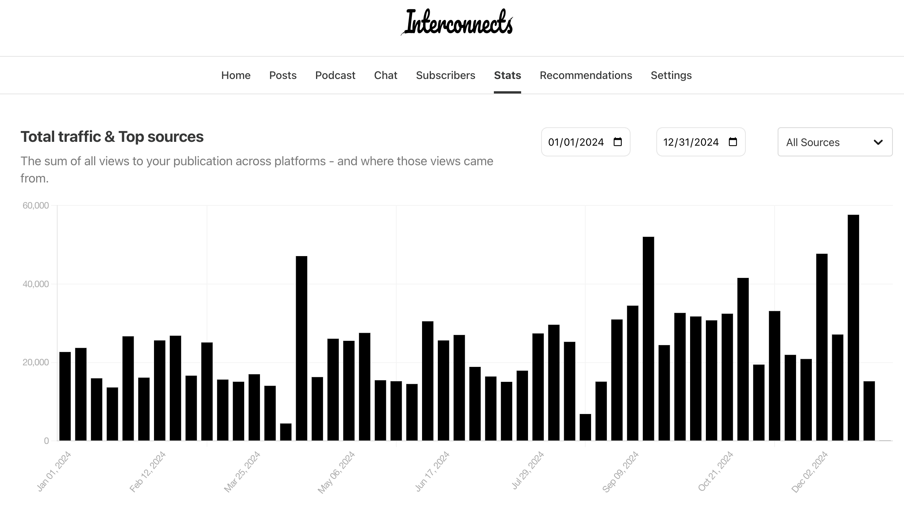

I'm very happy to have slowly worked Interconnects into a place where it synergizes with the many angles of my professional goals. It is a place to focus on the most important ideas in AI and to test the relevance of my ideas. Without writing every week it would be very easy to lose track of what matters and what does not.

Across technology broadly, AI was still the biggest story of the year, as it was for 2022 and 2023 as well. 2022 was the emergence of Stable Diffusion and ChatGPT. 2023 was the formation of new powers within AI, told by the GPT-4 release, dramatic fundraising, acquisitions, mergers, and launches of numerous projects that are still heavily used.

The historically lasting event for 2024 will be the launch of OpenAI's o1 model and all it signals for a changing model training (and use) paradigm. [Scaling as we know it is ending](https://x.com/_jasonwei/status/1867696401830096970) and demand for AI is inching slowly outside of chat interfaces. Reasoning language models (RLMs), building on the demo of o1, are progressing extremely rapidly and opening up dramatic changes in 2025.

This year on Interconnects, I published 60 Articles, 5 posts in the new [Artifacts Log](https://www.interconnects.ai/t/artifacts-log) series (next one soon), 10 [interviews](https://www.interconnects.ai/t/interviews), transitioned from AI voiceovers to [real read-throughs](https://www.interconnects.ai/podcast), passed 20K subscribers, expanded to [YouTube](https://www.youtube.com/@interconnects) with its first 1k subs, and earned over 1.2million page-views on Substack.

The three major focal points were again:

1.  **Reinforcement learning** (RL) and **post-training** generally (\~14 posts). Post-training is now seen as the region where frontier laboratories are scaling compute the fastest. In 2025 this will be two different categories of coverage.

2.  **Open-source AI** and **policy** impacts (\~9 posts). At the highest level, my read of the situation remains that the benefits of *more openness* (relative to the status quo) outweigh the risks, so clearly articulating why and interfacing with policymakers is a core mode of the blog and my career. This will last so long as policy is quickly being enacted to steer AI, but hopefully, it won't be forever.

3.  New **model releases** (\~10 posts). These case studies (and playing with the models) are instrumental to a grounded understanding of AI's progress.

Otherwise, the spectrum of topics covers a substantial breadth --- from evaluation to products to AI fundamentals to reflections on the state of AI. The topics I covered are by no means meant to *only* cover what are the most important stories in AI today. These are what I spend my time thinking about and this writing is a tool for achieving my goals. Relevance is a moving target, so always chasing it can make insight elusive.

Specifically, post-training and RLHF have continued to gain relevance throughout the year, while the story in open-source AI is much more mixed. I don't need to retell the story of o1 and its impacts, given that everyone is locked in and expecting more changes there early next year.

In 2023, open-source AI was an area that many companies turned to in order to prove their relevance and kickstart market share. The likes of Mistral 7B and the first [Mixtral](https://www.interconnects.ai/p/mixtral) were major events in the AI community that were used by many companies and academics to make immediate progress. 2024 marked the year when companies like Databricks (MosaicML) arguably stopped participating in open-source models due to cost and many others shifted to having much more restrictive licenses --- of the companies that still participate, the flavor is that open-source doesn't bring immediate relevance like it used to.

At the same time, Llama is aggregating substantial market share. Open-source collapsing onto fewer players worsens the longevity of the ecosystem, but such restrictions were likely inevitable given the increased capital costs to maintaining relevance in AI. China, through DeepSeek and Qwen, is applying substantial pressure on the American open-source ecosystem --- one of my unexpected stories of 2024.

2025 will be another very interesting year for open-source AI. It seems like we will get the next generation of Llama models, Llama 4, but potentially with more restrictions, *a la* not getting the biggest model or license headaches.

In terms of views, writing on open-source strategy and policy is less impactful than the other areas I mentioned, but it has immediate impact and is read by policymakers, as seen by many conversations and the citation of Interconnects in this *[House AI Task Force Report](https://www.speaker.gov/wp-content/uploads/2024/12/AI-Task-Force-Report-FINAL.pdf)*.

While last year I had more viral posts, I think the quality and relevance of the average post this year were higher. Interconnects is roughly a notebook for me figuring out what matters in AI over time. 2024 was much more focused. I hope 2025 to be similar --- I know which hills to climb and will continue doing so.

Happy New Year!

Previous reviews: [2023](https://www.interconnects.ai/p/2023-review)

You can see the weekly views this year below.

## Details

### Top posts

Ranked by page views, the top posts of the year were:

1.  [Reverse engineering OpenAI's o1](https://www.interconnects.ai/p/reverse-engineering-openai-o1) --- my first post on o1, explaining how to use tree search and ideas from [Q\*](https://www.interconnects.ai/p/q-star) to build a reasoning model. This is now outdated.

2.  [OpenAI\'s o3: The grand finale of AI in 2024](https://www.interconnects.ai/p/openais-o3-the-2024-finale-of-ai) --- covering why o3 is so impressive.

3.  [OpenAI\'s o1 using \"search\" was a PSYOP](https://www.interconnects.ai/p/openais-o1-using-search-was-a-psyop) --- how to build a RLM with really just RL.

4.  [OpenAI's Strawberry, LM self-talk, inference scaling laws, and spending more on inference](https://www.interconnects.ai/p/openai-strawberry-and-inference-scaling-laws) --- fundamental principles of spending more on inference, inference scaling laws, and related topics from before o1 was launched.

5.  [AI for the rest of us](https://www.interconnects.ai/p/apple-intelligence) --- the importance of Apple Intelligence (that we still don't have full access to).

There's a very clear trend here that reasoning is emerging as an important topic on Interconnects (right now logged as the \`[inference](https://www.interconnects.ai/t/inference)\` tag). Much of the content overlaps substantially with the RLFH tag covering all of post-training, but new paradigms are starting in the AI space.

These **themes** list all posts-per-section in chronological order, with the newest coming at the end. Some of my favorite posts are marked with ★. I've included commentary on some posts where the titles do not fully capture the content.

### Post training (and RLHF)

-   [RLHF learning resources in 2024](https://www.interconnects.ai/p/rlhf-resources)

-   [Alignment-as-a-service: Scale AI vs. the new guys](https://www.interconnects.ai/p/alignment-as-a-service)

-   [Why reward models are key for alignment](https://www.interconnects.ai/p/why-reward-models-matter)

-   [How RLHF works, part 2: A thin line between useful and lobotomized](https://www.interconnects.ai/p/how-rlhf-works-2) --- the importance of style in post-training (the precursor to [this post on GPT-4o-mini](https://www.interconnects.ai/p/gpt-4o-mini-changed-chatbotarena)).

-   [OpenAI's Model (behavior) Spec, RLHF transparency, personalization questions](https://www.interconnects.ai/p/openai-rlhf-model-spec)

-   [RLHF roundup: Getting good at PPO, sketching RLHF's impact, RewardBench retrospective, and a reward model competition](https://www.interconnects.ai/p/rlhf-roundup-2024)

-   ★ [A recipe for frontier model post-training](https://www.interconnects.ai/p/frontier-model-post-training) --- the post that outlines the methods to post-train frontier models and the ideas that guided me to train [Tülu 3](https://arxiv.org/abs/2411.15124).

-   [Futures of the data foundry business model](https://www.interconnects.ai/p/ai-data-foundry) --- how Scale AI et al. may see changes to their business model with synthetic data and changing task distributions. I'll revisit this in 2025 with reasoning models.

-   ★ [Tülu 3: The next era in open post-training](https://www.interconnects.ai/p/tulu-3) --- a reflection on the past two years of alignment language models with open recipes.

-   ★ [OpenAI\'s Reinforcement Finetuning and RL for the masses](https://www.interconnects.ai/p/openais-reinforcement-finetuning) --- an important milestone in RL fine-tuning becoming accessible to the masses (and a much better name for the method than our reinforcement learning with verifiable rewards, RLVR, from Tülu 3).

### Open source AI

-   ★ [The koan of an open-source LLM](https://www.interconnects.ai/p/an-open-source-llm) --- a roundup of all the issues facing the idea of "open-source language models" to start in 2024. Coming into 2025, most of these still apply and are reflected in the rest of the articles I wrote on the subject.

-   [We disagree on what open-source AI should mean](https://www.interconnects.ai/p/flavors-of-open-source-ai)

-   [The end of the "best open LLM"](https://www.interconnects.ai/p/compute-efficient-open-llms) --- the emergence of different clear size categories for open models and why scaling doesn't address everyone in the open model audience.

-   [We aren't running out of training data, we are running out of open training data](https://www.interconnects.ai/p/the-data-wall)

-   [On the current definition of open-source AI and the state of the data commons](https://www.interconnects.ai/p/defining-open-source-ai)

-   [Why I build open language models](https://www.interconnects.ai/p/why-i-build-open-language-models)

### Regulation & policy

-   [SB 1047, AI regulation, and unlikely allies for open models](https://www.interconnects.ai/p/sb-1047-and-open-weights)

-   ★ [A post-training approach to AI regulation with Model Specs](https://www.interconnects.ai/p/a-post-training-approach-to-ai-regulation) --- the most insightful policy idea I had in 2024 was around how to encourage transparency on model behavior.

-   [Saving the National AI Research Resource & my AI policy outlook](https://www.interconnects.ai/p/saving-the-nairr) --- why public AI infrastructure is a bipartisan issue.

### Evaluation

-   [Evaluations: Trust, performance, and price (bonus, announcing RewardBench)](https://www.interconnects.ai/p/evaluations-trust-performance-and-price)

-   [ChatBotArena: The peoples' LLM evaluation, the future of evaluation, the incentives of evaluation, and gpt2chatbot](https://www.interconnects.ai/p/chatbotarena-the-future-of-llm-evaluation) --- 2024 in evaluation is the year of ChatBotArena reaching maturity. I'm quite happy with these two posts and their longevity.

-   [GPT-4o-mini changed ChatBotArena](https://www.interconnects.ai/p/gpt-4o-mini-changed-chatbotarena)

-   [Building on evaluation quicksand](https://www.interconnects.ai/p/building-on-evaluation-quicksand) --- why evaluations are always the Achilles' heel when training language models and what the open-source community can do to improve the state of affairs.

### Fundamentals

-   ★ [Model merging lessons in The Waifu Research Department](https://www.interconnects.ai/p/model-merging) --- an overview of what model merging is, why it works, and the unexpected groups of people pushing its limits.

-   [How scaling changes model behavior](https://www.interconnects.ai/p/how-scaling-changes-model-behavior)

-   ★ [Scaling realities](https://www.interconnects.ai/p/scaling-realities) --- the post that summarizes the debate of 2024 on if "scaling is done."

### Other models

-   [Open Language Models (](https://www.interconnects.ai/p/olmo)**[OLMos](https://www.interconnects.ai/p/olmo)**[) and the LLM landscape](https://www.interconnects.ai/p/olmo)

-   **[DBRX](https://www.interconnects.ai/p/databricks-dbrx-open-llm)**[: The new best open model and Databricks' ML strategy](https://www.interconnects.ai/p/databricks-dbrx-open-llm)

-   **[Llama 3](https://www.interconnects.ai/p/llama-3-and-scaling-open-llms)**[: Scaling open LLMs to AGI](https://www.interconnects.ai/p/llama-3-and-scaling-open-llms)

-   **[Phi 3](https://www.interconnects.ai/p/phi-3-and-arctic-llms)** [and Arctic: Outlier LMs are hints](https://www.interconnects.ai/p/phi-3-and-arctic-llms)

-   **[Llama 3.1 405B](https://www.interconnects.ai/p/llama-405b-open-frontier-model)**[, Meta's AI strategy, and the new, open frontier model ecosystem](https://www.interconnects.ai/p/llama-405b-open-frontier-model)

-   [On](https://www.interconnects.ai/p/nous-hermes-3) **[Nous Hermes 3](https://www.interconnects.ai/p/nous-hermes-3)** [and classifying a \"frontier model\"](https://www.interconnects.ai/p/nous-hermes-3)

-   **[OLMoE](https://www.interconnects.ai/p/olmoe-and-building-better-llms)** [and the hidden simplicity in training better foundation models](https://www.interconnects.ai/p/olmoe-and-building-better-llms)

-   **[Llama 3.2 Vision](https://www.interconnects.ai/p/molmo-and-llama-3-vision)** [and](https://www.interconnects.ai/p/molmo-and-llama-3-vision) **[Molmo](https://www.interconnects.ai/p/molmo-and-llama-3-vision)**[: Foundations for the multimodal open-source ecosystem](https://www.interconnects.ai/p/molmo-and-llama-3-vision)

-   **[OLMo 2](https://www.interconnects.ai/p/olmo-2-and-building-language-model-training)** [and building effective teams for training language models](https://www.interconnects.ai/p/olmo-2-and-building-language-model-training)

### Other favorites

-   ★ [AGI is what you want it to be](https://www.interconnects.ai/p/agi-is-what-you-want-it-to-be) --- one of my most referenced pieces. How AGI is a litmus test rather than a target. In 2025 it seems like reasoning is heading that way (even though it doesn't need to).

-   ★ [Switched to Claude 3.5](https://www.interconnects.ai/p/switched-to-claude-from-chatgpt) --- a fun piece integrating how careful post-training and product decisions intertwine to have a substantial impact on the usage of AI.

### Interviews

I had the following [interviews](https://www.interconnects.ai/t/interviews) and expect more of the same in 2025:

-   [Louis Castricato](https://www.interconnects.ai/p/rlhf-interview-1-louis) on RLHF

-   on [AI policy](https://www.interconnects.ai/p/interviewing-dean-ball-on-ai-policy)

-   on [open LMs](https://www.interconnects.ai/p/interviewing-sebastian-raschka)

-   Ross Taylor on [reasoning](https://www.interconnects.ai/p/interviewing-ross-taylor-on-llm-reasoning)

-   Riley Goodside on [prompting](https://www.interconnects.ai/p/riley-goodside-on-science-of-prompting)

-   Andrew Trask on [how LMs store information](https://www.interconnects.ai/p/interviewing-andrew-trask)

-   on [AI hype](https://www.interconnects.ai/p/interviewing-arvind-narayanan)

-   Andrew Carr on [new areas for generative AI](https://www.interconnects.ai/p/interviewing-andrew-carr)

-   Tim Dettmers on [open-source AI](https://www.interconnects.ai/p/tim-dettmers)

-   on [RL](https://www.interconnects.ai/p/finbarr-timbers)

### Artifacts Log

I shifted the collection of links at the end of posts to (what should be) [monthly roundups of open models and worthwhile links](https://www.interconnects.ai/t/artifacts-log). While I missed a few of these for truly crazily busy weeks at work, it's still a niche that no one else is filling, so I will continue it. The open models and datasets out there (or lack thereof) provide a lot of signals about where attention is in AI and where things are heading.

Early in 2025, I'll be sharing more reflections on 2024 and more details on how I plan on expanding some of the new projects above.
