In 2025 we need to disambiguate three intertwined topics: post-training, reasoning, and inference-time compute. Post-training is going to quickly become muddied with the new Reasoning Language Models (RLMs --- is that a good name), given that loss functions that we studied via advancements in post-training are now being leveraged at a large scale to create new types of models.

I would not call the reinforcement learning training done for OpenAI's o1 series of models post-training. Training o1 is large-scale RL that *enables better inference-time compute* and reasoning performance. Today, I focus on reasoning. Technically, language models definitely do a form of reasoning. This definition does not need to go in the [direction of the AGI debate](https://www.interconnects.ai/p/agi-is-what-you-want-it-to-be) --- we can clearly scope a class of behavior rather than a distribution of explicit AI capability milestones. It'll take work to get an agreement here.

Getting some members of the community (and policymakers) to accept that language models do their own form of reasoning by outputting and manipulating intermediate tokens will take time. I enjoy [Ross Taylor's](https://x.com/rosstaylor90?lang=en) definition:

> Reasoning is the process of drawing conclusions by generating inferences from observations.

This is a talk I gave at NeurIPS at the unofficial industry track. I wanted to directly address the question on if language models can reason and what o1 and the [reinforcement finetuning (RFT) API](https://www.interconnects.ai/p/openais-reinforcement-finetuning) tell us about it. It's somewhat rambly, but asks the high level questions on reasoning that I haven't written about yet and is a good summary of my coverage on o1's implementation and the RFT API.

Thanks for having me again! You can access the slides [here](https://docs.google.com/presentation/d/1PNipMudHb5HTNnVosve0lqdrgwKSWck4SCE9TSPCJkY/edit#slide=id.g3213e6dc551_0_143) (e.g. if you want to access the links on them). For more on reasoning, I recommend you read/watch:

-   's series on ARC at : [first](https://aiguide.substack.com/p/why-the-abstraction-and-reasoning), [second](https://aiguide.substack.com/p/on-evaluating-understanding-and-generalization), [third](https://aiguide.substack.com/p/on-the-arc-agi-1-million-reasoning), and [final](https://aiguide.substack.com/p/did-openai-just-solve-abstract-reasoning). And her [post](https://aiguide.substack.com/p/the-llm-reasoning-debate-heats-up) on reasoning proper.

-   's [thread](https://x.com/Miles_Brundage/status/1873205522742296873) summarizing the prospects of generalization.

-   Ross Taylor's ([previous interview guest](https://www.youtube.com/watch?v=KNsnarhMZRo&t=4s)) recent [talk](https://youtu.be/S5l5OvJ01ws?si=1_cUIefV5kkuhjgn) on reasoning.

-   The inference-time compute [tag](https://www.interconnects.ai/t/inference) on Interconnects.

Listen on [Apple Podcasts](https://podcasts.apple.com/us/podcast/interconnects-audio/id1719552353), [Spotify](https://open.spotify.com/show/2UE6s7wZC4kiXYOnWRuxGv), [YouTube](https://www.youtube.com/@interconnects), and [wherever you get your podcasts](https://www.interconnects.ai/podcast).

:::::::: {#youtube2-2pHE9L4ZZXM .youtube-wrap attrs="{\"videoId\":\"2pHE9L4ZZXM\",\"startTime\":null,\"endTime\":null}" component-name="Youtube2ToDOM"}
::::::: youtube-inner
:::::: iframe
::: {#player}
:::

:::: player-unavailable
# An error occurred. {#an-error-occurred. .message}

::: submessage
[Try watching this video on www.youtube.com](https://www.youtube.com/watch?v=2pHE9L4ZZXM){target="_blank"}, or enable JavaScript if it is disabled in your browser.
:::
::::
::::::
:::::::
::::::::

### Transcript + Slides

**Nathan** \[00:00:07\]: Hey, everyone. Happy New Year. This is a quick talk that I gave at NeurIPS, the Latent Space unofficial industry event. So Swyx tried to have people to talk about the major topics of the year, scaling, open models, synthetic data, agents, etc. And he asked me to fill in a quick slot on reasoning. A couple notes. This was before O3 was announced by OpenAI, so I think you can take everything I said and run with it with even more enthusiasm and expect even more progress in 2025. And second, there was some recording issues, so I re-edited the slides to match up with the audio, so you might see that they\'re slightly off. But it\'s mostly reading like a blog post, and it should do a good job getting the conversation started around reasoning on interconnects in the new year. Happy New Year, and I hope you like this. Thanks.

I wouldn\'t say my main research area is reasoning. I would say that I came from a reinforcement learning background into language models, and reasoning is now getting subverted into that as a method rather than an area. And a lot of this is probably transitioning these talks into more provocative forms to prime everyone for the debate that is why most people are here. And this is called the state of reasoning. This is by no means a comprehensive survey. To continue, I wanted to make sure that I was not off base to think about this because there\'s a lot of debates on reasoning and I wanted to revisit a very basic definition.

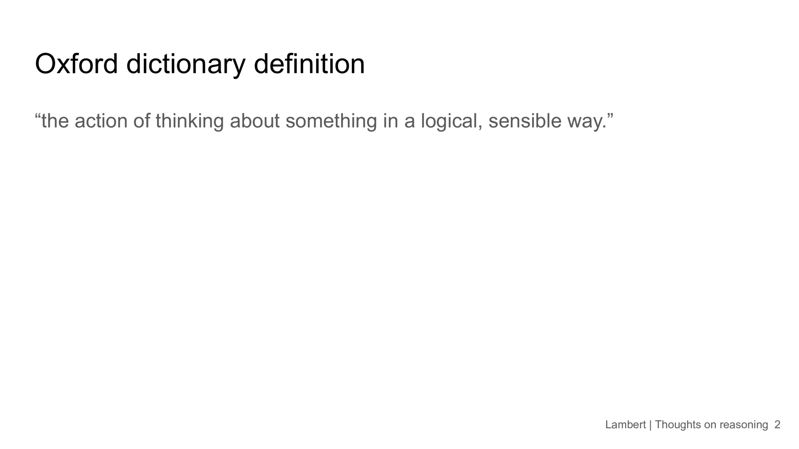

And this is a dictionary definition, which is the action of thinking about something in a logical, sensible way, which is actually sufficiently vague that I would agree with it. I think as we\'ll see in a lot of this talk is that I think people are going crazy about whether or not language models reason. We\'ve seen this with AGI before. And now we\'re going to talk about it. Now, reasoning kind of seems like the same thing, which to me is pretty ridiculous because it\'s like reasoning is a very general skill and I will provide more reasoning or support for the argument that these language models are doing some sort of reasoning when you give them problems.

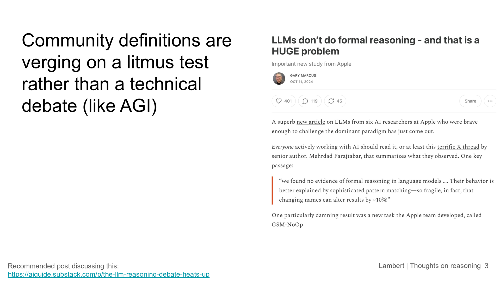

I think I don\'t need to share a ton of examples for what\'s just like ill-formed arguments for what language models are not doing, but it\'s tough that this is the case. And I think there are. Some very credible arguments that reasoning is a poor direction to pursue for language models because language models are not going to be as good at it as humans. But to say that they can\'t do reasoning, I don\'t see a lot of proof for, and I\'ll go through a few examples. And the question is like, why should language model reasoning be constrained to look what look like what humans do?

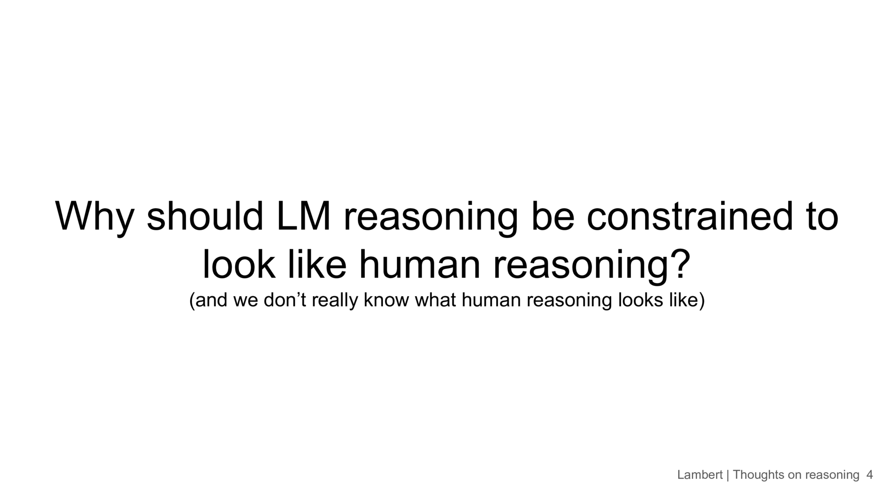

I think language models are very different and they are stochastic. The stochastic parents thing is true for many reasons. And. We should embrace this. And we should continue. And I think a big trend of the year is that we\'re seeing new types of language model reasoning that look less human. And that can be good for kind of separating the discourse for expecting a really narrow type of behaviors.

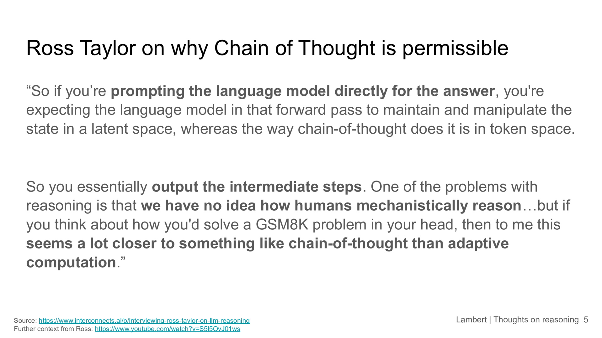

I did an interview with Ross Taylor, who was a reasoning lead at Meta, which I thought was a very good education for me on this. And this is just a direct pull from the transcript. But essentially it\'s saying is like, if you do chain of thought on a language model. What it is doing is essentially outputting its intermediate steps. If I were to ask you all a math problem right now, you can do most of them in your head and you are doing some sort of intermediate storage of variables. And language models have no ability to do this. They are kind of per token computation devices where each token is outputted after doing this forward pass. And within that, there\'s no explicit structure to hold these intermediate states. So I think embracing chain of thought and these kind of intermediate values for the language models is extremely reasonable. And it\'s showing that they\'re doing something that actually gets to valuable outputs.

**Nathan** \[00:04:10\]: So this is like one of the many ways that we can kind of lead towards O1 is that language models have randomness built into them. And a lot of what people see as failures in reasoning are kind of these language models following very static chains and making very specific mistakes. Along the way with really no ability to correct for that. This is really not something that we see in human reasoning. So if a human makes a mistake, they will normally catch it on the next step. But we need to handle language models differently.

**Nathan** \[00:04:41\]: And why O1 is exciting is because it\'s a new type of language models that are going to maximize on this view of reasoning. Which is that chain of thought and kind of a forward stream of tokens can actually do a lot to achieve better outcomes. When you\'re doing a reasoning like ability or reasoning like action, which is just repeatedly outputting tokens to make progress on some sort of intelligence defined task. So it\'s just making forward progress by spending more compute and the token stream is the equivalent of some intermediate state.

**Nathan** \[00:05:18\]: What is O1 has been a large debate since its release. I\'m not going to spend a lot of this talk on it. But the more I\'ve spent on it. Is that you should take open AI at their face value, which they are doing very large scale. RL on the verifiable outcomes is what I\'ve added, especially in context of the RL API that they\'ve released, which I\'ll talk about more. But most of the reasons to believe in more complicated things like process rewards, models, self play. Monte Carlo tree search are mostly based on previous literature and things that we would have expected advanced reasoning to look like for language models. And not based on evidence that they have given us or the behavior, whether you\'re looking at evaluations or how actually like inference is done when serving the model.

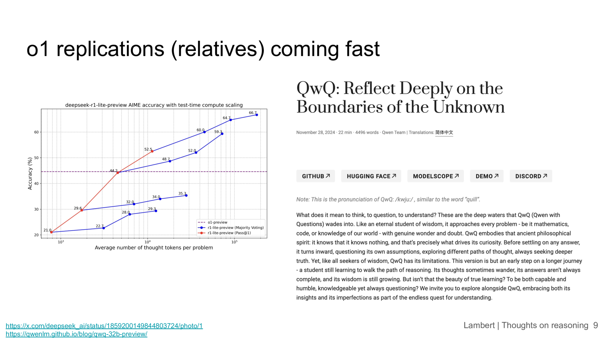

This takes us to replications, or I would probably call them relatives of O1 coming from the community. These are wonderful to see. We are exploring the boundaries for like what we can do with chain of thought in models. The two I\'ve highlighted are from deep seek and Quinn and a lot of people in this room have probably seen them. And I think that these models are really substantially narrower than these full O1 models from open AI. So open AI is if you use O1, you can do it for a lot more tasks. If you use like I was using the deep seek model and it\'s supposed to be for math or code. But they\'ve tried to keep the model so narrow that even in that if you ask a code question, sometimes it\'ll be like I have only supposed to work on math or code. And a lot of the success of O1 and the future models of this is going to be able to. It being able to handle more tasks and more domains.

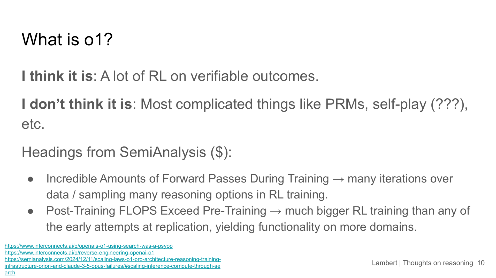

So SemiAnalysis wrote a [post](https://semianalysis.com/2024/12/11/scaling-laws-o1-pro-architecture-reasoning-training-infrastructure-orion-and-claude-3-5-opus-failures/) that I haven\'t read in full. But even if you look at the paywalled headings, you can kind of make some intelligent claims about what O1 is or is not. I think these are two of the things from the table of contents that you can see without paying. I\'m due to pay at some point, but I have not. And incredible amounts of forward passes during training. I think you\'ll see this as I discuss RL fine tuning models. Maybe more in a little bit. But when you\'re doing RL, there\'s two types of ways that you see data many times and that will relate in many or result in many forward passes. One is that when you\'re doing RL on a prompt, you can sample many completions to then grade them or use them in different ways to update your policy. So if I ask one math problem, I could look at eight completions and choose the best one or do some contrast of thing between the best and the worst one. And that kind of gradation can help the RL policy actually learn. And the second time, because the loss function is more flexible than something like instruction tuning, you can go over the same prompts many more times than you would in instruction tuning or kind of pre-training. So this kind of means they\'re doing just a lot of this sampling from the model, which is very different than other types of training we\'ve seen in the past at pre and post-training. And then one of this one is great. Thanks for doing for showing everyone this is that post-training flops exceed pre-training. I think this pretty much clearly says that they\'re using RL. They\'re using a ton of compute for this large scale RL. And at that point, it would probably mean something different where this is like pre-training RL. And this is something that these early relative models are not going to be doing because we don\'t like no one has this infrastructure like OpenAI does. It\'ll take a while to do that, but people will make it.

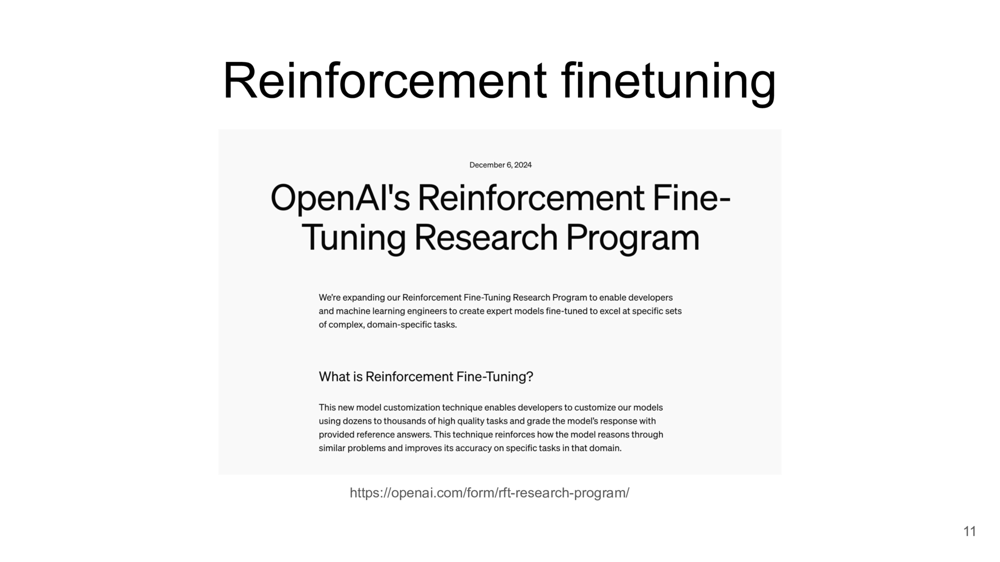

**Nathan** \[00:08:50\]: OK, this takes us to reinforcement fine tuning. I would say that this is a hard pivot in the talk where O1 is essentially pre-training scale RL. Extremely big RL. And we don\'t know what all the details of the data are to OpenAI then showing us this new beta API program that they\'re making, which is just a sprinkle of this. So what can you do with a tiny bit of their infrastructure? I think one of the fine tuning leads responded to a tweet from Swyx. And they were like the tweet letter. There was like one of the tweets. There was a long tweet that gave a lot of details. But even the first tweet I hadn\'t seen, I had like eight likes. And I was like. This API is using the same infrastructure that we used to train O1. And I was like that alone is like a lot of detail. There\'s like on Twitter is random thing. And then there\'s a really long details on other stuff of it. But it is just a new paradigm for fine tuning. And I have seen some of this work and I\'m pretty optimistic that it\'ll work for kind of kind of really specific capabilities where answers matter rather than features in your style of text mattering. So. Again, kind of like I was hinting at with O1. This reinforcement fine tuning does many passes over the data, which is why they can say you only need dozens of labeled samples to actually learn from it, which is just very different than previous training regimes. So what happens is that the model gets a greater gives a bonus when the answer is right. And the model learns to reinforce behaviors that get right answers. And I\'ll move later in the talk. I\'ll highlight a research project that we did. That was pretty much doing a very similar thing to target very specific evaluations on open models. And you do RL and you give a reward bonus when the answer is right. And that\'s all you do. And the kind of key innovation and the simplicity is that modern language models are strong enough base where just a really gentle RL fine tuning can add these specific capabilities without degrading the model. I think a lot of fear for adding RL to these training regimes. And I\'m sure we\'ll get to that in the future. But I think one of the biggest challenges for teams, especially on general instruct models like in chat to BT was just that they\'re going to destroy the rest of the performance, the base of chatting. So you care about. And it really seems like you can just do this out of the box. If open AI is going to allow an API, they aren\'t going to let people train a model that then just gets worse on random other things.

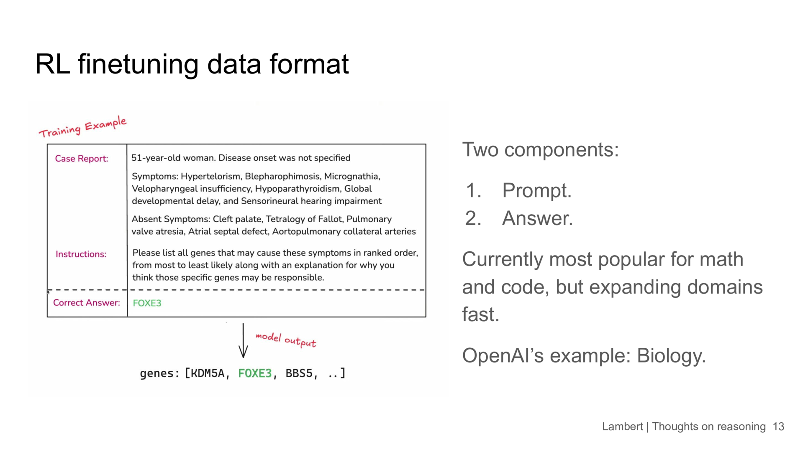

**Nathan** \[00:11:20\]: So what the data format looks like this, the example they gave is way more complicated than I think you should. It\'s like, you can start with like a grade school math problem. And just say, like the correct method. Correct answer is the correct number. The genes are confusing. But essentially, you have two components, a prompt and an answer, which is different than having a prompt and completion that you would train on. Or if you\'re doing preference tuning, you would do a prompt and a chosen completion and a rejected completion. So it\'s a new type of data format, I suspect. Quickly, we\'ll see things like Hugging Base having more of these. I will highlight we have some of ours for our specific project that we did. We have examples for math. Math on the screen is an example for precise instruction following, which is the idea that if you have a prompt, you can say something like, have every sentence start with the letter A. And you can verify that with Python really easily. This is something that we did in our project. And it\'s like, the model gets better at this. You have constrained data, and the RL algorithm learns to change the model just a tiny bit and actually reach these answers.

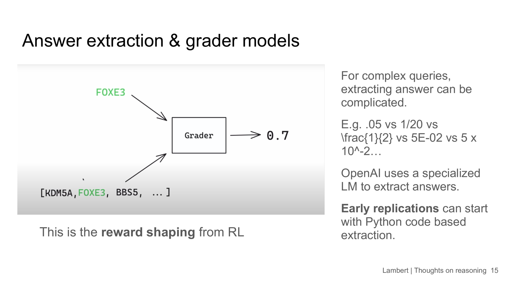

**Nathan** \[00:12:23\]: A confusing thing for people was these grader models. I think the place to come from these is evaluation. There\'s been a lot of work in evaluation to make answer extraction stable, especially with math, where an example that I used in the blog post I wrote today on this is like Lama 3.1 details their evals. For math, they use both SymPy, a Python process or Python package for extraction, and LLM, it\'s a judge, to extract their answers for math. And what the graders are doing is essentially amping this up to a whole lot. It\'s a whole nother level where it\'s kind of a nested structure of configs for doing reward shaping on these verifiable outputs. For math, it can be really easy. It\'s like, you know, you have to handle these five formats that I came up with in a minute for how you could represent different numbers and tokens. But as you get to more complicated things and more complicated behaviors, it seems like OpenAI is insinuating that you\'re going to need more than just a yes, no loss function for your domains. And that seems fine. Um, well, we already have a bunch of things. We have a bunch of open models that are doing like, um, like judge of models and Prometheus and other things that are designed specifically for LLM as a judge. And I see that continuing to just become part of this kind of open RL infrastructure.

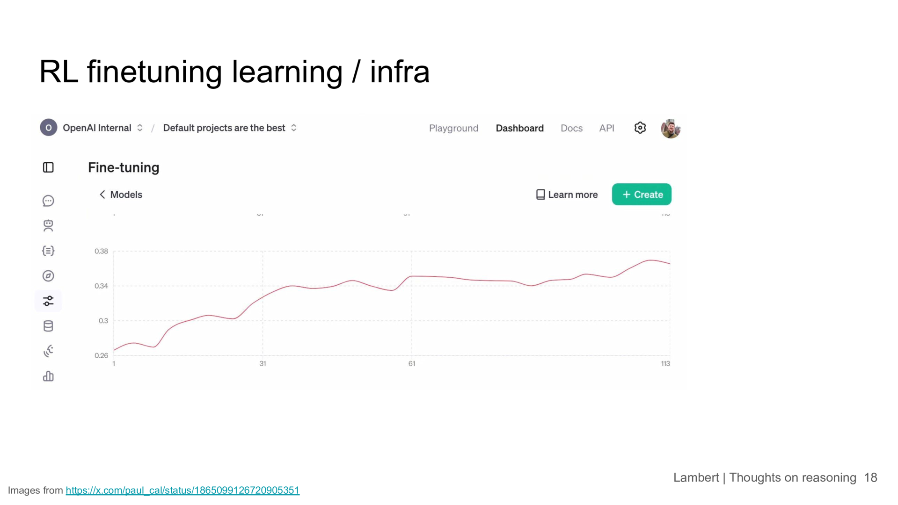

**Nathan** \[00:13:41\]: OpenAI had a bunch of screenshots. I\'m not going to end on a commentary on these, but it looks pretty standard. They\'re going to track how performance changes over time and stuff like this. You\'ll be able to look at all the outputs. This is just them making pretty things. And then they have this like very generic RL plot. Um, the most standard RL plot is a X axis of time or trials and a Y axis of reward here. Reward is like an accuracy or a success rate on a certain validation set. And X is actually supposed to be like how much training was done. And. That\'s a very similar to what we did in our project. I think this is kind of just another way you can put this with an RL feedback diagram. If you\'ve seen RL, where you have this agent interacting with the environment, this, you can squint at it and it\'ll be familiar. If you haven\'t. You\'ll probably be in for more of these things if RL keeps becoming popular because RL is really formulated as trial and error learning.

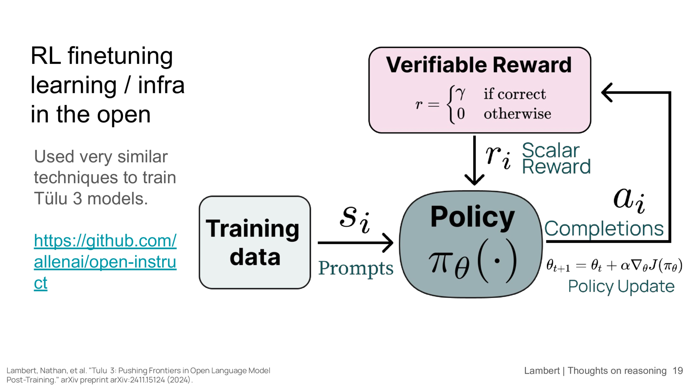

But if you\'re interested, we\'re happy to try to have people use our code, which does this for math and some instruction tuning already, and we want to try more complicated graders for things like code. So for code quality, a binary outcome doesn\'t really make sense, which is a good way to think about why you might need to do some reward shaping for how you would grade outputs from a various model. And to kind of compare the plot that OpenAI had, which is like performance improving over time.

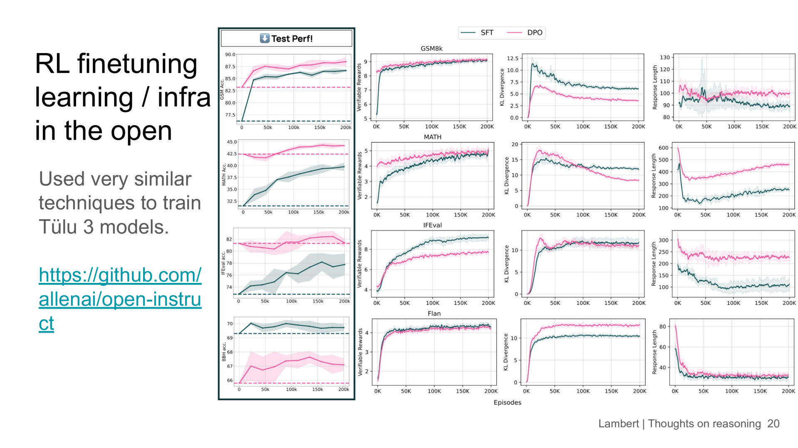

These are some experiments we ran on various evaluations. So the left column is some language model evaluation that we would use in an academic paper. And the right is all the various internal, um, RL statistics where like GSMAK math and IFVL are all being trained on training sets. So we have the answer, we have the prompts, which are math questions, and we have the answers, which are numbers, and we\'re really doing. This RL on seeing if this answer is right. And then it generalizes to various math evaluations that we care about. So I kind of see this as like, we got a tip from a industry lab member to do this a few months early. So we got a head start. And I think a lot of people are obviously going to be trying to replicate this now. So it\'s fun that we have a starting point and I\'m excited to talk about it with people this week. And I think reasoning is worth continuing as something. Yeah. I can read the post that I was referencing here and I\'m happy to take any related or hard question on reasoning. Cause I kind of opened the floor for that. So thank you. Okay.
