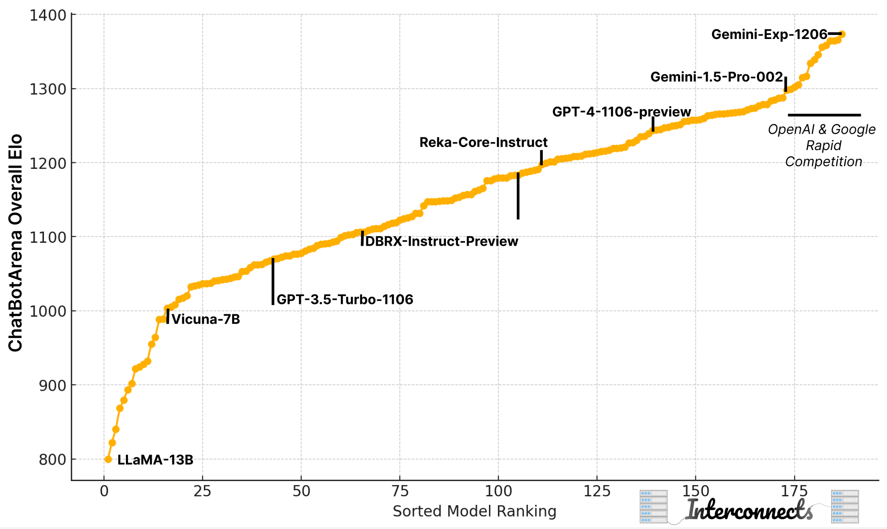

*Psssst... we just recently released our technical report for OLMo 2 --- [2 OLMo 2 Furious](https://arxiv.org/abs/2501.00656), check it out for tons of training details and tips!*

*This post has some good content, but if you just want to watch the tutorial on YouTube, it's [here](https://youtu.be/6yIMb0K-aS4).*

------------------------------------------------------------------------

I'm far more optimistic about the state of open recipes for and knowledge of post-training starting 2025 than I was starting 2024. Last year one of my first posts was how [open post-training won't match the likes of GPT-4](https://www.interconnects.ai/p/open-gpt4-limitations). This is still the case, but now we at least understand the scope of things we will be working with better.

It's a good time to record an overview of what post-training looks like today. I gave a version of this tutorial talk for the first time in 2023 ([at ICML](https://slideslive.com/39004357/reinforcement-learning-from-human-feedback-a-tutorial-)), which felt like a review of the InstructGPT paper not based on reproduced literature knowledge. In 2024, the scientific community made substantial progress in actually training these models and expanding the frontier of knowledge. Doing one of these talks every year feels like a good way to keep tabs on the state of play (whereas last year, I just had a [bunch of links](https://www.interconnects.ai/p/rlhf-resources) to add to the conversation on where to start).

With the talk, I wanted to add more context on where I see post-training generally.

The most important one people need to know, given the excitement around OpenAI's o1 series of models, is that **post-training alone is nowhere near a complete enough lens or taxonomy to study training reasoning language models**. It's a step.

Back to processes for all modern AI models. There are a lot of post-training methods to improve models and, more importantly, they can be segmented so the scientific community can make progress on each of them individually. The new state of finetuning stages is satisfying, with three groups of training methods:

-   **Instruction finetuning** (a.k.a. supervised finetuning),

-   **Preference finetuning** (the generalization of reinforcement learning from human feedback), and

-   **Reinforcement finetuning** is the [new abstraction](https://www.interconnects.ai/p/openais-reinforcement-finetuning) for improving performance on specific tasks.

Some of the long-tail methods like rejection sampling, knowledge distillation, and extensive filtering aren't studied well, but you can still do excellent post-training without them[1](#footnote-1){#footnote-anchor-1 .footnote-anchor component-name="FootnoteAnchorToDOM" target="_self"}. We have options for studying post-training in 2025.

Where last year we were settling debates such as "DPO vs. PPO" or "does AI feedback for RLHF work," now we are focused on just making the best practices better.

Similarly, the stress around doing research on outputs from foundation model providers, i.e. if research violates the OpenAI terms of service on training competitor models, has dropped further and is common practice --- in fact, distilling from strong models is a fundamental part of successful post-training.

To summarize the state of post-training, there are a few things to keep in mind:

### 1. Post-training techniques are more impactful on the final performance of models

Some caveats before I toot the horn of post-training as all you need today. Given that "[scaling as we know it is ending](https://x.com/_jasonwei/status/1867696401830096970)" this is not entirely a controversial take. Finally, it is obviously self-serving to me as someone who is going to benefit from post-training being more important.

All of this aside, it's very logical that [post-training will be the next domain](https://semianalysis.com/2024/12/11/scaling-laws-o1-pro-architecture-reasoning-training-infrastructure-orion-and-claude-3-5-opus-failures/#post-training-a-new-scaling-domain) for scaling model compute and performance. Predicting the next token accurately is not something that a user cares about --- correct answers and how the answer is presented are. All through 2024, there were way more discussions on how post-training is more important.

If we look at the Elo ratings of models on ChatBotArena, we can see progress has accelerated even though the models haven't been getting noticeably bigger. Pretraining on these architectures is improving, yes, but the biggest and best models are used as *tools and supervision for better post-training*.

Post-training got more popular because there was more low-hanging fruit on model performance. A lot of that potential has been realized and, in doing so, entirely new types of models are being made akin to o1.

To interpret these numbers:

-   100 Elo margin over another means \~2/3 win probability over the lower,

-   200 Elo gives \~76% win probability,

-   300 Elo gives \~85% win probability, and so on.

You can play with these numbers [here](https://colab.research.google.com/drive/1KdwokPjirkTmpO_P1WByFNFiqxWQquwH#scrollTo=hytEb0aXfcwm).

### 2. Post-training can be very expensive

While still far cheaper than pretraining due to the price of GPUs, post-training costs have been growing rapidly. If we estimate the costs of post-training the Llama models, we could guess that the all-in costs for the models were about the following: *Note --- numbers are based primarily on a combination of headcount and data costs with compute driving them even higher.*

-   LLaMA (Q1 2023) \<\<\$1M: instruction tuning only.

-   Llama 2 (Q3 2023) \~\$10-20M: 1.4M [preference pairs](https://www.interconnects.ai/p/llama-2-from-meta?open=false#%C2%A7preference-data), RLHF, IFT, Safety, etc. and other costs not in the paper.

-   Llama 3.1 (Q3 2024) \>\$50M: similar preference data to Llama 2, a \~200-person post-training team, larger models, etc. The number could be much higher.

Post-training costs from large data bills and extensive inference to generate, clean, and verify multiple types of synthetic training data. More complex loss functions, e.g. RL optimizers, use a lot of memory to train, but far fewer FLOPs than pretraining for general Instruct models. This is all growing rapidly and is expected to change.

This culminates in the o1 style models where the compute with post-training loss functions can account for 40% or more of the overall compute of the model. Even Tülu 3, our major post-training project at Ai2 that didn't buy any human data, I estimate costs \>\$1M for a large academic project.

### 3. Post-training is less reliant on human data

While all the frontier laboratories still rely on human data for parts of their post-training pipeline (including both training and evaluation), AI can be substituted at most stages and get a "good enough" outcome. For example, given the costs above, they can be slashed from moving from human preference data that is \~\$5-20 per preference point to AI feedback that is \<0.01\$ per sample. The *optionality* of synthetic data driven by having models that are good enough for supervision makes the pace of post-training progress far higher. In my experience, AI feedback for RLHF only became possible with GPT-4 tier models and the academic community reaps extreme benefits from the plummeting cost of inference.

### 4. Post-training ability is the door to advanced reasoning models

Doing post-training well and having mastery of the techniques seems crucial to making progress on reasoning models like o1 due to the infrastructure for RL finetuning of an instruct model is the [same as what is used for large-scale RL training](https://www.interconnects.ai/p/openais-reinforcement-finetuning), at least you want it to be.

Given the above trends --- we know more, it is easier to study, we have cheaper alternatives, etc. --- there is cause for optimism in open replications of o1. It should still be expected that the first "replications" of o1 are more relative models --- scaled up post-training on reasoning rather than the special pretraining + scaled RL that OpenAI does. We will learn a lot soon.

------------------------------------------------------------------------

## The talk on YouTube

[Slides](https://docs.google.com/presentation/d/1FL6pzRT3tjCfJ985emS_2YfujCe_iz6dsyRcDIUFPqs/edit?usp=sharing) for this post-training talk and [slides](https://docs.google.com/presentation/d/1xsJKIN51XasutjKRsmYH4T5381a43mLBMhcAUIVdTKk/edit?usp=sharing) for the full tutorial on language modeling (with a bit less post-training content and no recording yet). Here are some timestamps for the video:

-   00:00 Introduction

-   10:00 Prompts & Skill Selection

-   14:19 Instruction Finetuning

-   21:45 Preference Finetuning

-   36:17 Reinforcement Finetuning

-   45:28 Open Questions

-   52:02 Wrap Up

:::::::: {#youtube2-6yIMb0K-aS4 .youtube-wrap attrs="{\"videoId\":\"6yIMb0K-aS4\",\"startTime\":null,\"endTime\":null}" component-name="Youtube2ToDOM"}
::::::: youtube-inner
:::::: iframe
::: {#player}
:::

:::: player-unavailable
# An error occurred. {#an-error-occurred. .message}

::: submessage
[Try watching this video on www.youtube.com](https://www.youtube.com/watch?v=6yIMb0K-aS4){target="_blank"}, or enable JavaScript if it is disabled in your browser.
:::
::::
::::::
:::::::
::::::::

:::: {.footnote component-name="FootnoteToDOM"}
[1](#footnote-anchor-1){#footnote-1 .footnote-number contenteditable="false" target="_self"}

::: footnote-content
This is one of the "in between the lines" messages of our [Tulu 3](https://www.interconnects.ai/p/tulu-3) paper.
:::
::::
