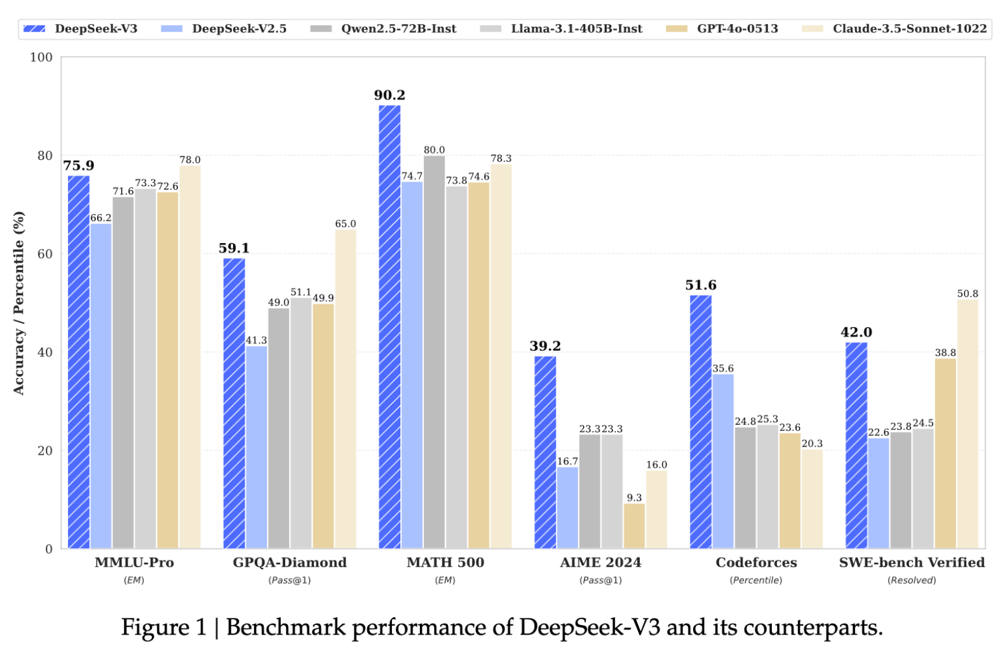
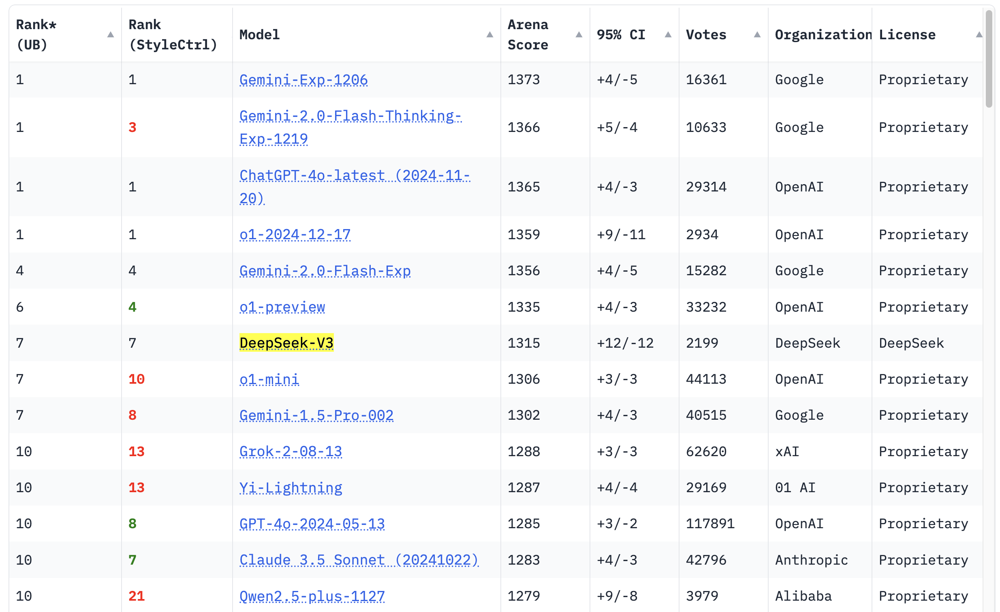
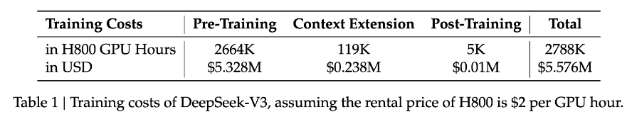

On December 26th, 2024, while most of the Western AI world was off on their Christmas holiday, China's DeepSeek AI released their [DeepSeek-V3](https://huggingface.co/deepseek-ai/DeepSeek-V3) general use model (and [base model](https://huggingface.co/deepseek-ai/DeepSeek-V3-Base)) with a detailed [technical report](https://arxiv.org/abs/2412.19437) and a demo at [chat.deepseek.com](https://chat.deepseek.com/). It's their latest mixture of experts (MoE) model trained on 14.8T tokens with 671B total and 37B active parameters. Most people are aware of the extremely impressive results relative to other frontier language models --- most notable of which are the substantial improvements over Llama 405B instruct with way fewer active parameters than the previous best open weights model:

The most impressive part of these results are all on evaluations considered extremely hard --- MATH 500 (which is a [random 500 problems from the full test set](https://github.com/openai/prm800k/tree/main?tab=readme-ov-file#math-splits)), AIME 2024 (the super hard competition math problems), Codeforces (competition code as [featured in o3](https://www.interconnects.ai/i/153428255/o-overview)), and SWE-bench Verified ([OpenAI's improved dataset split](https://openai.com/index/introducing-swe-bench-verified/)). Beating the pair of GPT-4o and Claude 3.5 together, and by some margin, is extremely rare.[1](#footnote-1){#footnote-anchor-1 .footnote-anchor component-name="FootnoteAnchorToDOM" target="_self"}

Since release, we've also gotten confirmation of the ChatBotArena ranking that places them in the top 10 and over the likes of recent Gemini pro models, Grok 2, o1-mini, etc. With only 37B active parameters, this is extremely appealing for many enterprise applications.

For the last week, I've been using DeepSeek V3 as my daily driver for normal chat tasks. This is everything from checking basic facts to asking for feedback on a piece of work. In all of these, DeepSeek V3 feels very capable, but how it presents its information doesn't feel exactly in line with [my expectations from something like Claude](https://www.interconnects.ai/p/switched-to-claude-from-chatgpt) or ChatGPT. It almost feels like the character or post-training of the model being shallow makes it feel like the model has more to offer than it delivers. It's a very capable model, but not one that sparks as much joy when using it like Claude or with super polished apps like ChatGPT, so I don't expect to keep using it long term.

The striking part of this release was how much DeepSeek shared in how they did this. The technical report shares countless details on modeling and infrastructure decisions that dictated the final outcome. Many of these details were shocking and extremely unexpected --- highlighting numbers that made Meta look wasteful with GPUs, which prompted many online AI circles to more or less freakout.

This post revisits the technical details of DeepSeek V3, but focuses on how best to view the cost of training models at the frontier of AI and how these costs may be changing.

## DeepSeek's learning efficiency

We'll get into the specific numbers below, but the question is, which of the many technical innovations listed in the DeepSeek V3 report contributed most to its *learning* efficiency --- i.e. model performance relative to compute used.

Among the universal and loud praise, there has been some [skepticism](https://x.com/giffmana/status/1872303369379082366) on how much of this report is all novel breakthroughs, *a la* "did DeepSeek actually need Pipeline Parallelism" or "HPC has been doing this type of compute optimization forever (or also in TPU land)".

The way to interpret both discussions should be grounded in the fact that **the DeepSeek V3 model is extremely good on a [per-FLOP comparison to peer models](https://x.com/cHHillee/status/1872395009267495407)** (likely even some closed API models, more on this below). All bells and whistles aside, the deliverable that matters is how good the models are relative to FLOPs spent. That is comparing efficiency.

Some of the noteworthy improvements in DeepSeek's training stack include the following. It is debatable which of these is the largest factor in the model's learning efficiency:

1.  **Multi-head latent attention** (MLA)[2](#footnote-2){#footnote-anchor-2 .footnote-anchor component-name="FootnoteAnchorToDOM" target="_self"} to minimize the memory usage of attention operators while maintaining modeling performance.

2.  **Multi-token prediction** similar to as studied in this [Meta paper](https://arxiv.org/abs/2404.19737) earlier in the year to improve modeling performance;

3.  **Efficient mixture of expert architectures**, which are continuing to perform better on benchmarks per FLOP of training compute (as we found [with OLMoE](https://www.interconnects.ai/p/olmoe-and-building-better-llms?utm_source=publication-search));

4.  **Partial 8-bit native training,**[3](#footnote-3){#footnote-anchor-3 .footnote-anchor component-name="FootnoteAnchorToDOM" target="_self"} which can effectively double your compute by letting you fit twice as big a model in the same memory (in practice, you only quantize part of the weights or optimizer state, so the gain is \<2X than one may think from 16-bit default of today); and

5.  **Custom multi-GPU communication protocols** to make up for the slower communication speed of the H800 and optimize pretraining throughput.

Each of these advancements in DeepSeek V3 could be covered in short blog posts of their own.

The post-training side is less innovative, but gives more credence to those optimizing for online RL training as DeepSeek did this (with a form of [Constitutional AI](https://arxiv.org/abs/2212.08073), as pioneered by Anthropic)[4](#footnote-4){#footnote-anchor-4 .footnote-anchor component-name="FootnoteAnchorToDOM" target="_self"}. The fact that the model of this quality is *distilled from* DeepSeek's reasoning model series, R1, makes me more optimistic about the reasoning model being the real deal.

There's some [controversy of DeepSeek training on outputs from OpenAI models, which is forbidden to "competitors" in OpenAI's terms of service](https://techcrunch.com/2024/12/27/why-deepseeks-new-ai-model-thinks-its-chatgpt/), but this is now harder to prove with how many outputs from ChatGPT are now generally available on the web. It's hard to filter it out at pretraining, especially if it makes the model better (so you may want to turn a blind eye to it).

Many of the techniques DeepSeek describes in their paper are things that our OLMo team at Ai2 would benefit from having access to and is taking direct inspiration from. [5](#footnote-5){#footnote-anchor-5 .footnote-anchor component-name="FootnoteAnchorToDOM" target="_self"}

DeepSeek implemented many tricks to optimize their stack that has only been done well at 3-5 other AI laboratories in the world. Reproducing this is not impossible and bodes well for a future where AI ability is distributed across more players. The cost will come down over time, but the cited numbers are not yet true.[6](#footnote-6){#footnote-anchor-6 .footnote-anchor component-name="FootnoteAnchorToDOM" target="_self"}

***Edit**:* *The "cited numbers" here mostly refers to the general reaction to the release among the general public, as DeepSeek explicitly states that the costs are not the full picture (thanks to [Teortaxes for raising](https://x.com/teortaxesTex/status/1877467302989295673/photo/1)):*

> *Note that the aforementioned costs include only the official training of DeepSeek-V3, excluding the costs associated with prior research and ablation experiments on architectures, algorithms, or data.*

*Onto the analysis.*

## DeepSeek's compute transparency and reality

[Flexing](https://x.com/elonmusk/status/1815325410667749760) [on](https://www.yahoo.com/tech/mark-zuckerberg-flexes-metas-cluster-184110557.html?guccounter=1&guce_referrer=aHR0cHM6Ly93d3cuZ29vZ2xlLmNvbS8&guce_referrer_sig=AQAAAChJ4H5af7D-0GExpCN90r4ppqz2y1_sEXmuD1Ms50hRF-iZZYr7tV8u5SETv9X3xAcpoXhRLhTKp6KEjsTZKdApr6c37Nce69SqjuFHLu7Lhc6t5ZARLuwKtC6clhO8V6iohl7S3IIit9hIW9lwupemqRkqYnAJszAHs1Isg7ke) how much compute you have access to is common practice among AI companies. It's also a powerful recruiting tool. It is strongly correlated with how much progress you or the organization you're joining can make.

For Chinese companies that are feeling the pressure of [substantial chip export controls](https://semianalysis.com/2024/10/28/fab-whack-a-mole-chinese-companies/), it cannot be seen as particularly surprising to have the angle be "Wow we can do way more than you with less." I'd probably do the same in their shoes, it is far more motivating than "my cluster is bigger than yours." This goes to say that we need to understand how important the *narrative* of compute numbers is to their reporting.

DeepSeek AI took Meta directly in their sights to convincingly claim the title of "lead open-weight frontier model laboratory." They shared the following table in their paper about the amount of compute used to train their models:

With additional explanation in the text:

> During the pre-training state, training DeepSeek-V3 on each trillion tokens requires only 180K H800 GPU hours, i.e., 3.7 days on our own cluster with 2048 H800 GPUs. Consequently, our pre-training stage is completed **in less than two months** and costs 2664K GPU hours.

First, we need to contextualize the GPU hours themselves. This is the raw measure of infrastructure efficiency. [Llama 3 405B used 30.8M](https://x.com/rasbt/status/1872432770691318224) GPU hours for training relative to DeepSeek V3's 2.6M GPU hours (more information in the Llama 3 [model card](https://huggingface.co/meta-llama/Llama-3.1-405B)).

DeepSeek's engineering team is incredible at making use of constrained resources. For reference, the Nvidia H800 is a "nerfed" version of the H100 chip. SemiAnalysis has a [good explanation for what is different](https://semianalysis.com/2023/09/12/china-ai-and-semiconductors-rise/#china-ai-capabilities):

> Nvidia quickly made new versions of their A100 and H100 GPUs that are effectively just as capable named the A800 and H800. These GPUs do not cut down the total compute or memory bandwidth. While NVLink speed are cut to 400GB/s, that is not restrictive for most parallelism strategies that are employed such as 8x Tensor Parallel, Fully Sharded Data Parallel, and Pipeline Parallelism. These cut downs are not able to be end use checked either and could potentially be reversed like Nvidia's former crypto mining limiters, if the HW isn't fused off.

To translate --- they're still very strong GPUs, but restrict the effective configurations you can use them in. A second point to consider is why DeepSeek is training on only 2048 GPUs while Meta highlights training their model on a [greater than 16K GPU cluster](https://ai.meta.com/blog/meta-llama-3-1/). This is likely DeepSeek's most effective pretraining cluster and they have many other GPUs that are either not geographically co-located or lack chip-ban-restricted communication equipment making the throughput of other GPUs lower. Multiple estimates put DeepSeek in the 20K (on [ChinaTalk](https://open.spotify.com/episode/1kHJdie6V8UA0QW9AvrFOm?go=1&sp_cid=69363785e1a2e4e75c4c33ced05f8610&utm_source=embed_player_p&utm_medium=desktop&nd=1&dlsi=cf916ab2416d4910)) to 50K ([Dylan Patel](https://x.com/dylan522p/status/1859302712803807696)) A100 equivalent of GPUs. This is far less than Meta, but it is still one of the organizations in the world with the most access to compute.

If DeepSeek could, they'd happily train on more GPUs concurrently. Training one model for multiple months is extremely risky in allocating an organization's most valuable assets --- the GPUs. [According to SemiAnalysis](https://semianalysis.com/2024/12/11/scaling-laws-o1-pro-architecture-reasoning-training-infrastructure-orion-and-claude-3-5-opus-failures/) (\$), one of the "failures" of OpenAI's Orion was that it needed so much compute that it took over 3 months to train. This is a situation OpenAI explicitly wants to avoid --- it's better for them to iterate quickly on new models like o3.

For example, for [Tülu 3](https://www.interconnects.ai/p/tulu-3), we fine-tuned about 1000 models to converge on the post-training recipe we were happy with. Only 1 of those 100s of runs would appear in the post-training compute category above. **Lower bounds for compute are essential to understanding the progress of technology and peak efficiency, but without substantial compute headroom to experiment on large-scale models DeepSeek-V3 would never have existed.**

The cumulative question of how much total compute is used in experimentation for a model like this is much trickier. Common practice in language modeling laboratories is to [use scaling laws to de-risk ideas](https://www.interconnects.ai/i/148458085/de-risking-training-complexity) for pretraining, so that you spend very little time training at the largest sizes that do not result in working models. This looks like 1000s of runs at a very small size, likely 1B-7B, to intermediate data amounts (anywhere from [Chinchilla optimal](https://arxiv.org/abs/2203.15556) to 1T tokens). Surely DeepSeek did this. The total compute used for the DeepSeek V3 model for pretraining experiments would likely be 2-4 times the reported number in the paper.

This does not account for other projects they used as ingredients for DeepSeek V3, such as [DeepSeek r1 lite](https://api-docs.deepseek.com/news/news1120), which was used for synthetic data. Like any laboratory, DeepSeek surely has other experimental items going in the background too.

Tracking the compute used for a project just off the final pretraining run is a very unhelpful way to estimate actual cost. It's a very useful measure for understanding the actual utilization of the compute and the efficiency of the underlying *learning*, but assigning a cost to the model based on the market price for the GPUs used for the final run is deceptive.

A true cost of ownership of the GPUs --- to be clear, we don't know if DeepSeek owns or rents the GPUs --- would follow an analysis similar to the [SemiAnalysis total cost of ownership model](https://semianalysis.com/ai-cloud-tco-model/) (paid feature on top of the newsletter) that incorporates costs in addition to the actual GPUs. For large GPU clusters of 10K+ A/H100s, line items such as [electricity end up costing over \$10M per year](https://semianalysis.com/2024/06/17/100000-h100-clusters-power-network/). The CapEx on the GPUs themselves, at least for H100s, is probably over \$1B (based on a market price of \$30K for a single H100).

These costs are not necessarily all borne directly by DeepSeek, i.e. they could be working with a cloud provider, but their cost on compute alone (before anything like electricity) is at least \$100M's per year.

For one example, consider comparing how the DeepSeek V3 paper has 139 technical authors. This is a very large technical team.With headcount costs that can also easily be over \$10M per year, estimating the cost of a year of operations for DeepSeek AI would be closer to \$500M (or even \$1B+ easily if operating in the U.S., but error bars are added due to my lack of knowledge on costs of business operation in China) than any of the \$5.5M numbers tossed around for this model. The success here is that they're relevant among American technology companies spending what is approaching or surpassing \$10B per year on AI models.

The price of progress in AI is far closer to this, at least until substantial improvements are made to the open versions of infrastructure (code and data[7](#footnote-7){#footnote-anchor-7 .footnote-anchor component-name="FootnoteAnchorToDOM" target="_self"}). This brings us back to the same debate --- [what is actually open-source AI](https://www.interconnects.ai/t/open-source)? The costs to train models will continue to fall with *open weight* models, especially when accompanied by detailed technical reports, but the pace of diffusion is bottlenecked by the need for challenging reverse engineering / reproduction efforts.

We're seeing this with o1 style models. Now that we know they exist, many teams will build what OpenAI did with 1/10th the cost. Knowing what DeepSeek did, more people are going to be willing to spend on building large AI models. The risk of these projects going wrong decreases as more people gain the knowledge to do so.

If DeepSeek V3, or a similar model, was released with full training data and code, as a true open-source language model, then the cost numbers would be true on their face value. Open-source makes continued progress and dispersion of the technology accelerate. For now, the most valuable part of DeepSeek V3 is likely the technical report. Given the vast size of the model, **most users won't be leveraging the fact that the weights are available and will be using it directly on chat.deepseek.com or via the API**, pointing to pressing questions on the "why" of open-source AI.

Regardless, at this rate **it will be true that you can train a model at the performance of DeepSeek V3 for \~\$5.5M in a few years**. For now, the costs are far higher, as they involve a combination of extending open-source tools like the [OLMo code](https://github.com/allenai/OLMo) and poaching expensive employees that can re-solve problems at the frontier of AI.

The paths are clear. DeepSeek shows that a lot of the modern AI pipeline is not magic --- it's consistent gains accumulated on careful engineering and decision making. In face of the dramatic capital expenditures from Big Tech, billion dollar fundraises from Anthropic and OpenAI, and continued export controls on AI chips, DeepSeek has made it far further than many experts predicted. The ability to make cutting edge AI is not restricted to a select cohort of the San Francisco in-group. The costs are currently high, but organizations like DeepSeek are cutting them down by the day.

Earlier last year, many would have thought that scaling and GPT-5 class models would operate in a cost that DeepSeek cannot afford. As Meta utilizes their Llama models more deeply in their products, from recommendation systems to Meta AI, they'd also be the expected winner in open-weight models. Today, these trends are refuted. Meta has to use their financial advantages to close the gap --- this is a possibility, but not a given. I certainly expect a Llama 4 MoE model within the next few months and am even more excited to watch this story of open models unfold.

------------------------------------------------------------------------

*I'll be sharing more soon on how to interpret the balance of power in open weight language models between the U.S. and China --- i.e. how much is intentional policy vs. happenstance of companies?*

:::: {.footnote component-name="FootnoteToDOM"}
[1](#footnote-anchor-1){#footnote-1 .footnote-number contenteditable="false" target="_self"}

::: footnote-content
Qwen 2.5 72B is also probably still underrated based on these evaluations.
:::
::::

:::: {.footnote component-name="FootnoteToDOM"}
[2](#footnote-anchor-2){#footnote-2 .footnote-number contenteditable="false" target="_self"}

::: footnote-content
Innovations in the attention mechanism underpinning the Transformer come to either a) increase learning capacity or b) improve performance. The *Attention is All You Need* paper introduced multi-head attention, which can be [thought of as](https://lilianweng.github.io/posts/2018-06-24-attention/#multi-head-self-attention): "multi-head attention allows the model to jointly attend to information from different representation subspaces at different positions. With a single attention head, averaging inhibits this."\
\
Then, the **latent** part is what DeepSeek introduced for the [DeepSeek V2 paper](https://arxiv.org/abs/2405.04434), where the model saves on memory usage of the KV cache by using a low rank projection of the attention heads (at the potential cost of modeling performance). Alternatives to MLA include [Group-Query Attention](https://arxiv.org/pdf/2305.13245) and [Multi-Query Attention](https://arxiv.org/pdf/1911.02150). Read more on MLA [here](https://planetbanatt.net/articles/mla.html).
:::
::::

:::: {.footnote component-name="FootnoteToDOM"}
[3](#footnote-anchor-3){#footnote-3 .footnote-number contenteditable="false" target="_self"}

::: footnote-content
This is coming natively to Blackwell GPUs, which will be banned in China, but DeepSeek built it themselves!
:::
::::

:::: {.footnote component-name="FootnoteToDOM"}
[4](#footnote-anchor-4){#footnote-4 .footnote-number contenteditable="false" target="_self"}

::: footnote-content
As did [Meta's update to Llama 3.3 model](https://x.com/AIatMeta/status/1865079068833780155), which is a better post train of the 3.1 base models. RL keeps coming.
:::
::::

:::: {.footnote component-name="FootnoteToDOM"}
[5](#footnote-anchor-5){#footnote-5 .footnote-number contenteditable="false" target="_self"}

::: footnote-content
There's [a lot](https://x.com/main_horse/status/1872294985888059612?s=46) [more](https://x.com/nrehiew_/status/1872318173648736381) [commentary](https://x.com/p_nawrot/status/1788479672067481664?lang=en) on the models online if you're looking for it.
:::
::::

:::: {.footnote component-name="FootnoteToDOM"}
[6](#footnote-anchor-6){#footnote-6 .footnote-number contenteditable="false" target="_self"}

::: footnote-content
I hope most of my audience would've had this reaction too, but laying it out simply why frontier models are so expensive is an important exercise to keep doing.
:::
::::

:::: {.footnote component-name="FootnoteToDOM"}
[7](#footnote-anchor-7){#footnote-7 .footnote-number contenteditable="false" target="_self"}

::: footnote-content
And permissive licenses. [DeepSeek V3 License](https://github.com/deepseek-ai/DeepSeek-V3/blob/main/LICENSE-MODEL) is probably more permissive than the Llama 3.1 license, but there are still some odd terms.
:::
::::
