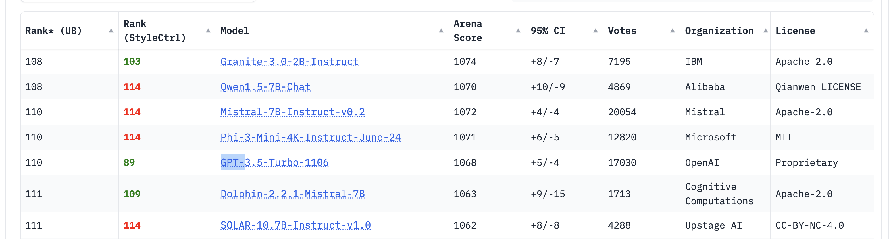
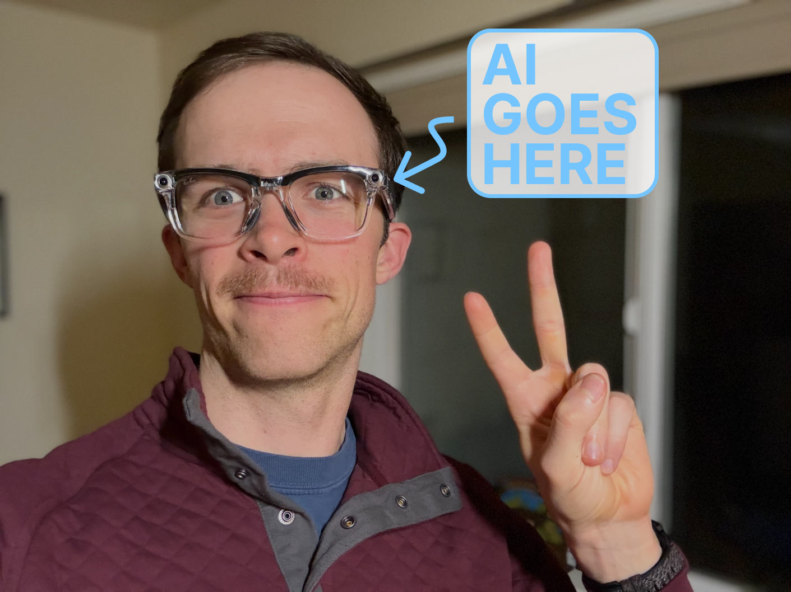

With the Rabbit r1, the Humane pin, the [Friend](https://friend.com/) thing, the Sam Altman rumors, Meta Ray-Bans, and [everything in between](https://www.bee.computer/), it is obvious that we are going to get new devices in the near future driven by advancements in AI. Trying some of those that already are public makes this obvious from a functional perspective rather than a marketing perspective.

Even though many of these devices will have a shelf life drastically shortened by the underlying API access getting turned off when the parent company runs out of money, the call for these devices is very strong. AI is going to be more than a chat window we use for work, we just don't know what that will feel like. AI should be fun, flexible, and available.

[Meta's Ray-Bans](https://en.wikipedia.org/wiki/Ray-Ban_Meta) were first launched in 2021, long before any of this ChatGPT-inspired interest in AI began. Having tried them --- the form factor would have caught on eventually, but AI was the catalyst to accelerate adoption. AI expanded our expectations for the range of exciting outcomes that could be coming our way.

Using the AI in the Ray-Bans is much like using a protolithic chatbot. If I had never used ChatGPT, it would have been transformative, but today it feels slightly outdated. We should be more impressed by these generally and contextualize the AI they're delivering. The product excitement cumulatively feels unexpectedly like what AirPods had on day 1. I was not expecting this fondness.

The form factor for the Meta Ray-Bans is fantastic and drives this connection. I've been legitimately *excited* to use them (albeit, much more during sunny Seattle summers relative to now), and it immediately made sense when taking them out of the packaging. My best use has been for outdoor activities, taking photos and videos without needing to fuss with a phone and communications. An example video is below \-- like most things, it has a learning curve.Here's a photo from that outing:

Or a video:

::: {.native-video-embed attrs="{\"mediaUploadId\":\"746e6e57-b05b-4855-8016-490431e7503e\",\"duration\":null}" component-name="VideoPlaceholder"}
:::

Clearly, they're fine.

What I want to use them for today has nothing to do with AI. In some ways, this makes me more bullish on the form factor, but it makes it clear that Meta is in a precarious position. Ironically, I would've been more reluctant to buy them if not for the excitement about AI.

As of writing this, I would much rather have "Apple Ray-Bans" because of a seamless integration with the rest of my information ecosystem. However, Apple may not be willing to take the risk to build them (as I avoid an Apple Vision Pro Digression).

This does not mean the long-term story of many new devices won't be the AI.

AI, in the recent past (and likely in the near future), left most electronic devices with an eerie, bland sameness. My sunglasses can answer basic questions about my day just like Siri. At the same time, my appliances try to talk to me. The hard-to-visualize step is how this changes (and overcomes the same [integration dead ends](https://www.interconnects.ai/p/llm-agents-integration) that agents face). AI in 5 years (or way less) *will* actually know the context of our lives and be able to execute basic web tasks.

When the AI is good, Meta Ray-Ban type devices will be indispensable. Reminders, calls, reasoning, integration, all on the go. Much like the sensation products like AirPods provide, AI devices (and services) done right will make us free to be in the world naturally.

Meta now has a real hill to climb for AI. They just need to focus on building one more useful feature at a time rather than building a god. They have a tangible goal and a real product that is going to get better in the normal march of progress. If only we had an ecosystem of people who wanted to do this work and keep hill climbing the AI part for them.

The AI of the Meta Ray-Bans (and the other devices I started with) being primarily in the cloud is a drag but is needed for these first generations of glasses to maintain battery life. The cloud-centric nature of the AI is the largest perceivable reason Meta cannot open a Software Development Kit (SDK) for the glasses --- all the developers would be doing is changing Meta\'s internal Llama API calls, rather than uploading new and improved models to the glasses.

AI models in the cloud are consistently the first ones to cross the frontier of new capabilities. As we figure out what we want to use new AI devices for, using the cloud models will make us more likely than not to find useful applications. Now that we have things that people actually like, we need to optimize and specialize these models out of the cloud.

### What's the state of local LMs?

The AI angle for this post is to prompt the question: What do people actually use local, or on-device, language models for? What are they driving innovation of?

The local model ecosystem is composed of a distribution of tinkerers, researchers, and those whom API models refuse their use cases. Most people doing this are not directly innovating on local models in a way that dictates meaningful improvements to underlying AI innovations. Yes, companies surely monitor progress and observe lessons, but there are far bigger markets at play for why local models *are needed* in the future of AI than the tinkerers that get visibility.

Local language models are crucial for maintaining privacy (not everyone can afford fancy inference data centers like Apple), optimizing inference speed, and providing access in situations with no web connectivity.[1](#footnote-1){#footnote-anchor-1 .footnote-anchor component-name="FootnoteAnchorToDOM" target="_self"} The Meta Ray-Bans stand to benefit from all of these.

Phrasing the reasoning starting from the frontier, cloud models most people are used to, rather than what we want, it goes as: Local models shouldn't try to be our general use case model. Outsource that to the cloud. Use local models for efficient, specific tasks out in the world.

What local model enthusiasts are doing is building an ecosystem around optimization, latency, and task specialty that drives a lot of value. This value is captured by companies with no feedback loops to the tinkerers. Having SDKs and other direct places where those evolving local models can benefit in real ways is the goal. The models themselves will actually get better too --- an actual potential feedback loop from open AI models.

Just about a year ago I wrote a very similar take on local models, on how they have different trade-offs and trajectories. Apple Intelligence, Google's new models / Pixel phones, and the Meta Ray-Bans are showing us that this future is coming.

::: {.digest-post-embed attrs="{\"nodeId\":\"3b604000-da41-44a3-82a5-09c528bc0531\",\"caption\":\"Everyone knows local models, e.g. running large language models (LLMs) on consumer’s own hardware, is going to enable new ways of using the technology. Local LLMs can provide benefits beyond common themes like customization and information security. In the takeoff phase of technology like LLMs, new ways of using them often give you a chance at finding s…\",\"cta\":null,\"showBylines\":true,\"size\":\"sm\",\"isEditorNode\":true,\"title\":\"Local LLMs, some facts some fiction\",\"publishedBylines\":[{\"id\":10472909,\"name\":\"Nathan Lambert\",\"bio\":\"ML researcher making sense of AI research, products, and the uncertain technological future. PhD from Berkeley AI. Experience at Meta, DeepMind, HuggingFace.\",\"photo_url\":\"https://substackcdn.com/image/fetch/f_auto,q_auto:good,fl_progressive:steep/https%3A%2F%2Fsubstack-post-media.s3.amazonaws.com%2Fpublic%2Fimages%2F8fedcdfb-e137-4f6a-9089-a46add6c6242_500x500.jpeg\",\"is_guest\":false,\"bestseller_tier\":100}],\"post_date\":\"2024-01-24T13:01:04.983Z\",\"cover_image\":\"https://substackcdn.com/image/fetch/f_auto,q_auto:good,fl_progressive:steep/https%3A%2F%2Fsubstack-post-media.s3.amazonaws.com%2Fpublic%2Fimages%2Fa0fe029a-57e2-4623-b3c9-0ef7cbe61d0b_1792x1024.png\",\"cover_image_alt\":null,\"canonical_url\":\"https://www.interconnects.ai/p/local-llms\",\"section_name\":null,\"video_upload_id\":null,\"id\":140953745,\"type\":\"newsletter\",\"reaction_count\":25,\"comment_count\":2,\"publication_name\":\"Interconnects\",\"publication_logo_url\":\"https://substackcdn.com/image/fetch/f_auto,q_auto:good,fl_progressive:steep/https%3A%2F%2Fsubstack-post-media.s3.amazonaws.com%2Fpublic%2Fimages%2Fe70f9dbf-4fe6-404c-b6bb-1831d1b7ed0b_590x590.png\",\"belowTheFold\":true}"}
:::

What is left to be understood is the *manner* in which local models are developed for new devices. Will any major technology companies let us run our own models with deep integrations? How can open-source principles and local models synergize?

### Hillclimbing with open, local language models

Giving developers ways to integrate their own AI models into the operating system (OS) hooks used by the Meta Ray-Bans would immediately spawn a platform for local, open-weight language models. I first learned how locked down the Ray-Ban developer ecosystem was because I was excited to try and get our multimodal LM [Molmo](https://www.interconnects.ai/i/149411654/molmo-a-mostly-open-source-equivalent-to-llama-vision) on them. That attempt didn't make it far.

Other companies, like Apple, could conceivably have SDKs that let users point their language models at OS hooks. Creating operating systems that allow users to integrate certain open models (even only those that are approved by the companies) would completely change the (lack of) incentives for iterating on language models in the open.

While we *still* don't have the new [Apple Intelligence](https://www.interconnects.ai/p/apple-intelligence) version of Siri that can plug into multiple applications, we know this works by letting an AI model generate tokens that correspond to actions in other applications. Letting users choose AI models (maybe their own), even if they only are useful in a subset of the tasks, would be wonderful. I would love to sacrifice whatever the AI situation is on my version of the Ray-Bans by default and get just the best vision model for explaining my environment, the best model for cooking ideas, or the best conversational model to just push the limits for AI devices in any of these promising directions. It would be so fun to try different AI models on a real device.[2](#footnote-2){#footnote-anchor-2 .footnote-anchor component-name="FootnoteAnchorToDOM" target="_self"}

The open language modeling ecosystem desperately needs these types of feedback loops (and it is totally natural for excitement about a type of technological development like this to exist before the proof cases of its value).

Getting to the point where Meta has an AI SDK for devices along with the leading open language models will make their [entire strategy](https://www.interconnects.ai/i/146932988/metas-open-frontier-model) value additive (rather than just destroying the advantages of competitors). In fact, Meta[3](#footnote-3){#footnote-anchor-3 .footnote-anchor component-name="FootnoteAnchorToDOM" target="_self"} likely *needs to do so,* or else [Apple's product competitor](https://www.cnet.com/tech/mobile/apple-reportedly-developing-smart-glasses-to-rival-metas-ray-bans/#:~:text=The%20company%20intends%20to%20pour,expected%20to%20launch%20in%202027.) may dominate the market. Only different strategies and feedback loops can dislodge Apple's integration.

On the modeling side, there's no doubt we have step-change improvements coming to those used on the Ray-Bans. On ChatBotArena, we have many models with a few billion parameters that beat the first versions of ChatGPT. The same type of performance gain --- where at 100X smaller model can match or surpass performance in a few years --- will come for the Ray-Bans and all other sorts of AI applications.

------------------------------------------------------------------------

### The big picture arc of technology

Starting in 2025, I'm excited about the *breadth* and *quantity* of profound, new technological experiences I'm having. Some of them, like ChatGPT Advanced Voice Mode, haven't really landed for me (even though they're extremely impressive to non-tech non-AI friends and family). Meta Ray-Bans, Waymos, Codex, and standard ChatGPT all feel like technologies that were immediately obvious as something I needed. I need to get a Starlink hub in one of the remote locations my hobbies bring me to, and I'm sure I can add reusable rockets to the transformations I've embraced.

The last technologies sparking these joys were the likes of the iPod and the iPad.

Every person I take to ride a Waymo for the first time has a similar experience of joy.

This year we may also have new models that solve arbitrary internet tasks for us in the background.

The future is here and we're living in a time where it'll be more evenly distributed.

:::: {.footnote component-name="FootnoteToDOM"}
[1](#footnote-anchor-1){#footnote-1 .footnote-number contenteditable="false" target="_self"}

::: footnote-content
Part of the excitement for Nvidia's new powerhouse local GPU, [Digits](https://www.nvidia.com/en-us/project-digits/), is that you can have a copy of a leading language model saved in case of X disaster. Yes, this is mostly ridiculous.
:::
::::

:::: {.footnote component-name="FootnoteToDOM"}
[2](#footnote-anchor-2){#footnote-2 .footnote-number contenteditable="false" target="_self"}

::: footnote-content
Yes, I have enrolled in the [beta program for early access](https://www.meta.com/help/smart-glasses/articles/voice-controls/early-access-program-ray-ban-meta-smart-glasses/?srsltid=AfmBOopePBgY-ls3e3mGt3BoTwIFxLfU7i24KkyyuFCWzJqKA7gL46Tk) to new Meta Ray-Ban AI features, but I haven't heard anything.
:::
::::

:::: {.footnote component-name="FootnoteToDOM"}
[3](#footnote-anchor-3){#footnote-3 .footnote-number contenteditable="false" target="_self"}

::: footnote-content
The problem is that Ray-Ban, the key brand that enables them to kickstart their product as something people would actually *love* may have concerns over opening up their brand.
:::
::::
