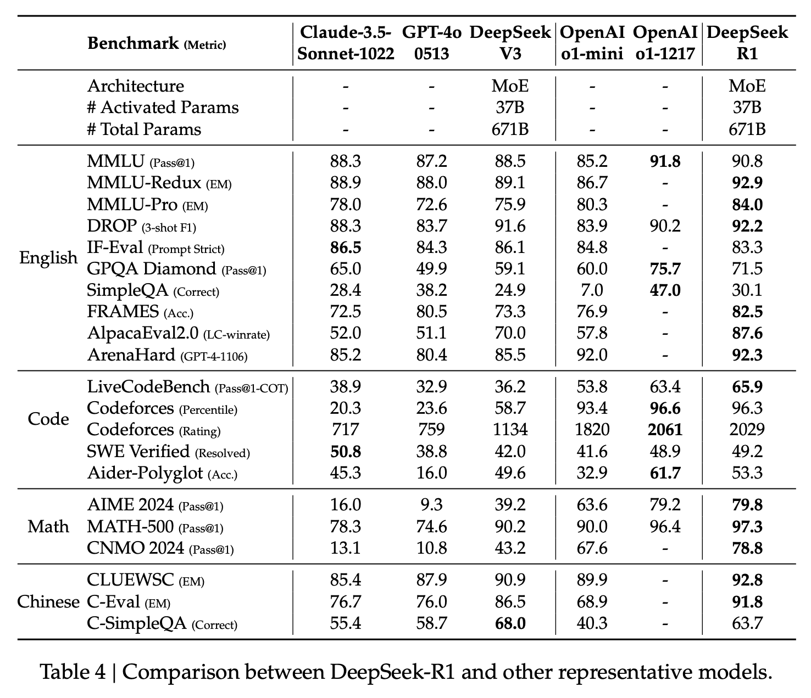
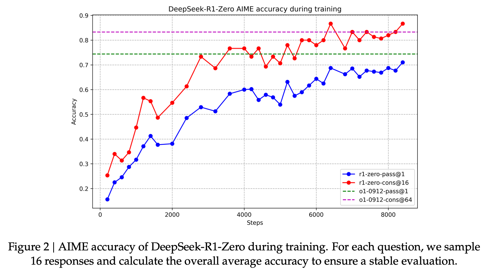
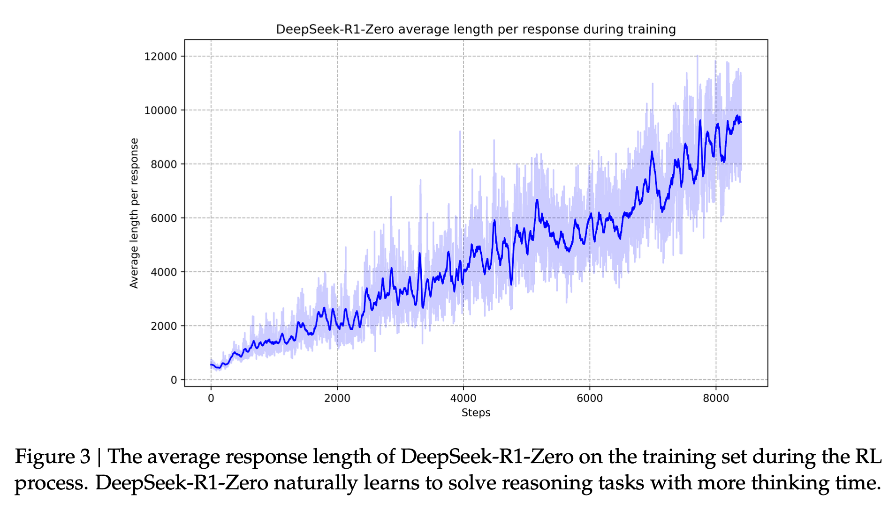
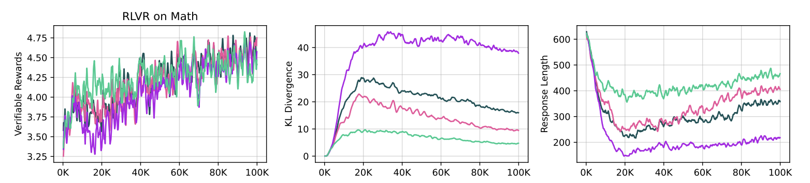
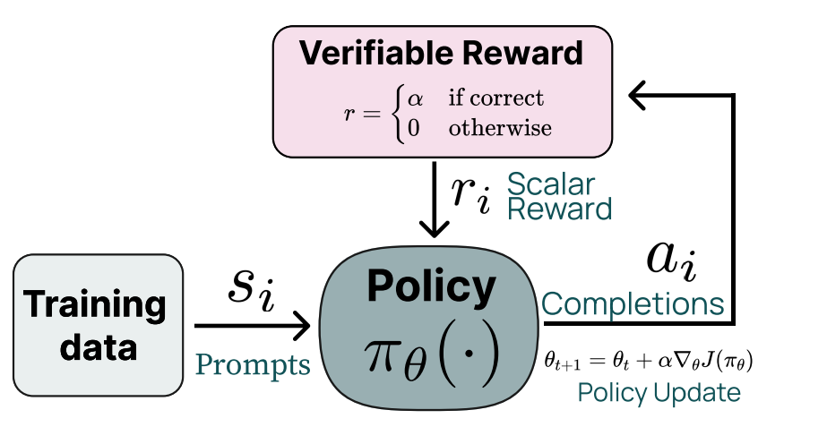
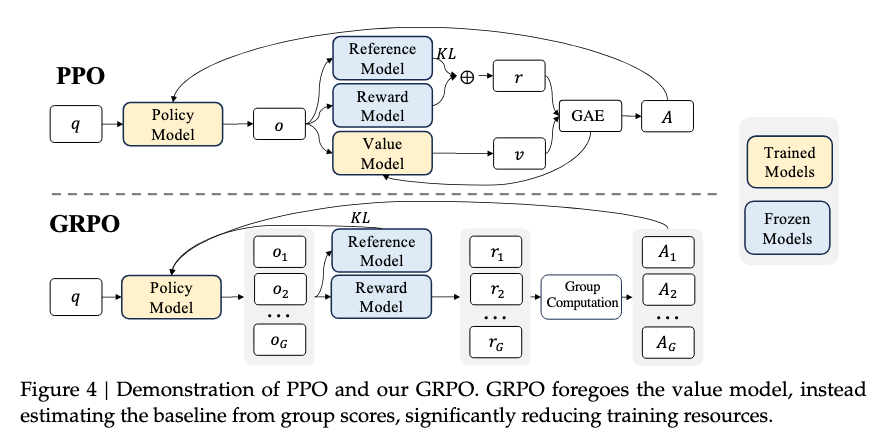

*I have a few shows to share with you this week:*

1.  *On [The Retort](https://retortai.com/episodes/we-ask-again-is-ai-a-science) a week or two ago, we discussed the nature of AI and if it is a science (in the [Kuhn'ian](https://en.wikipedia.org/wiki/The_Structure_of_Scientific_Revolutions) sense)*

2.  *I appeared on* *and 's new podcast to discuss "thinking models" and the border between post-training and reasoning methods. Listen [here](https://www.aisummer.org/p/nathan-lambert-on-the-rise-of-thinking).*

3.  *Finally, a talk I gave at NeurIPs on [how I think about post-training for AI applications](https://youtu.be/grpc-Wyy-Zg) is now public.*

*This post is likely getting cut off in email inboxes --- I recommend reading online by clicking on the title!*

------------------------------------------------------------------------

Yesterday, January 20th, China's open-weights frontier AI laboratory, DeepSeek AI, released their first full fledged reasoning model. It came as:

-   A flagship reasoning language model, [R1](https://huggingface.co/deepseek-ai/DeepSeek-R1), trained via a 4-stage, RL heavy process. It is **MIT-licensed** which means companies and researchers can build upon and train on its outputs to accelerate the development and deployment of reasoning language models (RLMs).

-   An RL-only reasoning model trained directly from their V3 base model, [R1-Zero](https://huggingface.co/deepseek-ai/DeepSeek-R1-Zero) (used to create training data for full R1).

-   A suite of open-weight models finetuned with supervised finetuning (SFT) data derived from R1 (similar data to one of their intermediate training steps).

-   A [technical report](https://github.com/deepseek-ai/DeepSeek-R1/blob/main/DeepSeek_R1.pdf) detailing their RL training methods.

-   Models are available at [chat.deepseek.com](http://chat.deepseek.com) (via DeepThink) and in their [new app](https://apps.apple.com/us/app/deepseek-ai-assistant/id6737597349).

This post is less about the evaluation results (which, of course, are [extremely good](https://x.com/TheXeophon/status/1881443117787984265) and shown below)[1](#footnote-1){#footnote-anchor-1 .footnote-anchor component-name="FootnoteAnchorToDOM" target="_self"}, but rather about *how training is done* and *what it all means*.

This is a major transition point in the uncertainty in reasoning model research. Until now, reasoning models have been a major area of industrial research without a clear seminal paper. Before language models took off, we had the likes of the GPT-2 paper for pretraining or InstructGPT (and Anthropic's whitepapers) for post-training. For reasoning, we were staring at [potentially misleading](https://www.interconnects.ai/p/openais-o1-using-search-was-a-psyop) blog posts. Reasoning research and progress is now locked in --- expect huge amounts of progress in 2025 and more of it in the open.

This again confirms that new technical recipes normally aren't moats --- the motivation of a proof of concept or leaks normally get the knowledge out.

For one, look at the pricing of these reasoning models. OpenAI was likely charging more for its model due to the costs of long-context serving and being the only model in town, but now o1's [pricing](https://openai.com/api/pricing/) at \$15 per million input tokens / \$60 output looks out of place relative to R1's [pricing](https://api-docs.deepseek.com/quick_start/pricing) at \$0.55 per million input tokens / \$2.19 output (yes, o1-mini is cheaper at \$3/\$12 per million, but still almost a 10x difference). The price war that is coming for reasoning models will look like the [Mixtral inference price war from 2023](https://www.latent.space/i/140396949/mixtral-sparks-a-gpuinference-race-to-the-bottom).

With o3, OpenAI is likely technically ahead, but it is not generally available nor will the weights be available anytime soon. This points to the first time since Stable Diffusion's release that the most relevant and discussed AI model is released with a very friendly license. Looking back at the journey "[open-source](https://www.interconnects.ai/t/open-source)" AI has been on over the last 2.5 years, this is a surprising moment in time marked in the history books.

We don't entirely know how these models will be used in the future beyond code and math, but noises are constantly bubbling up that OpenAI's o1-Pro is the best model for many more challenging tasks (I need to try it myself before making definitive recommendations).

The most useful post to write now is one that establishes the research area, the do's and don'ts, and the open questions. Let's get into the details.

## The DeepSeek R1 training recipe for reasoning

The training of R1 comes in 4 stages:

1.  "Cold-start" of supervised finetuning on synthetic reasoning data from the R1-Zero model.[2](#footnote-2){#footnote-anchor-2 .footnote-anchor component-name="FootnoteAnchorToDOM" target="_self"}

2.  Large-scale reinforcement learning training on reasoning problems "until convergence."

3.  [Rejection sampling](https://rlhfbook.com/c/10-rejection-sampling.html) on 3/4 reasoning problems and 1/4 general queries to start the transition to a general-purpose model.

4.  Reinforcement learning training mixing reasoning problems (verifiable rewards) with general preference tuning reward models to polish the model.

Below, the post breaks down each training stage into its core components, insights, and open questions.

The winds of o1 replication have been blowing strongly away from any sort explicit search (especially at inference time). It really was, and is, a language model with the new reasoning behaviors coming from a lot of RL training.

::: {.digest-post-embed attrs="{\"nodeId\":\"e5d226dc-95ed-45a6-9edd-2ca58e61e573\",\"caption\":\"Some housekeeping: I’m planning on raising the price of Interconnects in the new year. I’m producing a lot more content than I expected and the Discord server is doing fantastic. It’s a good time to upgrade to an annual subscription — this is effectively a large holiday discount until the price raises in 2025. Or, you can always\",\"cta\":null,\"showBylines\":true,\"size\":\"sm\",\"isEditorNode\":true,\"title\":\"OpenAI's o1 using \\\"search\\\" was a PSYOP\",\"publishedBylines\":[{\"id\":10472909,\"name\":\"Nathan Lambert\",\"bio\":\"ML researcher making sense of AI research, products, and the uncertain technological future. PhD from Berkeley AI. Experience at Meta, DeepMind, HuggingFace.\",\"photo_url\":\"https://substackcdn.com/image/fetch/f_auto,q_auto:good,fl_progressive:steep/https%3A%2F%2Fsubstack-post-media.s3.amazonaws.com%2Fpublic%2Fimages%2F8fedcdfb-e137-4f6a-9089-a46add6c6242_500x500.jpeg\",\"is_guest\":false,\"bestseller_tier\":100}],\"post_date\":\"2024-12-04T13:03:08.690Z\",\"cover_image\":\"https://substack-post-media.s3.amazonaws.com/public/images/44840c49-9a71-439b-9a6c-b08abe3b60fa_1980x1113.png\",\"cover_image_alt\":null,\"canonical_url\":\"https://www.interconnects.ai/p/openais-o1-using-search-was-a-psyop\",\"section_name\":null,\"video_upload_id\":null,\"id\":151483351,\"type\":\"newsletter\",\"reaction_count\":60,\"comment_count\":2,\"publication_name\":\"Interconnects\",\"publication_logo_url\":\"https://substackcdn.com/image/fetch/f_auto,q_auto:good,fl_progressive:steep/https%3A%2F%2Fsubstack-post-media.s3.amazonaws.com%2Fpublic%2Fimages%2Fe70f9dbf-4fe6-404c-b6bb-1831d1b7ed0b_590x590.png\",\"belowTheFold\":true}"}
:::

Before we start, remember that to do this reasoning training well you need a very strong base model with long-context capabilities. Much like for standard post-training, we [don't really know](https://x.com/sea_snell/status/1881453551974805684) what traits of a base model make for one that is more suited for direct RL training.

### Step 0. Training R1-Zero to initialize R1 with synthetic data

DeepSeek R1 Zero will be best known as the first open model trained with "large-scale reinforcement learning (RL) without supervised fine-tuning (SFT) as a preliminary step." Rumors had mentioned this for o1, but understanding how it worked wasn't clear. This is a funky model that DeepSeek reports will sometimes change languages in reasoning or show signs of other reliability issues.

The minor usability issues with R1-Zero show why more than *just* large-scale RL is needed to train a fantastic reasoning model, but the RL part is the key to unlocking the reasoning behaviors we are searching for.

They include the most interesting results for R1-Zero, including the plot I've been asking for of RL-training time scaling. Since o1's release, everyone has been obsessed with the plots showing how *inference time* is correlated with evaluation performance. Inference time is far easier to elicit (or force by using a framework like Monte Carlo Tree Search), but showing *training time* improvements via RL is the real foundational result. This is the result I'm searching for in my research.

And an unsurprising, yet very satisfying plot of length growing with training. This could be mixed with the above plot to make one of the "inference time scaling" plots we have seen many versions of with less clear methods.

In both of these plots, it looks like the numbers could still be going up if they let the RL cook longer. With the pace of progress so high, these laboratories get more gains by ending the jobs near saturation and starting the next experiment instead of seeking that last 1%.

Most, if not all, researchers will skip the step of training an R1-Zero style model because they don't need to. DeepSeek made it clear that their "cold start" of SFT reasoning traces makes the final R1 model better --- this is unsurprising, as they want R1 to be a certain type of instruction-tuned model. It'll help avoid some of the "RL oddities" in R1-Zero that DeepSeek mentions like changing language mid-generation.

Still, the area of RL-on-base-models should be studied further. The way that R1-Zero can be trained is quite clever as most base models without any instruction tuning have a major issues with rambling and never generating a stop token. R1-Zero avoids this with a system prompt telling the model to generate \<answer\> HTML tags. Additionally, I suspect this type of training wouldn't work on older base models that don't have some standard post-training style instruction data in the pretraining corpus. For example, in OLMo 2 we had some MATH instruction data in the [annealing mix](https://huggingface.co/datasets/allenai/dolmino-mix-1124). Just a few instructions will let this system prompt work.

In fact, the trend of increasing generation length via RL training could be even stronger when training directly from a base model rather than a standard post-trained model that doesn't have a verbose chain of thought style. In order for RL to really start cranking up the response length in such an instruction-following model it will have to unlearn a certain response length that was baked in. For example, in Tülu 3's final stage of RL finetuning, the phase where the response rate first goes down could be the barrier of misalignment between a larger round of SFT training before a smaller RL setup.

Zooming in on the x-axes of these R1-Zero plots, you can see that they're doing 1000s of "RL steps." RL step in this case refers to the model update step, which comes after multiple generations are made for the prompts in the batch and then answers are verified.[3](#footnote-3){#footnote-anchor-3 .footnote-anchor component-name="FootnoteAnchorToDOM" target="_self"} This is a large amount of RL training, especially with such a large model. For reference, in our [Tülu 3](https://arxiv.org/abs/2411.15124) work, we finetuned our models for 100s of steps normally, and the biggest models we are releasing soon only trained for \~50 steps of RL.

This is scaled-up RL relative to existing literature. R1 proper surely uses a similar setup, but DeepSeek did not include the same details, so the rest of this post relies more on explicit text in the paper.

### Step 1. Reasoning SFT "Cold Start"

In order to **improve the readability** (i.e. help maintain formatting) and **increase the final performance** of the final reasoning model, DeepSeek performs a small amount of supervised finetuning on the original base model with "a few thousand" filtered completions from the R1-Zero model. This involves a few tricks (none of which seem essential, you just need some of this data), such as:

> Using few-shot prompting with a long CoT as an example, directly prompting models to generate detailed answers with reflection and verification, gathering DeepSeek-R1-Zero outputs in a readable format, and refining the results through post-processing by human annotators.

For replication efforts, any of these can be done. In fact, using DeepSeek-R1 itself is likely the easiest way.

This phase readies the loss landscape of the model to make the "emergent" behaviors like "wait, let me check my work" or "that was wrong" come forth more easily in RL training.

### Step 2. Large-scale RL for reasoning

As a reminder, RL for reasoning models is built on a simple idea where you should reward the model for getting correct answers to problems where you can check if it has a correct answer. A basic feedback loop of this looks like the following:

Exactly what the "reward" is here (the same question applies for R1-Zero) isn't detailed. DeepSeek mentions three reward components during the reasoning phase of RL:[4](#footnote-4){#footnote-anchor-4 .footnote-anchor component-name="FootnoteAnchorToDOM" target="_self"}

1.  **Accuracy rewards:** These are score bonuses if the response to a prompt is correct. I've been referring to these as "verifiable" domains and in OpenAI's [Reinforcement Finetuning](https://www.interconnects.ai/p/openais-reinforcement-finetuning) this is handled by their graders. TLDR: If the answer is correct, the reward is positive, if not, it is 0.[5](#footnote-5){#footnote-anchor-5 .footnote-anchor component-name="FootnoteAnchorToDOM" target="_self"}

2.  **Format rewards:** These are rewards (or penalties if not satisfied) to check and make sure that the model follows the correct formatting of \<think\> or \</think\> and \<answer\> and \</answer\> for stable inference.

3.  **Language consistency rewards**: A reward is added to the model if the language of the answer is 100% matching the language of the question. DeepSeek writes that this additional reward shows a "slight degradation in the model's performance," but better human preferences. It's added to make the model nice to use, which is a wonderful reminder that evaluation scores are not all that matters.

The first reward here drives the majority of the learning and the other two are guardrails for creating a stable model (which is not to say they aren't important implementation details, but rather that the first one is necessary and the others may not be). To optimize this reward, DeepSeek uses the RL algorithm that they introduced, [Group Relative Policy Optimization](https://rlhfbook.com/c/11-policy-gradients.html#group-relative-policy-optimization), which is the PPO update rule with a different value approximation method based on Monte Carlo advantage estimates rather than holding a separate value model in memory. The most likely explanation for this choice (much like how OpenAI has always used PPO) is that it is the mature implementation in their infrastructure.

This image from the [DeepSeekMath](https://arxiv.org/abs/2402.03300) paper is a fantastic comparison of PPO to GRPO (this is fine to skip this if you only care about the big picture recipe):

The nature of the reward setup (and the data) is the key to this sort of reasoning training and many of the small RL details can be substituted for each other.

Much like the DeepSeek V3 paper, the details of what data they used to train the model are not included here. This is absolutely crucial and almost certainly involves many, many verifiable prompts with answers. In order to study these models the community needs open versions of these datasets.

I would've loved to see details of their RL infrastructure (similar to the [details](https://www.interconnects.ai/i/154176259/deepseeks-learning-efficiency) in the DeepSeek V3 paper), as many people are looking to build on these models. RL training requires holding multiple models in memory and alternating between generating, verifying, and taking loss steps. As [Sasha Rush says](https://x.com/srush_nlp/status/1881383080528924868), "We need to code up verifiers ASAP," which is what we are trying to do at Ai2 building on Tülu 3 and could use a lot of help with the [open-source code](https://github.com/allenai/open-instruct).[6](#footnote-6){#footnote-anchor-6 .footnote-anchor component-name="FootnoteAnchorToDOM" target="_self"} A good approach for entities interested here is to develop tooling and data for one domain at a time.

These first two steps are not new but rather scaled-up versions of ideas people have been discussing extensively. The final two steps DeepSeek details in the paper are new applications of known techniques to help take their raw reasoning performance and "train a user-friendly model."

### Step 3. Rejection Sampling to introduce general abilities

[Rejection sampling](https://rlhfbook.com/c/10-rejection-sampling.html) is a technique where you generate completions from a model, rank them via a reward model, and then finetune the original model (normally with the supervised finetuning loss) to improve performance on a variety of tasks. It's one of the standard post-training tools used by Llama 3 and many others.

DeepSeek uses rejection sampling to begin to introduce general capabilities back into the model. It is also the one stage where they include data numbers --- 800K completions total, split as 600K for reasoning and 200K for general chat problems. The 800K number is not surprising to me given this is just a late-stage SFT training, but it is similar in size to the \~1M prompts we used in the Tülu 3 SFT mix which is the ballpark for leading post-training recipes.

The details in the paper are largely around methods for *generating responses* to prompts and *filtering* to prioritize high-quality training data. In order to bring more domains into the scope of abilities for the model, DeepSeek has a variety of tricks, such as:

-   Using generative reward models (i.e. LLM-as-a-judge) to verify answers to questions that may not be explicitly verifiable,

-   Data from the DeepSeek-V3 standard post-training pipeline, and

-   Standard (nonverifiable) chat data augmented with extended chain of thought before answering to help the model generalize from reasoning training to broader use cases.

All in, we currently have very few details here and there is a lot of open space to learn (and likely improve).

### Step 4. Final RL training for general use

Finally, DeepSeek R1 goes back to reinforcement learning, which really seems to be how most finetuning is ending these days. The second RL stage is "aimed at improving the model's helpfulness and harmlessness while simultaneously refining its reasoning capabilities."

In order to do this, they do RL training that mixes prompts from the verifiable domains (as done for R1-Zero) and prompts for standard RLHF preference tuning. In order to do this they have multiple reward models and build upon their post-training recipe in DeepSeek V3.

This is not easy to do and involves many questions: What is the right data balance? Can you use an off-the-shelf existing reward model or does it need to have seen long reasoning traces? Are there additional steps needed to not degrade performance? And so on.

As this grows into a larger area of research and development these questions will slowly be answered.

As this post has transitioned into the later stages of training, it is clear that many details are unknown. We have the general shape of how to sequence things and will fill in the details from here. I have a very long stack of reasoning-related research papers to poke through, and while they came before DeepSeek R1, they still will point toward answers.

All of this is solvable, as proven by how quickly DeepSeek went from the o1 release to matching performance with an open weights model.

------------------------------------------------------------------------

## Discussions and next steps

The DeepSeek R1 report has an entire other subsection dedicated to its distillation experiments, where it took completions from the R1 model and finetuned existing open-weight models with them to boost performance. This is a fantastic service for them to release this and provides a solid baseline for RL experiments on smaller models to try and match in the near future.

The discussion in the paper on how large models are required to see the biggest reasoning gains (and generate effective synthetic data) is likely the biggest open question:

> First, distilling more powerful models into smaller ones yields excellent results, whereas smaller models relying on the large-scale RL mentioned in this paper require enormous computational power and may not even achieve the performance of distillation. Second, while distillation strategies are both economical and effective, advancing beyond the boundaries of intelligence may still require more powerful base models and larger-scale reinforcement learning.

As smaller models continually improve over the years, it is likely that the same type of training could work on something like Llama 5 or 6 8B. It leaves us with the same, open question as to *why* different abilities "emerge" at larger models. Scaling laws are the reasons that each generation's *frontier* models tend to be the largest models available. The exciting form of this question for 2025 is: How *small* will the slow progress of language modeling research drive advanced reasoning capabilities?

Every so often a paper comes around that makes the path forward clear. The last time I felt this way was with the Llama 3 report for post-training, which solidified into the [Tülu 3 paper](https://www.interconnects.ai/p/tulu-3).

::: {.digest-post-embed attrs="{\"nodeId\":\"9c25a361-f982-443d-a7d3-8770ea9d756c\",\"caption\":\"InstructGPT, WebGPT, Sparrow, Summarizing from Human Feedback, and Helpful and Harmless Assistant are most of the search terms for people trying to find the “default RLHF recipe.” I’ve said the rule of thumb of 10k high quality instructions and 100k preferences so many times. These are the seminal works that bridge the gap from a new research area to th…\",\"cta\":null,\"showBylines\":true,\"size\":\"sm\",\"isEditorNode\":true,\"title\":\"A recipe for frontier model post-training\",\"publishedBylines\":[{\"id\":10472909,\"name\":\"Nathan Lambert\",\"bio\":\"ML researcher making sense of AI research, products, and the uncertain technological future. PhD from Berkeley AI. Experience at Meta, DeepMind, HuggingFace.\",\"photo_url\":\"https://substackcdn.com/image/fetch/f_auto,q_auto:good,fl_progressive:steep/https%3A%2F%2Fsubstack-post-media.s3.amazonaws.com%2Fpublic%2Fimages%2F8fedcdfb-e137-4f6a-9089-a46add6c6242_500x500.jpeg\",\"is_guest\":false,\"bestseller_tier\":100}],\"post_date\":\"2024-08-07T12:01:28.333Z\",\"cover_image\":\"https://substackcdn.com/image/fetch/f_auto,q_auto:good,fl_progressive:steep/https%3A%2F%2Fsubstack-post-media.s3.amazonaws.com%2Fpublic%2Fimages%2F3e67e4a8-b33d-43f3-b8b2-cf3bd087faf5_1730x894.png\",\"cover_image_alt\":null,\"canonical_url\":\"https://www.interconnects.ai/p/frontier-model-post-training\",\"section_name\":null,\"video_upload_id\":null,\"id\":147349899,\"type\":\"newsletter\",\"reaction_count\":57,\"comment_count\":0,\"publication_name\":\"Interconnects\",\"publication_logo_url\":\"https://substackcdn.com/image/fetch/f_auto,q_auto:good,fl_progressive:steep/https%3A%2F%2Fsubstack-post-media.s3.amazonaws.com%2Fpublic%2Fimages%2Fe70f9dbf-4fe6-404c-b6bb-1831d1b7ed0b_590x590.png\",\"belowTheFold\":true}"}
:::

Soon, I'll comment on...

-   Distillation of reasoning traces (as done in the R1 paper),

-   The demise of process reward models (PRMs) and Monte Carlo Tree Search (MCTS),

-   Some things in the DeepSeek paper, like the "Aha" moment and over-indexing on human priors, that annoy me,

-   The new reasoning research coming out from academia,

-   The other reasoning model that dropped yesterday --- [Kimi 1.5](https://github.com/MoonshotAI/Kimi-k1.5/blob/main/Kimi_k1.5.pdf),

-   The biggest application of Tülu 3 RLVR yet, and

-   All the other ideas that are under debate in the reasoning model space.

R1 is surely not the only way to train these models, but it is the recipe that people will build off immediately. Let's get cranking on more datasets and infrastructure.

*For those new here, you can check out the [Inference & Reasoning](https://www.interconnects.ai/t/inference) tag on Interconnects!*

:::: {.footnote component-name="FootnoteToDOM"}
[1](#footnote-anchor-1){#footnote-1 .footnote-number contenteditable="false" target="_self"}

::: footnote-content
It will take a substantial amount of work to be confident in how close the models actually are. If you had to have me choose I would choose OpenAI, as they're serving a larger user base and in my opinion are less structurally inclined to maximize evaluation scores relative to actual usefulness. I'll formulate stronger opinions here over time, but initial conversations make me think that the R1 model is in the ballpark.
:::
::::

:::: {.footnote component-name="FootnoteToDOM"}
[2](#footnote-anchor-2){#footnote-2 .footnote-number contenteditable="false" target="_self"}

::: footnote-content
I do not count generating the reasoning data as step 0 as this can now be done easily with R1, Qwen QwQ, or alternatives. Soon, there will be plenty on HuggingFace.
:::
::::

:::: {.footnote component-name="FootnoteToDOM"}
[3](#footnote-anchor-3){#footnote-3 .footnote-number contenteditable="false" target="_self"}

::: footnote-content
In our Tülu 3 paper we generally have reported episodes, which is related to steps, as it is the total numbers of prompts that we generate for and verify. The number of episodes is proportional to the batch size times the number of RL steps.
:::
::::

:::: {.footnote component-name="FootnoteToDOM"}
[4](#footnote-anchor-4){#footnote-4 .footnote-number contenteditable="false" target="_self"}

::: footnote-content
DeepSeek says they "directly sum" these rewards, but without knowing the scales and shapes, that is not particularly insightful.
:::
::::

:::: {.footnote component-name="FootnoteToDOM"}
[5](#footnote-anchor-5){#footnote-5 .footnote-number contenteditable="false" target="_self"}

::: footnote-content
Or a scaled/shaped version of this.
:::
::::

:::: {.footnote component-name="FootnoteToDOM"}
[6](#footnote-anchor-6){#footnote-6 .footnote-number contenteditable="false" target="_self"}

::: footnote-content
Ross Taylor is [also asking](https://x.com/rosstaylor90/status/1881372810485899716) about their reward shaping, which interacts very closely with the verifiers.
:::
::::
