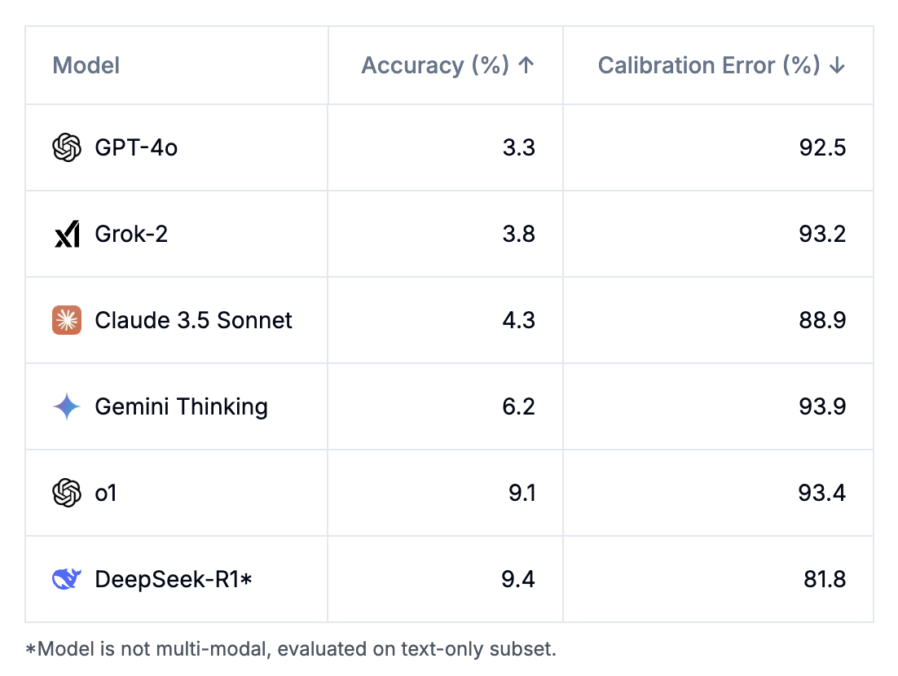
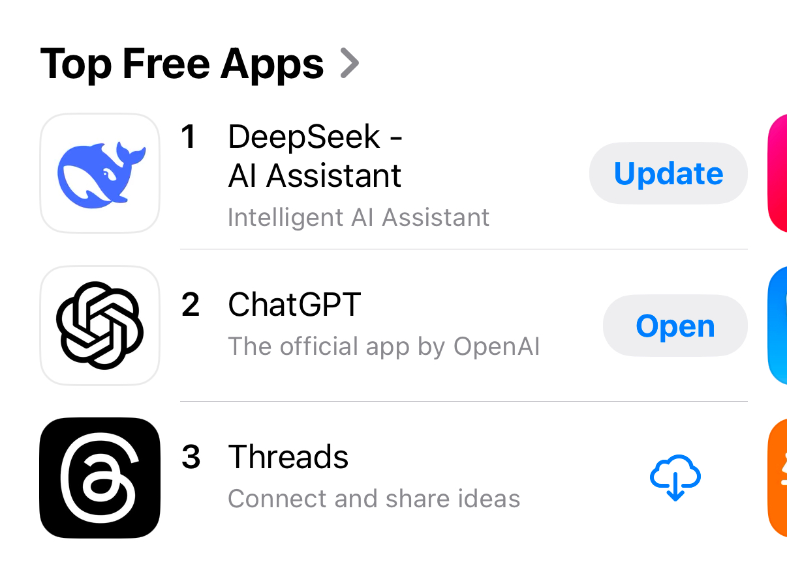

*This post is early to accommodate some last minute travel on my end!*

The new models trained to express extended chain of thought are going to generalize outside of their breakthrough domains of code and math. The "reasoning" process of language models that we use today is chain of thought reasoning. We ask the model to work step by step because it helps it manage complexity, especially in domains where the answer requires precision across multiple specific tokens. The domains where [chain of thought](https://arxiv.org/abs/2201.11903) (CoT) is most useful today are code, mathematics, and other "reasoning" tasks[1](#footnote-1){#footnote-anchor-1 .footnote-anchor component-name="FootnoteAnchorToDOM" target="_self"}. These are the domains where models like o1, R1, Gemini-Thinking, etc. were designed for.

Different intelligences reason in different ways that correspond to how they store and manipulate information. Humans compress a lifetime of experience into our spectacular, low-power brains that draw on past experience almost magically. The words that follow in this blog are also autoregressive, like the output of a language model, but draw on hours and hours of background processing as I converge on this argument.

Language models, on the other hand, are extremely general and do not today have architectures (or use-cases) that continually re-expose them to relevant problems and fold information back in a compressed form. Language models are very large, sophisticated, parametric probability distributions. All of their knowledge and information processing *power* is stored in the raw weights. Therein, they need a way of processing information that matches this. Chain of thought *is that alignment*.

Chain of thought reasoning allows information to be naturally processed in smaller chunks, allowing the large, brute force probability distribution to work one token at a time. Chain of thought, while allowing more compute per important token, also allows the models to *store* intermediate information in their context window without needing explicit recurrence.

Recurrence is required for reasoning and this can either happen in the parameter or state-space. Chain of thoughts with transformers handles all of this in the state-space of the problems. The humans we look at as the most intelligent have embedded information directly in the parameters of our brains that we can draw on.

Here is the only assumption of this piece --- **chain of thought is a natural fit for language models to "reason" and therefore one should be optimistic about training methods that are designed to enhance it generalizing to many domains.**[2](#footnote-2){#footnote-anchor-2 .footnote-anchor component-name="FootnoteAnchorToDOM" target="_self"} By the end of 2025 we should have ample evidence of this given the pace of the technological development.

If the analogies of *types* of intelligence aren't convincing enough, a far more practical way to view the new style of training is a method that teaches the model to be better at allocating more compute to harder problems. If the skill is compute allocation, it is fundamental to the models handling a variety of tasks. Today's reasoning models do not solve this perfectly, but they open the door for doing so precisely.

The nature of this coming *generalization* is not that these models are one size fits all, best in all cases: speed, intelligence, price, etc. There's still no free lunch. A *realistic* outcome for reasoning heavy models in the next 0-3 years is a world where:

-   Reasoning trained models are superhuman on tasks with verifiable domains, like those with initial progress: Code, math, etc.

-   Reasoning trained models are well better in *peak* performance than existing autoregressive models in many domains we would not expect and are not necessarily verifiable.

-   Reasoning trained models are still *better* in performance at the long-tail of tasks, but *worse* in cost given the high inference costs of long-context.

Many of the leading figures in AI have been saying for quite some time that powerful AI is going to be "spikey\" when it shows up --- meaning that the capabilities and improvements will vary substantially across domains --- but encountering this reality is very unintuitive.

Some evidence for generalization of reasoning models already exists.

OpenAI has already published multiple safety-oriented research projects with their new reasoning models in *[Deliberative Alignment: Reasoning Enables Safer Language Models](https://arxiv.org/abs/2412.16339)* and *[Trading Inference-Time Compute for Adversarial Robustness](https://cdn.openai.com/papers/trading-inference-time-compute-for-adversarial-robustness-20250121_1.pdf)*. These papers show their new methods can be translated to various safety domains, i.e. model safety policies and jailbreaking. The deliberative alignment paper shows them integrating a softer reward signal into the reasoning training --- having a language model check how the safety policies apply to outputs.

An unsurprising quote from the deliberative alignment release related to generalization:

> we find that deliberative alignment enables strong generalization to out-of-distribution safety scenarios.

Safety, qualitatively, is very orthogonal to traditional reasoning problems. Safety is very subjective to the information provided and subtle context, where math and coding problems are often about many small, forward processing steps towards a final goal. More behaviors will fit in between those.

This generative verifier for safety is not a ground truth signal and *could* theoretically be subject to reward hacking, but it was avoided. Generative verifiers will be crucial to expanding this training to countless domains --- they're easy to use and largely a new development. The field of LLM-as-a-judge (and related synthetic data pipelines) only really became stable with models at the level of GPT-4.

Reasoning models trained as a judge are a very natural fit because the exact token for a predicted reward or ranking is crucial --- CoT is essential. All of the progress here relies on continued progress on both generators and verifiers. o1 et al. were likely trained with mostly explicit, code verifiers. They spawned far more powerful generators, which will enable new types of verifiers. Then, we can train better models (and so on).

Onto another example of unexpected performance of new reasoning trained models. [DeepSeek-R1](https://www.interconnects.ai/p/deepseek-r1-recipe-for-o1), the new open-weight o1 replication has been showing up at the top of many random benchmarks as top overall, above Claude 3.5 Sonnet, Gemini, and GPT-4o, and alongside o1. Examples include a [creative writing and humor leaderboard](https://eqbench.com/creative_writing.html) or the brand-new, extremely challenging benchmark from the Center for AI Safety and Scale AI --- [Humanity's Last Exam](https://agi.safe.ai/). Oh, and yes, it's best on both accuracy and the new metric "calibration error" which is designed to have the model express its own uncertainty. Calibration is a long-sought behavior in traditional LMs and turns out maybe reasoning training helps it?

A lot of my friends find o1-pro to be clearly the most useful AI model in their daily workflows (one example [here](https://x.com/deanwball/status/1871396913473335701) and a similar R1 example [here](https://substack.com/@jasmine/note/c-88814858)). [ChatBotArena](https://www.interconnects.ai/p/chatbotarena-the-future-of-llm-evaluation) has all of the new models, from o1, Gemini-Thinking, and R1 as some of the top models these organizations have in the best "normal use" evaluation the AI community has.[3](#footnote-3){#footnote-anchor-3 .footnote-anchor component-name="FootnoteAnchorToDOM" target="_self"} These reasoning models are definitely absorbing the other lessons learned in post-training across the AI industry.

The explosion of R1 caused arguably the biggest general awareness of AI moment since the original ChatGPT. DeepSeek's App has been the number one overall free app in the U.S. and non-technical users are getting meaningful value out of [seeing the reasoning process](https://x.com/splitbycomma/status/1883588991813042605). What was a niche training process is bringing many more types of benefits than expected.

All of this is just on "day 1" of this technology. Reasoning models are going to proceed at a rate far, far faster than most expect.

These models will not be state-of-the-art on every domain, but probably far more than you expect. Language models are a complex technology and they will never be one size fits all, but the ground is being reshaped under us.

Especially, where the standard models match the reasoning models abilities, you'll be paying way more for the same performance. At the same time, so many domains are going to be open to the "if you pay a little bit more, the reasoning model will get you a bit more performance," which will accrue so much value over time.

These are trade-offs that many in the AI industry see at face value. Many ask where Anthropic's reasoning model is, but they may never explicitly have one. Before o1 launched, Claude was [already using extra tokens hidden from the user to improve the quality of responses](https://www.interconnects.ai/i/148388607/self-talk-in-language-models). Anthropic CEO Dario Amodei commented on their approach in an [interview with Joanna Stern](https://www.youtube.com/watch?v=snkOMOjiVOk) of the WSJ recently:

> To say a little about reasoning models, our perspective is a little different, which is that there's been this whole idea of reasoning models and test-time compute as if they're a totally different way of doing things. That's not our perspective. We see it more as a continuous spectrum --- the ability for models to think, reflect on their own thinking, and ultimately produce a result. If you use Sonnet 3.5, sometimes it already does that to some extent. But I think the change we're going to see is a larger-scale use of reinforcement learning, and when you train the model with reinforcement learning, it starts to think and reflect more.
>
> It's not like reasoning or test-time compute --- or whatever it's called --- is a totally new method. It's more like an emergent property, a consequence of training the model in an outcome-based way at a larger scale. I think **that will lead to something that continuously interpolates between reasoning and other tasks, fluidly combining reasoning with everything else models do.**
>
> As you've said, we've often focused on making sure using the model is a smooth experience, allowing people to get the most out of it. I think with reasoning models, we may take a similar approach and do something different from what others are doing.

The newest Claude 3.5 Sonnet models are very likely already trained *to some extent* with RL on verifiable outcomes. Just days before o1 was launched, [Claude's behavior of "I'm thinking about that"](https://www.interconnects.ai/i/148388607/self-talk-in-language-models) was the biggest indicator we had of consumer companies trading more compute for better responses. Anthropic hasn't shifted their strategy here, and you can decide how much weight you want to put in their CEO's recent comments.

The techniques are here to stay, and it took revolutionary new models to show us that.

Like many new technologies, we needed to be shown what was possible, and then it can be [folded back into normal experience](https://x.com/morqon/status/1881770911075873054). o1 was this breakthrough, and the benefits of reasoning training will now expand out into all of the AI products we are using day and night.

To end, I leave you with a quote from the [DeepSeek R1](https://www.interconnects.ai/p/deepseek-r1-recipe-for-o1) paper, where the authors reflect on their experience with the model(s):

> One of the most remarkable aspects of this self-evolution is the emergence of sophisticated behaviors as the test-time computation increases. Behaviors such as reflection---where the model revisits and reevaluates its previous steps---and the exploration of alternative approaches to problem-solving arise spontaneously. These behaviors are not explicitly programmed but instead emerge as a result of the model's interaction with the reinforcement learning environment. This spontaneous development significantly enhances DeepSeek-R1-Zero's reasoning capabilities, enabling it to tackle more challenging tasks with greater efficiency and accuracy.

------------------------------------------------------------------------

*Thanks to Ross Taylor and Hamish Ivison, for discussions that helped inspire this post.*

:::: {.footnote component-name="FootnoteToDOM"}
[1](#footnote-anchor-1){#footnote-1 .footnote-number contenteditable="false" target="_self"}

::: footnote-content
a good example of a "reasoning" benchmark that is different is BigBenchHard that tests things like multi-step reasoning, logic, abstract algebra, etc.
:::
::::

:::: {.footnote component-name="FootnoteToDOM"}
[2](#footnote-anchor-2){#footnote-2 .footnote-number contenteditable="false" target="_self"}

::: footnote-content
By domains I'm focused on text domains. I expect improvements across all modalities, but how it is translated is less clear to me.
:::
::::

:::: {.footnote component-name="FootnoteToDOM"}
[3](#footnote-anchor-3){#footnote-3 .footnote-number contenteditable="false" target="_self"}

::: footnote-content
Which will be [driving a price war](https://www.latent.space/p/reasoning-price-war).
:::
::::
