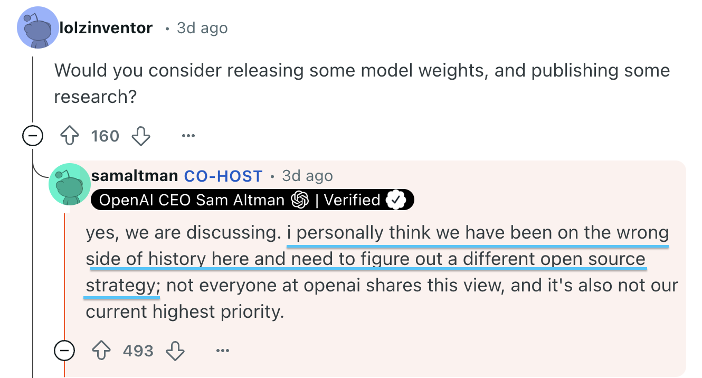
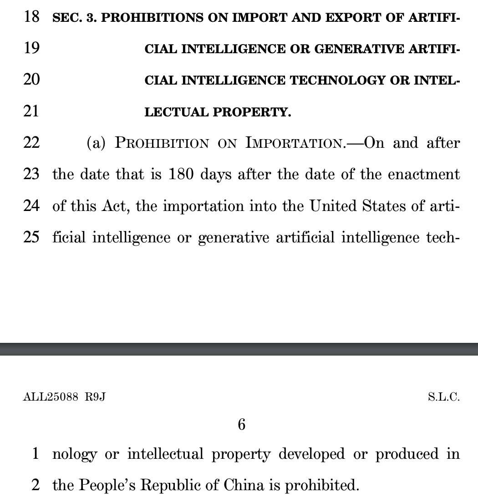

*As many of you know, this weekend I [appeared on the Lex Fridman Podcast](https://www.youtube.com/watch?v=_1f-o0nqpEI) with my friend Dylan Patel of SemiAnalysis to cover DeepSeek and the implications on the AI ecosystem. I recommend you check it out.*

*This post was tricky to pull together. I decided to share it anyways given the timeliness of the topic and other more exciting things I have to get to. The minor, thematic contradictions on motivations, costs, and trajectories are exactly indicative of why analysis and productionization of open-source AI is so hard. In that, it is a valuable lesson that building open-source AI will come with a lot of ups and downs, but now is the best time to do so.*

------------------------------------------------------------------------

The DeepSeek moment represents the end of the first chapter of AI\'s recent takeoff as told through the emergence of ChatGPT. It reminds us, that while substantial resources, coalitions, brands, and trends have been established, the narratives we have been championing are not set in stone. DeepSeek, especially with R1, resets all the narratives around open vs closed, US vs China, scaling and commoditization, etc. as we prep for yet another acceleration in the diffusion, progress, and adoption of AI.

Of all of these debates, the focus on open vs. closed AI models is the one least driven by economic factors and most driven by vibes. The open-source AI community is driven by a future vision where AI is not held by a few super-rich companies, a future where more people get to partake in the building of AI, a future where AI is safer, etc. These are ideals and building the tools and systems that make this vision a reality is a monumental challenge. Building strong AI models is far, far easier than building a sustainable open-source ecosystem around AI.

Building a better, truly open ecosystem for AI has been my life's work in the last years and I obviously want it to flourish further, but the closer you are to the core of the current open-source ecosystem, the more you know that is not a given with costs of doing relevant AI training skyrocketing (look, I know DeepSeek had a very low compute cost, but these organizations don't just fall out of the tree) and many regulatory bodies moving fast to get ahead of AI in a way that could unintentionally hamper the open. Yes, efficiency is getting better and costs will come down, as shown with [DeepSeek V3](https://www.interconnects.ai/p/deepseek-v3-and-the-actual-cost-of), but training truly open models at the frontier isn't much easier.

## Building the future ecosystem of open

As a perfect case point, consider Meta. Meta, as a platform serving content to billions of users, is [extremely well-positioned to use AI](https://stratechery.com/2024/metas-ai-abundance/) to make its services more engaging and more profitable for advertisers. The Llama project is not needed for that vision. Yes, it will be easier for them to integrate and optimize an AI that they train, but in a world where AI models are commoditized, what's the point? The most compelling reasons for openly releasing the Llama models are not business reasons but rather ideological reasons. Mark Zuckerberg revisited this on the recent Meta earnings call:

> I also just think in light of some of the recent news, the new competitor DeepSeek from China, I think it's one of the things that we're talking about is there's going to be an open source standard globally. And I think for our kind of national advantage, it's important that it's an American standard. So we take that seriously and we want to build the AI system that people around the world are using and I think that if anything, some of the recent news has only strengthened our conviction that this is the right thing for us to be focused on.

The pro-America messaging from Zuckerberg long predates the new administration (especially given that all of Meta's major apps are banned in China), even if the language is amplified now. This is purely an argument of "we are doing this because we should."

This argument is extremely similar to that used by DeepSeek AI's CEO Liang Wenfeng. In an interview [translated by ChinaTalk](https://open.substack.com/pub/chinatalk/p/deepseek-ceo-interview-with-chinas?r=68gy5&utm_medium=ios), Wenfeng described the need for Chinese leadership in open-source AI (in addition to a clear commitment to keep releasing models openly).

> Liang Wenfeng: Because we believe the most important thing now is to participate in the global innovation wave. For many years, Chinese companies are used to others doing technological innovation, while we focused on application monetization --- but this isn't inevitable. In this wave, our starting point is not to take advantage of the opportunity to make a quick profit, but rather to reach the technical frontier and drive the development of the entire ecosystem.\
> ...\
> We believe that as the economy develops, China should gradually become a contributor instead of freeriding. In the past 30+ years of the IT wave, we basically didn't participate in real technological innovation. We're used to Moore's Law falling out of the sky, lying at home waiting 18 months for better hardware and software to emerge. That's how the Scaling Law is being treated.\
> But in fact, this is something that has been created through the tireless efforts of generations of Western-led tech communities. It's just because we weren't previously involved in this process that we've ignored its existence.

The interview has many other comments making it clear that the way this will be done is by training powerful AI and releasing it for the world to use.

Both of these arguments, from Zuckerberg and Wenfeng, rely on the optimism that we, as a community of users of open AI models, will figure out how to create a valuable ecosystem around them. Right now, the vast majority of AI usage for applications comes through various API calls. Yes, some of this includes the usage of open-weight models like Llama and DeepSeek R1, but it does not give clear positive attribution to the fact that the model was open as a reason said the model was used.

The nationalistic comments regarding open-source AI are only likely to grow stronger as governments more deeply integrate with their leading AI companies.

One of the main arguments why American AI leaders believe that the AI ecosystem should be built on a Western foundation is the risk of China "poisoning the well" of our future computational infrastructure. To be very clear --- there is absolutely no evidence of this to date, but it is a simple proposition that the Chinese Communist Party (CCP) could build ties to the leading Chinese AI laboratories and require them to train for specific behaviors or [train in some sort of back door](https://www.anthropic.com/research/sleeper-agents-training-deceptive-llms-that-persist-through-safety-training) through model weights into American infrastructure.

America has been reeling with the potential of this sort of influence on TikTok. If AGI is to be a real thing that can be steered to ideological outcomes, a bill titled *[Protecting Americans from Foreign Adversary Controlled Applications Act](https://www.congress.gov/bill/118th-congress/house-bill/7521/text)* (the bill banning TikTok and forcing a divestiture) will operate at entirely the wrong level of abstraction. American companies [raced](https://www.reddit.com/r/perplexity_ai/comments/1ideq34/deepseek_r1_now_at_500_queries_daily_on_pro/) [to](https://www.msn.com/en-us/news/technology/microsoft-adds-deepseek-s-r1-ai-model-to-azure-cloud-platform/ar-AA1yiPlN) [host](https://www.together.ai/blog/deploy-deepseek-r1-and-distilled-models-securely-on-together-ai) R1 in a competitive frenzy. This is how open-source works and it will be far easier to incentivize better open models from Western labs than it will be to ban companies from adopting Chinese technology.

As of the release of DeepSeek R1, Chinese AI companies didn't have clear links to the government, but after said release, [DeepSeek's CEO met with the Chinese Premier Li Qiang](https://www.reuters.com/video/watch/idRW673728012025RP1/) (approximately second in command) to discuss their work.

AI is obviously far more in the radar of American leadership as a priority and has been for some time. This is a major advantage that the U.S. has in terms of a fast reaction to changing needs for open models.

In a [recent Reddit AMA](https://www.reddit.com/r/OpenAI/comments/1ieonxv/comment/ma9f5me/) soon after his appearance on stage with Trump for the announcement of the [Stargate project](https://semianalysis.com/2025/01/23/openai-stargate-joint-venture-demystified/), CEO of OpenAI Sam Altman even acknowledged that their strategy "may be on the wrong side of history" here with respect to openly sharing AI components. OpenAI should get no credit until their actions change, but DeepSeek and a new government administration have made many forces re-evaluate their relationship to the open ecosystem.

The current imperative of open-source AI is to create feedback loops where open models become more useful than their closed counterparts. Given that AI is very expensive and slow to train, this cannot look like the accumulation of small security and reliability improvements like done with open-source software. There's a chance that there is an algorithmic innovation that makes this possible, but for now, the solutions need to be more imaginative. Two examples I am currently interested in include:

-   Feedback loops from data to model behavior. If exposing the data to users, either from pre-training or post-training, makes it easier to control a model, then open models can win.

-   Finetuning advancements. Currently, finetuning any model to target a specific task is extremely hard. This is with both open-source code and fine-tuning APIs. If open-source code can be made to enable feedback loops of cheap synthetic data with verifiers to make very targeted models, open models can win.

This is just two examples. We need more than these if we want open-source AI to continue once the bubble of AI advancement cracks. We don't know when this comes, but if investment is driven by ideological reasons rather than monetary ones, public companies only have so much leeway to continue indefinitely.

These days I classify myself as an advocate for *more* openness for AI (which never means absolute openness), but I'm not going to describe myself as also being an optimist for it "winning." As scaling continues to push the limits of multiple training regimes and recipes become more expensive, open models drift from the frontier. This DeepSeek moment happened once in the 2+ years since the release of ChatGPT. We need to change incentives if we want it to happen regularly.

Why DeepSeek R1 is so close to the frontier is that, on top of being extremely skilled, they have a way faster release process than the likes of OpenAI and Anthropic who do extensive safety testing and even pre-screen releases by federal governments[1](#footnote-1){#footnote-anchor-1 .footnote-anchor component-name="FootnoteAnchorToDOM" target="_self"}. Meanwhile, DeepSeek seems to finish the model, take a week to write the paper, and immediately distribute it to the entire world. Iteration speed has always been an advantage of open-source and they happen to be aligned here.

## Restricting the distribution of open models is a losing proposition

If we geolock websites like HuggingFace to only work within the United States, we lose.

If we geolock model weights with threats of jail time [as proposed in this recent bill](https://www.hawley.senate.gov/wp-content/uploads/2025/01/Hawley-Decoupling-Americas-Artificial-Intelligence-Capabilities-from-China-Act.pdf), we lose (not views of my employer etc. etc.).

If we add substantial penalties to companies who release models that end up being used in China, we lose.

DeepSeek R1 is the closest to the frontier that a language model has been with a *permissive* license. Models like Llama 405B have been open weights and at the frontier of performance before but weren't picked up because they were very hard to use.

The only reason we should limit the ability of people to release model weights openly is if we see measurable negative impacts of doing so onto society. This means immediate harms to information ecosystems or other infrastructure.

In the time being, if we (as Western countries) decide to stop training and releasing open models another power will happily do this. This is not just China --- there are countless countries with the wealth to create the current generations of frontier language models. While it is understandably a stressful proposition, it has been said for at least a year that "[Whether or not we want it, open language models are likely here to stay](https://www.youtube.com/watch?v=B7m787UXz2M&t=987s)."

We are battling over who creates the most popular open language models, which could have a substantial influence on societies given the socially rich context that we use language models in today[2](#footnote-2){#footnote-anchor-2 .footnote-anchor component-name="FootnoteAnchorToDOM" target="_self"}, not if they will exist at all.

Open-source processes succeed with a multiplicity of options for users. This is what gives users options to fiddle and improve the ecosystem as a whole, learning from each other, and improving together.

Open-source AI is something that people will not benefit from uniformly. Export controls are not about preventing *access* to AI, but rather about preventing *proliferation* (and use) of AI. We have already seen this potentially kick in with the DeepSeek R1 launch, where DeepSeek had to pause account signups and there were widespread issues with their API.

The amount of compute used to train models is increasing today, and rapidly, but as AI becomes more powerful the rate of AI *usage* will increase even further. Most of the datacenters under construction in the United States are for inference of AI technologies. Right now, most of these are going to existing things like Google services or Meta serving ads, but more of these are becoming language model workflows.

The clusters you hear about with hundreds of thousands of GPUs are those for *training* and are indicative of a lab's ability to train models at the frontier (reminder, training needs the fast interconnects between as many GPUs as possible). Training infrastructure can be thought of separately from the reality of how AI transforms society and becomes extremely impactful --- by being used.

Because cluster buildouts have such a long lead time, it is very likely that we get super powerful AI models where demand vastly outstrips the supply of usage. The narratives that AI CEOs parrot about "AGI in a few years" are exactly this. An AI working in the background, solving tasks autonomously, especially if on top of these reasoning models that are driving inference costs up with long-context generation (which is far more expensive than long-context inputs due to quadratic compute increase during sampling), will be very expensive to run. For example, [OpenAI's o3 pro](https://www.interconnects.ai/p/openais-o3-the-2024-finale-of-ai) costs dollars per query on the now famous [ARC-AGI](https://arcprize.org/arc) task.

All of this is to say that restricting open-weight models has a much smaller impact on the diffusion of AI technology than most commentators thought in the last few years. Most thought that training cutting-edge AI models was so expensive and sophisticated that only American companies could do this. It turns out that the cost of training can fall faster than the demand for inference. Yes, releasing open-weight models *contributes* to the former reduction in cost (and definitely doesn't drive it), but if concerns around openly releasing AI models are driven by IP controls, it is an empty argument.

Attempts to restrict a adversaries ability to impact the world on AI should focus nearly entirely on compute rather than model weights. There is of course a chance that models continue to progress and eventually are so simple that only the weights are needed to deploy a destabilizing application. For now, and in the near future, powerful AI systems require substantial inference compute and even more custom software infrastructure.

For example, [Deep Research](https://openai.com/index/introducing-deep-research/) announced by OpenAI is [restricted to 100 queries per month](https://x.com/sama/status/1886220051092512979) for only users on the \$200/month pro plan. Where a query to standard ChatGPT costs on the order of \$.01, this new system costs on the order of \~\$1 (estimated based on monthly cost and OpenAI "[losing money on pro subscribers](https://fortune.com/2025/01/07/sam-altman-openai-chatgpt-pro-subscription-losing-money-tech/)"). We should expect this cost to increase by 100X again in the near future.

Inference for a task that costs \$1 in compute and takes \~10 minutes to complete implies that OpenAI would be using the equivalent of about 6 GPUs for that one user for those ten minutes (amortizing \$2/hour/H100 GPU). This is a lot --- each GPU is worth \~\$40K! In reality, it is likely that multiple users are sharing even more GPUs to hit critical batch sizes, but that's an aside for another time. Using very powerful AI is very expensive. It is making the argument even clearer that open weight models are not a major risk to be the target of soon-to-be export controls.

We need to keep releasing models openly so that our allies can build on them and create a thriving ecosystem.

## What's actually new in open-source?

From the 10,000 foot view, China released an AI model and countless Western companies immediately adopted it so that the AI ecosystem can build on it. This is the system working as intended.

A new "open-source" tool in the pipeline showed up and caused prices to be slashed. This is the system working as intended.

When focusing solely on the angle of open vs. closed models, DeepSeek R1's release is new solely as a high watermark for the existence of models closest to the frontier of progress with a permissive license.

Developers themselves still aren't really using open models because they have clear benefits in adaptability, privacy, etc. This is the hole in the system. While DeepSeek R1 is open weight, the vast majority of the usage is in applications like Perplexity AI or other hosted APIs.

The grand problems facing open-source haven't changed much, but we have the best tools we ever had in order to make dents in them. It's time to reinvest and refocus on the positive futures such progress could provide.

Western governments should make sure their programs for funding the development of AI extend beyond just the largest companies trying to solidify their moats through capital expenditures.[3](#footnote-3){#footnote-anchor-3 .footnote-anchor component-name="FootnoteAnchorToDOM" target="_self"} It is the time to invest in open research and public-sector coalitions who are building the Western alternatives to DeepSeek. Research is the foundation of the next decades in progress. Building openly is the only path forward if there is concern over our future ability to leverage open models from China.

------------------------------------------------------------------------

*For further reading on this topic, see Thom Wolf's [post](https://x.com/Thom_Wolf/status/1885093269022834943) which is very related and complimentary to mine, or this [rebuttal](https://www.geopolitechs.org/p/the-global-diffusion-of-ai-is-now) to Dario's [post](https://darioamodei.com/on-deepseek-and-export-controls) on export controls. For more on open-source AI, see my [previous writing](https://www.interconnects.ai/t/open-source) on the area.*

:::: {.footnote component-name="FootnoteToDOM"}
[1](#footnote-anchor-1){#footnote-1 .footnote-number contenteditable="false" target="_self"}

::: footnote-content
For more, see [Dario's post on export controls](https://darioamodei.com/on-deepseek-and-export-controls).
:::
::::

:::: {.footnote component-name="FootnoteToDOM"}
[2](#footnote-anchor-2){#footnote-2 .footnote-number contenteditable="false" target="_self"}

::: footnote-content
More context 32 minutes into [this interview](https://www.interconnects.ai/p/tim-dettmers?utm_source=publication-search). I've mentioned this in other blog posts that I couldn't find the right passages in.
:::
::::

:::: {.footnote component-name="FootnoteToDOM"}
[3](#footnote-anchor-3){#footnote-3 .footnote-number contenteditable="false" target="_self"}

::: footnote-content
Yes, Meta is commoditizing the complements of those companies. Make sure we don't get in their way.
:::
::::
