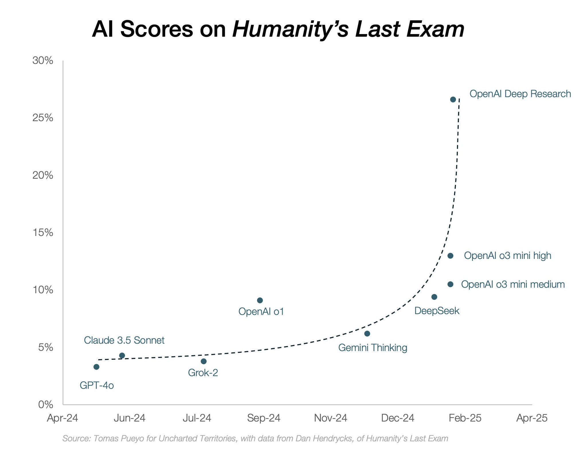

*We at Ai2 released a local LM [iPhone app](https://apps.apple.com/app/id6738533815) for our OLMoE model (1B active, 7B total params), with [greatly improved scores](https://huggingface.co/allenai/OLMoE-1B-7B-0125-Instruct)! Let us know what you think, or [read more here](https://allenai.org/blog/olmoe-app).*

------------------------------------------------------------------------

[OpenAI's Deep Research](https://openai.com/index/introducing-deep-research/) has largely been accepted as a super valuable tool for knowledge workers and analysts across the economy, but its real engine of economic progress is going to be changing the nature of scientific progress. Science is the fuel of technological revolutions.

Deep Research in its current form feels like a beta version of a next-generation piece of technology. It does what it is tasked with --- searches the web and processes many resources to create a useful report with referenced sources. Some of my uses include [researching model evaluations](https://chatgpt.com/share/67a3a81d-31f4-8005-9cb0-6e985f6a617a), [recent robotic learning research](https://chatgpt.com/share/67a4df43-bb14-8005-8aa1-75b3b91370b6), and [AI for science breakthroughs](https://chatgpt.com/share/67a8e265-b7fc-8005-93f3-83fbfb392771).

Deep Research's limitations mostly feel like problems of search, where it is prone to returning SEO optimized slop, style, where it returns verbose, low information density writing, and modality, where it does not have the ability to read, process, and return plots and diagrams. All of these are surely solvable and expected features if we look at the rollouts of other AI models in the last few years.

This isn't a product review (you can read [Stratechery](https://stratechery.com/2025/deep-research-and-knowledge-value/) or [Turing Post](https://www.turingpost.com/p/fod87?_bhlid=b5475ffe865a70cea5fc76bc1589c7fbada04657&last_resource_guid=Post%3Aed81b6c7-668b-4de2-bf4f-7a904887b8f8&utm_campaign=87-why-deepresearch-should-be-your-new-hire&utm_medium=newsletter&utm_source=www.turingpost.com) for more of that) --- as the answer is quite simple, if you work in a knowledge intensive vocation you should be using this --- but rather asking: So what comes next?

The place to start from within AI circles is to revisit the question of "When will AI make novel discoveries?" A good example of this is in the episode [with Dario Amodei](https://www.dwarkeshpatel.com/p/dario-amodei):

> One question I had for you while we were talking about the intelligence stuff was, as a scientist yourself, what do you make of the fact that these things have basically the entire corpus of human knowledge memorized and they haven\'t been able to make a single new connection that has led to a discovery?

An example experiment we could do to test this is to train models on time-gated information and see if it can repeat a scientific discovery we already made (yes, this would be difficult to run, but not impossible). Ross Taylor described this on [his Interconnects Interview](https://www.interconnects.ai/p/interviewing-ross-taylor-on-llm-reasoning):

> So an experiment I\'ve never done because I didn\'t have \[the\] compute would be this. Imagine if you could train a language model on all documents up to 1905, which is the year when Einstein had his miraculous year of four seminal papers. With that model, which is trained up to 1905, could you prompt the model to come up with a good explanation of the photoelectric effect, special relativity, this kind of stuff? And what would it take to rediscover these things?

The dream is for AI to make breakthroughs, and the absence of evidence for this even after the release of Deep Research is driving a reckoning over what language models will ever be able to do. The fork in the road is either believing that scaling (either in parameters or in new training methods) will unlock "insights" or accepting that the current generation of models are very useful *tools* and nothing more supernatural. Likely the most powerful tool humanity has made yet. Our first power tool for information.

Much of science is not about making novel insights but about making progress within established problems of the field. In AI, these are the countless benchmarks we are saturating. A very valuable contribution in AI as a field can be re-using known resources in a simpler way.

With AI, we are going to learn the boundary between true insight and scientific progress. A related form of scientific progress is the compression of noisy ideas and experiments into a cohesive trend. Something that Deep Research can likely do, but not something that builds the allure of Einstein and the other scientific greats.

To understand this relationship between Deep Research, AI broadly, and the nature of science, we must address:

-   How to interpret existing "AI for Science" projects like AlphaFold in the bigger context of science,

-   How reasoning models, AI research systems like Deep Research, and other forthcoming AIs revolutionize existing scientific practices,

-   How recent developments in AI challenge Kuhn's formulation of scientific revolutions, and

-   How current institutions will need to change forever in the face of AI?

This (hopefully) series of posts is my attempt to create a worldview around what science means in the face of AI. Today, we focus on the first two --- major AI for science projects and how normal science is being accelerated by AI --- and hopefully raise urgency within the community to consider the final question.

## The starting point --- grand AI for science projects

There is a substantial overhang in computational infrastructure and fundamental deep learning capabilities relative to their impact on the broad class of sciences. In order to make a substantial leap in the application of AI to a specific domain, a team must mold the existing underlying capability of AI to the needs of trained groups of scientists.

The list of examples people think of in this mold ranges across domains: [AlphaFold](https://www.nature.com/articles/s41586-021-03819-2) for protein folding, [AlphaGeometry](https://deepmind.google/discover/blog/alphageometry-an-olympiad-level-ai-system-for-geometry/) for mathematics, [GraphCast](https://deepmind.google/discover/blog/graphcast-ai-model-for-faster-and-more-accurate-global-weather-forecasting/) and [GenCast](https://deepmind.google/discover/blog/gencast-predicts-weather-and-the-risks-of-extreme-conditions-with-sota-accuracy/) for weather, and more that lack such prominent branding. They leverage advancements in deep learning and transformer architectures, but tend to have X-factors specific to the domain of interest (see [a Deep Research query summarizing this](https://chatgpt.com/share/67a8e265-b7fc-8005-93f3-83fbfb392771)). Such added features are *pulling forward* AI capabilities to suit a narrow domain.

There's a substantial craft to selecting suitable problems for applying this grand AI for science approach. It requires a field with central elements that are quantitatively focused. Even with this, outcomes are more uncertain than standard AI research or standard research in the domain of choice.

The essay *[A new golden age of discovery](https://www.aipolicyperspectives.com/p/a-new-golden-age-of-discovery)* from details how DeepMind sees the opportunity here and showcases some internal ingredients they found that make these projects more likely to be successful.

The fact that any of these projects have succeeded shows the overall potential of AI for science. The overall *necessity* of the approach depends on whether the grand AI for science breakthroughs are pulling forward progress by months or years, or if these models are the single required breakthrough to approach entirely new areas of study.

As the broader scientific community embraces AI as "something that works" more of these step changes will happen. They take a very large density of compute and talent on a single problem.

These projects fit more naturally into a classical view of science. They take substantial resources and are high risk. Meanwhile, the mass market AI tools that everyone is adopting will dramatically shift the *practice* of doing science.

## Towards instantaneous Ph.D.'s

We have two tools that dramatically shift the nature of scientific exploration. They will only get better.

1.  AI models that excel at code, mathematics, and reasoning: OpenAI's o3, DeepSeek R1, Gemini Deep Thinking, etc.

2.  AI systems to rapidly parse and summarize existing literature: OpenAI's Deep Research, Gemini Deep Research, [Ai2's Scholar QA](https://allenai.org/blog/ai2-scholarqa) (specific to academic papers), and many more that will come soon.

These tools are dramatically accelerating the most time-consuming aspects of research, particularly in computationally intensive fields. In a few years, the only gating factor on the impact of a scientist will reduce to their access to cutting edge tools, understanding the gaps in AI, and **asking the right questions**. The final point is well established as a trait of the most successful scientists, is what goes hand in hand with the idea of "insight," and where the differentiation among scientists will only increase.

### Computational super-scientists

All scientific fields that rely heavily on computational infrastructure as a bottleneck for progress are going to experience a dramatic acceleration in the near future. In AI and closely related computer science fields this is evident from the abundance of soon-to-be superhuman coding assistants and an exponential (short-term) increase in compute available.

Most AI research is severely bottlenecked by the compute available, the time to implement the intervention, and the implicit efficiency of the idea-implementation interface. Future siblings of OpenAI's o1 models are going to be used extensively to streamline this. This worldview barely accounts for the ability of these reasoning models to decide on which problem to solve and to interpret the results. These sorts of research assistants running in the cluster are a central component of the vision of Anthropic CEO Dario Amodei's view in *Machines of Loving Grace*, and it is one that requires far less optimism in magical breakthroughs than the grand AI for science projects.

Reasoning language models (RLMs) have in their first year of existence shown major progress on all of the evaluations the AI field put forward as fundamental challenges for the field. [Accumulating iterations of this](https://www.interconnects.ai/p/why-reasoning-models-will-generalize) *[should](https://www.interconnects.ai/p/why-reasoning-models-will-generalize)* [transfer](https://www.interconnects.ai/p/why-reasoning-models-will-generalize) to scientific decision-making, but we don't exactly know how.

The fundamental unit of progress in science, which can be viewed as one Ph.D.'s worth of progress (same goes for one paper), is reducing so quickly to redefine many methods of experimentation and deciding on what is or is not possible. Multiple efforts are already documenting how RLMs can be used to find errors in existing literature (see reading list at end of post) --- a process that will likely be automated in the next few years. Rather than science proceeding with a high velocity, it feels as if science is proceeding with a high acceleration.

The pace of progress necessitates a reinvention of most of our scientific institutions. What happens when the time it takes to create a Ph.D.'s worth of knowledge is substantially smaller than the amount of time it takes to get peer review feedback from the fields' journals?

## Changing the structure of scientific revolutions

Most of the ideas behind this piece originated over the holidays when I was trying to understand how science, as a practice and institution, would be changed by AI. The announcement of OpenAI's Deep Research only solidified the view that the current wave of AI tools are not one that will ever fundamentally be insight-driven. They are extremely powerful and efficient computing engines, not insight engines.

A pseudonymous account on Twitter, [Michael](https://x.com/mmay3r/status/1888314691820327196), summarized the debate we started with, on if LMs can make insights, perfectly:

> To an LLM, a novel discovery is indistinguishable from an error.

This is a limitation that letting language models act in a wet lab does not solve. Insight is far separate from information, but both are accepted as being crucial to scientific progress. Information is the engine for insight.

Still, Deep Research and the AI models we have access to are a substantial accelerant of science. Modern scientists have always had to wear many hats, advising, reading, implementing, thinking, communicating, etc. The list getting shorter, so long as these new technologies are broadly available, is a wonderful boon for normalizing access to scientific careers. This *should* be a wonderful bloom of scientific progress (at least, *[production](https://x.com/random_walker/status/1888919433671843947)* [of results](https://x.com/random_walker/status/1888919433671843947)), but we need to do substantial work to prepare our already strained institutions.

For my readers in academic or science driven circles, the comment section of this post is open to free subscribers, please share the biggest opportunities and pinch-points in the current scientific ecosystem as we embrace these AI tools. We need to be more ambitious and level-headed than complaints about AI written peer reviews. In the long-term AI peer review will be needed to review all of the progress. We need incentives for managing it, resources to share across a broad community, and much, much more.

------------------------------------------------------------------------

## Further Reading

Thomas Kuhn's *The Structure of Scientific Revolutions* is taken as one of the most influential non-fiction books of all time by describing the behavior of and defining terminology for how modern science evolves. The core idea is that scientists form **paradigms** around certain theories and ideas and use them to uncover new knowledge until questions or limitations require the emergence of another. Kuhn makes it clear with many historical references that science is done by a community and slowly builds out the frontier of knowledge --- rather than filling in a known space of potential knowledge. The necessity of this can be summarized as:

> To reject one paradigm without simultaneously substituting another is to reject science itself.

This pattern can be seen again and again building on the likes of Galileo and others in the 17th century. A core fact of this is that **scientific knowledge is a process** and not one that sets specific ideas in stone:

> If these out-of-date beliefs are to be called myths, then myths can be produced by the same sorts of methods and held for the same sorts of reasons that now lead to scientific knowledge. If, on the other hand, they are to be called science, then science has included bodies of belief quite incompatible with the ones we hold today. Given these alternatives, the historian must choose the latter. Out-of-date theories are not in principle unscientific because they have been discarded. That choice, however, makes it difficult to see scientific development as a process of accretion. The same historical research that displays the difficulties in isolating individual inventions and discoveries gives ground for profound doubts about the cumulative process through which these individual contributions to science were thought to have been compounded.

The biggest challenge to Kuhn's theories of change is the emergence of AI. We must grapple with questions akin to "How will the dynamics of science change with powerful AI systems?"

The open question is if these accelerations unsettled the Kuhnian nature of science by making progress happen faster than paradigms themselves can be established.

In addition to the posts referenced throughout, I built my knowledge on top of many recent pieces on this area that you may find interesting:

-   [Dario Amodei on Lex Fridman podcast](https://youtu.be/ugvHCXCOmm4).

-   [Levers for biological progress](https://open.substack.com/pub/cell/p/levers?r=68gy5&utm_medium=ios) on .

-   [X thread on theories of change in sciences](https://x.com/AdamMarblestone/status/1845158919523664019).

-   The white-paper *[Artificial Intelligence, Scientific Discovery, and Product Innovation](https://aidantr.github.io/files/AI_innovation.pdf).*

-   The [Podcast with Adam Brown](https://www.dwarkeshpatel.com/p/adam-brown).

-   piece *[A new golden age of discovery](https://www.aipolicyperspectives.com/p/a-new-golden-age-of-discovery)*.

-   [checking recent NeurIPS ML for bio paper results](https://www.owlposting.com/p/can-o1-preview-find-major-mistakes) (based on an [idea from Ethan Mollick](https://x.com/emollick/status/1868329599438037491)). has a [series](https://open.substack.com/pub/amistrongeryet/p/the-black-spatula-project?r=68gy5&utm_medium=ios) on this topic too.

-   *[Scientific Models in Philosophy of Science](https://upittpress.org/books/9780822962731/).*

-   Kuhn's *The Structure of Scientific Revolutions.*

-   on [why great scientists follow beauty](https://open.substack.com/pub/erikhoel/p/great-scientists-follow-intuition?r=68gy5&utm_medium=ios).

-   's review of Deep Research, *[Knowledge Navigator](https://www.hyperdimensional.co/p/knowledge-navigator)*.
