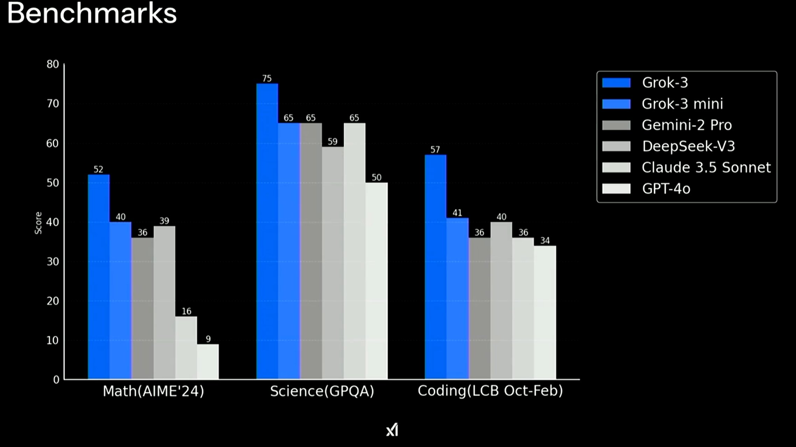
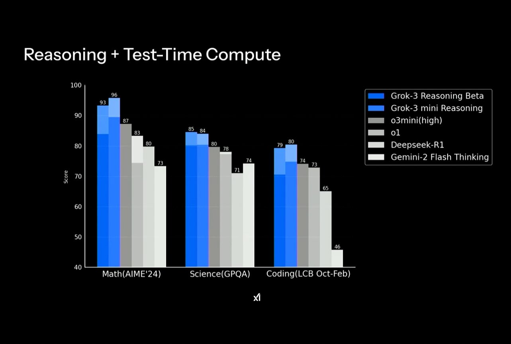
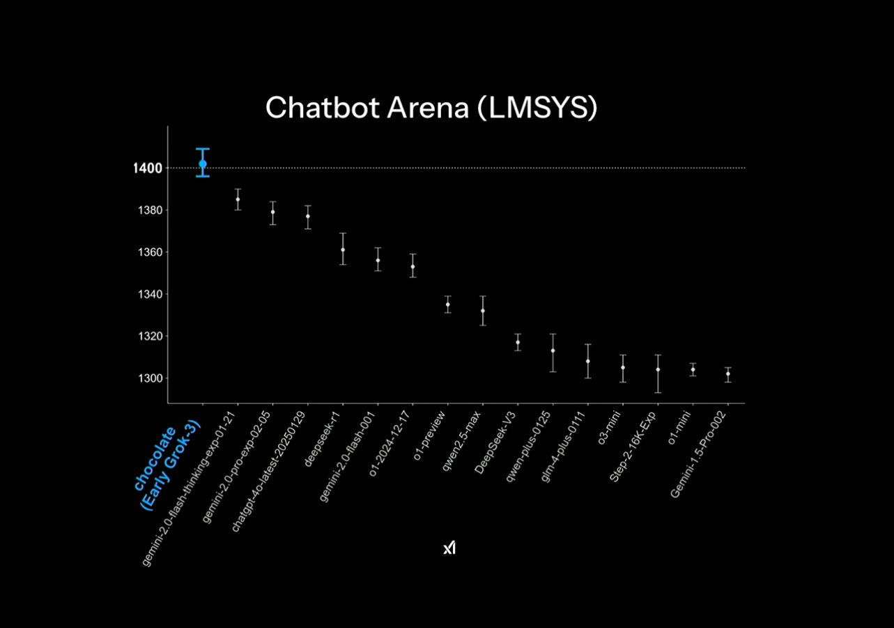

xAI launched their latest flagship model, Grok 3, last night via a [live stream on X](https://x.com/xai/status/1891699715298730482), which is a new take on the launch process, but it largely felt familiar. Grok 3 is a state-of-the-art model on some important benchmarks. The core is that it is state-of-the-art relative to *available* models and we know better models are out there. Only some of them have been *[announced](https://www.interconnects.ai/p/openais-o3-the-2024-finale-of-ai)*, some of them have been *[teased](https://x.com/OpenAI/status/1889774124362346902)*, and others lie in waiting.

What feels different is how the broader AI industry is signaling rapid progress coming soon. xAI said on the livestream that they will be updating the model "[daily](http://GROK%203%20IMPROVES%20DAILY—YOU’LL%20SEE%20CHANGES%20IN%2024%20HOURS)." An era of sitting on unreleased models could be ending.

Grok 3's release is a reinforcement of trends people began reckoning with as of the release of DeepSeek V3 + R1 --- AI progress is not held in the hands of a few companies nor is it slowing down. 2023 and 2024 were defined by truly state-of-the-art AI being concentrated within OpenAI, Anthropic, and Google, where these companies could take a lot of time to package models from training to release and still have a substantial moat on capabilities relative to their peers.

At the time of R1's launch, the "people's choice" model was Claude 3.5 Sonnet, a model that had been trained "[9-12 months ago](https://darioamodei.com/on-deepseek-and-export-controls)" and the best models like Claude 3.5 Opus or GPT-4.5 (a.k.a Orion) were not available to users for a grab bag of reasons.[1](#footnote-1){#footnote-anchor-1 .footnote-anchor component-name="FootnoteAnchorToDOM" target="_self"}

Competitive pressure from DeepSeek and Grok integrated into a shifting political environment for AI --- both domestic and international --- will make the established leading labs ship sooner. A large portion of delays in delivering models is for "safety testing," but we don't have exact details on how much of it was that and how much was cost-benefit tradeoffs (and other big company hurdles such as legal departments). The brand, and culture, of "having the smartest model" is extremely important to these companies, but having a way smarter model was often financially too much to bear.

"Safety" is [actively being removed from the spotlight of the AI discourse](https://www.gov.uk/government/news/tackling-ai-security-risks-to-unleash-growth-and-deliver-plan-for-change) --- this is most strongly exemplified by J.D. Vance's [speech at the AI Action Summit](https://www.youtube.com/watch?v=64E9O1Gv99o&pp=ygUZamQgdmFuY2UgZXVyb3BlIGFpIHNwZWVjaA%3D%3D) (worth watching, more discussion from Miles Brundage [here](https://milesbrundage.substack.com/p/emergency-blog-post-reflections-on)). It is possible that this overcorrection causes meaningful harm, as this is an extremely powerful and rapidly evolving technology, but the political capital to make safety a core tenet of the AI industry was spent too early relative to meaningful harm emerging.

Increased competition and decreased regulation make it likely that we, the users, will be given far more powerful AI on far faster timelines.

We've seen time and time again the value of having the best model *first*. The only way to onboard new users is to have some capability or behavior that your model differentiates on. With the pace of progress high, minimizing the time from training to release is the best way to maximize one's chance of impact.

DeepSeek and xAI show how organizations with slightly trailing technical progress or resources can outshine the likes of OpenAI and Anthropic who have voluntarily not shipped their latest models.

## Grok 3 by the numbers

Benchmarks and vibe tests mark Grok 3 as one of the best models available today. As with any release, companies often choose evaluations that flatter their models. Yes, winning on these evaluations is extremely challenging, and much credit must be given to xAI for delivering a leading-edge model just about 19 months after its incorporation.

That being said, what is shown below is a total of 4 language model evaluations. Given that models like DeepSeek R1 or Gemini Thinking launch with 10-20 evaluations detailing their performance relative to peers, this has to be taken with a grain of salt. It is very likely that Grok 3 doesn't outperform its peers in every category, but there is a slim chance these other comparison evals just weren't run in the optimization for expedience.

To start, we can compare Grok 3 benchmarks versus available instruct models.[2](#footnote-2){#footnote-anchor-2 .footnote-anchor component-name="FootnoteAnchorToDOM" target="_self"}

And versus available reasoning models (note how OpenAI's *[announced](https://x.com/12exyz/status/1891723056931827959)* [o3 scores exceed these clearly](https://x.com/12exyz/status/1891723056931827959)).

An important detail, as we've seen with OpenAI's reasoning model releases is, what do the shaded regions on the above plots show? Without exact details, we don't know the inference cost for each of the models on these reasoning plots. Pushing the frontier in absolute terms is important, but the field overall is getting messier before it'll get clearer.

Regardless, in the above two plots Grok 3 is pushing progress both on standard model training and the new reasoning training. While reasoning training and RL are the hot new things in the AI field, simple scaling and optimization of existing techniques still deliver value.

And Grok's [score on ChatBotArena](https://x.com/lmarena_ai/status/1891706264800936307).

A model launching at top of every category on ChatBotArena feels like something that should be rare (given it now encompasses many categories like Math, Coding, Style Control, Longer Queries, etc.), but it happened just a few weeks ago with Gemini 2.0 Pro!

[ChatBotArena](https://www.interconnects.ai/p/chatbotarena-the-future-of-llm-evaluation) is known to favor models that are likely to not refuse requests (we don't know by how much), as evidenced by Claude 3.5 Sonnet (New)'s relatively low position on the leaderboard relative to its utility, but overall is a hard evaluation to top. xAI's stated goals of a "based" model should correlate well here.

A question we don\'t know the answer to: **How many points of performance on evals do you gain by not caring about safety at all?** Internal to the model, i.e. in behavior latent spaces, safety is pretty orthogonal to common high-utility behaviors like reasoning and code, and bigger models tend to do more things without a cost to other behaviors, but there has to be a safety performance margin. Did Grok 3 succeed because of this? It's too early to tell.

At a technical level, Grok 3 is certainly a very big model. We don't have specifics, but it's reasonably safe to take a datapoint for **scaling still helps for performance** (but maybe not on costs). xAI's approach and messaging has been to get the biggest cluster online as soon as possible. The Occam's Razor explanation until we have more details is that scaling helped, but it is possible that most of Grok's performance comes from techniques other than naive scaling.

Grok 3's size to beat existing models feels like when [Nemotron 340B beat Llama 3 70B](https://arxiv.org/abs/2406.11704), making it the leading open-weight model at the time, but uptake was slow because the cost relative to the performance gains wasn't worth it to adopt. We'll know more about this when Grok 3 is available in their API and we see the exact costs.

When models are approximately equal in performance, price and ease of use are the determining factors of adoption.

Overall, Grok 3 is a huge technical achievement but not one that indicates a substantial change in who is at the frontier of effective training. xAI is obviously closing in on OpenAI, Anthropic, and most of all Google, but all available data points put these labs ahead of xAI on the frontier of efficient model training. It is good that they are being pressured to deliver more absolute intelligence and not to just continue optimizing their frontier of performance per dollar.

Read some other reviews of Grok 3 [here](https://x.com/karpathy/status/1891720635363254772) and [here](https://x.com/_xjdr/status/1891911178147987513). Karpathy's summary is particularly in line with my thinking (while potentially slightly overselling capabilities).

> As far as a quick vibe check over \~2 hours this morning, Grok 3 + Thinking feels somewhere around the state of the art territory of OpenAI\'s strongest models (o1-pro, \$200/month), and slightly better than DeepSeek-R1 and Gemini 2.0 Flash Thinking. **Which is quite incredible considering that the team started from scratch \~1 year ago, this timescale to state of the art territory is unprecedented.** Do also keep in mind the caveats - the models are stochastic and may give slightly different answers each time, and it is very early, so we\'ll have to wait for a lot more evaluations over a period of the next few days/weeks. The early LM arena results look quite encouraging indeed. For now, big congrats to the xAI team, they clearly have huge velocity and momentum and I am excited to add Grok 3 to my \"LLM council\" and hear what it thinks going forward.

## Where progress is heading

If these AI models, and the industry writ large, are accelerating, it is important to wonder where they are accelerating toward. Most of the evals we use now to launch leading models are not that representative, in many cases they're actually 100% out of distribution to normal life. What is the value in solving a competition math problem like AIME or so-called "[Google Proof](https://arxiv.org/abs/2311.12022)" questions? Time will tell, but the case for usefulness to average users is definitely stretched.

Small ChatBotArena improvements are marginal gains in robustness, where something like a 20-point difference in Elo rankings --- the relative difference between Grok 3 and the next top model --- translates to the model winning something like 51% of head-to-head match-ups. This robustness adds up over time, but it is far from meaning that this model is more intelligent in an absolute sense.

In fact, in the case of some of the latest evaluations from the research community, it seems like [evaluations are being designed more around being hard than being useful](https://x.com/distributionat/status/1891681726532911589). It is a natural response to models being super powerful to try and find *something* to challenge them with, but it makes tracking progress and communication far harder.

Companies have many internal evaluations that are not shared. Increasing transparency on these would help contextualize what is and is not meaningful progress. Without these, the only benchmark we have for model changes is them becoming more deeply integrated into products. Product-model synergy can enable extremely useful, new workflows, but it makes tracking the progress of AI a proxy measurement.

I do personally believe these somewhat arbitrary capabilities we are marching toward will generalize to extended and amplified value, but it takes some \"feeling the AGI\" to see that these models that are better on esoteric benchmarks generalize to every day use. So far they have. Bigger and generally "better" models have been more robust and easier to find valuable veins in, but we as an industry should be sharing more so that it is not just AI insiders who understand how to track progress.

When 2024 was reflected on with meager advancements, evidence is that there was substantial progress but less of it was delivered to users. We only got o1 late in the year and other models were deemed \"too big to ship\" or the requisite urgency (DeepSeek) did not exist.

2025 will be a year of intelligence being put in the user's hands. The pace of underlying progress with that will continue to be high. The so-called "walls" facing AI progress haven't materialized, but making sense of the progress we are getting is much more nuanced.

:::: {.footnote component-name="FootnoteToDOM"}
[1](#footnote-anchor-1){#footnote-1 .footnote-number contenteditable="false" target="_self"}

::: footnote-content
It is well established that OpenAI has an extensive [red-teaming program](https://openai.com/index/red-teaming-network/) that gets early access to new models and that is subject to very strong NDAs.
:::
::::

:::: {.footnote component-name="FootnoteToDOM"}
[2](#footnote-anchor-2){#footnote-2 .footnote-number contenteditable="false" target="_self"}

::: footnote-content
Note that Grok 3 is available, but to my knowledge it seems like Grok 3 mini is just announced and not released.
:::
::::
