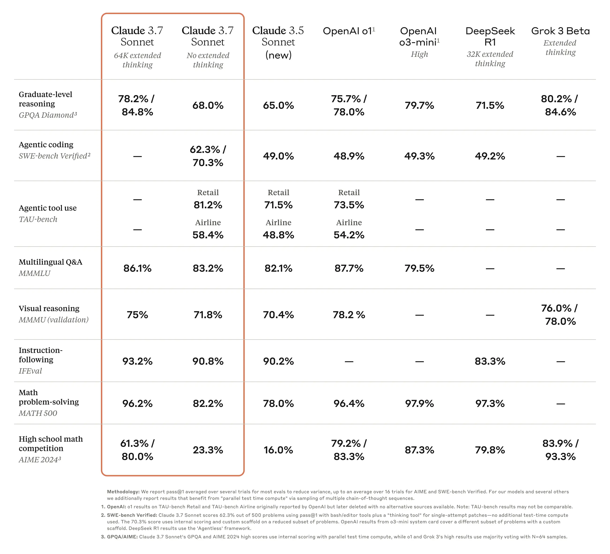
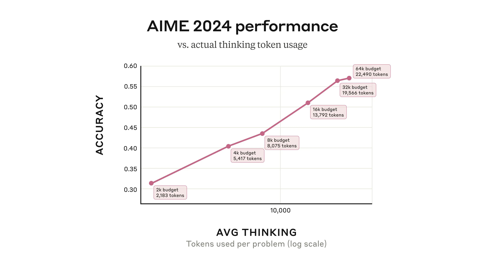
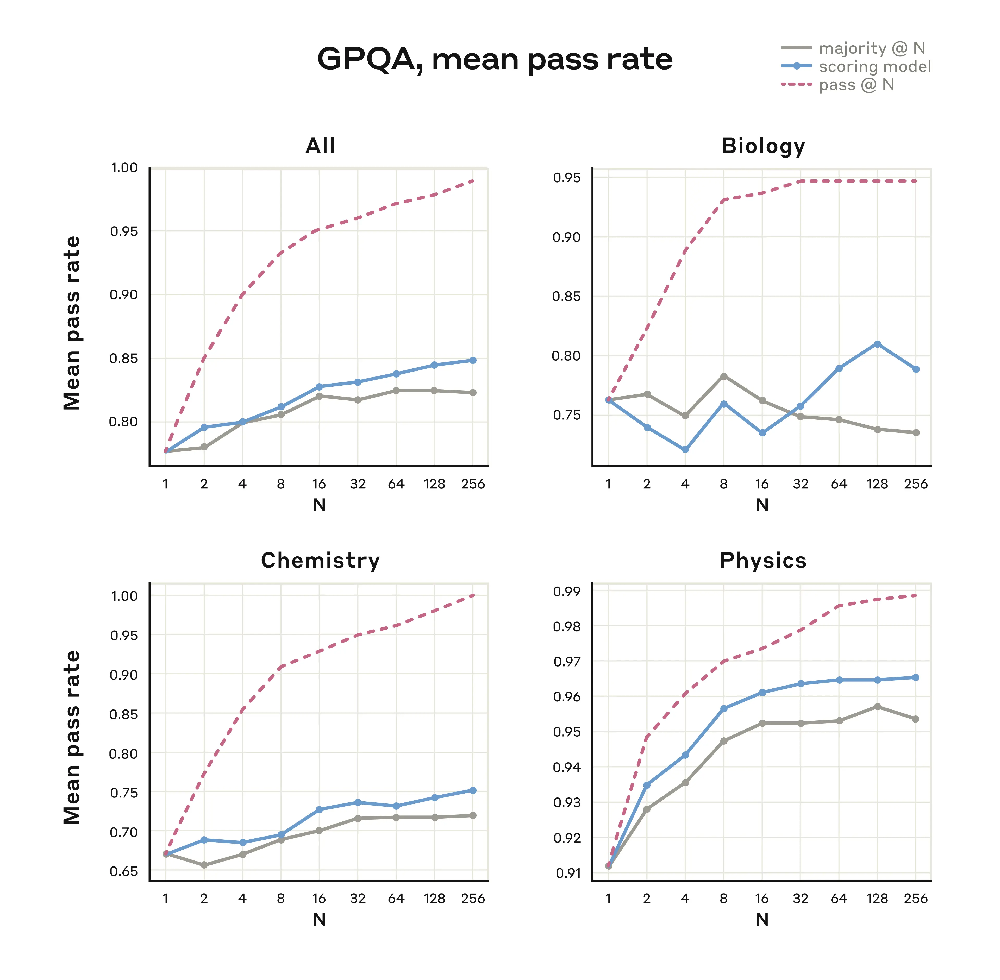

On Monday, February 24th, 2025, Anthropic [announced their latest model](https://www.anthropic.com/news/claude-3-7-sonnet), Claude 3.7 Sonnet, which is their first model explicitly trained to use more inference time tokens to improve performance. This is another reinforcement learning (RL) trained model (mentioned in [system card](https://assets.anthropic.com/m/785e231869ea8b3b/original/claude-3-7-sonnet-system-card.pdf)[1](#footnote-1){#footnote-anchor-1 .footnote-anchor component-name="FootnoteAnchorToDOM" target="_self"}). With this model, they also released Claude Code as a limited research preview, which is a "command line tool for agentic coding." Continuous improvements in models are enabling new modalities and domains addressable by the models, but assessing the impact of each new domain takes far more time than a quick model reaction post.

This is a tidy release, a solid improvement, but not a step change for Claude or the industry. Expect a lot of [small changes to accumulate massively this year](https://www.interconnects.ai/p/grok-3-and-an-accelerating-ai-roadmap).

Claude 3.7 Sonnet is a clear improvement over Claude 3.5 Sonnet (New) and continues to push the limits in areas where users love Claude (e.g. read Ethan Mollick's review [here](https://www.oneusefulthing.org/p/a-new-generation-of-ais-claude-37)). The scores for those areas such as software development (SWE Bench) and tool use, are clearly state-of-the-art.

For example, Claude 3.7 Sonnet is the [highest scoring](https://x.com/paulgauthier/status/1894123992505880688) "standard non-reasoning" language model on the [Aider Polyglot benchmark](https://aider.chat/docs/leaderboards/). While models like o3 and Grok 3 DeepThink highlight superhuman performance on code benchmarks, this sort of behavior being integrated without extra inference time compute is wonderful. The price for superhuman coding AI is plummeting.

Even with o1 Pro, I still find myself using Claude 3.5 (New) on a regular basis. O1 Pro is the best model for doing succinct, one-off tasks like writing short scripts. It is extremely controllable and will often work out of the box. Though, when I'm doing tricky, iterative tasks I still use Claude. Claude 3.7 Sonnet only makes these workflows stronger and I'm stoked to play with it further.

The most useful piece of this release for those trying to understand the *direction* of the ecosystem, rather than just the status of today, is Anthropic's post on *[Claude's extending thinking](https://www.anthropic.com/news/visible-extended-thinking)* where they detail the product trade-offs, alignment, and future of inference time compute in their models.

Anthropic's offering of extending thinking to boost inference-time performance is far, far cleaner than that of OpenAI's current model drop down disaster. Anthropic's thinking model is the same as their general purpose model, much like xAI's [Grok 3](https://www.interconnects.ai/p/grok-3-and-an-accelerating-ai-roadmap), and what [OpenAI teased will be the plan for GPT-5](https://x.com/sama/status/1889755723078443244'). Having just one model makes lots of infrastructure, product, and training decisions cleaner, but may come at the cost of the absolute Pareto front of performance for your organization shrinking.

The reasoning training being embedded in one model with a standard inference mode will make the reasoning benefits and behavior feel closer to something like Gemini-Thinking, rather than OpenAI's o1 or DeepSeek R1 that are designed solely for this reasoning mode of operation. It doesn't mean that in the limit that a single model will be weaker in performance, but rather that currently training them may be slower to iterate on than a "full" reasoning language model.

Focusing on deploying just one model that serves all the users is one of many examples where leading AI companies are needing to make their offerings legible to users and easy to use --- a sign of the industry maturing from a race to intelligence to a race to usefulness.

Still, Claude's interface is not perfect by any means, the user still has to intentionally go to a drop down menu to get performance when they need it. The best mode is that the model knows when inference compute is needed on its own. My *hypothesis* is that when training one model with reasoning and without, having the model figure out how much compute to use is harder than a reasoning-only model like o1 figuring out its own compute budget. Or, Anthropic needed to keep a special flag that is turned on and off in the system prompt. This is a subtle potential trade-off of putting reasoning in just one model, but we'll see where the final equilibrium is.

On the other hand, **Claude 3.7 Sonnet is showing the reasoning traces directly to users like DeepSeek R1 and Grok 3**. These organizations have different ways of saying why, but it is clear that users just enjoy seeing it and it builds trust. Anthropic, understandably is using the reasoning traces to monitor the alignment of the models.

The reasoning chains in these models are how the general public is learning more about the internal representations of language models. Another interesting detail is that "didn't perform our standard [character](https://www.anthropic.com/research/claude-character) training on the model's thought process." This is how Claude thinks out of the box and the actual answers have a different flavor to them. More research will study how far the reasoning chains can diverge from the answer language. We've seen research on [latent reasoning](https://arxiv.org/abs/2502.05171) within the model, but beyond this, we could have reasoning languages that are entirely ungrounded from human languages because they are a more token-efficient representation of information for the model. More on this soon.

The developer facing version of this Claude Extending Thinking is far cleaner and a sign of things to come --- developers can request a specific amount of thinking tokens in their response.

How this works is that the model will stream thinking tokens until the number is reached, then shift to answer tokens. This is still one autoregressive stream and no search is being used in the new products, yet.

This explicit control over the thinking and answering phases is a growing behavioral focus in training reasoning models --- expect more here soon. Developers can tune the setting that works for them and keep it baked in, rather than relying on the user to pass in a query that just happens to get the model to think for a long time. Explicit test-time inference budget increases are much more covetable than needing to hit the gold mine in a prompt search.

The best place to see where this *could* be applied is by selecting performance on a task that scales nicely with inference time compute. Anthropic ran a similar experiment on the challenging math evaluation AIME --- the same one that [OpenAI used in their original inference time compute plot](https://www.interconnects.ai/p/reverse-engineering-openai-o1).

Here there's a subtle difference from the developer experience, where in Anthropic's internal tests the model could exit early. In practice, this subtle difference shouldn't shift the usefulness of the deployment methodology.

Anthropic continues in their excellent post, saying:

> Our researchers have also been experimenting with improving the model's performance using *parallel* test-time compute. They do this by sampling multiple independent thought processes and selecting the best one without knowing the true answer ahead of time. One way to do this is with [majority](https://arxiv.org/abs/2206.14858) or consensus voting; selecting the answer that appears most commonly as the \'best\' one. Another is using another language model (like a second copy of Claude) asked to check its work or a learned scoring function and pick what it thinks is best. Strategies like this (along with similar work) have been reported in the evaluation [results](https://developers.googleblog.com/en/the-next-chapter-of-the-gemini-era-for-developers/) of [several](https://arxiv.org/abs/2502.06807) [other](https://arxiv.org/abs/2403.05530) [AI](https://x.ai/blog/grok-3) [models](https://openai.com/index/openai-o3-mini/)).

To accompany this, they shared the following results.

It is crucial to note here that the dashed red line --- pass@N --- is not an actual evaluation result, but measuring if the correct solution *appears* in the number of answers generated on the X-axis. The two lines below show how good initial answer extraction methods are at selecting the right answer from the N candidates. As has been known for a long-time in [inference-time scaling research](https://www.interconnects.ai/t/reasoning) is that the models can often generate the correct answer to extremely hard questions, but not reliably.

They make it very clear this is not used yet in their products:

> Parallel test-time compute scaling isn't available in our newly-deployed model, but we\'re continuing to research these methods for the future.

Still, this is a direction other labs are already pursuing. The best reporting on o1 Pro [indicates](https://semianalysis.com/2024/12/11/scaling-laws-o1-pro-architecture-reasoning-training-infrastructure-orion-and-claude-3-5-opus-failures/) that it does a "search" of some sort over parallel generations. Other OpenAI employees have stated that [o3 uses a learned verifier to extract answers](https://x.com/__nmca__/status/1889741584922751092), at least for coding domains. As progress in scaling single-streams from the language model slows, this is the natural next place for scaling to turn to. As it has been for some time, performance limits are largely different forms of infrastructure problems before models can be served to users.

Claude is here, and it reinforces that RL training is a short path to inference time scaling laws being used, but in the long-term we will have more methods for eliciting the inference-time tradeoffs we need for best performance.

------------------------------------------------------------------------

*Thanks to Ross Taylor for some immediate feedback on this post.*

:::: {.footnote component-name="FootnoteToDOM"}
[1](#footnote-anchor-1){#footnote-1 .footnote-number contenteditable="false" target="_self"}

::: footnote-content
Thx to a [Twitter anon](https://x.com/scaling01) for the correction.
:::
::::
