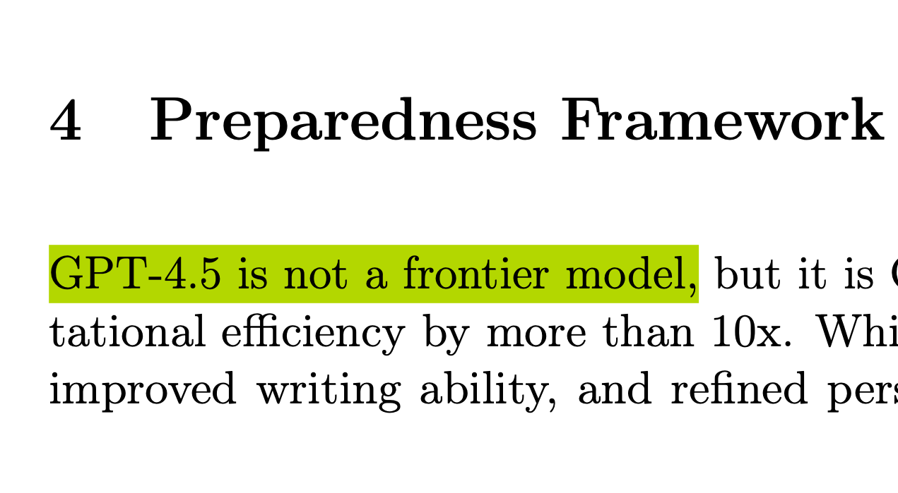
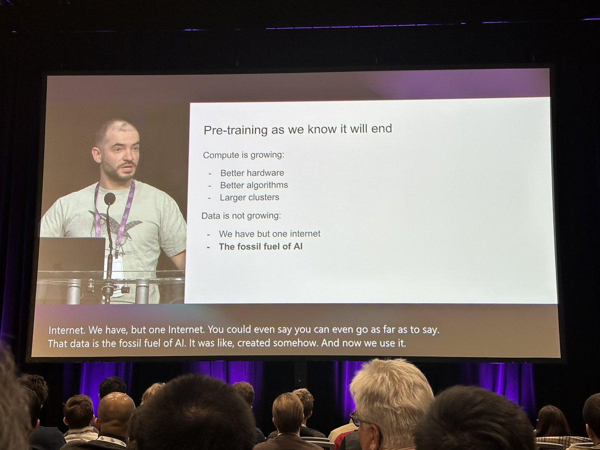
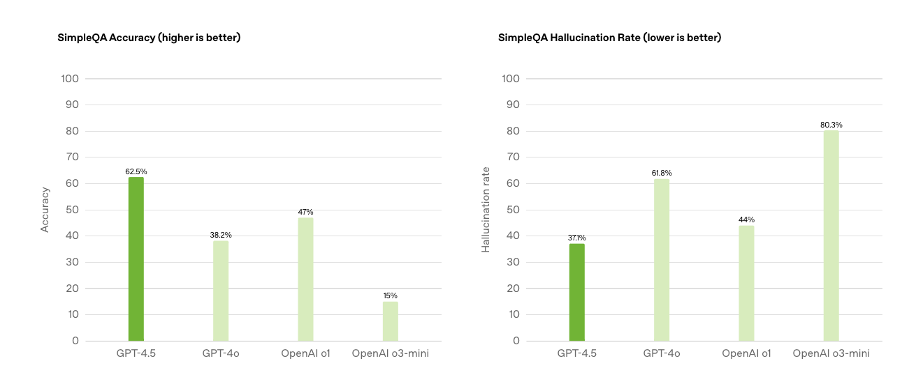
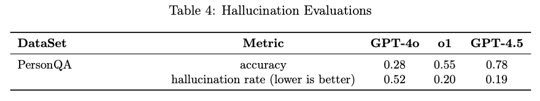
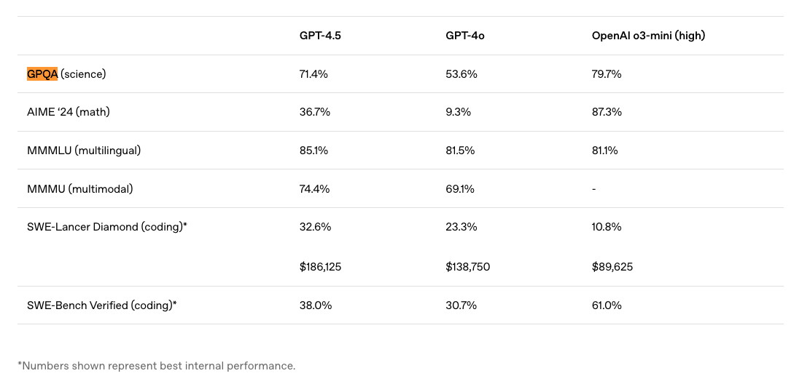

As GPT-4.5 was being released, the first material the public got access to was OpenAI's system card for the model that details some capability evaluations and mostly safety estimates. Before the [live stream](https://www.youtube.com/watch?v=cfRYp0nItZ8) and official blog post, we knew things were going to be weird because of this line:

> GPT-4.5 is not a frontier model.

The [updated system card](https://cdn.openai.com/gpt-4-5-system-card-2272025.pdf) in the [launch blog post](https://openai.com/index/introducing-gpt-4-5/) does not have this. Here's the original system card if you need a reference:

:::::::: {.file-embed-wrapper component-name="FileToDOM"}
::::::: file-embed-container-reader
:::::: file-embed-container-top
::::: file-embed-details
::: file-embed-details-h1
Gpt 4 5 System Card Original
:::

::: file-embed-details-h2
3.9MB ∙ PDF file
:::
:::::
::::::
:::::::
::::::::

Regardless, someone at OpenAI felt the need to put that in. The peculiarity here summarizes a lot of the release. Some questions are still really not answered, like "Why did OpenAI release this?" That game theory is not in my purview.

The main contradiction to the claims that it isn't a frontier model is that **this is the biggest model the general public has ever gotten to test**. Scaling to this size of model did NOT make a clear jump in capabilities we are measuring. To summarize the arc of history, the jump from GPT-3.5 to GPT-4 made the experience with the models go from okay to good. The jump from GPT-4o (where we are now) to GPT-4.5 made the models go from great to really great.

Feeling out the differences in the latest models is so hard that many who are deeply invested and excited by AI's progress are just as likely to lie to themselves about the model being better as they are to perceive real, substantive improvements. In this vein, I almost feel like I need to issue a mea culpa. I expected this round of scaling's impacts to still be obvious before the brutal economic trade-offs of scaling kicked in.

While we got this model, Anthropic has also unintentionally confirmed that their next models will be trained on an approximation of "10X the compute," via a correction on 's [post on Claude 3.7](https://www.oneusefulthing.org/p/a-new-generation-of-ais-claude-37).

> Note: After publishing this piece, I was contacted by Anthropic who told me that Sonnet 3.7 would not be considered a 10\^26 FLOP model and cost a few tens of millions of dollars to train, though future models will be much bigger.

GPT-4.5 is a point on the graph that scaling is still coming, but trying to make sense of it in a day-by-day transition is hard. In many ways, zooming out, GPT-4.5 will be referred to in the same breath as [o1](https://www.interconnects.ai/p/reverse-engineering-openai-o1), [o3](https://www.interconnects.ai/p/openais-o3-the-2024-finale-of-ai), and [R1](https://www.interconnects.ai/p/deepseek-r1-recipe-for-o1), where it was clear that scaling pretraining alone was not going to give us the same level of breakthroughs. Now we really know [what Ilya saw](https://www.latent.space/p/what-ilya-saw).

All of this marks GPT-4.5 as an important moment in time for AI to round out other stories we've been seeing. GPT-4.5 likely finished training a long time ago --- highlighted by how it has a date cutoff in 2023 still --- and OpenAI has been using it internally to help train other models, but didn't see much of a need to release it publicly.

## What GPT-4.5 is good for

*In the following,* *I am going to make some estimates on the parameter counts of GPT-4.5 and GPT-4o. These are not based on any leaked information and should be taken with big error bars, but they are very useful for context**.***

GPT-4.5 is a very big model. I'd bet it is well bigger than [Grok 3](https://www.interconnects.ai/p/grok-3-and-an-accelerating-ai-roadmap). We have seen this story before. For example, GPT-4 [was roughly known to be a very big mixture of experts model with over 1T parameters total](https://semianalysis.com/2023/07/10/gpt-4-architecture-infrastructure/) and \~200B active parameters. Since then, rumors have placed the active parameters of models like GPT-4o or Gemini Pro at as low as 60B parameters. This type of reduction, along with infrastructure improvements, accounts for massive improvements in speed and price.

Estimates place GPT-4.5 as about an order of magnitude more compute than GPT-4. These are not based on any released numbers, but given a combination of a bigger dataset and parameters (5X parameters + 2X dataset size = 10X compute), the model could be in in the ballpark of 5-7T parameters total, which if it had a similar sparsity factor to GPT-4 would be \~600B active parameters.

With all of these new parameters, actually seeing performance improvements is hard. This is where things got very odd. The two "capabilities" OpenAI highlighted in the release are:

1.  Reduced hallucinations.

2.  Improved emotional intelligence.

Both of these have value but are hard to vibe test.

For example, [SimpleQA](https://openai.com/index/introducing-simpleqa/) is a benchmark we at Ai2 are excited to add to our post-training evaluation suite to improve world knowledge of our models. OpenAI made and released this evaluation publicly. GPT-4.5 makes huge improvements here.

In another one of OpenAI's evaluations, PersonQA, which is questions regarding individuals, the model is also state of the art.

And finally, also GPQA, the Google-proof knowledge evaluation that reasoning models actually excel at.

At the time of release, many prominent AI figures online were touting how GPT-4.5 is much nicer to use and better at writing. These takes should be taken in the context of your own testing. It's not that simple. GPT-4.5 is also being measured as [middle of the pack](https://x.com/paulgauthier/status/1895221869844013108) in most code and technical evaluations relative to Claude 3.7, R1, and the likes.

For an example on the writing and style side, Karpathy ran some [polls comparing GPT-4.5's writing to GPT-4o-latest](https://x.com/karpathy/status/1895337579589079434), and **most people preferred the smaller, older model**. Given what we know about post-training and the prevalence of distilling from the most powerful model you have access to, it is likely that GPT-4o-latest is distilled from this new model, previously called Orion[1](#footnote-1){#footnote-anchor-1 .footnote-anchor component-name="FootnoteAnchorToDOM" target="_self"}, and its drastically smaller size gives it a night and day difference on iteration speed, allowing for better post-training.

More on the character in that GPT-4o-latest model was covered in our previous post on character training.

::: {.digest-post-embed attrs="{\"nodeId\":\"edfbe777-ae52-4b43-9fe1-5b8e8b2d4e6d\",\"caption\":\"The vast majority of evaluations used to measure progress on post-training at frontier laboratories are internal evaluations rather than the evaluations you hear about all the time like MATH or GPQA. These, the well-known intra-industry evaluations, are certainly important for ballparking behavior, but for every public evaluation, these frontier laborat…\",\"cta\":null,\"showBylines\":true,\"size\":\"sm\",\"isEditorNode\":true,\"title\":\"Character training: Understanding and crafting a language model's personality\",\"publishedBylines\":[{\"id\":10472909,\"name\":\"Nathan Lambert\",\"bio\":\"ML researcher making sense of AI research, products, and the uncertain technological future. PhD from Berkeley AI. Experience at Meta, DeepMind, HuggingFace.\",\"photo_url\":\"https://substackcdn.com/image/fetch/f_auto,q_auto:good,fl_progressive:steep/https%3A%2F%2Fsubstack-post-media.s3.amazonaws.com%2Fpublic%2Fimages%2F8fedcdfb-e137-4f6a-9089-a46add6c6242_500x500.jpeg\",\"is_guest\":false,\"bestseller_tier\":100}],\"post_date\":\"2025-02-26T13:03:32.381Z\",\"cover_image\":\"https://substack-post-media.s3.amazonaws.com/public/images/a6abd9e2-beb0-4959-a8ba-452577b30c10_1357x758.webp\",\"cover_image_alt\":null,\"canonical_url\":\"https://www.interconnects.ai/p/character-training\",\"section_name\":null,\"video_upload_id\":null,\"id\":157355619,\"type\":\"newsletter\",\"reaction_count\":42,\"comment_count\":0,\"publication_name\":\"Interconnects\",\"publication_logo_url\":\"https://substackcdn.com/image/fetch/f_auto,q_auto:good,fl_progressive:steep/https%3A%2F%2Fsubstack-post-media.s3.amazonaws.com%2Fpublic%2Fimages%2Fe70f9dbf-4fe6-404c-b6bb-1831d1b7ed0b_590x590.png\",\"belowTheFold\":true}"}
:::

All of this is a big price to pay to help OpenAI reclaim their top spot on ChatBotArena --- I expect GPT 4.5 to do this, but the results are not out yet.

I've been using GPT-4.5 in preparation for this. It took a second to get used to the slower speed, but it's fine. I will keep using it for reliability, but it's not worth paying more for. o1 Pro and the other paid offerings from OpenAI offer far more value than GPT-4.5.

## Making sense of GPT-4.5's ridiculous price

When the original GPT-4 first launched, it was extremely expensive. In fact, **GPT-4 was comparable in price to GPT-4.5 at launch**. Here's a [help post on the OpenAI forums](https://help.openai.com/en/articles/7127956-how-much-does-gpt-4-cost), ~~conveniently found by OpenAI DeepResearch with GPT-4.5~~ EDIT: DeepResearch always uses o3, the UX is a lie, that captures the context. GPT-4 launched in March 2023.

> We are excited to announce GPT-4 has [a new pricing model](https://openai.com/pricing), in which we have reduced the price of the prompt tokens.
>
> For our models with **128k** context lengths (e.g. `gpt-4-turbo`), the price is:
>
> -   \$10.00 / 1 million prompt tokens (or \$0.01 / 1K prompt tokens)
>
> -   \$30.00 / 1 million sampled tokens (or \$0.03 / 1K sampled tokens)
>
> For our models with **8k** context lengths (e.g. `gpt-4` and `gpt-4-0314`), the price is:
>
> -   \$30.00 / 1 million prompt token (or \$0.03 / 1K prompt tokens)
>
> -   \$60.00 / 1 million sampled tokens (or \$0.06 / 1K sampled tokens)
>
> For our models with **32k** context lengths (e.g. `gpt-4-32k` and `gpt-4-32k-0314`), the price is:
>
> -   \$60.00 / 1 million prompt tokens (or \$0.06 / 1K prompt tokens)
>
> -   \$120.00 / 1 million sampled tokens (or \$0.12 / 1K sampled tokens)

**GPT-4.5's pricing** launched at:

> Input:\
> \$75.00 / 1M tokens
>
> Cached input:\
> \$37.50 / 1M tokens
>
> Output:\
> \$150.00 / 1M tokens

OpenAI included language in the release that they may not keep this model in the API, likely forecasting low demand, as they wanted to hear from users if it enabled entirely new use-cases.

Many analysts think that Nvidia's next generation of GPU, Blackwell, which comes with GPUs with far more memory per FLOP (enabling storing bigger models), are not priced into this. We can expect to see the same arc of pricing with 4.5 as we did with 4 to 4 Turbo to 4o.

-   GPT-4 Turbo launched in November 2023 at \$10 / 1M input and \$30 / 1M output.

-   GPT-4o launched in May 2024 at \$2.5 / 1M input and \$10 / 1M output.

These are huge reductions, about 10X.

These are products that OpenAI makes a healthy margin on, and there are no signs that that isn't the case. The AI community collectively has grown so accustomed to incredible progress in making the technology more efficient that even a blip in the process, where bigger models are available, feels potentially bubble-popping.

## The future of scaling

[Scaling](https://www.interconnects.ai/t/scaling) language models is not dead. Still, reflecting on why this release felt so weird is crucial to staying sane in the arc of AI's progress. We've entered the era where trade-offs among different types of scaling are real.

If forced to summarize all of this curtly, it would be: GPT-4.5 is, oddly, ahead of its time.

This means that the progression of AI needs to take a different tack, but we already knew this with the rapid progress of reasoning models. The true impact of GPT-4.5 is when it is integrated with *multiple* lines of rapid progress.

One of the flagship results in the DeepSeek R1 paper and related RL follow-up work in the AI community is that scaling RL training works better on bigger models. There is a lot of work to do to know all the domains that'll be absorbed into this umbrella. Future models like o4 could be distilled from a reasoning model trained on GPT-4.5. In fact, this may already be the case. OpenAI's current models likely would not be so good without GPT-4.5 existing.

In as soon as a year, most of the models we are working with will be GPT-4.5 scale and they will be fast. The "well-rounded" improvements they offer are going to help make many more applications more robust, but OpenAI and others in the AI labs have pushed scaling a bit further than the current serving infrastructure can support.

Frontier labs are not taking enough risk if they're not going to try to push the limits of every direction of scaling they have. Though releasing the model isn't needed, we have to guess why OpenAI actually wanted to do this. It's likely that GPT-4.5 is being used in other internal systems for now and other external products soon, so releasing it is a natural step on the way to the next thing, rather than a detour.

GPT-4.5 is a frontier model, but its release is not an exciting one. AI progress isn't free, and it takes a lot of hard work. Most people should only care when GPT-4.5 is integrated into more than just chat.

:::: {.footnote component-name="FootnoteToDOM"}
[1](#footnote-anchor-1){#footnote-1 .footnote-number contenteditable="false" target="_self"}

::: footnote-content
o1, o3-mini, and all of OpenAI's latest models too.
:::
::::
