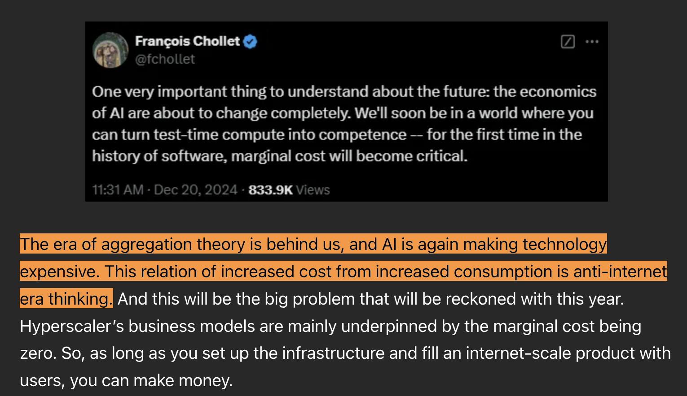
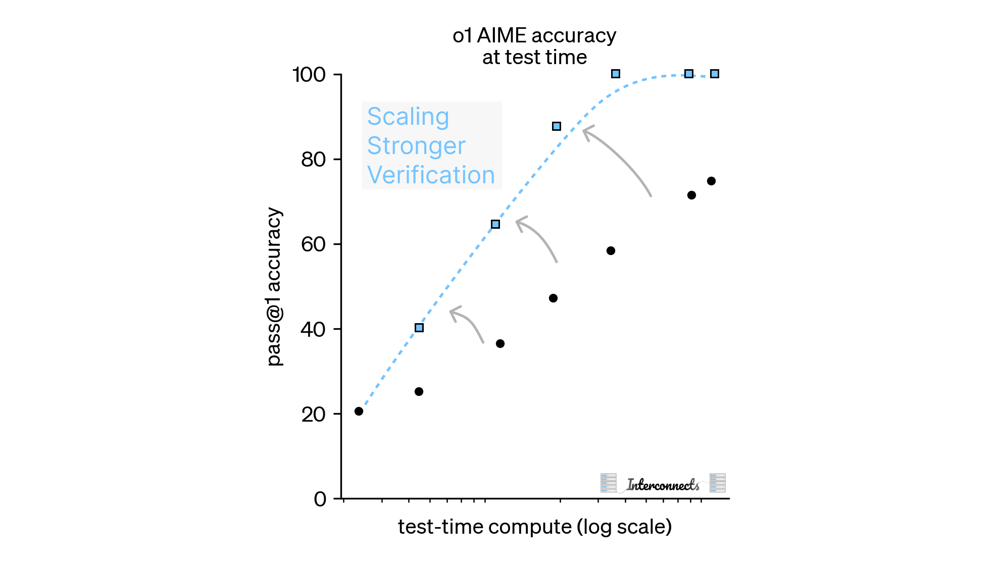
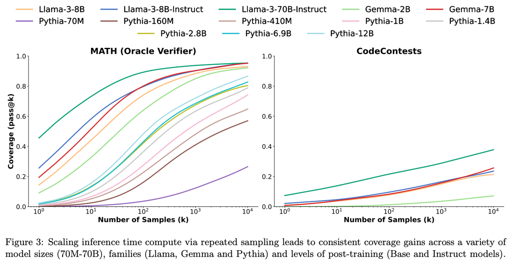

There's a lot of noise about the current costs of AI models served for free users, mostly saying it's unsustainable and making the space narrow for those with the historical perspective of costs of technology always plummeting. [GPT-4.5's odd release](https://www.interconnects.ai/p/gpt-45-not-a-frontier-model) of a "giant" model without a clear niche only amplified these critics. With inference-time compute being a new default mode, can we still have free AI products? Are we just in the VC-subsidized era of AI?

For normal queries to ChatGPT, the realistic expectation is that the cost of serving an average query will drop to be extremely close to zero, and the revenue from a future ad model will make the service extremely profitable. The most cohesive framework for understanding large-scale internet businesses built on the back of such zero marginal costs is Ben Thompson's [Aggregation Theory](https://stratechery.com/aggregation-theory/).

Aggregation Theory posits that extreme long-term value will accrue to the few providers that gate access to information and services built on zero-marginal cost dynamics. These companies aggregate *user demand*. It has been the mode of modern dominant businesses, with the likes of Google and Meta producing extremely profitable products. Naturally, many want to study how this will apply to new AI businesses that are software-heavy, user-facing platforms, of which OpenAI is the most prominent due to the size of ChatGPT. Having more users and attention enables aggregators to better monetize interactions and invest in providing better experiences, a feedback loop that often compounds.

Aggregators are often compared to platforms. Where the former relies on being an intermediary of users and other marketplaces, platforms serve as foundations by which others build businesses and value, such as Apple with the iPhone, AWS, or Stripe.

Businesses like ChatGPT or Perplexity will rely on a profitable advertisement serving model being discovered that works nicely for the dialogue format. ChatGPT interweaving previous discussions into the chat, [as they started doing in the last few months](https://www.interconnects.ai/i/157355619/chatgpt-gets-character-depth), is encouraging for this, as they could also have preferred products or sources that they tend to reference first. Regardless, this will be an entirely new type of ad, distinct from Meta's targeted feed ads, Google's search ads, or the long history of general brand ads. Some of these past ad variants could work, just sub-optimally, in the form factor.

An even easier argument is to see the current hyperscalers using low-cost inference solutions on AI models that complement their existing businesses and fit with components of Aggregation Theory --- [such as Meta serving extremely engaging AI content and ads](https://stratechery.com/2024/metas-ai-abundance/). The biggest platform play here is following the lens through which [language models are a new compute fabric for technology](https://www.interconnects.ai/p/llms-are-computing-platforms). The AWS of AI models.

All of these business models, ads, inference, and what is in between, were clear very soon after the launch of ChatGPT. As the AI industry matures, some harder questions have arisen:

-   Who bears the cost of training the leading frontier models that other companies can distill or leverage in their products?

-   How many multiples of existing inference paradigms (0-100s of tokens) will inference-time scaling motivate? What will this do to businesses?

This post addresses the second question: **How does inference time compute change business models of AI companies?**

The [announcement of OpenAI's o3](https://www.interconnects.ai/p/openais-o3-the-2024-finale-of-ai) with the inference cost on ARC-AGI growing beyond \$5 per task and the proliferation of the new reasoning models raised the first substantive challenge to whether aggregation theory will hold with AI.

The link to inference time compute and the one that sparked this conversation around aggregators was [Fabricated Knowledge's 2025 AI and Semiconductor Outlook](https://www.fabricatedknowledge.com/p/2025-ai-and-semiconductor-outlook), which stated:

> The era of aggregation theory is behind us, and AI is again making technology expensive. This relation of increased cost from increased consumption is anti-internet era thinking.

This is only true if increased thinking is required on every query and if it doesn't come with a proportionate increase in value provided. The fundamental operations of AI businesses will very much follow in the lens of Aggregation Theory (or, in the case of established businesses, it'll [reinforce advantages of existing large companies](https://stratechery.com/2023/ai-and-the-big-five/)), and more work is going to be needed to figure out business models for inference-heavy products.

We can break AI use today into two categories:

1.  ChatGPT and general-use chatbots.

2.  Domain-specific models, enterprise products, model APIs, and everything else that fits into the pay-for-work model (e.g. agents).[1](#footnote-1){#footnote-anchor-1 .footnote-anchor component-name="FootnoteAnchorToDOM" target="_self"}

The first category is established and not going away, while the second is very in flux. Inference time scaling will affect these in different ways.

Consumers --- well, most of them (and not most of you reading this who are power users) --- will never know how to select the right model. The market for super users is far smaller than the market for general use. The core for consumer products is having the model know how much compute to spend. This is where RL training will likely be most important and is something notably missing from the release of Claude 3.7 Sonnet.

OpenAI's model offerings and initial excitement around inference time compute made many, myself included, get excited about the idea of a compute dial being shown to the users so they can control the "thinking effort" for their query. The problem is that rules for how well that translates to performance rely on a deep understanding of AI and how language model performance is very stochastic.

The so-called dial is being reduced to simple reasoning buttons or always-on reasoning --- extremes and yes/no decisions are much easier for users to work with. This is already how I engage with models. I start with a normal model, and if it doesn't work, I punt to o1 pro. Would my trying to guess the right spot on a dial for a new query really be a good experience? Please, the model should know its own limits and handle that on its own.

Today, the RL-trained reasoning models primarily serve as a trust and legibility enhancement to average users rather than a performance improvement. This is leading to the exposure of the Chain of Thoughts (CoTs) to be an industry norm. At the same time, this sort of minor increase in context length will still be subsumed into a zero marginal cost style business, pending the assumed discovery of a functional ad model. This is all also just the tip of the iceberg for inference time compute. From my [coverage of Claude 3.7](https://www.interconnects.ai/p/claude-3-7-thonks):[2](#footnote-2){#footnote-anchor-2 .footnote-anchor component-name="FootnoteAnchorToDOM" target="_self"}

> RL training is a short path to inference time scaling laws being used, but in the long-term we will have more methods for eliciting the inference-time tradeoffs we need for best performance.

For power users and enterprises, RL training and one model fits all is less important. Enterprises will want to benefit from clear trade-offs on performance vs log(compute).

Many in the industry, including in the aforementioned Claude 3.7 release and [o3's ARC-AGI performance](https://www.interconnects.ai/p/openais-o3-the-2024-finale-of-ai), are discussing the use of parallel test time compute relative to just increasing generation lengths. Inference time scaling with parallel computation and strong verifiers will be essential to the long-term trajectory of the sub-area.

Where RL models can increase the compute spent by a model by factors of 2, 4, or 10 for a question, parallel computation already uses factors of 1000 (see o3), and will go far higher. This is a far more direct way to continue scaling the log-compute plots for inference time scaling. It's also more efficient due to the quadratic costs of generating longer contexts --- in fact most of the models we are using cannot scale output length infinitely, as we can with the number of samples.

Better verifiers will increase the slope of the inference time scaling plots we are seeing, as discussed in our coverage of Claude 3.7.

Models will be trained to make the probability of a true answer appearing increase over many generations and maximizing the probability that the extraction method can select it, rather than maximizing the probability that 1 single generation is correct out of the box. **This is a very different way to finish the training of models than has been considered in some time.** Here's a recent example of a research paper studying this, *[Inference-Aware Fine-Tuning for Best-of-N Sampling in Large Language Models](https://arxiv.org/abs/2412.15287),* and more will surely come soon*.*

Verification as the limiter for inference-time scaling performance is not a new idea. It was the starting point of my coverage on inference time scaling, before the release of OpenAI's o1 (and mentioned in the recent post on Claude 3.7). Ultimately, the challenge is *robustness,* not if the models can generate the answer:

::: {.digest-post-embed attrs="{\"nodeId\":\"5b3d501b-ad0e-4aba-addb-82c0eec9772b\",\"caption\":\"Language model generation is a naive form of search. It is sampling from a distribution of potential tokens in order to select the next output. There are many ways we can spend more compute to better refine this distribution, most of which are not being taken seriously enough.\",\"cta\":null,\"showBylines\":true,\"size\":\"sm\",\"isEditorNode\":true,\"title\":\"OpenAI’s Strawberry, LM self-talk, inference scaling laws, and spending more on inference\",\"publishedBylines\":[{\"id\":10472909,\"name\":\"Nathan Lambert\",\"bio\":\"ML researcher making sense of AI research, products, and the uncertain technological future. PhD from Berkeley AI. Experience at Meta, DeepMind, HuggingFace.\",\"photo_url\":\"https://substackcdn.com/image/fetch/f_auto,q_auto:good,fl_progressive:steep/https%3A%2F%2Fsubstack-post-media.s3.amazonaws.com%2Fpublic%2Fimages%2F8fedcdfb-e137-4f6a-9089-a46add6c6242_500x500.jpeg\",\"is_guest\":false,\"bestseller_tier\":100}],\"post_date\":\"2024-09-05T12:00:50.946Z\",\"cover_image\":\"https://substack-post-media.s3.amazonaws.com/public/images/5317f99c-040b-4a9d-b66f-fe9f9702e2ad_2312x1240.png\",\"cover_image_alt\":null,\"canonical_url\":\"https://www.interconnects.ai/p/openai-strawberry-and-inference-scaling-laws\",\"section_name\":null,\"video_upload_id\":null,\"id\":148388607,\"type\":\"newsletter\",\"reaction_count\":86,\"comment_count\":0,\"publication_name\":\"Interconnects\",\"publication_logo_url\":\"https://substackcdn.com/image/fetch/f_auto,q_auto:good,fl_progressive:steep/https%3A%2F%2Fsubstack-post-media.s3.amazonaws.com%2Fpublic%2Fimages%2Fe70f9dbf-4fe6-404c-b6bb-1831d1b7ed0b_590x590.png\",\"belowTheFold\":true}"}
:::

> I wanted to highlight a result from the last paper, Large Language Monkeys, as to why inference time compute is feasible. That paper focuses on repeated sampling from a variety of language models to understand the distribution of answers in a model. They show that with an Oracle answer extractor (more on this later), even models as surprising as Pythia-70M have the true answer inside.
>
> 
>
> Remember, the domain of math answers is infinite. This shows that underlying distribution of the models has the right answer, we need to figure out how to extract the right ones. We need strong verifiers to make answer selection easy. The Snell et al. paper above (1.) calls this the "Proposer and Verifier" perspective.

The understanding that while the models we are using will almost always be able to generate the right answer and the fact that training verifiers for using that has just started should increase optimism that inference time scaling can work.

This type of performance will not be cheap. Unlocking new potential applications is still worth way more than the few dollars these queries can cost. Noam Shazeer of Google explained this on his [Dwarkesh Podcast appearance with Jeff Dean](https://www.dwarkeshpatel.com/p/jeff-dean-and-noam-shazeer):

> One of the big areas of improvement in the near future is inference time compute, applying more compute at inference time. I guess the way I like to describe it is that even a giant language model, even if you're doing a trillion operations per token, which is more than most people are doing these days, operations cost something like 10 to the negative \[18 dollars\]. And so you\'re getting a million tokens to the dollar.
>
> I mean compare that to a relatively cheap pastime: you go out and buy a paper book and read it, you\'re paying 10,000 tokens to the dollar. Talking to a language model is like 100 times cheaper than reading a paperback.
>
> So there is a huge amount of headroom there to say, okay, if we can make this thing more expensive but smarter, because we\'re 100x cheaper than reading a paperback, we\'re 10,000 times cheaper than talking to a customer support agent, or a million times or more cheaper than hiring a software engineer or talking to your doctor or lawyer. Can we add computation and make it smarter?
>
> I think a lot of the takeoff that we\'re going to see in the very near future is of this form. We\'ve been exploiting and improving pre-training a lot in the past, and post-training, and those things will continue to improve. But taking advantage of \"think harder\" at inference time is just going to be an explosion.

The TLDR is "Making language models more expensive is worth it." It is quite the provocation --- that intelligence is worth far more and will restructure the budding AI inference market.

All of the dynamics are going to be accelerated by AI adoption and [Jevon's paradox](https://en.wikipedia.org/wiki/Jevons_paradox). Jevon's paradox is the idea that when a technology gets more efficient, i.e. "reducing the amount needed for a single application," the total usage will actually go up. The resource in this case is GPUs for inference. AI inference, generally, and reasoning models, specifically, are in this feedback loop. Reducing the baseline cost of models will make inference-time scaling even more palatable. On the research side we are also embracing far more ambitious compute spending per problem.

These are business dynamics that don't fit into the most common aggregation theory model. With a gradient from classic zero-marginal cost, high-margin services to high-cost, high-impact new uses of AIs, the behavior of aggregators is going to evolve.

We've seen examples of Aggregation Theory applied to high-cost businesses, such as Amazon's Prime --- distribution is expensive --- but these don't posit to operate on the same internet scale of digitally native businesses. All in, aggregation theory will still apply to most of the consumer and enterprise markets, but there are large areas of the market where the way this is unfolding is entirely new.

The defining factor at the top end of inference scaling is paying for the most productive output. If the costs are so great in both capital and marginal costs, the AI super-companies of the future may look [more like platforms than aggregators](https://stratechery.com/concept/aggregation-theory/platforms-vs-aggregators/). They would have strong network effects as the only people in town who can offer the powertool that is inference-heavy AI.

AI companies will be pushed along the barbell effect --- those with consumer demand can aggregate on cheaper models, but those with specific niches will be forced to compete on performance. The ceiling on price is unknown and markets need to be built on new platforms.

High costs could support AI being less winner-takes-all than many would suspect --- we could have Anthropic operate as the platform for AI agents, ChatGPT aggregating the consumer use, and another party dominating code generation. With so much investment in AI it feels more likely that companies will win their area by focusing on specific domains --- they cannot afford to dilute their efforts relative to a focused peer --- unless an expansive AGI really is coming, in which one company conceivably can take the entire market.

:::: {.footnote component-name="FootnoteToDOM"}
[1](#footnote-anchor-1){#footnote-1 .footnote-number contenteditable="false" target="_self"}

::: footnote-content
Agents will open up many similar trade-offs, as covered in this article. I need to see more of them become a real in-demand product before commenting further.
:::
::::

:::: {.footnote component-name="FootnoteToDOM"}
[2](#footnote-anchor-2){#footnote-2 .footnote-number contenteditable="false" target="_self"}

::: footnote-content
Unpacking why reinforcement learning, of all ideas, was the idea to kickstart this field of study is a fascinating question for another time.
:::
::::
