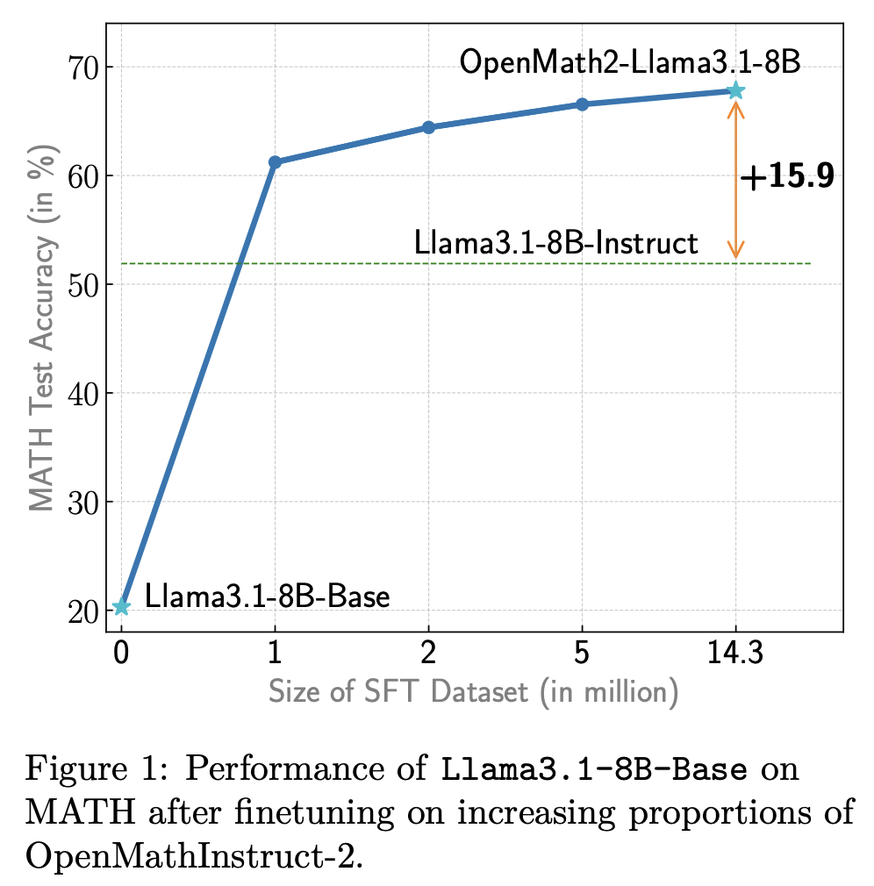

If you look at most of the models we\'ve received from OpenAI, Anthropic, and Google in the last 18 months, you\'ll hear a lot of \"Most of the improvements were in the post-training phase.\" The most recent one was Anthropic's CEO Dario Amodei explaining [Claude 3.7](https://www.interconnects.ai/p/claude-3-7-thonks) on the [Hard Fork Podcast](https://www.youtube.com/watch?v=YhGUSIvsn_Y):

> We are not too far away from releasing a model that\'s a bigger base model. Most of the improvements in 3.6/3.7 are in the post-training phase. We\'re working on stronger base models (perhaps that will be the Claude 4 series, perhaps not; those are coming in a relatively small number of time units \[months?\].

Here\'s a simple analogy for how so many gains can be made on mostly the same base model.

The intuition I\'ve been using to understand the potential of post-training is called the **elicitation interpretation** of post-training, where all we are doing is extracting and amplifying valuable behaviors in the base model.

Consider Formula 1 (F1), most of the teams show up to the beginning of the year with a new chassis and engine. Then, they spend all year on aerodynamics and systems changes (of course, it is a minor oversimplification), and can dramatically improve the performance of the car. The best F1 teams improve way more during a season than chassis-to-chassis.

The same is true for post-training. The best post-training teams extract a ton of performance in a very short time frame. The set of techniques is everything after the end of most of pretraining. It includes \"mid-training\" like annealing / high-quality end of pre-training web data, instruction tuning, RLVR, preference-tuning, etc. A good example is our change from the first version of OLMoE Instruct to the second --- we [improved our post-training evaluation average](https://allenai.org/blog/olmoe-app) from 35 to 48 without touching the majority of pretraining.

Then, when you look at models such as GPT-4.5, you can see this as a way more dynamic and exciting base for OpenAI to build onto. We also know **that bigger base models can absorb far more diverse changes than their smaller counterparts**.

This is to say that scaling also allows post-training to move faster. Of course, to do this, you need the infrastructure to train the models. This is why all the biggest companies are still building gigantic clusters.

This theory folds in with the reality that the majority of gains users are seeing are from post-training because it implies that there is more latent potential in a model pretraining on the internet than we can teach the model simply --- such as by passing certain narrow samples in repeatedly during early types of post-training (i.e. only instruction tuning).

### Throwback to the superficial alignment hypothesis

Another name for this thoery is the Superficial Alignment Hypothesis, coined in the paper *[LIMA: Less is More for Alignment](https://arxiv.org/abs/2305.11206)*. This paper is getting some important intuitions right but for the wrong reasons in the big picture. The authors state:

> A model's knowledge and capabilities are learnt almost entirely during pretraining, while alignment teaches it which subdistribution of formats should be used when interacting with users. If this hypothesis is correct, and alignment is largely about learning style, then a corollary of the Superficial Alignment Hypothesis is that one could sufficiently tune a pretrained language model with a rather small set of examples \[[Kirstain et al., 2021](https://arxiv.org/abs/2110.04374)\].

All of the successes of deep learning should have taught you a deeply held belief that scaling data is important to performance.[1](#footnote-1){#footnote-anchor-1 .footnote-anchor component-name="FootnoteAnchorToDOM" target="_self"} Here, the major difference is that the authors are discussing alignment and style, the focus of academic post-training at the time. With a few thousand samples for [instruction finetuning](https://rlhfbook.com/c/09-instruction-tuning.html), you can change a model substantially and improve a narrow set of evaluations, such as AlpacaEval, MT Bench, ChatBotArena, and the likes. These do not always translate to more challenging capabilities, which is why Meta wouldn't train its Llama Chat models on just this dataset. Academic results have lessons, but need to be interpreted carefully if you are trying to understand the big picture of the technological arc.

What this paper is showing is that you can change models substantially with a few samples. We knew this, and it is important to the short-term adaptation of new models, but their argument for performance leaves the casual readers with the wrong lessons.

If we change the data, the impact could be far higher on the model's performance and behavior, but it is far from "superficial." Base language models today (with no post-training) can be trained on some mathematics problems with reinforcement learning, learn to output a full chain of thought reasoning, and then score higher on a full suite of reasoning evaluations like BigBenchHard, Zebra Logic, AIME, etc.

The superficial alignment hypothesis is wrong for the same reason that people who think RLHF and post-training are just for vibes are still wrong.[2](#footnote-2){#footnote-anchor-2 .footnote-anchor component-name="FootnoteAnchorToDOM" target="_self"} This was a field-wide lesson we had to overcome in 2023 (one many AI observers are still rooted in). Post-training has far outgrown that, and we are coming to see that the style of models operates on top of behavior --- such as the now popular long chain of thought.

### The counterargument to elicitation

The prevailing counterargument to the elicitation theory of post-training has been that post-training is ***teaching*** specific skills to the model. This can be seen through very large finetuning datasets used in the early eras of open models. One of the last prominent research examples of this is [OpenMathInstruct 2](https://arxiv.org/abs/2410.01560), which showed performance improvements with finetuning on **up to 14.3 million instructions**.

A rough industrial norm is that you can do excellent post-training with only 1 million prompts at instruction tuning. The way to interpret the above plot with the elicitation theory is that the vast majority of the gains come from the beginning of training.

The trade-offs discussed in this counterargument, such as scaling post-training methods, were specifically discussed in the paper *[Revisiting the Superficial Alignment Hypothesis](https://arxiv.org/abs/2410.03717)*[3](#footnote-3){#footnote-anchor-3 .footnote-anchor component-name="FootnoteAnchorToDOM" target="_self"}, where it is clear that you *can* teach new skills to models in post-training. The hardest part today is to know when the skills are entirely new --- it is often safer to assume the model has seen them at pretraining. Therein, it is far more efficient to elicit behaviors from the model than to teach, and eventually, the tide may shift to favor teaching models, but not in the near future.

Comparing this math training dataset to current best (and emerging) practices for reasoning models makes the strongest case for the elicitation theory yet.

### RL's role in elicitation

The reinforcement learning (RL) training we've seen take off in this [early era of reasoning models](https://www.interconnects.ai/t/reasoning) is often described as "sample efficient" and "the model learning new behaviors." Both of these fit with the theory presented. The astute way to view the model learning new behaviors is not that it is learning entirely new abilities but rather learning to reinforce behaviors that were already latent in the pretraining dataset.

Compared to teaching the model math with millions of samples, just a few thousand prompts of RL training can far surpass the performance in MATH shown above.

In many ways, RL training exploding in popularity and effectiveness is the ultimate endorsement of the elicitation theory. Where we used to try and teach the model math with millions of supervised samples, now we just let the model try different approaches on thousands of math problems, and they reach far higher peak performance.

This is, of course, also linked to why people say that "stronger base models are better starting points for RL." All of this fits together as the base model is the platform on which post-training is built.

A reductionist take here is to say that pretraining is not important --- in reality, pretraining is just slow and hidden from most of the gains we are seeing. Still, excellent post-training and the performance improvements we enjoy today are all well downstream of pretraining. Pretraining still is arguably the most important part of the training stack, as it allows those with confidence in the elicitation during post-training to thrive.

------------------------------------------------------------------------

*Thanks to Mohit Raghavendra for some email exchanges that helped this post.*

:::: {.footnote component-name="FootnoteToDOM"}
[1](#footnote-anchor-1){#footnote-1 .footnote-number contenteditable="false" target="_self"}

::: footnote-content
For example, I feel the same way about Less is More for Reasoning ([LIMO](https://arxiv.org/abs/2502.03387)). S1, [Simple Test Time Scaling](https://arxiv.org/abs/2501.19393) is almost like this, but it focuses on a method for illiciting scaling rather than saying small alone is good.
:::
::::

:::: {.footnote component-name="FootnoteToDOM"}
[2](#footnote-anchor-2){#footnote-2 .footnote-number contenteditable="false" target="_self"}

::: footnote-content
The paper LIMA is well-cited and the dataset is heavily used. The authors obviously succeeded in many senses of the word.
:::
::::

:::: {.footnote component-name="FootnoteToDOM"}
[3](#footnote-anchor-3){#footnote-3 .footnote-number contenteditable="false" target="_self"}

::: footnote-content
[blog post](https://mohit-raghavendra.notion.site/Disentangling-Post-training-performance-from-data-1a5db7f2a34480e18010d689a1f46f74) from the lead author.
:::
::::
