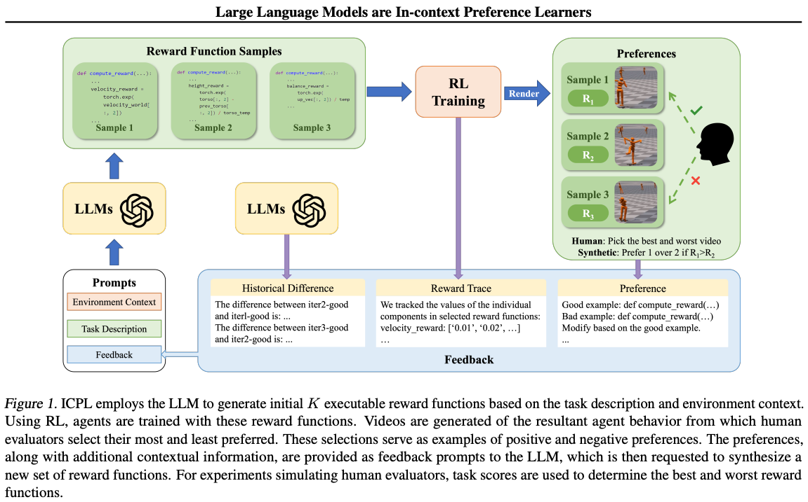

[Eugene Vinitsky](https://www.eugenevinitsky.com/) is a professor a New York University department of Civil and Urban Engineering. He's one of my original reinforcement learning friends from when we were both doing our Ph.D.'s in RL at UC Berkeley circa 2020. Eugene has extensive experience in [self-driving](https://proceedings.mlr.press/v87/vinitsky18a.html), [open endedness](https://arxiv.org/abs/2012.02096), [multi-agent reinforcement learning](https://arxiv.org/abs/2103.01955), and [self-play with RL](https://arxiv.org/abs/2502.03349). In this conversation we focus on a few key topics:

-   His latest results on self-play for self-driving and what they say about the future of RL,

-   Why self-play is confusing and how it relates to the recent takeoff of RL for language models, and

-   The future of RL in LMs and elsewhere.

This is a conversation where we take the time to distill very cutting edge research directions down into the core essences. I felt like we were learning in real time what recent developments mean for RL, how RL has different scaling laws for deep learning, and what is truly salient about self-play.

The main breakthrough we discuss is scaling up self-play techniques for large-scale, simulated reinforcement learning. Previously, scaling RL in simulation has become economical in single-agent domains. Now, the door is open to complex, multi-agent scenarios where more diversity is needed to find solutions (in this case, that's what self play does).

Eugene's [Google Scholar](https://scholar.google.com/citations?user=6dr5fLEAAAAJ&hl=en) \| [Research Lab](https://emerge-lab.github.io/) \| [Linkedin](https://www.linkedin.com/in/eugenevinitsky) \| [Twitter](https://twitter.com/EugeneVinitsky) \| [BlueSky](https://bsky.app/profile/eugenevinitsky.bsky.social) \| [Blog](https://www.eugenevinitsky.com/blogs/) (with some great career [advice](https://www.eugenevinitsky.com/posts/coldemails/)).

Listen on [Apple Podcasts](https://podcasts.apple.com/us/podcast/interconnects-audio/id1719552353), [Spotify](https://open.spotify.com/show/2UE6s7wZC4kiXYOnWRuxGv), [YouTube](https://www.youtube.com/@interconnects), and [where ever you get your podcasts](https://www.interconnects.ai/podcast). For other Interconnects interviews, [go here](https://www.interconnects.ai/t/interviews).

:::::::: {#youtube2-2Q66uIRMEnc .youtube-wrap attrs="{\"videoId\":\"2Q66uIRMEnc\",\"startTime\":null,\"endTime\":null}" component-name="Youtube2ToDOM"}
::::::: youtube-inner
:::::: iframe
::: {#player}
:::

:::: player-unavailable
# An error occurred. {#an-error-occurred. .message}

::: submessage
[Try watching this video on www.youtube.com](https://www.youtube.com/watch?v=2Q66uIRMEnc){target="_blank"}, or enable JavaScript if it is disabled in your browser.
:::
::::
::::::
:::::::
::::::::

------------------------------------------------------------------------

### Show outline & links

We cover many papers in this podcast. Also, as an experiment, here's a Deep Research report on "[all the papers that appeared in this podcast transcript](https://chatgpt.com/share/67d0fd58-8764-8005-8622-dbef26880a13)."

In this episode, we cover:

-   Self-play for self-driving, mostly around the recent paper *[Robust Autonomy Emerges from Self-Play](https://arxiv.org/abs/2502.03349)* (Cusumano-Towner et al. 2025).\
    \
    The simulator they built powering this is **Gigaflow**.\
    More [discussion on HackerNews](https://news.ycombinator.com/item?id=42968700).\
    (Here's another [self-play for self-driving paper](https://arxiv.org/abs/2403.19648) and [another](https://arxiv.org/abs/2502.14706) from Eugene from earlier this year).\
    \
    A few highlights:\

    "**All simulated agents use the** ***same*** **neural net with the same weights**, albeit with randomized rewards and conditioning vector to allow them to behave as different types of vehicles with different types of aggressiveness. This is like driving in a world where everyone is different copies of you, but some of your copies are in rush while others are patient. This allows backprop to optimize for a sort of global utility across the entire population."\

    "The resulting policy simulates agents that are human-like, even though the system has never seen humans drive."

-   *[Large Language Models are In-context Preference Learners](https://arxiv.org/abs/2410.17233)* --- how language models can come up with reward functions that will be applied to RL training directly.\
    [Related work from Stanford](https://arxiv.org/abs/2502.03717v1).

-   Related literature from Interconnects! The first includes literature we mention on the learning locomotion for quadrupeds with deep RL (special shoutout as usual to Marco Hutter's group).

::: {.digest-post-embed attrs="{\"nodeId\":\"9c96f690-392c-416b-a713-11fb7df7c1f8\",\"caption\":\"Reinforcement learning (RL) practitioners have always had a complicated discourse around the community’s own notion of success. There seems to be never-ending Tweet threads and blog posts saying that RL research and practice need to wake up. Most of them, my own included, really are pretty lukewarm takes. Reinforcement learning is fine, it’s not perfect…\",\"cta\":null,\"showBylines\":true,\"size\":\"sm\",\"isEditorNode\":true,\"title\":\"Pretraining quadrupeds: a case study in RL as an engineering tool\",\"publishedBylines\":[{\"id\":10472909,\"name\":\"Nathan Lambert\",\"bio\":\"ML researcher making sense of AI research, products, and the uncertain technological future. PhD from Berkeley AI. Experience at Meta, DeepMind, HuggingFace.\",\"photo_url\":\"https://substackcdn.com/image/fetch/f_auto,q_auto:good,fl_progressive:steep/https%3A%2F%2Fsubstack-post-media.s3.amazonaws.com%2Fpublic%2Fimages%2F8fedcdfb-e137-4f6a-9089-a46add6c6242_500x500.jpeg\",\"is_guest\":false,\"bestseller_tier\":100}],\"post_date\":\"2023-01-16T21:24:52.828Z\",\"cover_image\":\"https://substackcdn.com/image/fetch/h_600,c_limit,f_auto,q_auto:good,fl_progressive:steep/https%3A%2F%2Fsubstack-post-media.s3.amazonaws.com%2Fpublic%2Fimages%2F7d1ddcea-db7c-46a2-9e85-cd4a96141cbc_1920x1080.jpeg\",\"cover_image_alt\":null,\"canonical_url\":\"https://www.interconnects.ai/p/rl-quadrupeds\",\"section_name\":null,\"video_upload_id\":null,\"id\":96525389,\"type\":\"newsletter\",\"reaction_count\":6,\"comment_count\":4,\"publication_name\":\"Interconnects\",\"publication_logo_url\":\"https://substackcdn.com/image/fetch/f_auto,q_auto:good,fl_progressive:steep/https%3A%2F%2Fsubstack-post-media.s3.amazonaws.com%2Fpublic%2Fimages%2Fe70f9dbf-4fe6-404c-b6bb-1831d1b7ed0b_590x590.png\",\"belowTheFold\":true}"}
:::

::: {.digest-post-embed attrs="{\"nodeId\":\"6cdfc27f-58e5-4b0b-a9b5-feba6dda42c1\",\"caption\":\"Elsewhere from me:\",\"cta\":null,\"showBylines\":true,\"size\":\"sm\",\"isEditorNode\":true,\"title\":\"Scaling laws for robotics & RL: Not quite yet\",\"publishedBylines\":[{\"id\":10472909,\"name\":\"Nathan Lambert\",\"bio\":\"ML researcher making sense of AI research, products, and the uncertain technological future. PhD from Berkeley AI. Experience at Meta, DeepMind, HuggingFace.\",\"photo_url\":\"https://substackcdn.com/image/fetch/f_auto,q_auto:good,fl_progressive:steep/https%3A%2F%2Fsubstack-post-media.s3.amazonaws.com%2Fpublic%2Fimages%2F8fedcdfb-e137-4f6a-9089-a46add6c6242_500x500.jpeg\",\"is_guest\":false,\"bestseller_tier\":100}],\"post_date\":\"2023-02-01T23:28:07.852Z\",\"cover_image\":\"https://substackcdn.com/image/fetch/f_auto,q_auto:good,fl_progressive:steep/https%3A%2F%2Fsubstack-post-media.s3.amazonaws.com%2Fpublic%2Fimages%2F3325a03c-f617-4cf5-8b9b-2ccf6b71b034_1024x576.png\",\"cover_image_alt\":null,\"canonical_url\":\"https://www.interconnects.ai/p/scaling-rl-axes\",\"section_name\":null,\"video_upload_id\":null,\"id\":100338908,\"type\":\"newsletter\",\"reaction_count\":7,\"comment_count\":4,\"publication_name\":\"Interconnects\",\"publication_logo_url\":\"https://substackcdn.com/image/fetch/f_auto,q_auto:good,fl_progressive:steep/https%3A%2F%2Fsubstack-post-media.s3.amazonaws.com%2Fpublic%2Fimages%2Fe70f9dbf-4fe6-404c-b6bb-1831d1b7ed0b_590x590.png\",\"belowTheFold\":true}"}
:::

-   Recent and relevant papers *[Value-based RL Scales Predictably](https://arxiv.org/abs/2502.04327), [Magnetic control of tokamak plasmas through deep reinforcement learning](https://www.nature.com/articles/s41586-021-04301-9).*

-   Other things we mention:

    -   Cruise, Tesla, and Waymo's autonomy stacks (speculation) and how the self-driving industry has changed since we were / were considering working in it.

    -   [Evo 2 foundation model for biology.](https://arcinstitute.org/tools/evo)

-   Eugene is working with a new startup on some LLM and RL stuff. If you're interested in this episode, ping eugene@aitco.dev. Not a paid promotion.

## Chapters

-   00:00:00 Introduction & RL Fundamentals

-   00:11:27 Self‑Play for Self‑Driving Cars

-   00:31:57 RL Scaling in Robotics and Other Domains

-   00:44:23 Language Models and In-Context Preference Learning

-   00:55:31 Future of RL and Grad School Advice

## Transcript

*I attempted to generate with ElevenLab's new [Scribe](https://elevenlabs.io/blog/meet-scribe) tool, but found the formatting annoying and reverted back to Alessio's smol-podcaster. If you're interested in working part-time as an editorial aide to Interconnects, please get in touch.*

**Nathan Lambert** \[00:01:27\]: Hey, Eugene. Welcome to the show.

**Eugene Vinitsky** \[00:01:29\]: Hey, Nathan. Thanks for having me. Excited to be here.

**Nathan Lambert** \[00:01:32\]: Yeah, so I\'ll have said this in the intro as well, but we definitely go well back in all the way to Berkeley days and RL days, I think.

I will embarrass you a little bit now on the live read, which is like, you were one of the people when I was switching into RL, and they\'re like, oh, it seems like you only figured out how to get into AI from a potentially different background, and that\'s what I was trying to do in 2017 and 2018.

So that was kind of fun, and now we\'re just friends, which is good.

**Eugene Vinitsky** \[00:02:01\]: Yeah, we were both figuring out. If I had any lead over you there, I was also frantically trying to figure it out, because I was coming from a weird background.

**Nathan Lambert** \[00:02:11\]: There are definitely a lot of people that do that now and over-attribute small time deltas to big strategic plans, which was probably what it was.

And we\'re just going to do some of our normal conversations on RL and self-play.

I think the backstory of this is you told me that your recent paper from some of your time at Apple, I think I don\'t want to time for it too specifically, was something, paraphrasing, like the most exciting RL thing you\'ve ever had a part of.

And major RL projects are not that frequent.

I think if you segment out all the language model excitement in the past 10 years, there\'s really a few major milestones, and it\'s good to kind of talk about them.

So we can kind of start, I think, basic things, like how do you define reinforcement learning, and it will kind of build up to this self-driving project.

**Eugene Vinitsky** \[00:03:05\]: Yeah, so I think RL is kind of a big thing, but at a really basic level, you have this process of taking actions in the world.

You\'re seeing the state of the world.

If you\'re taking actions in the world, you sometimes receive a reward that tells you the value of that action, and you\'re trying to kind of optimize your cumulative behavior over time.

So that, you know, over long trajectories, you\'re optimizing those costs.

That\'s both, you know, the hard thing and the exciting thing is that if you do it well, you can really optimize really long horizon behaviors.

**Nathan Lambert** \[00:03:41\]: Yeah, I agree.

And it\'s funny because now it\'s finally, the language models are finally doing this long chain of thought, and I don\'t really think that\'s the same.

I think the interactive notion will come up a lot here where these long context behaviors are many, many actions interacting with the world relative to one really, really long action, which is kind of odd.

**Eugene Vinitsky** \[00:04:04\]: Yeah, I guess, yeah, it mixes things, right?

Because it has very long state, right?

It\'s got very long contexts, and it\'s generating its own context.

But in the end, there\'s really one action at the end that, like, kind of determines how everything went, you know?

**Nathan Lambert** \[00:04:23\]: Yeah, yeah, yeah, we\'ll get into this.

And then the next thing that we kind of need to set up is what do you define self-play as?

I think this word has been particularly broken in recent times with language models, and I\'m hoping we can get a fairly specific criteria for what is self-play and what are related topics.

**Eugene Vinitsky** \[00:04:42\]: Yeah, I think even within the field, there\'s quite a bit of debate as to what constitutes self-play.

So talking to, you know, experts, people will disagree about what methods are and are in self-play.

But what I will say is I generally define self-play as anything where an agent plays a copy of itself.

So up to a bunch of different agents interacting with each other, as long as they\'re mostly, in some ways, copies of each other, we\'re doing self-play.

**Nathan Lambert** \[00:05:12\]: Yeah, and then do you think anything, I mean, your background\'s in multi-agent as well.

Do you think there is something fundamental to kind of a game that has a really specific hill to climb where it\'s kind of this competitive nature versus something like language?

**Eugene Vinitsky** \[00:05:29\]: Yeah, this is kind of the dream of, I think, some multi-agent researchers is this type of like ratchet effect where you have a bunch of agents interacting with each other and kind of increasing complexity on the part of any agent generates increasing, like creates new challenges that need to be solved and then force you to learn new skills.

And then you kind of get this endless, endless ratchet.

Maybe that\'s what you meant.

I may have misinterpreted.

**Nathan Lambert** \[00:05:55\]: We\'re going to revisit it.

I think also it\'s like, how does the multi-agent nature of a lot of these things change what people think about with RL?

This is kind of the last building block before we go into the self-driving stuff.

**Eugene Vinitsky** \[00:06:07\]: Yeah, yeah, yeah.

So the way that the multi-agent thing changes things is it makes everything much harder and more interesting.

So you go away from this world where you have like a clear score function, right?

So you have some reward for first in single agent setting, you have some reward.

If that reward is high, you\'re doing well, right?

And when you move into the multi-agent setting, it becomes reward with respect to whom, right?

It all of a sudden matters whom I\'m playing, right?

So if we go to a game of like, like one setting is like two players, zero sum games, right?

So a game of two player poker, I give you, I train a poker bot, right?

How do I know it\'s any good?

I have to play another poker bot to decide that it\'s any good, right?

And so all of a sudden, this challenge of like, what is a good policy becomes very fundamental.

And you kind of lose even a notion of there being like one clear good policy.

And like the whole, a lot of, a lot of the field of multi-agents is coming up with different definitions of what would cost you goodness.

**Nathan Lambert** \[00:07:06\]: Um, so, and then back to the self-play thing with that, like, is all of the self-play that we discussed, like if you were playing yourself, does the same consideration apply?

Like, is that, is self-play necessarily a multi-agent framing?

**Eugene Vinitsky** \[00:07:19\]: Um, I think it, I think it is because oftentimes what we\'re trying to do with self-play is like to converge to some notion of policy goodness.

And self-play is just a mechanism that gets us to some definition of, of high quality policies.

Um, and, and, and what turns out to be the case is there, there are actually many like non-self-play type methods for doing this.

Self-play just turns out to be an effective way to accomplish constructing effective policies.

**Nathan Lambert** \[00:07:45\]: Yeah, I, I, there\'s many, I\'ll, I\'ll link later a lot of these papers on self-play for preference learning and look into them a bit more.

**Eugene Vinitsky** \[00:07:56\]: Yeah.

**Nathan Lambert** \[00:07:57\]: Essentially that\'s been the lens.

There\'s two lenses by which this has come back and both of them, I don\'t think fit into, I, I think this multi-agent lens of self-play is much richer and I don\'t think any of them have fulfilled this.

I think there\'s useful methods for preference tuning.

I think that\'s like maybe spin it\'s like self-play something preference learning is one.

And there\'s papers related to this where they\'re probably looking at the probability of the own model in generating a response or something like looking at the internals of the model.

And it\'s not really set up in this game nature of some sort.

And then also with Q stars, when the self-play stuff came back where I really think I\'ve, I\'ve talked to some people that did original reporting on this and it was that the model looked like it was talking to itself.

And I think that very understandably for less, a little bit less technical audiences that haven\'t engaged with self-play, that coverage of talking to itself got transformed into a self-play commentary and hype cycle, which took people down the wrong path for like an entire year, which is so brutal, but also very understandable and funny.

**Eugene Vinitsky** \[00:09:11\]: Yeah, I think there\'s something interesting and different happening in these like multi-agent like LLM self-play setups.

I\'m not super familiar, but I think what\'s happening is something quite different than what we mean in other multi-agent settings when we\'re talking about self-play.

Like I feel like it\'s, it\'s more about like refining like the distribution of actions that it takes in some, some kind of odd way.

**Nathan Lambert** \[00:09:39\]: I think this sounds ridiculous at first pass, but it\'s almost that the language models are simulating a softer version of self-play within themselves to kind of check their own work and engage in their own discourse, which the level of intelligence they have is not going to like unlock the true like incremental progress that we think of with self-play.

Which probably, I think for context of things for self-play, just to put them on the record of this are, have been very impactful or things like AlphaGo and New Zero.

I think that\'s, those are the prime examples of generating some superhuman policy in a closer way.

I think it\'s, it\'s important to kind of gate the conversation on like, these are the aspirational goals, um, in terms of outcomes and then figuring out how to apply them to new domains and new tools is kind of unknown.

**Eugene Vinitsky** \[00:10:31\]: So, so maybe I should have said this earlier, but like self-play is the thing that gives a, is like maybe the one way that we know to build superhuman agents right now.

So, right.

So, um, superhuman go, um, human level Dota, human level, uh, Starcraft.

Um, technically poker is in a, in a slightly weirder, um, weirder space where I don\'t, I don\'t exactly know that I would call the method on that underlie that self-play.

Um, sorry.

Um, and, uh, but yeah, it\'s the one way we really know how to build superhuman agents.

**Nathan Lambert** \[00:11:06\]: And I think this is a kind of a natural transition because the, to make people excited in the work that you did, it seems like you\'ve discovered superhuman driving through self-play without inductive biases.

And I\'m like, um, how do you view the potential impact of this?

And then we can kind of go into the method.

**Eugene Vinitsky** \[00:11:27\]: Right.

So the, the challenge with self-play is, and this requires a bit of technical detail to get there, but you know, in, in like two players, here are some games, games where you and an adversary are playing with each other and somebody wins and somebody loses, there\'s a very well defined notion of what being good is.

Um, you know, that they\'re, they\'re well, you know, their criteria that we would like our policies to converge to.

And, and the challenge has always been about moving beyond that to a domain where it\'s much harder to define what, what doing well means, right?

There isn\'t like an abstract notion of what good driving is there out in the world where I could just write down the reward function and simulate it and optimize with respect to that.

And all of a sudden I\'d have a good driving policy.

So the, the gap has always been between these methods that work really, really well in, in well-defined games like, like Starcraft or go, uh, and chess, um, and settings where it\'s much harder to define that.

And so we haven\'t been able to, to move to self-play in settings where, for example, humans might be in the loop, right.

And, and particularly driving is an instance of that somewhere where at the end, we\'re going to take our policy and it\'s going to drive with humans and we have no way to simulate humans and play against them.

Um, and so figuring out how to close that gap has been kind of an open, open challenge.

And I think maybe this is the first instance of, uh, finding a way to do that.

**Nathan Lambert** \[00:12:51\]: Okay.

So that\'s a much better motivation than I gave.

And I understand the excitement now, because if this works in one domain, um, and you\'ll tell us about how grand of an effort it actually was.

I know big tech companies can put a lot of force and long-term investment behind things to get them off the ground.

Then a lot of the other things that people are saying about language models or other complicated domains are at least there\'s an existence proof of something similar happening.

So why don\'t you just continue to explain, uh, this problem set up of learning driving without having a human teacher.

It will probably take detours to analogize different self-driving stacks just because we know about them and it\'s good to compare.

**Eugene Vinitsky** \[00:13:36\]: So one way of framing this is, and I\'m going to put cautions in the end, I\'m going to give you the, the, the extreme version of it.

And I\'m going to walk it back a little bit is like human level driving without any human level data.

And the caution needs to be that this is in simulation and our ability to measure human level driving in simulation is limited in a lot of ways.

So I can tell you about the ways that we measured it and then I\'ll, I\'ll have to tell you what the limitations of those things are.

Um, so this was a large scale effort, um, uh, and Lovlin Colton\'s team and at Apple, um, it was about like eight researchers, research engineers working together for about a year and a half, uh, build, building the stack out.

Um, it was, I think a lot of us came at it from different places.

I know some folks were very inspired by this idea of like alpha star for driving, you know, building a diverse, rich world and then driving it in a way that such you would, you would transfer to policies that you hadn\'t seen before.

So like human actors.

Um, so, um, yeah, the, the, if, if, if it\'s helpful that the idea here is that, or the goal here was to build a human level simulated driver.

Um, and here, what that means in our case is not a fully end-to-end method, right?

So we\'re not simulating perception.

So driving stacks consist of like generally perception, prediction, planning controls.

So you have a perception stack that, you know, takes your LIDAR, your camera, your radar, and converts it into, you know, where are the cars, where are the road is, what\'s impassable.

Um, and then a prediction stack will take the like positions of all the cars, the cyclists, pedestrians, and it\'ll predict, predict where they\'re going to go next.

And then a planning stack will say, okay, given those predictions, you know, what\'s a good trajectory for me to take.

And then the control stack will say how to actually follow that trajectory safely and robust.

Right.

And we\'re talking about subsuming the prediction, planning, control portion of the stack, not the perception part of the stack.

**Nathan Lambert** \[00:15:28\]: Okay.

So I was, I was thinking that you might not even do control.

I was thinking you might just say, uh, control is a softer album and not do that too.

**Eugene Vinitsky** \[00:15:35\]: So in the same way, we\'re kind of, we\'re only kind of doing control.

Uh, we\'re, we\'re, we\'re doing this for, I think Waymo uses the

**Nathan Lambert** \[00:15:42\]: the term behavior for this.

I think it\'s been their behavior team for a while.

Is that right?

**Eugene Vinitsky** \[00:15:46\]: Okay.

**Nathan Lambert** \[00:15:47\]: Uh, you know, I very, it\'s hard to know where the abstraction ends, but they definitely have a behavior team that\'s done a lot of things through the years.

Well, he\'s not the job apps that I\'ve been applying to an interview or have interviewed for in the past.

Yeah, me too.

**Eugene Vinitsky** \[00:16:01\]: Um, I think we do know how to control cars.

We know how to make cars follow a pre-specified trajectory, right?

This is, this is somewhat of an easier problem than like humanoid robotics or something.

You know, big thing got wheels.

We know how to make it turn.

**Nathan Lambert** \[00:16:14\]: Um, so how do we get these things from, I mean, they start as like, it doesn\'t start at just all the simulated cars crashing all the time.

What is the start here?

**Eugene Vinitsky** \[00:16:24\]: I\'ll send you the video once it\'s out, but like, you know, the, the first 10 hours of simulation is just like cars scattered all across the road, smashing into each other, driving off the road, that type of thing.

It\'s actually interestingly useful because what we do is when two cars crash, we have them come to an immediate stop.

And this actually creates a lot of blockades in the road.

So at some point during the training, the cars start to learn to drive around stopped cars, even though those cars are stopped because they\'ve crashed, um, as well as to drive around like obstacles and things like that.

Um, so that, yeah, that\'s what it looks like.

Um, yeah.

**Nathan Lambert** \[00:16:58\]: Um, as well as the reward function for these.

So you have a bunch of cars that can see their peers and there\'s some reward function I\'m guessing.

**Eugene Vinitsky** \[00:17:06\]: So the, the major component of the reward function is getting to your goal without colliding.

So we, we have these maps that we\'ve taken from the cartless simulator.

They\'re fairly large maps.

Some of them are like multiple kilometers in spatial extent.

We have eight of them and we place goals randomly over the map.

Um, and you get a sequence of goals.

So, you know, that like, okay, I want to get to this point.

And then after that, I\'m going to want to get to this next point.

After that, you\'re going to get a big reward for getting to that goal.

You\'re going to get some amount of penalty for colliding.

And then there\'s also an implicit penalty because if you collide, you\'re not ever going to get to your goal.

And then there, there is some amount of hand design here in that there are small rewards for like staying in your lane and being aligned with your lane and like, you know, not driving in the opposite direction in the wrong lane.

**Nathan Lambert** \[00:17:51\]: This was one of the questions is if you had to do this sort of thing.

**Eugene Vinitsky** \[00:17:54\]: You have to do that.

But one interesting thing, and maybe we could talk about that at some point is we randomize the weights of those rewards.

So there are agents that like really want to drive in the lane going in the right direction.

And there are agents that don\'t care about that at all.

And they will take the wrong lane on the highway, uh, you know, going at full speed in the opposite direction.

And that\'s kind of useful because you\'re ready for that scenario.

You\'ve seen that scenario in the world when you\'re driving around.

Right.

Um, but yeah, we have to, we have to do some of that stuff because at some point there are laws and you can\'t avoid encoding the laws into your system.

You know, stop signs are a human concept.

Um, they\'re, they\'re not, you know, it\'s not going to emerge that you see a red thing and you\'re like, oh yeah, that means I should stop.

And then I should like give the right of way rules to the other cars.

Um, but all of our rewards are kind of soft in the sense, like, you know, if you\'re at a stop sign and folks have been preventing you from going for a very long period of time, right.

You\'re going to start to nudge in and like break the rules about right away.

**Nathan Lambert** \[00:18:55\]: One of my questions for later on this is like, do you think our vehicles and driving dynamics and infrastructure kind of constrain the way of driving?

Like we\'ve co-designed human driving in our infrastructure so that human driving is actually no longer that special because of the track is so long, so defined.

**Eugene Vinitsky** \[00:19:11\]: I think this is, this is part of why this is all going to work or like why it works is because like human, human driving is, and human behavior in many domains is like fairly constrained by the institutions and the laws and the norms that we design.

Uh, it\'s not super free from, uh, so like driving amongst humans is much more of a constrained problem than you would, than you would, you would think it\'s also unconstrained in some interesting ways, but, but it\'s, it\'s quite unconstrained, quite constrained.

**Nathan Lambert** \[00:19:42\]: And how hard to act was this to actually learn?

So how sensitive of a process is it now?

I think in the paper, you\'re talking about gigaflow, which is like a high speed

simulation engine.

So obviously, you know, on data, the final paper says that it learns in 1.6 billion kilometers of driving.

I was wondering if you had an intuition for that.

So like how many miles are driven by all the cars in San Francisco and day or something like this?

**Eugene Vinitsky** \[00:20:10\]: That\'s a, that\'s a great question.

**Nathan Lambert** \[00:20:12\]: Um, it could be a good chat GPT query, to be honest.

**Eugene Vinitsky** \[00:20:16\]: This might be a chat GPT question.

Um, let me, let me give some, some numbers that I do know.

Uh, and this is kind of maybe helpful.

So I think cars crash every 20,000 to a hundred thousand miles and a fatal collision happens every a hundred million miles, something like that.

Um, but how many miles are driven in a day in a city?

I\'m not sure.

1.6 billion kilometers, the distance between here and Saturn.

Um, it sounds like kind of far when you put it that way, but there are a lot of cars.

Yeah, there are a lot of cars, right?

There are a lot of drivers.

Um, there are surprisingly few trips in a city, fewer than you would expect, but, um, I\'m struggling to put a number on it.

**Nathan Lambert** \[00:21:01\]: Um, I\'ll tell you what chat GPT gets when it\'s done.

I was thinking it\'s Oh three mini high.

This is not a reliable number.

Take this time.

So your intuition that it\'s lower goes a lot.

I mean, you\'ve thought about a lot of these car systems for a very long time and I will link to some of your other work on this.

So you definitely have better intuitions than I would.

**Eugene Vinitsky** \[00:21:20\]: Well, the intuition comes with the fact that like a lane of the highway can take 2000 vehicles per hour, which is like just not that many vehicles.

Um, and you know, most, most of, most of traffic is between like, you know, 8am and or like 7am and like 10am and then on the way back home.

And so, you know, you can like kind of estimate based on how many lanes there are on the main highway, how many trips there are.

**Nathan Lambert** \[00:21:43\]: So San Francisco, the chat Oh three mini high estimated four to 5 million miles in a day in San Francisco.

It\'s a bully.

It\'s a plausible number, but it\'s well below what you are doing.

Like this is, I think maybe globally this billion kilometers could be hit.

So this is okay.

**Eugene Vinitsky** \[00:22:03\]: Here\'s one way to think of it.

We simulate 10,000 years of human drive.

**Nathan Lambert** \[00:22:08\]: Okay.

So yeah, 10,000 per one.

I guess it depends on how many cars you have in parallel.

**Eugene Vinitsky** \[00:22:14\]: Per one training run one trip to get the policy that we get.

We simulate about 10,000 years of human drive.

**Nathan Lambert** \[00:22:20\]: Yeah.

**Eugene Vinitsky** \[00:22:21\]: Yeah.

**Nathan Lambert** \[00:22:22\]: So to have 10,000 cars, it\'s all of them driving for a year.

**Eugene Vinitsky** \[00:22:26\]: Yeah, exactly.

And we have about like a million cars driving at any given time in the simulator.

**Nathan Lambert** \[00:22:34\]: Do you think that substantially changes the learning dynamics?

Like are they all, how many cars are any of them interacting with at any one time?

**Eugene Vinitsky** \[00:22:40\]: Yeah.

Any given simulator in any given world.

So this is this like kind of like Isaac\'s gym style vectorized simulator.

So it all runs in the GPU.

So it\'s a bunch of worlds happening in parallel, but any given world, there are about 150 cars in it, which means that sometimes you\'re driving in sparse traffic and sometimes you\'re going to interact with like 10 or 20 cars at any given time.

Um, and I, I think one thing is that one, one cool thing is that at that scale, I think RL becomes very, very stable.

Um, like for us, like every training run succeeds, the reward curves go straight up.

You know, there\'s no like, um, what are you scaling?

**Nathan Lambert** \[00:23:19\]: Are you just like scaling batch size effectively?

Uh, what is, yeah.

What is the actual thing you\'re, they\'re scaling?

**Eugene Vinitsky** \[00:23:26\]: We\'re scaling the amount of experience generated.

So it\'s like a trillion samples of, of total experience, um, that, that the agents train on.

Um, and then, yeah, we use gigantic batch sizes, like, you know, um, but like, what is the thing

**Nathan Lambert** \[00:23:43\]: that you need to dial up in order to make learning actually happen?

**Eugene Vinitsky** \[00:23:47\]: Uh, total amount of experience generated, right?

So you need to be generating, you know, million samples per second to train on type of thing.

**Nathan Lambert** \[00:23:57\]: Okay.

And then what is the actual, I guess I don\'t know a ton about multi-gen RL, but what is the actual RL like algorithm and is it a giant replay buffer that is just building and building and building?

**Eugene Vinitsky** \[00:24:08\]: It\'s PPO.

Uh, you know, one thing we\'ve been seeing throughout our work pretty continually is that for, for both theoretical and empirical reasons, PPO is actually a really good multi-agent RL algorithm.

**Nathan Lambert** \[00:24:20\]: You had the paper, are you, you are on the paper years ago.

That\'s like on the something, something PPO multi-agent simple.

**Eugene Vinitsky** \[00:24:29\]: So we know that PPO works empirically pretty well.

That\'s basically the title of the paper.

That\'s a PPO simple, good multi-agent cooperative.

Good.

Uh, it\'s good in cooperative problems.

It\'s, it turns out to be pretty good in two players, zero, some games.

And, and here in, um, this driving thing, it\'s what\'s called the general sum game.

And, and there, you know, it seems to work in the setting too.

So evidence is accumulating.

**Nathan Lambert** \[00:24:51\]: Something that people probably don\'t know about multi-agent RL and maybe I don\'t know either, but in this paper, all of the cars were using the same actual weights of the model.

Is that standard in multi-agent RL or is it kind of a variable?

**Eugene Vinitsky** \[00:25:04\]: So I\'ll add one little, uh, subtlety here.

So yes, we\'re using every policy is the copy of the same agent, right?

They\'re all looking at their local observations.

So it\'s decentralized, but it\'s all one copy, but every agent gets its own like conditioning vector.

That\'s like, what are my like reward weights?

How big of a, you know, what\'s my width and my length?

Am I a cyclist?

Am I a pedestrian?

Am I a driver?

And they flexibly adjust their behavior based on that condition.

**Nathan Lambert** \[00:25:29\]: Do you think that\'s actually like, if you were to squint at the system, is that actually changing the policy or is it changing the environment in kind of an indirect way?

**Eugene Vinitsky** \[00:25:38\]: It\'s, it\'s changing the policy.

Like you\'ll see that like a car is like, oh, I\'m a, I\'m a, like a pedestrian.

I\'m a, I\'m a big truck.

I\'m going to do like a K point turn to turn around.

Uh, I\'m a pedestrian.

I\'m, you know, going to like smoothly wiggle through these small boxes of areas that I couldn\'t get through.

Otherwise it, it, it really, uh, appreciably changes the policy, which is cool because it\'s this like tiny 3 million parameter neural network or like 6 million parameter.

Um, and, and so like, there are all these like little sub policies inside of it that you can activate by, by conditioning.

**Nathan Lambert** \[00:26:11\]: Can you do it, um, post hoc to change the behavior in an interpretable way?

**Eugene Vinitsky** \[00:26:16\]: Um, I don\'t know about interpretable.

I guess it, it sometimes depends what we mean when we say interpretable, but yeah.

So you can be like, look, okay, you, you, you don\'t care about staying in your lane and you\'ll see it start going into the other lane and driving.

You know, you change the size of the policy or like the, the car and it will change the trajectories that it takes in response.

Um, it\'s, it\'s very responsive to this condition.

Um, we have some cool graphs in the paper pointing, pointing out all the different things you can make it do by changing these, these values.

**Nathan Lambert** \[00:26:46\]: Um, I\'m trying to think of how this reflects on the nature of driving and what the downstream use of this tool is.

So you showed that this is doable and what does this, like, what does this mean for self-driving specifically?

Like, what would you do if you had the same big team and you know that this exists and you\'re interested in self-driving as a field?

I mean, there are obviously a lot of people that a lot of companies that have big teams and lots of money to try to think about self-driving.

**Eugene Vinitsky** \[00:27:14\]: So as I said earlier, like there\'s this like, um, perception, prediction, planning, control stack.

And I think this is a really is providing a lot of evidence that you could maybe subsume the prediction and the planning stack, um, and, and put it into this type of like end-to-end policy that you could then like train in sim and then maybe not zero shot deploy onto the roadway.

Just like take a straight from sim, put it onto the roadway though.

I think like maybe possible, uh, but like really give you this like base policy that you could then start to put on the roadway and start to build this flywheel, um, that you can then use to collect, you know, more and more experience, validate the safety.

You know, like if you\'re, you know, if you\'re a, um, uh, automotive manufacturer that doesn\'t have like a full spun up self-driving team, but you have a pretty good perception stack, like this is something that you can use to just like get something out in the world pretty fast.

Cause like three, I think like two, two, three days of training later, you have something that I think, and we\'d like to start testing it, uh, can be like straight up put onto the roadway with humans driven around and things will be like pretty okay.

Um, you know, don\'t take the safety driver out, but like, yeah, and you have some cred

**Nathan Lambert** \[00:28:24\]: saying this given that you\'ve done RL experiments with real cars, this is not something that\'s, um, ripping off the bandaid for the first time.

You\'ve done different types of self-driving experiments with RL policies in the real world.

I don\'t, it might not be at the same level of the stack, but I can add links to that.

**Eugene Vinitsky** \[00:28:42\]: That was a lot more constrained, right?

We were putting these cars on the highway to like smooth traffic.

So they would drive in a way such that like stop and go waves and traffic would like get smoothed out and disappear.

Um, but there it was just like, you know, stay in your lane, follow the car behind you here.

We\'re talking about like, you know, complicated interactions at intersections and that type of thing.

So a lot, a lot more like safe, everything there is safety critical, but like significantly less constrained than anything we\'ve done in the past.

**Nathan Lambert** \[00:29:08\]: And then to kind of keep leading this on, uh, I will say a bunch of things because you\'re more of an industry insider.

So it makes it less revealing if I say things, cause I don\'t really know anything.

Um, back when I was interviewing for a job and around 2021, at least a lot of RL people were interviewing with self-driving companies who were doing extensive research in RL for different parts of this behavior stack.

Um, even at that time, four years ago, prediction seemed largely or like sensing and prediction was perception was largely solved.

At least CV stacks are really mature and figuring out the actual driving component and decision making was really hard.

There was, I mean, I did a Tesla self home self like take home and for their self-driving team and they were hiring other RL people that take home was ridiculous.

**Eugene Vinitsky** \[00:29:54\]: I was like, yeah, I remember that.

**Nathan Lambert** \[00:29:56\]: Freaking intersection of polygons.

It\'s four years ago.

They\'ve got to be using a different question, but it was so hard.

Um, I did end up solving the test cases.

Um, it was, I solved the test cases.

God, that was rough.

But essentially the rumor was they\'re doing something like mu zero for self-driving and or a mix of imitation learning, which is there\'s a duality of learning a world model from real data relative to building a simulator.

But the motivation of the work is very similar, which is in mu zero, you want to unroll trajectories and be able to learn from that and distill an RL policy versus if you have a big simulator, you then can learn everything from scratch and figure out how to transfer that to real.

And I think there\'s different assumptions on what would work.

And the history of RL, it is now that the simulator to real is generally a more promising path.

If you can build the right simulator then and going from real to enhancing real with, with RL alone, um, cruise was building a research team.

And one of the best engineers I talked to was trying to build a world model or like a simulator and do this like alpha go for self-driving.

I think that was a phrase from the interviews four years ago.

So a lot of this, and Waymo is now obviously winning.

I think Waymo, I don\'t know exactly what they\'re doing.

I think their stack is actually probably the most complicated, um, where they probably were looking at behavior, like all sorts of RL inspired things for very specific parts of the stack to, to improve behavior.

But it\'s funny that looking back four years ago, this was something that the spectrum of ideas that industry was looking at was actually very related to this.

And in the same time, the self-driving industry has changed a lot.

Uh, so what do you think of this whole industry of self-driving relative to, you have a lot of experience here.

I mean, I\'m, I\'m a big Waymo fan now, but there\'s just like, it\'s so funny how these things evolve.

And I think after this, later on, we\'ll talk about the, like, this is the RL specific trajectory with simulation, simulated results and stuff too.

**Eugene Vinitsky** \[00:31:57\]: I mean, we were interviewing at the same time.

So I was also interviewing with all of these self-driving companies when you were, uh, and, and it, it did seem like it was the place that was the most friendly to doing RL type research at the time.

Um, I think now almost everyone has gone all in on this like imitation learning type approach, um, that are like, this is a huge fraction of what people are doing.

I think a lot of the RL teams have been spun down, uh, which I think is unfortunate a little bit because I think what this work shows is that, uh, it may be wrong to do so that there is a lot of, a lot of value still in RL for this last piece of, of the, of the puzzle.

Um, you know, um, you know, one thing we have here is, uh, an insanely robust policy, right?

So like just an end to end neural network in SIM, it crashes once in a million miles,

**Nathan Lambert** \[00:32:46\]: um, crashes at all.

**Eugene Vinitsky** \[00:32:49\]: Yeah.

**Nathan Lambert** \[00:32:50\]: And you, but what was the number you said before for miles per crash?

**Eugene Vinitsky** \[00:32:53\]: Uh, humans are between 20 and a hundred K, um, somewhere, somewhere like that.

It\'s a little hard to get estimates because it varies from place to place a lot.

So, I mean, a lot of industries are pretty excited about this, like alpha zero for self driving type thing.

And the question, you know, becomes, as you said, like, what is the simulator that we do this in?

And so one perspective that\'s very prominent is like, let\'s collect a lot of data.

Let\'s sell the world model and then let\'s unroll in that simulator.

And then the challenge becomes like, who do you unroll in that simulator?

Now your world model has a build into itself, a model of the other agents, right?

If you kind of take the single agent perspective, I\'m going to unroll world model.

I\'m going to place a car inside of it.

And that\'s the car I\'m going to train with RL.

And now what happens.

**Nathan Lambert** \[00:33:40\]: This was a big problem for self-driving because you have like a dynamic number of, um, objects in the scene that you\'re supposed to reason about with your world model.

How does the policy that you train handle this kind of agents coming in and out?

Now, is it all just that you have some, like, are you identifying entities as nearby as other cars are nearby or is there some abstraction or is that the perception stack handles that?

**Eugene Vinitsky** \[00:34:04\]: Yeah, exactly.

We roughly simulate a sensor in the sense that you only see cars in some radius of yourself.

Um, but, but we don\'t, we don\'t, yeah.

I mean, all the cars are there persistently in the simulator driving around and we, we answered this riddle of like, what should the other cars do by like their self-play, right?

They\'re a copy of your policy.

They\'re driving around.

Um, whereas I don\'t know what happens in the world model, right?

Like kind of in this like world model approach, you\'re limited by how capable the world model is at simulating the behavior of other actors.

And if your world model has actually learned a robust model of human driving for all the other agents in the simulator, then like, you don\'t even need, you don\'t really need, you need to do RL because like the world model already has a model of how humans should behave in a simulator at human level, but they don\'t.

Um, so yeah.

**Nathan Lambert** \[00:34:53\]: And it\'s just like, it\'s just, it\'s, it\'s so funny that it just feels like they haven\'t.

And the only way that Waymo et cetera has gotten it, it seems like Waymo has adapted a autonomous stack with like some human inspiration to make the driver more smooth is what it seems like when you\'re in it, which is like extremely, really strong perception and world understanding with some really clever policy that is tuned to feel human, but probably not human or RL at the bottom of the day.

**Eugene Vinitsky** \[00:35:27\]: I wonder, I don\'t know what Waymo\'s planning stack actually looks like in the end, right?

Like Waymo\'s pretty secretive and, uh, I\'ve never worked there.

Um, and if I had worked there, I wouldn\'t be able to say.

Um, but you know, I think, I think, you know, if I had to make a bet, it\'s some, some kind of like hand designed cost, um, like mixing a bunch of terms together about like what a good trajectory looks like, maybe mixing with a little bit of human data to like, to make that trajectory feel like a little smooth in human life.

**Nathan Lambert** \[00:35:59\]: And yeah, to prompt you, um, what does your, yeah, I agree with this.

What does your history of being a nerd on urban plan and planning make you think of what is coming for self-driving cars?

**Eugene Vinitsky** \[00:36:12\]: So, so I guess the thing to mention is I\'m a professor of transportation engineering, uh, among other things.

So I have, I have, um, required to have some thoughts on this.

Um, I think that, you know, self-driving cars are, are coming.

Um, I don\'t know if they\'re, they\'re coming a year from now to who knows when the cost curve gets driven down.

**Nathan Lambert** \[00:36:32\]: Where we live, they\'re more likely to come sooner given tech hubs and, um, people are willing to pay very high premiums.

**Eugene Vinitsky** \[00:36:39\]: That\'s true.

So like, like a lot of goods, they may come for, for wealthy folks first.

And then that allows the cost scaling to come down over time.

Um, and it really is a magical experience to take away Mo, right?

Like I remember the first day I saw like the cars driving around and nobody in it.

And I actually just started chasing one of the cars cause I was so like, it was such a magical moment.

I needed to, I needed to experience it for as long as possible.

**Nathan Lambert** \[00:37:04\]: Um, yeah, my first time was in Scottsdale, Arizona for one of my best friend\'s bachelor parties.

He\'s also an engineer.

And we saw one driving with no person.

And I was like, I wonder if we could take one.

And I immediately download the app.

And because it\'s in the middle of nowhere, they\'re testing zone.

They have tons of supply and no demand.

**Eugene Vinitsky** \[00:37:20\]: So we were just immediately able to drive one around.

I actually sat in an airport for three hours in, in Phoenix while my phone upgraded to the newest OS so that I could like download the app and take away Mo for the first time there.

**Nathan Lambert** \[00:37:36\]: Uh, yeah, it\'s, this is totally reasonable behavior for anybody listening and you should update your prior.

If you don\'t think it\'s reasonable, it\'s totally reasonable.

**Eugene Vinitsky** \[00:37:44\]: It\'s a totally normal thing to do.

Um, but I think, so I think in cities, like.

Um, so I think that it\'s, it\'s still going to be a long time before these things are rolled out at scale.

Um, so just because costs, safety, how long does it take you to verify that it\'s safe to drive in a new city?

I mean, okay, let\'s put Tesla aside.

I don\'t, I don\'t talk about it.

I don\'t really know how to think about that.

Um, but that\'s how I feel too.

Um, there\'s, you know, there, there\'s parts of the United States that are due to state dependence, like very spread out, right?

Like because of like suburbization, like, I don\'t know if that\'s a word, it\'s the word I use.

Um, like they\'re, they\'re very spatially spread out.

Like in my, my grandpa\'s hometown or where my grandpa lives, uh, there\'s no public transit.

There\'s no way to get by without a car.

Public transit isn\'t viable because of the way people are distributed.

So if those systems like those continue to exist, like, you know, people will continue to drive there.

And over time, those things will be replaced by, by, by a few self-driving cars.

Um, you know, uh, as a public transit advocate, I would still say that I think within cities, it is significantly more efficient to like fund buses and subways and things like that.

Um, but you know, there\'s, there\'s parts of the U S that are just like, so set up and I expect self-driving cars to be part of that.

Uh, yeah.

**Nathan Lambert** \[00:39:15\]: I mean, this isn\'t, this isn\'t a hot take.

I think you\'re just kind of like a realistic and you don\'t have a crazy worldview about it.

**Eugene Vinitsky** \[00:39:22\]: Yeah.

I mean, I have, I have my, you know, real deep love for public transit and like a desire for more people to experience it than just the people who live in New York city, where I think New York sees like 50% of all public transit areas in the U S.

Um, uh, but you know, the system is what the system is right now.

**Nathan Lambert** \[00:39:41\]: Yeah.

Okay.

Um, let\'s pivot from self-driving land where we\'ve had this self-play RL and try to draw some analogies to the other RL breakthroughs that aren\'t language models that have been happening.

I think the one that everybody should know about or in many people do is this, um, locomotion and or sim to real with robotics with humanoids, quadrupeds.

**Eugene Vinitsky** \[00:40:07\]: Yeah.

**Nathan Lambert** \[00:40:07\]: If you look at it, it is definitely directionally similar to what is this self-play thing is.

I think that it\'s hard for people who haven\'t been in RL to understand the grandness of this transition from one agent locomotion to many agents doing something in a cooperative or competitive game with these same mechanisms.

I feel like even talking to you, I don\'t think we\'ve done a good job grasping just that enormity.

Like multi-agent is just historically so much more complex.

I don\'t know if there\'s anything about something like Dota five and how that, I wish I knew more lore of how that happened and it didn\'t continue because I feel like it could be a good example of why this is actually so much harder than even something like AlphaGo, which is just one policy and these robotics things we\'re going to talk about, which are one, like it is all still one policy, but just like one thing in the world.

**Eugene Vinitsky** \[00:41:07\]: So let me, let me give it another try because I think I also haven\'t done the greatest job describing it.

So like in something like Dota or Go, there is in fact a notion of like a best way to play.

It\'s, you know, it\'s, it\'s, well, it\'s, it\'s, it\'s like an ash equilibrium.

It\'s like, you can\'t do better than that.

If you play it, nobody can beat you.

**Nathan Lambert** \[00:41:27\]: Have we arrived at that at Go?

I don\'t think like, have we actually arrived at these at chess and Go because the ELO scores are still going up.

**Eugene Vinitsky** \[00:41:33\]: No, we haven\'t.

**Nathan Lambert** \[00:41:34\]: But like conceivably there is a max.

**Eugene Vinitsky** \[00:41:37\]: There is a max.

You\'re, you\'re never going to get it.

It\'s like the game\'s too big, but there is a best way to play.

And then in every domain where there\'s a human in the loop, there\'s not an obvious best way to play it.

And so the challenge has always been like, you know, if I run self-play, it\'s going to converge to some behavior.

And that behavior is not necessarily something that can drive with, with humans in the loop.

Like, you know, it\'ll learn something like you could imagine, for example, like you do a bunch of self-play and the cars learn that they can tell their partner where they want to go by hitting the blinkers left, left, right, right, left, left.

That means like, I\'m taking a left turn and I\'m going to go at 25 miles per hour.

And so there\'s this idea that like, there\'s all these policies that you wouldn\'t want to play and don\'t make any sense.

And kind of what we show in this paper is that if you do a little bit of reward design and you really scale up RL, then like the simple fact of like having, being uncertain about where everybody wants to go and having to be very robust to collisions constrains your behavior in such a way that you like broadly learn how to drive well.

Um, and, and I think this is transferable to other domains where, you know, you want some kind of base policy that roughly knows how to do the task well over some unknown distribution of partners.

**Nathan Lambert** \[00:43:02\]: How easy do you think it would be to learn in the same simulator?

If all the other cars were controlled by this policy, if you only had to learn for one policy, how much easier is it to learn just one policy that kind of works in the world rather than this multi-agent and everybody is learning at one setup?

Because this is essentially what people have done is like, we\'ve learned how to control one robot in the world and do that super well versus learning everything from scratch with multiple is well harder.

**Eugene Vinitsky** \[00:43:30\]: And I, I think if imagine, if you imagine that, okay, we have N cars and N minus one of them are controlled by a perfect model of human driving, right?

Like, I think that you could learn that super fast and really robustly.

Um, and of course the problem is we don\'t have that one perfect model of human driving that we can plug into our simulator.

I don\'t think you would, it would take, you know, the trillion samples that it took us.

**Nathan Lambert** \[00:43:54\]: So, so I think this, yeah, so that\'s the difference.

And that\'s what these other things and that\'s like quadruped for robotics to have, let me just let you talk about it.

Where do you think this sim to real robots and single agent is at and heading?

So like, what do you see in the, and being more, slightly more plugged into the academic RL side of things?

So, so it\'s like 2021 and 2022 is when these Marco Hutter group papers started.

And I\'m sure the trend is still content, continuing.

**Eugene Vinitsky** \[00:44:23\]: It\'s still continuing, right?

Like for quadrupeds, we, we, there, people are regularly making them do these insane behaviors that we, we haven\'t been able to design in other ways.

And I think the real, the lesson there is like at scale RL works.

Like a lot of the lessons of like self-supervised learning are transferable to the RL side.

Um, and while it would be great to get the sample complexity down and stop doing this with like a trillion samples, you know, if you\'re willing to bite that bullet and just scale, um, and you, you have, you know, kind of a, a fairly good simulator, um, you know, you can, you can, you can really do incredible things.

**Nathan Lambert** \[00:45:00\]: Um, do you think these RL results scale more with model size or sample complexity?

Do you think that they\'re kind of brute forcing it through many more inter scaling the interactions with the world?

**Eugene Vinitsky** \[00:45:10\]: Yeah, uh, I think that they scale, um, scaling with model size is like a little iffy in, in, in, in RL.

Um, there, there are tricks that people have been coming up with to let you use bigger and bigger models.

But right now I think a lot of the, the impetus is towards smaller models that like have low inference costs, um, that let you like force a trillion samples into the policy, right?

Whereas if you make the model bigger, inference cost becomes more of a thing.

I think it\'s harder to acquire the samples.

**Nathan Lambert** \[00:45:38\]: Um, so I think, I think this relates to, I think the other area that I\'m excited about in RL is this like procedural generation and open-endedness.

Do you think this kind of, I see needing to see a ton of samples as being in spirit related to this where open-endedness is, I think a field of study designed to make agents that are good at collecting the right samples and in using the word explore, which we haven\'t really used.

**Eugene Vinitsky** \[00:46:07\]: Yeah.

So I think a lot of, a lot of what we\'re doing here is actually kind of dodging the exploration problem in a lot of ways.

Um, and in general, this is something that like the RL that works is a lot about dodging the exploration problem, right?

Why do we need a trillion samples?

Because we explore very inefficiently.

Um, if we, you know, the, the kind of, this is, I think what we have, if we talk about the quadrupeds and things like that, right?

Like these are well-defined tasks with a well-understood reward function.

Um, and this, you know, at some point as we started to scale up RL, this, this, this task design will become the bottom, right?

It\'s like, uh, what tasks should the agent do?

There\'s a human in the loop sitting down writing the reward function saying, okay, that\'s a good task.

This is a good task.

The kind of the dream of open-endedness is that we\'ll move away from this and towards kind of just taking the human, this task designer out of the loop.

**Nathan Lambert** \[00:47:00\]: Let\'s start taking a step back.

Are there tasks that you think are heavily simulated in control domains that are actually well-suited to this RL approach that may have not been done yet?

I mean, simulation is like a core tool in robotics and autonomy.

So what other things are doing heavy simulation and not leveraging this?

Maybe even like hard sciences are doing this.

**Eugene Vinitsky** \[00:47:19\]: I think this is going to eat almost everything that can be simulated.

Uh, well, so like the fundamental thing is like, can you simulate it with a relatively small sim to real gap and can you simulate it efficiently?

Um, and if you have both of those things, like I think RL is going to eat all of those things.

Um, so, and, and, or you can also scale this up by like, you know, uh, paying the price.

So if you can, uh, for example, like I expect like formal verification, like agents that like, uh, write lean proofs to do really well.

Um, you know, any there it\'s expensive because the simulator is slow, but there\'s no sim to real gap.

**Nathan Lambert** \[00:47:57\]: Um, I\'m thinking in the, like this scientific in control domain.

I think one of them is, I mean, a timely example is humanoids, which I\'m very, um, I\'ve been consistently bearish on them.

I think if you have the simulator, the control policy will be solved, but I think most of it is an environment problem where the robotic actuators are too strong.

So therefore they\'re limited to manufacturing.

And I don\'t necessarily know how much a humanoid, um, is better than the static arm in manufacturing and logistics.

**Eugene Vinitsky** \[00:48:29\]: So I might be bearish on humanoids for similar reasons, but like, you\'re, I guess you\'re right on the point.

I think like, will we think, will we be able to make a humanoid follow whatever trajectory we would like it to follow through scaling up RL?

Yeah, I think so.

Like, but then the question becomes like, what trajectory should it follow?

And then that\'s where things get iffy again, right?

Like exactly, you know, how, how softly should it behave?

You know, how, stuff like that, like task planning, things like that.

But, but from the, like the controls perspective of like, here\'s a system, I want it to follow this trajectory.

Um, most of these things have like good fast simulators.

**Nathan Lambert** \[00:49:10\]: Um, do you think RL should be used more in AI for science than scaling deep learning?

So I\'m guessing there are a lot of scientific domains that are very simulation intensive.

And a lot of the approaches and excitement right now is to train a deep learning model to predict data.

I think there\'s Evo2, which is a recent DNA sequence predictor.

And I was reading a lot about this.

And a lot of the criticism is like, we don\'t really know how to use it.

And the mechanism is if, if the model is like, oh, I don\'t know about this DNA string, and then like, maybe it\'s a mutation.

And there\'s a lot of weirdness like that.

Yeah.

But maybe it\'s still that just this slow burn of scaling RL systems has a, at least like a more direct way that can potentially improve some domains.

**Eugene Vinitsky** \[00:49:54\]: Great question.

Um, super interesting question.

Um, so I think that the story I\'ve been telling you about like sample inefficient RL scaling really well, I think we, we understand that pretty well.

And less, less clear on the sample in RL in like limited sample domains.

And I think a lot of the thing in deep learning for science that the simulators themselves are quite slow.

Um, so like if you want to simulate, say like a fusion, like loop, um, honest, like, like a tokamak of some kind, um, it can take actually months to run a single simulation.

**Nathan Lambert** \[00:50:28\]: Um, then what do you think of the deep, you brought this up?

What do you think of the deep line nuclear fusion control paper then?

**Eugene Vinitsky** \[00:50:34\]: Uh, they might\'ve been doing a slightly different simulator.

It\'s a different simulator.

It\'s not as it doesn\'t, it\'s, I don\'t think it requires quite as much, much precision.

Um, I\'m thinking of other, other, other simulators, um, to be clear, I haven\'t read that paper super closely, but if you think about something like AI for materials or AI for bio, like a lot of these are fairly slow simulation platforms.

What I do think is pretty exciting is I think at some point somebody is going to, and there are a lot of bottlenecks to this, like someone\'s going to build like a, an autonomous lab and just like keep letting it loop forwards and characterizing some material and then like running it through the loop again.

The problem there is actually this like characterization step doing it correctly is really hard.

Um, like, you know, what are the properties of the material that I\'ve just synthesized?

Um, but, but, you know, so, so I think that in terms of RL for science, I think that trajectory is a little trickier because of this like kind of low ability to acquire samples.

Whereas in the humanoid and the quadruped domain, we can generate just, you know, people they\'ll simulate like 2000 humanoids at once on one GPU or something silly like that.

**Nathan Lambert** \[00:51:41\]: Um, do you think these things scale nicely with action space?

I feel like if we want to do this open-ended learning in a lot of environments, I don\'t know how to constrain the action space in a nice way.

So that somewhat worries me.

**Eugene Vinitsky** \[00:51:55\]: So I think there\'s a couple of pieces of that.

So I think LLM sometimes give you pretty good priors over actions, right?

That\'s the thing we\'ve been pretty consistently seeing is that they constrain the action space on their own in a, in a really helpful way.

Um, it is also the case that with like much larger action spaces, you just eat a sample complexity penalty and like things take longer, but we\'re seeing it be fine.

You know, kind of in the domain of like 500 actions, this kind of thing.

Now, if we all of a sudden go out to like 5 million actions, I think all bets are off.

**Nathan Lambert** \[00:52:26\]: Um, it does kind of seem like they might have the same thing that happened with language models is that open-endedness.

Now all the agents are going like pointing out a language model or some general interface, like a computer interface that ends up concerning action space to keyboard mouse inputs, which order of magnitude wise is actually the same in action space.

**Eugene Vinitsky** \[00:52:49\]: I think, I think there are a lot going to be a lot of helpful constraints on the action space to let you, you know, deal, deal with this problem, right?

You know, you\'re not operating in totally open-ended language or open-ended use of a computer.

**Nathan Lambert** \[00:53:04\]: To recap some of this, just because it\'s interesting is this self, it\'s like the self-play question is, is the hardest, is the hardest one to grok, which is really just that, uh, honestly, I still don\'t even fully understand it.

And I will listen to some of these things, but it\'s just like the scaling in sample time is the biggest, is the thing that makes RL actually work is that we can scale in samples.

And that is the thing that\'s needed for most of these domains.

And it\'s very different than what\'s happening in language models, but it\'s at least a consistent theme across what is now over like five years of like resurgent RL for control results.

**Eugene Vinitsky** \[00:53:41\]: Scaling works in RL, right?

There\'s, there\'s like no, no real wall here.

**Nathan Lambert** \[00:53:46\]: It\'s a different type of scaling than people expect.

I think a lot of the historical scaling papers were trying to scale parameters and looking at something like deep, um, what is dreamer V3 or whatever, and scaling the parameters of the policy with the number of environment interactions.

But it seems like that is just like, it\'s actually just different axes to what is thought of in traditional deep learning scaling.

**Eugene Vinitsky** \[00:54:07\]: It\'s, it\'s kind of the number of samples that you\'re getting.

**Nathan Lambert** \[00:54:10\]: Which is very good to say clearly.

And then the, um, the self-play thing is changing the domain to be one that is much more complicated.

And the fact that it can still work there opens up a lot of interesting questions.

So like the scaling thing is an independent axis that actually works.

And then the self-play thing is dramatically increasing the complexity of your problem from this single agent world.

**Eugene Vinitsky** \[00:54:34\]: It\'s adding a lot of like diversity through, you know, there being other agents in the system that behaving in unexpected ways.

Um, so yeah, there\'s like scaling up the sample complexity.

There\'s scaling up in diversity of your simulator and in the single agent domains, you don\'t need to scale up the diversity of your simulator.

You have one task you want to do it.

Um, but yeah, yeah, that makes sense.

**Nathan Lambert** \[00:54:55\]: Okay.

I\'m pretty, that\'s, these are interesting takeaways to kind of reflect on what they mean, um, to kind of go towards wrapping this up or go into language model corner and then grad school advice corner.

You had a paper that you, um, you were on a paper as an advisor of large language models are in context, preference learners.

What, what is this story here?

I think I\'ve been preference learning is openly out of vogue, but I think that\'s because people are short-sighted and AI is so easy dominated where it\'s like, everyone is still actually doing preference tuning, but everyone\'s just talking about like RL and verifiable domains

**Eugene Vinitsky** \[00:55:31\]: or whatever, whatever the hype is that I, yeah.

**Nathan Lambert** \[00:55:34\]: But like, what is your take on this preference learning thing?

And I know you have big self-play and RL background here.

**Eugene Vinitsky** \[00:55:42\]: YSo I\'ll tell you, I\'ll tell you how we got here real quick and it\'ll, it\'ll make clear and I should say that there\'s coincident work by Jaden Clark, Joey, I\'m going to mispronounce his name, Hedgna and Dorsa at Stanford.

Um, that kind of got the same idea across at the same time.

And the idea is that if you want to do preference learning, right.

And you\'re doing preference learning, you\'re doing like RLHF from scratch or something.

You have to learn this reward function.

And you have to acquire a lot of samples to do it, to do so.

Um, and you know, the tabula rasa version of this is really inefficient.

And it turns out that what you can do is if you have a particular like description of a task you\'d like to do, you can ask a language model, like write me a set of reward functions that I think correspond to this task, right?

You\'ll take those reward functions.

You\'ll train an agent corresponding to those reward functions.

You\'ll have a human rank, um, their preferences over those reward functions.

Like this was a good one.

That was a bad one.

And you\'ll feed all of that to a language model again, and do another loop of asking it to write some reward functions, given these preferences.

And it turns out that language models can take that information and use it to decide what a good next reward function to try out is.

And over time, you\'re going to get a reward function that is much more aligned with your preferences just by having the language models actually write the rewards.

And so this is like, you know, kind of letting you do like personalization or reward tuning in like 50 human queries kind of scale.

So like this kind of came about because we want, we were asking like, if I wanted to build an agent that like acts scared or is deceptive, right?

Like I kind of have to do some amount of preference learning, right?

Like is deceptive is the thing that\'s defined with respect to humans.

Um, and so, you know, we\'re trying to figure out how to do something like that sample efficiently.

It turns out you can just ask an LLM, write a reward function that corresponds to being deceptive and then like run that loop a bunch of times.

**Nathan Lambert** \[00:57:35\]: So I would say that this means that like language model personalization doesn\'t need to be done within the parameter space or something like this.

Or like, imagine having the domain here is, yeah, the domain here is partially at least control looking at, looking at this figure, but it\'s goes to show that they actually probably have the representation and it\'s just a problem of setup and how do you get people to actually do this and stuff.

I\'ve, I\'ve said the same 20 questions saying, which is what if a language model and ask 20 questions about the user and get the information out of there.

So it\'s nice to see that this might not be like, it\'s not an actual technical limitation.

It\'s just like, we don\'t like, how the hell do you do that and chat or whatever.

**Eugene Vinitsky** \[00:58:17\]: We haven\'t tested that particular case.

And I want to, I think it\'s like a thing that might work.

Like our case, it was like, make a robot jump like a human, right?

Like write a reward function that corresponds to jumping like a human.

And it turns out like a couple of rounds of iteration, you can get a language model to write down a reward function.

**Nathan Lambert** \[00:58:32\]: Did the reward function make sense?

Like what the, what is the reward function for jumping like a human?

**Eugene Vinitsky** \[00:58:37\]: You know, it\'s like, you know, make sure that you jump off both legs instead of hopping on one leg, you know, don\'t flail your arms around too wildly, you know, that type of thing.

I think, I think the whole reward function is in the paper.

But yeah, you know, it\'s got some interpretable terms, like the, the, the, the base reward function that comes out in the first iteration always involves hopping on one leg.

And then by the end, it\'s, you know, two legs, not too much flailing.

**Nathan Lambert** \[00:59:04\]: There\'s like a deeper RL control thing there, which is that all of the agents when they start are just wildly flailing when you learn control from scratch.

So that\'s in many ways, not super surprising.

Um, do you have any comments on the general like language modeling RL stuff?

I think it\'s so focused on, and part of the point of this is just like broaden the, broaden the lens by which people consider RL to be a thing.

**Eugene Vinitsky** \[00:59:33\]: I mean, the biggest thing I should say there is I think it\'s going to work.

Like, I don\'t think like for domains where you have verifiable rewards, like I just, I think this is going to work.

Just going to have to bite the bullet and, and, uh, generate a lot of samples.

**Nathan Lambert** \[00:59:46\]: Um, so, uh, it\'s interesting that you say that because one of the biggest things we find is you just have to keep training, right?

So I mean, it\'s a classic RL curve.

So you start out, it\'s a log, it\'s like a really, it\'s like, you start out really fast and then you\'re just on this plateau of just, you\'re getting a little bit more for a really long time.

And it\'s much far fewer samples and pre-training and everything, but it is, the learning curves look so similar to anything you would get in RL and you can have crashes and stuff, which is such a throwback.

And it\'s very different than preference tuning, which you have this whole over-optimization thing and stuff like this, where it\'s just so much less artful.

It\'s like, just so obvious.

It\'s like, if the number\'s going up, it\'s probably fine.

And you don\'t really have to do that much.

It\'s nice, right?

There\'s a number.

**Eugene Vinitsky** \[01:00:32\]: There\'s a, there\'s a number.

You just have to push that number up.

Life is great.

**Nathan Lambert** \[01:00:36\]: Last, last section is career corner.

What do you think people are interested in working on an RL right now?

What do you say to them?

**Eugene Vinitsky** \[01:00:46\]: I mean, I think, I think RL is just starting to eat different domains.

So like, I think this is a really good time to get started on it.

You know, there, there are not enough strong RL researchers, surprisingly.

So like, I don\'t think we\'re like an, even an oversaturated domain.

**Nathan Lambert** \[01:01:07\]: Do you think it\'s feasible for grad students to do this language model stuff and core like RL agent stuff?

Because the agent stuff feels like more of a long-term moat because you\'re doing something that fewer people know about.

But should people like fully ignore the language model stuff if they\'re trying to get established as a grad student?

**Eugene Vinitsky** \[01:01:24\]: I think that you should like, this is an important academic thing is like, you need to focus on demonstrating the idea with as minimal, as few barriers as possible to it, right?

So you want to pull out the minimum version of the demonstration.

And a lot of the time putting a language model in there is adding a huge bottleneck, right?

All of a sudden you need a bunch to use, training takes forever.

So, I mean, you should probably do some language modeling things at some point because like, it\'s a good skill to have demonstrated when you go on the job market.

So I think a lot of students will do is they\'ll do that in their last year or two of grad school, just to show that they kind of know, can\'t, can do this.

But like for demonstrating the core ideas, I don\'t think, I don\'t think you always have to use the language model there unless your ideas are deeply tied to that domain.

Yeah.

**Nathan Lambert** \[01:02:14\]: The way that by which things scale and results are communicated is just really different in the RL for domain or the core RL algorithm or the language model plus RL thing, which I think is sequencing probably can be the best bet, which is like starting with something less competitive and focusing on skill development, which is generally my biggest, should I do a PhD answer is if you\'re invested in developing new skills or you are a person that\'s like actually extremely academic and scientific in nature, which there are a subset of people

that are just truly like scientists in the nature of the word and they will probably thrive emotionally in that situation.

But most people want to do an AI PhD because they think of it as a credential for a future job, which is generally a hilarious and ill-formed side effect of wherever the field is right now.

**Eugene Vinitsky** \[01:03:03\]: It\'s just such a bad idea.

There\'s one brief moment in history where a PhD was like a definitive route to a, like a high paying job, right?

Generally what a PhD is supposed to do is it\'s like, Hey, it should be fun.

It should be fascinating.

It should be like five years where you\'re like, I could not imagine doing something cooler than what I\'m doing right now.

And then it\'s supposed to unlock some jobs that aren\'t accessible to you otherwise.

Running a research team in industry, doing particular skills that, you know, using particular skills that are hard to develop unless someone gives you a year or two to focus on, right?

Like hard optimization problems, a lot of specialties.

But, you know, the like, I\'m going to do a PhD.

That\'s going to give me like a 500K total compensation job straight out of grad school.

It\'s just like such a weird quirk of history that like optimizing for it is never a good idea.

**Nathan Lambert** \[01:03:56\]: Yeah.

And I think that kind of says if people are trying to be, or people are grad students or like junior faculty or junior grad students right now, I think if anything you\'re optimizing for is trying to extract value from that quirk of history, you\'re putting yourself in a precarious position.

**Eugene Vinitsky** \[01:04:15\]: Yeah, optimize for being able to do cool things, you know, that\'s, that\'s a consistent thing you can always optimize for.

It doesn\'t go away when the job market changes.

**Nathan Lambert** \[01:04:29\]: Yeah, I agree.

I mean, that could be a good place to end it.

You can do, you can actually surprisingly still just do things.

And yeah, I think it\'s easy to lose track of that in the language modeling chaos.

**Eugene Vinitsky** \[01:04:43\]: Yeah, I mean, but look, also, I\'m coming from a position of privilege, right?

Like I have a faculty position.

**Nathan Lambert** \[01:04:48\]: We\'re early enough where it is fine.

**Eugene Vinitsky** \[01:04:51\]: Yeah.

Okay.

Well, you know, this has been a pleasure, you know, thank you for taking the time to chat with me and give me a chance to talk about this paper, which is, I think, still had some trouble conveying exactly why I think it\'s so exciting.

But hopefully some of it got across.

**Nathan Lambert** \[01:05:06\]: I think we got to some clear things and the self-play being weird thing definitely gives me more sympathy to how bad the discussion around self-play for language models is, because there is very nuanced on why this, like what we\'re doing with RL with verifiable rewards is very different than language models talking to themselves and both updating their policy.

And it\'s not to say we shouldn\'t be trying that, but we should be very wary in saying that is that until we are trying to do really, really hard things.

The grandioseness of language model self-play is probably like trying to let language models discover their own language to be more effective at tasks.

And they do this with interacting with each other.

**Eugene Vinitsky** \[01:05:50\]: And so, yeah, language model self-play for tasks they haven\'t been trained on, like learning to do new tasks collaboratively together.

Super exciting.

It makes sense.

I\'m doing some work on it.

I\'m excited about that.

This thing where you, the amount of knowledge that they have is bounded and you do self-play to kind of refine the distribution that they\'re playing over, as opposed to like doing a new task together, a little weirder, weirder stuff going on there.

Yeah.

**Nathan Lambert** \[01:06:16\]: Yeah.

So I think it\'s good.

I think people now know that this, the single agent RL stuff working is not surprising.

And the self-play area could be one of these like multi-year out before takeoff thing.

And there are early signs that it could actually work.

And that\'s something that people are often looking for, which is what are the problems that there are a bit more risk on, but not complete risk and not the obvious thing that everybody is working on.

**Eugene Vinitsky** \[01:06:41\]: Yeah.

And I think if you\'re thinking that category, collaborative agents, agents that know how to effectively collaborate with humans, with other AI agents, very underrated area, going to be big in a bit, I think.

**Nathan Lambert** \[01:06:54\]: I think the ones who are playing these models is what does it mean for multiple language models to be interacting on the web that have separate goals, but are going to interact with each other and it\'s not necessarily the same self-play setup, but you could understand it with, through some of these lenses.

And it\'s easy to see how this is going to come about with you when listening to the marketing from all these labs.

**Eugene Vinitsky** \[01:07:17\]: Yeah.

Well, it\'s, yeah, it\'s going to be fun.

It\'s going to be weird.

It\'s going to be great.

I also, I do have to inject a quick little pitch before I, before I disappear.

**Nathan Lambert** \[01:07:28\]: Sounds good.

**Eugene Vinitsky** \[01:07:28\]: Um, so, uh, I\'ve joined, uh, like a new, like AI, uh, stealth AI company.

Um, we\'re like working on, um, making better decisions in critical industries like healthcare, supply chain, defense.

So like in industries that are like not very tech forward, not very AI native, um, but like are where almost all productivity lies.

Um, and so, uh, we\'re, uh, looking for strong folks with experience with either RL or LLMs.

**Nathan Lambert** \[01:07:55\]: Do you have a company name?

**Eugene Vinitsky** \[01:07:56\]: We do not.

**Nathan Lambert** \[01:07:57\]: Okay.

Well, we\'ll have a link.

We\'ll have a contact link below.

I think, yeah, Eugene is a fun person.

Um, so, and at least knows enough to make it through this conversation, which is, there are a lot of startups out there that are riding on less.

So that\'s good.

**Eugene Vinitsky** \[01:08:13\]: Um, that\'ll be fun.

It\'s, it\'s, there aren\'t, I don\'t think there are that many applied RL teams out there in the world.

So maybe there are, and I just don\'t know them, but I think like Mark Belmer\'s startup is

**Nathan Lambert** \[01:08:24\]: actually potentially related, which is seems like it\'s kind of trying to scale.

RL with the mix of language models to solve problems, but I haven\'t asked him directly.

**Eugene Vinitsky** \[01:08:33\]: I mean, that\'s somewhat of what we\'re, what we\'re doing, doing too.

Um, but, uh, that\'s all I can say.

**Nathan Lambert** \[01:08:42\]: Yeah.

Sounds good.

It\'s, it\'s early days for, for that and self-play and many other things, but, um, I\'m sure we\'ll cross paths soon.

Either if I go back to New York or if you, for some reason, come all the way to Seattle, which I don\'t know.

I love Seattle.

**Eugene Vinitsky** \[01:08:58\]: So yeah, I\'ll love in the fall.

Um, anyways, yeah, uh, it was, it was a pleasure talking to you and hopefully, uh, you know, get a chance to talk again soon.

**Nathan Lambert** \[01:09:08\]: Yeah, we\'ll do.
