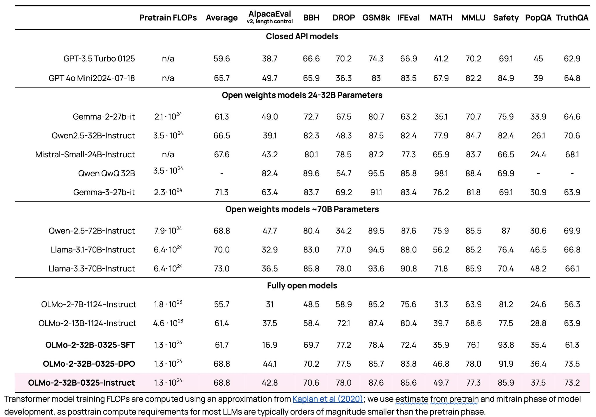
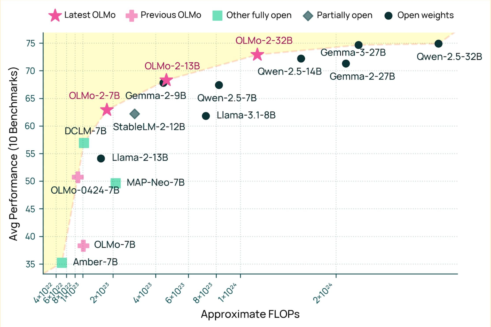
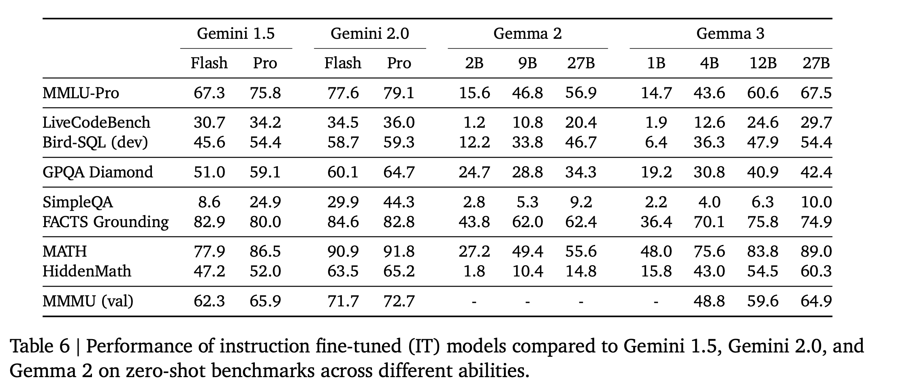
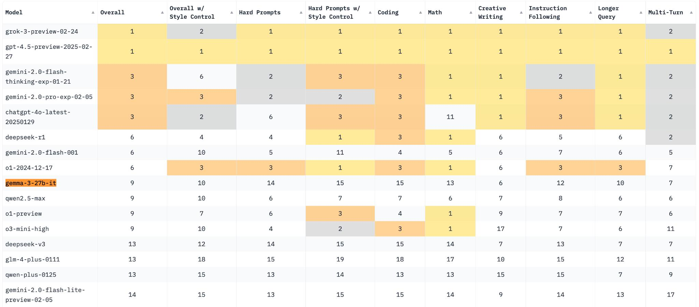
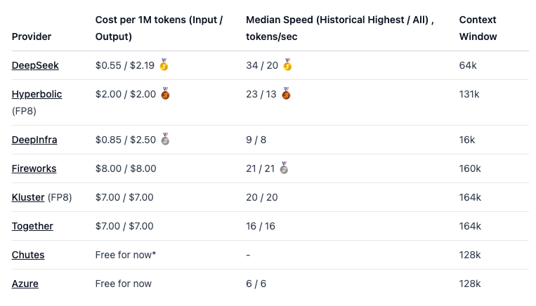

Ever since the release of the original ChatGPT, much has been said about making a truly open-source version of it --- with data, code, weights, etc., all available. Open-source versions increase transparency, access, long-term progress, security research, and lots more. Lots of people have used this claim to bring hype into their projects, but the substance of these releases have been rather shallow (i.e., often focusing on one evaluation).

This milestone was so long coming that I entirely forgot about it as a target.[1](#footnote-1){#footnote-anchor-1 .footnote-anchor component-name="FootnoteAnchorToDOM" target="_self"} Through 2024, and especially before DeepSeek, the impression was that scaling AI capabilities was just too expensive for the smaller players willing to do truly open-source development.

Truly open releases take a lot of effort by making more to release and maintain, open up potential legal risks that preclude types of training data[2](#footnote-2){#footnote-anchor-2 .footnote-anchor component-name="FootnoteAnchorToDOM" target="_self"}, and completely undermine competition. The few organizations doing fully open-source research are non-profits, like Ai2 or Eleuther AI; academics, like LLM360; or companies that benefit from the long-term ecosystem growth, like HuggingFace.

I was poking through the results for our latest model when I realized that we finally did it! We have a fully open-source GPT-4 class model, i.e., it is comparable with OpenAI\'s original release rather than the current version.

Today, we\'re releasing OLMo 2 32B, the biggest model we\'ve trained from scratch yet. Here are the post-training evaluations, where it surpasses GPT-3.5, GPT-4o-mini, Qwen 2.5 32B Instruct, the recent Mistral Small 24B, and comes close to the Qwen and Llama 70B Instruct models.

And this recipe is extremely training efficient. Here's a plot showing the FLOP comparisons to peer base models:

Most of this release isn\'t entirely new. OLMo 2 is the result of lots of small wins on data, architecture, post-training with Tülu 3 recipe and so on --- we just let the GPUs hum for a lot longer. You can learn more about OLMo 2 in my [original release announcement](https://www.interconnects.ai/p/olmo-2-and-building-language-model-training) or in this [podcast with the leads](https://www.interconnects.ai/p/olmo-2-pod).

The new part of this release is a major milestone where any company can pick up our training stack and cook up exactly the model they need at nearly the GPT 4 level. Beating the latest GPT 3.5 and GPT 4o mini models feels like fair game for the claim. This capability will take time to diffuse, but it is a major moment in the arc of [why we do what we do](https://www.interconnects.ai/p/why-i-build-open-language-models). Even without more progress on OLMo, which we obviously will continue this year, this will keep fundamental AI progress outside of the major AI labs going for multiple years. It's an optimistic day for open-source.

------------------------------------------------------------------------

Here are your links to more information on OLMo 32B:

-   [Blog](https://allenai.org/blog/olmo2-32B) with technical details and [demo](https://playground.allenai.org/?model=olmo-2-0325-32b-instruct)

-   Base model: [OLMo-2-0325-32B](https://huggingface.co/allenai/OLMo-2-0325-32B)

-   Instruct model: [OLMo-2-0325-32B-Instruct](https://huggingface.co/allenai/OLMo-2-0325-32B-Instruct) and intermediate SFT, [OLMo-2-0325-32B-SFT](https://huggingface.co/allenai/OLMo-2-0325-32B-SFT), and DPO checkpoints, [OLMo-2-0325-32B-DPO](https://huggingface.co/allenai/OLMo-2-0325-32B-DPO)

-   Pretraining dataset: [OLMo-mix-1124](https://huggingface.co/datasets/allenai/olmo-mix-1124)

-   Mid-training dataset: [Dolmino-Mix-1124](https://huggingface.co/datasets/allenai/dolmino-mix-1124)

-   Post-training datasets: [Tülu 3 SFT Mix](ttps://huggingface.co/datasets/allenai/tulu-3-sft-olmo-2-mixture-0225) (updated), [Preference data for OLMo 2 32B](https://huggingface.co/datasets/allenai/OLMo-2-32B-pref-mix-0325) and [RLVR Mix](https://huggingface.co/datasets/allenai/RLVR-GSM-MATH-IF-Mixed-Constraints)

------------------------------------------------------------------------

## **Gemma 3 as the next point on a steep trend line**

Yesterday, March 12th, Google released the next batch of their flagship open-weight models, Gemma ([report](https://storage.googleapis.com/deepmind-media/gemma/Gemma3Report.pdf), [models](https://huggingface.co/collections/google/gemma-3-release-67c6c6f89c4f76621268bb6d), [flagship model](https://huggingface.co/google/gemma-3-27b-it)). They highlight the following capabilities in their [documentation](https://ai.google.dev/gemma/docs/core):

> -   **[Image and text input](https://ai.google.dev/gemma/docs/core#multimodal-input)**: Multimodal capabilities let you input images and text to understand and analyze visual data. [Start building](https://ai.google.dev/gemma/docs/core/keras_inference)
>
> -   **[128K token context](https://ai.google.dev/gemma/docs/core#128k-context)**: 16x larger input context for analyzing more data and solving more complex problems.
>
> -   **[Wide language support](https://ai.google.dev/gemma/docs/core#multilingual)**: Work in your language or expand your AI application\'s language capabilities with support for over 140 languages. [Start building](https://ai.google.dev/gemma/docs/spoken-language)
>
> -   **[Developer friendly model sizes](https://ai.google.dev/gemma/docs/core#sizes)**: Choose a model size (1B, 4B, 12B, 27B) and precision level that works best for your task and compute resources.

Some technical details of note:

-   In open models, 32B dense models are convenient because they can be finetuned on one node of 8 H100s (slowly). Google\'s sizing at 27B likely is downstream of TPU considerations that don\'t map directly, like how knowledge distillation works at pretraining.

-   The Gemma models continue to be trained extensively with teacher-student **[knowledge distillation](https://arxiv.org/abs/2306.13649) (KD)**. This KD is different than the colloquial definition of distillation in leading AI models. The common use of distillation is training the models on any output of a much stronger model. This is most commonly done in post-training to learn from generated completions of the stronger model.\
    \
    KD is a subset of the general idea of distillation, where the model being trained learns to match the *distribution* of the teacher model. Other labs than DeepMind have mentioned this KD technique, but Google has pushed it far further. This was discussed further in last summer's post on [synthetic data](https://www.interconnects.ai/i/145870222/are-gemini-flash-and-claude-haiku-distilled).

Otherwise, the paper has some interesting information but nothing super groundbreaking. This is par for the course for most technical reports these days.

Onto the evaluations, and therein the impact, of Gemma 3.

The best way to think about this model is a "general chat model" like GPT-4o and Claude 3.7 rather than a reasoning model like R1. The rise of reasoning models has made comparing models tricky because there are multiple evaluation suites that people care about --- broadly characterized as a reasoning suite and an instruct suite. They overlap, but strong capabilities on both is rare.

Gemma 3 27B's performance on some tasks like MATH and Bird-SQL (coding) match the Gemini 1.5 Pro model from just a few months ago! The progress on small, open weight models is simply insane. Small models can perform excellently on narrow tasks like math and some coding, but they lack the depth and world knowledge, as seen in GPQA or SimpleQA above.

Yes, DeepSeek distills are better at smaller sizes on MATH, but not enough people evaluate those distills across all capabilities like ChatBotArena. Having it all in one model is very convenient and is still how most workflows are handled.

Most people are also fairly skeptical of evaluation scores like MATH stated by Gemma, DeepSeek distills, and the like, claiming they don't translate to real world usefulness. This is why the ChatBotArena results were the most striking of the Gemma 3 release. Gemma 3 falls in the top 15 of every category. It beats DeepSeek V3 with its 600B+ total parameters. It is outperformed in niche categories like math or coding by its peer models in the overall ranking, indicating a small level of superficial alignment, but doing this to get into the top 10 of ChatBotArena during this [period of AI with immense competition](https://www.interconnects.ai/p/grok-3-and-an-accelerating-ai-roadmap) is a huge accomplishment.

It is an ever evolving open question on how reliable chat evaluations like ChatBotArena are. These days, with how in vogue RL training methods to maximize MATH evaluations are, the value is higher again. Is it representative of some subset of real-world use, which would indicate that specific capabilities that small models are able to excel at --- math, general chat, etc. --- can translate directly to real value.

This implies that tasks like SimpleQA and GPQA indicate performance on more niche tasks that not many people encounter, but we have a lot to learn as a field here.

With my use of leading models, I find this hard to believe --- switching to something like GPT-4.5 feels like an immediate improvement in chat tasks. My conclusion is that the answer is somewhere in the middle --- small open models can do super well on everyday tasks, but we don't know exactly how to measure it. ChatBotArena and SimpleQA don't tell us exactly what to expect from the models.

The fact that there isn't a cliff in performance with models this small is going to drive substantial business value --- it'll be easier to find exactly the minimum model size needed for your distribution of tasks.

In the specific case of Gemma and most of the leading open weight models right now (with DeepSeek R1 as a wonderful exception), the licenses of models that often restrict downstream use are a brake on open weight model adoption. Without getting too much into the details, they expose companies looking to use the models to some amount of legal risk and add terms and conditions to finetuned models.

Largely, until feedback loops and use cases for open models are established, teams releasing these models don't have strong cases other than future potential growth to counter the safe option that comes from legal teams' recommendations. I hope that the evolution in the adoption of open weight models for valuable applications applies pressure to make licensing less of a headache.

## **The state of the open-closed model gap**

3 of the top 15 models on ChatBotArena are open weights. In a world where frontier labs have many minor model versions crowding the leaderboard, this is an incredible platform for accelerating progress in open model adoption. Even just the gap from Gemma 3 to Google\'s flagship Gemini models is very small! The entire AI market is the most dynamic and competitive it has been in some time --- maybe ever.

When it comes to "truly open," i.e. actually open-source models, the gap between closed models has remained somewhat consistent --- I estimate it as about 18 months behind closed labs. With open models generally on the upswing, open-source access to code, data, etc. is likely to come with it. The likes of Llama, DeepSeek, etc. are some of the most important pieces in the complete open ecosystem, and approaches like Ai2's would struggle without them.

Related to this, in the [coverage of DeepSeek R1](https://www.interconnects.ai/p/deepseek-r1-recipe-for-o1), I noted:

> This points to the first time since Stable Diffusion's release that the most relevant and discussed AI model is released with a very friendly license. Looking back at the journey "[open-source](https://www.interconnects.ai/t/open-source)" AI has been on over the last 2.5 years, this is a surprising moment in time marked in the history books.

A month later, this is still the case.

To understand the progress of the open-closed model gap, with an oversimplification, there are two simple ways that models tend to get better:

1.  Scaling up model size, and

2.  Various data, architecture, and algorithm improvements that make an equivalent performing model smaller.

Progress on truly open-source models has always relied on the second of these due to the relatively smaller budgets of players in the open-source space. By being forced to focus on efficiency rather than scaling, it has often seemed like truly open source models are falling behind by more than they really likely were. With similar potential to scale, the gap between truly open-source and closed would be quite small on standard academic benchmarks which \"raw model potential\" is usually evaluated on.

When models like Llama 3.1 405B, DeepSeek V3 and R1, etc. come out, the open weight models scaled up have been at the frontier. With more resources for truly open-source training I don\'t see many reasons why that wouldn\'t be the case for models like OLMo too. In some ways, the biggest moat to training is just resource access. For example, DeepSeek is reported to have at least 10x more compute than the likes of Ai2.

This interpretation of the gap is more tractable than other critiques I\'ve imposed on the open-source AI community in the past, [such as the need for better preference data / RLHF pipelines](https://www.interconnects.ai/p/open-gpt4-limitations).

Comparing Gemma 3 27B to OLMo 32B, the pretraining evaluations for both are super similar, but Gemma 3 scores are way better after post-training. The ceiling on post-training expectations has been shifting extremely fast among open models. Largely, open recipes are motivated by matching existence proofs like Gemma 3 or DeepSeek R1. Throughout 2025, expect open post-training resources to get even better again, motivated by the need for better performance and more detailed workflows on reasoning training.

All of these subtleties are paving the ground for a better platform for building value with open models. The gap from closed models to open counterparts being its smallest means the opportunity is the best it's ever been.

The race for inference providers to host models like DeepSeek R1 is a great platform for progress and example. Even if the why of open models starts as primarily being good for marketing and recruiting, this can trickle down into bigger benefits.

Open weight models are likely to be offered for inference at far lower margins in the near term, due to the massive competition in the inference space, driving the prices even lower for those looking for ways to adopt them. Here's an [example](https://prompt.16x.engineer/blog/deepseek-r1-cost-pricing-speed) of some of the leading platforms offering R1 inference:

This sort of everywhere-inference for an open model is something that has only happened in the past for Llama models.

Yes, I know APIs are orthogonal to the benefits I just listed, but they're the way people become familiar and interested in the models. APIs help people check if the model can serve their purpose, and then if it does, they can spin up a more complex workflow.

## **"Why open" is more important than "what is open"**

The biggest stories in open-source AI in 2024 often felt like bickering about definitions. I wrote [a lot](https://www.interconnects.ai/p/defining-open-source-ai) [of articles](https://www.interconnects.ai/p/flavors-of-open-source-ai) [about definitions](https://www.interconnects.ai/p/an-open-source-llm). Llama 3 was pretty much all we had to get excited about. At the end of the day, even with how much I think it would be better with more information on the whole stack of AI development, open-source is largely going to be defined by community norms. For now, Llama weights have been that norm rather than other definitions.

By comparison, 2025 feels poised to be about *actually building open AI*. We have had surprising, impactful, and exciting releases and it's only March. We know Meta is looking to get back into the conversation with Llama 4 in April at LlamaCon. We have our open-source ChatGPT. We'll have more we can't predict.

Crucially, on top of the gap being smaller, all of these open models are crossing meaningful boundaries in performance. When model capabilities made the leap to GPT 4 class models, tons more applications were possible. Now, we have GPT 4 class *small* models that can be deployed in privacy-conscious ways. There's been a huge demand for this, and the ecosystem is slowly building the tools to do so. Yes, closed AI will continue to march forward, but open solutions need to prove their own independent feasibility.[3](#footnote-3){#footnote-anchor-3 .footnote-anchor component-name="FootnoteAnchorToDOM" target="_self"}

In the long march of progress, open-source AI feels far closer to an inflection point of proving out the hypothetical benefits we have focused on for a few years. Transparency, privacy, better performance, etc. could actually all be happening this year.

------------------------------------------------------------------------

*For the backlog of content I\'ve written on open-source AI, click [here](https://www.interconnects.ai/t/open-source).* *Thanks to Vikram Sreekanti, Ross Taylor, and Xeophon for feedback that helped shape this post*.

:::: {.footnote component-name="FootnoteToDOM"}
[1](#footnote-anchor-1){#footnote-1 .footnote-number contenteditable="false" target="_self"}

::: footnote-content
If you look closely at the numbers, our 13B model actually crossed in in the fall!
:::
::::

:::: {.footnote component-name="FootnoteToDOM"}
[2](#footnote-anchor-2){#footnote-2 .footnote-number contenteditable="false" target="_self"}

::: footnote-content
This is a reason I hear multiple times as to why frontier labs cannot share their data. The model performance would have to go down or legal risk would be too high.
:::
::::

:::: {.footnote component-name="FootnoteToDOM"}
[3](#footnote-anchor-3){#footnote-3 .footnote-number contenteditable="false" target="_self"}

::: footnote-content
Whether or not it is a reasonable worry, corporate IT departments definitely worry about the best models being Chinese. Having a diversity of models is important to reducing friction to adoption.
:::
::::
