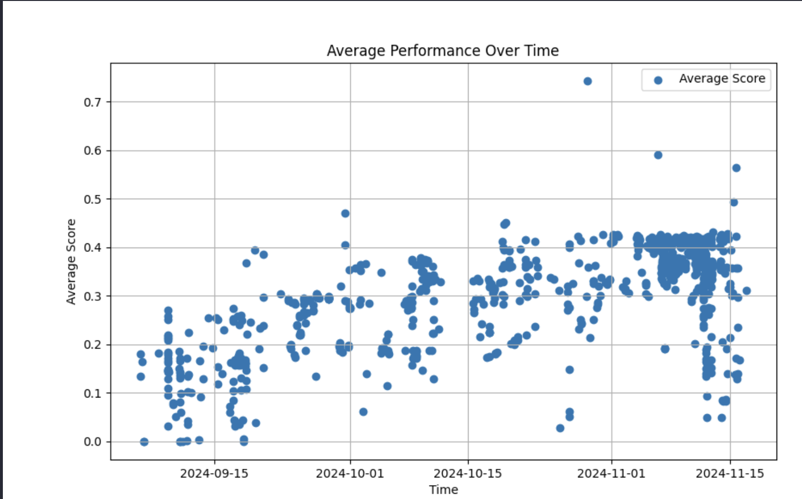

It is a closely guarded secret how the leading AI laboratories structure their training teams. As with other technology companies, the saying "you ship your org chart" still applies to training AI models. Looking at these organizational structures will reveal where research can be scaled up, the upper limits of size, and potentially even who uses the most compute.

## How modeling teams do and do not work

A crucial area I'm working on (reach out if you would like to share more off the record) is how to scale these lessons to bigger, more complex teams. The core factor differentiating teams that succeed from those that do not is maintaining these principles while scaling team size.

Big teams inherently lead to politics and protecting territory, while language models need information to flow from the bottom to the top on what capabilities are possible. Regardless of the possibilities, leadership can shift resources to prioritize certain areas, but all of the signals on whether this is working come from those training models. If senior directors mandate results under them before unblocking model releases, the entire system will crumble.

Seeing this potential end state --- without naming specific companies --- it is obviously desirable to avoid, but anticipating and avoiding it during rapid growth takes substantial intentionality.

Within training, the planning for pretraining and post-training traditionally could be managed differently. Pretraining has fewer, bigger runs so improvements must be slotted in for those few annual runs. Post-training improvements can largely be continuous. These operational differences, on top of the obvious cost differences, also make [post-training far more approachable for non-frontier labs](https://www.youtube.com/watch?v=grpc-Wyy-Zg&t=196s) (though still extremely hard).

Both teams have bottlenecks where improvements must be integrated. Scaling the pretraining bottlenecks --- i.e. those making the final architecture and data decisions --- seems impossible, but scaling teams around data acquisition, evaluation creation, and integrations is very easy. A large proportion of product decisions for AI models can be made irrespective of modeling decisions. Scaling these is also easy.

Effectively, organizations that fail to produce breakthrough models can do tons of low-level meaningful research, but adding organizational complexity dramatically increases the risk of "not being able to put it together."

Another failure mode of top-down development, rather than bottom-up information, is that leaders can mandate the team to try to follow a technical decision that is not supported by experiments. Managing so-called "[yolo runs](https://www.youtube.com/watch?v=ytpOt4AEv8M&pp=ygUNbGV4IHlvbG8gcnVucw%3D%3D)" well is a coveted skill, but one that is held close to the models. Of course, so many techniques work still that mandates don't have a 100% failure rate, but it sets a bad precedent.

Given the pace of releases and progress, it appears that Anthropic, OpenAI, DeepSeek[1](#footnote-1){#footnote-anchor-1 .footnote-anchor component-name="FootnoteAnchorToDOM" target="_self"}, Google Gemini, and some others have positive forms of this bottom-up culture with extremely skilled technical leads managing complexity. Google took the longest to get it right with re-orgs, muddled launches (remember Bard), and so on. With the time lag between Meta's releases, it still seems like they're trying to find this culture to maximally express their wonderful talent and resources.

With all of this and off-the-record conversations with leadership at frontier AI labs, I have compiled a list of recommendations for managing AI training teams. This is focused on **modeling research** and does not encompass the majority of headcount in the leading AI companies.

### **Recommendations**

The most effective teams who regularly ship leading models follow many of these principles:

1.  The **core language modeling teams remain small** as AI companies become larger.

2.  For **smaller teams, you can still have everyone in one room**, take advantage of this. For me personally, I think this is where remote teams can be **detrimental**. In-person works for this, at least when best practices are evolving so fast.

3.  **Avoid information siloes**. This goes for both teams and individuals. People need to quickly be able to build on the successes of those around them and clear communication during consistent rapid progress is tricky.[2](#footnote-2){#footnote-anchor-2 .footnote-anchor component-name="FootnoteAnchorToDOM" target="_self"}

4.  For **larger teams, you can scale teams only where co-design isn't needed**. Where interactions aren't needed there can be organizational distance.

    1.  An example would be one team focusing on post-training algorithms & approaches while other teams handle model character, model variants for API, etc (specifications and iterations).

    2.  Another example is that reasoning teams are often separate from other pieces of post-training. This applies only to players that have scaled.

5.  **Language model deployment is very much like early startup software**. You don't know exactly what users want nor what you can deliver. Embrace the uncertainty and learn quickly.

6.  **Do not overly try to separate engineering teams from training**. Engineering needs to build tools for the generation +1 model and cannot do this without talking to researchers.

7.  **Evergreen research is separate from the language modeling teams** itself, but still sits within "research". Otherwise, it will be impossible to prioritize truly long-term ideas. Long-term goals are fragile and need nurturing. Language modeling is about the next 1, or maybe 2, models.

8.  A lot of **the sexy work is not that helpful and a lot of the useful work isn\'t sexy**. Data is the prime example as the often most impactful type of work.

9.  **Expect failed training runs** and do not overreact to them along the way.

### **Failure modes**

High-priority projects can fail if you...

1.  Try to ship too many models for each capability improvement. Instead, stick to a set schedule of model training. Have fewer models that are more capable.

2.  Try to force contributions from individual teammates into the final product. Do not sacrifice performance for personalities in search of "a contribution".

3.  Let in teams that try and territorially force their way into contributing to the big company goal.

4.  Scale the training organization too much. Having too many people "doing stuff" and adding noise to the organization detracts from high-level direction and focus on the execution of specific goals.\
    (This can also relate to 1. and be trying to do too much in one model).

5.  Letting politics grow, taking many forms, and causing intertwined issues. Do not lose the sense of results being the #1 driving factor of decisions. Bad decisions here compound.

6.  Over-indexing on a single model evaluation will hamper (or flat out block) real progress in other areas.

------------------------------------------------------------------------

Before the rest of the post, expanding on the topics above, you may be interested in previous articles on this topic.

### Related writing

For more reading on how language modeling teams work, see some of my other writing here, on team structure, and...

::: {.digest-post-embed attrs="{\"nodeId\":\"a166b3ac-2250-4cf9-8e1f-4b4122bf8eaa\",\"caption\":\"Last week I appeared on the Cognitive Revolution Podcast to discuss the state of post-training LLMs, Tulu 3, and how to manage large training projects like these.\",\"cta\":null,\"showBylines\":true,\"size\":\"sm\",\"isEditorNode\":true,\"title\":\"OLMo 2 and building effective teams for training language models\",\"publishedBylines\":[{\"id\":10472909,\"name\":\"Nathan Lambert\",\"bio\":\"ML researcher making sense of AI research, products, and the uncertain technological future. PhD from Berkeley AI. Experience at Meta, DeepMind, HuggingFace.\",\"photo_url\":\"https://substackcdn.com/image/fetch/f_auto,q_auto:good,fl_progressive:steep/https%3A%2F%2Fsubstack-post-media.s3.amazonaws.com%2Fpublic%2Fimages%2F8fedcdfb-e137-4f6a-9089-a46add6c6242_500x500.jpeg\",\"is_guest\":false,\"bestseller_tier\":100}],\"post_date\":\"2024-11-26T20:44:18.667Z\",\"cover_image\":\"https://substackcdn.com/image/fetch/f_auto,q_auto:good,fl_progressive:steep/https%3A%2F%2Fsubstack-post-media.s3.amazonaws.com%2Fpublic%2Fimages%2F7a61e14d-61da-4136-aa01-0530367d98e8_1434x976.png\",\"cover_image_alt\":null,\"canonical_url\":\"https://www.interconnects.ai/p/olmo-2-and-building-language-model-training\",\"section_name\":null,\"video_upload_id\":null,\"id\":152164615,\"type\":\"newsletter\",\"reaction_count\":32,\"comment_count\":0,\"publication_name\":\"Interconnects\",\"publication_logo_url\":\"https://substackcdn.com/image/fetch/f_auto,q_auto:good,fl_progressive:steep/https%3A%2F%2Fsubstack-post-media.s3.amazonaws.com%2Fpublic%2Fimages%2Fe70f9dbf-4fe6-404c-b6bb-1831d1b7ed0b_590x590.png\",\"belowTheFold\":true}"}
:::

....managing risk.

::: {.digest-post-embed attrs="{\"nodeId\":\"72d3e427-0c04-45e4-93bc-3f5f9c15080a\",\"caption\":\"Today we’re releasing our best open-source language model to date, OLMoE, a Mixture-of-Experts (MoE) model with 1.3 billion active parameters and 6.9 billion total parameters. It was trained on 5 trillion tokens, largely composed of the DCLM baseline mix\",\"cta\":null,\"showBylines\":true,\"size\":\"sm\",\"isEditorNode\":true,\"title\":\"OLMoE and the hidden simplicity in training better foundation models\",\"publishedBylines\":[{\"id\":10472909,\"name\":\"Nathan Lambert\",\"bio\":\"ML researcher making sense of AI research, products, and the uncertain technological future. PhD from Berkeley AI. Experience at Meta, DeepMind, HuggingFace.\",\"photo_url\":\"https://substackcdn.com/image/fetch/f_auto,q_auto:good,fl_progressive:steep/https%3A%2F%2Fsubstack-post-media.s3.amazonaws.com%2Fpublic%2Fimages%2F8fedcdfb-e137-4f6a-9089-a46add6c6242_500x500.jpeg\",\"is_guest\":false,\"bestseller_tier\":100}],\"post_date\":\"2024-09-04T12:01:18.995Z\",\"cover_image\":\"https://substack-post-media.s3.amazonaws.com/public/images/891187d8-6630-4353-a315-995ed9880a91_1844x1080.png\",\"cover_image_alt\":null,\"canonical_url\":\"https://www.interconnects.ai/p/olmoe-and-building-better-llms\",\"section_name\":null,\"video_upload_id\":null,\"id\":148458085,\"type\":\"newsletter\",\"reaction_count\":23,\"comment_count\":0,\"publication_name\":\"Interconnects\",\"publication_logo_url\":\"https://substackcdn.com/image/fetch/f_auto,q_auto:good,fl_progressive:steep/https%3A%2F%2Fsubstack-post-media.s3.amazonaws.com%2Fpublic%2Fimages%2Fe70f9dbf-4fe6-404c-b6bb-1831d1b7ed0b_590x590.png\",\"belowTheFold\":true}"}
:::

------------------------------------------------------------------------

## An example of how mid-sized training projects work

I recently got a list of questions on how training for [Tülu 3](https://www.interconnects.ai/p/tulu-3) operated (which is a post-training analog to OLMo really). I figured I would share these and they serve as a foundation for me gathering useful information from friends on frontier labs on how representative it is.

With reasoning models, most of this translates directly. Infrastructure is becoming more important because generating long sequences is particularly memory intensive (and can expose issues in open-source tools for inference), but when the time comes to make a state-of-the-art fully open reasoning recipe, the lessons learned here will apply directly.

### 1. How long does a large post-training project take?

Tülu 3 was the focus of our post-training team from mid-July until its release on November 21st, 2024. We were building on our previous recipes, in [Tülu 2](https://arxiv.org/abs/2311.10702)/[2.5](https://arxiv.org/abs/2406.09279), so not very much of this was catching up on internal know-how, but rather integrating new external resources. If a team like this was working continuously all year on the same focus it would've taken approximately one month less to achieve these results. Bootup takes substantial time, as does release management.

### 2. How do you choose the right personnel for a moderately sized training project?

A project like Tülu 3 or any other effort to push the frontier of AI *in a popular area* normally takes a moderately sized team. The smaller the niche, the smaller the team you need. The team at Ai2 is researcher-heavy relative to engineer-heavy among the 20+ authors. If prioritizing only performance on *known* techniques, the ratio of engineers can be far higher. Pushing the frontier takes 10x the resources as repeating extensively documented work.

In the case of Tülu 3, where most of the techniques are *not known* the proportion of researchers is obviously higher. This, though, for companies trying to scope who to hire for modeling teams is not a trivial problem. First, one must scope the level of uncertainty in the domain of interest and then hire around it. Applying Tülu style approaches could definitely be done with a team of 2-4 focused engineers.

### 3. What model sizes are used for iteration? How do results scale?

A core principle of modeling research is to iterate at the smallest model that provides a reliable signal. This is the entire principle behind scaling laws as a de-risking tool. In post-training, compute costs are substantially lower so the models used actually can be bigger. In this case, given a project designed around the Llama 3.1 base models, \~80% or more of experiments were at the 8B scale (normally 8 or 32 H100s, finishing in \<1 day), \~19% at the 70B scale (normally 32 or 64 H100s, finishing in 2-3 days), and only a handful of runs at the 405B scale that were using 256 GPUs each for multiple days.[3](#footnote-3){#footnote-anchor-3 .footnote-anchor component-name="FootnoteAnchorToDOM" target="_self"} In overall GPU utilization, the project utilized 100-600 GPUs concurrently for the entire 4-5 month span.

These days, results tend to transfer extremely well when scaling. Bigger models may need less data, especially less general data, and a gentler optimization (lower learning rate usually), but transfer hasn't been a challenge. Changing base models is harder than scaling with post-training techniques.

### 4. How many experiments are actually run?

The Tülu project evaluated about 1000 checkpoints in our process. This feels about right for a major post-training process. Some of these are intermediate or competitor models, but most of them, 100s, are experimental training runs. The model scores can be plotted in a time sequence with the metadata we collected (credit [Hamish Ivison](https://ivison.id.au/) for the plot). When you squint, it is largely a logarithmic curve with faster gains at the beginning and leveling off at the end. Of course, you can also see the flurry of models trained right in the last few weeks.[4](#footnote-4){#footnote-anchor-4 .footnote-anchor component-name="FootnoteAnchorToDOM" target="_self"}

### 5. What is the biggest bottleneck on progress?

All of these projects are bottlenecked by compute available. Making systems more efficient is a compute multiplier, but if the starting point in the number of GPUs is too low, it won't matter. There's often potential to accelerate projects by adding more people to explorations, whether it's training approaches like process reward models (PRMs) or data curation, but scaling management and integration of data across numerous evaluations can be tricky. Best practices for models with 100s of target evaluations (as done in frontier laboratories) rather than the \~10 we used, are far from established.

The second bottleneck would be personnel willing to constantly grind on new data experiments. Focus on data almost always pays off fairly quickly.

### 6. What would I need to get a serious post-training effort off the ground from a cold start?

Finetuning has such a large gradation that impact can be made with almost any team size. To do truly excellent work takes mostly patience and proportional resources. Getting the model exactly right takes retraining many times even after you hit your initial benchmarking goals.

For companies focusing on local models, a few nodes of H100s (\~100 GPUs) could go a very long way. For companies trying to make truly state-of-the-art models above the 7B scale, trying to do so with \<500 H100 GPUs is likely not worth it. It is very easy to be stuck in the middle and compute is still the largest determining factor of success.

These numbers will come down as best practices of distillation from strong models are established, but this knowledge is far from known. If you want to invest in training you need to do enough to move the frontier, or else you will be inevitably falling behind and it would be better to ride on other's coattails.

### 7. What is the hardest part of these projects? Where do you actually spend time?

Training projects take a lot of time and a lot of focus to detail. Teams need extreme isolation from other company goals to focus on their one goal of training. The hardest part is often this --- having all the members of the training team focus on one single output for sustained periods. Tracking down recent developments, small experiments with training algorithms, curating data (likely most of the time in hours as babysitting GPUs is largely an idle activity), etc. are all bread and butter of solid engineering talent. Success is downstream of good decision-making by tech leads and managers while getting many small shots on goal.

In the case of projects like Tülu 3 the reason we don't immediately transition to Tülu 4 is that people have other interests. Companies that directly align training with their bottom line don't need to do this.

------------------------------------------------------------------------

*Thanks to Nicole Fitzgerald, Finbarr Timbers (Midjourney was not one of the companies I studied), and others unnamed at leading AI laboratories for comments or input that helped with this post.*

:::: {.footnote component-name="FootnoteToDOM"}
[1](#footnote-anchor-1){#footnote-1 .footnote-number contenteditable="false" target="_self"}

::: footnote-content
Some lessons on DeepSeek's culture [here](https://www.chinatalk.media/p/deepseek-ceo-interview-with-chinas) and [here](https://interconnect.substack.com/p/deepseeks-three-idiosyncratic-advantages).
:::
::::

:::: {.footnote component-name="FootnoteToDOM"}
[2](#footnote-anchor-2){#footnote-2 .footnote-number contenteditable="false" target="_self"}

::: footnote-content
In many ways this is inevitable with the best employees holding so much know how, but mitigating it is worthwhile.
:::
::::

:::: {.footnote component-name="FootnoteToDOM"}
[3](#footnote-anchor-3){#footnote-3 .footnote-number contenteditable="false" target="_self"}

::: footnote-content
Numbers here are for SFT runs with \~1million prompts. With better throughput these can be much faster. The rule of thumb is that they're all pretty fast and lightweight.
:::
::::

:::: {.footnote component-name="FootnoteToDOM"}
[4](#footnote-anchor-4){#footnote-4 .footnote-number contenteditable="false" target="_self"}

::: footnote-content
Some of the saturation has to do with evaluations chosen, other than just progress, but any way of choosing metrics aside, the "vibe" of the project matches the chart.
:::
::::
