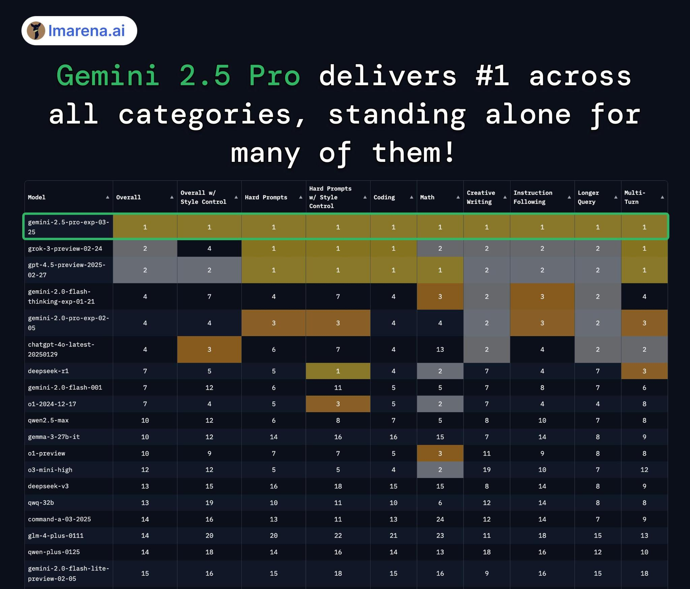
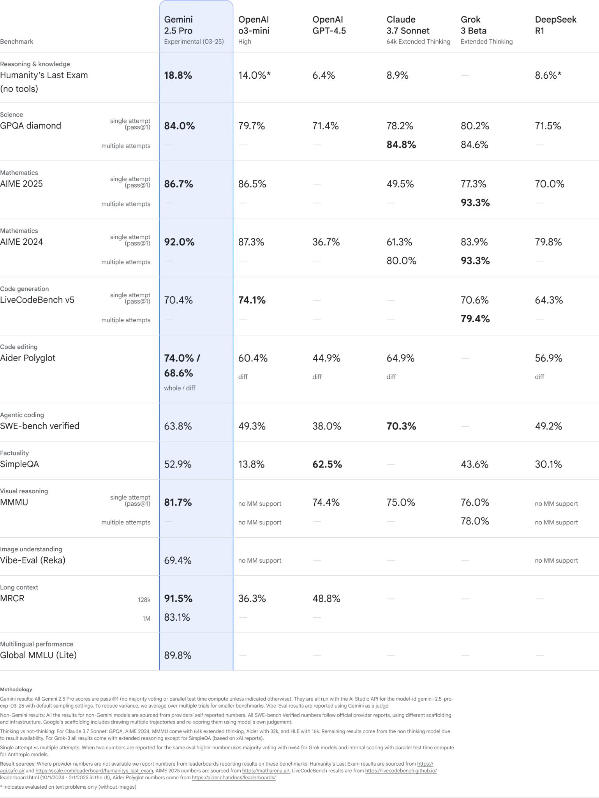
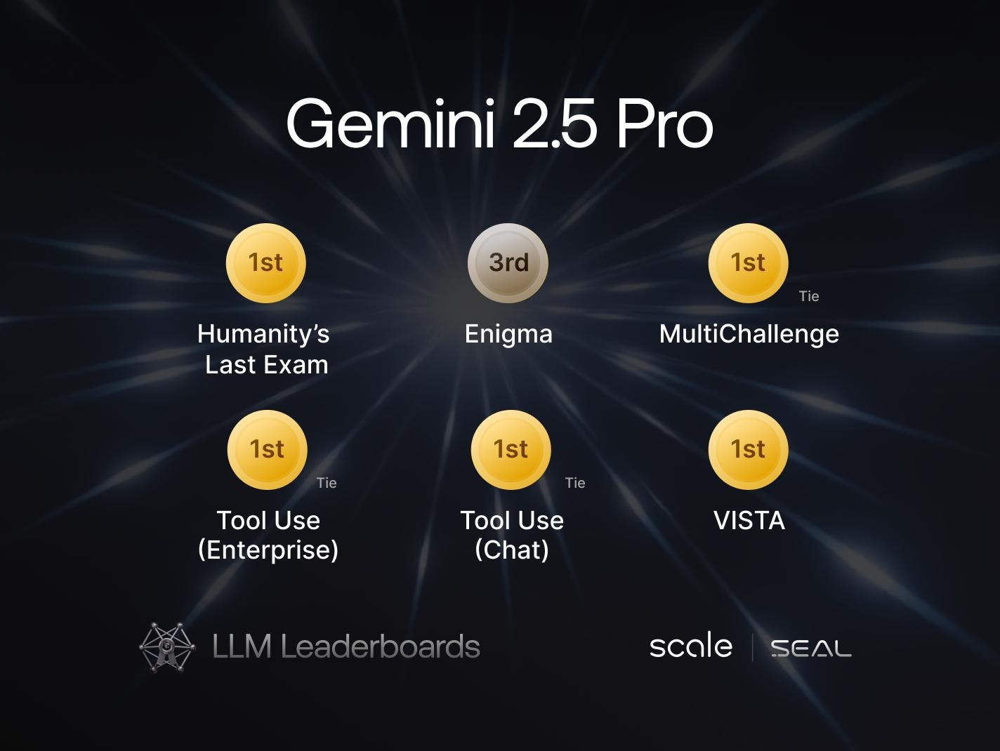
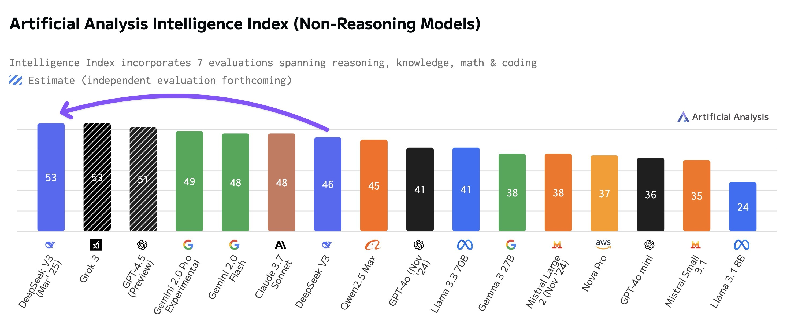
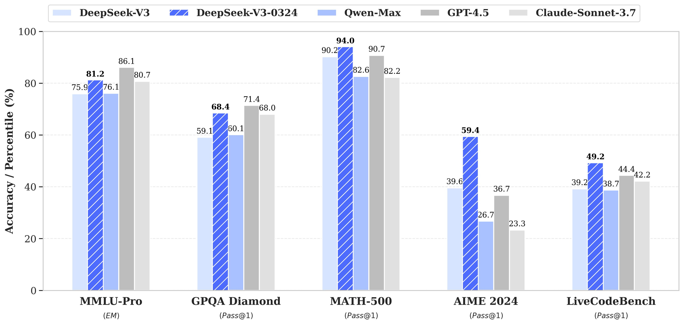
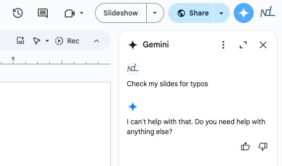

Google, with its immense infrastructure and talent, has been the safe bet for the question of "Who will have the best models in a few years?" Google took a long time to get here, overcoming Bard's launch and some integration headaches, and yet the model they launched today, [Gemini 2.5 Pro](https://blog.google/technology/google-deepmind/gemini-model-thinking-updates-march-2025/) feels like the biggest jump in evaluation scores we've seen in quite some time.

It's often hard to communicate how the models we are getting these days are actually better. To be informed, you need to take a balanced view across many benchmarks, look roughly at the percentage by which the model is clearly state-of-the-art, and of course, try the model yourself.

To summarize, while more evaluations are rolling in, Gemini 2.5 Pro is **40+ Elo points clear on the popular ChatBotArena / LM Arena benchmark** (more [here](https://x.com/lmarena_ai/status/1904581128746656099)). Normally, when a model launches and claims the top spot, it's *barely* ahead. In fact, this is the [second biggest jump of the top model in LMSYS history](https://x.com/OriolVinyalsML/status/1904604994453528630), only behind the GPT-4 Turbo overtaking Claude 1. GPT-4 Turbo is when models were not really trained for the benchmark, so progress was much faster.

The blog post highlights **insane scores on the benchmarks used to evaluate the leading reasoning models.** One to note here is the score of 18.8 on Humanity's Last Exam without search or tools, which was one of the evaluations I highlighted as impressive with [the launch of OpenAI's Deep Research](https://www.interconnects.ai/p/deep-research-information-vs-insight-in-science), which compiles knowledge from the web!

**Gemini 2.5 is topping other independent evaluations** such as the Scale Leaderboard (which is underrated or at least low on visibility, more [here](https://x.com/alexandr_wang/status/1904590438469951873)).[1](#footnote-1){#footnote-anchor-1 .footnote-anchor component-name="FootnoteAnchorToDOM" target="_self"} More independent evaluations are going to trickle in, but all of the ones I've seen are extremely positive.

**Gemini still is also the model with the longest context length** **and with very strong multimodal performance** (including audio). There are plenty of small wins that Google has like this that are hard to see when skimming the benchmarks above.

So, how did Google do it? As usual, the blog post doesn't have a ton of technical details. Google says:

> we\'ve achieved a new level of performance by combining a significantly enhanced base model with improved post-training.

Until we have API pricing, it'll be harder to make even informed guesses about whether the model is huge like GPT-4.5. As for understanding how Gemini models will behave, Google shares:

> Going forward, **we're building these thinking capabilities directly into all of our models**, so they can handle more complex problems and support even more capable, context-aware agents.

This idea of directly integrating reasoning into all of their models is something [Sam Altman teased for GPT-5](https://x.com/sama/status/1889755723078443244?lang=en). This trend has serious trade-offs on user experience that we will get to later, but it is crucial for people to keep up with as the discourse today is often centered on \"[the best non-reasoning model](https://substack.com/@exponentialview/note/c-103269209?r=68gy5&utm_medium=ios&utm_source=notes-share-action)" or "the best reasoning model."

This came up recently with DeepSeek's new V3 model.

[DeepSeek\'s new model (0324)](https://huggingface.co/deepseek-ai/DeepSeek-V3-0324) is a major update in performance and license. The MIT license will make it hugely impactful for research and open building. Though many are ending up confused about whether it is a \"reasoning\" model. The model is contrasted to their R1 model, which is an only-reasoning model (like o1).

Reasoning models are on a spectrum now, and it\'s not just yes or no. GPT 4.5 is a good example of what a model with pretty much no reasoning looks like today.

Compared to other models in the industry, like Claude 3.7 and Grok 3 with reasoning toggles, the new DeepSeek V3 is definitely in this class of \"hybrid reasoners\" where models are still trained extensively with RL on verifiable domains (or distilled directly from another reasoning model), but other parts of the post-training process come first and hold more weight than the RL heavy reasoning-only models.

This is all to say that when people say that \"DeepSeek V3 0324 is the best non-reasoner model,\" that doesn\'t really make sense. The original V3 had very light post-training, so it wasn\'t really on the reasoning model spectrum.

Now, things are complicated. It\'ll be like this for a while!

Gemini 2.5 Pro is quite simple. It is very much a reasoning model, at least in how it is offered to users in Gemini Advanced and AI studio --- every query has reasoning before an answer. It is fairly conclusive now that using this extended reasoning can boost performance across many domains, but it's not clear how to best trade off cost and speed with varying amounts of reasoning.

Gemini 2.5 in its current offering is a brute force approach --- a big, very smart model that is tuned to use a lot of reasoning tokens --- and it's good for the trajectory of the industry that it paid off with such high performance.

### The state of the AI industry

With launches from [DeepSeek](https://www.interconnects.ai/p/deepseek-r1-recipe-for-o1), [GPT-4.5 from OpenAI](https://www.interconnects.ai/p/gpt-45-not-a-frontier-model), [Claude 3.7 from Anthropic](https://www.interconnects.ai/p/claude-3-7-thonks), [Grok 3 from xAI](https://www.interconnects.ai/p/grok-3-and-an-accelerating-ai-roadmap), and now Gemini 2.5 Pro, this has been a wild spring for progress in AI models. The major AI laboratories have all delivered super impressive performance --- this post feels like the ribbon that ties all of them together.

The one player seriously missing this spring is Meta with their Llama models. They've fallen into the trap where the longer you go between models, the harder it gets to release them because expectations get higher. I hope Llama 4 succeeds because they're a large part of the open community, but it is a warning to AI laboratories on how to manage deliverables.

With the major progress that AI labs are making, it feels like the answer for who will have the best model is now who can drop the hot potato of a cutting-edge model into the real world the fastest.

The common interpretation of events is that models are commoditizing, but that is an incomplete story. The value in the ecosystem is *poised to accrue* to the sites with users. Some established ones in AI are ChatGPT, Perplexity, Cursor, etc. This may not always be the case is uses for AI evolve.

What we're seeing with the newest models is that the pace of progress is staying high in many areas (i.e. more than just ChatBotArena). All sorts of evaluations, from niche information to hard mathematics to software development, are getting new leading models every few weeks.

The more often state-of-the-art models are released in a fixed time window, the more confident you can be in the pace of progress continuing. These labs are all racing up similar trees, but it's only possible for so much competition to exist when progress isn't super hard to find. The ceiling on performance is rising and the potential value underneath it that we haven't unlocked is continuing to balloon.

### Google AI's second chance

This quote has been going around after [Ben Thompson interviewed OpenAI CEO Sam Altman](https://stratechery.com/2025/an-interview-with-openai-ceo-sam-altman-about-building-a-consumer-tech-company/) on his plans for OpenAI:

> **Ben Thompson:** What's going to be more valuable in five years? A 1-billion daily active user destination site that doesn't have to do customer acquisition, or the state-of-the-art model?
>
> **Sam Altman:** The 1-billion user site I think.

A world where user-facing websites are the most valuable part of AI is a world where AI is less of a platform for doing things and more of a tool for complementing existing habits. AI progress is as high as it ever has been, and the focus of that is on moving from benchmarks towards turning them into agents and tools.

Google's biggest opportunity is being the one player that has it all --- leading models, infrastructure, and a cloud offering to make it the default platform for building value with AI. They have users to retain with Google.com, which they are obviously trying to do, but the rest of their efforts should be on being an AI platform.

With this release, I spent time trying to use Google's Gemini Advanced offerings like I use ChatGPT and Claude. These use cases were immediately confusing. It didn't feel like Chat is at all the right way to evaluate this new Gemini 2.5 model. It's perfectly capable, but without a depth of personality it feels lost relative to the fun GPT-4.5 or the ever quirky Claude. I'm going to keep daily driving Gemini for the next few weeks and I hope to find a more natural rhythm.

And why am I paying for Gemini Advanced? Google is the company known for giving things away for free and at scale. If Google isn't committed to figuring out advertisements for its chat products, then it'll never meaningfully shift the revenue. Breaking through the moat of ChatGPT with anything other than better models at a free plan is next to impossible at this point. The disruption and new habits have already formed.

Many of my experiences with Gemini 2.5 Pro, other than lacking the distinctive character of GPT 4.5 and Claude 3+, where Gemini feels sort of bland, have to do with the form factor of forcing reasoning into every model. Even for basic queries the extensive reasoning of Gemini 2.5 Pro makes the time to first token on the order of seconds[2](#footnote-2){#footnote-anchor-2 .footnote-anchor component-name="FootnoteAnchorToDOM" target="_self"}.

Normal consumers don't benefit from the improvements with reasoning that are accompanied by such a decrease in speed. For agents doing substantial work in the background, a long time to first token or a bland personality don't matter!

Reasoning heavily on every query is a major quality-of-life drain for chat and reopens the same discussions on [reasoning models that balance when they should reason](https://www.interconnects.ai/p/where-inference-time-scaling-pushes). Claude, Grok, DeepSeek, and OpenAI all have selectors for toggling reasoning on or off. This should be the default until models are better.

Gemini should not be focusing on competing with ChatGPT in the same business. That's a losing battle and arguably not even the biggest possible final market --- subscriptions never have scaled to be the core of the world's largest companies.

Where Gemini Advanced (at gemini.google.com) feels like a ChatGPT clone, AI Studio (at ai.dev) feels like the onboarding point for developers and customers using their platform. [Logan](https://x.com/officiallogank?lang=en) and others have made big progress softening the barrier for people jumping from OpenAI and Anthropic to Google. The Gemma 3 open weight models are absolutely incredible. These leads are far more valuable than Gemini Advanced subscribers.

Google should be a platform for others to build AI and use AI to make their offerings better. Google has had success with its AI overviews and [continues to build on that](https://blog.google/products/search/ai-mode-search/). At the same time, their offerings for using Gemini in products have [pretty much failed completely](https://x.com/natolambert/status/1897824828268187712/photo/1).

There are two clear avenues where Google can use Gemini to deliver business value:

1.  **Gemini for product:** Enhancing existing products like Docs, Sheets, YouTube, Android, Assistant, etc. --- i.e., taking the above and making it actually work. The Gemini product offerings across the Google suite are pretty much still in their Bard stage. The same focus and execution from training needs to extend into Gemini products and Google Cloud for the next stage of this arc. Extreme value is ready to be captured by the models even if the models don't continue to improve. The urgency on products at this point very well should be higher than the pressure to train better models.

2.  **Google Cloud**: Offering fast and cheap inference of Gemini in the form factor developers need. Google Cloud, being integrated from hardware in TPUs to model can often provide the best models now at the lowest prices. Selling Gemini into a world of flourishing agents is a far better match for Google's culture of product successes. AI Studio and API developer relations around it can be a seed that grows.

Google has the best models again, as they should have started this whole AI bloom. The strategic error has been righted. The AI leadership has woken up to the crisis, and the researchers/engineers have risen to the occasion. The rest of the company has to do the same.

:::: {.footnote component-name="FootnoteToDOM"}
[1](#footnote-anchor-1){#footnote-1 .footnote-number contenteditable="false" target="_self"}

::: footnote-content
And top on [poetry bench](https://x.com/andrew_n_carr/status/1904607188976611627) (undocumented)!
:::
::::

:::: {.footnote component-name="FootnoteToDOM"}
[2](#footnote-anchor-2){#footnote-2 .footnote-number contenteditable="false" target="_self"}

::: footnote-content
The overall speed is much better than GPT 4.5 though, thanks!
:::
::::
