##### *Editor's note --- due to the technical nature of this post and reliance on figures, I'm not publishing a voiceover. Also, **this post is too long for email**, so the web version is recommended! Posting early this week so I can focus on other work / a talk on Friday.*

Reasoning and reinforcement learning (RL) research has been making lots of noise, but finding the items to focus on amid the chaos is not easy. This post goes through the papers that I learned from and what they mean.

If you have not read and understood the [DeepSeek R1 Recipe](https://www.interconnects.ai/p/deepseek-r1-recipe-for-o1) before reading this, it is strongly recommended. For RL and other fundamentals, check out the [book I'm writing on RLHF](https://rlhfbook.com/c/11-policy-gradients.html) (much improved while creating this post) or the [DeepSeekMath paper](https://arxiv.org/abs/2402.03300) that introduced Group Relative Policy Optimization (GRPO).

Below is the loss function that we see repeated in the referenced papers.

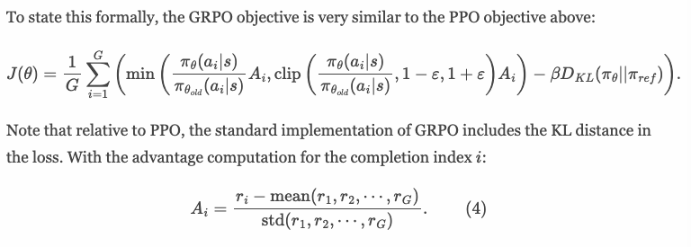

The papers and models that we'll be covering today include:

1.  [Kimi k1.5](https://arxiv.org/abs/2501.12599) --- *Kimi k1.5: Scaling Reinforcement Learning with LLMs* --- a reasoning model released the same day as DeepSeek R1, with a more detailed technical report but a less impactful model. ([chapter link](https://www.interconnects.ai/i/159577063/kimi-k-scaling-reinforcement-learning-with-llms))

2.  OpenReasonerZero ([GitHub](https://github.com/Open-Reasoner-Zero/Open-Reasoner-Zero)) --- *Open-Reasoner-Zero: An Open Source Approach to Scaling Up Reinforcement Learning on the Base Model* --- the first thorough replication of RL training a base model with a substantial increase in inference generation length. ([chapter link](https://www.interconnects.ai/i/159577063/open-reasoner-zero-an-open-source-approach-to-scaling-up-reinforcement-learning-on-the-base-model))

    :::::::: {.file-embed-wrapper component-name="FileToDOM"}
    ::::::: file-embed-container-reader
    :::::: file-embed-container-top
    ::::: file-embed-details
    ::: file-embed-details-h1
    Orz Paper
    :::

    ::: file-embed-details-h2
    1.82MB ∙ PDF file
    :::
    :::::
    ::::::
    :::::::
    ::::::::

3.  [DAPO](https://arxiv.org/abs/2503.14476) --- *DAPO: An Open-Source LLM Reinforcement Learning System at Scale ---* the first of two papers studying modifications to GRPO to better suit reasoning training. ([chapter link](https://www.interconnects.ai/i/159577063/dapo-an-open-source-llm-reinforcement-learning-system-at-scale))

4.  [Dr. GRPO](https://arxiv.org/abs/2503.20783) --- *Understanding R1-Zero-Like Training: A Critical Perspective* --- a paper studying RL from base that also proposes modifications to GRPO for better learning. ([chapter link](https://www.interconnects.ai/i/159577063/understanding-r-zero-like-training-a-critical-perspective))

    \
    Plus, I include [further reading](https://www.interconnects.ai/i/159577063/further-reading). For more on reasoning & inference-time compute, check out [this tag](https://www.interconnects.ai/t/reasoning).

## A foreword: Is GRPO special?

But first, we must tone down some hype. Many people are getting drawn into the RL for language modeling literature right now, and this brings the impression that GRPO and DeepSeek\'s work with R1 (and previous models) have ushered in an entirely new era of RL training. This is far from the case.

GRPO is not a special RL algorithm.

Many leading works and laboratories are ***not*** using GRPO for their experiments right now.

GRPO is, in fact, extremely closely related to all the other RL algorithms we've heard about recently, it's derived from PPO (Proximal Policy Optimization) and has a super similar advantage computation as RLOO (REINFORCE Leave One Out).

GRPO is definitely a brilliant little change, and for reasoning training rather than RLHF, the idea of bootstrapping advantages from multiple answers to the same prompt is genius.[1](#footnote-1){#footnote-anchor-1 .footnote-anchor component-name="FootnoteAnchorToDOM" target="_self"} Original practices in RLHF were downstream of prior RL literature, and the common practice was to train only on one completion per prompt per batch. Now for reasoning, we do many.

Without getting [into the details](https://rlhfbook.com/c/11-policy-gradients.html#implementation), the [advantage computations for GRPO](https://github.com/huggingface/trl/blob/1884ff1bb8929bc92c23dff968c65c546f852b64/trl/trainer/grpo_trainer.py#L849) and [RLOO](https://github.com/huggingface/trl/blob/main/trl/trainer/rloo_trainer.py#L433) look almost identical in modern implementations (compared to PPO, which comes from a value function and usually something called [GAE](https://rlhfbook.com/c/11-policy-gradients.html#generalized-advantage-estimation-gae)). Here, the rewards come from the labels if the answer to the question was correct.

    # GRPO Advantages
    advantages = (rewards - mean_grouped_rewards) / std_dev_grouped_rewards

    # RLOO Advantages
    baseline = (rlhf_rewards_grouped - rlhf_reward_vector) / (completions_per_prompt - 1)
    advantages = rlhf_reward_vector - baseline

Then, the only difference between REINFORCE and GRPO is the clipping logic from PPO (which REINFORCE does not use) --- **they're all closely related** **policy-gradient algorithms**. At the same time, another RL algorithm popular in the pre-LLM era of RL, [A2C](https://arxiv.org/abs/2205.09123) *[is another special case of PPO](https://arxiv.org/abs/2205.09123)* depending on the hyperparameters.

What you should take away from this is that all of the RL algorithms people use are implemented extremely similarly, and decisions around batching and infrastructure often matter more than small algorithmic details. Still, **small algorithmic details and research ideas are crucial to understanding and pushing the limits of current systems**. That's why this piece exists.

So, while GRPO is the most popular algorithm right now, the only things that are changing in RL algorithms these days are:

1.  The use of a value function. People seem to be moving towards direct estimates of the advantage because value functions are hard.

2.  Understanding the role of PPO style logratio clipping. This helps the model learn conservatively when taking multiple gradient steps on a batch of data. It may not always be needed.

3.  Using multiple answers (i.e. actions) per prompt (i.e. state) to estimate rewards for our outcome-oriented problems.

DeepSeek's results kick-started this revolution, so it's natural to start with their algorithm GRPO to get it going, but really all of this is about RL more than any specific algorithm.

## 1. Kimi k1.5: Scaling Reinforcement Learning with LLMs

The Kimi k1.5 report is extremely rich and reads very similarly to the DeepSeek R1 paper. Their problem is that their model wasn't released with open weights, nor quite as good, so it didn't have the same viral moment. The authors summarize the paper as:

> We report on the training practice of Kimi k1.5, our latest multi-modal LLM trained with RL, including its RL training techniques, multi-modal data recipes, and infrastructure optimization. Long context scaling and improved policy optimization methods are key ingredients of our approach, which establishes a simplistic, effective RL framework without relying on more complex techniques such as Monte Carlo tree search, value functions, and process reward models.

The evaluations are still extremely strong, given that the model was released before o3-mini became available.

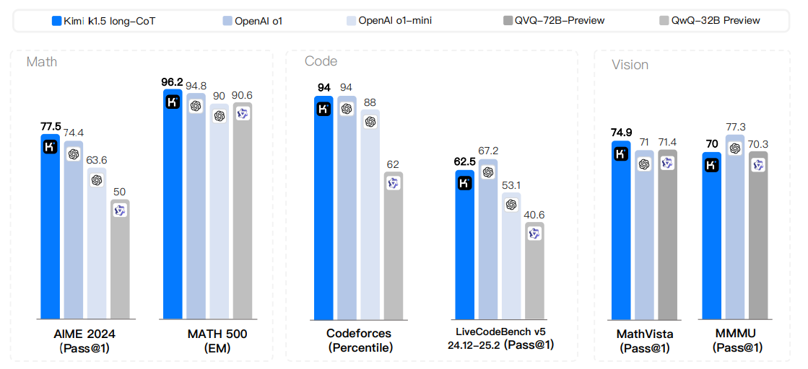

As we get into the implementation decisions they made, you'll see that this paper took the approach of "stacking many tricks" on top of learning. This makes some of the takeaways on algorithmic details a bit less clear, but they pose great thought exercises.

**On data distributions**

The thing that this paper (and Open Reasoner Zero, later in this post) both have that the o1 and R1 releases didn't have is a discussion of data. The Kimi team describes a focus on prompt curation for RL. It's quite simple, but "the quality and diversity of the RL prompt set play a critical role in ensuring the effectiveness of reinforcement learning." The data should be **well-balanced** **in** **topics and** **difficulty**. The authors highlight two things which are different than most of the math-only models we're seeing:

> -   **Diverse Coverage**: Prompts should span a wide array of disciplines, such as STEM, coding, and general reasoning, to enhance the model's adaptability and ensure broad applicability across different domains.
>
> <!-- -->
>
> -   **Balanced Difficulty**: The prompt set should include a well-distributed range of easy, moderate, and difficult questions to facilitate gradual learning and prevent overfitting to specific complexity levels.

The latter point is something we'll see come up again and again. Where algorithmic changes (e.g., removing difficulty normalization in Dr. GRPO) can make models more robust to less balanced data, a crucial part of the current RL training is to have a diversity of difficulties in your data. With large batch sizes, the model should have questions that are trivial, somewhat challenging, and nearly impossible in each batch.

Given that the models see each datapoint multiple times in training, data diversity is seen as more promising than data curricula, where harder questions are seen later. If there's a distribution of difficulty in training, we don't have to worry about that --- the model just will learn consistently on its own!

Their data selection methods for prompt coverage on topics are quite standard --- they employ automatic filtering and tagging by domains (as is often done with pretraining).

For task difficulty, the authors have to do something that is newer with reasoning models:

> We adopt a model-based approach that leverages the model's own capacity to adaptively assess the difficulty of each prompt. Specifically, for every prompt, an SFT model generates answers ten times using a relatively high sampling temperature. The pass rate is then calculated and used as a proxy for the prompt's difficulty---the lower the pass rate, the higher the difficulty.

In addition, they remove questions that may encourage the model to guess rather than use a chain of thought:

> Empirical observations reveal that some complex reasoning problems may have relatively simple and easily guessable answers, leading to false positive verification---where the model reaches the correct answer through an incorrect reasoning process. To address this issue, we exclude questions that are prone to such errors, such as multiple-choice, true/false, and proof-based questions.

**On training recipes**

The Kimi k1.5 recipe has a bunch of interesting nuggets that I interpret as knobs you can turn in order to get your early reasoning recipe to fall into place, but as this training gets easier they are unlikely to remain as recommended best practices.

For example, they start very similarly to the DeepSeek R1 paper where they use SFT warmup with long CoTs via rejection sampling (what DeepSeek calls the "cold start" SFT phase). They focus on behaviors in the data, including planning, evaluation, reflection, and exploration and it helps final performance.

As we move into the rest of the process, it gets more interesting.

They **don't use GRPO, but rather use a variant of online policy mirror descent** (still a [policy-gradient algorithm](https://arxiv.org/abs/2005.09814)) and also do not use a value function but rather a Monte Carlo reward baseline that is very similar in spirit to GRPO, but not for advantage directly, shown below:

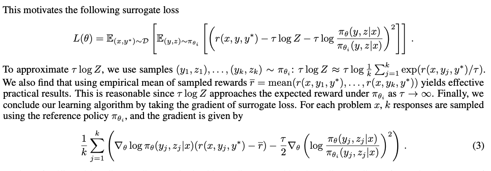

With this, they also use a length penalty where they "promote shorter responses and penalize longer responses among correct ones, while explicitly penalizing long responses with incorrect answers." This is a trick for stability, and they even acknowledge that it slows down training early on and they slowly add this reward in during training. Seems tricky, as we will discuss later with tradeoffs of DAPO and Dr. GRPO.

Despite what we discussed on designing the dataset to have coverage across difficulty so that learning is more straightforward, they *also* use data sequencing strategies to help the model learn. It is an explicit curriculum where they start training on easier tasks AND re-sample tasks the model is underperforming at more in training. Like many of the implementations here, they feel like tricks to eek out more performance and not everlasting changes due to the complexity.

They include a nice RL training plot on a smaller, intermediate experiment they ran.

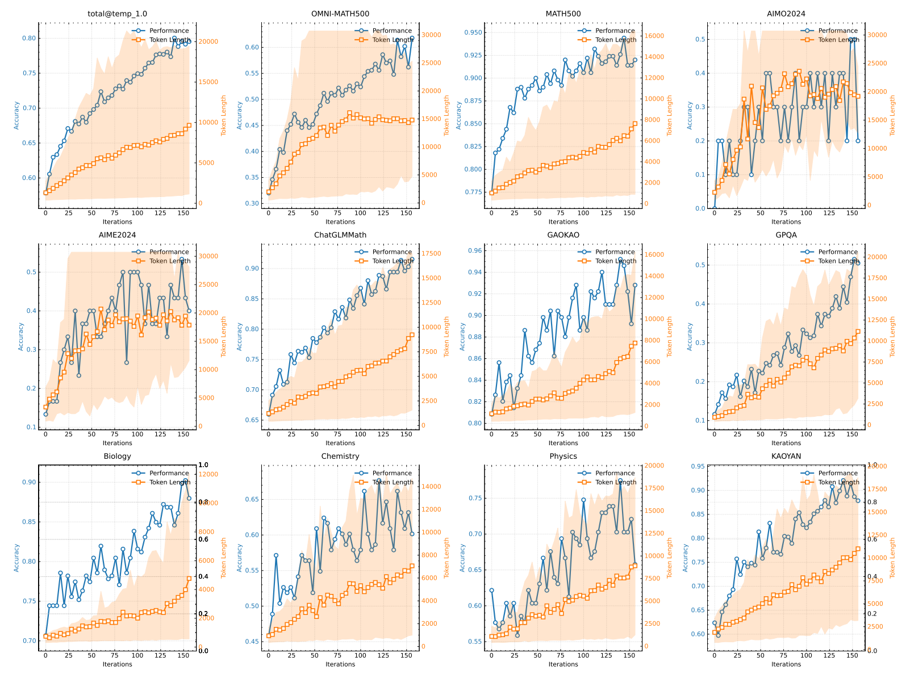

Ablation on model size (without saying how big the models are)

> Notably, although the larger model initially outperforms the smaller one, the smaller model can achieve comparable performance by utilizing longer CoTs optimized through RL. However, the larger model generally shows better token efficiency than the smaller model.

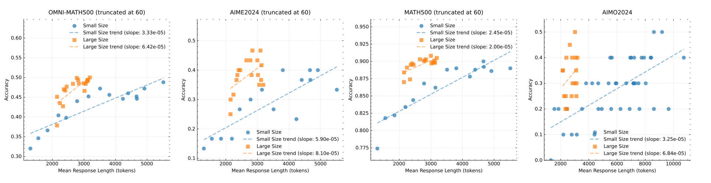

Their takeaways of this on the final usefulness of the models is interesting and in line with a lot of the recent RL literature:

> This also indicates that if one targets the best possible performance, scaling the context length of a larger model has a higher upper bound and is more token efficient. However, if test-time compute has a budget, training smaller models with a larger context length may be viable solutions.

The paper has more details on their SFT dataset, RL infrastructure, long to short CoT distillation, and more experiments that you can dive into if it interests you! Be warned that a lot of the long tail of detail they discuss haven't been replicated elsewhere.

## 2. Open-Reasoner-Zero: An Open Source Approach to Scaling Up Reinforcement Learning on the Base Model

***EDIT**: Two hours after release the authors released a major update to their paper, which you can [find here](https://github.com/Open-Reasoner-Zero/Open-Reasoner-Zero/blob/main/ORZ_paper.pdf) (or read the [announcement](https://x.com/CyouSakura/status/1906737585063641532)). It has better results numerically, [new models](https://huggingface.co/Open-Reasoner-Zero), and an improved codebase.*

The contribution of this paper was primarily to be the first one that showed very strong results with RL on a base model.

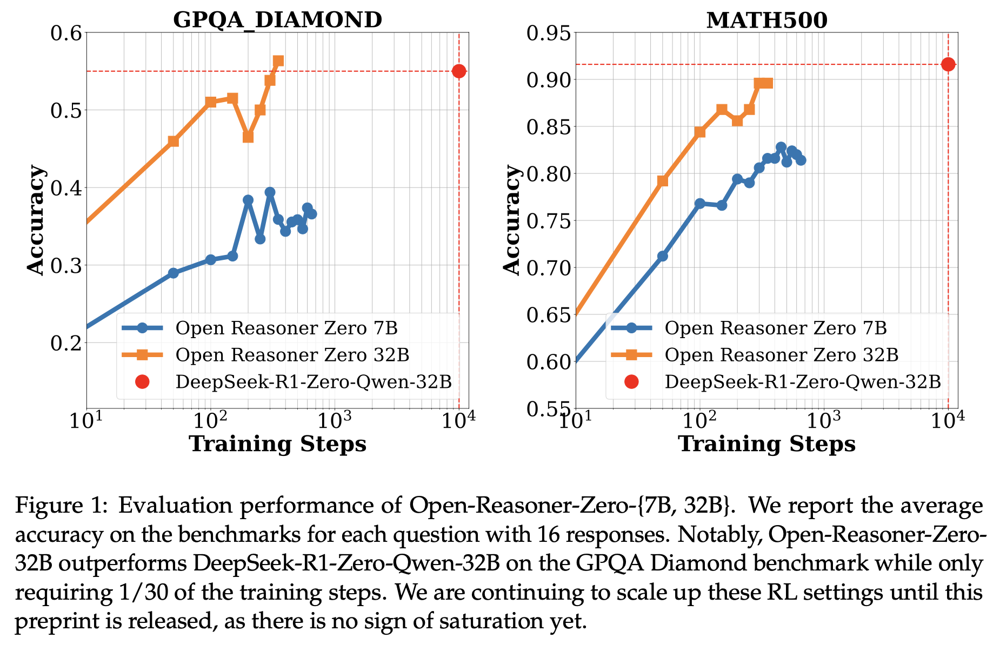

In fact, with a Qwen 32B base model, they showed that they could match the performance of the Qwen 32B RL model that DeepSeek trained and mentioned in their distillation section. This RL model mentioned in the DeepSeek paper was not as big of a talking point because the same table shows that DeepSeek found far higher performance in distilling reasoning into models of this size (rather than starting with RL).

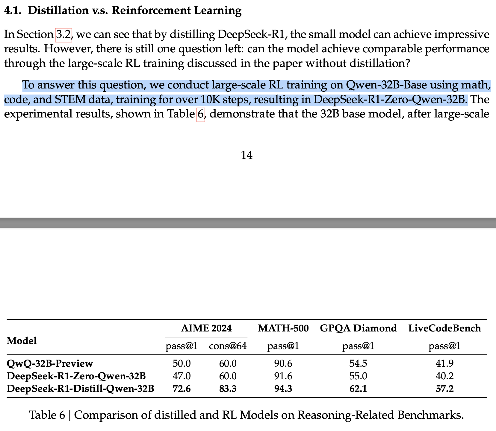

Here, the problem is that not all RL steps are equal. It depends heavily on:

-   How big of a batch size is used for RL. A bigger batch size means fewer steps.

-   How many gradient steps are used per step. More gradient steps can lead to more learning, but also more instability.

-   Dataset matching for a specific model. DeepSeek likely used the same dataset they needed for the DeepSeek base, which could be less well suited to Qwen models (and learn more slowly).

Still, OpenReasonerZero was one of those papers that really confirmed that a lot of what we are working on here is very accessible to study.

**On data distributions**

The core success of this work is in making it crystal clear how important data is for learning. Going per section, the authors describe sourcing from relevant domains (or making new data when they need it):

> -   We collect public data from various sources, including AIME (up to 2023), MATH, Numina-Math collection \[9\], Tulu3 MATH \[10\], and other open-source datasets. Based on source and problem difficulty, we retrieve AMC, AIME, Math, Olympiads, and AoPS forum components as our difficult level prompts to ensure appropriate difficulty levels.
>
> -   We synthesize additional reasoning tasks using programmatic approaches to augment the dataset.

Filtering the dataset of ill-suited formats:

> -   We exclude problems that are challenging to evaluate with our rule-based reward function, such as multiple-choice and proof-oriented problems, ensuring accurate and consistent reward computation during training.

Filtering to get suitable question difficulties and avoid duplication.

> -   We implement a model-based filtering strategy based on heuristic evaluation of problem difficulty. Specifically, we use LLM to assess the pass rate of each problem, removing samples with either too high or zero pass rates.
>
> -   We apply N-gram and embedding similarity-based filtering to deduplicate samples and maintain data diversity

These techniques are really the bread and butter of training language models. They do release their final 57K samples [training data on GitHub](https://github.com/Open-Reasoner-Zero/Open-Reasoner-Zero/tree/main/data)! In the Appendix of their paper, they include more data ablations, such as filtering out Chinese datapoints because they degrade performance (as found in OpenR1).

**On training ablations**

OpenReasonerZero is another paper that did not find GRPO to work for them. The authors use PPO with Generalized Advantage Estimation over a group of responses. This is the default PPO implementation for advantage estimate and should reinforce my messages above about GRPO not being special. With PPO, they use a discount factor of 1 to change the value learning space a bit, which likely works better for outcome based RL.

With this, they didn't use any fancy length or formatting (e.g. \<answer\> tokens) in the reward and found that only correctness was needed. With this, they also removed all KL penalties, which is important to allow the model to change dramatically in response length and learn new behaviors (which help downstream performance).

> Our experimental results demonstrate that removing both KL Loss and KL Penalty yields optimal training stability and final performance.

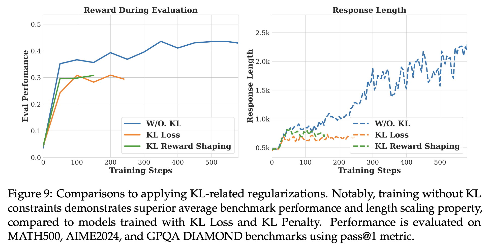

I intentionally am not covering a lot of the "aha moment" discussions in this paper (and others) as I find the qualitative analyses to be overblown in analyzing model behaviors. Many models have behaviors like "let me check that" just after pretraining, and RL makes them more common. That being said, it is very funny that models like DeepSeek R1 start every completion with the token \`Okay,\` and then proceed to reason through the problem.

This paper has plenty more interesting ablations in the appendix, such as changing the sampling temperature for the model during RL training (minor variations, but T=1 is best), changing the RL hyperparameters such as [GAE lambda](https://rlhfbook.com/c/11-policy-gradients.html#generalized-advantage-estimation-gae) or KL penalties, or changing batch sizes and update rules.

------------------------------------------------------------------------

Before we get to the next two papers, I also recorded a video walk through of some of the topics in them on refining the GRPO objective. You may find it complementary to the text below

:::::::: {#youtube2-amrJDwMUFNs .youtube-wrap attrs="{\"videoId\":\"amrJDwMUFNs\",\"startTime\":null,\"endTime\":null}" component-name="Youtube2ToDOM"}
::::::: youtube-inner
:::::: iframe
::: {#player}
:::

:::: player-unavailable
# An error occurred. {#an-error-occurred. .message}

::: submessage
[Try watching this video on www.youtube.com](https://www.youtube.com/watch?v=amrJDwMUFNs){target="_blank"}, or enable JavaScript if it is disabled in your browser.
:::
::::
::::::
:::::::
::::::::

This goes well with studying the new [loss aggregation](https://rlhfbook.com/c/11-policy-gradients.html#loss-aggregation) section of my book. I'll continue updating it as GRPO grows in importance.

------------------------------------------------------------------------

## 3. **DAPO: An Open-Source LLM Reinforcement Learning System at Scale**

Before starting with these next two papers, we need to cover some context on how to understand algorithmic advancements in machine learning, particularly in reinforcement learning. There is a rule of thumb where if you are looking at a paper and they don't beat the baseline by something like 2x, the proposed solution likely is succeeding mostly due to hyperparameter tuning or other confounding variables. This is the right level of skepticism to have around new RL algorithms for language models.

It's very easy to read these papers and be like "oh wow my stuff will just work now." It's far from the case. These papers are wonderful exercises in learning the intricate details of the GRPO loss. Papers like this build up over the years into huge intuition gains. For now, when training real state-of-the-art models, most of the changes will likely be overkill in code complexity relative to focusing on having a well-tuned data distribution (as discussed in the above papers).

With that, let's get into DAPO --- this is an expanded version of some quick [Twitter coverage](https://x.com/natolambert/status/1901758392043221072). The learning curve they highlight is nice, but it's confusing because the exact comparison of training steps for the model "DeepSeek R1 Zero Qwen 32B" doesn't actually exist (as discussed above), so especially the x-axis is wrong misleading. Again, it's showing that what DeepSeek has done is not impossible to reproduce.

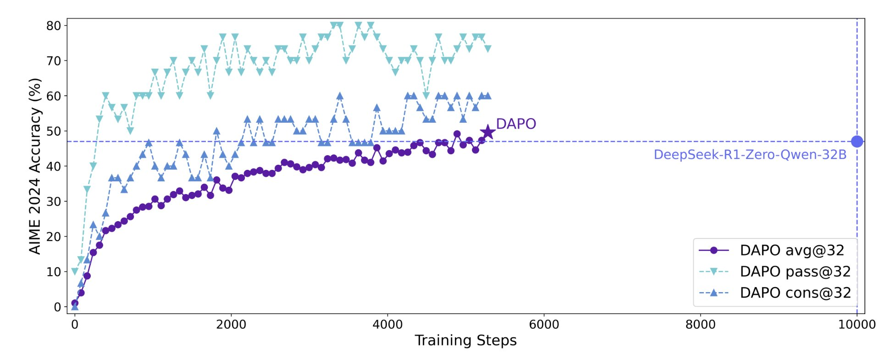

This is a very tidy little RL paper for reasoning. Their GRPO changes that we'll cover are:

1.  Two different clip hyperparameters, so positive clipping can uplift more unexpected tokens.

2.  Dynamic sampling --- remove samples with flat reward in batch to improve efficiency.

3.  Per token loss (rather than per-response loss) to improve learning dynamics.

4.  Managing too long generations in the loss for better stability.

I wish this paper, as I'll discuss below with the Dr. GRPO paper, had done more comparisons on final performance. Evaluations are what we care about, so until performance improves with algorithmic changes, I'll have a hard time saying these are crucial implementation decisions.

Regardless, together DAPO looks like the following:

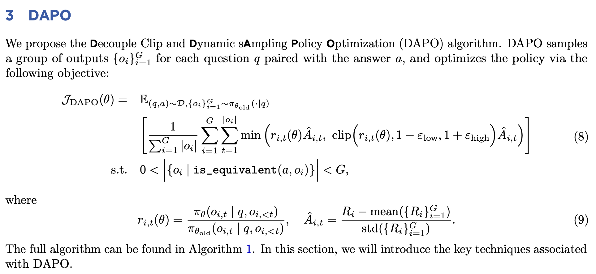

Like many papers these days, they also suggest **removing the KL divergence penalty on GRPO** to help learning. Many have said that without a reward model to over-optimize against, it's just not needed. For base model RL, I agree, where the model tends to need to change more to become a full reasoning model. If doing RL with verifiable rewards (RLVR) on an instruct model, the KL penalty could still be helpful.

**GRPO p1. Clip higher / splitting clipping hyperparameters**

PPO and GRPO have a clipping hyperparameter that controls the step size of the update. This is the core idea behind PPO and TRPO compared to REINFORCE or vanilla policy gradient. DAPO moves it to two hypers, so the upper / positive logratio step size can be bigger. This is to increase the probability of tokens, such as surprising new tokens in reasoning chains.

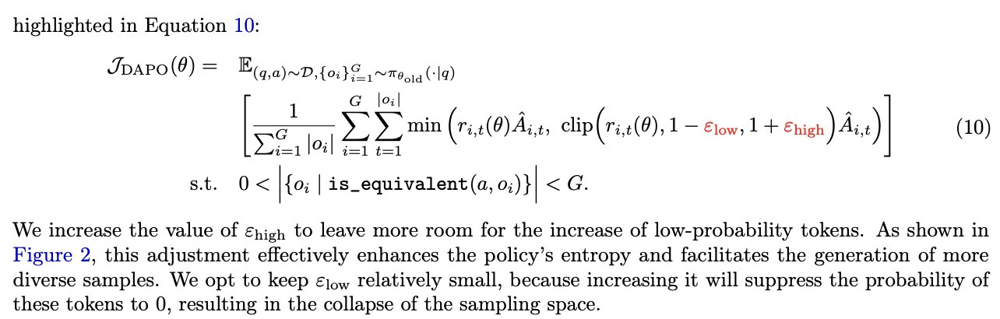

The PPO/GRPO update takes a step based on the logratio, so unlikely tokens with small probabilities that are increasing in likelihood become a bigger logratio and are more likely to be clipped than already likely tokens. This is a fairly complicated change for the upside, but it is a nice illustration of how clipping can impact learning dynamics.

This paper has nice ablations for their changes! On the right, they show that the model keeps higher entropy (i.e. exploration/randomness) as training goes on. Nice.

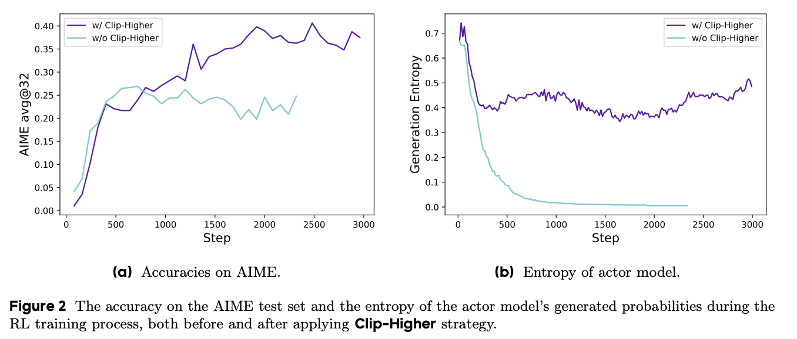

**GRPO p2. remove unnecessary samples from the batch**

Essentially, in GRPO, if all samples for a prompt have the same reward in the batch, there is no learning signal because the advantage per answer is computed as the difference from that answer to the mean of the group in the batch. Removing them improves learning speed by computing fewer gradients.

This is really a simple fact of GRPO. When the answers have no signal in the batch, they, in theory, aren't impacting the model, but this is also connected to why bigger models may learn better with RL. A bigger model's RL step is less likely to unintentionally hurt other areas of the model that aren't in the learning batch because the abilities are spread across more parameters.

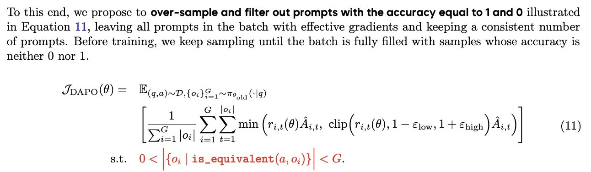

**GRPO p3. token-level policy gradient**

The authors say the token-level loss helps mitigate behaviors like repetitive behavior in very long reasoning chains while still encouraging the model to learn from the positive long-context examples. This is *different* from standard RLHF implementations (see below in discussion of Dr. GRPO). Their change is a softer change than what we will discuss later.

The author's intuitions here are nice, as we will see this tradeoff discussed a lot in coming papers:

> Since all samples are assigned the same weight in the loss calculation, **tokens within longer responses (which contain more tokens) may have a disproportionately lower contribution to the overall loss, which can lead to two adverse effects**. First, for high-quality long samples, this effect can impede the model's ability to learn reasoning-relevant patterns within them. Second, we observe that excessively long samples often exhibit low-quality patterns such as gibberish and repetitive words. Thus, sample-level loss calculation, due to its inability to effectively penalize those undesirable patterns in long samples, leads to an unhealthy increase in entropy and response length

Moving the length normalization 1/\|o\| outside the group sum makes the loss calculated *just* by summing over the tokens on the inside of both sums.

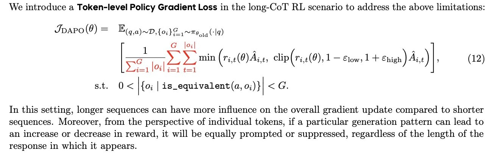

Here, the groups of answers are normalized by the token counts for that prompt overall. Default GRPO normalizes the loss per token for only the response that the token corresponds to.

This is cool but needs more replication! See discussion below. In their setup, they see quite different behavior.

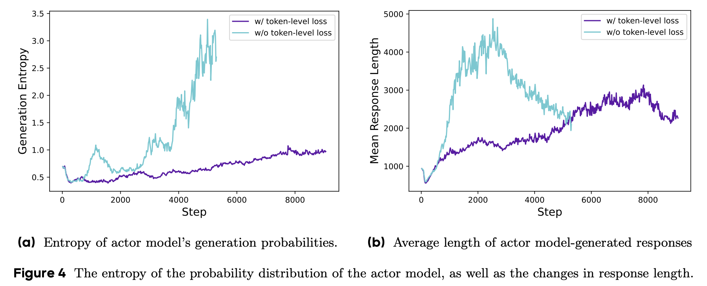

The idea is to enable learning better from long answers. Good long answers should be adequately rewarded and repetitive, bad, long answers *need* to be penalized.

**GRPO p4. reward shaping for avoiding truncation**

This is the most minor change in DAPO. Essentially, they add a soft and then a firm penalty as the model goes over in generation length. For a model with a max context length of 16k tokens, they start applying a penalty at 12k tokens and linearly increase it to 16k. This length control mechanism feels like it'll be outdated, or will be a really minor trick in the future.

For reference, many RL implementations already include some larger penalty if the model truncates itself (i.e. never generates an EOS token or answer).

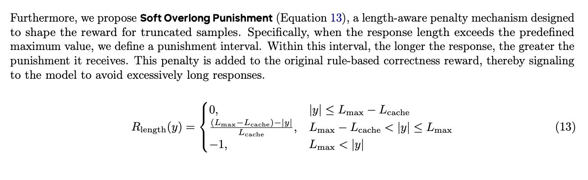

They call it Decoupled Clip and Dynamic sAmpling Policy Optimization (DAPO) algorithm. It seems fair enough to call it a new algorithm, that\'s how things always have been in RL, but really this is pretty much GRPO++.

The training is focused on AIME, so the final models aren't super interesting, but they state the everlasting truth we are in:

> Even seemingly minor changes in initial conditions, such as variations in data and hyperparameters, can amplify through iterative reinforcement learning processes, yielding substantial deviations in outcomes.

## 4. Understanding R1-Zero-Like Training: A Critical Perspective

This is the second paper we got on modifying GRPO to make it better suited for reasoning training (and realistically, just more effective). The paper also includes some great experiments understanding how different base models impact learned reasoning *behaviors*.

The core figure of the paper is below:

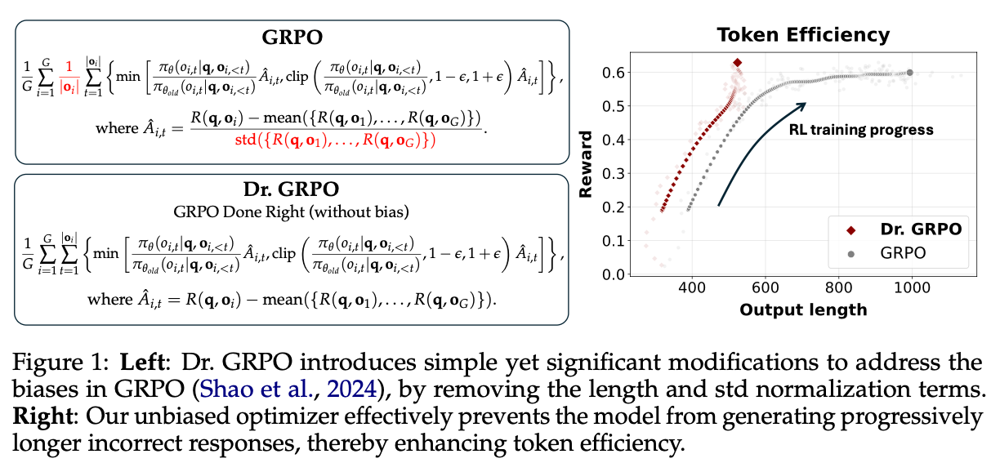

The core idea of the paper is that by modifying GRPO they can improve the learning dynamics where stronger performance can be achieved with less increase in generation length. This is something everyone should want!

They posit that the default GRPO implementation is actually set up with a bias to increase the generation length more than is useful.

**On GRPO modifications**

The core modification they propose is somewhat nuanced and is heavily related to common practices of how GRPO is implemented. A core step of the implementation of GRPO is detailed in the DeepSeekMath paper:

> Outcome supervision provides the normalized reward at the end of each output 𝑜𝑖 and sets the advantages 𝐴ˆ 𝑖,𝑡 of all tokens in the output as the normalized reward...

Essentially, instead of just assigning advantage to the final token where the outcome is verified, every token in the batch is assigned an advantage. The loss is then computed per-token with these policy gradient algorithms.

To see how this works, let's revisit the loss from the paper:

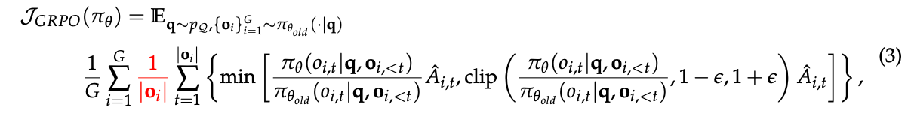

What is happening here is the first sum manages the group, G, of responses to a question, and the inner sum manages the per-token loss. The authors are correcting for two behaviors in learning:

-   **Favoring short, right answers.** For positive advantages, i.e. a correct and better response in a group, the original loss rewards short responses. To see this, consider two answers in a group that are both right, one with 10 tokens and one with 1000. Both of these have the same advantage, but the probabilities on the shorter one are going to be increased more because the loss approximates advantage/length. A token to consider if this is still confusing is the EOS token, which appears as the last token of each response --- this will be increased far more for the short response.

-   **Not penalizing long, repetitive, wrong answers.** This one is simpler, where if the advantage is negative, the normalizing factor of 1/\|o\| reduces the learning signal on longer answers by reducing the effective magnitude of the advantage on each token. Smaller penalties mean it's more likely than wrong, short answers.

Together, these are sort of the opposite of what we want (and very related to DAPO's ideas). We want longer right answers for inference time scaling and don't want to waste tokens. Personally, I like the DAPO solution a bit more, moving the length normalization outside the group, rather than getting rid of it in its entirety.[2](#footnote-2){#footnote-anchor-2 .footnote-anchor component-name="FootnoteAnchorToDOM" target="_self"}

The second modification they propose is quite clever (as is [already implemented in TRL](https://github.com/huggingface/trl/pull/3135)) --- removing question level difficulty bias. When performing an update like GRPO (e.g. with PPO too), the magnitude of the advantage impacts the magnitude of the gradient update. Here, questions with high variance are being punished relative to simpler to solve (or fail) questions --- this intuitively could even be backwards to what we want! Harder questions, especially during crucial stages of learning, will have higher variance. The authors explain the relation to previous RL practices too:

> While advantage normalization is a common trick in RL (Andrychowicz et al., 2021), it is typically computed across an entire batch.

In reality, the impact of this change can be completely absorbed into high-quality data engineering, as discussed in other papers above, where you have a uniform distribution in question difficulty across the batch.

Though, there is no free lunch in these changes --- my colleague [Costa Huang](https://costa.sh/) reminded me that low variance questions can be crucial ones for our model learning. In the case where the model gets the answer wrong 9 times and right once, removing the standard deviation will *downweigh* that one correct answer. That could be the crucial thing the model needs to learn!

They call these two changes GRPO Done Right, a.k.a. **Dr. GRPO**. When they put this together, the model shows the changes in output length that they expect --- shorter overall and particularly shorter incorrect answers. The downside here **is that they don't actually show better downstream, final performance.** Final performance is the goal, and likely comes more from the data.

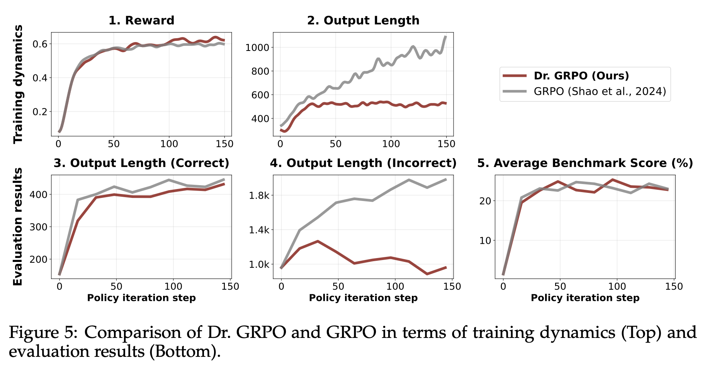

**On changing base models for RL**

The authors compare base models from Qwen 2.5, Llama 3.1, and DeepSeek to see how they answer MATH questions. For these models, they use the R1 template, the Qwen MATH template, and no template. These templates have a crucial role when models have undergone midtraining with reasoning / CoT traces already:

> Template 1 (R1 template). A conversation between User and Assistant. The User asks a question, and the Assistant solves it. The Assistant first thinks about the reasoning process in the mind and then provides the User with the answer. The reasoning process is enclosed within \<think\> \</think\> and answer is enclosed within \<answer\> \</answer\> tags, respectively, i.e., \<think\> reasoning process here \</think\> \<answer\> answer here \</answer\>.
>
> Template 2 (Qwen-Math template). \<\|im_start\|\>system Please reason step by step, and put your final answer within \\boxed{}. \<\|im_end\|\> \<\|im_start\|\>user {question} \<\|im_end\|\> \<\|im_start\|\>assistant
>
> Template 3 (No template). {question}

They find that Llama and DeepSeek follow instructions best with the R1 template, and Qwen works best with no template. It is crucial to remember how different these base models can be across "finetuning" regimes. The comparison of format compliance is shown below.

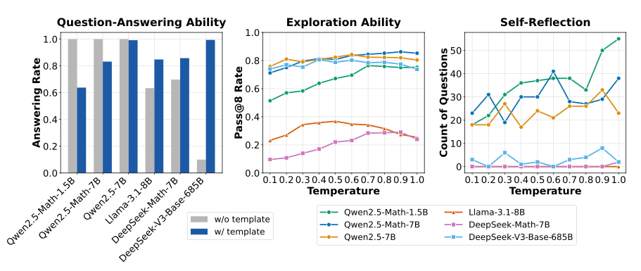

The middle plot showing pass@8 rate for math questions can be thought of as "how often does a correct answer show up if I sample 8 answers to 1 question?" This is a proxy for how easy it will be for a model to learn at the beginning of training. Qwen again performs best and temperature has *less* of an impact than I would think.

The last on the right they show that the bigger Qwen models already have reflection behaviors before any RL training! This isn't surprising if you're playing with the models, but it is a great datapoint for downplaying the role of "aha moments" during RL training. The models are mostly amplifying, not learning new things.[3](#footnote-3){#footnote-anchor-3 .footnote-anchor component-name="FootnoteAnchorToDOM" target="_self"}

The paper has other nice results, such as continued pretraining on more domain-specific math data improving RL performance, something many people are seeing by how easy it is to train on Qwen-MATH models.

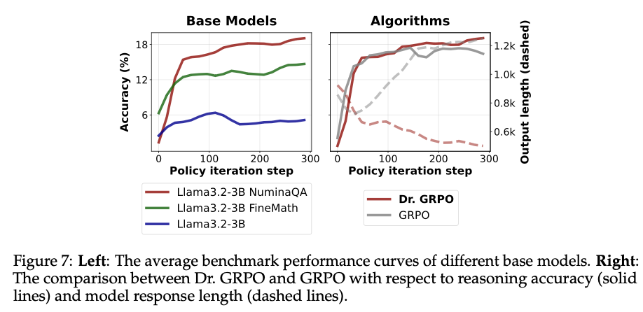

**Relation to GRPO training failures**

Some failures we've seen in our early research, which I've heard from other laboratories too, are that GRPO can fail by starting to generate very repetitive and long responses. The sequence length of the answers blows up to the maximum allowed in the training setup and the performance on downstream evaluations drops to 0. These potential interventions, for Dr. GRPO and DAPO both could help alleviate this. We'll have independent replications soon!

**Relation to existing RLHF infrastructure**

I've been in many [discussions](https://x.com/danielhanchen/status/1900844864134410695) in the last few weeks about the sum or mean loss for RLHF infrastructure per batch. The intuition is the question of should RL weight each token equally (i.e. learn more from longer answers in the batch) or normalize them with respect to the question. My starting point is that per-question makes more sense as the model needs to learn different behaviors per question, but the learning dynamics are subtle.

This paper has a critique of *all* of the popular open RL tools right now, saying the per-response is biased in a way that is worse. It is more complicated than that --- the per-response summing has definitely been standard practice.

The difference is a change from `masked_mean` as done in libraries like [TRL](https://github.com/huggingface/trl/blob/07cfe1677e552b7d5c92b7740e5b2f0b057661d8/trl/trainer/grpo_trainer.py#L965) to a `masked_sum` that the [authors use](https://github.com/sail-sg/oat/blob/7619b79a8804e813419faeda22bdd35cc4d9b9bd/oat/algorithms/ppo.py#L560).

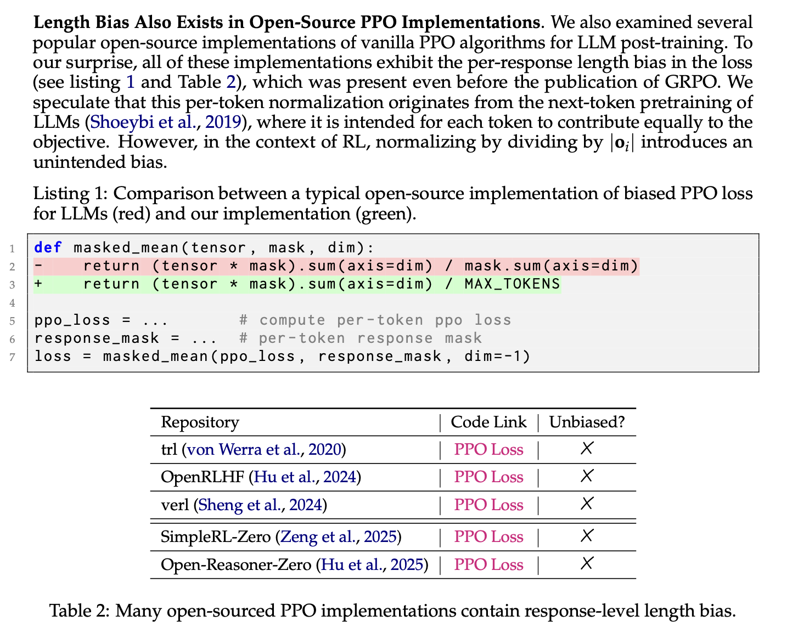

One intuition for why per-response could be good is that if you have a KL penalty on, you don't [want a very weird token (KL explosion) to impact every token in your batch](https://x.com/vwxyzjn/status/1901479987355455921). These implementation differences depend so much on a particular training setup.

Still, the context here on reasoning vs. RLHF is cool too. Yes, in most ways the implementations are all as the authors claim, but this is just because the community didn\'t care about the context length learning dynamics before like we do with reasoning models.

Before, the focus was on reward. Now, the focus is on rewarding the RIGHT long-context behaviors and penalizing repetitive long behaviors. So, yes, the responses are biased against longer, high-reward sequences, but we didn\'t care!

*More discussion of this paper [is](https://x.com/ethayarajh/status/1903859350021812698) on [Twitter](https://x.com/WenhuChen/status/1903464313391624668).*

------------------------------------------------------------------------

## Further reading

There are more papers that I would've loved to cover for this. Some of them include:

-   *[SimpleRL-Zoo: Investigating and Taming Zero Reinforcement Learning for Open Base Models in the Wild](https://arxiv.org/abs/2503.18892)*: Largely a more comprehensive version of OpenReasonerZero with more experiments, but I had already written much of this post before it came out!

-   *[Cognitive Behaviors that Enable Self-Improving Reasoners, or, Four Habits of Highly Effective STaRs](https://arxiv.org/abs/2503.01307)*: A cool paper that looks across model varieties (e.g. Qwen, Llama, etc) to see which demonstrate four key behaviors to downstream reasoning performance --- verification, backtracking, subgoal setting, and backward chaining. These help us understand what base model makes a good RL model.

-   *[L1: Controlling How Long A Reasoning Model Thinks With Reinforcement Learning](https://arxiv.org/abs/2503.04697)*: The first paper studying how to control output length with RL. They add a term to the reward based on distance from a target length and see inference time scaling on MATH while controlling the model. This won't be an essential skill, but it's certainly a nice one for RL training.

-   *[ReSearch: Learning to Reason with Search for LLMs via Reinforcement Learning](https://www.arxiv.org/abs/2503.19470)*: One of the first papers we have that can show how systems like Deep Research are trained with RL. It's wonderful to see some non-math/code results with these methods.

-   *[Exploring Data Scaling Trends and Effects in Reinforcement Learning from Human Feedback](https://arxiv.org/abs/2503.22230)*: A rare paper with many numerical experiments on data and methodological scaling in RLHF. Not the clearest paper, but it's rare, so I included it!

Thanks for reading! These are higher effort posts than usual due to the detail, so I appreciate any support you can give. As always, there are more papers out there and even more details in the papers I mentioned, so going deeper is encouraged.

*Many people deserve thanks for participating in discussions that helped me figure all this out. Some include Hamish Ivison, Costa Huang, Ross Taylor, Finbarr Timbers.*

:::: {.footnote component-name="FootnoteToDOM"}
[1](#footnote-anchor-1){#footnote-1 .footnote-number contenteditable="false" target="_self"}

::: footnote-content
GRPO is largely unproven for preference tuning.
:::
::::

:::: {.footnote component-name="FootnoteToDOM"}
[2](#footnote-anchor-2){#footnote-2 .footnote-number contenteditable="false" target="_self"}

::: footnote-content
I have heard some more uncertainties over the math in this paper, but the basic intuitions are useful. The questions emerge when you go deeper into implementation.
:::
::::

:::: {.footnote component-name="FootnoteToDOM"}
[3](#footnote-anchor-3){#footnote-3 .footnote-number contenteditable="false" target="_self"}

::: footnote-content
[Multiple](https://oatllm.notion.site/oat-zero) other [posts](https://oatllm.notion.site/oat-zero) have confirmed this lack of an Aha moment too.
:::
::::
