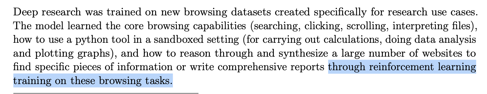
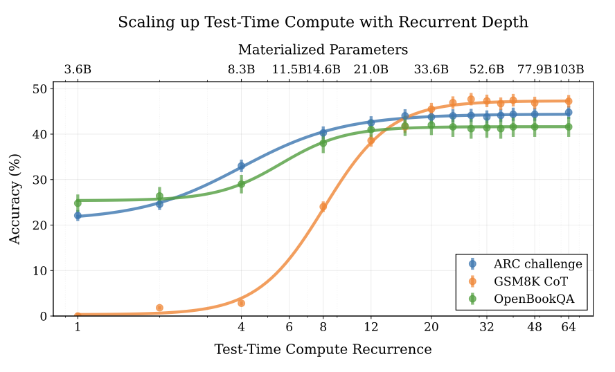
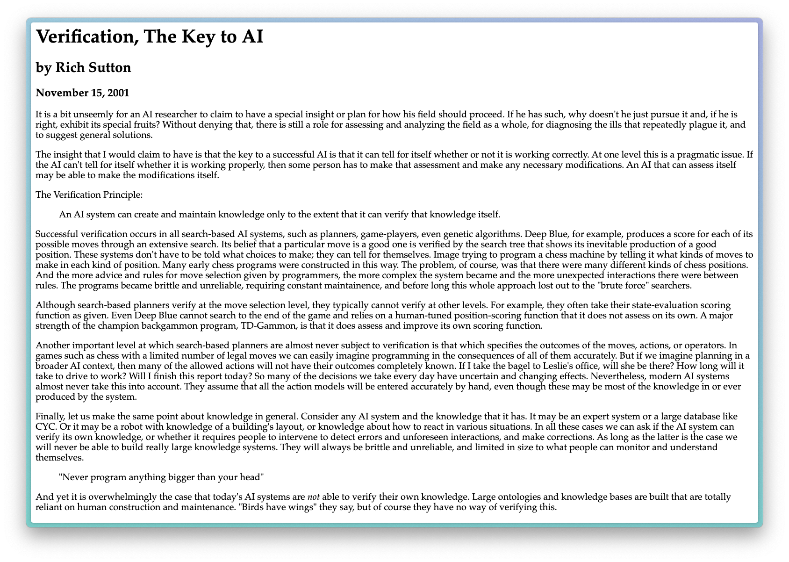

*I have a second blog where I post half-baked thoughts, sometimes previews of what comes here. If you're interested, I posted some [musings on OpenAI's coming open model release](https://natolambert.substack.com/p/some-thoughts-on-openai-returning).*

------------------------------------------------------------------------

It's obvious that reinforcement learning (RL) is having a total return to glory among the broader AI community, but its real successes are mostly the things people aren't focusing on. More math and code datasets are central platforms for research and progress --- we know they're coming. They're still over-indexed on. The same RL methods are being used in many of the leading models and AI products.

This is largely a post I wrote a few weeks ago on RL news, which I was following. It never had a focusing function, so it didn't get published, but I'm sharing it because many folks are following this area very closely. Today:

-   OpenAI's many forms of RL,

-   On distilling chain of thoughts vs. RL,

-   Did DeepSeek distill o1?, and

-   Why latent reasoning is so interesting.

## OpenAI's many forms of RL

For those plugged into the OpenAI cultural tap that is Twitter, it is obvious that they're [very invested in reinforcement learning](https://x.com/_jasonwei/status/1879610551703413223).[1](#footnote-1){#footnote-anchor-1 .footnote-anchor component-name="FootnoteAnchorToDOM" target="_self"} With the hype around the release of their o-series of reasoning models, it was easy to assume that those were the only avenue for excitement. OpenAI's recent releases have shown this is not the case, and every release from a model launch to a new product has included mentions of RL training. Some of this, of course, is marketing, but they all fit as different applications of reinforcement finetuning (RFT) / RL with verifiable rewards (RLVR).[2](#footnote-2){#footnote-anchor-2 .footnote-anchor component-name="FootnoteAnchorToDOM" target="_self"}

The first other application was [OpenAI's Operator](https://openai.com/index/introducing-operator/) agent. They stated:

> Combining GPT-4o\'s vision capabilities with advanced reasoning through reinforcement learning, CUA is trained to interact with graphical user interfaces (GUIs)---the buttons, menus, and text fields people see on a screen.

There's a bit more speculation to do than normal in this post. Ultimately, with partners they launched with like DoorDash, Instacart, etc., they could set up verifiable domains where the agent is rewarded for accomplishing a natural language task. This could rely on help from those websites to get started. Ultimately, lots of people know that this *could* work, as agents deeply tied to the core of RL lore, but the implementation details haven't really been worked out in open projects.

The same goes for [Deep Research](https://openai.com/index/introducing-deep-research/). They stated:

> Deep research independently discovers, reasons about, and consolidates insights from across the web. To accomplish this, it was trained on **real-world tasks requiring browser and Python tool use, using the same reinforcement learning methods behind OpenAI o1**, our first reasoning model.
>
> Deep research was trained using end-to-end reinforcement learning on hard browsing and reasoning tasks across a range of domains.

Some more was shared in the [Deep Research system card](https://cdn.openai.com/deep-research-system-card.pdf).

There are lots of things one can envision --- e.g. agent gets a reward if the document retrieved from search has relevant information (not a verifiable reward, but LLM-as-a-judge). Most of this is likely used to get very high reliability across tool use to enable the tons of calls done in the back end when a call takes 10+ minutes for the user.

[More](https://arxiv.org/abs/2503.12759) \| [research](https://www.arxiv.org/abs/2503.19470) \| [has emerged](https://arxiv.org/abs/2410.23214) on [RAG/search](https://arxiv.org/abs/2501.15228v1) with [RL](https://arxiv.org/abs/2401.06800?utm_source=chatgpt.com).

Least surprising was the [announcement of the new GitHub CoPilot model](https://x.com/ashtom/status/1891925306430337110) with new and improved RL training for code:

> Our new code completion model is shipping in public preview today. We are calling it GPT-4o Copilot. Based on GPT-4o mini, with mid-training on a code-focused corpus exceeding 1T tokens and reinforcement learning with code execution feedback (RLEF).

This all goes back to what I said in *[OpenAI\'s Reinforcement Finetuning and RL for the masses](https://www.interconnects.ai/p/openais-reinforcement-finetuning) ---* this new RL training is a perfectly aligned way to get nearly perfect performance on a domain you can control carefully. The best results come with mastery of the domain and with training.

A fun speculation that OpenAI is *really* invested in RL and post-training is that their new o3-mini model has the [same date cutoff](https://platform.openai.com/docs/models#o3-mini), October 2023, as OpenAI's other flagship models. This getting very far in the past shows how invested OpenAI is in their search products (which, to be fair are quite good) for information and how such strong performance gains can come by other improvements in the stack of training.

OpenAI also released a paper on [competitive coding with RL](https://arxiv.org/abs/2502.06807) training, but it did not have a ton of useful details.

## On distilling chain of thoughts vs. RL

There were a few points from the DeepSeek paper and discourse that warrant repeating. To repeat it, distillation in this case is training a model (usually with [SFT](https://rlhfbook.com/c/09-instruction-tuning.html), but any loss function works) on outputs from a stronger model. Let's get right into it.

First, DeepSeek made it very clear that using more RL *after* distillation (SFT) is crucial for the best possible models.

> Additionally, we found that applying RL to these distilled models yields significant further gains. We believe this warrants further exploration and therefore present only the results of the simple SFT-distilled models here.

My current understanding here is that matching the data distribution from the base model's training to the distillation data and the RL prompts is very important. This specifically is crucial for enabling RL at the end --- SFT will almost always boost the scores, but can narrow the scope to which the model can be finetuned more. DeepSeek figured this out for their models, but didn't share the details.

The next point is on how scale mediates the impact of RL training:

> First, distilling more powerful models into smaller ones yields excellent results, whereas smaller models relying on the large-scale RL mentioned in this paper require enormous computational power and may not even achieve the performance of distillation.

This is more confusing than useful, and drawn from the fact that "DeepSeek-R1- Distill-Qwen-32B[3](#footnote-3){#footnote-anchor-3 .footnote-anchor component-name="FootnoteAnchorToDOM" target="_self"}, which is distilled from DeepSeek-R1, performs significantly better than DeepSeek-R1-Zero-Qwen-32B across all benchmarks". We should not expect that -Zero style models trained only with RL will perform well on benchmarks (unless you're training on test). This is not what they are designed for. The distilled models are trained on text very finely tuned for existing language modeling workflows. The RL-Zero (not distilled) models are very exporatory in their behaviors.

The right baseline would be putting Qwen-32B through the whole [R1 recipe](https://www.interconnects.ai/p/deepseek-r1-recipe-for-o1) --- which would be far more likely to outperform the distilled version.

With this is the fact that small models take more work from RL. Doing this sort of exploratory RL is much easier with big models. It could be that they hold more rare behaviors in them during pretraining and RL draws them out. The smaller models may squash these long-tail behaviors.

Continuing on this, the DeepSeek authors state:

> Second, while distillation strategies are both economical and effective, advancing beyond the boundaries of intelligence may still require more powerful base models and larger scale reinforcement learning.

## Did DeepSeek distill OpenAI's o1 model? (hint, no)

This is a question I meant to address ages ago, but here we are, a few model launches got in the way. The criticism pushed by OpenAI and many media outlets is that DeepSeek was trained on reasoning traces from OpenAI's o1 model. OpenAI spent approximately 18 months getting the initial data to train their o1 model, so it is understandable that they are wary of giving that away for free, but the existing evidence suggests that DeepSeek training on o1-CoTs is extremely unlikely.

To start, the o1 chains of thought were not visible to the users. In order to get this data, DeepSeek would need to reliably hack the OpenAI API or ChatGPT to reveal this data. Users were getting banned from OpenAI's properties for trying to do this. Creating this scale of a cover-up is unlikely to go unnoticed.

Second, as shown in the DeepSeek R1 recipe, training on on-policy completions from your model(s) is crucial to training a model like this. In many ways, distilling from CoTs would likely be harder to create the final R1 model than following the recipe DeepSeek presented in the paper. They have evidence in training plots that their RL training works.

At the same time, this is a hard claim to settle, as I think it is very likely that DeepSeek used OpenAI model outputs in the training process of their recent models. Distillation in multiple stages of the post-training process is a very common practice[4](#footnote-4){#footnote-anchor-4 .footnote-anchor component-name="FootnoteAnchorToDOM" target="_self"}. For example, in order to do initial post-training on models like DeepSeek V3, training on completions from OpenAI chat models is a very simple way to get going.

To this day, OpenAI is still worried about distillation from their chain of thoughts, *or* they're doing something that makes it so showing the underlying chain of thought doesn't make sense (e.g. basic forms of search or self-consistency). For example, OpenAI now [shows summaries](https://x.com/polynoamial/status/1887621287616651429) of the chain of thoughts for their o-series models, but they're not raw like Claude or Gemini's.

> These aren\'t the raw CoTs but it\'s a big step closer and I\'m glad we can share that experience with the world.

## Why latent reasoning is so interesting

One of the most intellectually engaging ideas to emerge during this early 2025 rush of reasoning research is a set of ideas where language models can reason in a compressed intermediate representation rather than outputting the same text tokens, which come with the quadratic inference cost. The two papers that come to mind are:

1.  *[Training Large Language Models to Reason in a Continuous Latent Space](https://arxiv.org/abs/2412.06769)*

2.  *[Scaling up Test-Time Compute with Latent Reasoning: A Recurrent Depth Approach](https://arxiv.org/abs/2502.05171)*

Here's a figure from the latter:

Without going into details of these papers' implementations, this is compelling because it pushes in the direction of letting language models think in whatever representation suits them. Then, they'll output tokens or take actions in a form that works in the environment or is human legible.

We've already seen many related results of RL training, such as the DeepSeek R1 Zero model switching from English to Chinese randomly when it thinks.

Ultimately, RL training is all about improving outcomes, so this type of structural drift is expected. The question is whether we can incentivize the models to use far more compressed representations than the standard language tokens used in modern tokenizers.

An existing trade-off already exists in language models, [where non-English languages are often far more costly than English to perform inference on because they're a lower priority in the tokenizer](https://arxiv.org/abs/2305.13707) (or the language is just more verbose). The goal of latent or compressed reasoning research is to push this in the other direction.

Anthropic has been doing interesting research on *understanding* the nature of the reasoning traces from Claude. With their reasoning launch, they already stated that:

> we didn't perform our standard [character](https://www.anthropic.com/research/claude-character) training on the model's thought process.

They've also seen that the [reasoning is not connected with the model's actual thoughts](https://www.anthropic.com/research/reasoning-models-dont-say-think).

> Thus far, our results suggest that models very often make decisions based on factors that they *don't* explicitly discuss in their thinking process. This means we can't rely on monitoring current models' thinking to make strong arguments about their safety.

This is expected. The reasoning chain is not the same artifact that humans use chain of thought for even if it appears in the same format. Chain of thought is generating the right context to get the final answer right. There are no guarantees that the most interpretable form is the one with the highest performance --- in fact, in many deep learning systems end-to-end learning where no constraints are put on the intermediate representation is often best!

------------------------------------------------------------------------

To end, I'm leaving you with another classic Rich Sutton essay in full (author of the Bitter Lesson). With RL, better verifiers make it so you get more out of RL training and inference-time scaling:

> **Verification, The Key to AI**
>
> Rich Sutton, November 15, 2021
>
> It is a bit unseemly for an AI researcher to claim to have a special insight or plan for how his field should proceed. If he has such, why doesn\'t he just pursue it and, if he is right, exhibit its special fruits? Without denying that, there is still a role for assessing and analyzing the field as a whole, for diagnosing the ills that repeatedly plague it, and to suggest general solutions.
>
> The insight that I would claim to have is that the key to a successful AI is that it can tell for itself whether or not it is working correctly. At one level this is a pragmatic issue. If the AI can\'t tell for itself whether it is working properly, then some person has to make that assessment and make any necessary modifications. An AI that can assess itself may be able to make the modifications itself.
>
> The Verification Principle:
>
> > An AI system can create and maintain knowledge only to the extent that it can verify that knowledge itself.
>
> Successful verification occurs in all search-based AI systems, such as planners, game-players, even genetic algorithms. Deep Blue, for example, produces a score for each of its possible moves through an extensive search. Its belief that a particular move is a good one is verified by the search tree that shows its inevitable production of a good position. These systems don\'t have to be told what choices to make; they can tell for themselves. Image trying to program a chess machine by telling it what kinds of moves to make in each kind of position. Many early chess programs were constructed in this way. The problem, of course, was that there were many different kinds of chess positions. And the more advice and rules for move selection given by programmers, the more complex the system became and the more unexpected interactions there were between rules. The programs became brittle and unreliable, requiring constant maintainence, and before long this whole approach lost out to the \"brute force\" searchers.
>
> Although search-based planners verify at the move selection level, they typically cannot verify at other levels. For example, they often take their state-evaluation scoring function as given. Even Deep Blue cannot search to the end of the game and relies on a human-tuned position-scoring function that it does not assess on its own. A major strength of the champion backgammon program, TD-Gammon, is that it does assess and improve its own scoring function.
>
> Another important level at which search-based planners are almost never subject to verification is that which specifies the outcomes of the moves, actions, or operators. In games such as chess with a limited number of legal moves we can easily imagine programming in the consequences of all of them accurately. But if we imagine planning in a broader AI context, then many of the allowed actions will not have their outcomes completely known. If I take the bagel to Leslie\'s office, will she be there? How long will it take to drive to work? Will I finish this report today? So many of the decisions we take every day have uncertain and changing effects. Nevertheless, modern AI systems almost never take this into account. They assume that all the action models will be entered accurately by hand, even though these may be most of the knowledge in or ever produced by the system.
>
> Finally, let us make the same point about knowledge in general. Consider any AI system and the knowledge that it has. It may be an expert system or a large database like CYC. Or it may be a robot with knowledge of a building\'s layout, or knowledge about how to react in various situations. In all these cases we can ask if the AI system can verify its own knowledge, or whether it requires people to intervene to detect errors and unforeseen interactions, and make corrections. As long as the latter is the case we will never be able to build really large knowledge systems. They will always be brittle and unreliable, and limited in size to what people can monitor and understand themselves.
>
> > \"Never program anything bigger than your head\"
>
> And yet it is overwhelmingly the case that today\'s AI systems are *not* able to verify their own knowledge. Large ontologies and knowledge bases are built that are totally reliant on human construction and maintenance. \"Birds have wings\" they say, but of course they have no way of verifying this.
>
> 

Sharing a copy of Rich Sutton's essay because his website sometimes has DNS issues and goes down. http://incompleteideas.net/IncIdeas/KeytoAI.html

Thanks for reading!

------------------------------------------------------------------------

*Thanks to Tanmay Gupta for helpful links or comments used in this article.*

:::: {.footnote component-name="FootnoteToDOM"}
[1](#footnote-anchor-1){#footnote-1 .footnote-number contenteditable="false" target="_self"}

::: footnote-content
Remember when they were going to [launch a reinforcement finetuning API](https://www.interconnects.ai/p/openais-reinforcement-finetuning?utm_source=publication-search)?
:::
::::

:::: {.footnote component-name="FootnoteToDOM"}
[2](#footnote-anchor-2){#footnote-2 .footnote-number contenteditable="false" target="_self"}

::: footnote-content
Choose your acronym of choice!
:::
::::

:::: {.footnote component-name="FootnoteToDOM"}
[3](#footnote-anchor-3){#footnote-3 .footnote-number contenteditable="false" target="_self"}

::: footnote-content
Related --- [OpenThinker2 32B](https://huggingface.co/open-thoughts/OpenThinker2-32B) outperformed DeepSeek's distillation on Qwen 32B.
:::
::::

:::: {.footnote component-name="FootnoteToDOM"}
[4](#footnote-anchor-4){#footnote-4 .footnote-number contenteditable="false" target="_self"}

::: footnote-content
E.g. see our [Tulu 3](http://Distillation%20in%20post-training%20is%20very%20common%20practice) paper.
:::
::::
