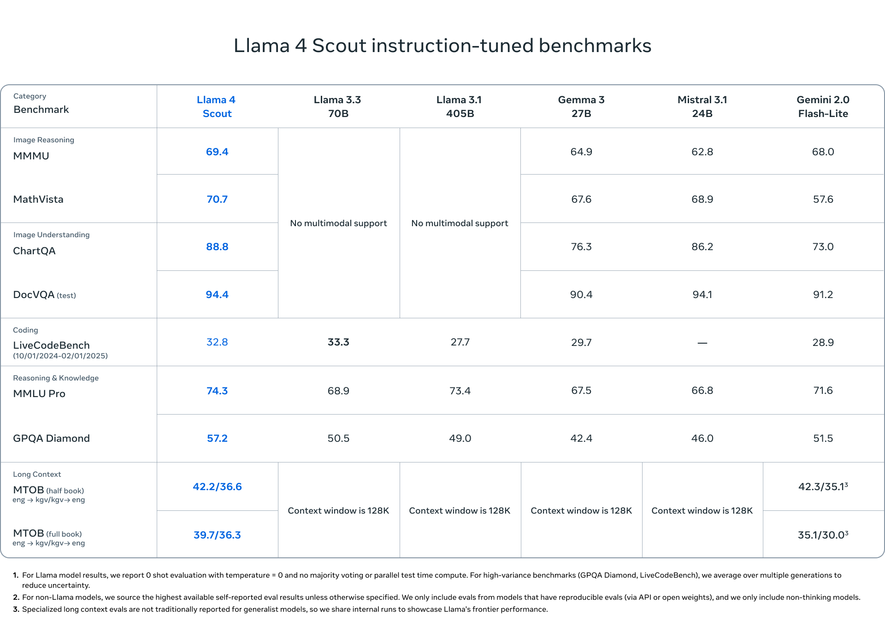
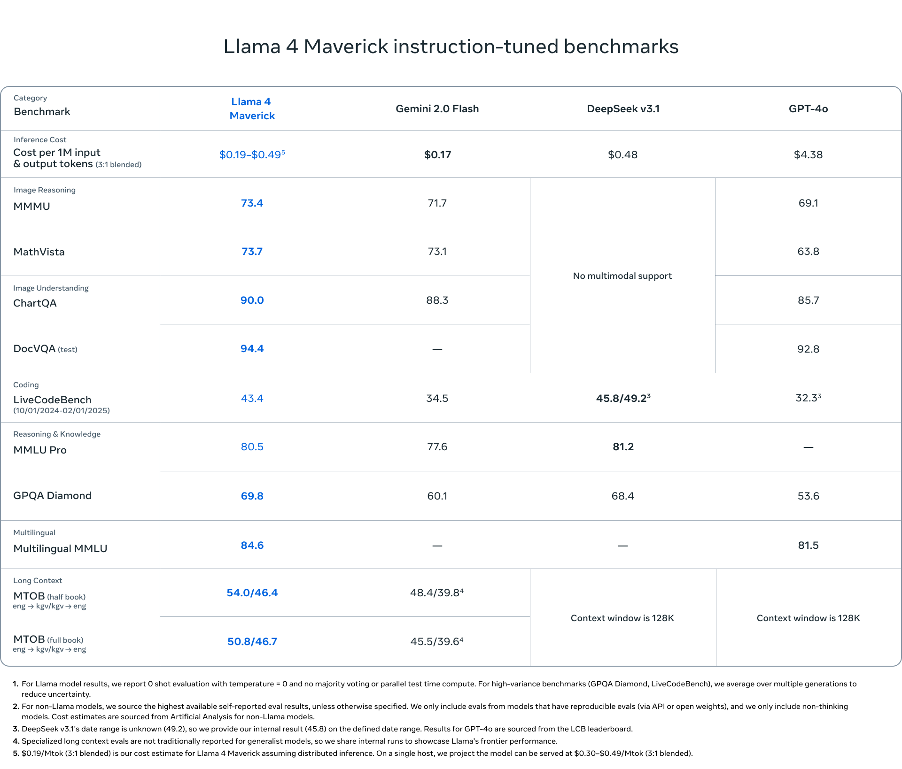
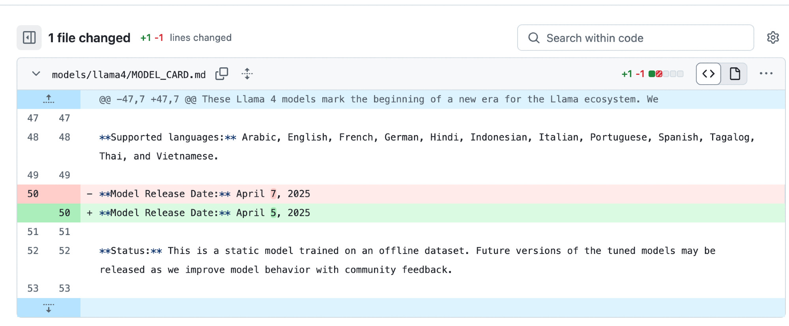
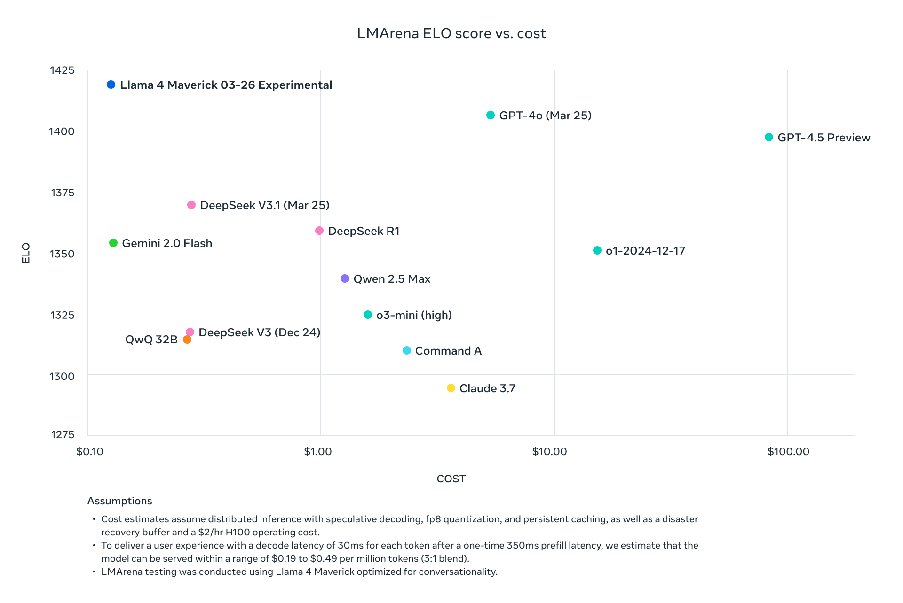

Where Llama 2's and Llama 3's releases were arguably some of the top few events in AI for their respective release years, Llama 4 feels entirely lost. Meta has attempted to reinvent their formula of models with substantial changes in size, architecture, and personality, but a coherent narrative is lacking. Meta has fallen into the trap of taking too long to ship, so the bar is impossible to cross successfully.

Looking back at the history of Meta's major open models, the sequence is as follows:[1](#footnote-1){#footnote-anchor-1 .footnote-anchor component-name="FootnoteAnchorToDOM" target="_self"}

-   **OPT** -- Released **May 3, 2022** ([ai.meta.com](https://ai.meta.com/blog/democratizing-access-to-large-scale-language-models-with-opt-175b/) \| 125M, 350M, 1.3B, 2.7B, 6.7B, 13B, 30B, 66B, 175B): A foundational open model that is underrated in the arc of language modeling research.

-   **LLaMA** -- Released **February 24, 2023** ([ai.meta.com](https://ai.meta.com/blog/large-language-model-llama-meta-ai/) \| 7B, 13B, 33B, 65B): The open weight model that powered the Alpaca age of early open chat models.

-   **Llama 2** -- Released **July 18, 2023** ([our coverage](https://www.interconnects.ai/p/llama-2-from-meta?utm_source=publication-search) \| [about.fb.com](https://about.fb.com/news/2023/07/llama-2/) \| 7B, 13B, 70B[2](#footnote-2){#footnote-anchor-2 .footnote-anchor component-name="FootnoteAnchorToDOM" target="_self"}): The open standard for academic research for its time period. [Chat version had some bumps](https://www.interconnects.ai/p/llama-2-part-2?utm_source=publication-search), but overall a major win.

-   **Llama 3** -- Released **April 18, 2024** ([our coverage](https://www.interconnects.ai/p/llama-3-scaling-open-llms-to-agi-aac?utm_source=publication-search) \| [ai.meta.com](https://ai.meta.com/blog/introducing-meta-llama-3-the-most-capable-openly-available-llm-to-date/) \| 8B, 70B): The open standard for its time. Again, fantastic base models.

-   **Llama 3.1** -- Released **July 23, 2024** ([our coverage](https://www.interconnects.ai/p/llama-405b-open-frontier-model?utm_source=publication-search) \| [ai.meta.com](https://ai.meta.com/blog/introducing-llama-3-1-our-most-capable-models-to-date/) \| 8B, 70B, 405B): Much improved post training and the 405B marked the first time an open weight model competed with GPT-4!

-   **Llama 3.2** -- Released **September 25, 2024** ([our coverage](https://www.interconnects.ai/p/molmo-and-llama-3-vision?utm_source=publication-search) \| [ai.meta.com](https://ai.meta.com/blog/llama-3-2-connect-2024-vision-edge-mobile-devices/) \| 1B, 3B, 11B, 90B): A weird, very underperforming vision release, outshined by Molmo on the same day.

-   **Llama 3.3** -- Released **December 6, 2024** ([github.com](https://github.com/meta-llama/llama-models/blob/main/models/llama3_3/MODEL_CARD.md#L237-L240) \| 70B): Much improved post-training of the smaller 3.1 models, likely in [response to other open releases](https://www.interconnects.ai/p/tulu-3), but largely a minor update.

-   **Llama 4** -- Released **April 5, 2025** ([ai.meta.com](https://ai.meta.com/blog/llama-4-multimodal-intelligence/) \| 17A109B, 17A400B): What we got today.

The time between major versions is growing, and the number of releases seen as exceptional by the community is dropping. Llama 4 consists of 3 models, quoting from the blog post, notes in brackets mine:

> -   Llama 4 Scout, a **17 billion active parameter model with 16 experts \[and 109B total parameters, \~40T training tokens\]**, is the best multimodal model in the world in its class and is more powerful than all previous generation Llama models, while fitting in a single NVIDIA H100 GPU.
>
> -   Llama 4 Maverick, a **17 billion active parameter model with 128 experts \[and 400B total parameters, \~22T training tokens\]**.
>
> -   These models are our best yet thanks to distillation from **Llama 4 Behemoth**, **a 288 billion active parameter \[and 2T total parameters\]** model with 16 experts that is our most powerful yet and among the world's smartest LLMs.... we're excited to share more details about it even while it's still in flight.

Here are the reported benchmark scores for the first two models, which are available on many APIs and to download on HuggingFace.

Where Llama models used to be scaled across different sizes with almost identical architectures, these new models are designed for very different classes of use-cases.

-   Llama 4 Scout is similar to a Gemini Flash model or any ultra-efficient inference MoE.

-   Llama 4 Maverick's architecture is very similar to DeepSeek V3 with extreme sparsity and many active experts.

-   Llama 4 Behemoth is likely similar to Claude Opus or Gemini Ultra, but we don't have substantial information on these.

This release came on a Saturday, which is utterly bizarre for a major company launching one of its highest-profile products of the year. The consensus was that Llama 4 was going to come at Meta's [LlamaCon](https://techcrunch.com/2025/02/18/meta-announces-llamacon-its-first-generative-ai-dev-conference/) later this month. In fact, it looks like this release may have been pulled forward from today, the 7th, from a [commit in the Meta Llama Github](https://github.com/meta-llama/llama-models/commit/1ba7d45b4f6f3f89feed1e6fae8a0c4b8cc2932f):

One of the flagship features is the 10M (on Scout, Maverick is 1M) token context window on the smallest model, but even that didn't have any released evaluations beyond Needle in a Haystack (NIAH), which is seen as a necessary condition, but not one that is sufficient to say it is a good long-context model. Some more modern long-context evaluations include [RULER](https://arxiv.org/abs/2404.06654) or [NoLiMa](https://arxiv.org/abs/2502.05167).[3](#footnote-3){#footnote-anchor-3 .footnote-anchor component-name="FootnoteAnchorToDOM" target="_self"}

[Many](https://x.com/jaxgriot/status/1908908374978429167), [many](https://x.com/TheXeophon/status/1908900306580074741) [people](https://x.com/natolambert/status/1908895656535871936) [have](https://github.com/lm-sys/FastChat/issues/3670#issuecomment-2614213658) commented on how Llama 4's behavior is drastically different in LMArena --- which was their flagship result of the release --- than on other providers (even when following Meta's [recommended system prompt](https://www.llama.com/docs/model-cards-and-prompt-formats/llama4_omni/)). Turns out, from the blog post, that it is just a different model:

> Llama 4 Maverick offers a best-in-class performance to cost ratio with an **experimental chat version** scoring ELO of 1417 on LMArena.

Sneaky. The results below are fake, and it is a major slight to Meta's community to not release the model they used to create their major marketing push. We've seen many open models that come around to maximize on ChatBotArena while destroying the model's performance on important skills like math or code. We'll see where the released models land.

Regardless, here's the plot Meta used. Look at the fine print at the bottom too.

This model is actually the one tanking the technical reputation of the release because its character is juvenile. The actual model on other hosting providers is quite smart and has a reasonable tone!

ArtificialAnalysis rated the models as "[some of the best non-reasoning models](https://x.com/ArtificialAnlys/status/1908890796415414430)," beating leading frontier models. This is complicated because we shouldn't separate reasoning from non-reasoning models; we should just evaluate on reasoning and non-reasoning domains separately, as discussed in the [Gemini 2.5 post](https://www.interconnects.ai/p/gemini-25-pro-googles-second-ai-chance). So-called "reasoning models" often top non-reasoning benchmarks, but the opposite is rarely true.

Other independent evaluation results range from [medium](https://raw.githubusercontent.com/KCORES/kcores-llm-arena/refs/heads/main/scripts/llm_benchmark_results_normalized.png) to [bad](https://eqbench.com/creative_writing_longform.html) and [confusing](https://x.com/paulgauthier/status/1908976568879476843) --- I suspect very weird results are hosting issues with the very long context models. At the same time, the [Behemoth model is outclassed by Gemini 2.5 Pro](https://x.com/emollick/status/1908609043741933914). To list some of the major technical breakthroughs that Meta made (i.e. new to Llama, not new to the industry):

-   Mixture of expert architectures, enabling [Llama 4 to be trained with less compute than Llama 3](https://x.com/scaling01/status/1908657167869100482) even though they have more total parameters --- a lot more.

-   Very long context up to 10M tokens.

-   Solid multimodal input performance on release day (and not a later model)

Sadly this post is barely about the technical details. Meta nuked their release vibes with weird timing and by having an off-putting chatty model that was easiest to find to talk to. The release process, timing, and big picture raise more questions for Meta. Did they panic and feel like this was their one shot at being state of the art?

The evaluation scores for the models are solid, they clear a fairly high bar. With these highly varied MoE architectures, it's super hard to feel confident in an assessment of the model based on benchmarks, especially when compared to dense models or teacher-student distilled models. The very-long-context base models will be extremely useful for research.

The question here is: **Why is Meta designing their models in the same way as other frontier labs** when their audience is open-source AI communities and businesses, not an API serving business or ChatGPT competitor?

The model sizing for the likes of Gemini and ChatGPT is downstream of nuanced decisions based on a balance of training cluster size, inference needs, and performance trade-offs. These trade-offs are very different for open models, where you don't pay inference, and many users are not hyperscale companies.

The model that becomes the "open standard" doesn't need to be the best overall model, but rather a family of models in many shapes and sizes that is solid in many different deployment settings. Qwen 2.5, with [models at 0.5B, 1.5B, 3B, 7B, 14B, 32B, and 72B parameters](https://huggingface.co/collections/Qwen/qwen25-66e81a666513e518adb90d9e), is the closest to this right now. There's actually far less competition in this space than in the space Meta chose to go into (and take on DeepSeek)!

One of these communities historically has been the LocalLlama subreddit, which named the entire community around running models at home around the Llama series of models --- [they're not happy with Llama 4](https://www.reddit.com/r/LocalLLaMA/comments/1jsl37d/im_incredibly_disappointed_with_llama4/). Another community is academics, where the series of models across different size ranges is wonderful for understanding language models and improving methods. These two groups are all GPU-poor, so memory-intensive models like these sparse mixture of experts price out even more participants in the open community (who tend to be memory-limited).

This is all on top of an onerous license that makes all artifacts that use Llama in the process be tagged with the "Llama-" name, the Llama license, the "Built with Llama" branding if used commercially, and use-case restrictions. This is at the same time when their competitors, i.e. DeepSeek, released their latest flagship model with an MIT license (which has no downstream restrictions).

A third group is potential businesses looking to [use open models on-premises as open models close the gap to closed counterparts](https://www.interconnects.ai/i/158931739/the-state-of-the-open-closed-model-gap). These feel like groups that would be sensitive to the extra legal risk that Llama's license exposes them to.

On top of all of this weirdness, many of Meta's "open-source" efforts are restricted in the European Union. Where the Llama 3.2 models blocked you if you tried to access them from Europe, Llama 4 is available for download but prohibits the use of vision capabilities in an [acceptable use policy](https://www.llama.com/llama4/use-policy/). This is not entirely Meta's fault, as many companies are dealing with side effects of the EU AI Act, but regulatory exposure needs to be considered in Meta's strategy.

Meta had a tight grasp on these communities, the Llama projects were rightfully loved, but now they feel lost. With Qwen 3 around the corner and countless other amazing open-weight models out now (and many more teased, [such as from OpenAI](https://natolambert.substack.com/p/some-thoughts-on-openai-returning)), the competition is extreme.

The soul of the Llama series died by not releasing enough models frequently enough. Reclaiming that with [GenAI's constant organizational headaches](https://x.com/natolambert/status/1882482021844549867) looks like a Sisyphean task. What is Meta's differentiation in the AI space? It still seems about enabling their own platforms to flourish, not about truly supporting open.

Meta's GenAI organization has been showing major signs of cultural challenges thoughout its entire existence --- including their [head of AI research](https://www.bloomberg.com/news/articles/2025-04-01/meta-s-head-of-ai-research-to-leave-roiling-investment-push) leaving just a few days before this model was launched (even though this was likely unrelated to Llama 4).

::: {.digest-post-embed attrs="{\"nodeId\":\"7365cdfb-8a08-46b1-8ada-33d81e9c1157\",\"caption\":\"It is a closely guarded secret how the leading AI laboratories structure their training teams. As with other technology companies, the saying “you ship your org chart” still applies to training AI models. Looking at these organizational structures will reveal where research can be scaled up, the upper limits of size, and potentially even who uses the mo…\",\"cta\":null,\"showBylines\":true,\"size\":\"sm\",\"isEditorNode\":true,\"title\":\"Managing frontier model training organizations (or teams)\",\"publishedBylines\":[{\"id\":10472909,\"name\":\"Nathan Lambert\",\"bio\":\"ML researcher making sense of AI research, products, and the uncertain technological future. PhD from Berkeley AI. Experience at Meta, DeepMind, HuggingFace.\",\"photo_url\":\"https://substackcdn.com/image/fetch/f_auto,q_auto:good,fl_progressive:steep/https%3A%2F%2Fsubstack-post-media.s3.amazonaws.com%2Fpublic%2Fimages%2F8fedcdfb-e137-4f6a-9089-a46add6c6242_500x500.jpeg\",\"is_guest\":false,\"bestseller_tier\":100}],\"post_date\":\"2025-03-19T12:03:41.027Z\",\"cover_image\":\"https://substack-post-media.s3.amazonaws.com/public/images/287f9d75-953d-4796-9fd4-e0a629d3842b_1280x720.png\",\"cover_image_alt\":null,\"canonical_url\":\"https://www.interconnects.ai/p/how-to-manage-ai-training-organizations\",\"section_name\":null,\"video_upload_id\":null,\"id\":157203314,\"type\":\"newsletter\",\"reaction_count\":39,\"comment_count\":0,\"publication_name\":\"Interconnects\",\"publication_logo_url\":\"https://substackcdn.com/image/fetch/f_auto,q_auto:good,fl_progressive:steep/https%3A%2F%2Fsubstack-post-media.s3.amazonaws.com%2Fpublic%2Fimages%2Fe70f9dbf-4fe6-404c-b6bb-1831d1b7ed0b_590x590.png\",\"belowTheFold\":true}"}
:::

Sadly, the evaluations for this release aren't even the central story. The vibes have been off since the beginning by choosing a weird release date. Over the coming weeks, more and more people will find reliable uses for Llama 4, but in a competitive landscape, that may not be good enough. Llama is no longer the open standard. Personally, this makes me sad. As an American, I want the default pieces of the [open ecosystem to be run by American or American-friendly companies](https://www.interconnects.ai/p/making-the-us-the-home-for-open-source).

With the macro pressure coming to Meta's business and the increasing commoditization of open models, how is Zuckerberg going to keep up in face of shareholder pressure pushing back against the cost of the Llama project? This isn't the first time he's done so, but he needs to reevaluate the lowest level principles of their approach to open AI.

:::: {.footnote component-name="FootnoteToDOM"}
[1](#footnote-anchor-1){#footnote-1 .footnote-number contenteditable="false" target="_self"}

::: footnote-content
[Galactica](https://arxiv.org/abs/2211.09085) is related and important to history too, but feels like a different line of work that was abandoned (even though it shouldn't have been).
:::
::::

:::: {.footnote component-name="FootnoteToDOM"}
[2](#footnote-anchor-2){#footnote-2 .footnote-number contenteditable="false" target="_self"}

::: footnote-content
30B omitted for safety reasons.
:::
::::

:::: {.footnote component-name="FootnoteToDOM"}
[3](#footnote-anchor-3){#footnote-3 .footnote-number contenteditable="false" target="_self"}

::: footnote-content
Seems like a related architecture to this paper: https://arxiv.org/abs/2501.18795
:::
::::
