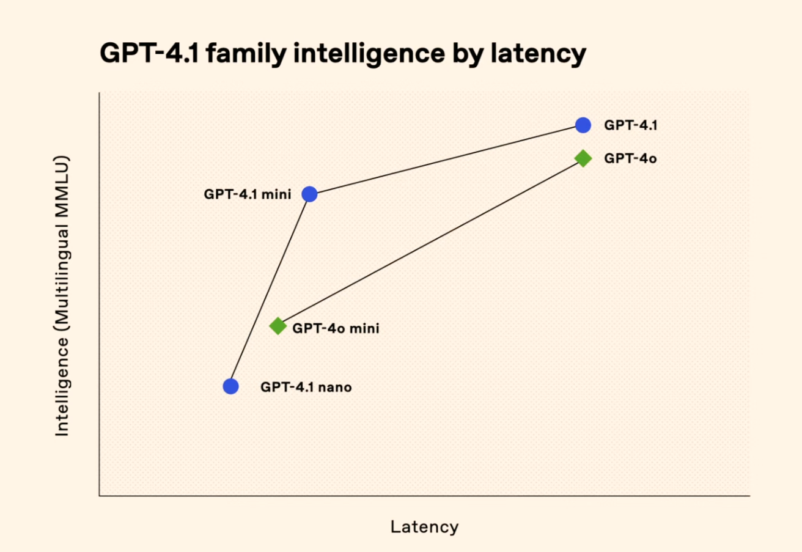
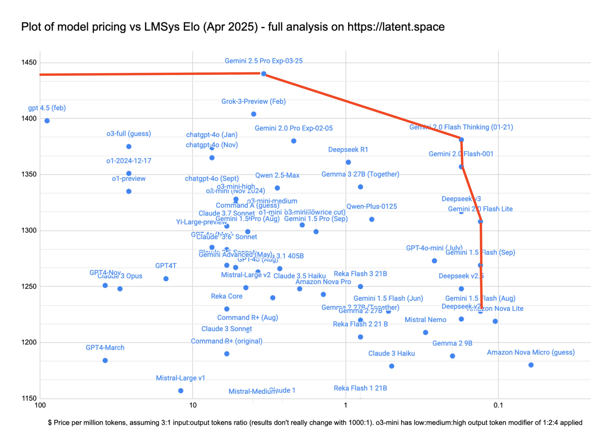
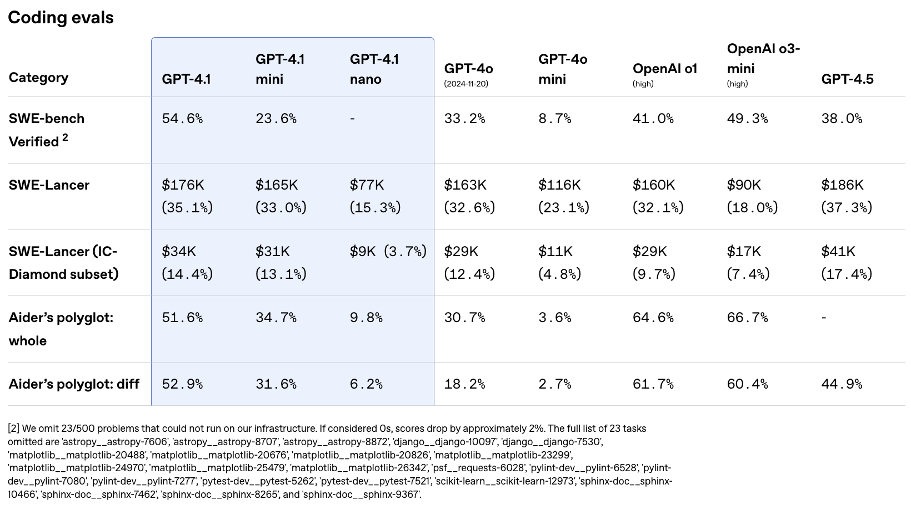
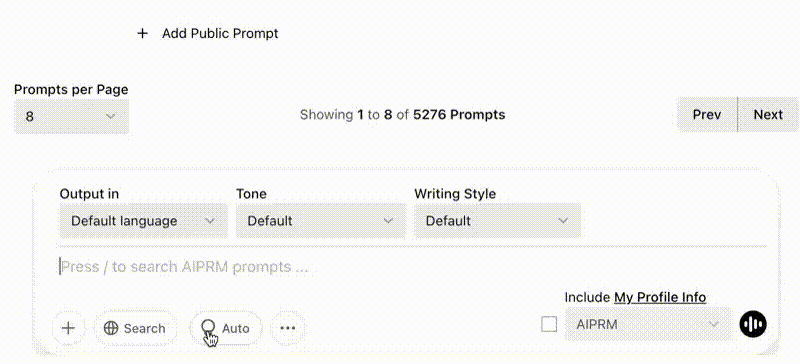

*Recently I gave another [talk on RLVR](https://www.youtube.com/watch?v=zYeIqzULzr0) experiments and I posted some thoughts [on OLMoTrace](https://natolambert.substack.com/p/looking-at-the-training-data) --- Ai2's recent tool to let you look at the training data of OLMo 2.*

------------------------------------------------------------------------

OpenAI has been making many small updates toward their vision of ChatGPT as a monolithic app separate from their API business. Last week [OpenAI improved the ChatGPT memory feature](https://openai.com/index/memory-and-new-controls-for-chatgpt/) --- making it so the app can reference the text of previous chats in addition to basic facts about the user. Today, OpenAI announced a new suite of API-only models, GPT 4.1, which is very directly in competition with Google's Gemini models.

Individually, none of OpenAI's recent releases are particularly frontier-shifting --- comparable performance per dollar models exist --- but together they paint a picture of where OpenAI's incentives are heading. This is the same company that recently *teased* that it has [hit 1 billion weekly active users](https://www.forbes.com/sites/martineparis/2025/04/12/chatgpt-hits-1-billion-users-openai-ceo-says-doubled-in-weeks/#:~:text=1%20Billion%20Users%3F-,'Doubled%20In%20Just%20Weeks'%20Says%20OpenAI%20CEO,ByMartine%20Paris%2C&text=OpenAI's%20CEO%20Sam%20Altman%20might,in%20just%20a%20few%20weeks.). This is the company that needs to treat ChatGPT and the models that power it very differently from any other AI product on the market. The other leading AI products are all for coding or information, where personality, vibes, and entertainment are not placed on as high a premium.

A prime example of this shift is that GPT-4.5 is being deprecated from the API (with its extreme pricing), but is [going to remain in ChatGPT](https://x.com/OpenAIDevs/status/1911860805810716929) --- where Sam Atlman has repeatedly said he's blown away by how much users love it. I use it all the time, it's an interesting and consistent model.

Among their major model releases, such as o3, o4, or the forthcoming open model release, it can be hard to reinforce the high-level view and see where OpenAI is going.

A quick summary of the model performance comes from this chart that OpenAI released in the live stream (and [blog post](https://openai.com/index/gpt-4-1/)):

Chart crimes aside (using MMLU as y-axis in 2025, no measure of latency, no axis labels), the story from OpenAI is the simple takeaway --- better models at faster inference speeds, which are proportional to cost. Here's a price comparison of the new OpenAI models ([Gemini Pricing](https://ai.google.dev/gemini-api/docs/pricing), [OpenAI pricing](https://openai.com/api/pricing/)):

-   **GPT-4.1**: Input/Output: \$2.00 / \$8.00 \| Cached Input: \$0.50

-   **GPT-4.1 Mini**: Input/Output: \$0.40 / \$1.60 \| Cached Input: \$0.10

-   **GPT-4.1 Nano**: Input/Output: \$0.10 / \$0.40 \| Cached Input: \$0.025

And their old models:

-   **GPT-4o**: Input/Output: \$2.5 / \$10.00 \| Cached Input: \$1.25

-   **GPT-4o Mini**: Input/Output: \$0.15 / \$0.60 \| Cached Input: \$0.075

To Google's Gemini models:

-   **Gemini 2.5 Pro\* (≤200K tokens)**: Input/Output: \$1.25 / \$10.00 \| Cached: Not available

-   **Gemini 2.5 Pro\* (\>200K tokens)**: Input/Output: \$2.50 / \$15.00 \| Cached: Not available

-   **Gemini 2.0 Flash**: Input/Output: \$0.10 / \$0.40 \| Cached Input: \$0.025 (text/image/video), \$0.175 (audio)

-   **Gemini 2.0 Flash-Lite**: Input/Output: \$0.075 / \$0.30 \| Cached: Not available

\*As a reasoning model, Gemini 2.5 Pro will use many more tokens, which are also charged to the user.

The academic evaluations are strong, but that isn't the full picture for these small models that need to do repetitive, niche tasks. These models are clearly competition with Gemini Flash and Flash-Lite (Gemini 2.5 Flash [coming soon](https://developers.googleblog.com/en/gemini-2-5-flash-pro-live-api-veo-2-gemini-api/) following the [fantastic release of Gemini 2.5 Pro](https://www.interconnects.ai/p/gemini-25-pro-googles-second-ai-chance) --- expectations are high). GPT-4o-mini has largely been accepted as laggard and hard to use relative to Flash.

To win in the API business, OpenAI needs to crack this frontier from Gemini:

There are many examples in the OpenAI communications that paint a familiar story with these releases --- broad improvements --- with few details as to why. These models are almost assuredly distilled from GPT-4.5 for personality and reasoning models like o3 for coding and mathematics. For example, there are very big improvements in code evaluations, where some of their early models were "off the map" and effectively at 0.

Evaluations like coding and mathematics still fall clearly short of the likes of Gemini 2.5 (thinking model) or Claude 3.7 (optional thinking model). This shouldn't be surprising, but is worth reminding ourselves of. While we are early in a paradigm of models shifting to include reasoning, the notion of a single best model is messier. These reasoning models use far more tokens to achieve this greatly improved performance. Performance is king, but tie goes to the cheaper model.

I do not want to go into detail about OpenAI's entire suite of models and naming right now because it does not make sense at all. Over time, the specific models are going to be of less relevance in ChatGPT (the main thing), and different models will power ChatGPT than those used in the API. We've already seen this with o3 powering only Deep Research for now, and OpenAI only recently walked back the line that "these models won't be available directly."

Back to the ChatGPT side of things. For most users, the capabilities we are discussing above are effectively meaningless. For them, the dreaded slider of model effort makes much more sense:

The new memory feature from last week got mixed reviews, but the old (simple) memory has been something I really enjoy about using ChatGPT. I don't have to remind it that my puppy is a X week old miniature schnauzer or the context of my work. This'll continue to get better over time.

This feels extremely similar to as when I didn't really notice when ChatGPT first added the search option, but now it feels like an essential part of my use (something that Claude still hasn't felt like it does well on). [Claude was my daily driver for personality](https://www.interconnects.ai/p/switched-to-claude-from-chatgpt), but with great search and a rapidly improving personality, ChatGPT was indispensable. Still, Gemini 2.5 Pro is a better model, but not in a better interface.

I strongly expect that the memory feature will evolve into something I love about ChatGPT. It'll be much easier to ask ChatGPT to remind you of that thing you found a couple months ago than it would be to try and parse your Google search history.

Some were skeptical of these new memories from crossing personal and work uses, but I think with search, this is easy, rather than algorithmic feeds that try to balance all your interests in one. The funnel is per use, and interactions are more narrow and seem easier technically to get right.

A final related point --- people have long balked at the prices of chat interfaces relative to the API, but the reality that is fast approaching is that the personal experiences only exist in the app, and these are what people love. With the API, you could build a competition that accumulates its own interactions, but as OpenAI has a huge product head start, this will be an uphill battle.

All of this reinforces what we know --- products are the key to developments in AI right now. Memory and better separation of the ChatGPT lineage from the API helps OpenAI pave that path forward (and maybe do advertising, especially with memory), but we have a long way until it is fully realized.
