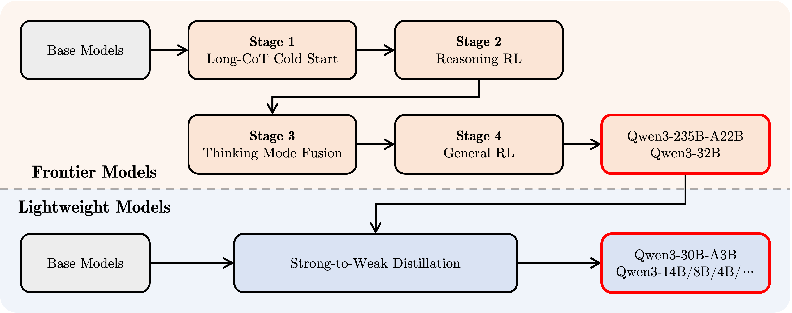
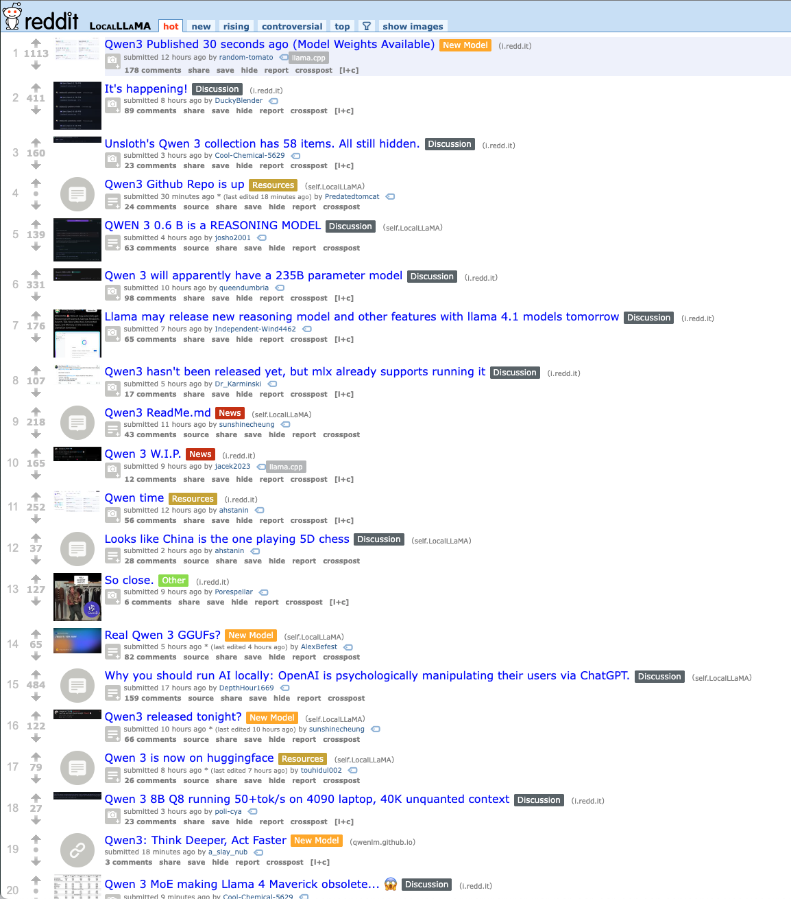

##### No audio for this quick, technical release recap post. I've made a couple minor updates post-email send. Edit 04/29: Updated license line, they're all Apache 2.0, and added uncertainty to training tokens (smaller models don't use full budget). Edit 05/04: Qwen DID NOT release the base models for their two biggest models, which I just learned today.

Alibaba's long-awaited Qwen 3 open model suite is finally here, and it checks all the boxes for a strong open release: Extremely strong benchmark scores, a diversity of model sizes, reasoning on & off, and permissive licenses ([blog post](https://qwenlm.github.io/blog/qwen3/), [artifacts](https://huggingface.co/collections/Qwen/qwen3-67dd247413f0e2e4f653967f)). 2025 continues to be by far and away the best year to build with open model since ChatGPT was launched.

The Qwen3 models' scores are so good that we now get to see the conversation unfold as to whether Qwen's models have the character and staying power of DeepSeek R1 and other recent entrants in the frontier model club. This is a major achievement --- one that is downstream of substantial compute and personnel investment.

Qwen released 6 instruct models along with their base versions (edit except for 32B and larger MoE, which is surprising!) and quantized variants, including two sparse mixture of expert (MoE) models Qwen3-235B-A22B and Qwen3-30B-A3B[1](#footnote-1){#footnote-anchor-1 .footnote-anchor component-name="FootnoteAnchorToDOM" target="_self"} that both have similar sparsity factors to the DeepSeek MoE architecture and 6 dense models 32B, 14B, 8B, 4B, 1.7B, and 0.6B parameters --- all models with the Apache 2.0 License. For reference, the smallest [Llama 4](https://www.interconnects.ai/p/llama-4) model still has 109B total parameters and the [32B range](https://www.interconnects.ai/p/gemma-3-olmo-2-32b-and-the-growing) is known to be very popular with open model users!

The benchmarks for the fully trained, largest models are included below (Note that they don't benchmark versus some recent models, such as o3). The evaluations are likely all with thinking mode on and for the maximum tokens (not documented).

And the scores for the leading smaller models. A 4B dense model being competitive in the same table as GPT-4 or DeepSeek V3 is insane.

The base model evaluations that the Qwen team includes show how similar the scores are across the leading base models, Llama 4, DeepSeek V3, and now Qwen:

The differentiating factor right now across models is in the post-training, especially with reasoning enabling inference-time compute that can take an evaluation score from a 40% range to an 80% range. What denotes a "base model" above is also very messy, as a lot of mid-training is done on these models, where they see instruction and reasoning data in order to prepare for post-training.

No research labs have done the research publicly on what makes a useful base model for downstream post-training in general, so we can assume all of these laboratories are tuning pre-training to meet their own needs at post-training --- not the needs of the open community specifically (of course, we benefit).

When Llama 4 inevitably releases a reasoning model, which may be tomorrow, they're going to suddenly look relevant again. This distortion of reasoning vs. non-reasoning models makes keeping track of these releases far harder. All of the Qwen3 model scores are reasoning models, and that helps them look super strong.

Most of my analysis will rely on the post-training methods they used, which is very close to the [DeepSeek R1 recipe](https://www.interconnects.ai/p/deepseek-r1-recipe-for-o1) with an SFT training to seed CoT behaviors, followed by a large-scale reasoning RL stage, and finally traditional preference-based RL. This was followed only for the two "frontier" models, Qwen3-235B-A22B and Qwen3-32B.

The other, smaller models went through what they called "Strong-to-Weak Distillation." This method is not clearly documented, but likely mostly involves instruction / SFT tuning on a large amount of synthetic data from their larger models. This distillation being SFT focused is likely to create models that are very strong on benchmarks, but potentially less robust on a wider domain of tasks. More testing is needed to know for sure, and because we have the base models, more folks are going to apply their own post-training stacks to these models!

Their post-training techniques include thinking on-off toggles, as we have seen with [Grok 3](https://www.interconnects.ai/p/grok-3-and-an-accelerating-ai-roadmap), [Claude 3.7](https://www.interconnects.ai/p/claude-3-7-thonks), and open models like [Nvidia's recent Nemotron release](https://huggingface.co/nvidia/Llama-3_3-Nemotron-Super-49B-v1). They've created very nice inference-time scaling plots by varying the token budget of the models.

The model used for the above plot isn't documented, but by the looks of the scores, it looks to be their biggest model, Qwen3-235B-A22B. These are very serious gains of evals!

Onto the quick notes part of the post --- many of the questions I pose here will likely come in a technical report in the coming weeks:

-   This release is a **major validation of the DeepSeek R1 recipe and distillation** in general. The smaller Qwen3 models could potentially be improved further with more RL training, as DeepSeek discussed in their R1 report.

-   The pretraining token numbers are crazy (and in-line with [Llama 4 pretraining](https://huggingface.co/meta-llama/Llama-4-Scout-17B-16E-Instruct), which is \~40T for scout, \~22T multimodal for Maverick; or DeepSeek V3 at \~15T). Qwen detailed that they use \>30T tokens of general data and 5T tokens of "high quality" data, which is more than our entire training budget at Ai2 for OLMo (or outputs from other smaller open model shops).\
    \
    *Edit:* The full token training budget is just for the biggest models, as the smallest models surely did not train for that long (as done with Qwen 2.5). A realistic estimate is that all model sizes were trained for 2X as long as Qwen 2.5.

-   **Qwen3 is not natively multimodal**, so they could be taking a hit here relative to [Llama 4](http://Llama%204) and an industry that seems to be moving towards earlier fusion like GPT-4o (and maybe training on YouTube). The community is looking for models with tool use and vision to make computer-use agents.

-   Qwen3 is the best of both worlds for open models --- **peak performance and size scales** --- DeepSeek style or quality for the leading model, yet fully accessible model size suite like Llama 1, 2, and 3.

-   **Qwen3 shows how algorithmic and data improvements are enabling models to get much smaller**. The blog post details density improvements of \~50%: \"For instance, Qwen3-1.7B/4B/8B/14B/32B-Base performs as well as Qwen2.5-3B/7B/14B/32B/72B-Base, respectively.\"\
    \
    These numbers are inflated because Qwen 2.5 was not a suite of reasoning models, and modern post-training has enabled crazy hill climbing on the evals that are currently in vogue.

-   In an [ICLR workshop panel on open models](https://open-foundation-model.github.io/), Junyang Lin from Qwen said roughly that they "need 100 people to make a good general purpose model."

-   The **licenses are very good, with all the ~~smaller~~ models being Apache 2.0 ~~and the Qwen license historically~~ being far more permissive than Llama** *(edited)*. When you finetune a model built with Qwen in the past, you could do something like choose your license and add "built with Qwen" to the model documentation.

-   The **tool use** in open models is very interesting and hard to quickly test. Llama has this too, which could be a running theme on open models in 2025 to keep an eye on.

-   **We\'ll start to see if Qwen has taste/vibes**. They have the benchmarks complete, and now we\'ll see how they compare to the likes of R1, o3, and Gemini 2.5 Pro for staying power at the frontier.\
    \
    My sense from limited trials and reading folks I know online is that these models aren't quite as robust as the best models we are used to today. This is still a major achievement and a normal path for labs --- get benchmark scores and then figure out how to make what users like. Benchmark excitement is often what opens the top of the funnel to get people to try your models, which in turn returns valuable prompts and user data.\
    \
    We need more testing to know for sure!

-   Qwen3 was a **very high quality release** with tools integrated in countless open libraries like HuggingFace, VLLM, SGLang, etc.

-   The reasoning chains for Qwen start with "[Okay](https://www.reddit.com/r/LocalLLaMA/comments/1k9zhrl/comment/mpi6a2b/?utm_source=share&utm_medium=web3x&utm_name=web3xcss&utm_term=1&utm_content=share_button')," much like DeepSeek R1's. This suggests they used R1 to help train their model, which most companies trying to catch up should be doing, given it's permissibly licensed. Another example is below:

This is really a wonderful release, and the Qwen team should be very proud! These models are going to be used extensively. I expect to start using them very soon for my research at Ai2.

------------------------------------------------------------------------

### The bigger picture

In many ways, open-weight AI models seem like the most effective way for Chinese companies to gain market share in the United States. These models are just huge lists of numbers and will never be able to send data to China, but they still convey extreme business value without opening the rabbit holes of concern over sending any data to a Chinese company. We'll continue to hear discussions of this, especially with DeepSeek's R2 being hyped up and rumored to come soon (even if I don't believe the rumors).

These open-weight Chinese companies are doing a fantastic job of exerting soft power on the American AI ecosystem. We can all benefit from them technologically.

For the fun of it, I leave you with Qwen taking over the LocalLlama subreddit. The level of competition for all types of models is extreme right now. For the time being, the default is Qwen. This is the first time they've resoundingly dethroned Llama.

*We may be hearing more from Meta tomorrow with Llama 4 reasoning models at LlamaCon. If the model scores are of a similar quality without substantial documentation, I won't need to write again and repeat myself. The biggest differentiator is that Qwen3 has the small models to go with it. Maybe we'll get that from Meta too, but that isn't what forecasters are predicting.*

PS. we love the capybaras!

:::: {.footnote component-name="FootnoteToDOM"}
[1](#footnote-anchor-1){#footnote-1 .footnote-number contenteditable="false" target="_self"}

::: footnote-content
The notation here Qwen-NNNB-MMMB means that it has NNN total parameters and MMM active parameters per-token at inference.
:::
::::
