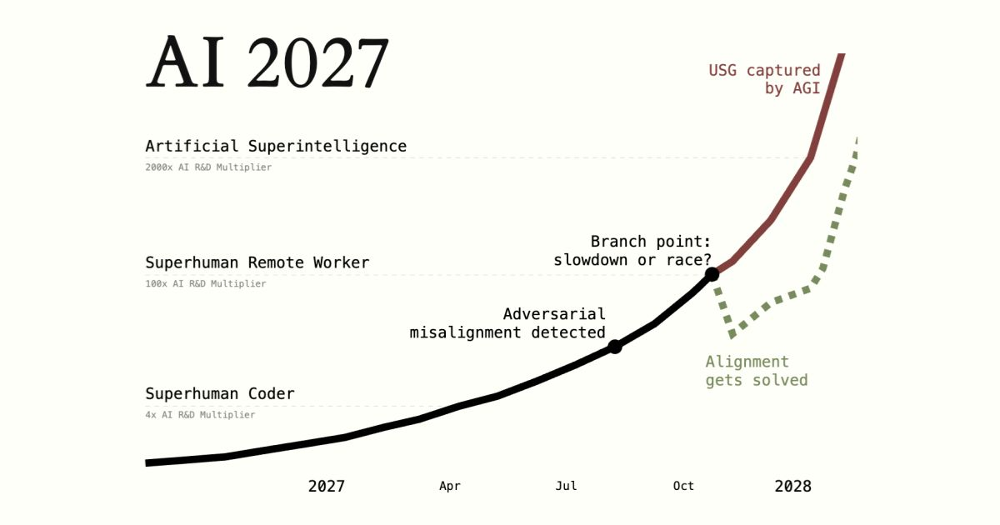
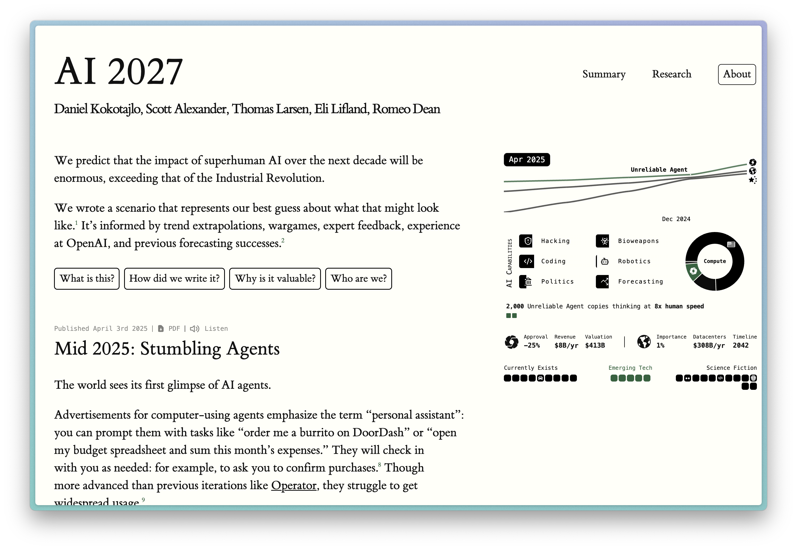
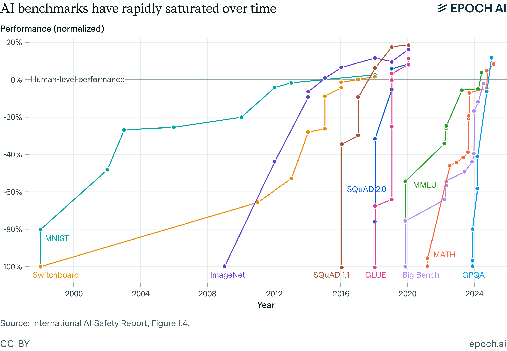
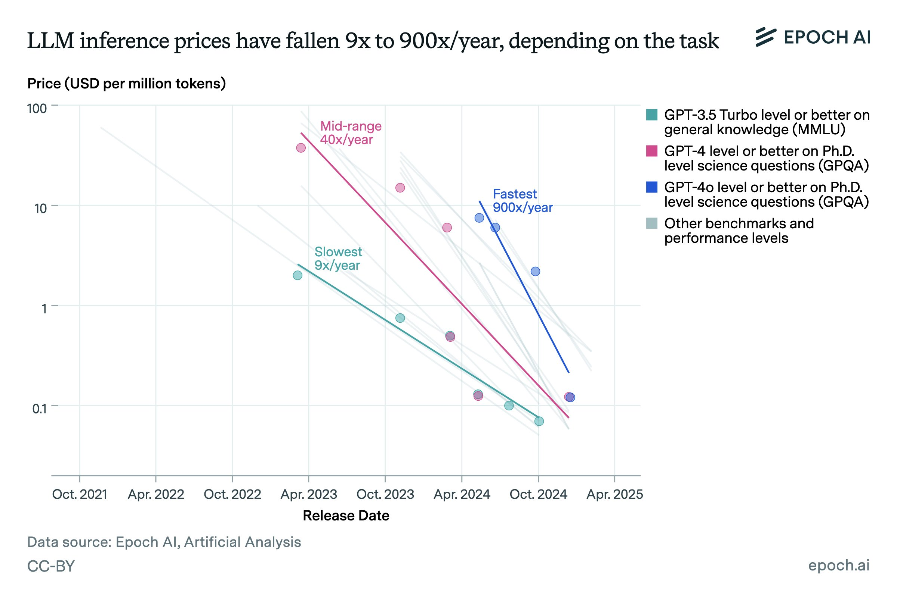

Intelligence explosions are far from a new idea in the technological discourse. They're a natural thought experiment that follows from the question: What if progress keeps going?

From [Wikipedia](https://en.wikipedia.org/wiki/Technological_singularity):

> The **technological singularity**---or simply the **singularity**---is a [hypothetical](https://en.wikipedia.org/wiki/Hypothetical) point in time at which technological growth becomes uncontrollable and irreversible, resulting in unforeseeable consequences for [human civilization](https://en.wikipedia.org/wiki/Human_civilization). According to the most popular version of the singularity hypothesis, [I. J. Good](https://en.wikipedia.org/wiki/I._J._Good)\'s [intelligence explosion](https://en.wikipedia.org/wiki/Technological_singularity#Intelligence_explosion) model of 1965, an upgradable [intelligent agent](https://en.wikipedia.org/wiki/Intelligent_agent) could eventually enter a positive feedback loop of successive [self-improvement](https://en.wikipedia.org/wiki/Recursive_self-improvement) cycles; more intelligent generations would appear more and more rapidly, causing a rapid increase (\"explosion\") in intelligence which would culminate in a powerful [superintelligence](https://en.wikipedia.org/wiki/Superintelligence), far surpassing all [human intelligence](https://en.wikipedia.org/wiki/Human_intelligence).

Given the recent progress in AI, it's understandable to revisit these ideas. With the local constraints governing decisions within labs, if you extrapolate them, the natural conclusion is an explosion.

Daniel Kokotajlo et al.'s [AI 2027](https://ai-2027.com/) forecast is far from a simple forecast of what happens without constraints. It's a well thought out exercise on forecasting that rests on a few key assumptions of AI research progress accelerating due to improvements in extremely strong coding agents that mature into research agents with better experimental understanding. The core idea here is that these stronger AI models enable AI progress to change from 2x speed all the way up to 100x speed in the next few years. This number includes *experiment time* --- i.e., the time to train the AIs --- not just implementation time.

This is very unlikely. This forecast came at a good time for a summary of many ways the AI industry is evolving. What does it mean for AI as a technology to mature? How is AI research changing? What can we expect in a few years?

In summary, AI is getting more robust in areas we know it can work, and we're consistently finding a few new domains of value where it can work extremely well. There are no signs that language model capabilities are on an arc similar to something like AlphaGo, where reinforcement learning in a narrow domain creates an intelligence way stronger than any human analog.

This post has the following sections:

1.  How labs make progress on evaluations,

2.  Current AI is broad, not narrow intelligence,

3.  Data research is the foundation of algorithmic AI progress,

4.  Over-optimism of RL training,

In many ways, this is more a critique of the AGI discourse generally, inspired by AI 2027, rather than a critique specifically of their forecast.

In this post, there will be many technical discussions of rapid, or even accelerating, AI research progress. Much of this falls into a technocentric world view where technical skill and capacity drive progress, but in reality, the biggest thing driving progress in 2025 is likely steep industrial competition (or international competition!). AI development and companies are still a very human problem and competition is the most proven catalyst of performance.

*See [AI 2027](https://ai-2027.com/) in its entirety, [Scott Alexander's reflections](https://www.astralcodexten.com/p/my-takeaways-from-ai-2027), their [rebuttal to critiques that AI 2027 was ignoring China](https://blog.ai-futures.org/p/why-america-wins), Zvi's [roundup of discussions](https://thezvi.substack.com/p/ai-2027-responses?open=false#%C2%A7matthew-barnett-debates-how-to-evaluate-the-results), or their [appearance on the Dwarkesh Podcast](https://www.youtube.com/watch?v=htOvH12T7mU&t=8357s&ab_channel=DwarkeshPatel). They definitely did much more editing and cohesiveness checks than I did on this response!*

## 1. How labs make progress on evaluations

One of the hardest things to communicate in AI is talking down the various interpretations of evaluation progress looking vertical over time. If the evals are going from 0 to 1 in one year, doesn't that indicate the AI models are getting better at everything super fast? No, this is all about how evaluations are scoped as "reasonable" in AI development over time.

None of the popular evaluations, such as MMLU, GPQA, MATH, SWE-Bench, etc., that are getting released in a paper and then solved 18 months later are truly held out by the laboratories. They're training goals. If these evaluations were unseen tests and going vertical, you should be much more optimistic about AI progress, but they aren't.

Consider a recent evaluation, like Frontier Math or Humanity's Last Exam. These evaluations are introduced with a performance of about 0-5% on leading models. Soon after the release, new models that could include data formatted for them are scoring above 20% (e.g. o3 and Gemini 2.5 Pro). This evaluation will continue to be the target of leading labs, and many researchers will work on improving performance directly.

With these modern evaluations, they can become increasingly esoteric and hard for the sake of being hard. When will a power user of ChatGPT benefit from a model that solves extremely abstract math problems? Unlikely.

The story above could make more sense for something like MATH, which are hard but not impossible math questions. In the early 2020s, this was extremely hard for language models, but a few clicks of scaling made accurate mathematics a reasonable task, and laboratories quickly added similar techniques to the training data.

So this is how you end up with the plot from Epoch AI below --- AI researchers figure out that a new evaluation is fair game for hill climbing with current techniques, and then they go all in on it.

Or the analogous version that can look even more shocking --- the price falling for certain evaluations. This is from 2 factors --- laboratories getting better and better at core abilities in certain evaluations and language model training getting far more efficient. Neither of these means that intelligence is rocketing. This is a normal technological process --- extreme efficiency at tasks we know we can do well.

In fact it is a common job at AI laboratories to make new data that looks very close to population evaluations. These laboratories can't train on the test set directly for basic reasons of scientific integrity, but they can pay thousands to millions of dollars for new training data that looks practically identical. This is a very common practice and makes the hillclimbing on evaluations far less extraordinary.

AI capabilities in domains we are measuring aren\'t accelerating, they're continuing. At the same time, AI's abilities are expanding outwards into new domains. AI researchers solve domains when we focus on them, not really by accident. Generalization happens sometimes, but it is messy to track and argue for.

As the price of scaling kicks in, every subsequent task is getting more expensive to solve. The best benchmarks we have are correlated with real, valuable tasks, but many are not.

## 2. Current AI is broad, not narrow intelligence

Instead of thinking of stacking rapid evaluation progress on one line in a cumulative, rapid improvement in intelligence, the above plots should make one think that AI is getting better at many tasks, rather than being superhuman in narrow tasks.

In a few years, we'll look back and see that AI is now 95% robust on a lot of things that only worked 1-5% of the time today. A bunch of new use cases will surprise us as well. We won't see AI systems that are so intelligent that they cause seismic shifts in the *nature* of certain domains. Software will still be software. AI will be way better than us at completing a code task and finding a bug, but the stacks we are working on will be largely subject to the same constraints.

Epoch AI had a very complementary post to this view.

::::::::: {.embedded-post-wrap attrs="{\"id\":159572209,\"url\":\"https://epochai.substack.com/p/most-ai-value-will-come-from-broad\",\"publication_id\":3755861,\"publication_name\":\"Epoch AI\",\"publication_logo_url\":\"https://substackcdn.com/image/fetch/f_auto,q_auto:good,fl_progressive:steep/https%3A%2F%2Fsubstack-post-media.s3.amazonaws.com%2Fpublic%2Fimages%2Fc08d0a94-9216-4b70-b2c4-fee34514c619_600x600.png\",\"title\":\"Most AI value will come from broad automation, not from R&D\",\"truncated_body_text\":\"A popular view about the future impact of AI on the economy is that it will be primarily mediated through AI automation of R&D. In some form or another, this view has been expressed by many influential figures in the industry:\",\"date\":\"2025-03-21T21:30:57.447Z\",\"like_count\":0,\"comment_count\":1,\"bylines\":[{\"id\":310306856,\"name\":\"Ege Erdil\",\"handle\":\"egeerdil\",\"previous_name\":null,\"photo_url\":\"https://substackcdn.com/image/fetch/f_auto,q_auto:good,fl_progressive:steep/https%3A%2F%2Fsubstack-post-media.s3.amazonaws.com%2Fpublic%2Fimages%2Fd3895e51-c105-4815-a440-01f9a3119508_144x144.png\",\"bio\":null,\"profile_set_up_at\":null,\"reader_installed_at\":null,\"publicationUsers\":[{\"id\":3995735,\"user_id\":310306856,\"publication_id\":3918970,\"role\":\"admin\",\"public\":true,\"is_primary\":false,\"publication\":{\"id\":3918970,\"name\":\"Ege Erdil\",\"subdomain\":\"egeerdil\",\"custom_domain\":null,\"custom_domain_optional\":false,\"hero_text\":\"\",\"logo_url\":null,\"author_id\":310306856,\"theme_var_background_pop\":\"#FF6719\",\"created_at\":\"2025-01-27T20:47:24.262Z\",\"email_from_name\":null,\"copyright\":\"Ege Erdil\",\"founding_plan_name\":null,\"community_enabled\":true,\"invite_only\":false,\"payments_state\":\"disabled\",\"language\":null,\"explicit\":false,\"homepage_type\":\"profile\",\"is_personal_mode\":true}}],\"is_guest\":false,\"bestseller_tier\":null},{\"id\":310991318,\"name\":\"Matthew Barnett\",\"handle\":\"matthewepochai\",\"previous_name\":null,\"photo_url\":\"https://substackcdn.com/image/fetch/f_auto,q_auto:good,fl_progressive:steep/https%3A%2F%2Fsubstack-post-media.s3.amazonaws.com%2Fpublic%2Fimages%2Ff4deb6e0-6dbe-4a9a-9284-f09caf789318_144x144.png\",\"bio\":null,\"profile_set_up_at\":\"2025-03-14T23:34:59.134Z\",\"reader_installed_at\":null,\"publicationUsers\":[{\"id\":4621838,\"user_id\":310991318,\"publication_id\":4530706,\"role\":\"admin\",\"public\":true,\"is_primary\":false,\"publication\":{\"id\":4530706,\"name\":\"Matthew Barnett\",\"subdomain\":\"matthewepochai\",\"custom_domain\":null,\"custom_domain_optional\":false,\"hero_text\":\"\",\"logo_url\":null,\"author_id\":310991318,\"theme_var_background_pop\":\"#FF6719\",\"created_at\":\"2025-03-28T14:44:06.975Z\",\"email_from_name\":null,\"copyright\":\"Matthew Barnett\",\"founding_plan_name\":null,\"community_enabled\":true,\"invite_only\":false,\"payments_state\":\"disabled\",\"language\":null,\"explicit\":false,\"homepage_type\":\"profile\",\"is_personal_mode\":true}}],\"is_guest\":false,\"bestseller_tier\":null}],\"utm_campaign\":null,\"belowTheFold\":true,\"type\":\"newsletter\",\"language\":\"en\"}" component-name="EmbeddedPostToDOM"}
{.embedded-post native="true"}

::: embedded-post-header
{.embedded-post-publication-logo loading="lazy"}[Epoch AI]{.embedded-post-publication-name}
:::

:::: embedded-post-title-wrapper
::: embedded-post-title
Most AI value will come from broad automation, not from R&D
:::
::::

::: embedded-post-body
A popular view about the future impact of AI on the economy is that it will be primarily mediated through AI automation of R&D. In some form or another, this view has been expressed by many influential figures in the industry...
:::

::: embedded-post-cta-wrapper
[Read more]{.embedded-post-cta}
:::

::: embedded-post-meta
5 months ago · 1 comment · Ege Erdil and Matthew Barnett
:::
:::::::::

There are many explanations for why this will be the case. All of them rely on the complexity of the environment we are operating modern AI in being too high relative to the signal for improvement. The AI systems that furthest exceeded human performance in one domain were trained in environments where those domains were the entire world. AlphaGo is the perfect rendition of this.

AI research, software engineering, information synthesis, and all of the techniques needed to *train* a good AI model are not closed systems with simple forms of verification. Some parts of training AI systems are, such as wanting the loss to go down or getting more training tokens through your model, but those aren't really the limiting factors right now on training.

The Wikipedia page for the singularity has another explanation for this that seems prescient as we open the floodgates to try and apply AI agents to every digital task. Paul Allen thought the deceleratory effects of complexity would be too strong:

> Microsoft co-founder Paul Allen argued the opposite of accelerating returns, the **complexity brake:** the more progress science makes towards understanding intelligence, the more difficult it becomes to make additional progress. A study of the number of patents shows that human creativity does not show accelerating returns, but in fact, as suggested by Joseph Tainter in his The Collapse of Complex Societies, a law of diminishing returns. The number of patents per thousand peaked in the period from 1850 to 1900, and has been declining since. The growth of complexity eventually becomes self-limiting, and leads to a widespread \"general systems collapse\".

This may be a bit of an extreme case to tell a story, but it is worth considering.

Language models like o3 use a more complex system of tools to gain performance. GPT-4 was just a set of weights to answer every query; now ChatGPT also needs search, code execution, and memory. The more layers there are, the smaller the magnitude of changes we'll see.

This, of course, needs to be controlled for with inference costs as a constant. We still have many problems in AI that will be "solved" simply by us using 1,000X the inference compute on them.

## 3. Data research is the foundation of algorithmic AI progress

One of the main points of the AI 2027 forecast is that AI research is going to get 2X, then 4X, then 100X, and finally 1,000X as productive as it is today. This is based on end-to-end time for integrating new ideas into models and misinterprets the reality of what machine learning research is bottlenecked on. [Scaling is getting more expensive](https://www.interconnects.ai/p/scaling-realities). We don't know what paradigm will come after reasoning for inference-time compute.

For machine learning research to accelerate at these rates, it needs to be entirely bottlenecked by compute efficiency and implementation difficulty. Problems like getting the maximum theoretical FLOPs out of Nvidia GPUs and making the loss go as low as possible. These are things that people are currently doing and represent an important area of marginal gains in AI progress in recent years.

ML research is far messier. It is far more reliant on poking around the data, building intuitions, and launching yolo runs based on lingering feelings. AI models in the near future could easily launch yolo runs if we give them the compute, but they're not using the same motivation for them. AI systems are going towards rapid cycles of trial and error to optimize very narrow signals. These narrow signals, like loss or evaluation scores, mirror very closely to the RL scores that current models are trained on.

These types of improvements are crucial for making the model a bit better, but they are not the type of idea that gets someone to try to train GPT-3 in the first place or scale up RL to get something like o1.

A very popular question in the AI discourse today is "Why doesn't AI make any discoveries despite having all of human knowledge?" (more [here](https://www.interconnects.ai/p/deep-research-information-vs-insight-in-science)). Quoting Dwarkesh Patel's interview with Dario Amodei:

> One question I had for you while we were talking about the intelligence stuff was, as a scientist yourself, what do you make of the fact that these things have basically the entire corpus of human knowledge memorized and they haven\'t been able to make a single new connection that has led to a discovery?

The same applies to AI research. Models getting better and better at solving coding problems does *not* seem like the type of training that would enable this. We're making our models better at the tasks that we know. This process is just as likely to narrow the total capabilities of the models as it is to magically instill impressive capabilities like scientific perspective.

As we discussed earlier in this piece, emergence isn't magic, it's a numerical phenomenon of evaluations being solved very quickly. AI research will get easier and go faster, but we aren't heading for a doom loop.

The increased computing power AI researchers are getting their hands on is, for the time being, maintaining the pace of progress. As compute gets more expensive, *maybe* superhuman coding capabilities will continue to enable another few years of rapid progress, but eventually, saturation will come. Current progress is too correlated with increased compute to believe that this will be a self-fulfilling feedback loop.

There's a saying in machine learning research, that the same few ideas are repeated over and over again. Here's an extended version of this that leans in and says that there are no new ideas in machine learning, just new datasets:

::::::::: {.embedded-post-wrap attrs="{\"id\":160974493,\"url\":\"https://blog.jxmo.io/p/there-are-no-new-ideas-in-ai-only\",\"publication_id\":4180503,\"publication_name\":\"Jack Morris\",\"publication_logo_url\":null,\"title\":\"There Are No New Ideas in AI… Only New Datasets\",\"truncated_body_text\":\"Most people know that AI has made unbelievable progress over the last fifteen years– especially in the last five. It might feel like that progress is *inevitable* – although large paradigm-shift-level breakthroughs are uncommon, we march on anyway through a stream of slow & steady progress. In fact, some researchers have recently declared a\",\"date\":\"2025-04-09T21:32:03.267Z\",\"like_count\":102,\"comment_count\":6,\"bylines\":[{\"id\":847414,\"name\":\"Jack Morris\",\"handle\":\"jxmnop\",\"previous_name\":null,\"photo_url\":\"https://substack-post-media.s3.amazonaws.com/public/images/9bb7f676-fa98-45ab-9564-23bfec7fef26_1241x1241.png\",\"bio\":\"thinking about language models and the science of AI\",\"profile_set_up_at\":\"2024-11-27T21:05:05.629Z\",\"reader_installed_at\":\"2025-02-28T14:14:59.455Z\",\"publicationUsers\":[{\"id\":4263794,\"user_id\":847414,\"publication_id\":4180503,\"role\":\"admin\",\"public\":true,\"is_primary\":true,\"publication\":{\"id\":4180503,\"name\":\"Jack Morris\",\"subdomain\":\"jxmnop\",\"custom_domain\":\"blog.jxmo.io\",\"custom_domain_optional\":false,\"hero_text\":\"\",\"logo_url\":null,\"author_id\":847414,\"primary_user_id\":847414,\"theme_var_background_pop\":\"#FF6719\",\"created_at\":\"2025-02-21T17:51:23.651Z\",\"email_from_name\":\"from the blog of Jack Morris\",\"copyright\":\"Jack Morris\",\"founding_plan_name\":null,\"community_enabled\":true,\"invite_only\":false,\"payments_state\":\"disabled\",\"language\":null,\"explicit\":false,\"homepage_type\":\"newspaper\",\"is_personal_mode\":false}}],\"is_guest\":false,\"bestseller_tier\":null}],\"utm_campaign\":null,\"belowTheFold\":true,\"type\":\"newsletter\",\"language\":\"en\"}" component-name="EmbeddedPostToDOM"}
{.embedded-post native="true"}

::: embedded-post-header
[Jack Morris]{.embedded-post-publication-name}
:::

:::: embedded-post-title-wrapper
::: embedded-post-title
There Are No New Ideas in AI... Only New Datasets
:::
::::

::: embedded-post-body
Most people know that AI has made unbelievable progress over the last fifteen years-- especially in the last five. It might feel like that progress is \*inevitable\* -- although large paradigm-shift-level breakthroughs are uncommon, we march on anyway through a stream of slow & steady progress. In fact, some researchers have recently declared a...
:::

::: embedded-post-cta-wrapper
[Read more]{.embedded-post-cta}
:::

::: embedded-post-meta
4 months ago · 102 likes · 6 comments · Jack Morris
:::
:::::::::

The data problem is not something AI is going to have an easy time with.

One of the examples here is in post-training. We've been using the same loss functions forever, and we are hill-climbing rapidly by clever use of [distillation](https://rlhfbook.com/c/15-synthetic.html) from bigger, stronger models. The industry standard is that post-training is messy and involves incrementally training (and maybe merging) many checkpoints to slowly interweave new capabilities for the model. It's easy to get that wrong, as we've seen with the recent [GPT-4o sycophancy crisis](https://www.latent.space/p/clippy-v-anton), and lose the narrow band of good vibes for a model. I doubt AI supervision can monitor vibes like this.

For example, in Tülu 3 we found that a small dataset of synthetic instruction following data had a second-order effect that improves the overall performance in things like math and reasoning as well. This is not a hill that can be climbed on, but rather a lucky find.

AI research is still very messy and does not look like LeetCode problems or simple optimization hillclimbing. The key is always the data, and how good are language models at judging between different responses --- not much better than humans.

## 4. Over-optimism of RL training

A lot of people are really excited for RL training right now scaling up further, which will inevitably involve extending to more domains. Some of the most repeated ideas are adding RL training to continually fine-tune the model in real-world scenarios, including everything from web tasks to robotics and scientific experiments. There are two separate problems here:

1.  Continually training language models to add new capabilities to models "in flight" in production is not a solved problem,

2.  Training models to take actions in many domains.

The first problem is something that I'm confident we'll solve. It's likely technically feasible now that RL is the final stage of post-training and is becoming far more stable. The challenge with it is more of a release and control problem, where a model being trained in-flight doesn't have time for the usual safety training. This is something the industry can easily adapt to, and we will as traditional pretraining scaling saturates completely.

The second issue is putting us right back into the territory of why projects on scaling robotics or RL agents to multiple domains are hard. Even the most breakthrough works like [GATO](https://arxiv.org/abs/2205.06175), multi-domain RL control, or [RT-X](https://arxiv.org/abs/2205.06175), multi-robot control policies, from DeepMind have major caveats with their obvious successes.

Building AI models that control multiple real-world systems is incredibly hard for many reasons, some of which involve:

-   Different action spaces across domains mandate either modifying the domain to suit the underlying policy, which in this case is converting all control tasks to language, or modifying the model to be able to output more types of tokens.

-   The real-world is subject to constant drift, so the constant fine-tuning of the model will need to do as much to just maintain performance on systems with real degradation as it will need to learn to use them in the first place.

This sort of scaling RL to new types of domains is going to look much more like [recent progress in robotics research](https://www.pi.website/blog/pi05) rather than the takeoff pace of reasoning language models. Robotics progress is a slow grind and feels so different that it is hard to describe concisely. Robotics faces far more problems due to the nature of the *environment* rather than just the learning.[1](#footnote-1){#footnote-anchor-1 .footnote-anchor component-name="FootnoteAnchorToDOM" target="_self"}

The current phase of RL training is suited for making the models capable of performing inference-time scaling on [domains they have seen at pretraining](https://natolambert.substack.com/p/does-reinforcement-learning-really). Using these new RL stacks to learn entirely new, out-of-domain problems is a new research area.

If this is the next paradigm outside of inference-time scaling, I will be shocked, but obviously excited. We don't have the evidence to suggest that it will do so. The RL training we're going to get is continuing to hill climb on search and code execution, giving us Deep Research plus plus, not an omnipotent action-taking model.

------------------------------------------------------------------------

## A world with compute shifting to inference

While the AI research world is dynamic, engaging, and rapidly moving forward, some signs of the above being correct could already be emerging. A basic sign for this future coming true will be the share of compute spent on research decreasing relative to inference amid the rapid buildout. If extremely rapid AI progress were available for organizations that put in marginally more compute, serving inference would be a far lower priority. If investing in research has a positive feedback loop on your potential business revenue, they'd all need to do it.

For example, consider our discussion of Meta's compute allocation on [Dylan and I's appearance on the Lex Podcast](https://lexfridman.com/deepseek-dylan-patel-nathan-lambert-transcript/):

> (01:03:56) And forever, training will always be a portion of the total compute. We mentioned Meta's 400,000 GPUs. Only 16,000 made Llama 3.

OpenAI is already making allocation trade-offs on their products, regularly complaining about GPUs melting. Part of the reason they, or anyone, could release an open-weights model is to reduce their inference demand. Make the user(s) pay for the compute.

Part of the U.S.'s economic strength is a strong services sector. AI is enabling that, and the more it succeeds there, the more companies will need to continue to enable it with compute.

With the changing world economic order, cases like [Microsoft freezing datacenter buildouts](https://semianalysis.com/2025/04/28/microsofts-datacenter-freeze/) are correlated indicators. Microsoft's buildout is correlated with many factors, only one of which is potential training progress, so it's far from a sure thing.

In reality, with the large sums of capital at play, it is unlikely that labs give free rein to billions of dollars of compute to so called "AI researchers in the datacenter" because of how constrained compute is at all of the top labs. Most of that compute goes to hillclimbing on fairly known gains for the next model! AI research with AI aid will be a hand-in-hand process and not an autonomous take-off, at least on a timeline for a few years in the future.

AI will make a ton of progress, but it will not be an obvious acceleration. With traditional pretraining saturating, it could even be argued that after the initial gains of inference time compute, research is actually decelerating, but it will take years to know for sure.

Comments on this post are open to everyone, please discuss!

------------------------------------------------------------------------

*Thanks to Steve Newman and Florian Brand for some early feedback on this post and many others in the [Interconnects Discord](https://www.interconnects.ai/p/discord) for discussions that helped formulate it.*

::::: {.footnote component-name="FootnoteToDOM"}
[1](#footnote-anchor-1){#footnote-1 .footnote-number contenteditable="false" target="_self"}

:::: footnote-content
Some of my recent coverage on robotics is here:

::: {.digest-post-embed attrs="{\"nodeId\":\"c48462c0-3f4d-4123-9f1a-c247492587d7\",\"caption\":\"This post is available as an AI generated audio essay fine-tuned on my voice on podcast players and YouTube.\",\"cta\":null,\"showBylines\":true,\"size\":\"sm\",\"isEditorNode\":true,\"title\":\"A realistic path to robotic foundation models\",\"publishedBylines\":[{\"id\":10472909,\"name\":\"Nathan Lambert\",\"bio\":\"ML researcher making sense of AI research, products, and the uncertain technological future. PhD from Berkeley AI. Experience at Meta, DeepMind, HuggingFace.\",\"photo_url\":\"https://substackcdn.com/image/fetch/f_auto,q_auto:good,fl_progressive:steep/https%3A%2F%2Fsubstack-post-media.s3.amazonaws.com%2Fpublic%2Fimages%2F8fedcdfb-e137-4f6a-9089-a46add6c6242_500x500.jpeg\",\"is_guest\":false,\"bestseller_tier\":100}],\"post_date\":\"2024-06-05T12:03:00.939Z\",\"cover_image\":\"https://substack-post-media.s3.amazonaws.com/public/images/4206d143-4d09-4e45-964a-ae195bec037f_1489x1017.jpeg\",\"cover_image_alt\":null,\"canonical_url\":\"https://www.interconnects.ai/p/robotic-foundation-models\",\"section_name\":null,\"video_upload_id\":null,\"id\":145280822,\"type\":\"newsletter\",\"reaction_count\":23,\"comment_count\":4,\"publication_name\":\"Interconnects\",\"publication_logo_url\":\"https://substackcdn.com/image/fetch/f_auto,q_auto:good,fl_progressive:steep/https%3A%2F%2Fsubstack-post-media.s3.amazonaws.com%2Fpublic%2Fimages%2Fe70f9dbf-4fe6-404c-b6bb-1831d1b7ed0b_590x590.png\",\"belowTheFold\":true}"}
:::
::::
:::::
