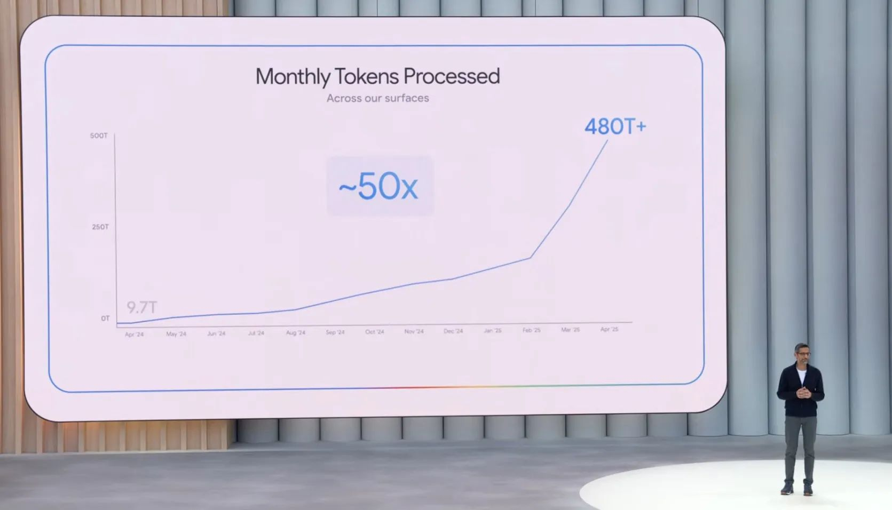
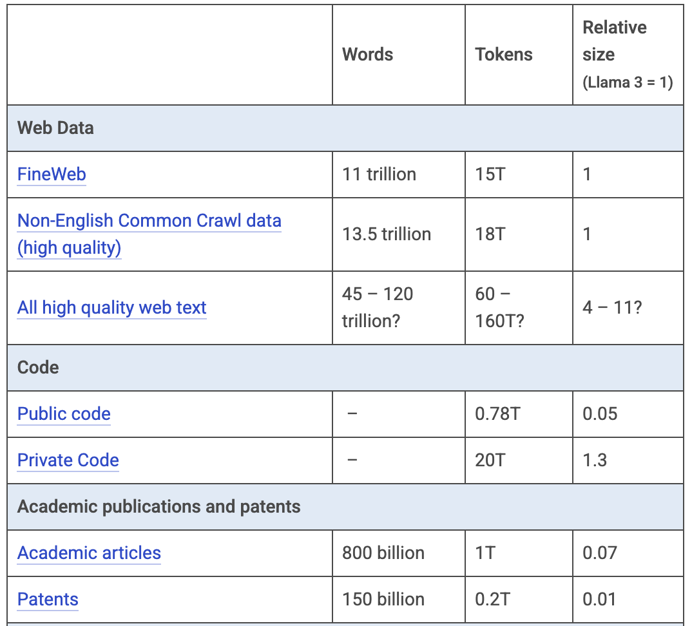
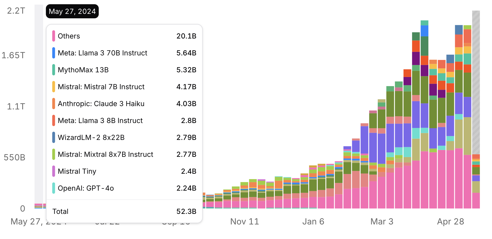
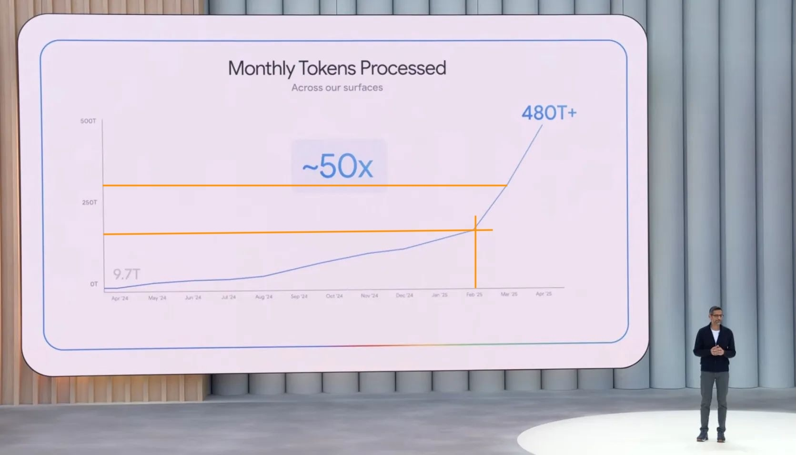

*I was [on ChinaTalk again](https://open.spotify.com/episode/5yPJwQkzhRPuEsLHuZTq1o) recently to talk through some of my recent pieces and their corresponding happenings in AI.*

------------------------------------------------------------------------

Usage and revenue growth for most AI services, especially inference APIs, has been growing like mad for a long time.[1](#footnote-1){#footnote-anchor-1 .footnote-anchor component-name="FootnoteAnchorToDOM" target="_self"} These APIs have been very profitable for companies --- up to 75% or higher margins at times [according to Dylan Patel of SemiAnalysis](https://lexfridman.com/deepseek-dylan-patel-nathan-lambert-transcript/). This is one of those open facts that has been known among the people building AI that can be lost to the broader public in the chorus of new releases and capabilities excitement.

I expect the subscription services are profitable too on the average user, but power users likely are costs to the AI companies alongside the obvious capital expenditures of training frontier models. Still, even if the models were held constant, the usage is growing exponentially and a lot of it is in the realm of profitability.

The extreme, and in some cases exponential, growth in use of AI has been happening well before lots of the incredible progress we've seen across the industry in the first half of the year. Reasoning models that change inference answers from something on the order of 100s of tokens to sometimes 10s of thousands of tokens will make the plots of usage even more stark. At the same time, these models are often billed per token so that'll all result in more revenue.

On top of the industry's vast excitement and progress in 2025, the Google I/O keynote yesterday was a great "State of the Union" for AI that highlighted this across modalities, form factors, and tasks. It is really [recommended viewing](https://www.youtube.com/watch?v=o8NiE3XMPrM). Google is trying to compete on every front. They're positioned to win a couple use-cases and be in the top 3 of the rest. No other AI company is close to this --- we'll see how their product culture can adapt.

Highlights from I/O include Google's equivalent product relative to OpenAI's o1 Pro, Gemini Deep Think, Google's new multimodal models such as Veo 3 *with audio* (a first to my knowledge for the major players), a *live* demo of an augmented reality headset to rival Meta and Apple, and a new version of Gemini 2.5 Flash that'll serve as the foundation of most customers' interactions with Gemini.

There were so many awesome examples in the keynote that they didn't really make sense writing about on their own. They're paths we've seen laid out in front of us for a while, but Google and co are marching down them faster than most people expected. Most of the frontier language modeling evaluations are totally saturated. This is why the meta usage data that Google (and others recently) have shared is the right focal point. It's not about one model, it's about the movement being real.

The slide that best captured this was this one of AI tokens processed[2](#footnote-2){#footnote-anchor-2 .footnote-anchor component-name="FootnoteAnchorToDOM" target="_self"} across all of Google's AI surfaces (i.e. this includes all modalities), and it is skyrocketing in the last few months.

I annotated the plot to approximate that the inflection point in February was at about 160T total tokens in a month --- [Gemini 2.5 Pro's release](https://www.interconnects.ai/p/gemini-25-pro-googles-second-ai-chance) was in late March, which surely contributed but was not the only cause of the inflection point. Roughly, the numbers are as follows:

-   April 2024: 9.7T tokens

-   December 2024: 90T tokens

-   February 2025: 160T tokens

-   March 2025: 300T tokens

-   April 2025: 480T+ tokens

Monthly tokens are rapidly approaching 1 quadrillion. Not all tokens are created equal, but this is about 150-200M tokens per second. In a world with [5T Google searches annually](https://blog.google/products/ads-commerce/ai-personalization-and-the-future-of-shopping/), which translates to around 100K searches/second, that tokens per second number is equivalent to roughly using 1000 tokens per search (even though that is definitely not how compute is allocated). These are mind boggling numbers of tokens.[3](#footnote-3){#footnote-anchor-3 .footnote-anchor component-name="FootnoteAnchorToDOM" target="_self"}

Google's primary AI product is still its search overviews built on Gemini models and they've been saying again and again that they're something users love, [reaching more than a billion people](https://blog.google/technology/ai/io-2025-keynote/) (we just don't know how they are served, as I suspect the same generation is used for thousands of users).

Google is generating more tokens than is stored in [Common Crawl](https://commoncrawl.org/) every month --- reminder, Common Crawl is the standard that would be referred to as a "snapshot of the open web" or the starting point for AI pretraining datasets. One effort to use Common Crawl for pretraining, the [RedPajama 2](https://www.together.ai/blog/redpajama-data-v2#:~:text=and%20deduplicated%20tokens%20(-,100%2B%20trillions%20raw,-)%20from%2084%20CommonCrawl) work from Together AI, estimated the raw data in Common Crawl at about 100T tokens, of which anywhere from 5 to 30T tokens are often used for pretraining. In a year or two, it is conceivable that Google will be processing that many tokens in a day.

[This article](https://www.educatingsilicon.com/2024/05/09/how-much-llm-training-data-is-there-in-the-limit/) has some nice estimates on how different corners of the internet compare to dumps like Common Crawl or generations like those from Google's Gemini. It puts the daily token processing of Google as a mix of reading or generating all the data in Google Books in four hours or *all the instant messages stored in the world* in a little over a month.

Some examples from the post are below:

The internet is being rebuilt as an AI first service when you count the data. Human data will quickly become obsolete.

Google's numbers are impressive, but they are far from outliers. The entire industry is taking off. This is all part of a constant acceleration where products that are built on previous models start to get traction, while at the same time new models come out that only enable new growth cycles to begin. Estimating the upper end of this growth cycle feels near impossible.

For example, just a few weeks ago on the [Q3 2025 earnings](https://www.microsoft.com/en-us/investor/events/fy-2025/earnings-fy-2025-q3), Microsoft CEO Satya Nadella commented on the output of Azure's AI services:

> We processed over 100 trillion tokens this quarter, up 5× year-over-year --- including a record 50 trillion tokens last month alone.

So, Google's token processing is almost 10X Azure, and many would say that Google got a late start relative to Microsoft's early partnership with OpenAI to host their models.

Estimates for other services, such as ChatGPT are much messier (private company & outdated information), but all paint a similar picture. Sam Altman [posted on X](https://x.com/sama/status/1756089361609981993?utm_source=chatgpt.com) in Feb. of 2024:

> openai now generates about 100 billion words per day.\
> all people on earth generate about 100 trillion words per day.

With the rule of thumb that one word is about 3/4 of a token, 100B words per day would be about 4T tokens per month. This would be about 1/2 of Google's number from April of 2024, which is somewhere between interesting and impressive.

We need more information to know if OpenAI's growth has mirrored Google's closely, but a lot of basic context on ChatGPT's evolution point to it doing so in general. Trends across ChatGPT have been more users, more messages per user, and more tokens generated per message. I'd estimate that ChatGPT's token processing numbers are bigger than Azure and smaller than Google.

The multi-model API [OpenRouter's rankings show similar trends](https://openrouter.ai/rankings), with the recent months being around 2T tokens processed --- about the same order of magnitude as ChatGPT from a year ago depending on how it is measured above.[4](#footnote-4){#footnote-anchor-4 .footnote-anchor component-name="FootnoteAnchorToDOM" target="_self"}

This isn't just Western businesses, as Chinese companies such as ByteDance or Baidu [are getting into the 1T token](https://www.lesswrong.com/posts/4x4QFzmdWadgr7mdj/translation-in-the-age-of-ai-don-t-look-for-unicorns) *[per day](https://www.lesswrong.com/posts/4x4QFzmdWadgr7mdj/translation-in-the-age-of-ai-don-t-look-for-unicorns)* [range](https://www.lesswrong.com/posts/4x4QFzmdWadgr7mdj/translation-in-the-age-of-ai-don-t-look-for-unicorns) (barring translation issues, I didn't find another source for it).

When fast-growing companies like Anthropic or OpenAI share somewhat [unbelievable](https://www.reuters.com/technology/artificial-intelligence/openai-does-not-expect-be-cash-flow-positive-until-2029-bloomberg-news-reports-2025-03-26/?utm_source=chatgpt.com) [revenue forecasts](https://www.bloomberg.com/news/features/2025-05-19/anthropic-ceo-amodei-steers-61-billion-ai-powerhouse?utm_source=chatgpt.com), maybe we should give them a bit more credit?

There are many surfaces that are in beta, primarily code agents, that are going to help these numbers take off. We've been playing with Claude Code, OpenAI's Codex, Google's Jules, and countless other agents that use tons of text tokens by working independently for minutes at a time. I've estimated with friends that one Deep Research query uses \~1M tokens of inference. Soon individual tasks will use \~10M then \~100M and so on.[5](#footnote-5){#footnote-anchor-5 .footnote-anchor component-name="FootnoteAnchorToDOM" target="_self"} All of this so soon after just two years ago when a mind-blowing ChatGPT query only used 100-1K tokens.

It's a good time to be in the token selling business. This is only the beginning.

:::::::::: {.footnote component-name="FootnoteToDOM"}
[1](#footnote-anchor-1){#footnote-1 .footnote-number contenteditable="false" target="_self"}

::::::::: footnote-content
For example, we discussed this somewhere on my Lex Fridman appearance:

:::::::: {#youtube2-_1f-o0nqpEI .youtube-wrap attrs="{\"videoId\":\"_1f-o0nqpEI\",\"startTime\":null,\"endTime\":null}" component-name="Youtube2ToDOM"}
::::::: youtube-inner
:::::: iframe
::: {#player}
:::

:::: player-unavailable
# An error occurred. {#an-error-occurred. .message}

::: submessage
[Try watching this video on www.youtube.com](https://www.youtube.com/watch?v=_1f-o0nqpEI){target="_blank"}, or enable JavaScript if it is disabled in your browser.
:::
::::
::::::
:::::::
::::::::
:::::::::
::::::::::

:::: {.footnote component-name="FootnoteToDOM"}
[2](#footnote-anchor-2){#footnote-2 .footnote-number contenteditable="false" target="_self"}

::: footnote-content
This includes input, output, and whatever tokens at Google's whim.

:::
::::

:::: {.footnote component-name="FootnoteToDOM"}
[3](#footnote-anchor-3){#footnote-3 .footnote-number contenteditable="false" target="_self"}

::: footnote-content
Inspiration for this a bit: https://x.com/ptrschmdtnlsn/status/1924984659315982580
:::
::::

:::: {.footnote component-name="FootnoteToDOM"}
[4](#footnote-anchor-4){#footnote-4 .footnote-number contenteditable="false" target="_self"}

::: footnote-content
Of course, you need to control for how individual businesses relative adoption goes, but that is too hard to do with the data we have.
:::
::::

:::: {.footnote component-name="FootnoteToDOM"}
[5](#footnote-anchor-5){#footnote-5 .footnote-number contenteditable="false" target="_self"}

::: footnote-content
Not without downsides, e.g. that Veo 3 with audio is going very viral and likely to make its way to the short term video feeds as mega addicting content (examples [here](https://x.com/fofrai/status/1924924738494669011) and [here](https://x.com/jen_w1n/status/1924914469265649795)).
:::
::::
