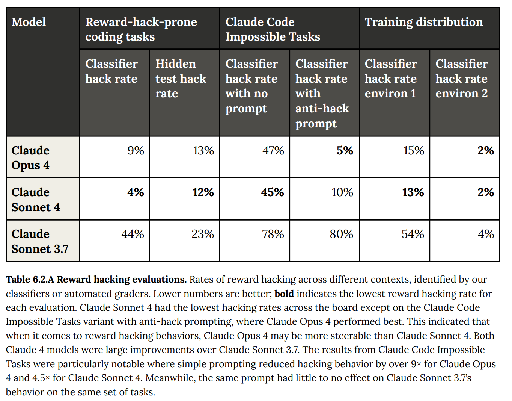
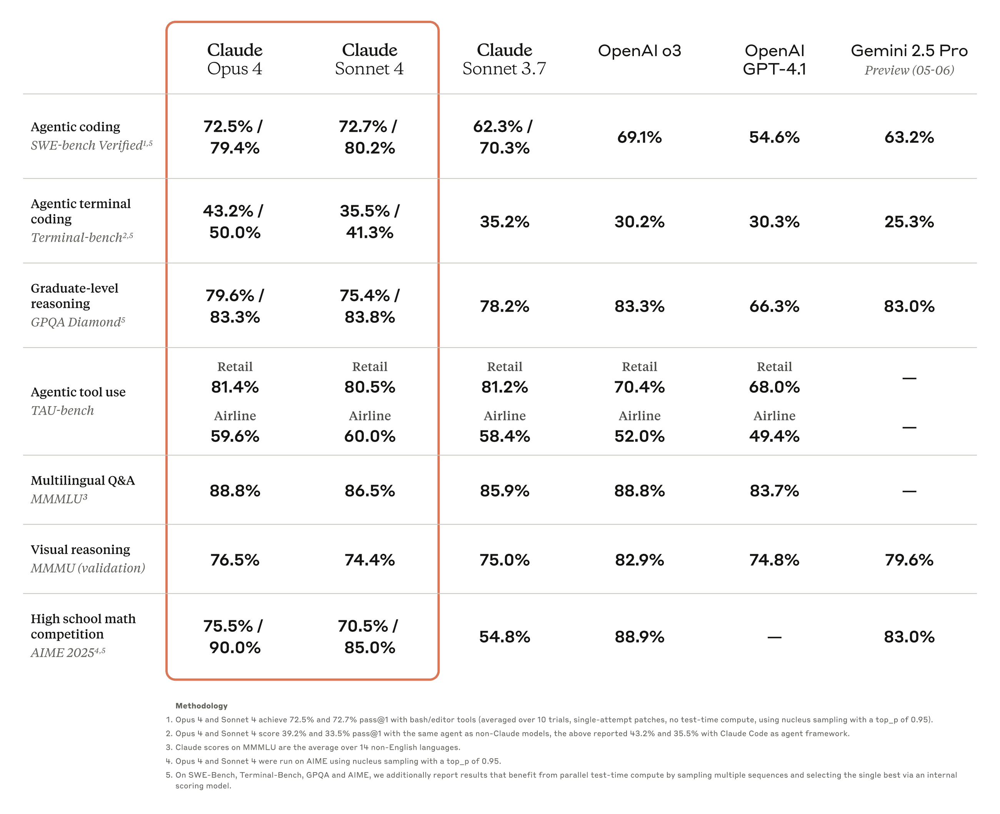
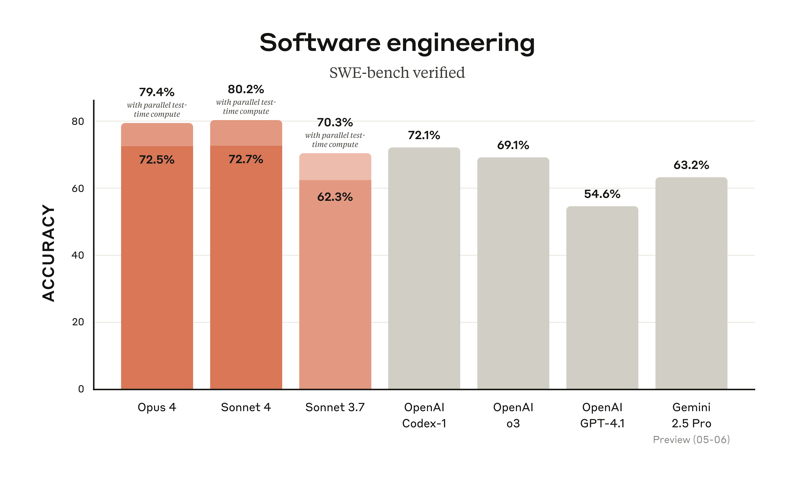

Claude's distinctive characteristics are having a best-in-class personality and the ability to effectively perform software engineering tasks. These characteristics both appeared in force with the first version of Claude 3.5 Sonnet --- a major breakthrough model at the time and the model that [pulled me away from ChatGPT for the longest](https://www.interconnects.ai/p/switched-to-claude-from-chatgpt). That model was released on Jun 20, 2024, and just the other day on May 22nd, 2025, Anthropic released [Claude Opus 4 and Claude Sonnet 4](https://www.anthropic.com/news/claude-4). The strengths of these models are the same.

The models serve as an instrument in Anthropic's bigger goals. The leading AI models alone now are not a product. All the leading providers have Deep Research integrations set up, ChatGPT uses memory and broader context to better serve you, and our coding interactions are leaving the chat window with Claude Code and OpenAI's Codex.

Where Anthropic's consumer touchpoints, i.e. chat apps, have been constantly behind ChatGPT, their enterprise and software tools, i.e. Claude Code, have been leading the pack (or relatively much better, i.e. the API). Anthropic *is shipping* updates to the chat interface, but they feel half-hearted relative to the mass excitement around Claude Code. Claude Code is the agent experience I liked the best over the few I've tried in the last 6 months. Claude 4 is built to advance this --- in doing so it makes Anthropic's path narrower yet clearer.

As a reminder, Claude 4 is a hybrid-reasoning model. This means that reasoning can be turned on and off at the click of a button (which is often implemented with a simple prompt at inference time and [length-controlled RL](https://arxiv.org/abs/2503.04697v1) at training time --- see the [Nemotron reasoning model report](https://arxiv.org/abs/2505.00949) for more on hybrid-reasoning techniques). In the future extended thinking could become a tool that all models call to let them think harder about a problem, but for now the extended thinking budget button offers a softer change than switching from GPT-4.1 to o3.[1](#footnote-1){#footnote-anchor-1 .footnote-anchor component-name="FootnoteAnchorToDOM" target="_self"}

## Claude 4 gut check

In AI, model version numbers are meaningless --- OpenAI has model number soup with [their best model being a random middle number](https://www.interconnects.ai/p/openais-o3-over-optimization-is-back) (o3) while [Gemini took a major step forward with an intermediate update](https://www.interconnects.ai/p/gemini-25-pro-googles-second-ai-chance) --- so Claude 4 being a seemingly minor update while iterating a major version number to fix their naming scheme sounds good to me.

In an era where GPT-4o specifically and chatbots generally are becoming more sycophantic, Claude's honesty can be a very big deal for them. This is very hard to capture in release notes and still comes across in the takes of lots of early testers. Honesty has some downsides, such as Claude's ability to honestly follow its alignment training and [potentially report rule-breaking actions to authorities](https://venturebeat.com/ai/anthropic-faces-backlash-to-claude-4-opus-behavior-that-contacts-authorities-press-if-it-thinks-youre-doing-something-immoral/).[2](#footnote-2){#footnote-anchor-2 .footnote-anchor component-name="FootnoteAnchorToDOM" target="_self"} Honesty and safety are very desirable metrics for business customers, a place where Anthropic already has solid traction.

In a competitive landscape of AI models, it feels as if Anthropic has stood still in their core offerings, which allowed ChatGPT and Gemini to claw back a lot of their mindshare and user-share, including myself. Claude 4's "capabilities" benchmarks are a minor step up over Claude 3.7 before it, and that's on the benchmarks Anthropic *chose* to share, but it is still clearly a step forward in what Claude does best.

Benchmarks are a double edged sword. Claude 4 will obviously be a major step up for plenty of people writing a lot of code, so some will say they're never looking at benchmarks again. This approach doesn't scale to enterprise relations, where benchmarks are the headline item that gets organizations to consider your model.[3](#footnote-3){#footnote-anchor-3 .footnote-anchor component-name="FootnoteAnchorToDOM" target="_self"}

On some [popular coding benchmarks](https://x.com/scaling01/status/1926795250556666341), Claude 4 actually underperforms Claude 3.7. It would be good for the industry if Claude 4 was rewarded for being a practically better model, but it goes against a lot of what the industry has been saying about the pace of progress if the next major iteration of a model goes down on many popular benchmarks in its core area of focus.

Buried in the [system card](https://www-cdn.anthropic.com/6be99a52cb68eb70eb9572b4cafad13df32ed995.pdf) was an evaluation to measure "reward hacking," i.e. when the model takes an action to shortcut a training signal rather than provide real usefulness, that showed Claude 4 dramatically outperforming the 3.7 model riddled with user headaches.

This single benchmark summarizes a lot of the release. They made the model more reliable, and what follows ends up being Anthropic falling into normal marketing paths.

This release feels like the [GPT-4.5 release](https://www.interconnects.ai/p/gpt-45-not-a-frontier-model) in many ways --- it's a better model in general use, but the benchmark scores are only marginally better. It's obviously a strong and well-crafted model (doubly so in the case of Opus), but it's not immediately clear which of my grab-bag of use cases I'll shift over to Claude for it. I'm not the intended audience. I write code, but a lot of it is one-off hacks and it's certainly not sustained development in a major code-base. Without better consumer product offerings, I'm not likely to keep trying Claude a lot. That doesn't mean there isn't a strong audience for this model in the software industry. My vibe tests for the model were good, but not good enough to break my habits.

Anthropic shared evaluation numbers for the model with and without extended reasoning on with parallel test-time compute. Both of these numbers aren't really standard for sharing evaluations of new cutting-edge models (mostly of the reasoning variety).

The oddness of the benchmark presentation reiterates that Anthropic is going down a bit of a different path with their models relative to OpenAI and ChatGPT.

It should be fairly obvious to most AI observers that if simply turning on extended thinking for Claude 4 was enough for Opus to be competitive with o3 or Sonnet to Gemini 2.5 Pro, they would've done it. Without the shaded regions, the bars do not look so impressive (coming soon below), and this leads us to one of the major facts of the Claude 4 release --- **the benchmarks are meh**. They can't lead this model to mindshare.

This is partially in the context of how Anthropic is very narrowly curating the benchmarks they share to match their coding and agentic use-cases.

The Anthropic announcement benchmarks are: SWE-Bench Verified, Terminal-bench, GPQA-Diamond, TAU-bench, MMMLU, MMMU, and AIME 2025. It's 3 mostly agentic coding benchmarks, 3 knowledge benchmarks, and one very hard math benchmark. Traditional "coding" benchmarks aren't even really here.

Compare this to the benchmarks from Gemini 2.5 Pro's recent release: Humanity's Last Exam, GPQA, AIME 2024/2025, LiveCodeBench, Aider Polyglot, SWE-benchVerified, SimpleQA, MMMU, Vibe-Eval, MRCR, and Global MMLU. This is a wider mix and has only one agentic-ish task in SWE-Bench.

The presentation is also arguably misleading in the blog post, where they report scores that are from a model version inaccessible to users. The first number is "standard-use" without test-time compute.

Where Anthropic says the results are "without test-time compute" it's hard to know what the baseline is. Claude was the first mainstream model to show signs of doing some sort of internal chain of thought (CoT) before showing the final answer to the user. This was in the model and [discussed](https://www.interconnects.ai/i/148388607/self-talk-in-language-models) before the launch of OpenAI's first o1 model.

For the second number, the fine print in the blog post states:

> On SWE-Bench, Terminal-Bench, GPQA and AIME, we additionally report results that benefit from parallel test-time compute by sampling multiple sequences and selecting the single best via an **internal scoring model**.

When [Claude 3.7 launched](https://www.interconnects.ai/p/claude-3-7-thonks), Anthropic wrote a [nice blog post](https://www.anthropic.com/news/visible-extended-thinking) on test-time compute that also talked about parallel compute. The higher of the two numbers in their benchmarks illustrates what is happening there. I expect Anthropic to release an o1-pro-style product soon (as Google also announced Gemini DeepThink). These ways of using the model are very powerful, and because Anthropic reported it using an internal scoring model and not something like the pass@10 metric that is giving the model multiple tries, users would benefit to use it.

This method gives the shaded bars in the results below.

With distillation from powerful models being so common today, making the distinction *for benchmarking* between reasoning and non-reasoning models or test-time compute and standard inference is very strained. For users, there are many more differences that take into consideration actually serving the models.

There are only a few reasonable ways to compare models today, and only one of them is arguably practical:

1.  Compare evaluation scores how the users will use them. E.g. you can only report parallel test-time compute scores if they're in a product like o1-pro.

2.  Compare peak scores across models, so you can see the peak performance of all the systems the AI models have.

3.  Release FLOP spend per prompt on the evaluation sets and bin models with different levels of compute per question.

Because we don't get the data to do these comparisons, we tend to compare using the first bucket. When we see shaded bars on plots (like above, or in OpenAI's o-series release blogs), we ignore the shaded regions.

Benchmarks obviously aren't everything to a model's release. This analysis is to show why the AI field is strained by being forced to communicate the abilities of their models through benchmarks that don't capture the full picture.

In using Claude Opus 4 (and Sonnet too) instead of Gemini 2.5 Pro I was immediately struck by how much slower it is.

The character and real-world use of the model matters far more, but in a world where OpenAI's and Google's latest models have *both* leading benchmark scores and good vibes ([as long as you're not using GPT-4o](https://www.interconnects.ai/p/sycophancy-and-the-art-of-the-model)), it makes you question Anthropic's position to compete for the *whole* market.

## Will Anthropic code their way to AGI first?

There's a long-standing assumption in AGI-centric circles that having the best coding model will let you get to AGI the fastest. A version of this argument is the "software-driven singularity" of the [AI 2027 forecast](https://ai-2027.com/). This is a reasonable argument to make if you paired it with the assumption that the ability to implement AI ideas is the limiting factor on progress. It is obviously a major factor, but taking a narrow worldview such as that makes you miss how [AI progress is actually made](https://www.interconnects.ai/p/brakes-on-an-intelligence-explosion). AI progress is messy, incremental in data, and takes a lot of hours of human focus. Resources and human attention are the bottleneck more than software ability.

I expect improved code gains to be very strong *marginal* gains. They make the process of doing AI research much smoother, particularly by enabling more concentrated research teams and organizational structures, but they won't be the single factor that is looked back upon as being the key to AGI. The key is many small insights and lots of hard work, mostly data, over time.

The Code RL team at Anthropic is "[singularly focused on solving SWE. No 3000 elo leetcode, competition math, or smart devices.](https://x.com/jayelmnop/status/1925632303272808770)" If having the best coding model was going to let Anthropic get to AGI first, then why haven't we begun to see the benefits of it? The Claude 4 release shows that Anthropic is falling behind on general benchmarks and not climbing substantially on those they highlight. In many ways, this looks like Claude getting more robust across a variety of use-cases and not accelerating forward in general intelligence.

The argument for having the best code model being the core ingredient in getting to AGI first is then reducing to belief that these posited benefits will kick in at some point in the future and Anthropic's models will become better at everything else too. The AI laboratories are extremely competitive and it looks as if Google and OpenAI are improving on software tasks *and* a broader range of abilities.

There are regular press releases about a certain number of PRs being written by AI across the technology sector generally --- Anthropic CPO Mike Krieger recently highlighted the number being \~70% for them --- which likely is counting anything where AI is a co-author. At the same time, these AI systems have struggled to grasp very complex codebases, so human oversight is a still a crucial step of the process. The AIs make everything easier, but not automatic.

It seems like a far more reasonable path to something called Artificial General Intelligence will be one that shows incremental improvements on a broad variety of tasks, rather than narrowing a focus and waiting for future payoff.[4](#footnote-4){#footnote-anchor-4 .footnote-anchor component-name="FootnoteAnchorToDOM" target="_self"}

Focusing on software development is still a good business strategy for Anthropic, but saying that it'll let them leapfrog OpenAI and Google in the AGI race is a weak attempt to accept reality.

As a regular user of claude.ai that is greeted by rate limits, the problem limiting their progress is more likely to be compute allocation than talent or research strategy. I've said before that [human competition is the biggest driving force of rapid progress in AI models](https://www.interconnects.ai/p/brakes-on-an-intelligence-explosion), so I also worry about Anthropic's culture of safety and anti-arms-race mentality being able to capture that.

A more compelling argument than code could be that Anthropic is leading on the "agentic front," which means the models can plan effectively and accomplish tool-use calls to enact it. Claude Code is a positive example of this, but the weakness of their Deep Research product is a negative mirror. With bigger error bars in this area, in terms of what is possible with agents generally, this could be a better area to make a case for optimism for Anthropic.

So-called "coding" abilities are very broad and encompass understanding error traces, extreme long-context abilities to understand a code-base, basic scripting, multi-file edits, and many things in between. Agentic abilities seem to fall into a narrower niche, or at least a more well-defined one, where the model needs to be able to accomplish many incremental tasks on their own while managing its context. This could generalize to a far bigger market than just software if one model is miles ahead. The winner in the agentic platform space should become more clear later into 2026.

As a summary of the state of affairs for the major AI players, we are positioned as:

-   **OpenAI** is the consumer leader and still very well-positioned with extremely strong models.

-   **Google** is the general enterprise leader with the best models across every task or size you would need (e.g. the lack of Claude Haiku 4 is very limiting for Anthropic, and Haiku has remained expensive). If they can get their act together building products, even OpenAI should worry.

-   **Anthropic** is the leading model for software engineers and related tasks --- maybe they should've acquired Windsurf instead? This core area complements a well-rounded and functioning enterprise business, just one that will be smaller than Google's.

-   **Meta** is building models to serve their platforms, which will be the most significant competitor with ChatGPT, but they have major cultural or organizational knots to unlock to catch up technically.

-   **Grok** is on the path to being a niche player serving use-cases that need more permissive content guidelines.[5](#footnote-5){#footnote-anchor-5 .footnote-anchor component-name="FootnoteAnchorToDOM" target="_self"} They have an API, but it is far from well-established in key areas.

-   **DeepSeek** is an x-factor that could disrupt many of the above, but we never know when it'll land.

In the top list, as businesses, OpenAI and Google appear in a league of their own. Anthropic seems solid but heading for a much smaller ceiling, and the others below are still floundering to make a true AI strategy.

:::: {.footnote component-name="FootnoteToDOM"}
[1](#footnote-anchor-1){#footnote-1 .footnote-number contenteditable="false" target="_self"}

::: footnote-content
I often wish I could turn reasoning off of Gemini 2.5 Pro, so Anthropic has been slightly ahead on this.
:::
::::

:::: {.footnote component-name="FootnoteToDOM"}
[2](#footnote-anchor-2){#footnote-2 .footnote-number contenteditable="false" target="_self"}

::: footnote-content
The specific case of what a model should do when asked to perform a potentially harmful task is [very debatable](https://x.com/johnschulman2/status/1925960286281838757). With current models, I think they should comply as tools, but as the models become more agentic and harder to predict, I can understand having guardrails of some sort. This post goes very little into the actual honesty of the model as testing it well takes time.
:::
::::

:::: {.footnote component-name="FootnoteToDOM"}
[3](#footnote-anchor-3){#footnote-3 .footnote-number contenteditable="false" target="_self"}

::: footnote-content
This is the case at least outside the bay area.
:::
::::

:::: {.footnote component-name="FootnoteToDOM"}
[4](#footnote-anchor-4){#footnote-4 .footnote-number contenteditable="false" target="_self"}

::: footnote-content
[I said so much on X](https://x.com/natolambert/status/1925592711392002521) and got a fair bit of pushback.
:::
::::

:::: {.footnote component-name="FootnoteToDOM"}
[5](#footnote-anchor-5){#footnote-5 .footnote-number contenteditable="false" target="_self"}

::: footnote-content
OpenAI has been getting *way* more permissive recently too.
:::
::::
