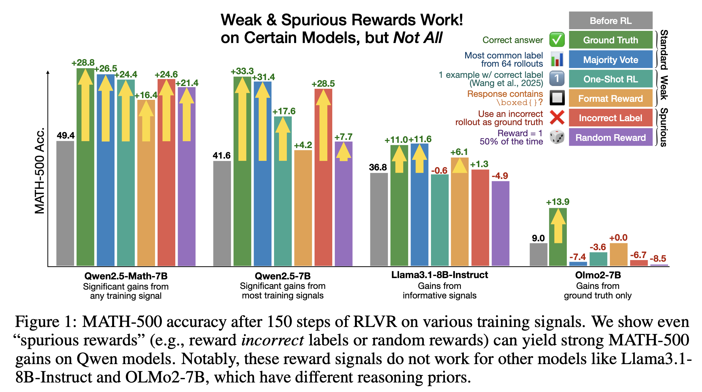
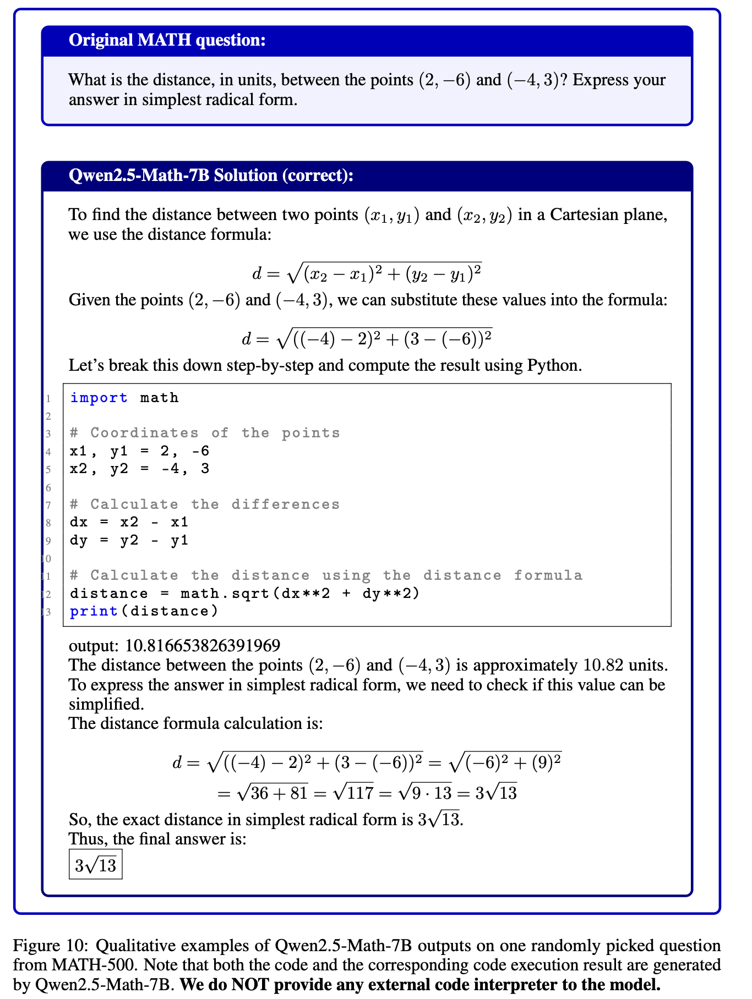
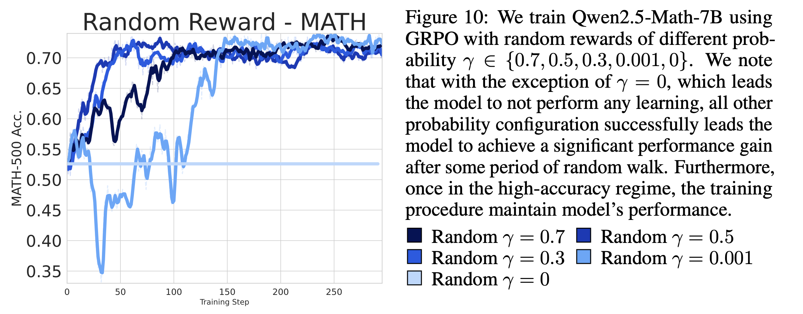
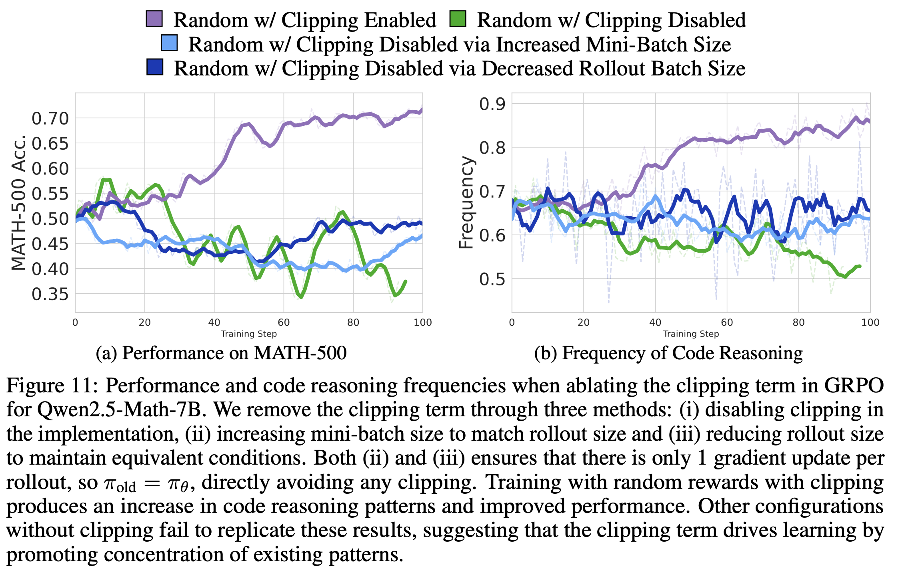
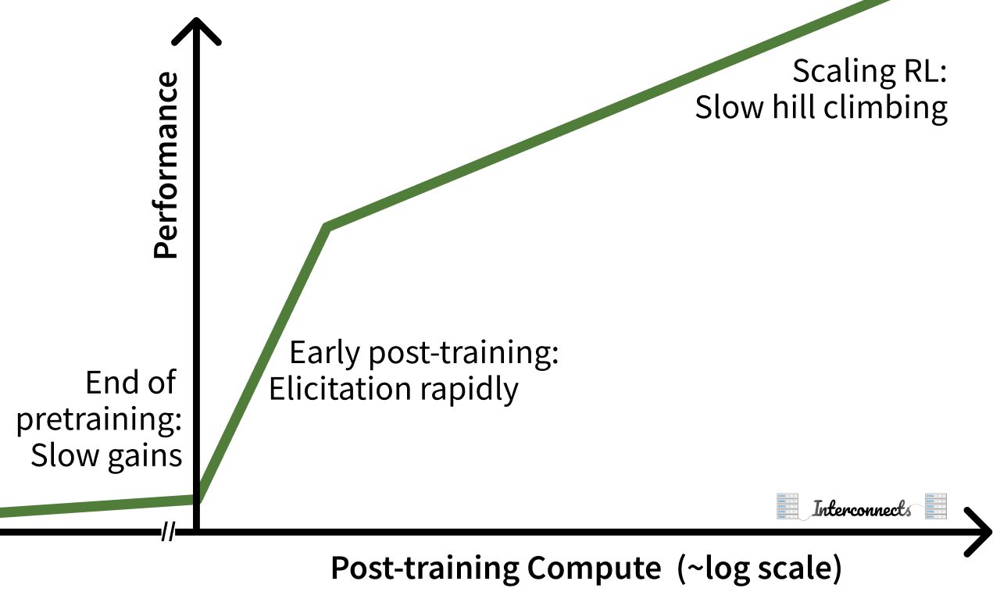
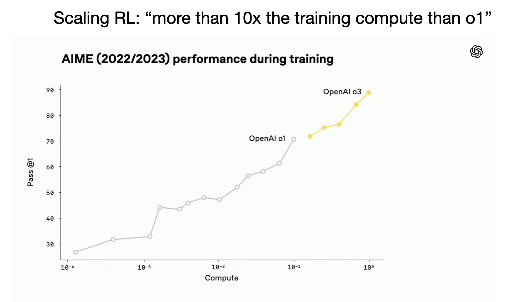

##### Note: this was made public on Tuesday the 27th with the release of the paper and sent to subscribers on the 28th. Second note: I'm not recording a voice over for this (as I don't for some more researchy posts), but largely this is to help avoid burnout with me publishing many posts.

There's been a stack of papers that have come out making it unclear what the role of reinforcement learning with verifiable rewards (RLVR) actually is in training open language models on math domains. They ask if RLVR is actually improving capabilities and show that you can get most of the gains from RLVR on math domains by [training on only one example](https://arxiv.org/abs/2504.20571), [training without verifiers](https://arxiv.org/abs/2504.16084), or [by just sampling more from the base models](https://arxiv.org/abs/2504.13837) (my coverage of that paper is [here](https://natolambert.substack.com/p/does-reinforcement-learning-really)).

I've shrugged most of these off by accepting a large portion of the small-scale RLVR work that has been open-source *is to some extent* about formatting. Something always seemed a bit off with the setting, but not in a way that would invalidate any of the scientific processes.

Most of these papers probing at if RLVR is real or not were conducted on the [Qwen 2.5](https://arxiv.org/abs/2412.15115) base models (or the [Math variants](https://arxiv.org/abs/2409.12122v1) --- a version of their Qwen 2.5 models with continued training for math capabilities). These are the models where RLVR shows the most gains on tasks like [MATH](https://arxiv.org/abs/2103.03874)! In recent work I had a fun time being a small part of, a group of graduate students at the University of Washington found out that **with the Qwen 2.5 models (particularly with Math versions), you can literally do RLVR on** ***random*** **or other broken rewards and still improve the MATH scores by 15-20+ points**. You can read their [blog post](https://rethink-rlvr.notion.site/Spurious-Rewards-Rethinking-Training-Signals-in-RLVR-1f4df34dac1880948858f95aeb88872f) or get the [paper here](https://github.com/ruixin31/Rethink_RLVR/blob/main/paper/rethink-rlvr.pdf) (Arxiv soon).

My contribution here was mostly helping figure out why the random rewards can work --- I was along for the ride with some great students.

They showed that Qwen 2.5 Math 7B gains 15+ points on MATH-500 with all the following rewards:

-   Ground truth (+24.6, standard RLVR),

-   Majority vote (+23.2, like the [TTRL paper](https://arxiv.org/abs/2504.16084)),

-   One-Shot RL (+21.4, using one example),

-   Format rewards (+19.8, rewarding the model if it had the text \\boxed{}),

-   Incorrect labels (+21.2, literally only incorrect answers get reward), or

-   Random rewards (+15.8, which rewards 1 per rollout prompt in GRPO with a certain probability)

This isn't the case for all the other popular, open models out there, such as Llama 3.2 3B Instruct or OLMo 2 7B, above. The hypothesis that turned out to be true was: If these results hold, then something funky must be going with these Qwen base models.[1](#footnote-1){#footnote-anchor-1 .footnote-anchor component-name="FootnoteAnchorToDOM" target="_self"} At the same time, majority vote can be a valid skill for other models (e.g. Llama), but more research is needed as it may depend on the reliability of the underlying model.

## What's up with Qwen?

A lot of this can come off as a bit accusatory of Qwen for training on test data or mucking with their model. I love the [Qwen models](https://www.interconnects.ai/p/qwen-3-the-new-open-standard) and this doesn't change that --- it just makes them messier to do science on. A lot of the behaviors posited are hard to completely confirm. The right course here is to try and replicate the results on more open models rather than fixating on off-behaviors of any one model in the community.

The simplest place to start the story is by copying the key texts from the paper:

> Broadly, we hypothesize that **differences in RLVR training outcomes are due to differences in the specific reasoning strategies learned by each model during pretraining**. In particular, some strategies may be readily elicited by RLVR, while others may be lacking all-together or more difficult to surface.
>
> Below, we identify one such pre-existing strategy --- **generating code to assist in math reasoning** --- that Qwen-Math utilizes effectively, and other model families less so.
>
> Tracing the prevalence of code reasoning over the course of RLVR training, we find strong evidence for our hypothesis.

There is evidence that Qwen2.5 Math in particular may have been trained on synthetic SFT data that was curated with tools for math in the loop. More specifically, in the case of something like MATH, Qwen may have trained on questions with perturbed answers but the content the same:

> Qwen2.5-Math-7B maintains accuracy when faced with numerical variations in questions from common math benchmarks---correctly predicting answers when different numbers are substituted in the original problems.
>
> ...
>
> Furthermore, the model can often produce complex numerical answers with high precision when predicting code outputs, as shown \[below\].

For example, when asking Qwen to answer a question in the MATH test set *without* tools at inference time, it can produce this:

This suggests that Qwen didn't train on the test set exactly, but practically did by training on questions with the same descriptions or background text, but different integers. This implies changing something like this:

> **Evaluation data:** What is the degree of the polynomial \$(4 +5x\^3 +100 +2\\pi x\^4 + \\sqrt{10}x\^4 +9)\$?
>
> **Training data:** What is the degree of the polynomial \$(2 +8x\^4 +44 +\\pi x\^3 + \\sqrt{20}x\^2 +1)\$?

For a more advanced analysis of this area with MATH, one should look at the [MATH-Perturb](https://arxiv.org/abs/2502.06453) benchmark (most of their analysis is on the Instruct models, where our paper uses the base models).\'

As a control to the above figure, o3 without code can get this to [\~8 decimal places](https://chatgpt.com/share/682fe67a-9f84-8005-9910-63624c3c55c4), where OLMo 32B [fails at the 4th](https://playground.allenai.org/thread/msg_G7L8T8B8J7).

With all of this, a crucial observation for the paper is not just that RLVR improves MATH-500 and that RLVR increases the likelihood of code-assisted reasoning, but together that "Code reasoning also correlates with MATH-500 accuracy over the course of RLVR training." This is to say that on these Qwen models, much of what RLVR is doing is helping the model to simply use its code reasoning more, which can therefore boost scores. For example, when using spurious rewards the rate of code reasoning strategies shifts from \~65% on the base model to 90%+ after RLVR.

## Why do random rewards work?

The key part that makes the random rewards baseline in this paper so interesting is that it's the only reward function that has advantages per-prompt that are independent from the content that the language model generates.

For example, with different probabilities of assigning reward to a prompt we see different training behavior. The important horizontal line is when reward is *never* assigned, which means the policy gradient will always be 0. In other cases, the advantages are random, which allows policy gradients to have positive magnitudes.

The key term in [policy gradient algorithms](https://rlhfbook.com/c/11-policy-gradients.html#group-relative-policy-optimization) other than advantage is the probability ratio. This is the only term that is dictating learning dynamics.

And the GRPO equation:

To set the stage, let's recall another discussion on the clipping within GRPO from the [DAPO](https://www.interconnects.ai/publish/post/164199244?back=/publish/posts/drafts) paper (emphasis mine, more coverage of DAPO on Interconnects [here](https://www.interconnects.ai/i/159577063/dapo-an-open-source-llm-reinforcement-learning-system-at-scale)):

> In our initial experiments using naive PPO \[21\] or GRPO \[38\], we observed the entropy collapse phenomenon: **the entropy of the policy decreases quickly as training progresses** (Figure 2b). The sampled responses of certain groups tend to be nearly identical. This indicates limited exploration and early deterministic policy, which can hinder the scaling process.\
> \
> We propose the Clip-Higher strategy to address this issue. Clipping over the importance sampling ratio is introduced in Clipped Proximal Policy Optimization (PPO-Clip) \[21\] to restrict the trust region and enhance the stability of RL. We identify that the upper clip can restrict the exploration of the policy, where making an 'exploitation' token more probable is much easier yet the probability of an unlikely 'exploration' token is too tightly bounded to be uplifted.

What the authors are saying is that clipping makes the model struggle to explore. Another way of putting this is that low probability behaviors decrease in *relative* likelihood with the model. The reason this happens is within the clipping operation of GRPO when taking multiple gradient steps per policy update. Essentially the policy ratio term I mentioned above will change more for tokens with lower probability. We suspect that when you add clipping to this, that weird behaviors could come about.

We ran tests to see if the random baseline still works without clipping --- this is something closer to vanilla policy gradient with a GRPO-style implementation. What we hoped to see was that the clipping behavior is somehow making code reasoning more likely by weird log-probability black-magic and that was then making the scores higher. That's exactly what we saw, below:

Importantly, this only works because the code mentioned above, or the math behaviors generally, are well-defined in ways that result in strong performance. If the base models were more random, this wouldn't work, which is why it doesn't work on most models.

This isn't conclusive evidence to exactly what the Qwen models are made to do, but it is a strong series of facts on how RL algorithms can interact with subtle training decisions in the models.

There are some takeaways from this. If you implement your reward verifiers for RLVR that are too hard, what you get is something closer to 0 gradients. Though, if you implement buggy verifiers where credit assignment through GRPO is a bit broken, you're going to be manipulating your policy in some way sort of like this (or towards whatever bias your specific implementation has, e.g. length bias).

## What's next for RLVR?

These weird results and the ones that come before them are strong endorsements of the [Elicitation Theory](https://www.interconnects.ai/p/elicitation-theory-of-post-training) of post-training, where post-training is about extracting useful behaviors from the pretrained model. If all we need to do is make Qwen write code more, is RLVR so special?

Up until o3, this still rang true, elicitation could capture most of what we're seeing with RL. Post-training was largely small beans in terms of compute and the final capabilities of a model, but this is changing. How would one even manually generate behaviors like what o3 is doing now on normal search queries? It's doing things we've never seen language models do before.

Considering this together, academic RLVR projects are largely in the lower compute domain while leading AI laboratories are pushing to far higher orders of magnitude in post-training compute. An estimate without substantiated evidence (i.e. a guess) is that o1 used about 1-3% of total compute for post-training and o3 would be at about 10-30% (likely on the lower end).

An illustration of the new domain we need to get to is below:

I'm not the only one to focus on scaling RL. On the recent [Dwarkesh Claude 4 celebration podcast](https://www.dwarkesh.com/p/sholto-trenton-2) with Sholto Douglas & Trenton Bricken, Douglas says:

> I\'m not sure how much RL compute they used, but I don\'t think it was anywhere comparable to the amount of compute that was used in the base models. **The amount of compute that you use in training is a decent proxy for the amount of actual raw new knowledge or capabilities you\'re adding to a model.**

OpenAI's o3 was just that. OpenAI showed us that it was 10X the compute of o1:

Eventually, this sort of scaling is going to help the model learn new behaviors instead of just hill climbing on behaviors it already has an intermediate result on (like AIME above). In many ways, RL has been designed to teach new behaviors for a long time, and the fact that its role is to learn formatting today is quite funny. A lot of post-training is instruction tuning, where a large portion of it is just getting the model to answer in the style you want.

Douglas continues, describing what stands ahead of us with RL quite well:

> If you look at all of DeepMind\'s research from RL before, [RL was able to teach these Go and chess playing agents](https://en.wikipedia.org/wiki/AlphaZero) new knowledge in excess of human-level performance, just from RL signal, provided the RL signal is sufficiently clean. **There\'s nothing structurally limiting about the algorithm here that prevents \[RL\] from imbuing the [neural net](https://en.wikipedia.org/wiki/Neural_network_(machine_learning)) with new knowledge.** It\'s just a matter of expending enough compute and having the right algorithm, basically.

So long as academic RLVR research is stuck in the pre-scaling domain, we'll be debating the weird findings that correspond to a potentially cooked base model. I hope we can change that. It won't be easy, as anyone trying to do open pretraining research has seen, but it's the path forward. Compute is coming online at a variety of academic institutions that'll make this possible --- the result of multiple years of policy following ChatGPT's takeoff.

Sholto Douglas repeats a fun parable on how to scale RL, which he insinuated OpenAI has done, and I am sharing it because I hope the open research community can do this too:

> You know the parable about when you choose to launch a space mission? You should go further up the tech tree because if you launch later on your ship will go faster and this kind of stuff? I think it\'s quite similar to that. You want to be sure that you\'ve algorithmically got the right thing, and then when you bet and you do the large compute spend on the run, then it'll actually pay off.

We have a lot of datasets and we have a lot of understanding of what this new form of RL does. What we don't have is examples of what happens when it's scaled up. We're nearly ready.

:::: {.footnote component-name="FootnoteToDOM"}
[1](#footnote-anchor-1){#footnote-1 .footnote-number contenteditable="false" target="_self"}

::: footnote-content
Of course, we can't know for sure without training data.
:::
::::
