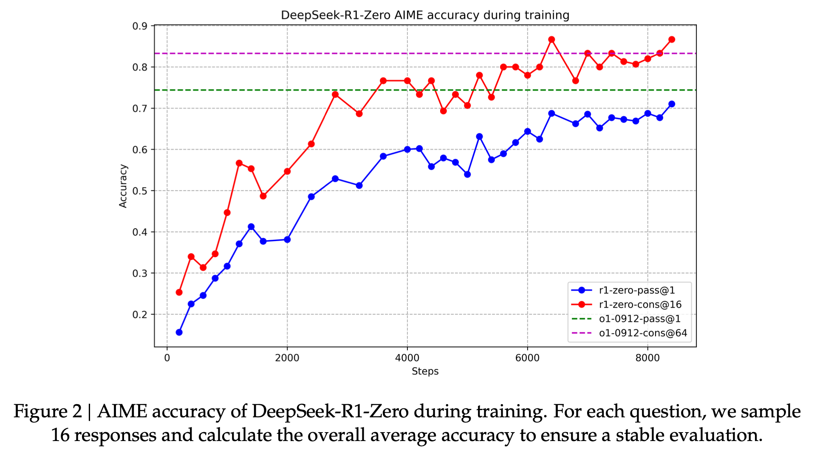
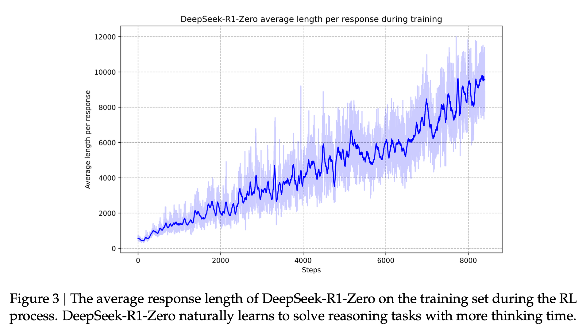
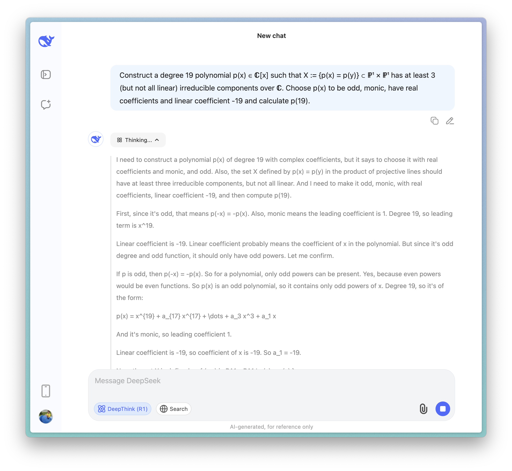

##### On Monday of this week we released RewardBench 2, Ai2's next reward model evaluation and a project I've been personally invested in through its whole arc. Read more of my thoughts [here](https://natolambert.substack.com/p/rewardbench-2-and-the-state-of-preference).

##### Tomorrow, I'll be [presenting a version of this post at the AI Engineer World's Fair Reasoning & RL track](https://www.ai.engineer/schedule#a-taxonomy-for-next-generation-reasoning-models). Come tomorrow and say hi if you're around the next two days!

------------------------------------------------------------------------

The first generation of [reasoning models](https://www.interconnects.ai/t/reasoning) brought us inference-time scaling and intrigue in seeing into what can be called the reasoning process of a language model.

The second generation of reasoning models are going to bring us new types of agentic language modeling applications.

The traits and abilities that are needed for agentic models are additive to the first generation, but not present by default. Some of the new abilities that are needed can be bootstrapped with clever prompting, but for the best results we need to be training our reasoning models directly to optimize for planning.

In this post we explain four key aspects of current and next-generation reasoning models:

1.  **Skills**: The ability to solve self-contained problems.

2.  **Calibration**: The ability to understand the difficulty of a problem and not overthink.

3.  **Strategy**: The ability to choose the right high level plan.

4.  **Abstraction**: The ability to break down a strategy into solvable chunks.

These are presented in the order that they should be solved to make a progressively more complete reasoning model for complex tasks. Skills then calibration then strategy then abstraction. The first two are native abilities of models on single inference passes when presented with a technical problem and the latter are skills that are needed to build effective agents.

For grounding, recall the popular ["time horizon progression" chart from METR](https://metr.org/blog/2025-03-19-measuring-ai-ability-to-complete-long-tasks/):

The models were saturating around GPT 4o in 2024. Unlocking reasoning skills provided the bump through Claude Sonnet 3.7 in 2025. Planning well will be the trait of models that make the leap from 1 to 4+ hours in 2026 and on. We don't just get this for free --- [AI researchers need to work super hard to make it happen](https://www.interconnects.ai/i/160875693/how-labs-make-progress-on-evaluations).

All of the excitement around reasoning models exploded when it was shown that scaling reinforcement learning with verifiable rewards (RLVR) enables the model to learn useful **skills** for solving a variety of downstream tasks. The first public confirmation of this was with [DeepSeek R1](https://www.interconnects.ai/p/deepseek-r1-recipe-for-o1), which showed how training time RL compute translates to performance.

Intertwined with this is that the models will generate more tokens per response while discovering these skills. Within all reasoning models today the above abilities listed --- skills, calibration, strategy, and abstraction --- can be further tuned by the increase in token spend per component.

This year every major AI laboratory has launched, or will launch, a reasoning model because these models are better at acquiring skills that let them solve the hardest problems at the frontier of AI --- evaluations like Humanity's Last Exam, MATH, AIME, LiveCodeBench, Aider Polyglot, etc. have all seen step changes in performance from the previous class of models. These skills are the foundation for all of the changes that are following in the industry. Much of current discussions on scaling training are around finding the right problems to let the models become more robust in a variety of scenarios.

The mad rush for skill acquisition in these models has ballooned a second-order problem of the models overthinking for even easy problems. This emerges due to the deep coupling of RL training and the unlock of inference-time scaling. The ultimate goal is clearly that models scale inference-time compute on their own proportional to how hard the problem is. In the short term, when the rate of performance gain is so high, it makes sense to prioritize abilities over efficiency. As abilities saturate, performance and cost will be weighted more equally.

Right now, **calibration** on problem difficulty is offloaded to the user in the form of model selectors between reasoners or traditional instruct models, reasoning on/off buttons, thinking budget forcing[1](#footnote-1){#footnote-anchor-1 .footnote-anchor component-name="FootnoteAnchorToDOM" target="_self"}, and soon reasoning effort selectors. On the research side its been shown that the [RL loss](https://arxiv.org/abs/2505.05315) [functions are flexible](https://arxiv.org/abs/2503.04697) [enough to enable length](https://arxiv.org/abs/2505.09388) control more precisely --- something that loss functions like instruction or preference tuning cannot handle. Similarly, the models trained as reasoners [better express their confidence](https://arxiv.org/abs/2505.14489?utm_source=chatgpt.com), which should soon be translated into [mitigations of overthinking](https://arxiv.org/abs/2504.13367?utm_source=chatgpt.com).

Calibrating the difficulty of the problem to the effort of the solution will enable much more practical (and faster and enjoyable) solutions for end users and also just more profitable solutions. Calibration, even though a lower level trait of the models, isn't as much of a crucial path to rolling out new use-cases with the models. For that, AI makers are going to turn to better planning abilities.

*For more on current research on calibration, click the following footnote.*[2](#footnote-2){#footnote-anchor-2 .footnote-anchor component-name="FootnoteAnchorToDOM" target="_self"}

Before we go on to planning abilities, which are often discussed at length in the community as being crucial without providing a clear way of understanding it, we need to contextualize how **parallel compute and other inference-time scaling methods** will impact the future of reasoning models. The most prominent method here is some sort of search mixed with either consistency or internal scoring models (e.g. reward models) like o1-pro. For example, in the Claude 4 release post Anthropic mentioned that they use "parallel test-time compute by sampling multiple sequences and selecting the single best via an internal scoring model." Google has also announced but not released [Gemini Deep Think](https://techcrunch.com/2025/05/20/deep-think-boosts-the-performance-of-googles-flagship-google-gemini-ai-model/) which will mirror this.

Using these methods makes it clear that parallel compute is doing something very different than scaling the underlying RL --- it's an added form of robustness or quality on the answers. o1 pro in my testing has always been the most consistent model I've tried. Scaling compute here doesn't directly help the model unlock more skills like the training time RL compute, but in practice it feels similar because better answer extraction and formatting helps the model feel smarter. The best way to encapsulate the somewhat orthogonal direction of parallel compute for inference-time scaling is that quality is often anti-correlated with rare tokens when a rating metric or reward model is deployed, as rare tokens will be suppressed by majority voting methods or reward models that have never seen them before.

When it comes to leading reasoning models of the future, calling in parallel compute or just extended linear thinking can be best thought of as a tool that the agent can call. They're going to be arrows in the quiver of a model planning a strategy and knowing which pieces of it will be most difficult to overcome.

Though, in order to get there, the models need to be treated very differently. Current models do very little planning on hard problems unless asked to do so. For example, here's what happens when the new R1 model is asked a problem from Frontier Math (one of the hardest current benchmarks):

With current models it is reasonable that they do very light or implicit planning --- the skills we're trying to train in will allow the model to break down problems into steps and solve them. Implicitly the first few tokens these models take send them down a certain plan. These behaviors will be minor relative to what emerges in agentic workflows --- where a plan is needed a priori in order to narrow the search space substantially.

**Planning** is the term of art used to encompass the models long term and multi-step abilities.

Planning encompasses many sub-skills and abilities, but the highest level split that matters in the current frontier of agentic models is strategy and abstraction. **Strategy** is the ability of the model to correctly point itself in the direction of a high quality solution. With one autoregressive pass, pointing the stream of tokens in the wrong direction is often not recoverable. While agents will be a bit better at this by being able to edit their plan, they're still heavily susceptible.

**Abstraction** is how the model breaks down the strategy into accessible parts. Even with the most skilled model, taking on too hard of a sub-task at once will make it so no progress is made overall. Taking on not enough at a time will make the model timeout. Currently, abstraction is a minor problem as the time horizon is fairly short, but models will need to be able to break down multi-day tasks into sub problems that can be solved in individual 1-2minute inference steps (i.e. 10-100K tokens of forward inference).

A closely related skill is context management, where the models must be able to store a complete summary of what they have done so far. The best forms of context management will let the model skip over tasks it accidentally ended back on even though they're already completed or try a new strategy after a failed approach. This is one of many low-level skills that'll emerge to enable generalized planning abilities.[3](#footnote-3){#footnote-anchor-3 .footnote-anchor component-name="FootnoteAnchorToDOM" target="_self"}

o3 is the leading model in this paradigm right now with the largest spectrum of skills from math, code, and search and some leading planning abilities such as Deep Research. When o3 is finding niche information for me I attribute very little of that behavior to planning, but rather just the skill, multi-try tool use[4](#footnote-4){#footnote-anchor-4 .footnote-anchor component-name="FootnoteAnchorToDOM" target="_self"}, of knowing to keep searching things until it finds the answer. Other models have qualities that are ahead in some regions of the Pareto frontier, such as Claude 4's planning for software tasks (in essence saying Claude Code is currently better than OpenAI's coding agent Codex).

o3 is best when it is tasked with finding extremely niche information that exists on maybe one page on the web. It fails when asked to compare all the content that is out there. In the above taxonomy, o3 has almost solved the skill of search but synthesis across a broad category involves more advanced planning of the information to obtain and analyze.

Planning does not feel like an ability I'd expect to emerge when training on multi-step, challenging tasks, but I wouldn't be surprised if it's a behavior that could be refined. Much as the [Q\*](https://www.interconnects.ai/p/q-star) story was actually a substantial initial data curation effort by OpenAI to craft some reasoning traces, they'll likely need to do the same to seed higher quality planning behaviors before continuing to train the model. High-quality training samples here will encompass both high level strategies and details on how to abstract the problem.

As with the skills specific to reasoning on single math or code problems like verification or checking work, it'll be a long time before we know the balance of these emerging from general pretaining, focused mid training, or specialized cold start data. Regardless of the long-term balance, we'll quickly be seeing a race to add these planning abilities so labs will start with post training (cold start SFT data) that elicits whatever was in the pre training. This task will not be as hard as initializing the reasoning chains themselves, as planning is more about results than the behavior that gets them (which should partially transfer from hard math and code problems).

The first thing current agents likely do is write out a plan of attack for their ultimate goal. The weakness of current planning abilities are seen by the variance in outputs like Deep Research and Codex where it'll oscillate between a masterpiece and a dud. Claude Code's planning abilities could be better for a reason as simple as the model being taught to edit and revisit the plan many times while it is running. This sort of distribution output scope, or length of time the model will try, starts linking planning capabilities back to calibration too.

All of this paints a fairly clear path of problems that will be solved in the coming months. Agentic tasks require more of what makes reasoning models great. At the same time, the tasks are far more focused on real world tasks than things that are represented in existing academic benchmarks. Current academic works are very strongly pushing the direction of skills for these models, particularly on math, and a fair amount on calibration (see footnotes below), but not enough on the subsets of planning we need. The challenge is that these capabilities can only be judged in the broader system that they operate in, which will often be accompanied by substantial inference costs. The real race is towards building systems that people use, whether with open or closed models, rather than pushing the models further into skills that aren't showing clear value, such as nearly-impossible math problems or the top echelons of competitive programming.

With current models we should be optimistic that we can solve many of the coming problems. We have some manual data annotation work to do to bootstrap planning abilities, and then we can attempt the final goal of training agents end-to-end with reinforcement learning on long-horizon, sparse tasks.

------------------------------------------------------------------------

*Thanks to Ross Taylor for some feedback on an early form of this taxonomy and Sophie Alpert for helping crystallize some of my ideas around o3.*

:::: {.footnote component-name="FootnoteToDOM"}
[1](#footnote-anchor-1){#footnote-1 .footnote-number contenteditable="false" target="_self"}

::: footnote-content
I.e. suppressing the end of thinking token \</think\> from generation and adding "wait" to get the model to think longer.
:::
::::

:::: {.footnote component-name="FootnoteToDOM"}
[2](#footnote-anchor-2){#footnote-2 .footnote-number contenteditable="false" target="_self"}

::: footnote-content
Calibration reading list.

**Confidence & Calibration**

-   [Language Models Prefer What They Know: Relative Confidence Estimation](https://arxiv.org/abs/2502.01126)

-   [Uncertainty Quantification and Confidence Calibration in Large Language Models](https://arxiv.org/abs/2503.15850)

-   [The Role of Calibration in Self-Improving Large Language Models](https://arxiv.org/abs/2504.02902)

-   [Reasoning Models Better Express Their Confidence](https://arxiv.org/abs/2505.14489)

-   [Uncertainty-Aware Decoding with Minimum Bayes Risk](https://arxiv.org/abs/2503.05318)

**Difficulty-Adaptive Reasoning**

-   [When More is Less: Understanding Chain-of-Thought Length in LLMs](https://arxiv.org/abs/2502.07266)

-   [DAST: Difficulty-Aware Self-Training on Large Language Models](https://arxiv.org/abs/2503.09029)

-   [DAST-v2: Difficulty-Adaptive Slow-Thinking for Large Reasoning Models](https://arxiv.org/abs/2503.04472)

-   [Thought Calibration: Efficient and Confident Test-Time Scaling](https://arxiv.org/abs/2505.18404)

-   [GRPO-LEAD: A Difficulty-Aware Reinforcement Learning Approach for Mathematical Reasoning](https://arxiv.org/abs/2504.09696)

**Overthinking Mitigation**

-   [THOUGHTTERMINATOR: Benchmarking, Calibrating and Mitigating Overthinking in LLMs](https://arxiv.org/abs/2504.13367)

-   [Revisiting Overthinking in Long Chain-of-Thought from Self-Doubt](https://arxiv.org/abs/2505.23480)

**Planning & Abstraction**

-   [Learning Adaptive Parallel Reasoning with Language Models](https://arxiv.org/abs/2504.15466)

-   [Adaptive Deep Reasoning: Triggering Deep Thinking When Needed](https://arxiv.org/abs/2505.20101)

-   [Adaptive Graph of Thoughts: Test-Time Adaptive Reasoning Unifying Chain, Tree and Graph](https://arxiv.org/abs/2502.05078)

Source: https://chatgpt.com/share/683b8dcb-0d40-8005-ba05-bbd6c252d59e
:::
::::

:::: {.footnote component-name="FootnoteToDOM"}
[3](#footnote-anchor-3){#footnote-3 .footnote-number contenteditable="false" target="_self"}

::: footnote-content
E.g. Claude Code's context compression.
:::
::::

:::: {.footnote component-name="FootnoteToDOM"}
[4](#footnote-anchor-4){#footnote-4 .footnote-number contenteditable="false" target="_self"}

::: footnote-content
And lots of "effort" in tokens spent.
:::
::::
