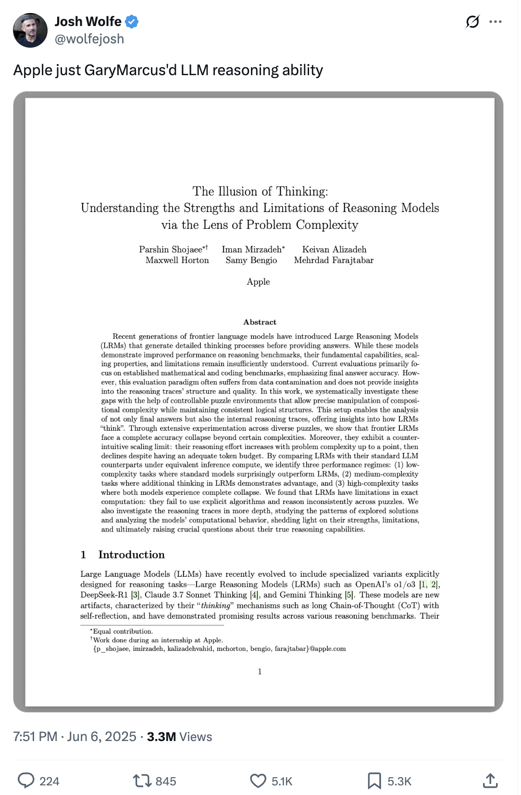
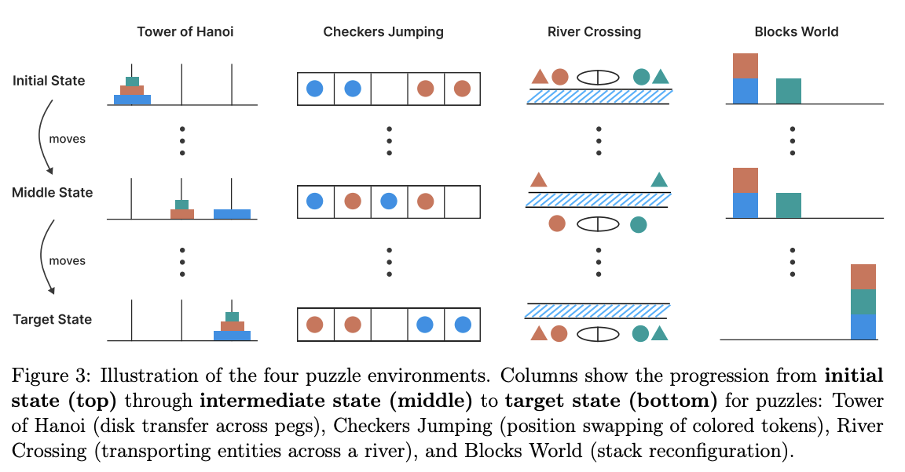

##### Note: voiceover coming later in the day. I may fix a couple typos then too.

A sufficiently general definition of reasoning I've been using is:

> Reasoning is the process of drawing conclusions by generating inferences from observations.

Ross Taylor gave this definition on his [Interconnects Interview](https://www.interconnects.ai/p/interviewing-ross-taylor-on-llm-reasoning), which I re-used on my [State of Reasoning](https://www.interconnects.ai/p/the-state-of-reasoning) recap to start the year (and he's [expanded upon on his YouTube channel](https://www.youtube.com/watch?v=S5l5OvJ01ws)). Reasoning is a general space of behaviors or skills, of which there can be many different ways of expressing it. At the same time, reasoning for humans is very naturally tied to our experiences such as consciousness or free will.

In the case of human brains, we collectively know very little of how they actually work. We, of course, know extremely well the subjective experience of our reasoning. We do not know the mechanistic processes much at all.

When it comes to language models, we're coming at it from a somewhat different angle. We know the processes we took to build these systems, but we also don't really know "how deep learning works" mechanistically. The missing piece is that we don't have a deep sense of the subjective experience of an AI model like we do with ourselves. Overall, the picture is quite similar.

To set the stage why this post is needed now, even when reasoning model progress has been rampaging across the technology industry in 2025. Last week, an Apple paper titled *[The Illusion of Thinking: Understanding the Strengths and Limitations of Reasoning Models via the Lens of Problem Complexity](https://www.arxiv.org/abs/2506.06941?utm_source=chatgpt.com)* reignited the "reasoning debate" with newfound vigor.

Some of the key examples in the paper, other than traditional reasoning evaluations such as MATH-500, were that AIs struggled to solve scaled up versions of toy problems, shown below. These are problems that one can programmatically increase the complexity on.

The argument was that language models cannot generalize to higher complexity problems. On one of these toy problems, the Tower of Hanoi, [the models structurally cannot output enough tokens to solve the problem](https://x.com/scaling01/status/1931783050511126954) --- the authors still took this as a claim that "these models cannot reason" or "they cannot generalize." This is a small scientific error.

The paper does do some good work in showing the limitations of current models (and methods generally) when it comes to handling complex questions. In many ways, answering those with a single chain of thought is unlikely to ever actually work, but they could be problems that the model learns to solve with code execution or multiple passes referencing internal memory. We still need new methods or systems, of course, but that is not a contribution to the question can language models reason? Existence of a trait like reasoning needs small, contained problems. Showing individual failures cannot be a proof of absence.

This summary of the paper, written by o3-pro for fun, sets up the argument well:

> The presence of a coherent-looking chain‑of‑thought is not reliable evidence of an internal reasoning algorithm; it can be an illusion generated by the same pattern‑completion process that writes the final answer.

The thing is, the low-level behavior isn't evidence of reasoning. A tiny AI model or program can create sequences of random strings that look like chains of thought. The evidence of reasoning is that these structures are *used* to solve real tasks.

That the models we use are imperfect is not at all a conclusive argument that they cannot do the behavior at all. We are dealing with the first generation of these models. Even humans, who have been reasoning for hundreds of thousands of years, still show complete illusions of reasoning. I for one have benefitted in my coursework days by regurgitating a random process of solving a problem from my repertoire to trick the grader into giving me a substantial amount of partial credit.

Another point the paper points out is that on the hardest problems, AI models will churn through thinking for a while, but suddenly collapse even when compute is left. Back to the test-taking analogy --- who doesn't remember the drama of a middle-of-the-pack classmate leaving early during a brutally hard exam because they know they had nothing left? Giving up and pivoting to a quick guess almost mirrors human intelligence too.

This all brings us back to the story of human intelligence. Human intelligence is the existence proof that has motivated modern efforts into AI for decades. The goal has been to recreate it.

Humans for a long time have been drawn to nature for inspiration on their creations. Humans long sought flying machines inspired by nature's most common flying instrument --- flapping wings --- by building [ornithopters](https://en.wikipedia.org/wiki/Ornithopter).

Let's remember how that turned out. The motivation is surely essential to achieving our goal of making the thing, but the original goal is far from reality.

Human reasoning is the flapping wings of this analogy. It's the target, but not the end point. Any useful definition of reasoning should encompass what humans do and what our future creations will do.

We've passed the Wright Brothers moment for artificial reasoners --- it's not what we expected it to look like, but it's here.

We should go deeper on why the subjective experience we have as humans makes this case far harder to disentangle than flight. Flight is a physical phenomenon, and hence one detached from our mind. Our mind is literally only representing reality through a transformation, and it can manipulate this representation in a way that serves its physical interests.

Free will is one of those manipulations, or expressions. Free will is a useful construct that enables many complex human behaviors.

The "awareness" of these reasoning models is definitely in a tricky middle ground. The language models have a remarkable general understanding of the environments they operate in --- they can explain what a code executor or a chatbot is with precision. They cannot, though, explain exactly how *the* environment they're in works.

AI gaining this level of awareness while being able to act is entirely new. Previous generations of AI models that acted were RL systems trained end-to-end to act in a narrow environment. They were superhuman but had effectively no awareness of how the environment worked. Having both the ability to break down problems and express some level of awareness with the world is remarkable. What is missing in the human comparison is AIs being able to evolve with the environment, i.e. [continual learning](https://www.interconnects.ai/p/what-comes-next-with-reinforcement).

Just because an AI doesn't have all the tools that we use to interact intelligently with the world does not mean it isn't reasoning. The models break down problems and iteratively try until they reach an answer. Sometimes the answer is wrong, but that'll improve over time in line with their awareness.

You say AIs are just pattern matching --- I say humans are just pattern matching too. We're doing it in different ways. Would many of the critics be more accepting of this type of reasoning if it was moved to a [latent reasoning](https://www.interconnects.ai/i/156272283/why-latent-reasoning-is-so-interesting) approach, more similar to how humans draw answers out of thin air and ruminating?

Hallucinations are a great example of the type of complete awareness our AI systems lack. We'll get better at this. For now, AI models are very minimally trained for "calibration" or knowing what they know. Why train models to know what they know when there are easier ways to solve evaluations? This is why I call calibration a trait of [next-generation models](https://www.interconnects.ai/p/next-gen-reasoners) --- we're just now getting to the point where it's needed to solve complex tasks.

With better awareness one could argue for consciousness, but I don't have a good grasp on how that is defined for humans so I won't go so far as to assign it to other systems.

Ilya Sutskever discussed the boundary between understanding and awareness, as what comes next, in his latest test of [time talk at NeurIPS 2024](https://www.youtube.com/watch?v=rlFIhUUvDP4). To understand is to predict things accurately. To be self-aware is to be able to predict accurately with an understanding of what it is and what its environment is. This all goes back to Ilya's provocation for why next-token prediction is enough [on the Dwarkesh Podcast](https://www.youtube.com/watch?v=Yf1o0TQzry8):

> Predicting the next token well means that you understand the underlying reality that led to the creation of that token.

His argument is that self-awareness will follow as we push AI models to understand the world. Since that quote 2 years ago, we've made immense progress on his vision. Ilya also included a warning in his more recent NeurIPS talk:

> The more \[a system\] reasons, the more unpredictable it becomes.

We are crossing a rubicon. To ignore this is to be fundamentally ill-prepared for the future.

Being surrounded by another intelligent entity is naturally very off-putting for humans. We evolved in a way that made our social and abstract intelligence a major competitive advantage that allowed us to effectively conquer our environment. I'm not an evolutionary biologist nor anthropologist nor sociologist, but it appears that a majority of critiques of AI reasoning are based in a fear of no longer being special rather than a fact-based analysis of behaviors.

------------------------------------------------------------------------

*Thanks again to Ross Taylor for discussions that helped form this post.*
