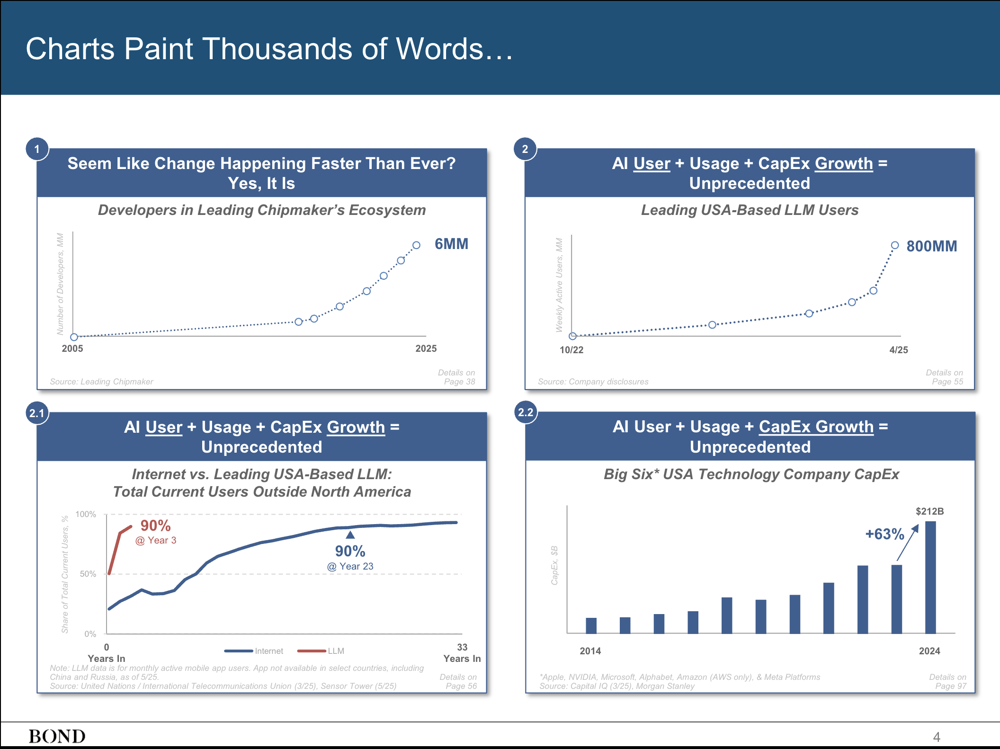

The placement of links within Interconnects has had a few evolutions over the years and hopefully this next one is a more stable place. I'm moving the links post from the [Artifacts Log](https://www.interconnects.ai/t/artifacts-log) series to a standalone, slightly less than monthly, series. This'll give them space to breathe. They're a popular subset of Artifacts Log's based on the click data I get, but in this era with so much content it's best to give you one obvious piece of content per email.

A separate post will also give me a bit more space to tell you why I'm reading them. Comments for these posts will be open, so folks can chime in on what they're reading too.

------------------------------------------------------------------------

This [Mary Meeker slide-deck](https://www.bondcap.com/reports/tai) did the rounds weeks ago, but it's still the best summary of the industry we've seen in a long time. It shows countless trends that are up and to the right in usage and revenue growth. There is so much evidence that *[people use AI more than you think](https://www.interconnects.ai/p/people-use-ai-more-than-you-think)* and that the revenue forecasts for AI companies, at least for existing products and not far out agents, are realistic because they're supply limited on compute (unlike previous software companies).

The core of what I've been reading is within the Substack AI content ecosystem. There's so much great stuff getting published right now telling you where the technology is going --- i.e. stuff not focused on noisy product releases or drama. Ones I liked include:

My new colleague 's take on the path to AGI with RL. This complements my recent pieces on [next-generation reasoning models](https://www.interconnects.ai/p/next-gen-reasoners), the [philosophy of reasoning machines](https://www.interconnects.ai/p/the-rise-of-reasoning-machines), and [RL generally](https://www.interconnects.ai/p/what-comes-next-with-reinforcement). Here's an excerpt:

> The development of AlphaGo illustrates this paradox perfectly:
>
> -   RL was essentially the only viable approach for achieving superhuman performance in Go
>
> -   The project succeeded but required enormous resources and effort
>
> -   The solution existed in a \"narrow passageway\" - there were likely very few variations of the AlphaGo approach that would have worked, as can be seen by the struggle that others have had replicating AlphaGo's success in other domains.

::::::::: {.embedded-post-wrap attrs="{\"id\":160529469,\"url\":\"https://www.artfintel.com/p/reinforcement-learning-and-general\",\"publication_id\":1461038,\"publication_name\":\"Artificial Fintelligence\",\"publication_logo_url\":\"https://substackcdn.com/image/fetch/$s_!JwWp!,f_auto,q_auto:good,fl_progressive:steep/https%3A%2F%2Fsubstack-post-media.s3.amazonaws.com%2Fpublic%2Fimages%2F58c3a757-b2e7-4104-9f17-1e79c01d013c_1024x1024.png\",\"title\":\"Reinforcement learning and general intelligence\",\"truncated_body_text\":\"A disclaimer: nothing that I say here is representing any organization other than Artificial Fintelligence. These are my views, and mine alone, although I hope that you share them after reading.\",\"date\":\"2025-06-05T15:31:27.185Z\",\"like_count\":21,\"comment_count\":3,\"bylines\":[{\"id\":1592028,\"name\":\"Finbarr Timbers\",\"handle\":\"finbarrtimbers\",\"previous_name\":null,\"photo_url\":\"https://substackcdn.com/image/fetch/f_auto,q_auto:good,fl_progressive:steep/https%3A%2F%2Fsubstack-post-media.s3.amazonaws.com%2Fpublic%2Fimages%2F1f5f239b-5582-4fb4-983a-2c42a6a3a99a_399x399.jpeg\",\"bio\":\"empiricist. ml researcher. previously: engineering at deepmind 🧠\",\"profile_set_up_at\":\"2022-03-15T06:29:54.427Z\",\"reader_installed_at\":\"2022-03-15T06:28:48.757Z\",\"publicationUsers\":[{\"id\":1426017,\"user_id\":1592028,\"publication_id\":1461038,\"role\":\"admin\",\"public\":true,\"is_primary\":true,\"publication\":{\"id\":1461038,\"name\":\"Artificial Fintelligence\",\"subdomain\":\"finbarrtimbers\",\"custom_domain\":\"www.artfintel.com\",\"custom_domain_optional\":false,\"hero_text\":\"I write detailed articles about the frontiers of AI research.\\n\\nRead by over 5000 researchers at OpenAI, DeepMind, Midjourney, Google, Stanford, Berkeley, etc.\",\"logo_url\":\"https://substack-post-media.s3.amazonaws.com/public/images/58c3a757-b2e7-4104-9f17-1e79c01d013c_1024x1024.png\",\"author_id\":1592028,\"primary_user_id\":1592028,\"theme_var_background_pop\":\"#FF5CD7\",\"created_at\":\"2023-03-02T04:24:17.269Z\",\"email_from_name\":null,\"copyright\":\"Finbarr Timbers\",\"founding_plan_name\":\"Founding Member\",\"community_enabled\":true,\"invite_only\":false,\"payments_state\":\"paused\",\"language\":null,\"explicit\":false,\"homepage_type\":\"newspaper\",\"is_personal_mode\":false}}],\"twitter_screen_name\":\"finbarrtimbers\",\"is_guest\":false,\"bestseller_tier\":null}],\"utm_campaign\":null,\"belowTheFold\":true,\"type\":\"newsletter\",\"language\":\"en\"}" component-name="EmbeddedPostToDOM"}
{.embedded-post native="true"}

::: embedded-post-header
{.embedded-post-publication-logo loading="lazy"}[Artificial Fintelligence]{.embedded-post-publication-name}
:::

:::: embedded-post-title-wrapper
::: embedded-post-title
Reinforcement learning and general intelligence
:::
::::

::: embedded-post-body
A disclaimer: nothing that I say here is representing any organization other than Artificial Fintelligence. These are my views, and mine alone, although I hope that you share them after reading...
:::

::: embedded-post-cta-wrapper
[Read more]{.embedded-post-cta}
:::

::: embedded-post-meta
2 months ago · 21 likes · 3 comments · Finbarr Timbers
:::
:::::::::

Another one is from an author I consistently recommend, , who leads model behavior at OpenAI. This post is on human-AI relationships, which is somewhat far out, but reinforces how model behavior is going to get easier to steer as models get stronger, which opens up very different problems than we're facing today with LMArena maxing models as our biggest problem.

::::::::: {.embedded-post-wrap attrs="{\"id\":165287609,\"url\":\"https://reservoirsamples.substack.com/p/some-thoughts-on-human-ai-relationships\",\"publication_id\":246138,\"publication_name\":\"Reservoir Samples\",\"publication_logo_url\":null,\"title\":\"Some thoughts on human-AI relationships \",\"truncated_body_text\":\"// I lead model behavior & policy at OpenAI.\",\"date\":\"2025-06-05T18:55:12.563Z\",\"like_count\":197,\"comment_count\":132,\"bylines\":[{\"id\":4043836,\"name\":\"Joanne Jang\",\"handle\":\"meowmeow\",\"previous_name\":null,\"photo_url\":\"https://bucketeer-e05bbc84-baa3-437e-9518-adb32be77984.s3.amazonaws.com/public/images/631af6c8-832f-4f96-9461-673f6c6498ed_2048x2048.png\",\"bio\":\"Crazy cat lady in SF\",\"profile_set_up_at\":\"2022-01-31T03:30:37.151Z\",\"reader_installed_at\":\"2025-01-05T03:46:23.741Z\",\"publicationUsers\":[{\"id\":188080,\"user_id\":4043836,\"publication_id\":246138,\"role\":\"admin\",\"public\":true,\"is_primary\":true,\"publication\":{\"id\":246138,\"name\":\"Reservoir Samples\",\"subdomain\":\"reservoirsamples\",\"custom_domain\":null,\"custom_domain_optional\":false,\"hero_text\":\"Thoughts sampled from Joanne’s stream of consciousness\",\"logo_url\":null,\"author_id\":4043836,\"primary_user_id\":4043836,\"theme_var_background_pop\":\"#E29D8D\",\"created_at\":\"2020-12-26T00:54:35.114Z\",\"email_from_name\":\"Joanne Jang from Reservoir Samples\",\"copyright\":\"Joanne Jang\",\"founding_plan_name\":null,\"community_enabled\":true,\"invite_only\":false,\"payments_state\":\"disabled\",\"language\":null,\"explicit\":false,\"homepage_type\":null,\"is_personal_mode\":false}}],\"twitter_screen_name\":\"joannejang\",\"is_guest\":false,\"bestseller_tier\":null}],\"utm_campaign\":null,\"belowTheFold\":true,\"type\":\"newsletter\",\"language\":\"en\"}" component-name="EmbeddedPostToDOM"}
{.embedded-post native="true"}

::: embedded-post-header
[Reservoir Samples]{.embedded-post-publication-name}
:::

:::: embedded-post-title-wrapper
::: embedded-post-title
Some thoughts on human-AI relationships
:::
::::

::: embedded-post-body
// I lead model behavior & policy at OpenAI...
:::

::: embedded-post-cta-wrapper
[Read more]{.embedded-post-cta}
:::

::: embedded-post-meta
2 months ago · 197 likes · 132 comments · Joanne Jang
:::
:::::::::

In some ways this feels like rounding up who among the top tiers of AI circles wrote in public, but in reality plenty of the pieces from these authors wouldn't make the cut.

The next one from of UC Berkeley and Physical Intelligence fame provided an interesting provocation on why language as the foundation of AI may have been special --- essentially letting the models think in a token space that can allow thinking. The post answers the question: If we have so much more video data than text, why are text-based models better at understanding the world than predicting just the next pixels?

Here's an excerpt:

> Unfortunately, things didn't pan out the way that video prediction researchers had expected. Although we now have models that can *generate* remarkably realistic video based on user requests, if we want models that solve complex problems, perform intricate reasoning, and make subtle inferences, language models are still the main and only option.

::::::::: {.embedded-post-wrap attrs="{\"id\":165488673,\"url\":\"https://sergeylevine.substack.com/p/language-models-in-platos-cave\",\"publication_id\":1054969,\"publication_name\":\"Learning and Control\",\"publication_logo_url\":null,\"title\":\"Language Models in Plato's Cave\",\"truncated_body_text\":\"From its original inception, the study of artificial intelligence has been intertwined with the quest to understand human intelligence. Predicated on the notion that the mind is fundamentally computational – that is, it can be modeled as an algorithmic framework independently of its underlying computational substrate or “hardware,” – AI researchers have…\",\"date\":\"2025-06-08T19:29:29.129Z\",\"like_count\":153,\"comment_count\":11,\"bylines\":[{\"id\":15583187,\"name\":\"Sergey Levine\",\"handle\":\"sergeylevine\",\"previous_name\":null,\"photo_url\":\"https://bucketeer-e05bbc84-baa3-437e-9518-adb32be77984.s3.amazonaws.com/public/images/44e4b94b-07c6-4315-ba54-38ebcd9fc9f2_355x357.png\",\"bio\":\"Sergey Levine is an Associate Professor at UC Berkeley and co-founder of Physical Intelligence. His work concerns machine learning, robotics, and other applications of learning-based decision making.\",\"profile_set_up_at\":\"2022-08-21T23:46:04.134Z\",\"reader_installed_at\":null,\"publicationUsers\":[{\"id\":1002637,\"user_id\":15583187,\"publication_id\":1054969,\"role\":\"admin\",\"public\":true,\"is_primary\":true,\"publication\":{\"id\":1054969,\"name\":\"Learning and Control\",\"subdomain\":\"sergeylevine\",\"custom_domain\":null,\"custom_domain_optional\":false,\"hero_text\":\"Machine learning for robots and robots for machine learning\",\"logo_url\":null,\"author_id\":15583187,\"primary_user_id\":15583187,\"theme_var_background_pop\":\"#D10000\",\"created_at\":\"2022-08-21T23:48:16.074Z\",\"email_from_name\":null,\"copyright\":\"Sergey Levine\",\"founding_plan_name\":null,\"community_enabled\":true,\"invite_only\":false,\"payments_state\":\"disabled\",\"language\":null,\"explicit\":false,\"homepage_type\":null,\"is_personal_mode\":false}}],\"is_guest\":false,\"bestseller_tier\":null}],\"utm_campaign\":null,\"belowTheFold\":true,\"type\":\"newsletter\",\"language\":\"en\"}" component-name="EmbeddedPostToDOM"}
{.embedded-post native="true"}

::: embedded-post-header
[Learning and Control]{.embedded-post-publication-name}
:::

:::: embedded-post-title-wrapper
::: embedded-post-title
Language Models in Plato\'s Cave
:::
::::

::: embedded-post-body
From its original inception, the study of artificial intelligence has been intertwined with the quest to understand human intelligence. Predicated on the notion that the mind is fundamentally computational -- that is, it can be modeled as an algorithmic framework independently of its underlying computational substrate or "hardware," -- AI researchers have...
:::

::: embedded-post-cta-wrapper
[Read more]{.embedded-post-cta}
:::

::: embedded-post-meta
2 months ago · 153 likes · 11 comments · Sergey Levine
:::
:::::::::

And, of course, we have helping carry the torch of the few remaining people who are very optimistic about the potential of AI as a technology calling out the crazy moves of the industry. Too many of these critiques come from people who are critical of the technology as well, so their voices are ignored by people in power because they're never being reasonable.

::::::::: {.embedded-post-wrap attrs="{\"id\":164818379,\"url\":\"https://helentoner.substack.com/p/supercomputers-for-autocrats\",\"publication_id\":3734020,\"publication_name\":\"Rising Tide\",\"publication_logo_url\":\"https://substackcdn.com/image/fetch/$s_!v5jt!,f_auto,q_auto:good,fl_progressive:steep/https%3A%2F%2Fsubstack-post-media.s3.amazonaws.com%2Fpublic%2Fimages%2Fef4e7f08-6cb6-4b12-b592-806a8f2357b0_1280x1280.png\",\"title\":\"Building supercomputers for autocrats probably isn’t good for democracy, actually\",\"truncated_body_text\":\"In early May, OpenAI announced OpenAI for Countries. Referencing their Stargate effort to build massive AI data centers in Texas and elsewhere in the United States, they wrote:\",\"date\":\"2025-06-06T20:12:16.063Z\",\"like_count\":154,\"comment_count\":16,\"bylines\":[{\"id\":1591604,\"name\":\"Helen Toner\",\"handle\":\"helentoner\",\"previous_name\":null,\"photo_url\":\"https://substackcdn.com/image/fetch/f_auto,q_auto:good,fl_progressive:steep/https%3A%2F%2Fsubstack-post-media.s3.amazonaws.com%2Fpublic%2Fimages%2F504a525a-715f-467c-a4c3-b024c88cbf45_2373x2209.jpeg\",\"bio\":\"AI, national security, China. Part of the founding team at Georgetown's Center for Security and Emerging Technology.\",\"profile_set_up_at\":\"2023-09-18T20:12:38.596Z\",\"reader_installed_at\":\"2025-03-15T02:19:34.352Z\",\"publicationUsers\":[{\"id\":3806850,\"user_id\":1591604,\"publication_id\":3734020,\"role\":\"admin\",\"public\":true,\"is_primary\":true,\"publication\":{\"id\":3734020,\"name\":\"Rising Tide\",\"subdomain\":\"helentoner\",\"custom_domain\":null,\"custom_domain_optional\":false,\"hero_text\":\"Intermittent thoughts on navigating the transition to a world with extremely advanced AI systems\",\"logo_url\":\"https://substack-post-media.s3.amazonaws.com/public/images/ef4e7f08-6cb6-4b12-b592-806a8f2357b0_1280x1280.png\",\"author_id\":1591604,\"primary_user_id\":1591604,\"theme_var_background_pop\":\"#FF6719\",\"created_at\":\"2025-01-11T18:39:32.316Z\",\"email_from_name\":null,\"copyright\":\"Helen Toner\",\"founding_plan_name\":null,\"community_enabled\":true,\"invite_only\":false,\"payments_state\":\"disabled\",\"language\":null,\"explicit\":false,\"homepage_type\":\"newspaper\",\"is_personal_mode\":false}}],\"is_guest\":false,\"bestseller_tier\":null}],\"utm_campaign\":null,\"belowTheFold\":true,\"type\":\"newsletter\",\"language\":\"en\"}" component-name="EmbeddedPostToDOM"}
{.embedded-post native="true"}

::: embedded-post-header
{.embedded-post-publication-logo loading="lazy"}[Rising Tide]{.embedded-post-publication-name}
:::

:::: embedded-post-title-wrapper
::: embedded-post-title
Building supercomputers for autocrats probably isn't good for democracy, actually
:::
::::

::: embedded-post-body
In early May, OpenAI announced OpenAI for Countries. Referencing their Stargate effort to build massive AI data centers in Texas and elsewhere in the United States, they wrote...
:::

::: embedded-post-cta-wrapper
[Read more]{.embedded-post-cta}
:::

::: embedded-post-meta
2 months ago · 154 likes · 16 comments · Helen Toner
:::
:::::::::

The post expanding on the problem of people making nonsensical critiques of AI is below, from a newer author I found. I describe this as an antidote to the Gary Marcus disease.

::::::::: {.embedded-post-wrap attrs="{\"id\":165466659,\"url\":\"https://www.learningfromexamples.com/p/what-academics-get-wrong\",\"publication_id\":1838544,\"publication_name\":\"Learning From Examples\",\"publication_logo_url\":\"https://substackcdn.com/image/fetch/$s_!S1Kl!,f_auto,q_auto:good,fl_progressive:steep/https%3A%2F%2Fsubstack-post-media.s3.amazonaws.com%2Fpublic%2Fimages%2F04935df3-9e78-4564-b881-67a57b0ad87f_1024x1024.png\",\"title\":\"Academics are kidding themselves about AI\",\"truncated_body_text\":\"Last week I wrote about reasoning models. I argued that — despite some recent flawed work on the subject — they have some curious limitations, and outlined a rough sense of where I expect developers to go in the future based on those shortcomings.\",\"date\":\"2025-06-17T10:15:16.007Z\",\"like_count\":208,\"comment_count\":61,\"bylines\":[{\"id\":10612241,\"name\":\"Harry Law\",\"handle\":\"harrylaw\",\"previous_name\":null,\"photo_url\":\"https://substackcdn.com/image/fetch/f_auto,q_auto:good,fl_progressive:steep/https%3A%2F%2Fsubstack-post-media.s3.amazonaws.com%2Fpublic%2Fimages%2F6e3b7060-b903-4478-aea7-95ccdd760a01_623x656.jpeg\",\"bio\":\"AI history, philosophy, and governance at the University of Cambridge. Formerly ethics and policy at Google DeepMind. \",\"profile_set_up_at\":\"2023-07-29T13:35:27.450Z\",\"reader_installed_at\":\"2024-10-11T18:42:23.548Z\",\"publicationUsers\":[{\"id\":1824314,\"user_id\":10612241,\"publication_id\":1838544,\"role\":\"admin\",\"public\":true,\"is_primary\":true,\"publication\":{\"id\":1838544,\"name\":\"Learning From Examples\",\"subdomain\":\"learningfromexamples\",\"custom_domain\":\"www.learningfromexamples.com\",\"custom_domain_optional\":false,\"hero_text\":\"A history newsletter about the future \",\"logo_url\":\"https://substack-post-media.s3.amazonaws.com/public/images/04935df3-9e78-4564-b881-67a57b0ad87f_1024x1024.png\",\"author_id\":10612241,\"primary_user_id\":10612241,\"theme_var_background_pop\":\"#EA82FF\",\"created_at\":\"2023-07-29T13:37:13.212Z\",\"email_from_name\":\"Harry Law\",\"copyright\":\"Harry Law\",\"founding_plan_name\":null,\"community_enabled\":true,\"invite_only\":false,\"payments_state\":\"disabled\",\"language\":null,\"explicit\":false,\"homepage_type\":\"newspaper\",\"is_personal_mode\":false}}],\"is_guest\":false,\"bestseller_tier\":null}],\"utm_campaign\":null,\"belowTheFold\":true,\"type\":\"newsletter\",\"language\":\"en\"}" component-name="EmbeddedPostToDOM"}
{.embedded-post native="true"}

::: embedded-post-header
{.embedded-post-publication-logo loading="lazy"}[Learning From Examples]{.embedded-post-publication-name}
:::

:::: embedded-post-title-wrapper
::: embedded-post-title
Academics are kidding themselves about AI
:::
::::

::: embedded-post-body
Last week I wrote about reasoning models. I argued that --- despite some recent flawed work on the subject --- they have some curious limitations, and outlined a rough sense of where I expect developers to go in the future based on those shortcomings...
:::

::: embedded-post-cta-wrapper
[Read more]{.embedded-post-cta}
:::

::: embedded-post-meta
2 months ago · 208 likes · 61 comments · Harry Law
:::
:::::::::

The last of the AI posts on Substack you need to read is the Latent Space interview with Noam Brown. Simply a great episode recapping recent topics.

::::::::: {.embedded-post-wrap attrs="{\"id\":165741459,\"url\":\"https://www.latent.space/p/noam-brown\",\"publication_id\":1084089,\"publication_name\":\"Latent.Space\",\"publication_logo_url\":\"https://substackcdn.com/image/fetch/$s_!DbYa!,f_auto,q_auto:good,fl_progressive:steep/https%3A%2F%2Fsubstack-post-media.s3.amazonaws.com%2Fpublic%2Fimages%2F73b0838a-bd14-46a1-801c-b6a2046e5c1e_1130x1130.png\",\"title\":\"Scaling Test Time Compute to Multi-Agent Civilizations: Noam Brown\",\"truncated_body_text\":\"Every breakthrough in AI has had a leading champion who identified and evangelized a core scaling law — Moore’s Law gave way to Huang’s Law (silicon), Kaplan et al gave way to Hoffman et al (data), A…\",\"date\":\"2025-06-19T21:06:05.468Z\",\"like_count\":35,\"comment_count\":0,\"bylines\":[],\"utm_campaign\":null,\"belowTheFold\":true,\"type\":\"newsletter\",\"language\":\"en\"}" component-name="EmbeddedPostToDOM"}
{.embedded-post native="true"}

::: embedded-post-header
{.embedded-post-publication-logo loading="lazy"}[Latent.Space]{.embedded-post-publication-name}
:::

:::: embedded-post-title-wrapper
::: embedded-post-title
Scaling Test Time Compute to Multi-Agent Civilizations: Noam Brown
:::
::::

::: embedded-post-body
Every breakthrough in AI has had a leading champion who identified and evangelized a core scaling law --- Moore's Law gave way to Huang's Law (silicon), Kaplan et al gave way to Hoffman et al (data), A...
:::

::: embedded-post-cta-wrapper
[Read more]{.embedded-post-cta}
:::

::: embedded-post-meta
2 months ago · 35 likes
:::
:::::::::

On the long-form side, I've been reading the two books that came out recently about OpenAI --- [Empire of AI](https://www.penguinrandomhouse.com/books/743569/empire-of-ai-by-karen-hao/) and [The Optimist](https://www.amazon.com/Optimist-Altman-OpenAI-Invent-Future/dp/1324075961). They do very different things. Empire of AI is better overall for learning about how OpenAI and the Valley operate, but some sections I skipped over as a bit too polemic for me. The Optimist has some nice history on Sam Altman's origins and his time at Y Combinator, but the OpenAI stuff was much lighter, so I didn't finish it and am happily starting [Apple in China](https://www.amazon.com/Apple-China-Capture-Greatest-Company/dp/1668053373).

From here, let's go to some quick hits:

-   [Reverse engineer Claude code.](https://southbridge-research.notion.site/claude-code-an-agentic-cleanroom-analysis)

-   [A post asking do reasoning models work like humans?](https://epoch.ai/gradient-updates/beyond-benchmark-scores-analysing-o3-mini-math-reasoning)

-   [nanoVLLM](https://github.com/GeeeekExplorer/nano-vllm/tree/main): A minimal implementation of a complex inference library like VLLM.

-   A [nice post](https://seohong.me/blog/q-learning-is-not-yet-scalable/) on why Q learning is unlikely to scale (hint, TD learning).

-   An [analysis](https://epoch.ai/blog/what-skills-does-swe-bench-verified-evaluate) of the SWE Bench benchmark.

-   A beautiful, online-first [computer vision textbook](https://visionbook.mit.edu/).

-   And, that [Karpathy talk](https://youtu.be/LCEmiRjPEtQ) at YC on the new software with LLMs that you need to watch.

And to end this issue, for the Substack service level nerds like me, you can read this post on how so many mainstream voices are now joining Substack. This actually lifts all boats by bringing more readers onto the platform.

::::::::: {.embedded-post-wrap attrs="{\"id\":164737477,\"url\":\"https://www.honest-broker.com/p/substack-has-changed-in-the-last\",\"publication_id\":296132,\"publication_name\":\"The Honest Broker\",\"publication_logo_url\":\"https://substackcdn.com/image/fetch/$s_!Vsem!,f_auto,q_auto:good,fl_progressive:steep/https%3A%2F%2Fbucketeer-e05bbc84-baa3-437e-9518-adb32be77984.s3.amazonaws.com%2Fpublic%2Fimages%2F4b9b1c6d-1d25-4039-8b7e-dd5f2858bdee_600x600.png\",\"title\":\"Substack Has Changed in the Last 30 Days\",\"truncated_body_text\":\"Everything happens so quickly at Substack. And in just the last few days, something big has changed.\",\"date\":\"2025-05-30T19:44:35.127Z\",\"like_count\":2517,\"comment_count\":353,\"bylines\":[{\"id\":4937458,\"name\":\"Ted Gioia\",\"handle\":\"tedgioia\",\"previous_name\":null,\"photo_url\":\"https://substackcdn.com/image/fetch/f_auto,q_auto:good,fl_progressive:steep/https%3A%2F%2Fbucketeer-e05bbc84-baa3-437e-9518-adb32be77984.s3.amazonaws.com%2Fpublic%2Fimages%2F67f10f9b-75d1-4b43-ba5e-96eb435dd4f5_400x400.jpeg\",\"bio\":\"Ted Gioia is author of The Honest Broker on Substack (https://www.honest-broker.com)—a frank and opinionated guide to music, books, media, and culture. He is author of 12 books, and previously served on the faculty at Stanford.\",\"profile_set_up_at\":\"2021-05-13T16:07:28.353Z\",\"reader_installed_at\":\"2022-02-18T23:17:14.231Z\",\"publicationUsers\":[{\"id\":84674,\"user_id\":4937458,\"publication_id\":296132,\"role\":\"admin\",\"public\":true,\"is_primary\":true,\"publication\":{\"id\":296132,\"name\":\"The Honest Broker\",\"subdomain\":\"tedgioia\",\"custom_domain\":\"www.honest-broker.com\",\"custom_domain_optional\":false,\"hero_text\":\"A trustworthy guide to music, books, arts, media & culture by Ted Gioia\",\"logo_url\":\"https://bucketeer-e05bbc84-baa3-437e-9518-adb32be77984.s3.amazonaws.com/public/images/4b9b1c6d-1d25-4039-8b7e-dd5f2858bdee_600x600.png\",\"author_id\":4937458,\"primary_user_id\":4937458,\"theme_var_background_pop\":\"#45D800\",\"created_at\":\"2021-02-24T05:12:42.216Z\",\"email_from_name\":\"Ted Gioia \",\"copyright\":\"Ted Gioia\",\"founding_plan_name\":\"Founding Member\",\"community_enabled\":true,\"invite_only\":false,\"payments_state\":\"enabled\",\"language\":null,\"explicit\":false,\"homepage_type\":null,\"is_personal_mode\":false}}],\"twitter_screen_name\":\"tedgioia\",\"is_guest\":false,\"bestseller_tier\":null}],\"utm_campaign\":null,\"belowTheFold\":true,\"type\":\"newsletter\",\"language\":\"en\"}" component-name="EmbeddedPostToDOM"}
{.embedded-post native="true"}

::: embedded-post-header
{.embedded-post-publication-logo loading="lazy"}[The Honest Broker]{.embedded-post-publication-name}
:::

:::: embedded-post-title-wrapper
::: embedded-post-title
Substack Has Changed in the Last 30 Days
:::
::::

::: embedded-post-body
Everything happens so quickly at Substack. And in just the last few days, something big has changed...
:::

::: embedded-post-cta-wrapper
[Read more]{.embedded-post-cta}
:::

::: embedded-post-meta
3 months ago · 2517 likes · 353 comments · Ted Gioia
:::
:::::::::
