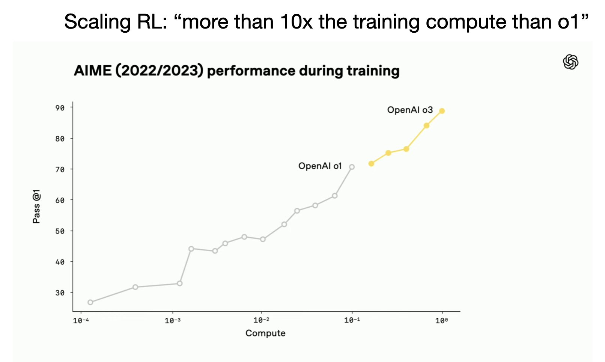

Summer is always a slow time for the tech industry. OpenAI seems fully in line with this, with their open model "[\[taking\] a little more time](https://x.com/sama/status/1932573231199707168)" and [GPT-5 seemingly always delayed a bit more](https://x.com/sama/status/1908167621624856998?ref_src=twsrc%5Etfw%7Ctwcamp%5Etweetembed%7Ctwterm%5E1908167621624856998%7Ctwgr%5E20b6089f07595d82fe3440ddb689d29f3b0170cb%7Ctwcon%5Es1_&ref_url=https%3A%2F%2Fwww.techradar.com%2Fcomputing%2Fartificial-intelligence%2Fchatgpt-5-is-on-hold-as-openai-changes-plans-and-releases-new-o3-and-o4-mini-models). These will obviously be major news items, but I'm not sure we see them until August.

I'm going to take this brief reprieve in the bombardment of AI releases to reflect on where we've been and where we're going. Here's what you should know.

## 1. o3 as a technical breakthrough beyond scaling

The default story around OpenAI's o3 model is that they "scaled compute for reinforcement learning training," which caused some [weird, entirely new over-optimization issues](https://www.interconnects.ai/p/openais-o3-over-optimization-is-back). This is true, and the plot from the livestream of the release still represents a certain type of breakthrough --- namely scaling up data and training infrastructure for reinforcement learning with verifiable rewards (RLVR).

The part of o3 that isn't talked about enough is how different its search feels. For a normal query, o3 can look at 10s of websites. The best description I've heard of its relentlessness en route to finding a niche piece of information is akin to a "trained hunting dog on the scent." o3 just feels like a model that can find information in a totally different way than anything out there.

The kicker with this is that we're multiple months out from its release in April of 2025 and no other leading lab has a model remotely like it. In a world where releases between labs, especially OpenAI and Google, seem totally mirrored, this relentless search capability in o3 still stands out to me.

The core question is when will another laboratory release a model that feels qualitatively similar? If this trend goes on through the end of the summer it'll be a confirmation that OpenAI had some technical breakthrough to increase the reliability of search and other tool-use within reasoning models.

For a contrast, consider basic questions we are facing in the open and academic community on how to build a model inspired by o3 (so something more like a GPT-4o or Claude 4 in its actual search abilities):

1.  Finding RL data where the model is incentivized to search is critical. It's easy in an RL experiment to tell the model to try searching in the system prompt, but as training goes on if the tool isn't useful the model will learn to stop using it (very rapidly). It is likely that OpenAI, particularly combined with lessons from [Deep Research's RL training](https://www.interconnects.ai/p/rl-backlog-openais-many-rls-clarifying?utm_source=publication-search) (which, I know, is built on o3), has serious expertise here. A research paper showing a DeepSeek R1 style scaled RL training along with consistent tool use rates across certain data subsets will be very impressive to me.

2.  The underlying search index is crucial. OpenAI's models operate on a Bing backend. Anthropic uses Brave's API and it struggles for it (lots of SEO spam). Spinning up an academic baseline with these APIs is a moderate additive cost on top compute.\
    \
    Once solid open baselines exist, we could do fun science such as studying which model can generalize to unseen data-stores best --- a crucial feature for spinning up a model on local sensitive data, e.g. in healthcare or banking.

If you haven't been using o3 for search, you really should give it a go.

## 2. Progress on agents will be higher variance than modeling was, but often still extremely rapid

Claude Code's product market fit, especially with Claude 4, is phenomenal. It's the full package for a product --- works quite often and well, a beautiful UX that mirrors the domain, good timing, etc. It's just a joy to use.

With this context, I really have been looking for more ways to write about it. The problem with Claude Code, and other coding agents such as Codex and Jules, is that I'm not in the core audience. I'm not regularly building in complex codebases --- I'm more of a research manager and fixer across the organization than someone that is building in one repository all the time --- so, I don't have practical guides on how to get the most out of Claude Code or a deep connection with it that can help you "feel the AGI."

What I do know about is models and systems, and there are some very basic facts of frontier models that make the trajectory for the capabilities of these agents quite optimistic.

The new part of LLM-based agents is that they involve many model calls, sometimes with multiple models and multiple prompt configurations. Previously, the models everyone was using in chat windows were designed to make progress on linear tasks and return that to the user --- there wasn't a complex memory or environment to manage.

Adding a real environment for the models has made it so the models need to do more things and often a wider breadth of tasks. When building these agentic systems, there are two types of bottlenecks:

1.  The models cannot solve any of the task we hope to use the agent for, and

2.  The models fail at small components of the task that we are deploying.

For agents that have initial traction, such as Claude Code and Deep Research, many of the problems are in the second class. How these fixes are made is that labs notice repeated, odd failures among real world use-cases. This can look like a 50% reliability rate on some long-tail mundane task. In this case it is often easy for the lab to make new data, include it in the next post-training run for their models, and up that sub-task reliability to almost 99%. As labs are making most of their gains in post-training today, rather than big pretraining runs, the time for that change to get integrated is well shorter than recent years.

The kicker for this is how it all fits together. Many complex tasks can be bottlenecked by some weird, small failures. In this case, we can have small changes to models that make agents like Claude Code feel *way* more reliable, even though the peak performance of the model hasn't changed much. The same goes for Deep Research.

With this, I expect these agents we're already using to improve randomly and in big leaps.

What I'm unsure of is when new agent platforms will be built. Some of this is a product problem and some of it is a peak performance problem. New agentic platforms that feel like they have product-market fit will be somewhat random, but those that have a fit already can improve like we're used to frontier models getting way better.

This is a different path for the industry and will take a different form of messaging than we're used to. More releases are going to look like [Anthropic's Claude 4](https://www.interconnects.ai/p/claude-4-and-anthropics-bet-on-code), where the benchmark gains are minor and the real world gains are a big step. There are plenty of more implications for policy, evaluation, and transparency that come with this. It is going to take much more nuance to understand if the pace of progress is continuing, especially as critics of AI are going to seize the opportunity of evaluations flatlining to say that AI is no longer working.

Much like o3, you should play with Claude Code even if you don't code a lot. It can make fun demos and standalone websites in no time. It's miles ahead in its approachability compared to the fully-autonomous agents like Codex (at least for the time being).

## 3. Scaling parameters is going to go very slow for consumer models

The models that leading AI labs have been releasing in 2025 have mostly stopped getting bigger in total parameters. Take Claude 4, the API prices are the same as Claude 3.5 (and its minor versions). OpenAI only half released GPT-4.5. Gemini hasn't released its Ultra variant. There are more models that are *private* to these laboratories that are certainly much bigger.

The nuanced part of this is that many of these models likely could be getting slightly smaller, e.g. Claude 4 Sonnet could be slightly smaller than Claude 3.5 Sonnet, due to efficiency gains at pretraining. That sort of marginal technical advancement is a big deal on price and inference speed, especially in the long-run, but not the central point I'm making.

The point is how GPT-5 is going to be bigger mostly through inference-time scaling and less through just "one bigger model." For years we were told the narrative that the lab with the biggest training cluster was going to win because they have an advantage with scaling. That was the story behind xAI's mega-cluster that Elon built. Now, the biggest cluster just is an advantage in overall research pace.

Scaling, at least in terms of what users need, has largely fizzled out. Labs may come back to it later as they find super hard problems that users need to solve, but where GPT 4.5 cost about 100x the compute of GPT-4 to train, it is only slightly better on normal user metrics.

What we see now is a mass efficiency march along the model sizes that people love. The industry has a few standards, from

-   Tiny models like Gemini Flash Lite or GPT 4.1 Nano,

-   Small models like Gemini Flash and Claude Haiku,

-   Standard models like GPT-4o and Gemini Pro, and

-   Big models like Claude Opus and Gemini Ultra.

These models come with somewhat predictable price-points (we know Gemini is way cheaper than the industry standard), latencies, and capability levels. Standards like this are important as industries mature!

Over time, efficiency gains will make new standards emerge. The first thing we'll see is more mass availability of the likes of Gemini Ultra and GPT-4.5 (maybe in the GPT-5 release), but what comes after that isn't on the radar at all. Now, scaling to new size tiers is only possible "every few years" or maybe not at all, if monetization of AI doesn't go as well as many hope.

Scaling as a product differentiator died in 2024. That doesn't mean pretraining as a science isn't crucial. The recent [Gemini 2.5 report](https://storage.googleapis.com/deepmind-media/gemini/gemini_v2_5_report.pdf) made that pretty clear:

> The Gemini 2.5 model series makes considerable progress in enhancing large-scale training stability, signal propagation and optimization dynamics, resulting in a considerable boost in performance straight out of pre-training compared to previous Gemini models.
