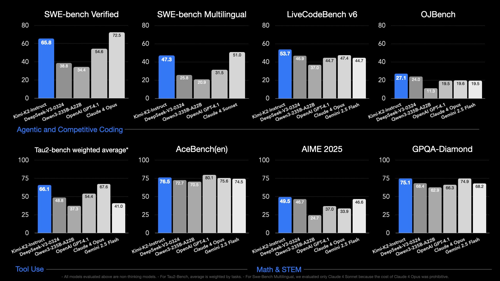
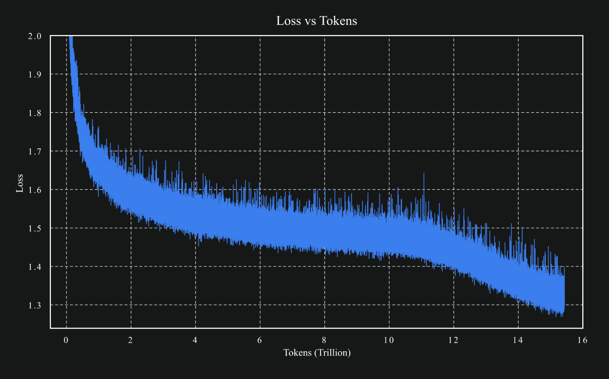

The DeepSeek R1 release earlier this year was more of a prequel than a one-off fluke in the trajectory of AI. Last week, a Chinese startup named Moonshot AI dropped [Kimi K2](https://moonshotai.github.io/Kimi-K2/), an open model that is permissively licensed[1](#footnote-1){#footnote-anchor-1 .footnote-anchor component-name="FootnoteAnchorToDOM" target="_self"} and competitive with leading frontier models in the U.S. If you\'re interested in the geopolitics of AI and the rapid dissemination of the technology, this is going to represent another \"DeepSeek moment\" where much of the Western world --- even those who consider themselves up-to-date with happenings of AI --- need to change their expectations for the coming years.

In summary, Kimi K2 shows us that:

-   HighFlyer, the organization that built DeepSeek, is far from a uniquely capable AI laboratory in China,

-   China is continuing to approach (or reached) the absolute frontier of modeling performance, and

-   The West is falling even further behind on open models.

Kimi K2, described as an \"Open-Source Agentic Model\" is a sparse mixture of experts (MoE) model[2](#footnote-2){#footnote-anchor-2 .footnote-anchor component-name="FootnoteAnchorToDOM" target="_self"} with 1T total parameters (\~1.5x DeepSeek V3/R1\'s 671B) and 32B active parameters (similar to DeepSeek V3/R1\'s 37B). It is a \"non-thinking\" model with leading performance numbers in coding and related agentic tasks (earning it many comparisons to Claude 3.5 Sonnet), which means it doesn\'t generate a long reasoning chain before answering, but it was still trained extensively with reinforcement learning. It clearly outperforms DeepSeek V3 on a variety of benchmarks, including SWE-Bench, LiveCodeBench, AIME, or GPQA, and comes with a base model released as well. It is the new best-available open model by a clear margin.

These facts with the points above all have useful parallels for what comes next:

-   **Controlling who can** ***train*** **cutting edge models is extremely difficult**. More organizations will join this list of OpenAI, Anthropic, Google, Meta, xAI, Qwen, DeepSeek, Moonshot AI, etc. Where there is a concentration of talent and sufficient compute, excellent models are very possible. This is easier to do somewhere such as China or Europe where there is existing talent, but is not restricted to these localities.

-   Kimi K2 was trained on 15.5T tokens and has a very similar number of active parameters as DeepSeek V3/R1, which was trained on 14.8T tokens. **Better models are being trained without substantial increases in compute** --- these are referred to as a mix of \"algorithmic gains\" or \"efficiency gains\" in training. Compute restrictions will certainly slow this pace of progress on Chinese companies, but they are clearly not a binary on/off bottleneck on training.

-   **The gap between the leading open models from the Western research labs versus their Chinese counterparts is only increasing in magnitude**. The best open model from an American company is, maybe, Llama-4-Maverick? Three Chinese organizations have released obviously more useful models with more permissive licenses: DeepSeek, Moonshot AI, and Qwen. A few others such as [Tencent](https://huggingface.co/tencent/models?sort=likes), [Minimax](https://huggingface.co/MiniMaxAI), [Z.ai/THUDM](https://huggingface.co/THUDM) may have Llama-4 beat too but are a half step behind the leading Chinese models on some combination of license and performance.\
    \
    This comes at the same time that new inference-heavy products are coming online that\'ll benefit from the potential of cheaper, lower margin hosting options on open models relative to API counterparts (which tend to have high profit margins).

Kimi K2 is set up for a much slower style \"DeepSeek Moment\" than the DeepSeek R1 model that came out in January of this year because it lacks two culturally salient factors:

1.  DeepSeek R1 was revelatory because it was the first model to expose the reasoning trace to the users, causing massive adoption outside of the technical AI community, and

2.  The broader public is already aware that training leading AI models is actually [very low cost](https://www.interconnects.ai/p/deepseek-v3-and-the-actual-cost-of) once the technical expertise is built up (recall the DeepSeek V3 \$5M training cost number), i.e. the final training run is cheap, so there *should* be a smaller reaction to similar cheap training cost numbers in the Kimi K2 report coming soon.

Still, as more noise is created around the K2 release (Moonshot releases a technical report soon), this could evolve very rapidly. We\'ve already seen quick experiments spin up [slotting it into the Claude Code application](https://x.com/jeremyphoward/status/1944326308210921652) (because Kimi\'s API is Claude-compatible) and K2 topping many nice \"[vibe](https://x.com/tri_dao/status/1943745133603610864?s=46) [tests](https://x.com/kalomaze/status/1943711672285139043)\" or [creativity benchmarks](https://x.com/sam_paech/status/1944276326598553853). There are also tons of fun technical details that I don\'t have time to go into --- from using a relatively unproven optimizer Muon[3](#footnote-3){#footnote-anchor-3 .footnote-anchor component-name="FootnoteAnchorToDOM" target="_self"} and scaling up the self-rewarding LLM-as-a-judge pipeline in post-training. A fun tidbit to show how much this matters relative to the noisy Grok 4 release last week is that [Kimi K2 has already surpassed Grok 4](https://x.com/OpenRouterAI/status/1944466834167919043) in API usage on the popular OpenRouter platform.

Later in the day on the 11th, following the K2 release, OpenAI CEO Sam Altman shared the following [message](https://x.com/sama/status/1943837550369812814) regarding OpenAI\'s forthcoming open model (which I previously shared more optimistic thoughts on [here](https://natolambert.substack.com/p/some-thoughts-on-openai-returning)) :

> we planned to launch our open-weight model next week.
>
> we are delaying it; we need time to run additional safety tests and review high-risk areas. we are not yet sure how long it will take us.
>
> while we trust the community will build great things with this model, once weights are out, they can't be pulled back. this is new for us and we want to get it right.
>
> sorry to be the bearer of bad news; we are working super hard!

Many attributed this as a reactive move by OpenAI to get out from the shadow of Kimi K2\'s wonderful release and another DeepSeek media cycle.

Even though someone at OpenAI shared with me that the rumor that Kimi caused the delay for their open model is very likely not true, this is what being on the back foot looks like. When you\'re on the back foot, narratives like this are impossible to control.

We need leaders at the closed AI laboratories in the U.S. to rethink some of the long-term dynamics they\'re battling with R&D adoption. We need to mobilize funding for [great, open science projects](https://www.interconnects.ai/p/the-american-deepseek-project) in the U.S. and Europe. Until then, this is what losing looks like if you want The West to be the long-term foundation of AI research and development. Kimi K2 has shown us that one \"DeepSeek Moment\" wasn\'t enough for us to make the changes we need, and hopefully we don\'t need a third.

:::: {.footnote component-name="FootnoteToDOM"}
[1](#footnote-anchor-1){#footnote-1 .footnote-number contenteditable="false" target="_self"}

::: footnote-content
The modified MIT [license](https://huggingface.co/moonshotai/Kimi-K2-Instruct/blob/main/LICENSE) is somewhat annoying, but technically easy to comply with. These sorts of added terms on marketing make it in conflict with \"true open-source principles\".
:::
::::

:::: {.footnote component-name="FootnoteToDOM"}
[2](#footnote-anchor-2){#footnote-2 .footnote-number contenteditable="false" target="_self"}

::: footnote-content
Very similar to [DeepSeek architecture](https://x.com/rasbt/status/1944056316424577525).
:::
::::

:::: {.footnote component-name="FootnoteToDOM"}
[3](#footnote-anchor-3){#footnote-3 .footnote-number contenteditable="false" target="_self"}

::: footnote-content
Beautiful learning curve.

:::
::::
