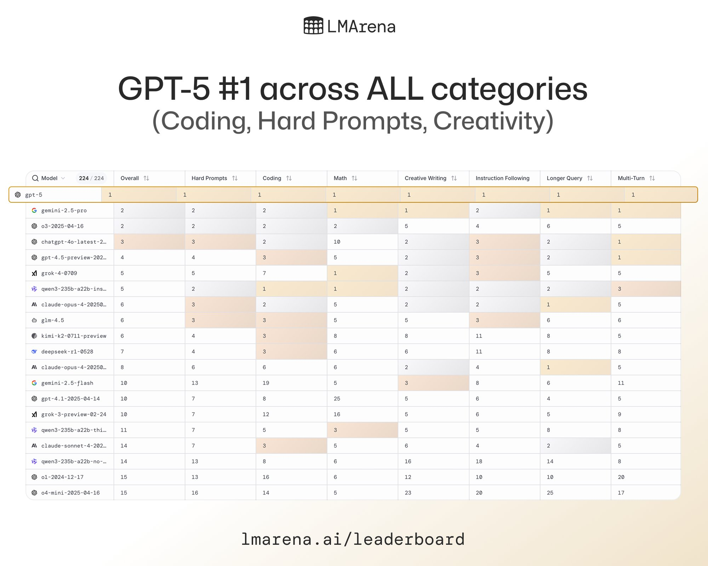
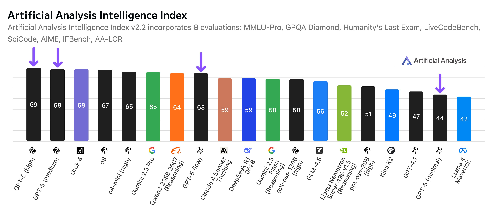
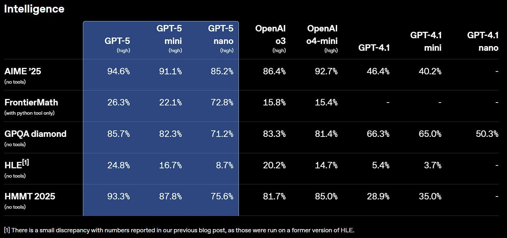
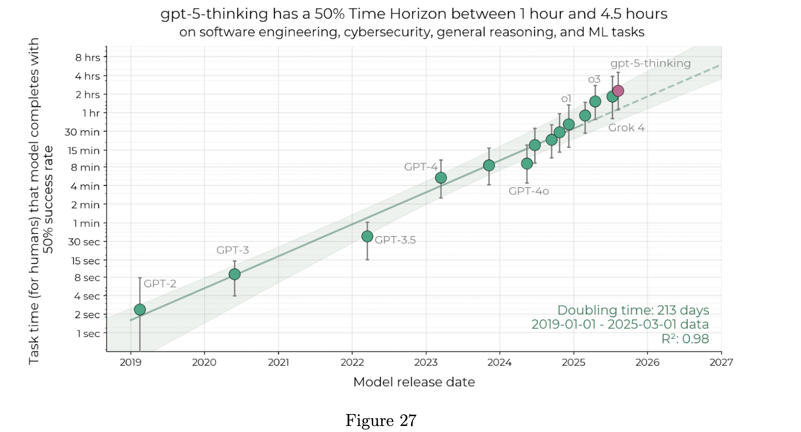

##### If you want a video version of this, check out the [last 20 minutes of the livestream reaction](https://www.youtube.com/watch?v=oOtHtK7YK2g) (edit, fixed link) I did with Will Brown of Prime Intellect and Swyx of Smol AI & Latent Space.

------------------------------------------------------------------------

GPT-5 was set up to fail on some of the narratives it was expected to satisfy. The two central themes it had to decide between were the AGI (or superintelligence) narrative that Sam Altman & co. have been using to fundraise and the fact that ChatGPT is one of the fastest-growing consumer technologies of all time.

To fulfill both, GPT-5 needed to be AGI while also being cheap enough to serve as the most-used AI system in the world. Business and technological realities made it inevitable that GPT-5's primary impact would be to solidify OpenAI's market position, even if it raises a lot of eyebrows for the long-term trajectory of AI.

The reactions online capture this as well. The OpenAI live streams have historically catered to AI insiders, but the product speaks entirely to a different audience. The people discussing this release on Twitter will be disappointed in a first reaction, but 99% of people using ChatGPT are going to be so happy about the upgrade. Confusingly enough, this includes many of the critics. GPT-5 is a good AI system. It's right in line with best-in-class across pretty much every evaluation, while being cheap enough to serve the whole world.

OpenAI is largely fixing its product offering with an announcement that was hyped to be one of the biggest AI news cycles of the year. AI news being loud is defined by *narratives* being different more-so than technology being better. OpenAI releasing an open model again will likely be pinpointed as just as important a day for the arc of AI as the GPT-5 release. In many ways GPT-5 was set up to fail and that is very off-putting for those expecting maximum AI progress in the near term.

I'm not going to dwell on it, but oh boy, that was a messy release. GPT-5 being announced and rolled out like this is very odd. Countless [plots were mislabeled](https://x.com/connerdelights/status/1953503460768592236), live demos had bugs, and the [early rollout is doing some weird stuff](https://x.com/captainbullshi/status/1953540488549863753?s=46). This reinforces how OpenAI was torn about the release and backed into a corner with their messaging. They knew they needed to improve the experience with strong competition in the industry, but releasing GPT-5 needed to make a splash after how long they've waited (and already parked the GPT 4.5 name).

The core question we track in this post is: What does it mean for the next 6-18 months of AI progress if GPT-5 is just as good as all the best models out there, e.g., Claude Sonnet for coding or o3 for search, funneled into one, super cheap package?

If AGI was a real goal, the main factor on progress would be raw performance. GPT-5 shows that AI is on a somewhat more traditional technological path, where there isn't one key factor, it is a mix of performance, price, product, and everything in between.

## GPT-5's performance

There are a few places that we can see that GPT-5 represents a solid step on the performance trend line, but nothing like a step change. First, on [LMArena](https://x.com/lmarena_ai/status/1953504958378356941), GPT-5 is fantastic, sweeping the board to #1 on all categories. The last model to claim #1 in pretty much every category was [Gemini 2.5 Pro](https://www.interconnects.ai/p/gemini-25-pro-googles-second-ai-chance) --- and that was the biggest step change in Elo since GPT-4 Turbo skyrocketed past the first Claude.

Second, GPT-5 is the top model on the [ArtificialAnalysis](https://x.com/ArtificialAnlys/status/1953507703105757293) composite benchmark.

These two, LMArena & ArtificialAnalysis, represent two coarse evaluations --- community vibes and raw benchmarks. Both of these can be gamed, but are still correlated with real-world use. You can also see in OpenAI's shared results how much the ***smaller versions*** improve on the likes of GPT-4.1 mini and o4-mini.

In many ways, the march of progress on evals has felt slowed for a while because model releases are so frequent and each individual step is smaller. Lots of small steps make for big change. The overall trend line is still very positive, and multiple companies are filling in the shape of it.

My post on "[what comes next](https://www.interconnects.ai/p/summertime-outlook-o3s-novelty-coming)" from earlier this summer all but called this type of release, where the numbers aren't shocking but the real world use cases are great, becoming more common.

> This is a different path for the industry and will take a different form of messaging than we're used to. More releases are going to look like [Anthropic's Claude 4](https://www.interconnects.ai/p/claude-4-and-anthropics-bet-on-code), where the benchmark gains are minor and the real world gains are a big step. There are plenty of more implications for policy, evaluation, and transparency that come with this. It is going to take much more nuance to understand if the pace of progress is continuing, especially as critics of AI are going to seize the opportunity of evaluations flatlining to say that AI is no longer working.

To say it succinctly: Abilities will develop more slowly than products.

The product overhang is being *extended* with each release. We're still building untapped value with AI models and systems faster than we're capturing it.

Another way to see this incremental push out in models or systems is through OpenAI's update to the famous [METR](https://metr.org/) plot of time to completion for humans of various tasks AI systems can solve 50% of the time. GPT-5 is leading, but also just in line with trends.

All of this is to say comprehensively that AI progress is very alive and well, as long as you don't subscribe to the exponential takeoff in ability. Those arguments are very strained by this GPT-5 release.

Yes, AI progress on intelligence and "raw ability" is certainly going to continue at a solid pace for a long time, but how will this translate into recursive self-improvement?

## GPT-5's details

If you're reading closely, you may have noticed that this post uses the word *system* instead of model. All of the leading chat systems have been adding more components onto them like safety checkers and so on, but this is the first one to use different architectures and weights for the primary generation of content across similar queries. GPT-5 is the first in what is to come, mostly to better balance cost and give better user experiences. From the system card:

> GPT‑5 is a **unified system** with a smart and fast model that answers most questions, a deeper reasoning model for harder problems, and a real-time router that quickly decides which model to use based on conversation type, complexity, tool needs, and explicit intent (for example, if you say "think hard about this" in the prompt). The router is continuously trained on real signals, including when users switch models, preference rates for responses, and measured correctness, improving over time.

Along with this, they shipped many product improvements, such as how the model has a 400K context window in the API with [great performance](https://x.com/jxmnop/status/1953511687190982919), [reduced hallucinations](https://x.com/polynoamial/status/1953517966978322545), and [new personalities](https://x.com/OpenAI/status/1953534071772262511).

Primarily, I worry as a power user about the router. I sense that for now I'll default to GPT-5 Thinking, and sometimes upgrade to Pro mode, while downgrading to standard GPT-5 only for benign queries (depending on its search behavior --- if it is search-heavy like o3 without thinking, then it should still work well).

Thankfully, the thinking mode has a "get an early answer" button, so I don't see any reason to start elsewhere. If I need an answer fast, I'll get one. If not, I want the best responses possible.

As for prices, here's a comparison. GPT-5's top-level model is cheaper than Claude Sonnet and far better than any OpenAI model has been before at coding --- one of the core details of this release. Matching Gemini Pro's pricing when considering Google's infrastructure advantage is a substantial accomplishment.

-   **OpenAI --- GPT-5 (API sizes)**

    -   **GPT-5:** input **\$1.25**, output **\$10.00**. ([OpenAI](https://openai.com/gpt-5/))

    -   **GPT-5 mini:** input **\$0.25**, output **\$2.00**. ([OpenAI](https://openai.com/gpt-5/))

    -   **GPT-5 nano:** input **\$0.05**, output **\$0.40**. ([OpenAI](https://openai.com/gpt-5/))

-   **OpenAI --- o3 (reasoning)**

    -   **o3:** input **\$2.00**, output **\$8.00**. ([OpenAI Platform](https://platform.openai.com/docs/models/o3?utm_source=chatgpt.com))

    -   **o3-mini:** input **\$1.10**, output **\$4.40**. (cached input **\$0.55**) ([OpenAI Platform](https://platform.openai.com/docs/pricing?utm_source=chatgpt.com))

-   **Anthropic --- Claude 4 family**

    -   **Claude Sonnet 4:** input **\$3.00**, output **\$15.00**. ([Anthropic](https://www.anthropic.com/pricing))

    -   **Claude Opus 4.1:** input **\$15.00**, output **\$75.00**. ([Anthropic](https://www.anthropic.com/pricing))

-   **Google --- Gemini 2.5**

    -   **Gemini 2.5 Pro:** input **\$1.25** (≤200k prompt) / **\$2.50** (\>200k); output **\$10.00** (≤200k) / **\$15.00** (\>200k). ([Google AI for Developers](https://ai.google.dev/gemini-api/docs/pricing))

    -   **Gemini 2.5 Flash:** input **\$0.30** (text/image/video) or **\$1.00** (audio); output **\$2.50** (includes thinking tokens). ([Google AI for Developers](https://ai.google.dev/gemini-api/docs/pricing))

    -   **Gemini 2.5 Flash-Lite:** input **\$0.10** (text/image/video) or **\$0.30** (audio); output **\$0.40**. ([Google AI for Developers](https://ai.google.dev/gemini-api/docs/pricing))

Cheaper, thinking models that work well in applications are far more useful than scaling (as [GPT-4.5 has shown us](https://www.interconnects.ai/p/gpt-45-not-a-frontier-model)).

## GPT-5's impact

It seems like most people in all walks of life are going to love this model --- from AI researchers all the way to people who are learning of ChatGPT for the first time today. This is very in line with my expectations for how AI will proceed, as a long, steady march of progress.

The fact that the models are getting way cheaper rather than way more expensive definitely signals that we cannot just brute-force scale our way to much stronger systems. Scaling helps, but it is now one of many considerations, and all the laboratories are showing us that much bigger models have diminishing returns in value to customers. At the same time, models being cheaper could be just what we need for [Jevons paradox](https://en.wikipedia.org/wiki/Jevons_paradox)[1](#footnote-1){#footnote-anchor-1 .footnote-anchor component-name="FootnoteAnchorToDOM" target="_self"} to kick in and provide another boost in AI adoption.

Many people will claim that the GPT-5 release was a flop and the bubble will pop for AI. This is downstream of the industry generally making totally unrealistic promises. As someone whose core through-line when covering frontier models is tracking the pace of progress, I translate this as "AI capabilities on benchmarks will proceed a bit more slowly, but we aren't reaching any clear walls in performance." The AI performance hills we're climbing up as an industry do put up some more resistance as the obvious low hanging fruit is gone, but we have the tools to overcome it consistently for the next 6 to 18 months.

For companies that have been fundraising on promises of AGI, such as Anthropic and OpenAI, closing the next rounds could be harder. Of course, this depends on whether the messaging of the rounds was a key part of the fundraising.

This fundraising inspires capital expenditures across the industry, e.g. TSMC developing the next node for NVIDIA to build new chips, and so on. The AGI narrative and the fundraising it has enabled have been good for the U.S. in terms of building out valuable, raw infrastructure.

This could be the beginning of the money train slowing down, but that's very different from a derailment and a stock market crash. As raw infrastructure spend slows, there will be even more pressure to deliver valuable products to users. A key trend for 2025 has been many of those appearing --- Deep Research and Claude Code being the paradigms that everyone has copied.

GPT-5 makes these applications better and makes it easier and cheaper for the next viral AI products to hit the market. I'm still excited for what is to come.

But first, I'm going to sign off and go play with GPT-5. It's a good day to build something for the fun of it. As I use it more, I'll have more to say.

------------------------------------------------------------------------

## Extra GPT-5 links

For more specifics on the model from people who got early access, I recommend [Tyler Cowen](https://marginalrevolution.com/marginalrevolution/2025/08/gpt-5-short-and-enthusiastic-review.html), [Every.to](https://every.to/vibe-check/gpt-5), or [Simon Willison](https://simonwillison.net/2025/Aug/7/gpt-5/) (or Swyx soon, on ).

Livestream link: <https://openai.com/gpt-5/>\
Research blog post: <https://openai.com/index/introducing-gpt-5/>\
Developer blog post: <https://openai.com/index/introducing-gpt-5-for-developers> Enterprise blog post: <https://openai.com/index/gpt-5-new-era-of-work>\
GPT-5 landing page: <https://openai.com/gpt-5/>\
System Card: <https://openai.com/index/gpt-5-system-card/>\
Coding examples: <https://openai.github.io/gpt-5-coding-examples/>\
What would you say if you could talk to a future OpenAI model <https://progress.openai.com/>

Finally, I'll plug again the video I did with Will Brown and Swyx:

:::::::: {#youtube2-oOtHtK7YK2g .youtube-wrap attrs="{\"videoId\":\"oOtHtK7YK2g\",\"startTime\":null,\"endTime\":null}" component-name="Youtube2ToDOM"}
::::::: youtube-inner
:::::: iframe
::: {#player}
:::

:::: player-unavailable
# An error occurred. {#an-error-occurred. .message}

::: submessage
[Try watching this video on www.youtube.com](https://www.youtube.com/watch?v=oOtHtK7YK2g){target="_blank"}, or enable JavaScript if it is disabled in your browser.
:::
::::
::::::
:::::::
::::::::

Send me the most interesting things you find on GPT-5!

:::: {.footnote component-name="FootnoteToDOM"}
[1](#footnote-anchor-1){#footnote-1 .footnote-number contenteditable="false" target="_self"}

::: footnote-content
The idea that people will buy more of a cheaper thing, resulting in more total usage.
:::
::::
