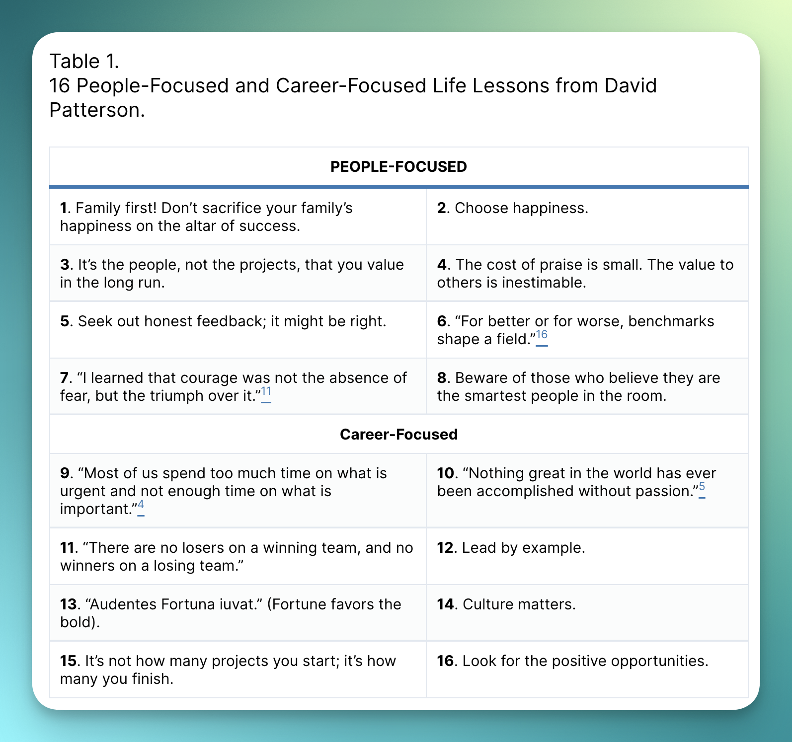
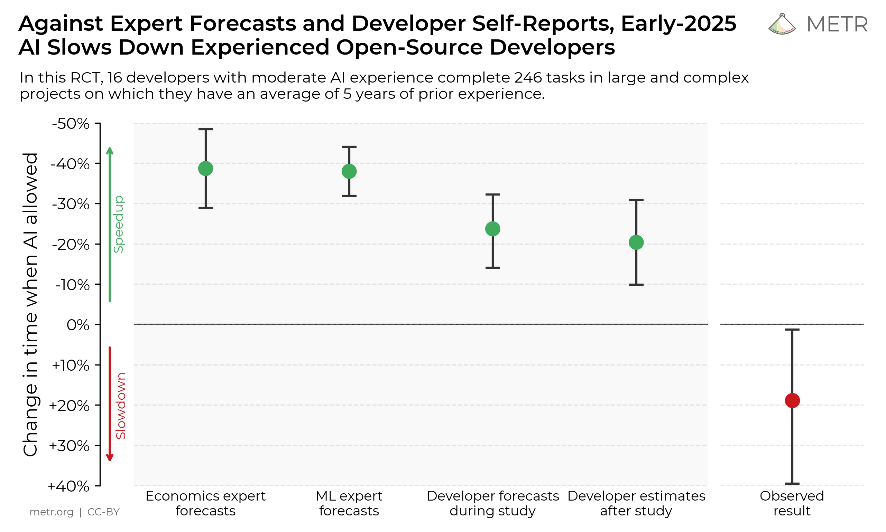

Amid the chaos of my primary jobs in training language models and keeping up with the major releases, most of what I spend my time reading can fit into a few categories of understanding:

1.  How AI companies operate,

2.  How people use AI today, and

3.  What is being solved at the cutting edge of AI tooling or training.

And, of course, I'll end this post with all the extra stuff that caught my eye.

### 1. How AI companies operate

Moonshot's [Kimi K2](https://www.interconnects.ai/p/kimi-k2-and-when-deepseek-moments) model deserved more time in the limelight. It was the first strike in a rapid-fire summer of Chinese AI models. There are a few posts I recommend on the area that I wish I could've written myself.

The first is this post from ChinaTalk, where they built on a [translated interview](https://www.chinatalk.media/p/moonshot-ais-agi-vision) with the Moonshot CEO they posted in *March*, quite ahead of the wave.

::::::::: {.embedded-post-wrap attrs="{\"id\":168585970,\"url\":\"https://www.chinatalk.media/p/kimi-k2-the-open-source-way\",\"publication_id\":4220,\"publication_name\":\"ChinaTalk\",\"publication_logo_url\":\"https://substackcdn.com/image/fetch/$s_!6mVK!,f_auto,q_auto:good,fl_progressive:steep/https%3A%2F%2Fbucketeer-e05bbc84-baa3-437e-9518-adb32be77984.s3.amazonaws.com%2Fpublic%2Fimages%2F9b5dde60-871d-48d4-9c21-e4f434b3f3c1_256x256.png\",\"title\":\"Kimi\",\"truncated_body_text\":\"An anon start-up conducting cutting-edge open-source research on China’s science, technology, and industrial ecosystems is looking for part-time China research analysts. You’ll be saving America with a firm run by someone I [Jordan] can vouch for being the literal best in the business.\",\"date\":\"2025-07-18T10:26:22.225Z\",\"like_count\":57,\"comment_count\":3,\"bylines\":[{\"id\":12682021,\"name\":\"Irene Zhang\",\"handle\":\"irenezhang\",\"previous_name\":null,\"photo_url\":\"https://substack-post-media.s3.amazonaws.com/public/images/af57f9bb-ce01-4a87-9ca9-13612d58e4d9_1168x930.png\",\"bio\":\"   \",\"profile_set_up_at\":\"2022-07-17T15:43:17.567Z\",\"reader_installed_at\":\"2022-07-19T00:59:11.253Z\",\"publicationUsers\":[{\"id\":1128679,\"user_id\":12682021,\"publication_id\":1175441,\"role\":\"admin\",\"public\":true,\"is_primary\":true,\"publication\":{\"id\":1175441,\"name\":\"Second Drafts\",\"subdomain\":\"irenezhang\",\"custom_domain\":null,\"custom_domain_optional\":false,\"hero_text\":\"no but actually, second drafts\",\"logo_url\":null,\"author_id\":12682021,\"primary_user_id\":12682021,\"theme_var_background_pop\":\"#FF5CD7\",\"created_at\":\"2022-11-05T05:32:14.398Z\",\"email_from_name\":\"Irene from Second Drafts\",\"copyright\":\"Irene Zhang\",\"founding_plan_name\":null,\"community_enabled\":true,\"invite_only\":false,\"payments_state\":\"disabled\",\"language\":null,\"explicit\":false,\"homepage_type\":\"newspaper\",\"is_personal_mode\":false}},{\"id\":952652,\"user_id\":12682021,\"publication_id\":4220,\"role\":\"contributor\",\"public\":true,\"is_primary\":false,\"publication\":{\"id\":4220,\"name\":\"ChinaTalk\",\"subdomain\":\"chinatalk\",\"custom_domain\":\"www.chinatalk.media\",\"custom_domain_optional\":false,\"hero_text\":\"Deep coverage of technology, China, and US policy. We feature original analysis alongside interviews with leading thinkers and policymakers.\",\"logo_url\":\"https://bucketeer-e05bbc84-baa3-437e-9518-adb32be77984.s3.amazonaws.com/public/images/9b5dde60-871d-48d4-9c21-e4f434b3f3c1_256x256.png\",\"author_id\":1145,\"primary_user_id\":1145,\"theme_var_background_pop\":\"#ff9900\",\"created_at\":\"2018-12-17T01:44:27.292Z\",\"email_from_name\":\"ChinaTalk\",\"copyright\":\"Jordan Schneider\",\"founding_plan_name\":\"Founding Member Plan\",\"community_enabled\":true,\"invite_only\":false,\"payments_state\":\"enabled\",\"language\":null,\"explicit\":false,\"homepage_type\":\"magaziney\",\"is_personal_mode\":false}}],\"is_guest\":false,\"bestseller_tier\":null}],\"utm_campaign\":null,\"belowTheFold\":false,\"type\":\"newsletter\",\"language\":\"en\"}" component-name="EmbeddedPostToDOM"}
{.embedded-post native="true"}

::: embedded-post-header
{.embedded-post-publication-logo}[ChinaTalk]{.embedded-post-publication-name}
:::

:::: embedded-post-title-wrapper
::: embedded-post-title
Kimi
:::
::::

::: embedded-post-body
An anon start-up conducting cutting-edge open-source research on China's science, technology, and industrial ecosystems is looking for part-time China research analysts. You'll be saving America with a firm run by someone I \[Jordan\] can vouch for being the literal best in the business...
:::

::: embedded-post-cta-wrapper
[Read more]{.embedded-post-cta}
:::

::: embedded-post-meta
a month ago · 57 likes · 3 comments · Irene Zhang
:::
:::::::::

This post digs into Moonshot's culture, features translated snippets of posts from Moonshot's own researchers on "[why they pursue the open model](https://bigeagle.me/2025/07/kimi-k2/)" or "[why they chose their architecture](https://www.kimi.com/share/d1q8l75e09n7its6e7jg)." Something good to know is that Moonshot has a very different business model than DeepSeek (self-funded hedge fund) or Qwen (backed by cloud giant Alibaba), as a venture-backed company. ChinaTalk expands on this:

> Moonshot has no B2B offerings and does not build wrapper tools for corporate users, instead focusing directly on individual customers. From the beginning, Kimi's selling point to Chinese users was its long context window, allowing users to upload dozens of documents and analyze long articles.

There's *a lot* more great stuff coming out on the Chinese AI ecosystem that can be easy to miss. Some include this post from Kevin Xu on [why China is structurally set up to win open-source AI right now](https://interconnect.substack.com/p/chinas-structural-advantage-in-open?r=68gy5&utm_medium=ios&triedRedirect=true) (an outlet I rely on for much of my learnings in this space) or this in-depth [WeChat post](https://mp.weixin.qq.com/s/Xei9vXg8j5P9waVLoGUHNQ) on the current landscape of Chinese AI companies. I'm also finishing up reading [Apple in China](https://www.amazon.com/Apple-China-Capture-Greatest-Company/dp/1668053373) and it has been utterly fantastic for understanding how the tech ecosystem works in China.

Kevin's post had a great anecdote from what the DeepSeek moment in January did *within China*, that made it clear most of us are just totally ignorant of the operations of Chinese AI companies:

> The only thing that the "DeepSeek moment" really messed with were the holiday plans of other Chinese AI labs, who were equally shocked by DeepSeek's progress. One in particular, Alibaba's AI team, apparently uttered a collective "holy sh\*t", called off everyone's holiday travel plan, stayed at the office, and slept on the floor until a competitive model was shipped.

It should be a given that they're just as motivated as their American counterparts, but it makes me wonder --- what are the key differences?

In conversations with others about this question of "how to build a good AI research center" (or, how to build [ATOM](https://www.atomproject.ai/)), I was pointed to a relevant old link, David Patterson on [How to Build a Bad Research Center](https://www2.eecs.berkeley.edu/Pubs/TechRpts/2013/EECS-2013-123.pdf) --- a fun document that lists the common failure modes of ineffective research hubs.[1](#footnote-1){#footnote-anchor-1 .footnote-anchor component-name="FootnoteAnchorToDOM" target="_self"} For anyone in research and frustrated with their job, do give it a skim and you're likely to validate yourself. You're welcome.

David Patterson has a lot of great stuff, such as his [general advice after 50 years of work](https://cacm.acm.org/opinion/life-lessons-from-the-first-half-century-of-my-career/).

### 2. How people use AI today

Coding is the most well-known, productive use case for today's language models. The weird thing with that fact is that, due to how complex the act and practice of software development is, understanding exactly what it means to effectively code well with LLMs is not that well articulated. A few weeks ago, I came across this [post](https://antirez.com/news/154) which I felt nailed it exactly right.

The post highlights a few clear examples on the sort of things LLM-assisted coding can enhance, such as learning fast or detecting bugs, but the best part was the clear advice that we can take to others who ask us:

1.  Use the right LLMs (which have been Gemini 2.5 Pro and Claude Opus 4 --- I wonder if GPT-5 makes the author's list),

2.  Provide large context --- most people don't give their tools enough information,

3.  Refuse vibe coding most of the time.

I vibe code a lot, but only for projects I will never touch again after a day or week.

This is all in contrast to the famous [METR study](https://metr.org/blog/2025-07-10-early-2025-ai-experienced-os-dev-study/) that showed many people were less productive with AI-assisted coding. I didn't comment on this because it mostly felt like it wasn't measuring comprehensively enough. I vibe code because I can make slower progress, or extra progress, without taxing my brain.

One of the developers in the study [spoke out](https://x.com/ruben_bloom/status/1943532547935473800) a bit on parts he found misleading.

This last collection for this section doesn't directly relate to which tools people are using, but rather how much people *are* using AI --- supposedly [Congress is getting more AGI-pilled](https://peterwildeford.substack.com/p/congress-has-started-taking-agi-more?r=68gy5&utm_medium=ios&triedRedirect=true). Between this, the [AI Action Plan](https://www.interconnects.ai/p/the-white-houses-plan-for-open-models), and countless people [begging OpenAI to bring back GPT-4o](https://www.thealgorithmicbridge.com/p/after-gpt-5-release-hundreds-begged) following the GPT-5 release --- we can clearly expect the coming months to keep getting weirder with respect to AI.

### 3. Tooling, techniques, and troubleshooting

This section is mostly going to be a list of places to dive in and learn more about a certain training topic. Even though most leading researchers are in closed labs now, there's still a lot of great technical work that goes under the radar. Choose what suits you, from:

-   **Long-context training**: [Arcee AI](https://www.arcee.ai/blog/extending-afm-4-5b-to-64k-context-length) and [Snowflake](https://www.snowflake.com/en/engineering-blog/arctic-long-sequence-training-multi-million-token-ai/) published blog posts on extending the context length of their models.

-   **Fixing loss spikes at pretraining**: The Marin project at Stanford [shared](https://x.com/dlwh/status/1938282073296671045) how they updated their trainer after getting feedback on socials about how "spiky" their 32B model training was.

-   **What weird fixes are needed to run new architectures in the open ecosystem**: Daniel Han of Unsloth "[fixed](https://docs.unsloth.ai/basics/gpt-oss-how-to-run-and-fine-tune#unsloth-fixes-for-gpt-oss)" ([Twitter summary](https://x.com/danielhanchen/status/1953901104150065544)) much of OpenAI's gpt-oss model. This normally involves precision or version issues, chat template misalignment, or other minor things as new architectures are getting implemented in 20+ libraries at once.

-   **The most serious experiment I've seen on a fairly unserious topic --- RL pretraining** in [avataRL](https://tokenbender.com/post.html?id=avatarl).

For some of everything, read the [SmolLM 3 report](https://huggingface.co/blog/smollm3) --- one of the open-source friends of OLMo.

### 4. Extras

There are two posts that didn't really fit into the core themes that I would still recommend.

The first is this from Sergey Levine, where he talks about how a few priors people had for scaling robotics --- like training on vast video data --- haven't been good enough to kickstart a revolution. Where modern LLMs are operating in the same domain that they're trained on, in text, robots don't have the same convenient reality, making the need for real-world data far higher.

He calls the attempted shortcuts people take in robotics:

> surrogate data, a spork that tries to get the benefits of large-scale training without the cost of large-scale in-domain data collection.

::::::::: {.embedded-post-wrap attrs="{\"id\":168829883,\"url\":\"https://sergeylevine.substack.com/p/sporks-of-agi\",\"publication_id\":1054969,\"publication_name\":\"Learning and Control\",\"publication_logo_url\":null,\"title\":\"Sporks of AGI\",\"truncated_body_text\":\"Training big models is really hard, and as the models get bigger and expand into new domains, it’s only getting harder. LLMs use lots of text data, while VLMs require data with text and images, and vision-language-action (VLA) models in robotics require lots of data of robots performing real tasks in the real world. This hits agents especially hard: whe…\",\"date\":\"2025-07-21T04:30:18.273Z\",\"like_count\":118,\"comment_count\":10,\"bylines\":[{\"id\":15583187,\"name\":\"Sergey Levine\",\"handle\":\"sergeylevine\",\"previous_name\":null,\"photo_url\":\"https://bucketeer-e05bbc84-baa3-437e-9518-adb32be77984.s3.amazonaws.com/public/images/44e4b94b-07c6-4315-ba54-38ebcd9fc9f2_355x357.png\",\"bio\":\"Sergey Levine is an Associate Professor at UC Berkeley and co-founder of Physical Intelligence. His work concerns machine learning, robotics, and other applications of learning-based decision making.\",\"profile_set_up_at\":\"2022-08-21T23:46:04.134Z\",\"reader_installed_at\":null,\"publicationUsers\":[{\"id\":1002637,\"user_id\":15583187,\"publication_id\":1054969,\"role\":\"admin\",\"public\":true,\"is_primary\":true,\"publication\":{\"id\":1054969,\"name\":\"Learning and Control\",\"subdomain\":\"sergeylevine\",\"custom_domain\":null,\"custom_domain_optional\":false,\"hero_text\":\"Machine learning for robots and robots for machine learning\",\"logo_url\":null,\"author_id\":15583187,\"primary_user_id\":15583187,\"theme_var_background_pop\":\"#D10000\",\"created_at\":\"2022-08-21T23:48:16.074Z\",\"email_from_name\":null,\"copyright\":\"Sergey Levine\",\"founding_plan_name\":null,\"community_enabled\":true,\"invite_only\":false,\"payments_state\":\"disabled\",\"language\":null,\"explicit\":false,\"homepage_type\":null,\"is_personal_mode\":false}}],\"is_guest\":false,\"bestseller_tier\":null}],\"utm_campaign\":null,\"belowTheFold\":true,\"type\":\"newsletter\",\"language\":\"en\"}" component-name="EmbeddedPostToDOM"}
{.embedded-post native="true"}

::: embedded-post-header
[Learning and Control]{.embedded-post-publication-name}
:::

:::: embedded-post-title-wrapper
::: embedded-post-title
Sporks of AGI
:::
::::

::: embedded-post-body
Training big models is really hard, and as the models get bigger and expand into new domains, it's only getting harder. LLMs use lots of text data, while VLMs require data with text and images, and vision-language-action (VLA) models in robotics require lots of data of robots performing real tasks in the real world. This hits agents especially hard: whe...
:::

::: embedded-post-cta-wrapper
[Read more]{.embedded-post-cta}
:::

::: embedded-post-meta
a month ago · 118 likes · 10 comments · Sergey Levine
:::
:::::::::

The second is a piece by Ben Recht in partial response to my first post on The American DeepSeek Project. This was a feel-good read for me --- if you've been fighting the same fight as me in search of more openness, or have considered it, I suggest giving it a read.

::::::::: {.embedded-post-wrap attrs="{\"id\":167992762,\"url\":\"https://www.argmin.net/p/an-open-mindset\",\"publication_id\":1255585,\"publication_name\":\"arg min\",\"publication_logo_url\":\"https://substackcdn.com/image/fetch/$s_!MpqK!,f_auto,q_auto:good,fl_progressive:steep/https%3A%2F%2Fbucketeer-e05bbc84-baa3-437e-9518-adb32be77984.s3.amazonaws.com%2Fpublic%2Fimages%2F5ecc065f-b4b4-488f-9ff9-d842d175475d_256x256.png\",\"title\":\"An open mindset\",\"truncated_body_text\":\"Over the 4th of July weekend, Nathan Lambert wrote a thoughtful post on “an American Deepseek Project,” posing the challenge of building a fully open, fully performant “frontier model” in the next two years. Deepseek, in case you’ve already forgotten, is a Chinese company that released a highly performing, open-source large language model chatbot in Jan…\",\"date\":\"2025-07-10T13:59:06.465Z\",\"like_count\":39,\"comment_count\":7,\"bylines\":[{\"id\":42335610,\"name\":\"Ben Recht\",\"handle\":\"beenwrekt\",\"previous_name\":null,\"photo_url\":\"https://substack-post-media.s3.amazonaws.com/public/images/e4fe8c66-4c77-4977-b2aa-e29961f3b4fe_300x300.jpeg\",\"bio\":\"Ben is a Professor of Electrical Engineering and Computer Sciences at the University of California, Berkeley.\",\"profile_set_up_at\":\"2022-10-15T16:54:21.761Z\",\"reader_installed_at\":\"2023-10-11T15:04:28.530Z\",\"publicationUsers\":[{\"id\":1212827,\"user_id\":42335610,\"publication_id\":1255585,\"role\":\"admin\",\"public\":true,\"is_primary\":true,\"publication\":{\"id\":1255585,\"name\":\"arg min\",\"subdomain\":\"argmin\",\"custom_domain\":\"www.argmin.net\",\"custom_domain_optional\":false,\"hero_text\":\"arg min: a blog of minimum value. on the history, foundations, and validity of \\\"optimally\\\" automated decision making.\",\"logo_url\":\"https://bucketeer-e05bbc84-baa3-437e-9518-adb32be77984.s3.amazonaws.com/public/images/5ecc065f-b4b4-488f-9ff9-d842d175475d_256x256.png\",\"author_id\":42335610,\"primary_user_id\":42335610,\"theme_var_background_pop\":\"#25BD65\",\"created_at\":\"2022-12-21T02:28:39.839Z\",\"email_from_name\":null,\"copyright\":\"Ben Recht\",\"founding_plan_name\":\"Founding Member\",\"community_enabled\":true,\"invite_only\":false,\"payments_state\":\"paused\",\"language\":null,\"explicit\":false,\"homepage_type\":\"newspaper\",\"is_personal_mode\":false}}],\"twitter_screen_name\":\"beenwrekt\",\"is_guest\":false,\"bestseller_tier\":null}],\"utm_campaign\":null,\"belowTheFold\":true,\"type\":\"newsletter\",\"language\":\"en\"}" component-name="EmbeddedPostToDOM"}
{.embedded-post native="true"}

::: embedded-post-header
{.embedded-post-publication-logo loading="lazy"}[arg min]{.embedded-post-publication-name}
:::

:::: embedded-post-title-wrapper
::: embedded-post-title
An open mindset
:::
::::

::: embedded-post-body
Over the 4th of July weekend, Nathan Lambert wrote a thoughtful post on "an American Deepseek Project," posing the challenge of building a fully open, fully performant "frontier model" in the next two years. Deepseek, in case you've already forgotten, is a Chinese company that released a highly performing, open-source large language model chatbot in Jan...
:::

::: embedded-post-cta-wrapper
[Read more]{.embedded-post-cta}
:::

::: embedded-post-meta
a month ago · 39 likes · 7 comments · Ben Recht
:::
:::::::::

Enjoy! Let me know if I missed any hidden gems.

::::::::::: {.footnote component-name="FootnoteToDOM"}
[1](#footnote-anchor-1){#footnote-1 .footnote-number contenteditable="false" target="_self"}

:::::::::: footnote-content
Very related to this ongoing series on the failings of the Alan Turning Institute:

::::::::: {.embedded-post-wrap attrs="{\"id\":168213230,\"url\":\"https://www.chalmermagne.com/p/how-not-to-fix-an-ai-institute\",\"publication_id\":3159216,\"publication_name\":\"Chalmermagne \",\"publication_logo_url\":\"https://substackcdn.com/image/fetch/$s_!NqGX!,f_auto,q_auto:good,fl_progressive:steep/https%3A%2F%2Fsubstack-post-media.s3.amazonaws.com%2Fpublic%2Fimages%2Fa8ac346e-8eea-4f52-9fff-2260791fb73b_1024x1024.png\",\"title\":\"How not to fix an AI institute\",\"truncated_body_text\":\"Introduction\",\"date\":\"2025-07-14T08:32:29.760Z\",\"like_count\":24,\"comment_count\":3,\"bylines\":[{\"id\":17787335,\"name\":\"Alex Chalmers\",\"handle\":\"chalmermagne\",\"previous_name\":\"AJC\",\"photo_url\":\"https://substackcdn.com/image/fetch/f_auto,q_auto:good,fl_progressive:steep/https%3A%2F%2Fsubstack-post-media.s3.amazonaws.com%2Fpublic%2Fimages%2F37cc7494-5020-443d-97de-7da8516c0bf7_800x800.jpeg\",\"bio\":\"Technology, finance, policy. \\\"teenager with a blog\\\".\",\"profile_set_up_at\":\"2022-03-18T21:12:19.519Z\",\"reader_installed_at\":\"2022-03-18T21:11:25.868Z\",\"publicationUsers\":[{\"id\":3216497,\"user_id\":17787335,\"publication_id\":3159216,\"role\":\"admin\",\"public\":true,\"is_primary\":true,\"publication\":{\"id\":3159216,\"name\":\"Chalmermagne \",\"subdomain\":\"chalmermagne\",\"custom_domain\":\"www.chalmermagne.com\",\"custom_domain_optional\":false,\"hero_text\":\"Systems, markets, technology \",\"logo_url\":\"https://substack-post-media.s3.amazonaws.com/public/images/a8ac346e-8eea-4f52-9fff-2260791fb73b_1024x1024.png\",\"author_id\":17787335,\"primary_user_id\":17787335,\"theme_var_background_pop\":\"#FF6719\",\"created_at\":\"2024-10-12T17:42:06.224Z\",\"email_from_name\":\"Chalmermagne \",\"copyright\":\"Alex Chalmers\",\"founding_plan_name\":null,\"community_enabled\":true,\"invite_only\":false,\"payments_state\":\"disabled\",\"language\":null,\"explicit\":false,\"homepage_type\":\"newspaper\",\"is_personal_mode\":false}},{\"id\":4581714,\"user_id\":17787335,\"publication_id\":90387,\"role\":\"admin\",\"public\":true,\"is_primary\":false,\"publication\":{\"id\":90387,\"name\":\"The Works in Progress Newsletter\",\"subdomain\":\"worksinprogress\",\"custom_domain\":\"www.worksinprogress.news\",\"custom_domain_optional\":false,\"hero_text\":\"New and underrated ideas to improve the world. Visit our website: worksinprogress.co\",\"logo_url\":\"https://substack-post-media.s3.amazonaws.com/public/images/6f5bf141-f845-48a4-a1d6-fb74f26daec9_1280x1280.png\",\"author_id\":15759190,\"primary_user_id\":15759190,\"theme_var_background_pop\":\"#00C2FF\",\"created_at\":\"2020-09-02T03:51:44.742Z\",\"email_from_name\":\"Works in Progress\",\"copyright\":\"Works in Progress\",\"founding_plan_name\":null,\"community_enabled\":true,\"invite_only\":false,\"payments_state\":\"disabled\",\"language\":null,\"explicit\":false,\"homepage_type\":\"magaziney\",\"is_personal_mode\":false}}],\"is_guest\":false,\"bestseller_tier\":null}],\"utm_campaign\":null,\"belowTheFold\":true,\"type\":\"newsletter\",\"language\":\"en\"}" component-name="EmbeddedPostToDOM"}
{.embedded-post native="true"}

::: embedded-post-header
{.embedded-post-publication-logo loading="lazy"}[Chalmermagne ]{.embedded-post-publication-name}
:::

:::: embedded-post-title-wrapper
::: embedded-post-title
How not to fix an AI institute
:::
::::

::: embedded-post-body
Introduction...
:::

::: embedded-post-cta-wrapper
[Read more]{.embedded-post-cta}
:::

::: embedded-post-meta
a month ago · 24 likes · 3 comments · Alex Chalmers
:::
:::::::::
::::::::::
:::::::::::
